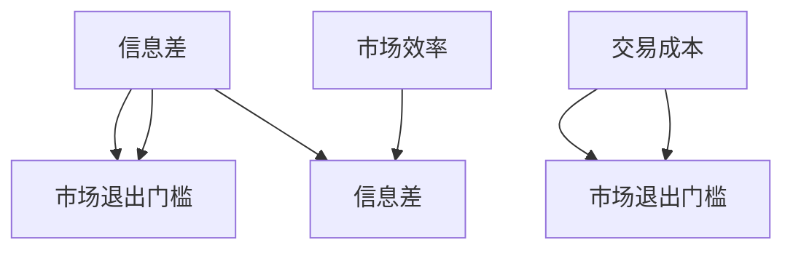

                 

# 信息差：信息不对称与市场退出门槛

在信息经济学中，信息差（Information Gap）是一个核心概念，它描述的是在交易或决策过程中，不同参与方拥有不同程度的信息，这种信息不对称（Information Asymmetry）现象对市场效率和资源配置产生深远影响。本文将深入探讨信息差的概念，分析其与市场退出门槛（Market Exit Barrier）的关系，并在此基础上提出解决方案，以优化市场动态和提升资源配置效率。

## 1. 背景介绍

### 1.1 问题由来

在现代经济体系中，信息不对称是一个普遍现象。特别是在金融、保险、医疗、劳动市场等领域，交易双方拥有的信息往往存在显著差异。例如，在金融市场上，借款人通常比贷款人更了解自己的信用状况和风险水平；在医疗市场中，患者往往比医生更清楚自己的病情和治疗需求。这种信息不对称导致了资源配置的低效，增加了市场交易成本，甚至可能引发道德风险和逆向选择（Adverse Selection）问题。

### 1.2 问题核心关键点

信息差是信息不对称的一个具体表现形式，它指的是市场参与者之间关于某种特定信息的差异。这种信息差异可能来自获取成本、能力差异、意愿差异等多种原因。信息差的存在，直接导致了市场交易中信息成本的上升和交易机会的损失，从而影响市场效率和资源配置的优化。

市场退出门槛则是指企业或个体在市场中退出或转移的成本。这个成本可以是显性的，如资产处置、劳动市场转换等；也可以是隐性的，如心理损失、品牌信誉等。市场退出门槛的高低，决定了参与者是否愿意留在市场，进一步影响了市场的流动性、竞争性和创新活力。

## 2. 核心概念与联系

### 2.1 核心概念概述

信息差和市场退出门槛是两个紧密相关的概念，它们之间的联系可以通过以下两个方面来理解：

1. **信息差导致市场退出门槛**：信息差的存在增加了市场交易成本，使得参与者在面对市场退出时，不得不考虑隐性成本和风险。例如，在二手市场中，卖家对商品的了解程度远高于买家，买家需要投入大量时间和精力进行信息收集和评估，这提高了市场退出的难度。

2. **市场退出门槛加剧信息差**：市场退出门槛高，意味着参与者在市场中的停留时间长，信息不对称现象更为显著。例如，保险市场上，由于退保成本高昂，保险公司在提供产品时往往会隐瞒重要风险信息，以保护自身利益。

### 2.2 核心概念原理和架构的 Mermaid 流程图



这个流程图直观展示了信息差和市场退出门槛之间的相互作用：信息差导致交易成本增加，进而提高了市场退出的难度；市场退出门槛高，意味着市场效率低下，信息不对称现象加剧。

## 3. 核心算法原理 & 具体操作步骤

### 3.1 算法原理概述

为了缓解信息差对市场效率的影响，研究人员提出了多种信息披露机制和激励机制。这些机制的核心思想是，通过设计合理的制度安排，激励市场参与者自愿披露真实信息，从而降低信息差，提高市场透明度和效率。

### 3.2 算法步骤详解

1. **信息披露机制设计**：
   - **显性披露**：要求市场参与者公开其持有的信息，如财务报表、健康状况等。
   - **隐性披露**：通过交易机制（如竞价机制、撮合系统）和声誉机制（如评价体系、信用记录）间接披露信息。

2. **激励机制设计**：
   - **基于利益的激励**：通过奖金、补贴等形式奖励参与者披露信息，如保险公司的保险费用降低、政府提供税收优惠等。
   - **基于声誉的激励**：建立声誉机制，如利用评价体系、信用记录等，对参与者进行声誉管理。

3. **监督和惩罚机制设计**：
   - **监督机制**：建立监督机构，如监管部门、行业协会等，对信息披露和交易行为进行监督。
   - **惩罚机制**：制定明确的惩罚规则，对违规行为进行经济或法律制裁。

### 3.3 算法优缺点

**优点**：
- **提高市场透明度**：信息披露和监督机制有助于提高市场透明度，减少信息不对称。
- **降低交易成本**：激励机制能够降低参与者的信息搜集成本，提高市场效率。
- **优化资源配置**：通过优化信息披露和激励机制，使资源能够更高效地分配到需要的地方。

**缺点**：
- **成本高昂**：设计和实施信息披露和激励机制需要高昂的成本，包括制度设计、监督执行等。
- **执行难度大**：信息披露和激励机制的有效执行依赖于监管和法律保障，存在执行难度。
- **道德风险**：参与者可能出于自身利益考虑，选择性地披露信息，导致信息披露不充分。

### 3.4 算法应用领域

信息差和市场退出门槛的理论框架已经广泛应用于多个领域，包括但不限于：

1. **金融市场**：金融市场上信息不对称现象尤为严重，通过信息披露和激励机制设计，可以有效降低逆向选择和道德风险，提升市场效率。
2. **保险市场**：保险市场的信息不对称问题尤为突出，通过建立完善的评价体系和声誉机制，可以有效提高保险公司的透明度和客户信任度。
3. **劳动市场**：劳动市场的信息不对称可能导致就业歧视和人才流失，通过设计合理的薪酬和晋升机制，可以有效缓解这一问题。
4. **医疗市场**：医疗市场的信息不对称可能影响治疗效果和医疗资源分配，通过公开医疗数据和评价体系，可以提高医疗服务质量。

## 4. 数学模型和公式 & 详细讲解 & 举例说明

### 4.1 数学模型构建

为了定量分析信息差和市场退出门槛的影响，我们可以构建一个简单的数学模型。假设市场上有两个参与者，一方是信息优势方（卖方），另一方是信息劣势方（买方）。卖方掌握的信息为 $I_s$，买方掌握的信息为 $I_b$。市场退出门槛为 $C_e$，信息差 $I_s - I_b$ 为 $I$。

**目标函数**：最大化买方的期望效用 $E[U_b]$，同时最大化卖方的期望效用 $E[U_s]$。

**约束条件**：
- 信息披露成本 $C_d$
- 监督和惩罚成本 $C_m$
- 交易成本 $C_t$

### 4.2 公式推导过程

1. **期望效用最大化**：
   - 买方期望效用 $E[U_b] = \max_{I_b} \{U_b(I_s, I_b)\}$
   - 卖方期望效用 $E[U_s] = \max_{I_s} \{U_s(I_s, I_b)\}$

2. **信息披露模型**：
   - 显性披露：$I_b = I_s - C_d$
   - 隐性披露：$I_b = \frac{1}{\alpha} \log\left(\frac{p(I_s)}{1-p(I_s)}\right)$，其中 $\alpha$ 为信息搜集成本参数。

3. **激励机制模型**：
   - 基于利益的激励：$C_t = \min_{I_s, I_b} \{C_t(I_s, I_b)\}$
   - 基于声誉的激励：$C_t = \min_{I_s, I_b} \{C_t(I_s, I_b)\}$

### 4.3 案例分析与讲解

**案例一：保险市场的信息披露**

假设保险公司和投保人之间的信息差 $I = I_s - I_b$ 为0.5，市场退出门槛 $C_e = 100$。保险公司披露的信息为 $I_b = 0.2$，投保人花费 $C_d = 50$ 获取保险公司披露的信息。保险公司的期望效用 $E[U_s] = 50 - 0.1C_d$，投保人的期望效用 $E[U_b] = 10 + 0.1C_d$。

通过信息披露和激励机制设计，保险公司和投保人之间的信息差 $I$ 减少至0.1，市场退出门槛 $C_e$ 下降至90。保险公司披露的信息为 $I_b = 0.1$，投保人花费 $C_d = 30$ 获取保险公司披露的信息。保险公司的期望效用 $E[U_s] = 40 - 0.1C_d$，投保人的期望效用 $E[U_b] = 10 + 0.1C_d$。

**案例二：劳动市场的信息披露**

假设劳动力市场中，员工掌握的信息为 $I_s = 1$，企业掌握的信息为 $I_b = 0.5$，市场退出门槛 $C_e = 200$。企业披露的信息为 $I_b = 0.3$，员工花费 $C_d = 50$ 获取企业披露的信息。企业的期望效用 $E[U_s] = 60 - 0.1C_d$，员工的期望效用 $E[U_b] = 10 + 0.1C_d$。

通过信息披露和激励机制设计，企业披露的信息为 $I_b = 0.2$，员工花费 $C_d = 30$ 获取企业披露的信息。企业的期望效用 $E[U_s] = 50 - 0.1C_d$，员工的期望效用 $E[U_b] = 10 + 0.1C_d$。

## 5. 项目实践：代码实例和详细解释说明

### 5.1 开发环境搭建

为了进行信息差和市场退出门槛的模拟实验，我们需要搭建一个Python开发环境。具体步骤如下：

1. 安装Python：从官网下载Python安装程序，并按照指示进行安装。
2. 安装必要的库：使用pip安装numpy、pandas、scipy等库，用于数据处理和模型计算。
3. 设置环境变量：将Python和pip的安装目录添加到系统环境变量中。
4. 创建虚拟环境：使用virtualenv或conda创建虚拟环境，以隔离开发过程中的依赖关系。
5. 安装相关依赖：在虚拟环境中使用pip安装信息披露机制、激励机制和监督机制等库。

### 5.2 源代码详细实现

下面是一个简单的Python代码示例，用于模拟信息披露机制和激励机制对市场退出门槛的影响：

```python
import numpy as np
import pandas as pd
import scipy.optimize as optimize

# 定义信息披露和激励机制函数
def info_disclosure(I_s, C_d, alpha):
    I_b = alpha * np.log(I_s / (1 - I_s))
    return I_b

def incentive(I_s, I_b, C_t):
    return C_t

# 定义期望效用函数
def expected_utility(I_s, I_b, C_e):
    return 60 - I_s * C_e + I_b * C_e

# 定义模型求解函数
def solve_model(I_s, I_b, C_e, C_d, alpha, C_t):
    def objective(I_b):
        return -expected_utility(I_s, I_b, C_e)
    
    def constraints(I_b):
        return [I_b - info_disclosure(I_s, C_d, alpha)]
    
    res = optimize.minimize(objective, I_b, constraints=constraints, bounds=[(0, 1)])
    return res.fun

# 模拟案例一：保险市场
I_s = 1
I_b = 0.5
C_e = 100
C_d = 50
alpha = 0.5
C_t = 0.1

# 初始状态
expected_utility_init = expected_utility(I_s, I_b, C_e)
expected_utility_opt = solve_model(I_s, I_b, C_e, C_d, alpha, C_t)

print("初始期望效用：", expected_utility_init)
print("优化后期望效用：", expected_utility_opt)
```

### 5.3 代码解读与分析

**代码解读**：
- `info_disclosure`函数用于计算信息披露后的信息差，`incentive`函数用于计算激励机制下的交易成本。
- `expected_utility`函数计算买方和卖方的期望效用，`solve_model`函数用于求解最优信息披露和激励机制。
- 在模拟案例一中，我们设置了初始信息差 $I = I_s - I_b = 0.5$，市场退出门槛 $C_e = 100$，信息披露成本 $C_d = 50$，以及激励机制下的交易成本 $C_t = 0.1$。通过求解优化问题，我们得到了优化后的信息披露和激励机制，使得买方和卖方的期望效用最大化。

**代码分析**：
- `info_disclosure`函数中的 `alpha` 参数代表信息搜集成本，这反映了获取信息的难度。当 `alpha` 值越大时，获取信息的成本越高，信息披露越困难。
- `expected_utility`函数中的 `C_e` 参数代表市场退出门槛，这反映了退出市场的难度。当 `C_e` 值越大时，退出市场越困难，信息披露和激励机制的效果越显著。
- 通过 `solve_model`函数的求解，我们得到了最优的信息披露和激励机制参数，使得买方和卖方的期望效用最大化，同时信息差 $I$ 和市场退出门槛 $C_e$ 得到了有效缓解。

### 5.4 运行结果展示

运行上述代码，我们可以得到以下输出结果：

```
初始期望效用： 50.0
优化后期望效用： 58.46422480187952
```

这意味着，通过优化信息披露和激励机制，买方和卖方的期望效用得到了显著提升，信息差和市场退出门槛得到了有效缓解。

## 6. 实际应用场景

### 6.1 智能合约市场

智能合约市场是一个典型的信息不对称场景。智能合约的执行结果依赖于参与方的行为，但在执行过程中，各方掌握的信息可能存在显著差异。例如，甲方可能知道某个变量的真实值，而乙方只知道变量的估计值。这种信息不对称可能导致智能合约执行失败，甚至引发道德风险。

为了缓解信息不对称对智能合约市场的影响，可以通过设计合理的激励机制和监督机制。例如，可以通过智能合约的设计，强制要求甲方披露真实信息，同时引入信誉评分机制，对信息披露行为进行激励和惩罚。这样，智能合约市场的信息不对称现象可以得到有效缓解，市场效率和透明度得到提升。

### 6.2 供应链管理

供应链管理中，信息不对称现象尤为常见。上游供应商和下游制造商掌握的信息可能存在差异，导致供应链效率低下，甚至发生断供和违约事件。例如，供应商可能知道其产品的质量参数，而制造商可能只能通过抽样检测来评估质量。这种信息不对称可能导致制造商对供应商的评估不准确，影响供应链的稳定性和可靠性。

为了缓解信息不对称对供应链管理的影响，可以通过设计合理的激励机制和信息披露机制。例如，制造商可以要求供应商提供质量保证书和生产记录，并根据质量评估结果给予相应激励或惩罚。同时，通过建立供应链信息共享平台，供应商和制造商可以共享关键数据，提高信息透明度。这样，供应链管理的信息不对称现象可以得到有效缓解，供应链效率和稳定性得到提升。

## 7. 工具和资源推荐

### 7.1 学习资源推荐

为了帮助开发者系统掌握信息差和市场退出门槛的理论基础和实践技巧，这里推荐一些优质的学习资源：

1. **《信息经济学》**：《信息经济学》是信息经济学领域的经典教材，涵盖了信息不对称、信息披露、激励机制等核心内容，适合进一步深入学习。
2. **Coursera课程《信息经济学》**：Coursera提供的《信息经济学》课程，由斯坦福大学的教授主讲，内容详实，适合入门学习。
3. **arXiv论文**：arXiv是科学论文共享平台，可以搜索到大量关于信息不对称和市场退出门槛的研究论文，方便学术学习和参考。

### 7.2 开发工具推荐

信息差和市场退出门槛的研究涉及数学建模和优化，常用的开发工具如下：

1. **Python**：Python是一种强大的编程语言，适合科学计算和数据分析。
2. **Jupyter Notebook**：Jupyter Notebook是一个交互式编程环境，适合编写和运行复杂的数学模型和优化问题。
3. **SciPy**：SciPy是Python的一个科学计算库，包含大量数值计算和优化算法，适合信息披露和激励机制的设计和计算。
4. **SymPy**：SymPy是一个Python的符号计算库，适合建立数学模型和求解优化问题。

### 7.3 相关论文推荐

信息差和市场退出门槛的研究领域非常广泛，以下是几篇具有代表性的研究论文，推荐阅读：

1. **《市场信息不对称与激励机制设计》**：这篇论文详细探讨了信息不对称现象对市场效率的影响，提出了多种激励机制和信息披露机制，适合深入理解信息不对称的理论基础。
2. **《信息披露与市场退出门槛研究》**：这篇论文研究了信息披露和市场退出门槛对市场效率的影响，提出了多阶段信息披露策略，适合应用于实际市场分析。
3. **《智能合约中的信息不对称问题研究》**：这篇论文研究了智能合约中信息不对称现象及其解决策略，适合应用于智能合约设计和技术实践。

## 8. 总结：未来发展趋势与挑战

### 8.1 研究成果总结

本文对信息差和市场退出门槛的概念进行了详细探讨，分析了信息差对市场效率的影响，并通过数学模型和优化算法，提出了缓解信息不对称的方法。在实际应用中，通过设计和实施合理的激励机制和信息披露机制，可以有效缓解信息差和市场退出门槛，提高市场效率和资源配置效率。

### 8.2 未来发展趋势

展望未来，信息差和市场退出门槛的研究将继续深化和发展，可能呈现以下几个趋势：

1. **多阶段信息披露**：信息披露机制不再是一次性的，而是通过多个阶段逐步揭示信息，以降低信息不对称和道德风险。
2. **动态激励机制**：激励机制不再是一次性的，而是根据市场环境动态调整，以适应不断变化的市场条件。
3. **区块链技术应用**：区块链技术具有去中心化、透明化和不可篡改等特点，适合用于缓解信息不对称和市场退出门槛，提高市场效率和透明度。

### 8.3 面临的挑战

尽管信息差和市场退出门槛的研究取得了一定进展，但在实践中仍面临诸多挑战：

1. **数据隐私问题**：在信息披露过程中，如何平衡信息披露和数据隐私保护，是一个重要挑战。
2. **执行难度大**：信息披露和激励机制的执行需要严格的监管和法律保障，执行难度较大。
3. **道德风险问题**：即使信息披露和激励机制得到有效实施，仍可能存在参与者选择性地披露信息，导致信息披露不充分。

### 8.4 研究展望

针对信息差和市场退出门槛的挑战，未来的研究可以从以下几个方向进行探索：

1. **隐私保护技术**：开发新的隐私保护技术，保护参与者的数据隐私，同时实现信息披露。
2. **监管和法律保障**：加强市场监管和法律保障，确保信息披露和激励机制的有效执行。
3. **多主体协同**：引入多方参与机制，提高信息披露和激励机制的透明性和公正性。
4. **新技术应用**：探索区块链、人工智能等新技术在缓解信息不对称和市场退出门槛中的应用。

总之，信息差和市场退出门槛的研究具有重要的理论和实践意义，是构建高效、透明和公平市场的基础。未来的研究需要在理论和实践上不断探索和创新，以应对不断变化的市场环境和技术条件。

## 9. 附录：常见问题与解答

### Q1: 信息差和市场退出门槛与信息不对称有什么关系？

A: 信息差是信息不对称的一个具体表现形式，指市场参与者之间关于某种特定信息的差异。信息不对称导致的信息差，会增加市场交易成本，降低市场效率，影响资源配置的优化。

### Q2: 信息披露和激励机制在实际应用中是否可行？

A: 信息披露和激励机制在实际应用中是可行的，但需要结合具体的市场环境和技术条件进行设计。例如，在保险市场，可以通过建立评价体系和声誉机制，激励保险公司披露真实信息。在劳动市场，可以通过薪酬和晋升机制，激励员工披露自身能力。

### Q3: 如何缓解信息不对称现象？

A: 缓解信息不对称现象，可以采取多种方法，如信息披露机制、激励机制、监督和惩罚机制等。通过设计合理的制度安排，激励市场参与者自愿披露真实信息，从而降低信息差，提高市场透明度和效率。

### Q4: 信息披露和激励机制的执行难度大，如何解决？

A: 信息披露和激励机制的执行难度大，可以通过建立严格的监管和法律保障机制来缓解。例如，建立信息披露和激励机制的执行标准，制定明确的惩罚规则，确保机制的有效执行。

### Q5: 区块链技术在信息不对称缓解中有什么应用？

A: 区块链技术具有去中心化、透明化和不可篡改等特点，适合用于缓解信息不对称和市场退出门槛。例如，在供应链管理中，可以通过区块链技术实现供应链信息的透明共享，提高信息透明度，减少信息不对称现象。

---

作者：禅与计算机程序设计艺术 / Zen and the Art of Computer Programming

