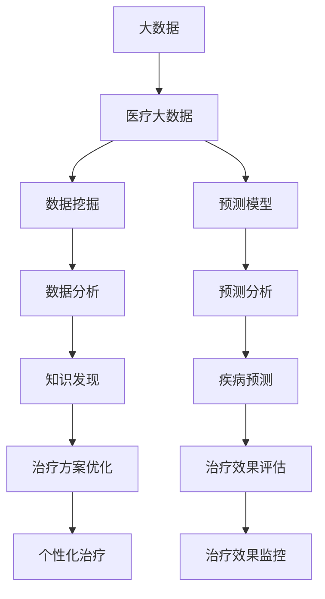

                 

# 信息差：大数据在医疗行业的应用

## 1. 背景介绍

### 1.1 问题由来

随着互联网技术的发展，大数据正在深刻地改变着各行各业的面貌。医疗行业也不例外。作为人们健康的守护者，医疗机构面临的是不断增长的病患人数和不断变化的疾病类型，同时还要应对资源配置的不均衡和医疗知识的不普及等问题。在这一背景下，大数据在医疗行业的应用显得尤为重要。

### 1.2 问题核心关键点

大数据在医疗行业的应用，旨在通过数据挖掘、分析和预测等手段，提升医疗服务水平和效率，改善患者治疗体验。核心在于如何高效地利用数据，实现信息的精准匹配，从而减小信息差，提升医疗质量。

## 2. 核心概念与联系

### 2.1 核心概念概述

为更好地理解大数据在医疗行业的应用，本节将介绍几个密切相关的核心概念：

- **大数据**：指在传统数据处理应用软硬件环境下难于获取、管理、处理的数据集合，通常以PB级数据量为特征。大数据的核心是处理速度快、处理复杂、容量大、质量高。

- **医疗大数据**：指来源于医疗行业各个环节，包括电子病历、医疗影像、基因数据、患者行为数据等各类数据。医疗大数据有助于提高诊断准确性、优化治疗方案、预测疾病趋势等。

- **数据挖掘**：指从原始数据中提取出有用信息，挖掘出有价值的模式、规律和知识的过程。数据挖掘是医疗大数据应用的核心技术之一。

- **预测模型**：指基于历史数据和统计规律构建的模型，用于预测未来事件。医疗预测模型可以辅助医生进行疾病预测、治疗效果评估等工作。

- **可视化**：指将数据和分析结果以图形或动画等形式展现出来，便于理解和决策。医疗数据可视化有助于发现隐藏的模式和异常，辅助医生制定决策。

这些核心概念之间的逻辑关系可以通过以下Mermaid流程图来展示：



这个流程图展示了大数据在医疗行业的应用流程：

1. 从大数据中提取医疗大数据。
2. 通过数据挖掘和预测模型，分析医疗大数据。
3. 基于分析结果，进行知识发现和预测分析，辅助医生进行决策。
4. 通过预测模型和数据分析，优化治疗方案，预测疾病趋势，进行治疗效果评估和监控。

## 3. 核心算法原理 & 具体操作步骤
### 3.1 算法原理概述

大数据在医疗行业的应用，主要通过数据挖掘、预测模型和可视化等技术，实现信息的精准匹配和优化。其核心思想是：通过分析医疗大数据，挖掘出有用的知识，构建预测模型，从而实现对未来事件的预测和决策支持。

形式化地，假设医疗大数据为 $D=\{d_i\}_{i=1}^N$，其中 $d_i$ 为第 $i$ 个患者的医疗记录。定义目标任务为 $T$，如疾病预测、治疗效果评估等。医疗大数据的应用流程可以表示为：

$$
\text{BigDataToMedical}(D, T) = \text{DataMining}(D) + \text{PredictiveModeling}(D)
$$

其中，DataMining和PredictiveModeling分别表示数据挖掘和预测模型构建过程。

### 3.2 算法步骤详解

大数据在医疗行业的应用，主要包括以下几个关键步骤：

**Step 1: 数据采集和预处理**

- 收集医疗行业中的各类数据，包括电子病历、医疗影像、基因数据、患者行为数据等。
- 对采集到的数据进行清洗、去噪、标准化等预处理，保证数据的准确性和可用性。

**Step 2: 数据挖掘和特征提取**

- 应用数据挖掘技术，从医疗大数据中挖掘出有价值的信息。常见的数据挖掘技术包括分类、聚类、关联规则挖掘等。
- 提取和构造特征，将非结构化数据转化为结构化数据，供后续分析使用。

**Step 3: 预测模型构建和训练**

- 根据具体任务，选择和构建合适的预测模型，如线性回归、决策树、神经网络等。
- 在预处理后的数据上，训练预测模型，并使用交叉验证等技术评估模型性能。

**Step 4: 模型评估和应用**

- 在测试集上评估模型的泛化能力，确保模型在不同数据集上的一致性。
- 应用模型于实际医疗场景中，进行疾病预测、治疗效果评估等任务。

**Step 5: 可视化结果展示**

- 将模型的预测结果和分析结果，通过图形、图表等方式进行可视化展示。
- 结合专家知识，进行决策支持和问题解决。

以上是使用大数据在医疗行业的应用的一般流程。在实际应用中，还需要针对具体任务的特点，对各个环节进行优化设计，如选择更合适的数据挖掘技术、构造更有效的特征、选择更适用的预测模型等，以进一步提升模型性能。

### 3.3 算法优缺点

大数据在医疗行业的应用具有以下优点：

1. **数据量大、覆盖广**：医疗大数据能够提供更全面、更丰富的信息，有助于更准确地诊断和治疗疾病。
2. **多模态数据融合**：能够整合结构化、半结构化、非结构化数据，提供更全面的分析视角。
3. **辅助决策支持**：基于预测模型和数据挖掘结果，提供决策支持，提高医疗服务的质量和效率。
4. **预测能力**：通过分析历史数据，预测未来趋势，提前采取干预措施，降低医疗风险。

同时，该方法也存在一定的局限性：

1. **数据质量问题**：医疗数据的采集和预处理环节，可能会存在数据缺失、噪音等问题，影响分析结果的准确性。
2. **隐私和安全**：医疗数据涉及个人隐私和敏感信息，需要严格的隐私保护和安全措施。
3. **技术和资源需求高**：大数据应用需要高水平的技术能力和丰富的计算资源，对医疗机构的IT基础设施要求较高。
4. **知识更新快**：医疗知识更新速度快，模型需要不断迭代和更新，以适应新的临床需求。

尽管存在这些局限性，但就目前而言，大数据在医疗行业的应用已经展示出强大的潜力，正在逐步改变医疗服务的模式和流程。

### 3.4 算法应用领域

大数据在医疗行业的应用，主要集中在以下几个领域：

- **疾病预测与诊断**：利用历史数据和机器学习模型，预测患者未来可能的疾病，提前采取干预措施。
- **治疗效果评估**：通过分析治疗后的病患数据，评估治疗方案的效果和安全性，优化治疗方案。
- **个性化治疗**：基于患者的基因信息和生活习惯，构建个性化治疗方案，提升治疗效果。
- **健康管理**：通过实时监测患者的生理数据和行为数据，提供健康管理建议，预防疾病发生。
- **医疗资源优化**：分析医院和医生的资源配置，优化医疗资源的分配和利用，提高医疗效率。

除了上述这些经典应用外，大数据还在药物研发、临床试验、医疗影像分析等多个领域得到了广泛的应用，为医疗行业的数字化转型提供了新的动力。

## 4. 数学模型和公式 & 详细讲解  
### 4.1 数学模型构建

本节将使用数学语言对大数据在医疗行业的应用进行更加严格的刻画。

记医疗大数据为 $D=\{d_i\}_{i=1}^N$，其中 $d_i$ 为第 $i$ 个患者的医疗记录。目标任务为 $T$，如疾病预测、治疗效果评估等。大数据在医疗行业的应用模型可以表示为：

$$
\text{Model}(D, T) = \text{DataMining}(D) + \text{PredictiveModeling}(D)
$$

其中，DataMining和PredictiveModeling分别表示数据挖掘和预测模型构建过程。

### 4.2 公式推导过程

以下我们以疾病预测任务为例，推导线性回归模型的训练公式。

假设预测变量为 $y$，输入特征为 $X$，模型为 $M$，训练数据集为 $D=\{(x_i,y_i)\}_{i=1}^N$。线性回归模型的训练目标为：

$$
\min_{\theta} \sum_{i=1}^N (y_i - M_{\theta}(x_i))^2
$$

其中，$\theta$ 为模型参数，$M_{\theta}(x_i)$ 为模型在输入 $x_i$ 上的预测值。

通过求解上述最小化问题，得到模型的参数 $\theta$ 为：

$$
\theta = (X^TX)^{-1}X^Ty
$$

在得到模型参数后，即可将其应用于新的数据 $X'$，预测目标变量 $y'$：

$$
y' = M_{\theta}(X')
$$

在得到预测结果后，可以计算预测误差 $\epsilon$：

$$
\epsilon = y' - y
$$

通过分析预测误差，评估模型的性能和稳定性。

### 4.3 案例分析与讲解

假设某医院有 $N=1000$ 个患者的数据集 $D$，包含病历、基因数据、生活方式等信息。通过数据挖掘技术，可以从数据中提取患者的风险因素 $X_1$、$X_2$、$X_3$ 等。构建线性回归模型，对疾病发生率 $y$ 进行预测。

将数据集 $D$ 划分为训练集和测试集，训练集大小为 $N_1=800$，测试集大小为 $N_2=200$。使用均方误差作为评估指标，训练模型并计算误差：

$$
\epsilon = \frac{1}{N_2} \sum_{i=1}^{N_2} (y_i - M_{\theta}(x_i))^2
$$

通过不断调整模型参数 $\theta$，使得 $\epsilon$ 最小化。最终得到训练好的模型 $M_{\theta}$，将其应用于测试集 $D_2$ 上的新患者 $X'$ 数据，预测疾病发生率 $y'$。

## 5. 项目实践：代码实例和详细解释说明
### 5.1 开发环境搭建

在进行医疗大数据应用实践前，我们需要准备好开发环境。以下是使用Python进行Scikit-learn开发的开发环境配置流程：

1. 安装Anaconda：从官网下载并安装Anaconda，用于创建独立的Python环境。

2. 创建并激活虚拟环境：
```bash
conda create -n medical-env python=3.8 
conda activate medical-env
```

3. 安装Scikit-learn：
```bash
conda install scikit-learn
```

4. 安装numpy、pandas、matplotlib等必要的工具包：
```bash
pip install numpy pandas matplotlib
```

5. 安装医疗大数据的可视化工具：
```bash
pip install medpy
```

完成上述步骤后，即可在`medical-env`环境中开始医疗大数据应用的开发实践。

### 5.2 源代码详细实现

这里我们以预测心脏病发病风险为例，给出使用Scikit-learn对线性回归模型进行训练和预测的Python代码实现。

首先，定义数据处理函数：

```python
import pandas as pd
import numpy as np
from sklearn.model_selection import train_test_split
from sklearn.linear_model import LinearRegression

def load_data(filename):
    data = pd.read_csv(filename)
    return data.dropna().values

def preprocess_data(data):
    X = data[['age', 'gender', 'blood_pressure', 'cholesterol', 'smoking_status']]
    y = data['heart_disease']
    return X, y

def train_model(X, y, test_size=0.2):
    X_train, X_test, y_train, y_test = train_test_split(X, y, test_size=test_size)
    model = LinearRegression()
    model.fit(X_train, y_train)
    return model

def predict(model, X_new):
    y_pred = model.predict(X_new)
    return y_pred
```

然后，定义训练和预测函数：

```python
def evaluate(model, X_test, y_test):
    y_pred = model.predict(X_test)
    mse = np.mean((y_pred - y_test)**2)
    rmse = np.sqrt(mse)
    print(f"RMSE: {rmse:.3f}")

def main():
    data = load_data('heart_disease.csv')
    X, y = preprocess_data(data)
    
    model = train_model(X, y)
    evaluate(model, X, y)
    
    X_new = np.array([[50, 1, 120, 5, 0]])
    y_pred = predict(model, X_new)
    print(f"Predicted heart disease rate: {y_pred:.3f}")
```

最后，启动训练流程并在测试集上评估：

```python
if __name__ == '__main__':
    main()
```

以上就是使用Scikit-learn对心脏病发病风险预测任务进行数据处理、模型训练和预测的完整代码实现。可以看到，Scikit-learn提供了丰富的数据处理和机器学习工具，使得医疗大数据应用的开发生产效率大大提升。

### 5.3 代码解读与分析

让我们再详细解读一下关键代码的实现细节：

**load_data函数**：
- 定义数据加载函数，从CSV文件中读取数据，并去除缺失值。

**preprocess_data函数**：
- 定义数据预处理函数，将输入特征和输出标签提取出来，并进行标准化处理。

**train_model函数**：
- 定义模型训练函数，将数据划分为训练集和测试集，并使用线性回归模型进行训练。

**evaluate函数**：
- 定义模型评估函数，计算预测误差的均方根误差（RMSE）。

**main函数**：
- 定义主函数，加载数据、预处理数据、训练模型、评估模型和预测新数据。

**X_new变量**：
- 定义新数据集，用于预测心脏病发病风险。

可以看到，医疗大数据应用的代码实现相对简单，Scikit-learn提供了丰富的工具和函数，使得数据处理和模型训练变得高效便捷。

当然，实际应用中还需要考虑更多因素，如模型参数调优、特征工程、异常值处理等。但核心的流程和框架基本与此类似。

## 6. 实际应用场景
### 6.1 智能诊疗系统

基于医疗大数据的应用，智能诊疗系统能够提供更加智能、个性化的诊疗服务。传统诊疗系统往往依赖医生的经验和判断，难以应对复杂的临床场景。智能诊疗系统通过分析历史数据，提取特征，构建预测模型，能够辅助医生进行诊断和治疗方案的优化。

在技术实现上，可以收集患者的历史病历、基因数据、生活习惯等数据，结合实时监测的生理指标，构建基于大数据的诊疗模型。微调后的模型能够根据患者的具体情况，推荐个性化的治疗方案，辅助医生进行诊断和治疗决策。

### 6.2 健康监测与预警

通过分析患者的历史健康数据和实时监测数据，医疗大数据可以用于健康监测和预警。实时监测患者的生理指标、行为数据等，通过分析模型的预测结果，提前发现健康异常，提供预警和干预措施。

在技术实现上，可以应用机器学习模型，对患者的健康数据进行实时监测和分析。例如，应用时间序列分析模型，预测患者的血糖水平，提前发现异常，及时调整饮食和运动方案。

### 6.3 药物研发与个性化治疗

医疗大数据可以应用于药物研发和个性化治疗中，加速新药的开发进程，提升治疗效果。通过分析临床试验数据和患者基因数据，构建预测模型，筛选出有效的药物候选分子，优化药物剂量和时间安排。

在技术实现上，可以应用深度学习模型，对药物研发数据进行分析和预测。例如，应用深度神经网络模型，预测药物对特定患者的效果和副作用，指导个性化治疗方案的设计。

### 6.4 未来应用展望

随着医疗大数据的积累和技术的进步，大数据在医疗行业的应用前景将更加广阔。未来，大数据将在以下几个方向取得更大的突破：

1. **多模态数据融合**：融合结构化、半结构化、非结构化数据，提供更全面的分析视角，提升诊疗精度。
2. **预测模型优化**：构建更加复杂、精细的预测模型，提升预测准确性和鲁棒性。
3. **实时数据处理**：应用流计算和大数据技术，实时处理和分析海量数据，提供更及时、精准的决策支持。
4. **AI辅助诊疗**：结合自然语言处理、计算机视觉等技术，提升诊疗系统的智能化水平。
5. **知识图谱构建**：构建医疗领域知识图谱，辅助医生进行知识发现和疾病诊断。

这些方向的探索和发展，必将进一步提升医疗服务质量，提高疾病预防和治疗效果，为人类健康事业做出更大的贡献。

## 7. 工具和资源推荐
### 7.1 学习资源推荐

为了帮助开发者系统掌握医疗大数据的应用，这里推荐一些优质的学习资源：

1. **《机器学习实战》**：该书系统介绍了机器学习的基本概念和算法，结合实际案例，深入浅出地介绍了医疗大数据应用的基础知识。

2. **Coursera的《机器学习》课程**：由斯坦福大学Andrew Ng教授主讲，覆盖机器学习的各个方面，是学习机器学习的经典课程。

3. **Kaggle的Kaggle竞赛**：Kaggle是全球最大的数据科学竞赛平台，提供丰富的医疗大数据竞赛，帮助开发者实践和提升。

4. **Jupyter Notebook**：Jupyter Notebook是一种交互式编程环境，支持Python、R等多种语言，非常适合数据分析和机器学习任务的开发。

5. **Google Colab**：Google Colab是谷歌提供的免费Jupyter Notebook环境，支持GPU/TPU等高性能计算资源，非常适合开发医疗大数据应用。

通过这些学习资源，相信你一定能够系统掌握医疗大数据的应用方法和技术，提升自身能力。

### 7.2 开发工具推荐

高效的开发离不开优秀的工具支持。以下是几款用于医疗大数据应用的常用工具：

1. **Python**：Python是数据科学和机器学习的通用语言，具有丰富的数据处理和机器学习库，如NumPy、Pandas、Scikit-learn等。

2. **R语言**：R语言是数据统计分析的强大工具，具有丰富的统计函数和绘图库，如ggplot2、dplyr等。

3. **Scikit-learn**：Scikit-learn是Python的机器学习库，提供了丰富的数据处理和机器学习算法，非常适合医疗大数据应用的开发生产。

4. **TensorFlow**：TensorFlow是Google开发的深度学习框架，支持分布式计算和GPU加速，适合大规模数据集的处理和分析。

5. **Jupyter Notebook**：Jupyter Notebook是一种交互式编程环境，支持Python、R等多种语言，非常适合数据分析和机器学习任务的开发。

6. **Google Colab**：Google Colab是谷歌提供的免费Jupyter Notebook环境，支持GPU/TPU等高性能计算资源，非常适合开发医疗大数据应用。

合理利用这些工具，可以显著提升医疗大数据应用的开发效率，加快创新迭代的步伐。

### 7.3 相关论文推荐

医疗大数据和机器学习领域的研究进展，涉及数据挖掘、预测模型、可视化等多个方面。以下是几篇奠基性的相关论文，推荐阅读：

1. **《医疗大数据中的深度学习：挑战与机会》**：该文系统介绍了医疗大数据中的深度学习应用，包括数据预处理、模型构建和应用实例。

2. **《基于机器学习的健康监测系统》**：该文介绍了基于机器学习的健康监测系统的构建，包括数据采集、特征提取和模型训练。

3. **《医疗大数据中的数据挖掘技术》**：该文介绍了医疗大数据中的数据挖掘技术，包括分类、聚类、关联规则挖掘等。

4. **《医疗大数据中的预测模型》**：该文介绍了医疗大数据中的预测模型构建，包括线性回归、决策树、神经网络等。

5. **《医疗大数据中的可视化技术》**：该文介绍了医疗大数据中的可视化技术，包括时间序列分析、散点图、热力图等。

这些论文代表了大数据在医疗行业的应用方向，帮助研究者把握学科前进方向，激发更多的创新灵感。

## 8. 总结：未来发展趋势与挑战
### 8.1 总结

本文对大数据在医疗行业的应用进行了全面系统的介绍。首先阐述了医疗大数据在提升医疗服务质量、优化治疗方案等方面的研究背景和意义，明确了大数据在医疗行业的应用前景和价值。其次，从原理到实践，详细讲解了医疗大数据的应用流程，包括数据采集、预处理、数据挖掘、预测模型构建等关键步骤，给出了医疗大数据应用的具体代码实现。同时，本文还广泛探讨了医疗大数据在智能诊疗、健康监测、药物研发等多个领域的应用前景，展示了大数据在医疗行业的巨大潜力。

通过本文的系统梳理，可以看到，医疗大数据在提升医疗服务质量、优化治疗方案、加速药物研发等方面具有广阔的应用前景，正在逐步改变医疗行业的运营模式。

### 8.2 未来发展趋势

展望未来，医疗大数据的应用将呈现以下几个发展趋势：

1. **多模态数据融合**：融合结构化、半结构化、非结构化数据，提供更全面的分析视角，提升诊疗精度。
2. **预测模型优化**：构建更加复杂、精细的预测模型，提升预测准确性和鲁棒性。
3. **实时数据处理**：应用流计算和大数据技术，实时处理和分析海量数据，提供更及时、精准的决策支持。
4. **AI辅助诊疗**：结合自然语言处理、计算机视觉等技术，提升诊疗系统的智能化水平。
5. **知识图谱构建**：构建医疗领域知识图谱，辅助医生进行知识发现和疾病诊断。

这些趋势展示了医疗大数据应用的广阔前景，必将进一步提升医疗服务质量，提高疾病预防和治疗效果，为人类健康事业做出更大的贡献。

### 8.3 面临的挑战

尽管医疗大数据在医疗行业的应用已经取得了一定进展，但在迈向更加智能化、普适化应用的过程中，仍面临诸多挑战：

1. **数据隐私和安全**：医疗数据涉及个人隐私和敏感信息，需要严格的隐私保护和安全措施。
2. **数据质量问题**：医疗数据的采集和预处理环节，可能会存在数据缺失、噪音等问题，影响分析结果的准确性。
3. **技术和资源需求高**：医疗大数据应用需要高水平的技术能力和丰富的计算资源，对医疗机构的信息基础设施要求较高。
4. **知识更新快**：医疗知识更新速度快，模型需要不断迭代和更新，以适应新的临床需求。
5. **多学科融合**：医疗大数据涉及多个学科领域，需要跨学科的合作和沟通，才能实现最佳效果。

尽管存在这些挑战，但通过持续的技术创新和跨学科合作，这些挑战终将一一被克服，医疗大数据的应用将不断深化和发展。

### 8.4 研究展望

面对医疗大数据应用所面临的种种挑战，未来的研究需要在以下几个方面寻求新的突破：

1. **跨学科合作**：加强医学、数据科学、计算机科学等多学科的合作，共同解决医疗大数据应用中的技术难题。
2. **隐私保护技术**：研究新的隐私保护技术，确保医疗数据的隐私和安全，保护患者权益。
3. **数据治理**：制定标准化的数据治理方案，确保数据的准确性和一致性，提升数据质量。
4. **高效计算**：开发高效计算模型和算法，提升医疗大数据的处理和分析效率，降低计算资源成本。
5. **知识图谱构建**：构建医疗领域知识图谱，辅助医生进行知识发现和疾病诊断，提升诊疗效率。

这些研究方向的探索，必将引领医疗大数据应用迈向更高的台阶，为医疗行业的数字化转型提供新的动力。相信随着技术的日益成熟，医疗大数据将为人类健康事业带来更加深远的影响。

## 9. 附录：常见问题与解答

**Q1：医疗大数据如何处理和保护隐私问题？**

A: 医疗大数据涉及患者的隐私和敏感信息，必须严格遵守相关的隐私保护法规和标准，如HIPAA、GDPR等。在数据处理和分析过程中，可以采用以下措施：

1. 数据匿名化：通过去除或加密敏感信息，防止数据泄露。
2. 访问控制：对数据访问进行严格的权限管理，只允许授权人员访问。
3. 数据加密：对数据进行加密存储和传输，防止数据被非法获取。
4. 差分隐私：在数据分析过程中，加入噪音扰动，保护个体隐私。
5. 数据最小化：只收集必要的数据，避免不必要的隐私泄露。

这些措施可以有效保护医疗大数据的隐私和安全。

**Q2：医疗大数据应用中如何确保数据质量？**

A: 医疗大数据的数据质量问题可能影响分析结果的准确性和可靠性。在数据处理和分析过程中，可以采用以下措施：

1. 数据清洗：去除重复数据、缺失值、异常值等，保证数据的完整性和一致性。
2. 数据标准化：对数据进行格式标准化，统一数据格式和单位，方便后续处理和分析。
3. 数据校验：引入数据校验机制，如哈希校验、 checksum等，确保数据的完整性和一致性。
4. 数据审计：定期对数据进行审计和评估，及时发现和纠正数据质量问题。

这些措施可以有效提升医疗大数据的数据质量，保证分析结果的可靠性和准确性。

**Q3：医疗大数据应用中如何选择适合的机器学习模型？**

A: 选择合适的机器学习模型是医疗大数据应用的关键环节。需要根据具体任务和数据特点，综合考虑模型的准确性、鲁棒性、解释性等因素。

1. 任务类型：根据任务的分类、回归、聚类等类型，选择合适的模型，如决策树、线性回归、K-means等。
2. 数据规模：对于大规模数据集，可以使用分布式计算框架，如Hadoop、Spark等，提高计算效率。
3. 数据特点：考虑数据的特征分布、异常值、噪声等因素，选择合适的模型，如鲁棒性强的模型、噪声敏感性低的模型等。
4. 模型解释性：对于需要解释和解释的模型，可以选择可解释性强的模型，如决策树、线性回归等。

这些措施可以帮助选择适合的机器学习模型，提升医疗大数据应用的效果。

**Q4：医疗大数据应用中如何提升模型性能？**

A: 提升医疗大数据应用中的模型性能，需要从多个方面进行优化：

1. 数据预处理：对数据进行清洗、去噪、标准化等预处理，提升数据质量。
2. 特征工程：选择和构造有效的特征，提升模型的表达能力。
3. 模型选择：选择合适的模型和算法，提高模型的准确性和鲁棒性。
4. 参数调优：通过网格搜索、随机搜索等方法，优化模型参数，提升模型性能。
5. 模型融合：通过集成多个模型，提高模型的鲁棒性和泛化能力。

这些措施可以有效提升医疗大数据应用中的模型性能，提升分析结果的可靠性和准确性。

**Q5：医疗大数据应用中如何实现实时数据处理？**

A: 实现医疗大数据应用的实时数据处理，需要采用流计算和大数据技术：

1. 流计算框架：使用Apache Kafka、Apache Flink等流计算框架，实时处理和分析数据。
2. 大数据技术：使用Hadoop、Spark等大数据技术，处理和存储海量数据。
3. 实时数据存储：使用实时数据存储系统，如Apache Cassandra、Apache HBase等，实现数据的快速访问和更新。
4. 实时数据可视化：使用实时数据可视化工具，如Grafana、Elasticsearch等，实时展示数据变化和分析结果。

这些措施可以有效实现医疗大数据应用的实时数据处理，提升数据处理的效率和实时性。

---

作者：禅与计算机程序设计艺术 / Zen and the Art of Computer Programming

