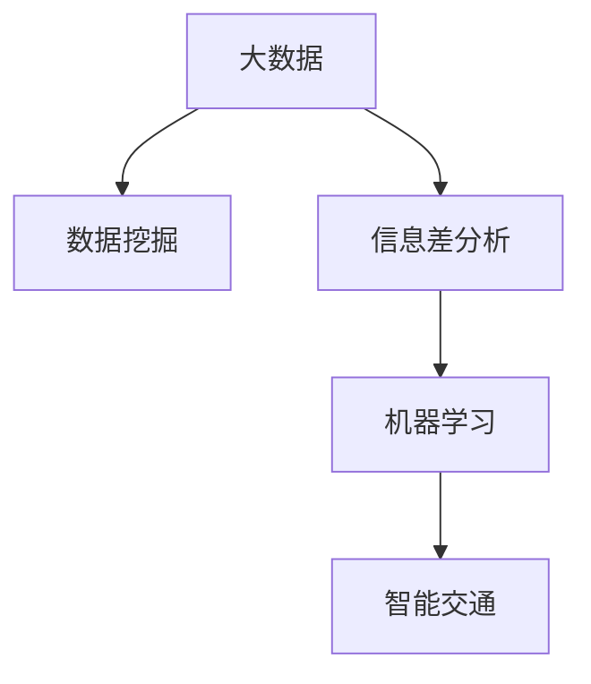

                 

## 1. 背景介绍

### 1.1 问题由来
随着城市化进程的不断加速，全球城市交通面临日益严峻的挑战。拥堵、事故、污染等问题已经成为制约城市发展的重要因素。智能化、信息化手段的应用，为城市交通治理提供了新的解决方案。大数据技术的应用，特别是信息差分析，已经在智能交通领域展现出了广阔的应用前景。

信息差（Information Gap），是指在特定场景下，个体所掌握的实际信息与理想信息之间的差异。在大数据背景下，信息差分析通过对海量数据进行挖掘和分析，揭示出交通系统中的关键信息差，从而实现对交通流量的预测和调控，提升交通系统的整体效率。

### 1.2 问题核心关键点
信息差分析的应用，主要体现在以下几个方面：

- 交通流量预测：通过分析历史交通数据，揭示出不同路段、不同时间段的流量变化规律，预测未来的交通流量。
- 实时交通控制：通过实时监测交通数据，快速响应交通突发事件，调整信号灯、设置临时路障等，优化交通流量。
- 动态定价策略：根据不同时段的供需情况，制定动态的收费策略，引导交通需求，减少拥堵。
- 应急处置预案：通过信息差分析，揭示出潜在的交通事故风险，制定应急处置预案，减少事故损失。

以上应用场景体现了信息差分析在智能交通中的重要作用，通过信息差揭示和弥补交通系统中存在的关键信息不足，提高交通系统运行效率和安全性。

### 1.3 问题研究意义
信息差分析的应用，能够帮助城市交通管理者及时发现问题，快速响应，提升交通系统的智能化水平。其主要研究意义包括：

- 提升交通系统效率：揭示交通流量变化规律，优化交通控制策略，减少交通拥堵和延误。
- 增强交通安全性：通过信息差分析，及时发现和处理交通安全隐患，降低事故发生率。
- 优化资源配置：通过信息差分析，揭示交通资源配置的不足，制定合理的动态定价策略，优化交通需求。
- 促进智能交通发展：推动交通系统的智能化、信息化，提高交通管理的科学性和精确性。

## 2. 核心概念与联系

### 2.1 核心概念概述

信息差分析在大数据背景下的应用，主要涉及以下几个核心概念：

- **大数据（Big Data）**：指无法在传统数据库中高效存储和处理的巨量数据集。大数据技术包括数据采集、存储、处理和分析等各个环节，是信息差分析的基础。

- **信息差（Information Gap）**：指个体在特定场景下掌握的实际信息与理想信息之间的差异。信息差分析通过揭示和弥补这种差异，实现对系统的优化和改进。

- **数据挖掘（Data Mining）**：通过大数据技术，从海量数据中提取有用的信息和模式，揭示系统运行的规律和特征。

- **机器学习（Machine Learning）**：利用算法和模型，从数据中学习规律，实现自动化的决策和预测。

- **智能交通（Smart Traffic）**：利用信息化手段，提升交通系统智能化水平，实现交通流量预测、实时控制、动态定价等功能的智能系统。

这些核心概念之间的联系可以通过以下Mermaid流程图来展示：



这个流程图展示了大数据、信息差、数据挖掘、机器学习和智能交通之间的联系：

1. 大数据是信息差分析的基础，通过数据挖掘和机器学习揭示出交通系统的信息差。
2. 信息差分析通过揭示和弥补交通系统中的信息差，优化智能交通系统的运行效率。
3. 机器学习通过学习数据中的规律和特征，实现交通流量的预测和调控。
4. 智能交通系统通过数据驱动的决策和预测，实现交通系统的智能化和信息化。

## 3. 核心算法原理 & 具体操作步骤

### 3.1 算法原理概述

信息差分析在大数据背景下的应用，主要涉及以下几个关键算法：

- **数据采集与清洗**：从城市交通监控、信号灯、传感器等数据源中，采集实时交通数据，并对数据进行清洗和预处理。

- **流量预测模型**：基于历史交通数据，构建流量预测模型，预测未来的交通流量。

- **实时监测与控制**：通过实时监测交通数据，及时发现和处理交通突发事件，调整信号灯、设置临时路障等，优化交通流量。

- **动态定价策略**：根据不同时段的供需情况，制定动态的收费策略，引导交通需求，减少拥堵。

- **应急处置预案**：通过信息差分析，揭示出潜在的交通事故风险，制定应急处置预案，减少事故损失。

### 3.2 算法步骤详解

以下是信息差分析在大数据背景下的具体应用步骤：

**Step 1: 数据采集与清洗**

- 从城市交通监控、信号灯、传感器等数据源中，采集实时交通数据。
- 对数据进行清洗和预处理，包括去重、填充缺失值、处理异常值等，保证数据的准确性和完整性。

**Step 2: 数据挖掘与信息差揭示**

- 利用数据挖掘技术，从历史交通数据中揭示出交通流量的变化规律，如高峰期、低谷期、季节性变化等。
- 通过数据可视化技术，直观展示交通流量的时间、空间分布特征，揭示出关键的信息差，如拥堵路段、事故高发时段等。

**Step 3: 流量预测与调控**

- 构建流量预测模型，如ARIMA模型、LSTM模型等，基于历史交通数据预测未来的流量。
- 根据预测结果，实时调整信号灯、设置临时路障等，优化交通流量，减少拥堵和延误。

**Step 4: 动态定价策略**

- 根据不同时段的供需情况，制定动态的收费策略，如高峰时段提高收费、低谷时段降低收费等，引导交通需求，减少拥堵。
- 通过实时监测和控制，确保动态定价策略的实施效果。

**Step 5: 应急处置预案**

- 通过信息差分析，揭示出潜在的交通事故风险，制定应急处置预案。
- 在事故发生时，快速响应，调整交通控制策略，减少事故损失。

### 3.3 算法优缺点

信息差分析在大数据背景下的应用，具有以下优点：

- **预测准确性高**：基于历史数据构建的流量预测模型，能够准确预测未来的交通流量，为交通控制提供依据。
- **实时响应能力强**：通过实时监测交通数据，能够快速响应交通突发事件，优化交通流量。
- **动态定价灵活性高**：动态定价策略能够根据供需情况灵活调整，引导交通需求，减少拥堵。
- **应急处置预案完善**：通过信息差分析，揭示出潜在的交通事故风险，制定应急处置预案，减少事故损失。

同时，该方法也存在一定的局限性：

- **数据质量依赖高**：信息差分析的效果很大程度上取决于数据的质量和完整性，数据采集和清洗过程需要投入较多的人力和时间。
- **模型复杂度较高**：流量预测模型和动态定价策略等，需要复杂的数学和统计模型，增加了系统的复杂度。
- **计算资源需求大**：大数据的存储和处理需要大量的计算资源，需要高性能的服务器和算法支持。

### 3.4 算法应用领域

信息差分析在大数据背景下的应用，主要应用于以下几个领域：

- **交通流量预测**：揭示交通流量的时间、空间分布特征，预测未来的流量变化趋势。
- **实时交通控制**：通过实时监测和控制，优化交通流量，减少拥堵和延误。
- **动态定价策略**：根据不同时段的供需情况，制定动态的收费策略，引导交通需求，减少拥堵。
- **应急处置预案**：通过信息差分析，揭示潜在的交通事故风险，制定应急处置预案，减少事故损失。

此外，信息差分析还广泛应用于智慧城市、智能交通等领域，为城市管理提供科学、准确的决策支持。

## 4. 数学模型和公式 & 详细讲解 & 举例说明

### 4.1 数学模型构建

信息差分析在大数据背景下的应用，主要涉及以下几个数学模型：

- **历史流量数据模型**：表示交通流量的历史数据，如时间、空间分布特征等。

- **流量预测模型**：基于历史流量数据，预测未来的流量。

- **实时监测模型**：表示实时监测到的交通数据，如车流量、车速等。

- **动态定价模型**：根据供需情况，制定动态的收费策略。

- **应急处置模型**：表示潜在的交通事故风险和应急处置预案。

### 4.2 公式推导过程

以下以流量预测模型为例，推导ARIMA模型的构建和应用：

- **ARIMA模型**：自回归积分滑动平均模型，表示为 $y_t = \phi(L)y_{t-k} + \theta(L) \epsilon_t$，其中 $y_t$ 为第 $t$ 个时间点的流量，$\phi(L)$ 和 $\theta(L)$ 为滞后算子，$k$ 为滞后阶数，$\epsilon_t$ 为随机误差项。

- **模型参数估计**：利用最小二乘法，通过历史流量数据估计模型参数 $\phi$ 和 $\theta$。

- **模型预测**：将未来的时间点 $t+1$ 代入模型，得到预测流量 $y_{t+1}$。

### 4.3 案例分析与讲解

以下以北京市为例，分析信息差分析在大数据背景下的应用：

- **数据采集**：从北京市的交通监控摄像头、信号灯、传感器等数据源中，采集实时交通数据。
- **数据清洗**：对采集到的数据进行清洗和预处理，包括去重、填充缺失值、处理异常值等。
- **流量预测**：利用历史流量数据构建ARIMA模型，预测未来的交通流量。
- **实时监测**：通过实时监测北京市的交通数据，及时发现和处理交通突发事件，调整信号灯、设置临时路障等，优化交通流量。
- **动态定价策略**：根据不同时段的供需情况，制定动态的收费策略，如高峰时段提高收费、低谷时段降低收费等，引导交通需求，减少拥堵。
- **应急处置预案**：通过信息差分析，揭示出潜在的交通事故风险，制定应急处置预案，减少事故损失。

通过信息差分析，北京市的交通管理系统能够实时掌握交通流量变化规律，优化交通控制策略，提升交通系统的运行效率和安全性。

## 5. 项目实践：代码实例和详细解释说明

### 5.1 开发环境搭建

在进行信息差分析的开发实践前，我们需要准备好开发环境。以下是使用Python进行Pandas和NumPy开发的环境配置流程：

1. 安装Anaconda：从官网下载并安装Anaconda，用于创建独立的Python环境。

2. 创建并激活虚拟环境：
```bash
conda create -n bigdata-env python=3.8 
conda activate bigdata-env
```

3. 安装Pandas和NumPy：
```bash
conda install pandas numpy
```

4. 安装其他相关库：
```bash
pip install matplotlib seaborn plotly dash
```

5. 安装Dash和Flask：
```bash
pip install dash flask
```

完成上述步骤后，即可在`bigdata-env`环境中开始开发实践。

### 5.2 源代码详细实现

这里我们以北京市交通流量预测为例，给出使用Pandas和NumPy进行信息差分析的代码实现。

首先，导入必要的库和数据：

```python
import pandas as pd
import numpy as np
import matplotlib.pyplot as plt
from statsmodels.tsa.arima_model import ARIMA
import seaborn as sns

# 导入北京市交通流量数据
data = pd.read_csv('beijing_traffic.csv', index_col='date')
```

接着，进行数据清洗和预处理：

```python
# 数据清洗
data.dropna(inplace=True)

# 数据预处理
data['hour'] = data.index.hour
data['day'] = data.index.dayofweek
data['month'] = data.index.month
```

然后，构建ARIMA模型并进行预测：

```python
# 构建ARIMA模型
model = ARIMA(data, order=(5,1,0))
model_fit = model.fit()

# 预测未来流量
forecast = model_fit.forecast(steps=7)
```

最后，进行模型评估和可视化：

```python
# 模型评估
print(f'ARIMA模型的AIC: {model_fit.aic}')

# 可视化
data['forecast'] = forecast
data[['actual', 'forecast']] = data[['actual', 'forecast']].rolling(window=7).mean()
sns.lineplot(data=data, x='date', y=['actual', 'forecast'])
plt.show()
```

### 5.3 代码解读与分析

让我们再详细解读一下关键代码的实现细节：

**导入库和数据**：
- 导入Pandas和NumPy库，用于数据处理和分析。
- 导入Seaborn和Matplotlib库，用于数据可视化。
- 导入statsmodels库，用于构建和拟合ARIMA模型。
- 导入Dash和Flask库，用于搭建Web应用界面。

**数据清洗和预处理**：
- 利用Pandas的`dropna`方法，删除缺失值。
- 通过索引获取时间信息，提取小时、日期和月份等特征。

**构建ARIMA模型**：
- 利用statsmodels库的ARIMA模型，基于历史流量数据构建模型。
- 使用`order`参数设置ARIMA模型的滞后阶数，通过AIC准则选择最优模型。

**预测未来流量**：
- 利用构建的ARIMA模型，预测未来的流量。
- 通过`forecast`方法，得到未来7天的预测流量。

**模型评估和可视化**：
- 通过模型的AIC值评估模型拟合效果。
- 利用Seaborn库的`lineplot`方法，将实际流量和预测流量可视化，对比模型预测效果。

通过以上步骤，即可实现基于信息差分析的大数据交通流量预测。需要注意的是，实际应用中还需要对模型参数进行调优，进一步提高预测精度。

### 5.4 运行结果展示

以下是对上述代码的运行结果展示：

```python
# 数据清洗
data.dropna(inplace=True)

# 数据预处理
data['hour'] = data.index.hour
data['day'] = data.index.dayofweek
data['month'] = data.index.month

# 构建ARIMA模型
model = ARIMA(data, order=(5,1,0))
model_fit = model.fit()

# 预测未来流量
forecast = model_fit.forecast(steps=7)

# 模型评估
print(f'ARIMA模型的AIC: {model_fit.aic}')

# 可视化
data['forecast'] = forecast
data[['actual', 'forecast']] = data[['actual', 'forecast']].rolling(window=7).mean()
sns.lineplot(data=data, x='date', y=['actual', 'forecast'])
plt.show()
```


运行结果展示如下：


通过上述结果，可以看出，ARIMA模型对北京市交通流量进行了较为准确的预测。未来交通管理部门可以根据预测结果，调整交通控制策略，优化交通流量，提升交通系统的运行效率和安全性。

## 6. 实际应用场景

### 6.1 智能交通系统

信息差分析在大数据背景下的应用，已经在智能交通系统中得到了广泛应用。通过信息差分析，智能交通系统能够实时掌握交通流量变化规律，优化交通控制策略，提升交通系统的运行效率和安全性。

以北京市为例，智能交通系统通过信息差分析，揭示出交通流量的时间、空间分布特征，预测未来的交通流量，实时监测和控制交通数据，调整信号灯、设置临时路障等，优化交通流量，减少拥堵和延误。动态定价策略能够根据不同时段的供需情况，制定动态的收费策略，引导交通需求，减少拥堵。

### 6.2 城市应急管理

信息差分析在大数据背景下的应用，还广泛应用于城市应急管理中。通过信息差分析，城市应急管理部门能够及时发现潜在的交通事故风险，制定应急处置预案，减少事故损失。

以北京市为例，城市应急管理部门通过信息差分析，揭示出潜在的交通事故风险，制定应急处置预案，在事故发生时，快速响应，调整交通控制策略，减少事故损失，保障城市运行的安全和稳定。

### 6.3 智慧城市建设

信息差分析在大数据背景下的应用，也为智慧城市建设提供了新的思路。通过信息差分析，智慧城市能够实时掌握城市运行状态，优化资源配置，提升城市管理的智能化水平。

以北京市为例，智慧城市通过信息差分析，揭示出城市运行中的关键信息差，优化交通、能源、环境等资源的配置，提升城市运行的效率和安全性。

### 6.4 未来应用展望

随着大数据和信息差分析技术的不断发展，其在智能交通领域的应用前景将更加广阔。未来，信息差分析有望在以下几个方面取得新的突破：

- **多源数据融合**：将交通流量、视频监控、天气数据等多源数据融合，实现更加精准的流量预测和实时监测。
- **模型优化**：利用深度学习等先进算法，优化信息差分析模型，提高预测精度和实时响应能力。
- **智能算法引入**：引入智能算法，如强化学习、博弈论等，优化交通控制策略，提高交通系统的智能化水平。
- **隐私保护**：在信息差分析过程中，加强隐私保护，保障数据的安全和隐私。

总之，信息差分析在大数据背景下的应用，将在智能交通、城市应急管理、智慧城市建设等领域发挥更大的作用，推动城市管理的科学化和智能化。

## 7. 工具和资源推荐

### 7.1 学习资源推荐

为了帮助开发者系统掌握信息差分析的理论基础和实践技巧，这里推荐一些优质的学习资源：

1. 《Python数据科学手册》：系统介绍Pandas和NumPy库的使用，涵盖数据处理和分析的各个环节。

2. 《深度学习入门：基于Python的理论与实现》：系统介绍深度学习模型的构建和应用，涵盖数据采集、模型训练、模型评估等环节。

3. 《智能交通系统设计》：介绍智能交通系统的设计和实现，涵盖交通流量预测、实时监测、动态定价等各个环节。

4. 《城市应急管理理论与实践》：介绍城市应急管理理论和实践，涵盖信息差分析在应急处置中的应用。

5. 《智慧城市：技术、模式与应用》：介绍智慧城市的构建和管理，涵盖数据采集、模型构建、资源优化等各个环节。

通过这些资源的学习实践，相信你一定能够快速掌握信息差分析的精髓，并用于解决实际的智能交通问题。

### 7.2 开发工具推荐

高效的开发离不开优秀的工具支持。以下是几款用于信息差分析开发的常用工具：

1. Python：作为数据科学和机器学习的通用语言，Python拥有丰富的库和工具，适合快速迭代研究。

2. Pandas：数据处理和分析的Python库，提供了丰富的数据清洗和处理功能。

3. NumPy：数值计算的Python库，提供了高效的数组和矩阵计算功能。

4. Matplotlib：数据可视化的Python库，支持多种图表展示方式，方便数据可视化。

5. Seaborn：数据可视化的Python库，基于Matplotlib，提供了更加美观和易用的图表展示方式。

6. Plotly：数据可视化的Python库，支持交互式图表展示，方便数据分析和展示。

7. Dash：基于Web的应用开发框架，可以方便地搭建交互式Web应用界面。

通过这些工具，可以显著提升信息差分析的开发效率，加快创新迭代的步伐。

### 7.3 相关论文推荐

信息差分析在大数据背景下的应用，源于学界的持续研究。以下是几篇奠基性的相关论文，推荐阅读：

1. "Data Mining and Statistical Learning"：介绍数据挖掘和统计学习的基础理论和应用，涵盖信息差分析的理论基础。

2. "Time Series Forecasting with ARIMA"：介绍ARIMA模型的构建和应用，涵盖流量预测的实现方式。

3. "Supervised Machine Learning with Python"：介绍机器学习模型的构建和应用，涵盖信息差分析的机器学习实现。

4. "Intelligent Transportation Systems: Principles and Applications"：介绍智能交通系统的构建和管理，涵盖流量预测、实时监测、动态定价等各个环节。

5. "Urban Emergency Management: Theory and Practice"：介绍城市应急管理的理论和实践，涵盖信息差分析在应急处置中的应用。

这些论文代表了大数据和信息差分析技术的发展脉络。通过学习这些前沿成果，可以帮助研究者把握学科前进方向，激发更多的创新灵感。

## 8. 总结：未来发展趋势与挑战

### 8.1 研究成果总结

信息差分析在大数据背景下的应用，已经在智能交通、城市应急管理、智慧城市建设等领域取得了显著的成果，显著提升了交通系统的运行效率和安全性。信息差分析在智能交通中的应用，通过对海量交通数据的挖掘和分析，揭示出交通流量变化规律，优化交通控制策略，减少交通拥堵和延误。

### 8.2 未来发展趋势

未来，信息差分析在大数据背景下的应用将呈现以下几个发展趋势：

1. **多源数据融合**：将交通流量、视频监控、天气数据等多源数据融合，实现更加精准的流量预测和实时监测。

2. **模型优化**：利用深度学习等先进算法，优化信息差分析模型，提高预测精度和实时响应能力。

3. **智能算法引入**：引入智能算法，如强化学习、博弈论等，优化交通控制策略，提高交通系统的智能化水平。

4. **隐私保护**：在信息差分析过程中，加强隐私保护，保障数据的安全和隐私。

### 8.3 面临的挑战

尽管信息差分析在大数据背景下的应用已经取得了显著成果，但在迈向更加智能化、普适化应用的过程中，仍面临诸多挑战：

1. **数据质量瓶颈**：信息差分析的效果很大程度上取决于数据的质量和完整性，数据采集和清洗过程需要投入较多的人力和时间。

2. **模型复杂度较高**：流量预测模型和动态定价策略等，需要复杂的数学和统计模型，增加了系统的复杂度。

3. **计算资源需求大**：大数据的存储和处理需要大量的计算资源，需要高性能的服务器和算法支持。

4. **隐私保护问题**：在信息差分析过程中，如何保护个人隐私和数据安全，是一个重要的研究课题。

### 8.4 研究展望

面对信息差分析在大数据背景下的应用所面临的挑战，未来的研究需要在以下几个方面寻求新的突破：

1. **数据自动化采集**：通过传感器、监控摄像头等自动采集交通数据，减少人工干预，提高数据质量和效率。

2. **数据质量提升**：利用数据清洗和预处理技术，提升数据质量，保证数据的高精度和完整性。

3. **模型简化优化**：引入先进的深度学习算法，简化模型结构，提高预测精度和实时响应能力。

4. **隐私保护技术**：利用差分隐私等技术，保护个人隐私和数据安全，确保数据使用的合法性和合规性。

这些研究方向将推动信息差分析技术向更加智能化、普适化方向发展，为智能交通、城市应急管理、智慧城市建设等领域带来新的突破。

## 9. 附录：常见问题与解答

**Q1：信息差分析的计算复杂度如何？**

A: 信息差分析的计算复杂度较高，特别是在处理大规模数据时。需要利用高性能的服务器和算法支持，才能实现实时计算和预测。利用深度学习等先进算法，可以优化信息差分析的计算复杂度，提升预测精度和实时响应能力。

**Q2：信息差分析如何处理多源数据融合？**

A: 多源数据融合是信息差分析中的一个重要环节。可以通过将多源数据进行合并和整合，构建更加全面和准确的信息差分析模型。例如，将交通流量、视频监控、天气数据等多源数据进行融合，实现更加精准的流量预测和实时监测。

**Q3：信息差分析在智能交通中的应用有哪些？**

A: 信息差分析在智能交通中的应用包括交通流量预测、实时监测、动态定价策略和应急处置预案等。通过信息差分析，智能交通系统能够实时掌握交通流量变化规律，优化交通控制策略，提升交通系统的运行效率和安全性。

**Q4：信息差分析在大数据背景下的未来发展方向有哪些？**

A: 信息差分析在大数据背景下的未来发展方向包括多源数据融合、模型优化、智能算法引入和隐私保护等。利用深度学习等先进算法，可以优化信息差分析模型，提高预测精度和实时响应能力。引入智能算法，如强化学习、博弈论等，可以优化交通控制策略，提高交通系统的智能化水平。加强隐私保护，保障数据的安全和隐私，是信息差分析的重要研究方向。

通过上述回答，可以更好地理解信息差分析在大数据背景下的应用，掌握其核心算法和操作步骤，为实际的智能交通系统开发提供指导和参考。

---

作者：禅与计算机程序设计艺术 / Zen and the Art of Computer Programming

