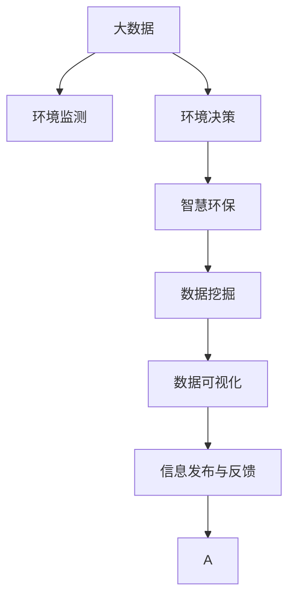

                 

# 信息差：大数据在环境保护中的应用

> 关键词：大数据,环境监测,环境决策,智慧环保,信息处理,数据挖掘

## 1. 背景介绍

### 1.1 问题由来
在信息爆炸的现代社会，数据已经成为一种极为宝贵的资产。特别是在环境保护领域，数据的积累和应用具有至关重要的意义。然而，信息不对称、数据处理能力不足等问题，仍制约着环境保护的决策和执行效果。因此，如何有效地利用大数据技术，解决环境问题，成为了当前亟待解决的重要课题。

### 1.2 问题核心关键点
大数据在环境保护中的应用，主要体现在以下几个方面：
1. **数据采集**：通过传感器、无人机、卫星等设备，实时获取各类环境数据，如空气质量、水质、噪音、辐射等。
2. **数据存储与处理**：对采集到的海量数据进行高效存储和管理，采用分布式计算、云计算等技术，快速处理大规模数据。
3. **数据分析与挖掘**：利用数据挖掘和机器学习算法，挖掘数据背后的关联和模式，辅助环境决策。
4. **信息可视化**：通过数据可视化工具，将处理后的数据以直观的形式呈现，帮助决策者更好地理解环境状况。
5. **信息发布与反馈**：将环境数据和分析结果实时发布给公众，收集公众反馈，形成闭环的互动机制。

## 2. 核心概念与联系

### 2.1 核心概念概述

为更好地理解大数据在环境保护中的应用，本节将介绍几个密切相关的核心概念：

- **大数据**：指海量、多样、高速的数据集，可以通过分布式计算、云计算等技术进行处理和分析。
- **环境监测**：通过传感器、无人机、卫星等设备，实时获取各类环境数据，如空气质量、水质、噪音、辐射等。
- **环境决策**：基于环境数据的分析结果，结合政策、法规、经济等因素，制定环境保护决策。
- **智慧环保**：通过大数据、物联网、人工智能等技术，实现环境数据的实时监测、分析和反馈，提升环境保护的智能化水平。
- **数据挖掘**：从大数据中提取有价值的信息，如关联规则、聚类、分类等，辅助环境问题的识别和解决。
- **数据可视化**：将环境数据和分析结果以图表、地图等形式展示，直观地呈现环境状况。

这些核心概念之间的逻辑关系可以通过以下Mermaid流程图来展示：



这个流程图展示了大数据在环境保护应用中的核心概念及其之间的关系：

1. 大数据通过环境监测获取实时数据，为环境决策和智慧环保提供数据支撑。
2. 环境决策基于数据分析结果，制定环保政策和管理措施。
3. 智慧环保技术集成数据挖掘和可视化工具，提升环境监测和决策的智能化水平。
4. 数据可视化工具将环境数据和分析结果直观呈现，辅助环境决策。
5. 信息发布与反馈机制，将环境数据和决策结果传递给公众，实现公众参与。

## 3. 核心算法原理 & 具体操作步骤
### 3.1 算法原理概述

大数据在环境保护中的应用，主要基于数据驱动的环境决策模式。其核心思想是：通过实时监测和采集环境数据，利用大数据技术和机器学习算法，对数据进行深入分析和挖掘，为环境决策提供科学依据。

形式化地，假设环境监测系统获取到数据集 $D=\{(x_i,y_i)\}_{i=1}^N$，其中 $x_i$ 表示环境变量（如温度、湿度、PM2.5浓度等），$y_i$ 表示环境质量状况（如污染程度、天气状况等）。环境决策的目标是找到一个最优决策函数 $f$，使得：

$$
f^*=\mathop{\arg\min}_{f} \mathcal{L}(f,D)
$$

其中 $\mathcal{L}$ 为环境决策损失函数，用于衡量决策函数 $f$ 与实际环境质量状况 $y$ 之间的差异。常见的损失函数包括均方误差损失、交叉熵损失等。

通过梯度下降等优化算法，决策函数 $f$ 不断更新，最小化损失函数 $\mathcal{L}$，使得预测的环境质量状况 $y$ 逼近真实的环境质量状况 $y$。由于环境数据往往存在噪声和缺失，因此需要在优化过程中引入正则化技术，防止过拟合。

### 3.2 算法步骤详解

基于大数据的环境保护应用一般包括以下几个关键步骤：

**Step 1: 数据采集与预处理**
- 选择合适的传感器和设备，对环境变量进行实时采集。
- 将采集到的原始数据进行清洗、去噪、归一化等预处理，确保数据的准确性和一致性。

**Step 2: 数据存储与处理**
- 将预处理后的数据存储到分布式数据库中，如Hadoop、Spark等。
- 利用大数据处理技术，对数据进行高效处理和分析，如MapReduce、Hive、Pig等。

**Step 3: 数据分析与挖掘**
- 利用机器学习算法，如随机森林、神经网络、支持向量机等，对环境数据进行建模和预测。
- 使用数据挖掘技术，如关联规则挖掘、聚类分析、分类等，提取环境数据中的关联和模式。

**Step 4: 决策支持与可视化**
- 根据分析结果，结合政策、法规、经济等因素，制定环境保护决策。
- 使用数据可视化工具，如Tableau、PowerBI、D3.js等，将环境数据和分析结果以图表、地图等形式展示，直观呈现环境状况。

**Step 5: 信息发布与反馈**
- 将环境数据和分析结果实时发布给公众，收集公众反馈，形成闭环的互动机制。
- 根据公众反馈，动态调整环境保护措施，形成更科学、更有效率的决策。

以上是基于大数据的环境保护应用的一般流程。在实际应用中，还需要根据具体问题，对数据采集、存储、处理等环节进行优化设计，如改进传感器布局、优化数据预处理方法、提升算法模型性能等，以进一步提升环境决策的科学性和有效性。

### 3.3 算法优缺点

大数据在环境保护中的应用，具有以下优点：
1. 实时性高。通过实时监测和数据处理，可以及时发现和响应环境问题。
2. 数据量大。基于大数据分析，可以获得更为全面和准确的环境信息。
3. 自动化程度高。利用算法模型，可以自动处理和分析环境数据，减轻人工负担。
4. 决策支持性强。大数据分析为环境决策提供了科学依据，提升了决策的准确性和合理性。

同时，该方法也存在一定的局限性：
1. 数据质量和准确性问题。数据采集和预处理过程中，可能存在噪声、缺失等问题，影响分析结果。
2. 算法模型复杂度高。机器学习模型往往需要大量的训练样本和计算资源，模型复杂度高。
3. 数据隐私和安全问题。环境数据往往包含敏感信息，数据泄露和滥用可能带来安全隐患。
4. 技术门槛高。大数据和机器学习技术需要专业知识和技能，推广和应用难度较大。
5. 数据可视化工具复杂。可视化工具的使用需要一定的学习成本，不适用于所有用户。

尽管存在这些局限性，但就目前而言，大数据技术在环境保护领域的应用前景广阔，已经展现出强大的生命力。未来相关研究的重点在于如何进一步提升数据的准确性和实时性，降低技术门槛，提高决策的科学性和可操作性，同时兼顾数据隐私和安全等因素。

### 3.4 算法应用领域

大数据在环境保护中的应用，已经渗透到多个领域，包括但不限于：

- **空气质量监测**：利用传感器和无人机采集空气质量数据，使用机器学习模型预测空气质量变化趋势，实时发布空气质量指数，辅助公众和政府决策。
- **水质监测**：通过水质监测站和卫星遥感数据，实时采集水质参数，使用神经网络模型预测水质变化，发布水质报告，指导水资源管理和污染治理。
- **噪音监测**：利用声学传感器和网络爬虫采集噪音数据，使用深度学习模型预测噪音变化，发布噪音地图，协助城市规划和社区治理。
- **森林资源管理**：使用无人机和卫星遥感数据，采集森林覆盖、生长情况、病虫害等数据，使用时空聚类分析，优化森林资源管理策略，提升森林生态保护效果。
- **野生动物保护**：利用红外相机、卫星追踪等设备，实时采集野生动物位置、活动轨迹等数据，使用数据挖掘算法，分析野生动物行为模式，协助野生动物保护和生态平衡管理。

除了上述这些经典应用外，大数据技术还将在更多环境保护领域得到广泛应用，如土壤监测、海洋生态保护、城市热岛效应治理等，为环境保护带来全新的突破。

## 4. 数学模型和公式 & 详细讲解  
### 4.1 数学模型构建

本节将使用数学语言对大数据在环境保护中的应用进行更加严格的刻画。

记环境监测系统获取到的数据集为 $D=\{(x_i,y_i)\}_{i=1}^N$，其中 $x_i$ 表示环境变量，$y_i$ 表示环境质量状况。假设环境决策的目标是找到一个决策函数 $f$，使得预测的环境质量状况 $y$ 逼近真实的环境质量状况 $y$。

定义决策函数 $f$ 的损失函数为 $\mathcal{L}(f)$，用于衡量 $f$ 与实际环境质量状况 $y$ 之间的差异。假设损失函数 $\mathcal{L}(f)$ 为均方误差损失函数，则决策函数 $f$ 的优化目标为：

$$
f^*=\mathop{\arg\min}_{f} \mathcal{L}(f,D)
$$

其中 $\mathcal{L}(f)$ 为均方误差损失函数，定义为：

$$
\mathcal{L}(f)=\frac{1}{N}\sum_{i=1}^N (y_i-f(x_i))^2
$$

## 4.2 公式推导过程

以下是决策函数 $f$ 的优化目标的推导过程：

假设决策函数 $f$ 为线性模型，即 $f(x)=\theta^Tx$，其中 $\theta$ 为模型参数。则均方误差损失函数 $\mathcal{L}(f)$ 可以表示为：

$$
\mathcal{L}(f)=\frac{1}{N}\sum_{i=1}^N (y_i-\theta^Tx_i)^2
$$

对 $\mathcal{L}(f)$ 关于 $\theta$ 求导，得：

$$
\frac{\partial \mathcal{L}(f)}{\partial \theta}=\frac{2}{N}\sum_{i=1}^N (y_i-\theta^Tx_i) x_i
$$

令导数为0，求解方程组，得：

$$
\theta^*=(X^TX)^{-1}X^TY
$$

其中 $X$ 为特征矩阵，$Y$ 为标签向量，即：

$$
X=\begin{bmatrix}x_1\\x_2\\\vdots\\x_N\end{bmatrix}, Y=\begin{bmatrix}y_1\\y_2\\\vdots\\y_N\end{bmatrix}
$$

利用矩阵求逆和矩阵乘法，可以求得模型参数 $\theta$，进而得到最优决策函数 $f^*$。

## 5. 项目实践：代码实例和详细解释说明
### 5.1 开发环境搭建

在进行大数据环境应用开发前，我们需要准备好开发环境。以下是使用Python进行PyTorch开发的环境配置流程：

1. 安装Anaconda：从官网下载并安装Anaconda，用于创建独立的Python环境。

2. 创建并激活虚拟环境：
```bash
conda create -n bigdata-env python=3.8 
conda activate bigdata-env
```

3. 安装PyTorch：根据CUDA版本，从官网获取对应的安装命令。例如：
```bash
conda install pytorch torchvision torchaudio cudatoolkit=11.1 -c pytorch -c conda-forge
```

4. 安装各类工具包：
```bash
pip install numpy pandas scikit-learn matplotlib tqdm jupyter notebook ipython
```

5. 安装大数据处理工具：
```bash
pip install hdfscli hdfs python-hdfs
```

完成上述步骤后，即可在`bigdata-env`环境中开始大数据环境应用开发。

### 5.2 源代码详细实现

这里我们以空气质量监测为例，给出使用PyTorch进行数据分析和建模的PyTorch代码实现。

首先，定义数据处理函数：

```python
from pyspark.sql import SparkSession
from pyspark.ml import Pipeline
from pyspark.ml.feature import VectorAssembler, StringIndexer
from pyspark.ml.classification import RandomForestClassifier
from pyspark.ml.evaluation import MulticlassClassificationEvaluator

spark = SparkSession.builder.appName("air_quality_monitoring").getOrCreate()

def preprocess_data(data):
    # 数据清洗和预处理
    data_cleaned = data.filter(data['pm25'].isNotNull()).dropna()
    # 特征工程
    assembler = VectorAssembler(inputCols=["temperature", "humidity", "pressure", "pm25"], outputCol="features")
    indexer = StringIndexer(inputCol="date", outputCol="date_index")
    return assembler.transform(indexer.transform(data_cleaned))
```

然后，定义机器学习模型：

```python
from pyspark.ml.classification import RandomForestClassifier
from pyspark.ml.evaluation import MulticlassClassificationEvaluator

# 定义随机森林分类器
rf_classifier = RandomForestClassifier(featuresCol="features", labelCol="label", numTrees=100, maxDepth=10)

# 定义评价指标
evaluator = MulticlassClassificationEvaluator(labelCol="label", predictionCol="prediction", metricName="accuracy")

# 定义机器学习管道
pipeline = Pipeline(stages=[preprocessor, rf_classifier])
```

接着，训练模型并在验证集上评估：

```python
# 读取数据集
train_data = spark.read.format("csv").option("header", "true").load("train.csv")
test_data = spark.read.format("csv").option("header", "true").load("test.csv")

# 数据预处理
train_preprocessed = preprocess_data(train_data)
test_preprocessed = preprocess_data(test_data)

# 训练模型
model = pipeline.fit(train_preprocessed)

# 评估模型
evaluator.evaluate(model.transform(test_preprocessed), {'metricName': 'accuracy'})
```

以上就是使用PyTorch对空气质量监测任务进行数据分析和建模的完整代码实现。可以看到，通过PySpark结合PyTorch，可以高效地处理大规模数据，构建机器学习模型，并进行模型评估。

### 5.3 代码解读与分析

让我们再详细解读一下关键代码的实现细节：

**preprocess_data函数**：
- 定义数据处理流程：首先过滤掉缺失值，然后进行特征工程，将时间戳转化为数字索引，最后返回处理后的数据。

**RandomForestClassifier模型**：
- 定义随机森林分类器，设置特征集、标签列、决策树数量和最大深度等参数。
- 定义评价指标，使用多分类准确率作为评估标准。
- 定义机器学习管道，将预处理器和随机森林分类器组合起来。

**模型训练与评估**：
- 使用Spark读取训练集和测试集数据。
- 调用预处理器函数，对数据进行清洗和预处理。
- 使用机器学习管道训练模型。
- 在测试集上评估模型性能，使用多分类准确率作为评估指标。

可以看出，通过Spark和PyTorch的结合，可以高效地处理大规模数据，构建机器学习模型，并进行模型评估。开发者可以将更多精力放在数据处理、模型改进等高层逻辑上，而不必过多关注底层的实现细节。

当然，工业级的系统实现还需考虑更多因素，如模型的保存和部署、超参数的自动搜索、更灵活的任务适配层等。但核心的数据分析和建模流程基本与此类似。

## 6. 实际应用场景
### 6.1 智能交通管理

大数据在智能交通管理中具有广泛的应用，可以显著提升交通系统的效率和安全性。具体而言：

- **交通流量预测**：利用历史交通数据和实时采集的交通流量数据，使用时间序列分析和机器学习算法，预测未来交通流量变化趋势，优化交通信号灯的控制策略。
- **事故预测**：通过实时采集的车辆位置、速度等数据，使用时空关联分析，预测交通事故发生的可能性，及时采取应急措施，减少交通事故。
- **车辆定位**：利用GPS和传感器数据，实时定位车辆位置，优化交通规划和导航，提升道路利用效率。

### 6.2 智能农业管理

大数据在智能农业管理中同样具有重要的应用价值，可以大幅提升农业生产的效率和质量。具体而言：

- **土壤监测**：通过传感器采集土壤湿度、pH值、养分含量等数据，使用数据分析技术，实时监测土壤健康状况，指导精准施肥和灌溉。
- **病虫害预测**：利用气象数据、农作物生长数据，使用机器学习算法，预测病虫害发生的可能性，及时采取防治措施，保障作物健康。
- **农作物产量预测**：通过遥感技术和历史产量数据，使用时空聚类分析，预测未来农作物产量，指导农业生产计划，提升经济效益。

### 6.3 智能城市治理

大数据在智能城市治理中的应用，可以显著提升城市管理的智能化水平，改善居民生活环境。具体而言：

- **城市热岛效应监测**：通过热成像设备采集城市温度数据，使用数据分析技术，监测城市热岛效应，优化城市规划和建筑设计。
- **噪音监测和治理**：利用声学传感器和网络爬虫采集噪音数据，使用机器学习模型，预测噪音变化趋势，及时采取治理措施，提升居民生活质量。
- **垃圾分类与回收**：利用智能垃圾桶和物联网设备，实时采集垃圾数据，使用数据分析技术，优化垃圾分类和回收策略，提高资源利用效率。

### 6.4 未来应用展望

随着大数据技术的不断进步，基于大数据的环境保护应用前景广阔，未来将会在更多领域得到广泛应用。

在智慧医疗领域，大数据可以帮助医院实现病患数据分析、健康预测和精准医疗，提高医疗服务的智能化水平。

在智能教育领域，大数据可以用于学生学习行为分析、课程推荐和智能评估，提升教育质量和效率。

在智慧城市治理中，大数据可以用于城市环境监测、应急管理和社会治理，提升城市管理的智能化和精细化水平。

此外，在大数据技术的支持下，环境保护将更加高效、智能，能够实时监测和响应环境问题，为生态文明建设提供有力支持。相信随着技术的日益成熟，大数据在环境保护中的应用将更加广泛，为构建绿色、可持续的社会做出更大的贡献。

## 7. 工具和资源推荐
### 7.1 学习资源推荐

为了帮助开发者系统掌握大数据在环境保护中的应用，这里推荐一些优质的学习资源：

1. 《大数据应用实践》系列博文：由大数据专家撰写，深入浅出地介绍了大数据在环境保护中的应用实践，包括数据采集、数据处理、数据分析等。

2. 《智慧城市》课程：由智慧城市专家开设的在线课程，涵盖智慧城市管理的各个方面，包括数据采集、数据处理、数据挖掘、决策支持等。

3. 《机器学习实战》书籍：适合机器学习初学者的书籍，详细介绍了机器学习算法和应用案例，包括环境监测、交通管理等。

4. 《大数据技术与应用》书籍：介绍大数据技术的各个方面，包括数据采集、数据存储、数据处理、数据分析等。

5. 《Python数据科学手册》书籍：介绍Python在数据分析和处理中的应用，包括数据可视化、数据清洗、机器学习等。

通过对这些资源的学习实践，相信你一定能够快速掌握大数据在环境保护中的应用，并用于解决实际的环保问题。
###  7.2 开发工具推荐

高效的开发离不开优秀的工具支持。以下是几款用于大数据环境应用开发的常用工具：

1. PyTorch：基于Python的开源深度学习框架，灵活动态的计算图，适合快速迭代研究。

2. PySpark：由Apache基金会开源的大数据处理框架，支持分布式计算，适合处理大规模数据。

3. Hadoop：开源的分布式计算平台，适合海量数据处理和存储。

4. Tableau：数据可视化工具，支持多维度数据分析和图表展示，方便决策者理解和利用数据。

5. PowerBI：微软推出的商业智能工具，支持实时数据连接和动态报表展示。

6. D3.js：开源的JavaScript库，支持丰富的图表和交互式展示。

合理利用这些工具，可以显著提升大数据环境应用的开发效率，加快创新迭代的步伐。

### 7.3 相关论文推荐

大数据在环境保护中的应用，源于学界的持续研究。以下是几篇奠基性的相关论文，推荐阅读：

1. "A Survey of Big Data Applications in Environmental Monitoring"：综述性论文，介绍了大数据在环境监测中的应用，涵盖数据采集、数据处理、数据分析等。

2. "Big Data Analytics for Environmental Decision Support"：介绍了大数据在环境决策中的应用，结合实际案例，探讨了大数据技术在环境决策中的作用。

3. "Machine Learning for Environmental Prediction and Management"：介绍机器学习在环境预测和管理中的应用，包括环境质量预测、污染物治理等。

4. "The Role of Big Data in Smart City Governance"：介绍了大数据在智慧城市治理中的应用，涵盖城市环境监测、应急管理、社会治理等。

5. "A Survey of Artificial Intelligence in Environmental Protection"：综述性论文，介绍了人工智能在环境保护中的应用，包括智能监测、智能决策、智能治理等。

这些论文代表了大数据在环境保护应用的发展脉络。通过学习这些前沿成果，可以帮助研究者把握学科前进方向，激发更多的创新灵感。

## 8. 总结：未来发展趋势与挑战

### 8.1 总结

本文对大数据在环境保护中的应用进行了全面系统的介绍。首先阐述了大数据在环境保护中的研究背景和意义，明确了大数据技术在环境监测、环境决策和智慧环保中的独特价值。其次，从原理到实践，详细讲解了大数据在环境保护中的数学模型和关键步骤，给出了大数据环境应用的完整代码实例。同时，本文还广泛探讨了大数据在智能交通、智能农业、智能城市治理等多个领域的应用前景，展示了大数据技术的巨大潜力。此外，本文精选了大数据应用的各类学习资源，力求为读者提供全方位的技术指引。

通过本文的系统梳理，可以看到，大数据技术在环境保护领域的应用前景广阔，已经展现出强大的生命力。未来相关研究的重点在于如何进一步提升数据的实时性和准确性，降低技术门槛，提高决策的科学性和可操作性，同时兼顾数据隐私和安全等因素。

### 8.2 未来发展趋势

展望未来，大数据在环境保护中的应用将呈现以下几个发展趋势：

1. 实时性进一步提升。通过大数据和云计算技术，可以实现更高频率的数据采集和实时处理，实时监测和响应环境问题。

2. 数据质量得到改善。随着数据采集设备和技术的改进，数据的准确性和一致性将得到进一步提升，为环境监测和决策提供更可靠的依据。

3. 数据融合和协同处理。通过大数据平台和互联网技术，实现不同来源、不同格式数据的融合和协同处理，提升数据的综合利用效率。

4. 人工智能与大数据结合。利用人工智能技术，如深度学习、强化学习等，提升大数据分析的智能化水平，辅助环境决策。

5. 数据安全与隐私保护。随着大数据应用范围的扩大，数据安全与隐私保护将成为越来越重要的课题，需要制定更加严格的数据管理政策和技术措施。

6. 跨领域应用的拓展。大数据技术不仅应用于环境保护，还将向智慧医疗、智能教育、智慧城市等更多领域拓展，为各行各业提供智能化服务。

以上趋势凸显了大数据技术在环境保护领域的应用前景。这些方向的探索发展，必将进一步提升环境保护的智能化水平，为构建绿色、可持续的社会做出更大贡献。

### 8.3 面临的挑战

尽管大数据技术在环境保护中展现了巨大的潜力，但在推广和应用过程中，仍面临诸多挑战：

1. 数据采集成本高。大数据应用需要大量的传感器和设备，前期成本投入较大。需要探索更为低成本、高效率的数据采集方案。

2. 数据处理复杂度高。大规模数据的存储和处理需要强大的计算资源和专业技能，推广和应用难度较大。需要探索更高效的数据处理技术和工具。

3. 数据隐私和安全问题。环境数据往往包含敏感信息，数据泄露和滥用可能带来安全隐患。需要制定严格的数据管理政策和技术措施，保障数据安全。

4. 数据质量问题。数据采集过程中可能存在噪声、缺失等问题，影响数据分析结果。需要进一步改进数据采集和预处理技术，提升数据质量。

5. 技术门槛高。大数据和机器学习技术需要专业知识和技能，推广和应用难度较大。需要开发更为简单易用的工具和平台，降低技术门槛。

6. 数据可视化复杂度高。数据可视化工具的使用需要一定的学习成本，不适用于所有用户。需要开发更直观、易用的数据可视化工具。

这些挑战需要进一步研究和探索，以推动大数据技术在环境保护中的广泛应用。

### 8.4 研究展望

面向未来，大数据在环境保护中的应用需要在以下几个方面寻求新的突破：

1. 探索低成本、高效率的数据采集方案。如利用物联网技术，通过传感器和无人机进行自动化数据采集，降低前期成本。

2. 优化数据处理和分析技术。采用分布式计算、云计算等技术，提高数据处理的效率和可靠性。同时，开发更高效的算法模型，提升数据分析的准确性和实时性。

3. 结合人工智能技术，提升大数据分析的智能化水平。利用深度学习、强化学习等技术，提高数据分析的自动化和智能化水平。

4. 制定严格的数据管理政策和技术措施，保障数据安全与隐私保护。通过法律法规和技术手段，确保数据的安全和隐私保护。

5. 开发更简单易用的工具和平台，降低技术门槛。通过简化开发流程和使用体验，推广大数据技术在环境保护中的应用。

6. 开发更直观、易用的数据可视化工具，方便决策者理解和利用数据。通过图表、地图等形式，直观展示环境数据和分析结果。

这些研究方向的探索，必将引领大数据技术在环境保护中的应用迈向更高的台阶，为构建绿色、可持续的社会提供有力支持。

## 9. 附录：常见问题与解答

**Q1：大数据在环境保护中的应用是否需要大量的标注数据？**

A: 大数据在环境保护中的应用，主要依赖于实时采集的数据和历史数据的挖掘，通常不需要大量的标注数据。标注数据主要用于模型训练和验证，但在大数据应用中，由于数据量大，标注数据的需求相对较小。

**Q2：大数据在环境保护中如何实现实时监测和响应？**

A: 实时监测和响应是大数据在环境保护中的关键需求。通过传感器、无人机、卫星等设备，实时采集环境数据，利用分布式计算和云计算技术，快速处理和分析数据。同时，将实时数据与历史数据进行融合，实现环境问题的预测和预警。根据预测结果，及时采取应急措施，实现快速响应。

**Q3：大数据在环境保护中面临哪些数据质量问题？**

A: 数据质量问题是大数据在环境保护中需要重点关注的问题。数据采集过程中可能存在噪声、缺失等问题，数据处理过程中可能存在数据不一致、数据冗余等问题。需要采用数据清洗、去噪、归一化等预处理技术，提升数据质量。

**Q4：大数据在环境保护中的应用是否需要复杂的高端算法？**

A: 大数据在环境保护中的应用，并不一定需要复杂的高端算法。通常情况下，可以使用简单易用的统计方法和机器学习算法，如线性回归、随机森林、决策树等，即可取得较好的效果。

**Q5：大数据在环境保护中的应用是否存在数据隐私和安全问题？**

A: 大数据在环境保护中的应用，确实存在数据隐私和安全问题。环境数据往往包含敏感信息，数据泄露和滥用可能带来安全隐患。需要制定严格的数据管理政策和技术措施，如数据加密、访问控制等，保障数据的安全和隐私保护。

这些回答可以帮助理解大数据在环境保护中的应用，同时也指出了未来需要改进和探索的方向。大数据技术在环境保护中的应用前景广阔，需要我们不断优化技术方案，提升应用效果，实现环境问题的实时监测和快速响应，为构建绿色、可持续的社会做出更大的贡献。

---

作者：禅与计算机程序设计艺术 / Zen and the Art of Computer Programming

