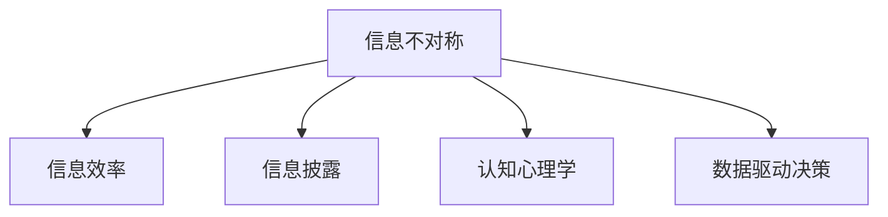

                 

## 1. 背景介绍

### 1.1 问题由来
信息差（Information Gap）是指市场主体对同一信息具有不同程度的认知差异。在数字化时代，信息获取变得前所未有的便捷，然而，由于市场主体的信息接收渠道、知识背景、认知能力等存在差异，他们对同一份信息可能存在不同的理解和判断。信息差的存在，为信息优势者提供了市场竞争的优势，使得其在资源配置、决策制定等方面占据有利地位。

信息差的概念最初由诺贝尔经济学奖得主罗伯特·默顿（Robert C. Merton）提出，他认为信息差是导致市场价格偏离其基础价值的主要原因之一。近年来，随着大数据、人工智能等技术的发展，信息差在商业决策、投资、媒体、社交网络等领域发挥了越来越重要的作用，成为了驱动市场发展的关键因素。

### 1.2 问题核心关键点
信息差带来的市场机会主要体现在以下几个方面：

- **信息不对称**：市场主体对产品、服务、技术等信息的了解程度存在差异，导致在市场竞争中占据优势。
- **知识鸿沟**：不同市场主体在知识背景、信息处理能力上存在差距，影响其在决策、交易等方面的行为。
- **认知偏差**：由于信息接收和处理方式的不同，市场主体对信息的主观判断存在差异，导致市场行为的多样性。
- **信息反馈**：市场反馈机制的存在使得信息优势者能够更有效地利用信息差，形成正向的反馈循环。

## 2. 核心概念与联系

### 2.1 核心概念概述

为更好地理解信息差在市场中的应用，本节将介绍几个密切相关的核心概念：

- **信息不对称**：指交易双方对市场信息的掌握程度不同，导致市场行为和价格产生偏差。
- **信息效率**：指信息在市场中的流动速度和质量，信息效率高的市场能够更迅速地反映真实价格。
- **信息披露**：指市场主体主动或被动地向其他市场参与者披露信息的过程，旨在提高市场透明度和信息效率。
- **认知心理学**：研究人类信息接收和处理的心理机制，揭示认知偏差对市场行为的影响。
- **数据驱动决策**：基于数据分析和人工智能技术，支持市场主体进行科学决策，减少信息差带来的影响。

这些概念之间的逻辑关系可以通过以下Mermaid流程图来展示：



这个流程图展示的信息差及其相关概念之间的联系：

1. 信息不对称是信息差的基础，导致了市场主体对信息的掌握程度存在差异。
2. 信息效率和信息披露是信息不对称的应对措施，通过提高市场透明度和信息流动速度来缓解信息差。
3. 认知心理学揭示了市场主体认知偏差的影响，为数据驱动决策提供理论支撑。
4. 数据驱动决策利用人工智能和大数据技术，帮助市场主体科学决策，进一步缩小信息差。

## 3. 核心算法原理 & 具体操作步骤
### 3.1 算法原理概述

通过数据分析发现市场机会，本质上是一个信息收集和处理的过程。其核心思想是：利用数据挖掘和机器学习技术，从海量数据中挖掘出与市场机会相关的关键信息，并结合领域知识和经验，进行综合分析和判断。

形式化地，假设市场主体需要发现的目标机会为 $O$，可观察的市场数据为 $D=\{d_1, d_2, \ldots, d_n\}$，其中 $d_i$ 代表第 $i$ 个数据点，包含市场主体已知的信息。目标机会 $O$ 可以表示为 $O = f(D)$，其中 $f$ 为一个信息处理函数。通过函数 $f$，从 $D$ 中提取和融合关键信息，发现 $O$。

在实践中，通常使用以下步骤实现这一目标：

1. **数据收集**：收集市场主体可获取的各种数据，包括市场价格、产品信息、用户反馈、竞争对手动态等。
2. **数据清洗和预处理**：对收集到的数据进行去重、缺失值填补、异常值处理等，保证数据质量。
3. **特征提取**：利用领域知识和经验，从数据中提取出与目标机会相关的关键特征。
4. **模型训练**：使用机器学习模型，如回归、分类、聚类等，训练出能够识别市场机会的模型。
5. **模型评估和调优**：通过交叉验证、A/B测试等方法，评估模型性能并进行调优。
6. **机会识别和判断**：将新数据输入模型，识别和判断市场机会。

### 3.2 算法步骤详解

具体到算法步骤，通常包括以下几个关键环节：

**Step 1: 数据收集与清洗**
- 通过API接口、爬虫等方式，收集市场主体可获取的各种数据，如电商平台的用户评论、社交媒体的舆论热点、新闻媒体的报道内容等。
- 对收集到的数据进行清洗和预处理，去除重复、缺失和异常值，确保数据的质量和一致性。

**Step 2: 特征提取与选择**
- 利用领域知识和经验，从清洗后的数据中提取出与目标机会相关的关键特征。例如，电商平台的评论情感、用户评分、价格变化等。
- 使用特征选择算法，如LASSO、树模型等，对提取出的特征进行筛选，保留对目标机会预测效果最好的特征。

**Step 3: 模型训练与评估**
- 选择合适的机器学习模型，如随机森林、支持向量机、神经网络等，对提取出的特征进行训练，得到市场机会的预测模型。
- 使用交叉验证等方法评估模型性能，调整模型参数，以获得最佳预测效果。

**Step 4: 机会识别与判断**
- 将新收集到的市场数据输入训练好的模型，得到市场机会的预测结果。
- 结合领域知识和经验，综合判断模型的预测结果，确定是否存在市场机会。

### 3.3 算法优缺点

通过数据分析发现市场机会的方法具有以下优点：

1. **客观性**：基于数据分析发现市场机会，能够客观反映市场的真实情况，减少主观判断带来的误差。
2. **实时性**：数据分析过程可以在实时数据流的支持下进行，能够迅速响应市场变化，抓住新的机会。
3. **可扩展性**：数据分析方法可以应用于各种市场场景，适应不同市场主体的需求。
4. **系统性**：通过综合利用多源数据和多种机器学习模型，能够更全面地分析市场情况，发现潜在机会。

同时，该方法也存在一定的局限性：

1. **数据质量依赖**：数据收集和清洗的质量直接影响模型性能，如果数据存在偏差，模型预测结果也可能失真。
2. **模型复杂性**：复杂的机器学习模型需要大量时间和计算资源进行训练和调优，适用于大数据量的场景。
3. **领域知识要求**：模型训练和机会判断需要结合领域知识和经验，对市场主体的专业背景有一定要求。
4. **结果解释性**：机器学习模型往往缺乏可解释性，市场主体难以理解模型的决策过程和依据。

尽管存在这些局限性，但数据驱动的方法已成为市场主体发现机会的重要工具。未来相关研究将重点在于提高数据质量、简化模型结构、增强结果解释性等方向。

### 3.4 算法应用领域

通过数据分析发现市场机会的方法在多个领域得到广泛应用，具体包括：

- **电商**：电商平台利用用户行为数据和产品评论，发现潜在的市场机会，如热销商品、用户偏好等。
- **金融**：金融机构通过分析市场价格、交易量等数据，识别投资机会，如股票买入时机、风险评估等。
- **媒体**：媒体公司利用社交媒体数据，发现舆情热点和新闻线索，提升新闻报道的时效性和深度。
- **市场营销**：企业通过分析市场调研数据和消费者行为数据，制定精准的市场营销策略。
- **医疗**：医疗机构利用电子病历和患者反馈数据，发现新药研发机会和个性化医疗需求。

## 4. 数学模型和公式 & 详细讲解 & 举例说明
### 4.1 数学模型构建

本节将使用数学语言对数据分析发现市场机会的过程进行严格刻画。

记市场主体需要发现的目标机会为 $O$，可观察的市场数据为 $D=\{d_1, d_2, \ldots, d_n\}$，其中 $d_i$ 代表第 $i$ 个数据点。假设市场主体已经掌握了部分市场信息 $I_0$，通过数据 $D$ 可以获得新信息 $I_D$，则市场机会 $O$ 可以表示为 $O = f(I_0, I_D)$。其中 $f$ 为一个信息处理函数。

### 4.2 公式推导过程

以下我们以电商平台为例，推导数据分析模型中常用的回归模型和分类模型的构建过程。

假设电商平台需要预测热销商品 $X$ 的市场机会，收集了商品 $X$ 的销量数据 $Y$ 和相关市场数据 $D$，包括用户评论情感、价格变化等。我们可以使用回归模型来预测热销商品的市场机会：

$$
\hat{Y} = f(\beta_0 + \beta_1X_1 + \beta_2X_2 + \ldots + \beta_kX_k + \epsilon)
$$

其中 $\beta_i$ 为回归系数，$X_i$ 为第 $i$ 个市场特征，$\epsilon$ 为误差项。在实际应用中，通常使用梯度下降等优化算法对模型进行训练和调优。

对于分类问题，可以使用逻辑回归模型进行预测：

$$
\log \frac{p(y=1|X)}{p(y=0|X)} = \beta_0 + \beta_1X_1 + \beta_2X_2 + \ldots + \beta_kX_k
$$

其中 $p(y=1|X)$ 为预测热销商品 $X$ 的市场机会的概率。在实际应用中，通常使用交叉验证等方法评估模型性能，并通过正则化等技术避免过拟合。

### 4.3 案例分析与讲解

以下是一个电商平台的案例分析：

**案例背景**：某电商平台销售一批新商品，需要预测该商品的市场机会，即是否成为热销商品。

**数据收集**：收集该商品在过去一个月的销量数据，以及用户评论情感、价格变化、市场趋势等市场数据。

**特征提取**：从用户评论中提取情感极性（正面、负面、中性），从价格变化中提取价格波动度量（价格涨跌率），从市场趋势中提取季节性因素（节假日、促销活动等）。

**模型训练**：使用LASSO回归模型，对提取出的特征进行训练，得到预测模型。通过交叉验证评估模型性能，调整模型参数，得到最终预测模型。

**机会判断**：将新收集的市场数据输入预测模型，得到市场机会的预测结果。例如，如果预测模型输出热销商品的概率非常高，且结合领域知识和经验，可以判断该商品有较高的市场机会。

## 5. 项目实践：代码实例和详细解释说明
### 5.1 开发环境搭建

在进行数据分析项目实践前，我们需要准备好开发环境。以下是使用Python进行Pandas和Scikit-learn开发的环境配置流程：

1. 安装Anaconda：从官网下载并安装Anaconda，用于创建独立的Python环境。

2. 创建并激活虚拟环境：
```bash
conda create -n data-env python=3.8 
conda activate data-env
```

3. 安装必要的库：
```bash
conda install pandas scikit-learn matplotlib numpy
```

4. 安装Jupyter Notebook：
```bash
conda install jupyter notebook
```

完成上述步骤后，即可在`data-env`环境中开始数据分析实践。

### 5.2 源代码详细实现

下面以电商平台的案例为例，给出使用Pandas和Scikit-learn进行数据分析的Python代码实现。

首先，定义数据处理函数：

```python
import pandas as pd
from sklearn.model_selection import train_test_split
from sklearn.linear_model import Lasso
from sklearn.metrics import mean_squared_error, roc_auc_score

def preprocess_data(data):
    # 数据清洗
    data = data.dropna()
    data['price_change'] = data['price'].diff() / data['price'].shift(1)
    data['seasonal_factor'] = 1 if data['date'].month == 11 else 0
    # 特征选择
    X = data[['review_sentiment', 'price_change', 'seasonal_factor']]
    y = data['sales']
    return X, y
```

然后，定义模型训练和评估函数：

```python
def train_model(X_train, y_train, X_test, y_test):
    model = Lasso(alpha=0.1)
    model.fit(X_train, y_train)
    y_pred = model.predict(X_test)
    mse = mean_squared_error(y_test, y_pred)
    auc = roc_auc_score(y_test, y_pred)
    return mse, auc
```

最后，启动数据分析流程并在测试集上评估：

```python
# 加载数据
data = pd.read_csv('sales_data.csv')

# 数据预处理
X, y = preprocess_data(data)

# 划分训练集和测试集
X_train, X_test, y_train, y_test = train_test_split(X, y, test_size=0.2, random_state=42)

# 模型训练和评估
mse_train, auc_train = train_model(X_train, y_train, X_test, y_test)
print(f'Train MSE: {mse_train:.4f}, Train AUC: {auc_train:.4f}')

# 模型预测和判断
data_new = pd.read_csv('new_sales_data.csv')
X_new = preprocess_data(data_new)
y_pred = model.predict(X_new)
data_new['pred_sales'] = y_pred

# 输出预测结果
print(data_new[['product', 'pred_sales']])
```

以上就是使用Pandas和Scikit-learn对电商平台数据进行数据分析的完整代码实现。可以看到，利用Python的Pandas和Scikit-learn库，可以轻松进行数据清洗、特征提取、模型训练和评估，并在新数据上快速进行预测和判断。

### 5.3 代码解读与分析

让我们再详细解读一下关键代码的实现细节：

**preprocess_data函数**：
- 对数据进行清洗，去除缺失值和异常值。
- 计算价格变化率。
- 引入季节性因素，如果月份为11月，则季节性因子为1。
- 对特征进行选择，保留与销量预测相关的关键特征。

**train_model函数**：
- 使用LASSO回归模型对训练数据进行训练，得到预测模型。
- 在测试数据上进行预测，并计算预测误差和AUC值。
- 返回预测误差和AUC值，用于评估模型性能。

**数据分析流程**：
- 加载数据集。
- 对数据进行预处理，包括数据清洗、特征提取等。
- 划分训练集和测试集。
- 使用训练集对模型进行训练和评估，输出模型性能指标。
- 在新数据上使用训练好的模型进行预测和判断，输出预测结果。

## 6. 实际应用场景

### 6.1 电商平台

基于数据分析发现市场机会的方法在电商平台的商品推荐、库存管理、营销策略等方面具有广泛应用。通过分析用户行为数据和市场趋势，电商平台可以发现哪些商品有更高的销售潜力，进而优化库存、制定精准的营销策略，提升用户满意度和销售额。

### 6.2 金融投资

在金融领域，数据分析方法被用于识别投资机会、预测市场趋势、风险评估等。通过分析历史交易数据和市场新闻，投资者可以发现潜在的投资机会，制定更为科学的投资策略。金融机构也可以通过数据分析识别风险点，制定相应的风险控制措施。

### 6.3 媒体报道

媒体公司利用数据分析方法，可以发现社会热点、舆情趋势、新闻线索等。通过分析社交媒体数据和搜索引擎指数，媒体公司可以预测新闻的阅读量、话题热度，及时发布相关报道，提升新闻的时效性和深度。

### 6.4 未来应用展望

随着数据技术和人工智能的不断发展，数据分析在市场机会发现中的应用将越来越广泛。未来可能的发展趋势包括：

- **实时数据分析**：利用大数据技术和流式处理框架，实现实时数据分析，快速响应市场变化。
- **多源数据融合**：结合多种数据源，如社交媒体、新闻、图像等，进行多源数据融合分析，提高市场预测的准确性。
- **深度学习模型**：利用深度学习模型，如神经网络、卷积神经网络等，进行更复杂的特征提取和模式识别，提升市场预测的精度。
- **因果分析**：引入因果分析方法，识别市场行为的关键因素，提高预测模型的可信度。
- **多任务学习**：结合多任务学习技术，同时预测多个市场变量，提高数据利用效率。

这些趋势将进一步推动数据分析方法在市场中的应用，为市场主体提供更高效、更科学的市场预测和决策支持。

## 7. 工具和资源推荐

### 7.1 学习资源推荐

为了帮助开发者系统掌握数据分析方法，这里推荐一些优质的学习资源：

1. 《Python数据分析实战》系列书籍：系统介绍了Python在数据分析中的应用，涵盖数据清洗、特征工程、模型训练等各个环节。
2. Kaggle数据科学竞赛：通过实际数据集，训练数据处理和模型构建的技能，提升数据分析的实战能力。
3. Coursera《机器学习基础》课程：由斯坦福大学提供的机器学习课程，系统讲解了机器学习的基础理论和常用算法。
4. 《深度学习入门》系列书籍：介绍了深度学习的基本概念和常用模型，包括回归、分类、聚类等。
5. Google AI官方文档：提供了大量开源工具和模型，供开发者快速实践和调试数据分析项目。

通过对这些资源的学习实践，相信你一定能够快速掌握数据分析的基本技能，并用于解决实际的商业问题。

### 7.2 开发工具推荐

高效的开发离不开优秀的工具支持。以下是几款用于数据分析开发的常用工具：

1. Jupyter Notebook：免费、开源的交互式笔记本，支持Python、R等多种编程语言，方便开发者进行代码调试和结果展示。
2. Pandas：开源的数据处理库，提供了高效的数据清洗、转换和分析功能。
3. Scikit-learn：开源的机器学习库，提供了多种常用的机器学习算法和模型评估方法。
4. TensorFlow：由Google开发的深度学习框架，支持多种深度学习模型的训练和部署。
5. Weights & Biases：模型训练的实验跟踪工具，可以记录和可视化模型训练过程中的各项指标，方便对比和调优。
6. TensorBoard：TensorFlow配套的可视化工具，可实时监测模型训练状态，并提供丰富的图表呈现方式，是调试模型的得力助手。

合理利用这些工具，可以显著提升数据分析的开发效率，加快创新迭代的步伐。

### 7.3 相关论文推荐

数据分析方法的研究源于学界的持续研究。以下是几篇奠基性的相关论文，推荐阅读：

1. "The Elements of Statistical Learning" by Trevor Hastie, Robert Tibshirani, and Jerome Friedman：介绍了统计学和机器学习的基础理论，为数据分析提供了理论支撑。
2. "Machine Learning Yearning" by Andrew Ng：由机器学习领域的权威学者Ng撰写的实用指南，介绍了机器学习在实际应用中的最佳实践。
3. "The Master Algorithm" by Pedro Domingos：探讨了机器学习的算法选择和应用，为数据分析提供了更广阔的视角。
4. "Big Data: Principles and Best Practices of Scalable Realtime Data Systems" by Nathan Marz and James Warren：介绍了大数据技术的原理和应用，为实时数据分析提供了理论基础。
5. "Introduction to Deep Learning" by Yoshua Bengio, Ian Goodfellow, and Aaron Courville：介绍了深度学习的基本概念和常用模型，为深度学习在数据分析中的应用提供了理论基础。

这些论文代表了大数据分析方法的研究脉络。通过学习这些前沿成果，可以帮助研究者把握学科前进方向，激发更多的创新灵感。

## 8. 总结：未来发展趋势与挑战

### 8.1 总结

本文对通过数据分析发现市场机会的方法进行了全面系统的介绍。首先阐述了信息差在市场中的重要性和作用机制，明确了数据分析在发现市场机会中的关键作用。其次，从原理到实践，详细讲解了数据分析的数学模型和关键步骤，给出了数据分析任务开发的完整代码实例。同时，本文还广泛探讨了数据分析方法在电商、金融、媒体等各个领域的应用前景，展示了数据分析方法的巨大潜力。此外，本文精选了数据分析技术的各类学习资源，力求为读者提供全方位的技术指引。

通过本文的系统梳理，可以看到，数据分析方法在市场机会发现中的应用将越来越广泛，为市场主体提供了科学的决策依据。未来，伴随数据技术和人工智能的持续演进，数据分析方法必将进一步推动市场创新，驱动经济社会发展。

### 8.2 未来发展趋势

展望未来，数据分析方法在市场中的应用将呈现以下几个发展趋势：

1. **实时性增强**：随着大数据技术的不断发展，实时数据分析将越来越普遍，市场主体能够及时捕捉市场变化，快速响应。
2. **多源数据融合**：融合多种数据源，如社交媒体、新闻、图像等，进行多源数据融合分析，提高市场预测的准确性。
3. **深度学习应用**：利用深度学习模型，进行更复杂的特征提取和模式识别，提升市场预测的精度。
4. **因果分析普及**：引入因果分析方法，识别市场行为的关键因素，提高预测模型的可信度。
5. **多任务学习发展**：结合多任务学习技术，同时预测多个市场变量，提高数据利用效率。
6. **模型可解释性提升**：研究模型的可解释性，提供更透明的决策依据，增强市场主体的信任感。

这些趋势将进一步推动数据分析方法在市场中的应用，为市场主体提供更高效、更科学的市场预测和决策支持。

### 8.3 面临的挑战

尽管数据分析方法在市场中的应用取得了显著成效，但在迈向更加智能化、普适化应用的过程中，它仍面临着诸多挑战：

1. **数据质量问题**：数据收集和清洗的质量直接影响模型性能，如果数据存在偏差，模型预测结果也可能失真。
2. **模型复杂性**：复杂的机器学习模型需要大量时间和计算资源进行训练和调优，适用于大数据量的场景。
3. **领域知识要求**：模型训练和机会判断需要结合领域知识和经验，对市场主体的专业背景有一定要求。
4. **结果解释性不足**：机器学习模型往往缺乏可解释性，市场主体难以理解模型的决策过程和依据。
5. **隐私和安全问题**：数据分析过程中可能涉及敏感数据，如何保护数据隐私和安全，也是一大挑战。

尽管存在这些挑战，但数据分析方法在市场中的应用前景广阔，将继续推动市场创新和发展。未来相关研究需要在提高数据质量、简化模型结构、增强结果解释性等方向寻求新的突破。

### 8.4 研究展望

面对数据分析方法在市场中的应用所面临的挑战，未来的研究需要在以下几个方面寻求新的突破：

1. **数据增强技术**：结合数据增强技术，提升数据的多样性和质量，缓解数据不足的问题。
2. **模型压缩和优化**：研究模型压缩和优化技术，降低模型的计算复杂度和资源消耗，提高模型的实时性。
3. **领域特定模型**：开发领域特定的模型，结合领域知识和经验，提升模型的预测精度和可解释性。
4. **隐私保护机制**：研究隐私保护机制，如差分隐私、联邦学习等，保护数据的隐私和安全。
5. **因果推理方法**：引入因果推理方法，识别市场行为的关键因素，提高预测模型的可信度。
6. **跨领域应用推广**：将数据分析方法推广到更多领域，如医疗、农业、交通等，提升各个行业的智能化水平。

这些研究方向的探索，必将引领数据分析方法在市场中的应用迈向更高的台阶，为市场主体提供更高效、更科学的市场预测和决策支持。面向未来，数据分析方法还需要与其他人工智能技术进行更深入的融合，如知识表示、因果推理、强化学习等，多路径协同发力，共同推动市场创新的进步。只有勇于创新、敢于突破，才能不断拓展数据分析的边界，让市场主体在激烈的竞争中占据优势。

## 9. 附录：常见问题与解答

**Q1：如何衡量数据分析的效果？**

A: 数据分析效果可以通过多种指标进行衡量，如预测精度、召回率、F1分数等。常用的指标包括：
- **均方误差（MSE）**：回归任务中常用的指标，衡量预测值与真实值之间的差距。
- **平均绝对误差（MAE）**：回归任务中常用的指标，衡量预测值与真实值之间的绝对差距。
- **准确率（Accuracy）**：分类任务中常用的指标，衡量分类结果的正确率。
- **精确率（Precision）**：分类任务中常用的指标，衡量预测为正类的样本中有多少是真正的正类。
- **召回率（Recall）**：分类任务中常用的指标，衡量真实为正类的样本中有多少被正确预测为正类。
- **F1分数**：综合考虑精确率和召回率的指标，衡量分类模型的整体性能。

选择合适的指标需要结合具体问题和任务，通常需要综合考虑模型的预测精度、可解释性等因素。

**Q2：数据分析过程中需要注意哪些关键点？**

A: 数据分析过程中需要注意以下几个关键点：
1. **数据质量**：数据质量直接影响分析结果，需要进行数据清洗、去重、异常值处理等操作，保证数据的准确性和完整性。
2. **特征选择**：选择与问题相关的关键特征，去除冗余和无关特征，提高模型的预测效果。
3. **模型选择**：选择合适的机器学习模型，根据具体问题和数据特征进行调参和优化。
4. **结果验证**：通过交叉验证、A/B测试等方法验证模型的效果，评估模型的泛化能力和鲁棒性。
5. **模型解释**：提供模型预测结果的解释，帮助市场主体理解模型的决策依据，增强信任感。
6. **隐私保护**：在数据收集和处理过程中，注意保护数据的隐私和安全，防止数据泄露和滥用。

只有从数据、模型、结果等多个环节进行全面优化，才能最大限度地发挥数据分析的价值，实现市场机会的精准发现和把握。

**Q3：数据分析在实际应用中需要注意哪些问题？**

A: 数据分析在实际应用中需要注意以下几个问题：
1. **数据隐私**：在数据收集和处理过程中，需要遵守相关法律法规，保护数据隐私，防止数据泄露和滥用。
2. **数据质量**：数据质量直接影响分析结果，需要进行数据清洗、去重、异常值处理等操作，保证数据的准确性和完整性。
3. **模型复杂性**：复杂的机器学习模型需要大量时间和计算资源进行训练和调优，适用于大数据量的场景。
4. **领域知识**：模型训练和机会判断需要结合领域知识和经验，对市场主体的专业背景有一定要求。
5. **结果解释性**：机器学习模型往往缺乏可解释性，市场主体难以理解模型的决策过程和依据。
6. **模型实时性**：在实时数据分析场景中，需要保证模型的高实时性，以便及时捕捉市场变化。

通过合理设计数据处理流程和模型训练流程，结合领域知识和经验，才能实现数据分析的实际应用，并取得良好的效果。

**Q4：数据分析在金融领域有哪些具体应用？**

A: 数据分析在金融领域的具体应用包括：
1. **风险评估**：通过分析历史交易数据和市场新闻，识别投资机会和风险点，制定相应的投资策略和风险控制措施。
2. **市场预测**：利用大数据和机器学习技术，预测市场价格趋势、交易量等，为投资决策提供科学依据。
3. **客户分析**：分析客户行为数据，识别高价值客户和潜在客户，制定精准的营销策略。
4. **信用评估**：利用数据分析模型，评估客户的信用风险，制定相应的信用政策。
5. **资产配置**：结合多源数据和多种机器学习模型，进行资产配置和组合优化，提高投资回报率。

数据分析在金融领域的应用，能够帮助金融机构提升风险管理能力，优化投资决策，提高客户满意度和市场竞争力。

**Q5：数据分析在电商领域有哪些具体应用？**

A: 数据分析在电商领域的具体应用包括：
1. **商品推荐**：通过分析用户行为数据和市场趋势，发现潜在的热销商品，优化商品推荐算法，提升用户满意度和销售额。
2. **库存管理**：分析销售数据和市场趋势，优化库存管理策略，避免缺货或库存积压。
3. **营销策略**：结合用户行为数据和市场分析，制定精准的营销策略，提升广告投放效果和销售额。
4. **价格优化**：分析市场价格变化和竞争对手动态，制定最优的价格策略，提高市场竞争力。
5. **客户分析**：分析客户行为数据和反馈，识别高价值客户和潜在客户，制定精准的客户维护策略。

数据分析在电商领域的应用，能够帮助电商平台提升运营效率，优化用户体验，提升市场竞争力。

---

作者：禅与计算机程序设计艺术 / Zen and the Art of Computer Programming

