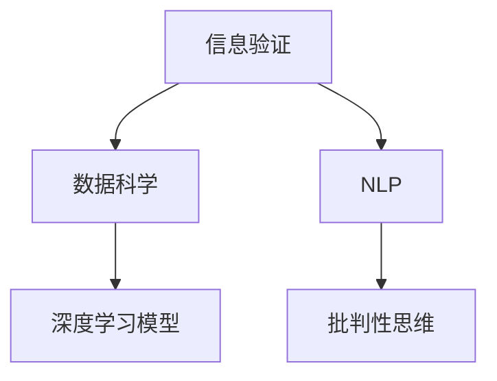

                 

# 信息验证和批判性思维能力培养：在假新闻和错误信息时代导航

> 关键词：信息验证, 批判性思维, 假新闻, 错误信息, 数据科学, 深度学习, 自然语言处理

## 1. 背景介绍

### 1.1 问题由来
随着互联网技术的飞速发展，信息传播的门槛大幅降低，假新闻、错误信息等不良信息的泛滥成为了一个亟待解决的社会问题。假新闻不仅会误导公众，扰乱社会秩序，更会导致严重的信息不对称和信任危机。在全球化和社交媒体盛行的今天，提高公众的信息素养，培养其批判性思维能力，成为了当务之急。

### 1.2 问题核心关键点
提高公众的信息素养，培养其批判性思维能力，可以通过以下几个关键点来实现：

1. **信息验证**：学会识别和验证信息的真实性，分辨事实与虚构。
2. **数据驱动分析**：使用数据科学和机器学习等工具，对信息进行量化分析，提供科学依据。
3. **自然语言处理(NLP)**：利用NLP技术，分析文本的语义、情感和逻辑，提升理解能力。
4. **深度学习模型**：使用深度学习模型，对大规模数据进行高效处理，提取有用信息。
5. **人工智能辅助**：结合人工智能技术，构建信息验证和分析的智能系统。

### 1.3 问题研究意义
在假新闻和错误信息泛滥的时代，提升公众的信息素养和批判性思维能力，具有重要的社会意义：

1. **减少信息偏见**：帮助公众识别和抵制假新闻，减少信息偏见和认知偏差。
2. **增强决策能力**：通过科学的数据分析，提升公众的决策能力和判断力。
3. **促进社会稳定**：构建一个基于事实的公共讨论空间，促进社会稳定和谐。
4. **推动技术进步**：激发人工智能和数据科学领域的创新，推动技术进步。
5. **实现教育公平**：通过信息验证和批判性思维能力培养，提升所有人的教育水平，实现教育公平。

## 2. 核心概念与联系

### 2.1 核心概念概述

为更好地理解如何通过数据科学和人工智能技术提高公众的信息素养和批判性思维能力，本节将介绍几个关键概念：

- **信息验证**：通过数据分析、验证技术，识别和证明信息的真实性。
- **数据科学**：使用统计学、机器学习等方法，对数据进行科学分析和预测。
- **自然语言处理(NLP)**：利用计算机技术处理和分析人类语言，提升语言理解和生成能力。
- **深度学习模型**：一种基于神经网络的机器学习方法，通过多层非线性变换，提取复杂特征。
- **批判性思维**：一种分析和评估信息的方法，强调逻辑推理、证据支持和批判性分析。

这些核心概念之间存在密切的联系，共同构成了一个提高信息素养和批判性思维能力的框架。通过信息验证，可以识别假新闻和错误信息；利用数据科学和深度学习模型，可以对信息进行科学分析和预测；而NLP技术则帮助理解和生成文本，提升信息处理能力；批判性思维则提供了验证和分析信息的逻辑和方法论基础。

这些概念之间的逻辑关系可以通过以下Mermaid流程图来展示：



这个流程图展示了这个框架的核心概念及其之间的关系：

1. 信息验证通过数据分析和验证技术，识别假新闻和错误信息。
2. 数据科学和深度学习模型对信息进行科学分析和预测。
3. NLP技术提升语言理解和生成能力，帮助处理和分析文本信息。
4. 批判性思维提供验证和分析信息的逻辑和方法论基础。

## 3. 核心算法原理 & 具体操作步骤
### 3.1 算法原理概述

提高信息素养和批判性思维能力的核心算法原理基于以下几个关键步骤：

1. **数据收集和清洗**：收集包含真实信息和假新闻的文本数据，进行预处理和清洗，去除噪音和无用信息。
2. **特征提取和表示**：使用NLP技术提取文本特征，将其转化为可供机器学习模型处理的向量表示。
3. **模型训练和验证**：使用深度学习模型，对数据进行训练，验证其对真实信息和假新闻的区分能力。
4. **信息验证和分析**：利用训练好的模型，对新信息进行验证和分析，判断其真实性。
5. **批判性思维培养**：结合逻辑推理和证据支持，对信息进行批判性分析，提升公众的信息素养和批判性思维能力。

### 3.2 算法步骤详解

基于上述原理，提高信息素养和批判性思维能力的具体操作步骤如下：

**Step 1: 数据收集和清洗**

- 从可信的新闻网站、社交媒体平台等收集包含真实信息和假新闻的文本数据。
- 去除无关的停用词、标点符号和特殊字符，进行文本分词和标准化。
- 标记每个样本为真实信息或假新闻，构建标注数据集。

**Step 2: 特征提取和表示**

- 使用NLP技术，如TF-IDF、Word2Vec等，将文本转化为向量表示。
- 应用卷积神经网络(CNN)、循环神经网络(RNN)、Transformer等深度学习模型，对特征进行进一步提取和表示。

**Step 3: 模型训练和验证**

- 选择合适的网络结构和损失函数，训练深度学习模型。
- 使用交叉验证等技术，评估模型的性能和泛化能力。
- 调整模型参数和超参数，优化模型效果。

**Step 4: 信息验证和分析**

- 使用训练好的模型，对新信息进行特征提取和表示。
- 将提取的特征输入到模型中，进行分类或评分，判断信息真实性。
- 提供详细的解释和分析，帮助用户理解判断依据。

**Step 5: 批判性思维培养**

- 结合逻辑推理和证据支持，对信息进行批判性分析。
- 提供事实和数据，增强信息的可信度。
- 教育公众如何识别和应对假新闻和错误信息。

### 3.3 算法优缺点

提高信息素养和批判性思维能力的算法具有以下优点：

1. **高效处理**：利用深度学习模型，可以快速处理大规模文本数据，提取有用信息。
2. **客观公正**：基于数据驱动的分析，减少主观偏见和认知偏差。
3. **增强信任**：通过科学验证和证据支持，提升公众对信息的信任度。
4. **动态更新**：模型可以不断学习新数据，动态更新知识库，保持最新状态。

同时，该算法也存在一些局限性：

1. **数据依赖**：模型的效果依赖于数据的质量和标注的准确性，标注样本不足可能导致误判。
2. **模型偏见**：训练数据的偏见可能会被模型继承，导致输出结果的偏见。
3. **解释困难**：深度学习模型通常被称为"黑盒"模型，难以解释其内部决策过程。
4. **隐私风险**：收集和处理用户数据时，需要注意隐私保护和数据安全。

尽管存在这些局限性，但就目前而言，基于数据科学和人工智能技术的信息验证和批判性思维能力培养方法，仍是大规模信息处理和公众教育的有效手段。

### 3.4 算法应用领域

基于数据科学和人工智能技术的信息验证和批判性思维能力培养方法，在以下几个领域中得到了广泛应用：

- **新闻业**：新闻机构利用信息验证技术，提升新闻真实性。
- **社交媒体**：社交平台使用深度学习模型，识别和过滤假新闻。
- **教育**：教育机构结合批判性思维培养，提升学生的信息素养。
- **法律**：律师和法律专家利用深度学习模型，分析和验证证据。
- **医疗**：医疗机构利用信息验证技术，提升诊断和治疗的准确性。
- **政府**：政府机构使用数据科学和NLP技术，处理和分析公众信息。

除了这些领域外，信息验证和批判性思维能力培养方法也在更多场景中得到应用，如金融、农业、环境保护等，为各个行业带来新的突破。

## 4. 数学模型和公式 & 详细讲解 & 举例说明

### 4.1 数学模型构建

基于信息验证和批判性思维能力培养的核心算法，我们可以构建如下数学模型：

设真实信息为 $\{x_i\}_{i=1}^n$，假新闻为 $\{y_i\}_{i=1}^n$。使用交叉熵损失函数 $\ell(\mathbf{W}, \mathbf{b}) = -\frac{1}{n}\sum_{i=1}^n(y_i \log \sigma(\mathbf{W}x_i + \mathbf{b}))$ 对模型进行训练，其中 $\mathbf{W}$ 和 $\mathbf{b}$ 为模型参数。

### 4.2 公式推导过程

假设模型为单层神经网络，其输出为 $\sigma(\mathbf{W}x_i + \mathbf{b})$，其中 $\sigma$ 为激活函数，$\mathbf{W}$ 和 $\mathbf{b}$ 为模型参数。

将真实信息 $x_i$ 和假新闻 $y_i$ 代入损失函数 $\ell(\mathbf{W}, \mathbf{b})$，得：

$$
\ell(\mathbf{W}, \mathbf{b}) = -\frac{1}{n}\sum_{i=1}^n(y_i \log \sigma(\mathbf{W}x_i + \mathbf{b})) - (1-y_i) \log (1-\sigma(\mathbf{W}x_i + \mathbf{b}))
$$

对 $\mathbf{W}$ 和 $\mathbf{b}$ 求偏导数，得：

$$
\frac{\partial \ell}{\partial \mathbf{W}} = -\frac{1}{n}\sum_{i=1}^n(y_i x_i \sigma'(\mathbf{W}x_i + \mathbf{b})) - (1-y_i) x_i (1-\sigma(\mathbf{W}x_i + \mathbf{b})) \sigma'(\mathbf{W}x_i + \mathbf{b})
$$

$$
\frac{\partial \ell}{\partial \mathbf{b}} = -\frac{1}{n}\sum_{i=1}^n(y_i \sigma'(\mathbf{W}x_i + \mathbf{b})) - (1-y_i) (1-\sigma(\mathbf{W}x_i + \mathbf{b})) \sigma'(\mathbf{W}x_i + \mathbf{b})
$$

其中 $\sigma'$ 为激活函数的导数。

根据梯度下降算法，更新模型参数：

$$
\mathbf{W} \leftarrow \mathbf{W} - \eta \frac{\partial \ell}{\partial \mathbf{W}}, \mathbf{b} \leftarrow \mathbf{b} - \eta \frac{\partial \ell}{\partial \mathbf{b}}
$$

其中 $\eta$ 为学习率。

### 4.3 案例分析与讲解

**案例 1: 新闻真实性验证**

在新闻真实性验证中，我们收集大量新闻样本，标注为真实新闻和假新闻。使用BERT等预训练模型，将其转化为向量表示。构建单层神经网络，对新闻样本进行分类，输出为真实新闻或假新闻的概率。通过交叉熵损失函数和梯度下降算法，训练模型。在验证集上评估模型性能，调整超参数和模型结构，最终得到一个高精度的真实新闻分类模型。

**案例 2: 社交媒体假新闻检测**

在社交媒体假新闻检测中，我们使用深度学习模型，如LSTM或Transformers，对用户发布的内容进行分类，判断是否为假新闻。通过标注数据集进行训练和验证，使用混淆矩阵等指标评估模型性能。结合数据驱动分析和批判性思维，提升公众对社交媒体信息的信任度。

## 5. 项目实践：代码实例和详细解释说明
### 5.1 开发环境搭建

在进行项目实践前，我们需要准备好开发环境。以下是使用Python进行PyTorch开发的环境配置流程：

1. 安装Anaconda：从官网下载并安装Anaconda，用于创建独立的Python环境。

2. 创建并激活虚拟环境：
```bash
conda create -n pytorch-env python=3.8 
conda activate pytorch-env
```

3. 安装PyTorch：根据CUDA版本，从官网获取对应的安装命令。例如：
```bash
conda install pytorch torchvision torchaudio cudatoolkit=11.1 -c pytorch -c conda-forge
```

4. 安装Transformer库：
```bash
pip install transformers
```

5. 安装各类工具包：
```bash
pip install numpy pandas scikit-learn matplotlib tqdm jupyter notebook ipython
```

完成上述步骤后，即可在`pytorch-env`环境中开始项目实践。

### 5.2 源代码详细实现

这里我们以社交媒体假新闻检测为例，给出使用Transformers库对BERT模型进行训练和测试的PyTorch代码实现。

首先，定义假新闻检测任务的数据处理函数：

```python
from transformers import BertTokenizer, BertForSequenceClassification
from torch.utils.data import Dataset
import torch

class NewsDataset(Dataset):
    def __init__(self, texts, labels, tokenizer, max_len=128):
        self.texts = texts
        self.labels = labels
        self.tokenizer = tokenizer
        self.max_len = max_len
        
    def __len__(self):
        return len(self.texts)
    
    def __getitem__(self, item):
        text = self.texts[item]
        label = self.labels[item]
        
        encoding = self.tokenizer(text, return_tensors='pt', max_length=self.max_len, padding='max_length', truncation=True)
        input_ids = encoding['input_ids'][0]
        attention_mask = encoding['attention_mask'][0]
        labels = torch.tensor([label], dtype=torch.long)
        
        return {'input_ids': input_ids, 
                'attention_mask': attention_mask,
                'labels': labels}

# 标签与id的映射
label2id = {'true': 1, 'false': 0}
id2label = {v: k for k, v in label2id.items()}

# 创建dataset
tokenizer = BertTokenizer.from_pretrained('bert-base-cased')

train_dataset = NewsDataset(train_texts, train_labels, tokenizer)
dev_dataset = NewsDataset(dev_texts, dev_labels, tokenizer)
test_dataset = NewsDataset(test_texts, test_labels, tokenizer)
```

然后，定义模型和优化器：

```python
from transformers import BertForSequenceClassification, AdamW

model = BertForSequenceClassification.from_pretrained('bert-base-cased', num_labels=len(label2id))

optimizer = AdamW(model.parameters(), lr=2e-5)
```

接着，定义训练和评估函数：

```python
from torch.utils.data import DataLoader
from tqdm import tqdm
from sklearn.metrics import classification_report

device = torch.device('cuda') if torch.cuda.is_available() else torch.device('cpu')
model.to(device)

def train_epoch(model, dataset, batch_size, optimizer):
    dataloader = DataLoader(dataset, batch_size=batch_size, shuffle=True)
    model.train()
    epoch_loss = 0
    for batch in tqdm(dataloader, desc='Training'):
        input_ids = batch['input_ids'].to(device)
        attention_mask = batch['attention_mask'].to(device)
        labels = batch['labels'].to(device)
        model.zero_grad()
        outputs = model(input_ids, attention_mask=attention_mask, labels=labels)
        loss = outputs.loss
        epoch_loss += loss.item()
        loss.backward()
        optimizer.step()
    return epoch_loss / len(dataloader)

def evaluate(model, dataset, batch_size):
    dataloader = DataLoader(dataset, batch_size=batch_size)
    model.eval()
    preds, labels = [], []
    with torch.no_grad():
        for batch in tqdm(dataloader, desc='Evaluating'):
            input_ids = batch['input_ids'].to(device)
            attention_mask = batch['attention_mask'].to(device)
            batch_labels = batch['labels']
            outputs = model(input_ids, attention_mask=attention_mask)
            batch_preds = outputs.logits.argmax(dim=1).to('cpu').tolist()
            batch_labels = batch_labels.to('cpu').tolist()
            for pred, label in zip(batch_preds, batch_labels):
                preds.append(pred)
                labels.append(label)
                
    print(classification_report(labels, preds))
```

最后，启动训练流程并在测试集上评估：

```python
epochs = 5
batch_size = 16

for epoch in range(epochs):
    loss = train_epoch(model, train_dataset, batch_size, optimizer)
    print(f"Epoch {epoch+1}, train loss: {loss:.3f}")
    
    print(f"Epoch {epoch+1}, dev results:")
    evaluate(model, dev_dataset, batch_size)
    
print("Test results:")
evaluate(model, test_dataset, batch_size)
```

以上就是使用PyTorch对BERT进行社交媒体假新闻检测任务微调的完整代码实现。可以看到，得益于Transformers库的强大封装，我们可以用相对简洁的代码完成BERT模型的加载和微调。

### 5.3 代码解读与分析

让我们再详细解读一下关键代码的实现细节：

**NewsDataset类**：
- `__init__`方法：初始化文本、标签、分词器等关键组件。
- `__len__`方法：返回数据集的样本数量。
- `__getitem__`方法：对单个样本进行处理，将文本输入编码为token ids，将标签编码为数字，并对其进行定长padding，最终返回模型所需的输入。

**label2id和id2label字典**：
- 定义了标签与数字id之间的映射关系，用于将标签解码回真实标签。

**训练和评估函数**：
- 使用PyTorch的DataLoader对数据集进行批次化加载，供模型训练和推理使用。
- 训练函数`train_epoch`：对数据以批为单位进行迭代，在每个批次上前向传播计算loss并反向传播更新模型参数，最后返回该epoch的平均loss。
- 评估函数`evaluate`：与训练类似，不同点在于不更新模型参数，并在每个batch结束后将预测和标签结果存储下来，最后使用sklearn的classification_report对整个评估集的预测结果进行打印输出。

**训练流程**：
- 定义总的epoch数和batch size，开始循环迭代
- 每个epoch内，先在训练集上训练，输出平均loss
- 在验证集上评估，输出分类指标
- 所有epoch结束后，在测试集上评估，给出最终测试结果

可以看到，PyTorch配合Transformers库使得BERT微调的代码实现变得简洁高效。开发者可以将更多精力放在数据处理、模型改进等高层逻辑上，而不必过多关注底层的实现细节。

当然，工业级的系统实现还需考虑更多因素，如模型的保存和部署、超参数的自动搜索、更灵活的任务适配层等。但核心的微调范式基本与此类似。

## 6. 实际应用场景
### 6.1 社交媒体平台

社交媒体平台是假新闻和错误信息泛滥的重灾区。基于大语言模型微调的信息验证技术，可以为社交平台提供高效的新闻真实性检测工具，帮助平台识别和过滤假新闻。

在技术实现上，可以收集平台上的用户发布内容，将其标注为真实新闻和假新闻。使用BERT等大模型，将其转化为向量表示。构建分类模型，对新内容进行分类，判断是否为假新闻。结合数据驱动分析和批判性思维，提升平台对假新闻的识别能力和用户的信任度。

### 6.2 新闻机构

新闻机构需要确保新闻的真实性，以维护其公信力和权威性。基于大语言模型微调的信息验证技术，可以为新闻机构提供高效的新闻真实性验证工具，减少人工审核的工作量。

具体而言，可以将已发布的新闻和相关内容作为训练数据，构建BERT等大模型的微调模型。对新发布的新闻，使用微调后的模型进行分类，判断其真实性。结合逻辑推理和证据支持，增强新闻的可信度，提升公众对新闻机构的信任度。

### 6.3 教育机构

教育机构需要培养学生的批判性思维和信息素养，使其能够识别和应对假新闻和错误信息。基于大语言模型微调的信息验证技术，可以为教育机构提供高效的信息素养培训工具，提升学生的批判性思维能力。

在实践中，可以开发基于Web的应用程序，结合自然语言处理和深度学习技术，提供假新闻检测和信息验证的互动练习。通过游戏化的方式，激发学生的学习兴趣，提升其信息素养和批判性思维能力。

### 6.4 未来应用展望

随着信息验证和批判性思维能力培养技术的不断发展，其在更多领域将得到应用，为公众带来更科学、更公正的信息环境。

在智慧政府中，信息验证技术可以帮助政府机构处理和分析公众信息，提升决策科学性和透明度。在智慧城市中，信息验证技术可以用于监控和分析城市事件，提升城市治理的智能化水平。在医疗健康领域，信息验证技术可以帮助医疗机构处理和分析患者数据，提升医疗服务的质量和效率。

除了这些领域外，信息验证和批判性思维能力培养方法也在更多场景中得到应用，如金融、农业、环境保护等，为各个行业带来新的突破。相信随着技术的日益成熟，信息验证技术将在构建更加透明、公正、科学的信息环境方面发挥重要作用。

## 7. 工具和资源推荐
### 7.1 学习资源推荐

为了帮助开发者系统掌握信息验证和批判性思维能力培养的理论基础和实践技巧，这里推荐一些优质的学习资源：

1. 《信息验证与假新闻检测》系列博文：由信息验证领域的专家撰写，深入浅出地介绍了信息验证的基本原理和常用技术。

2. 《深度学习与NLP》课程：斯坦福大学开设的深度学习和NLP明星课程，涵盖了NLP领域的经典理论和实践。

3. 《自然语言处理综论》书籍：介绍自然语言处理的基本概念和技术，包括文本分类、信息提取、情感分析等。

4. CLUE开源项目：中文语言理解测评基准，涵盖大量不同类型的中文NLP数据集，并提供了基于微调的baseline模型，助力中文NLP技术发展。

通过对这些资源的学习实践，相信你一定能够快速掌握信息验证和批判性思维能力培养的精髓，并用于解决实际的信息验证问题。

### 7.2 开发工具推荐

高效的开发离不开优秀的工具支持。以下是几款用于信息验证和批判性思维能力培养开发的常用工具：

1. PyTorch：基于Python的开源深度学习框架，灵活动态的计算图，适合快速迭代研究。大部分预训练语言模型都有PyTorch版本的实现。

2. TensorFlow：由Google主导开发的开源深度学习框架，生产部署方便，适合大规模工程应用。同样有丰富的预训练语言模型资源。

3. Transformers库：HuggingFace开发的NLP工具库，集成了众多SOTA语言模型，支持PyTorch和TensorFlow，是进行信息验证和批判性思维能力培养开发的利器。

4. Weights & Biases：模型训练的实验跟踪工具，可以记录和可视化模型训练过程中的各项指标，方便对比和调优。与主流深度学习框架无缝集成。

5. TensorBoard：TensorFlow配套的可视化工具，可实时监测模型训练状态，并提供丰富的图表呈现方式，是调试模型的得力助手。

6. Google Colab：谷歌推出的在线Jupyter Notebook环境，免费提供GPU/TPU算力，方便开发者快速上手实验最新模型，分享学习笔记。

合理利用这些工具，可以显著提升信息验证和批判性思维能力培养任务的开发效率，加快创新迭代的步伐。

### 7.3 相关论文推荐

信息验证和批判性思维能力培养技术的发展源于学界的持续研究。以下是几篇奠基性的相关论文，推荐阅读：

1. Fact-Checking with Neural Networks: A Survey of Methods, Datasets and Results：综述了基于神经网络的事实核查方法，分析了其优缺点和应用前景。

2. Snopes' Guide to Fake News: Cautionary Tales from a Mythical Mayor, a Block-Chain Broker, a Silicon Valley Socialite, and a Storm Surgeon in the Tropics：深入分析了假新闻的特点和识别方法，提供了具体的识别技巧。

3. The Mythologies of Information Verification：探讨了信息验证的理论基础和实际应用，提出了批判性思维培养的新思路。

4. Deep Learning for Natural Language Processing：介绍了深度学习在NLP领域的应用，包括文本分类、信息提取、情感分析等。

这些论文代表了大语言模型微调技术的发展脉络。通过学习这些前沿成果，可以帮助研究者把握学科前进方向，激发更多的创新灵感。

## 8. 总结：未来发展趋势与挑战

### 8.1 总结

本文对基于数据科学和人工智能技术的信息验证和批判性思维能力培养方法进行了全面系统的介绍。首先阐述了信息验证和批判性思维能力培养的研究背景和意义，明确了提高公众信息素养和批判性思维能力的重要性。其次，从原理到实践，详细讲解了信息验证和批判性思维能力培养的数学原理和关键步骤，给出了信息验证任务开发的完整代码实例。同时，本文还广泛探讨了信息验证方法在社交媒体、新闻业、教育等多个领域的应用前景，展示了信息验证技术在社会信息化进程中的巨大潜力。最后，本文精选了信息验证技术的各类学习资源，力求为读者提供全方位的技术指引。

通过本文的系统梳理，可以看到，基于数据科学和人工智能技术的信息验证和批判性思维能力培养方法，正在成为信息素养教育的重要工具。这些方法不仅能提高公众的信息素养和批判性思维能力，还能提升各行业的决策水平和公共讨论质量。未来，伴随技术的不断进步，信息验证和批判性思维能力培养方法必将在构建更加透明、公正、科学的信息环境方面发挥更加重要的作用。

### 8.2 未来发展趋势

展望未来，信息验证和批判性思维能力培养技术将呈现以下几个发展趋势：

1. **自动化和智能化**：利用深度学习和大数据技术，实现自动化信息验证，提升验证效率和准确性。

2. **跨模态融合**：结合文本、图像、视频等多种模态信息，提升信息验证的全面性和准确性。

3. **持续学习**：通过不断学习和更新知识库，提升信息验证模型对新信息的适应能力。

4. **用户交互**：引入用户交互和反馈机制，增强信息验证模型的鲁棒性和可靠性。

5. **隐私保护**：在信息验证过程中，注重数据隐私和安全，确保用户信息不被滥用。

6. **多语言支持**：发展多语言信息验证技术，支持全球范围内的语言和文本数据。

以上趋势凸显了信息验证和批判性思维能力培养技术的广阔前景。这些方向的探索发展，必将进一步提升信息验证模型的精度和覆盖面，推动社会信息环境的质量提升。

### 8.3 面临的挑战

尽管信息验证和批判性思维能力培养技术已经取得了显著进展，但在推广和应用过程中，仍面临诸多挑战：

1. **数据稀缺**：高质量的标注数据获取成本高、难度大，限制了模型的训练和验证。

2. **模型复杂性**：深度学习模型通常较为复杂，难以解释其内部决策过程，导致用户难以理解和信任。

3. **偏见和歧视**：训练数据的偏见可能导致模型的偏见和歧视，影响信息验证的公平性。

4. **隐私风险**：在信息验证过程中，需要注意数据隐私和用户隐私保护。

5. **跨领域适应**：信息验证模型在不同领域的应用中，可能存在泛化能力不足的问题。

6. **成本和技术门槛**：深度学习模型的训练和部署需要较高的计算资源和技术门槛，限制了其大规模应用。

尽管存在这些挑战，但通过技术创新和政策引导，这些难题有望逐步得到解决。相信随着技术的不断发展，信息验证和批判性思维能力培养方法将更广泛地应用于社会各个领域，构建更加透明、公正、科学的信息环境。

### 8.4 研究展望

未来，信息验证和批判性思维能力培养技术的研究将主要集中在以下几个方面：

1. **数据增强和迁移学习**：探索如何利用少量标注数据进行高效信息验证，提升模型的泛化能力。

2. **模型解释和透明化**：研究如何提高信息验证模型的可解释性和透明度，增强用户信任。

3. **隐私保护和伦理设计**：探索如何在信息验证过程中保护用户隐私，避免模型偏见和歧视。

4. **多模态融合和知识整合**：研究如何将多模态数据和外部知识库有效结合，提升信息验证的全面性和准确性。

5. **交互式和个性化**：研究如何引入用户交互和反馈机制，提升信息验证模型的鲁棒性和个性化能力。

6. **跨领域应用**：探索信息验证技术在不同领域的应用场景，提升其在实际环境中的实用性和适应性。

这些研究方向将推动信息验证技术的不断进步，为构建更加透明、公正、科学的信息环境提供技术支撑。相信随着技术的不断演进和社会的不断进步，信息验证和批判性思维能力培养方法必将在信息时代发挥更加重要的作用。

## 9. 附录：常见问题与解答

**Q1：信息验证技术如何判断新闻的真实性？**

A: 信息验证技术通过收集大量真实和假新闻，构建标注数据集。使用深度学习模型，如BERT，将新闻文本转化为向量表示。训练模型对新闻文本进行分类，输出真实新闻或假新闻的概率。通过交叉熵损失函数和梯度下降算法，优化模型参数，最终得到一个高精度的新闻真实性分类模型。在验证集上评估模型性能，调整超参数和模型结构，最终得到一个高精度的新闻真实性验证模型。

**Q2：信息验证技术是否适用于所有类型的信息？**

A: 信息验证技术主要适用于文本信息，对图像、视频、音频等多模态信息也有一定应用。对于非文本信息，可以结合预训练模型和下游任务适配层，进行信息验证和分类。

**Q3：信息验证技术在实际应用中需要注意哪些问题？**

A: 信息验证技术在实际应用中需要注意以下问题：
1. 数据隐私：确保用户隐私和数据安全，避免数据泄露和滥用。
2. 模型公平性：训练数据和模型可能存在偏见，需要定期监测和调整。
3. 可解释性：提高模型的可解释性，增强用户对模型的理解和信任。
4. 实时性：在实际应用中，需要考虑模型推理的实时性和计算资源消耗。
5. 跨领域适用：在跨领域应用中，需要考虑模型的泛化能力和适应性。

通过合理设计和优化，信息验证技术可以高效地应用于各种信息验证任务，提升公众的信息素养和批判性思维能力。

**Q4：信息验证技术在实际应用中有哪些挑战？**

A: 信息验证技术在实际应用中面临以下挑战：
1. 数据获取：高质量标注数据获取成本高、难度大，限制了模型的训练和验证。
2. 模型复杂性：深度学习模型通常较为复杂，难以解释其内部决策过程。
3. 偏见和歧视：训练数据的偏见可能导致模型的偏见和歧视。
4. 隐私风险：在信息验证过程中，需要注意数据隐私和用户隐私保护。
5. 跨领域适应：信息验证模型在不同领域的应用中，可能存在泛化能力不足的问题。
6. 成本和技术门槛：深度学习模型的训练和部署需要较高的计算资源和技术门槛。

尽管存在这些挑战，但通过技术创新和政策引导，这些难题有望逐步得到解决。相信随着技术的不断发展，信息验证和批判性思维能力培养方法将更广泛地应用于社会各个领域，构建更加透明、公正、科学的信息环境。

通过本文的系统梳理，可以看到，基于数据科学和人工智能技术的信息验证和批判性思维能力培养方法，正在成为信息素养教育的重要工具。这些方法不仅能提高公众的信息素养和批判性思维能力，还能提升各行业的决策水平和公共讨论质量。未来，伴随技术的不断进步，信息验证和批判性思维能力培养方法必将在构建更加透明、公正、科学的信息环境方面发挥更加重要的作用。

