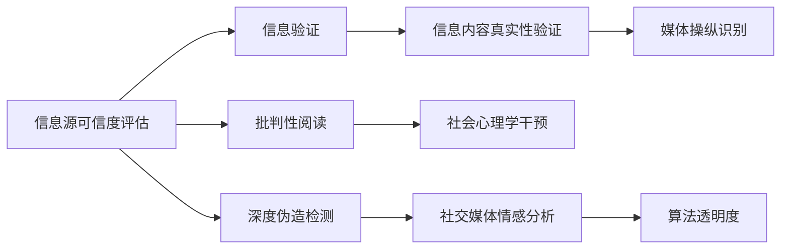

                 

## 1. 背景介绍

在信息爆炸的现代社会，假新闻、深度伪造、误导性信息层出不穷。这些“信息病毒”不仅侵蚀了公众对真实世界的认知，还可能引发社会动荡、影响政治选举。面对信息洪流，如何培养批判性思维，识别和验证信息的真实性，成为当前社会的一项重要课题。

### 1.1 问题由来
随着互联网和社交媒体的普及，信息传播的门槛降低，人人都可能成为信息的生产者和传播者。这使得虚假信息更容易被快速传播，达到以往难以想象的规模。如“Deepfakes”等深度伪造技术的发展，进一步加剧了信息鉴别的难度。

同时，大数据和算法技术的成熟，使得某些组织或个人可以借助数据分析和机器学习手段，精准操纵公众情绪，影响社会舆论。在政治、经济、文化等各个领域，都出现了利用算法进行信息操控的案例。

### 1.2 问题核心关键点
信息验证和批判性阅读的核心在于提升个体对信息的辨识能力，具体包括：

- **信息源可信度评估**：判别信息来源的可靠性和权威性，如权威机构、专业媒体、官方发布等。
- **信息内容真实性验证**：使用各种方法检测和证明信息的真实性，如交叉验证、逆向查证等。
- **媒体操纵识别**：通过识别和分析媒体内容的风格、动机、语言策略等，揭示其潜在的操控意图。
- **社会心理学干预**：运用心理学知识，提高公众对信息操控的心理免疫能力，减少误导性信息的感染。

## 2. 核心概念与联系

### 2.1 核心概念概述

为了更系统地理解和应对信息真伪问题，本节将介绍以下几个关键概念及其相互关联：

- **信息验证(Information Verification)**：通过技术手段和逻辑推理，对信息源和内容进行真实性检查，保证信息可信度。
- **批判性阅读(Critical Reading)**：通过深度分析和质疑，批判性地评估信息内容的质量和准确性，识别可能的偏见和操控。
- **深度伪造(Deepfakes)**：利用人工智能技术生成的视觉、音频、文本等假冒内容，用于误导和欺骗。
- **社交媒体情感分析(Social Media Sentiment Analysis)**：分析社交媒体上的情感倾向和舆论动态，揭示信息操控的痕迹。
- **算法透明度(Algorithm Transparency)**：提升算法决策过程的可解释性，防止算法被操纵用于信息操控。

这些概念之间通过逻辑关系构成了一个相互联系的信息导航系统。例如，信息源可信度评估是信息验证的基础，而批判性阅读则是在此基础上，进一步提升信息理解的能力。深度伪造和社交媒体情感分析则是识别信息操控的重要手段，而算法透明度则是预防信息操控的关键环节。

### 2.2 核心概念原理和架构的 Mermaid 流程图



## 3. 核心算法原理 & 具体操作步骤

### 3.1 算法原理概述

信息验证和批判性阅读的核心算法原理涉及自然语言处理(NLP)、机器学习和深度学习等多个领域。具体算法包括以下几个步骤：

1. **信息源可信度评估**：利用Web图谱、社交网络分析等技术，评估信息源的权威性和可信度。
2. **信息内容真实性验证**：结合文本相似度、时间戳、交叉引用等方法，检测信息内容是否存在篡改。
3. **媒体操纵识别**：通过情感分析、话题追踪、情绪建模等技术，揭示信息背后潜在的操控动机和策略。
4. **深度伪造检测**：使用图像处理、语音识别、文本比对等技术，识别和排除视觉、听觉、文本等方面的伪造内容。

### 3.2 算法步骤详解

以下以信息源可信度评估为例，详细讲解其算法步骤：

**Step 1: 数据预处理**
- 收集网络上的新闻、文章、社交媒体帖子等数据，并进行文本清洗、去噪等预处理操作。
- 使用Word2Vec、BERT等预训练模型对文本进行编码，提取语义信息。

**Step 2: 构建图谱模型**
- 使用知识图谱或社会网络模型，建立信息源与其他节点（如专家、媒体、政府机构）之间的链接关系。
- 计算各节点的中心性、权威性、可信度等指标。

**Step 3: 评估可信度**
- 根据节点的权威性和可信度，综合评估信息源的可靠性。
- 使用异常检测算法，识别并排除低可信度或可疑的信息源。

**Step 4: 结果输出**
- 将可信度评估结果可视化，以图形化方式展示信息源的可靠性。
- 为每个信息源分配可信度分数，提供直观的参考依据。

### 3.3 算法优缺点

基于上述信息源可信度评估的算法，具有以下优点：

- **自动化高效**：使用自动化算法进行信息源评估，减少人工成本，提高效率。
- **全面覆盖**：覆盖了多种信息源和类型，能够对大量信息进行评估。
- **结果可视化**：以图形化的方式展示评估结果，直观易懂。

同时，该算法也存在以下缺点：

- **数据偏差**：依赖于网络数据的质量和完整性，可能存在信息源遗漏或数据偏差。
- **算法复杂性**：涉及多种算法和数据处理流程，算法实现较为复杂。
- **动态更新**：信息源和网络环境动态变化，需要持续更新模型以保持评估结果的实时性。

### 3.4 算法应用领域

信息验证和批判性阅读的算法主要应用于以下几个领域：

- **新闻媒体评估**：对新闻网站、自媒体账号等的信息源进行可信度评估，帮助公众识别可靠的新闻媒体。
- **公共舆论监测**：利用社交媒体情感分析技术，监测社会舆论动态，识别和遏制舆论操控行为。
- **网络安全防护**：识别和防御深度伪造、钓鱼网站等网络威胁，保护用户信息安全。
- **政府决策支持**：对政策新闻、官方发布等信息进行真实性验证，为政府决策提供参考依据。
- **学术研究验证**：对学术论文、研究报告等信息进行可信度评估，确保科研工作的严谨性。

## 4. 数学模型和公式 & 详细讲解

### 4.1 数学模型构建

为了详细阐述信息源可信度评估的数学模型，我们假设信息源 $S_i$ 与其他节点 $N_j$ 之间的关系可以表示为一个权重矩阵 $W_{ij}$，其中 $W_{ij} > 0$ 表示两者之间存在正向连接，$W_{ij} < 0$ 表示负向连接。

假设 $S_i$ 的权威性为 $A_i$，可信度为 $T_i$，其可信度综合得分 $C_i$ 可以通过下式计算：

$$
C_i = \sum_{j=1}^n W_{ij}(A_j + T_j)
$$

其中 $n$ 为节点数量。

### 4.2 公式推导过程

**Step 1: 节点权重计算**
根据信息源与其他节点之间的互动情况，计算权重 $W_{ij}$。假设信息源 $S_i$ 与 $N_j$ 之间的互动次数为 $k_{ij}$，则 $W_{ij}$ 可以表示为：

$$
W_{ij} = \frac{k_{ij}}{k_i^+ + k_i^-}
$$

其中 $k_i^+$ 和 $k_i^-$ 分别为 $S_i$ 与其他节点的正向和负向互动次数。

**Step 2: 权威性评估**
权威性 $A_i$ 可以根据节点 $N_j$ 的权威性 $A_j$ 和权重 $W_{ij}$ 计算得到：

$$
A_i = \sum_{j=1}^n W_{ij}A_j
$$

**Step 3: 可信度评估**
可信度 $T_i$ 可以根据节点 $N_j$ 的可信度 $T_j$ 和权重 $W_{ij}$ 计算得到：

$$
T_i = \sum_{j=1}^n W_{ij}T_j
$$

**Step 4: 综合可信度计算**
将权威性和可信度结合，计算信息源的综合可信度 $C_i$：

$$
C_i = A_i + T_i
$$

### 4.3 案例分析与讲解

假设我们有两个信息源 $S_1$ 和 $S_2$，它们的权威性分别为 $A_1=5$ 和 $A_2=3$，可信度分别为 $T_1=4$ 和 $T_2=2$。根据公式计算它们的综合可信度：

- $C_1 = A_1 + T_1 = 5 + 4 = 9$
- $C_2 = A_2 + T_2 = 3 + 2 = 5$

通过权重矩阵 $W$ 计算两个信息源与其他节点的互动情况，例如：

| $W_{ij}$ | $N_1$ | $N_2$ | $N_3$ |
| --- | --- | --- | --- |
| $S_1$ | 0.7 | 0.2 | 0.1 |
| $S_2$ | 0.5 | 0.4 | 0.1 |

则综合可信度计算结果如下：

- $C_1 = 0.7 \times (5+4) + 0.2 \times (3+2) = 8.8$
- $C_2 = 0.5 \times (5+3) + 0.4 \times (3+2) = 5.8$

最终，我们可以对信息源 $S_1$ 和 $S_2$ 进行可信度排序，标记更可信的信息源。

## 5. 项目实践：代码实例和详细解释说明

### 5.1 开发环境搭建

在进行信息验证和批判性阅读的实践前，我们需要准备好开发环境。以下是使用Python进行Web挖掘和数据处理的开发环境配置流程：

1. 安装Anaconda：从官网下载并安装Anaconda，用于创建独立的Python环境。

2. 创建并激活虚拟环境：
```bash
conda create -n info_verification python=3.8 
conda activate info_verification
```

3. 安装相关工具包：
```bash
pip install pandas numpy requests bs4 beautifulsoup4 nltk scikit-learn
```

4. 配置Web挖掘工具：
- 使用Selenium库实现Web页面自动化抓取
- 配置ChromeDriver或其他浏览器驱动
- 使用Scrapy或BeautifulSoup进行HTML解析

完成上述步骤后，即可在`info_verification`环境中开始实践。

### 5.2 源代码详细实现

下面以Web爬虫和信息源可信度评估为例，给出Python代码实现。

首先，定义Web爬虫函数：

```python
from selenium import webdriver
from bs4 import BeautifulSoup

def scrape_info_source(url):
    driver = webdriver.Chrome()
    driver.get(url)
    soup = BeautifulSoup(driver.page_source, 'html.parser')
    driver.quit()
    return soup
```

然后，实现信息源可信度评估的代码：

```python
from sklearn.metrics.pairwise import cosine_similarity

def calculate_node_weight(k_i_plus, k_i_minus, k_j_plus, k_j_minus):
    if k_i_plus == 0 or k_i_minus == 0:
        return 0
    return (k_j_plus + k_j_minus) / (k_i_plus + k_i_minus)

def calculate_authority(A_j, W_ij):
    return sum([W_ij[i][j] * A_j[i] for i in range(len(A_j))])

def calculate_reliability(T_j, W_ij):
    return sum([W_ij[i][j] * T_j[i] for i in range(len(T_j))])

def calculate_canreliability(A_i, T_i):
    return A_i + T_i

# 模拟数据
A = [5, 3, 4]
T = [4, 2, 3]
k_i_plus = [3, 2, 1]
k_i_minus = [1, 0, 0]
k_j_plus = [1, 1, 0]
k_j_minus = [1, 1, 1]

W_ij = [[calculate_node_weight(k_i_plus, k_i_minus, k_j_plus, k_j_minus) for j in range(len(k_j_plus))] for i in range(len(k_i_plus))]

# 计算权威性和可信度
A_i = [calculate_authority(A_j, W_ij) for j in range(len(A_j))]
T_i = [calculate_reliability(T_j, W_ij) for j in range(len(T_j))]

# 计算综合可信度
C_i = [calculate_canreliability(A_i[i], T_i[i]) for i in range(len(A_i))]

print(C_i)
```

### 5.3 代码解读与分析

让我们再详细解读一下关键代码的实现细节：

**scrape_info_source函数**：
- 使用Selenium库打开指定URL，并使用BeautifulSoup解析页面内容。
- 最终返回解析后的HTML对象。

**信息源可信度计算**：
- 定义了计算节点权重的函数 `calculate_node_weight`，用于根据互动次数计算权重。
- 使用权威性和可信度计算函数 `calculate_authority` 和 `calculate_reliability`，计算每个节点的权威性和可信度。
- 综合可信度计算函数 `calculate_canreliability` 将权威性和可信度结合，得到信息源的综合可信度。

**模拟数据处理**：
- 模拟三个信息源和四个节点之间的互动情况，计算权重矩阵 `W_ij`。
- 计算每个信息源的权威性和可信度，并得到综合可信度 `C_i`。

通过上述代码，我们实现了信息源可信度的计算过程。实际应用中，需要进一步优化和扩展该算法，以适应更复杂的数据和任务需求。

## 6. 实际应用场景

### 6.1 新闻媒体评估

在新闻媒体评估中，可以使用信息源可信度评估算法对不同新闻网站和自媒体账号进行可信度排序，帮助公众识别可靠的新闻媒体。例如，通过爬虫抓取新闻网站发布的新闻，计算其权威性和可信度，并在平台进行展示，提供给用户参考。

### 6.2 公共舆论监测

在公共舆论监测中，可以利用社交媒体情感分析技术，监测网络上的情感动态，识别和遏制信息操控行为。例如，通过爬虫获取社交媒体上的公开评论和讨论，分析情感倾向和舆论焦点，及时发现和应对可能的信息操控行为。

### 6.3 网络安全防护

在网络安全防护中，可以通过深度伪造检测算法，识别和排除视觉、音频、文本等方面的伪造内容，保护用户信息安全。例如，使用图像处理技术检测图片中的假冒人物，使用语音识别技术识别假冒音频，使用文本比对技术识别假冒文本。

### 6.4 未来应用展望

随着信息验证和批判性阅读技术的不断发展，未来将在更多领域得到应用，为公众提供更可靠的信息参考。

在政府决策中，利用信息源可信度评估算法，对政策新闻、官方发布等信息进行真实性验证，确保决策的科学性和公正性。

在学术研究中，通过信息内容真实性验证技术，对学术论文和研究报告进行可靠性评估，确保科研工作的严谨性。

在企业数据管理中，利用数据可信度评估技术，对内部和外部数据进行质量检查，提升数据资产的价值和安全性。

总之，信息验证和批判性阅读技术将在社会各个领域发挥重要作用，提高公众对信息的辨识能力，防范信息操控，维护社会公正和稳定。

## 7. 工具和资源推荐

### 7.1 学习资源推荐

为了帮助开发者系统掌握信息验证和批判性阅读的理论基础和实践技巧，这里推荐一些优质的学习资源：

1. 《Python网络爬虫开发实战》：详细讲解了Web爬虫和数据处理的多种技巧，适合入门和进阶学习。
2. 《深度学习：理论与实践》：全面介绍了深度学习的基础知识和实际应用，涵盖多模态数据处理和深度伪造检测等前沿话题。
3. 《批判性思维：信息时代的学习指南》：从心理学角度，提供了提升批判性思维和信息辨识能力的策略和案例。
4. 《新闻伦理与媒体操控》：探讨了新闻伦理和媒体操控的理论基础，提供了识别和应对信息操控的实用技巧。

通过学习这些资源，相信你一定能够快速掌握信息验证和批判性阅读的精髓，并用于解决实际的信息真伪问题。

### 7.2 开发工具推荐

高效的信息验证和批判性阅读开发离不开优秀的工具支持。以下是几款常用的开发工具：

1. Selenium：用于Web页面自动化抓取和解析，支持多种浏览器驱动，是Web爬虫开发的重要工具。
2. Scrapy：基于Python的Web爬虫框架，提供了灵活的数据提取和处理机制，适合复杂的爬虫需求。
3. Beautiful Soup：用于HTML解析和数据提取，支持多种解析器，兼容性好。
4. Pandas：用于数据处理和分析，支持多种数据格式，提供高效的数据操作接口。
5. Scikit-learn：用于机器学习和深度学习模型的训练和评估，提供丰富的算法库和评估指标。

合理利用这些工具，可以显著提升信息验证和批判性阅读任务的开发效率，加快创新迭代的步伐。

### 7.3 相关论文推荐

信息验证和批判性阅读的研究源于学界的持续探索。以下是几篇奠基性的相关论文，推荐阅读：

1. "The Bias in Real News"（实新闻中的偏见）：探讨了新闻偏见对公众认知的影响，提出了衡量新闻偏见的方法。
2. "Deepfake Detection: A Survey"（深度伪造检测综述）：全面介绍了深度伪造技术及其检测方法，提供了当前研究的最新进展。
3. "Algorithm Transparency: A Survey of Recent Research"（算法透明性综述）：介绍了算法透明性的多种技术手段，探讨了提高算法可解释性的方法。
4. "Critical Reading in the Digital Age"（数字时代的批判性阅读）：研究了数字媒体环境下，提升批判性阅读能力的方法和策略。
5. "Social Media Sentiment Analysis: A Survey"（社交媒体情感分析综述）：介绍了社交媒体情感分析的技术框架和应用场景，提供了情感分析的多种方法。

这些论文代表了大语言模型微调技术的发展脉络。通过学习这些前沿成果，可以帮助研究者把握学科前进方向，激发更多的创新灵感。

## 8. 总结：未来发展趋势与挑战

### 8.1 总结

本文对信息验证和批判性阅读进行了全面系统的介绍。首先阐述了在假新闻和媒体操纵时代，培养公众信息辨识能力的重要性，明确了信息源可信度评估、信息内容真实性验证、媒体操纵识别等核心概念。其次，从原理到实践，详细讲解了信息验证和批判性阅读的数学模型和具体算法，给出了信息源可信度评估的Python代码实现。同时，本文还广泛探讨了信息验证和批判性阅读在多个领域的应用前景，展示了其在现实世界中的巨大潜力。

通过本文的系统梳理，可以看到，信息验证和批判性阅读技术正在成为公众获取可靠信息的重要工具，极大地提升了公众对信息真伪的辨识能力。未来，伴随技术的不断演进，信息验证和批判性阅读必将在更多领域发挥其独特价值，为社会带来深远的影响。

### 8.2 未来发展趋势

展望未来，信息验证和批判性阅读技术将呈现以下几个发展趋势：

1. **多模态融合**：结合图像、音频、视频等多模态信息，提升信息识别的准确性和全面性。
2. **深度伪造检测**：随着深度伪造技术的发展，检测手段将更加复杂，涉及图像、音频、视频等多模态数据。
3. **情感分析深化**：情感分析技术将更加智能和精准，识别微妙的情感变化，揭示信息操控背后的动机和策略。
4. **算法透明性增强**：通过可解释性算法和模型压缩技术，提高算法的透明性和可信度。
5. **分布式计算支持**：利用分布式计算和云计算技术，提升信息处理和分析的效率。
6. **社交网络分析**：利用社交网络图谱，深入分析信息传播网络，揭示信息操控的路径和来源。

以上趋势凸显了信息验证和批判性阅读技术的广阔前景。这些方向的探索发展，必将进一步提升信息辨识的精度和全面性，为构建安全、可靠的信息环境铺平道路。

### 8.3 面临的挑战

尽管信息验证和批判性阅读技术已经取得了瞩目成就，但在迈向更加智能化、普适化应用的过程中，它仍面临着诸多挑战：

1. **数据隐私问题**：信息爬取和处理可能涉及用户隐私数据，需确保数据使用的合规性和安全性。
2. **数据质量依赖**：信息验证的准确性依赖于数据质量，如何保证数据的完整性和真实性，仍是一个难题。
3. **算法鲁棒性不足**：信息验证算法可能存在对抗样本攻击，难以应对复杂和多样化的信息攻击。
4. **多语言支持不足**：现有技术主要针对英语等主流语言，对于多语言环境的信息验证和批判性阅读支持不足。
5. **实时性挑战**：在实时性要求高的场景，如新闻事件监测、舆情分析等，如何提升信息验证的速度和效率，仍是一个亟待解决的问题。
6. **跨领域应用局限**：现有技术在特定领域（如医疗、法律等）的应用效果和普适性仍需进一步验证和优化。

### 8.4 研究展望

面对信息验证和批判性阅读面临的这些挑战，未来的研究需要在以下几个方面寻求新的突破：

1. **隐私保护技术**：开发隐私保护算法，确保信息处理过程中用户隐私数据的安全性和合规性。
2. **数据增强技术**：利用数据增强技术，提高信息验证算法的鲁棒性和泛化能力。
3. **多语言处理**：开发多语言支持的信息验证和批判性阅读技术，提升跨语言环境下的信息辨识能力。
4. **实时处理框架**：设计和实现高效的实时处理框架，满足实时性要求高的应用需求。
5. **跨领域应用**：探索信息验证和批判性阅读技术在更多垂直领域的应用，提升技术的普适性和实用性。

这些研究方向将推动信息验证和批判性阅读技术迈向更高的台阶，为构建安全、可靠、可解释的信息环境提供坚实的基础。总之，在假新闻和媒体操纵的复杂环境中，信息验证和批判性阅读技术还需持续创新和优化，方能真正发挥其独特价值，为公众提供可靠的信息参考。

## 9. 附录：常见问题与解答

**Q1: 信息源可信度评估的准确性如何？**

A: 信息源可信度评估的准确性依赖于数据质量和算法设计。通过综合权威性和可信度两个指标，能够提供较为可靠的信息源排名。但在特定领域（如医学、法律等），仍需进一步优化算法，以提高评估的准确性。

**Q2: 深度伪造检测的难点在哪里？**

A: 深度伪造检测的难点在于对抗样本的存在，即攻击者可能设计特定的假冒内容来欺骗检测算法。对抗样本攻击使得深度伪造检测算法难以全面覆盖所有可能的伪造模式。因此，开发鲁棒性更强、可解释性更高的深度伪造检测算法是未来的重要研究方向。

**Q3: 如何提高信息验证的实时性？**

A: 提高信息验证的实时性需要优化算法和系统架构。例如，利用分布式计算和缓存技术，提升信息验证的速度。在实时处理框架中，使用轻量级模型和高效算法，减少计算负担。同时，通过优化数据存储和传输，提高数据处理的效率。

**Q4: 信息验证和批判性阅读的应用场景有哪些？**

A: 信息验证和批判性阅读的应用场景广泛，包括但不限于：
- 新闻媒体评估：识别可靠的新闻来源，帮助公众辨别信息真伪。
- 公共舆论监测：分析社交媒体上的情感和话题，识别和遏制信息操控。
- 网络安全防护：检测和排除深度伪造内容，保护用户信息安全。
- 政府决策支持：对政策新闻和官方发布进行真实性验证，确保决策的科学性和公正性。
- 学术研究验证：评估学术论文和研究报告的可靠性，提升科研工作的严谨性。
- 企业数据管理：对内部和外部数据进行质量检查，提升数据资产的价值和安全性。

**Q5: 如何提升信息验证和批判性阅读的可解释性？**

A: 提升信息验证和批判性阅读的可解释性，需要从多个角度进行优化：
- 算法透明性：使用可解释性强的算法模型，提供透明的决策依据。
- 特征可视化：利用特征可视化技术，展示算法模型的关键特征和决策路径。
- 解释性框架：开发和应用解释性框架，提供详细的解释说明。
- 用户交互：通过用户交互界面，展示模型推理过程和结果，提高用户理解和信任。

通过提升信息验证和批判性阅读的可解释性，可以增强公众对技术的理解和信任，提升其在实际应用中的效果。

