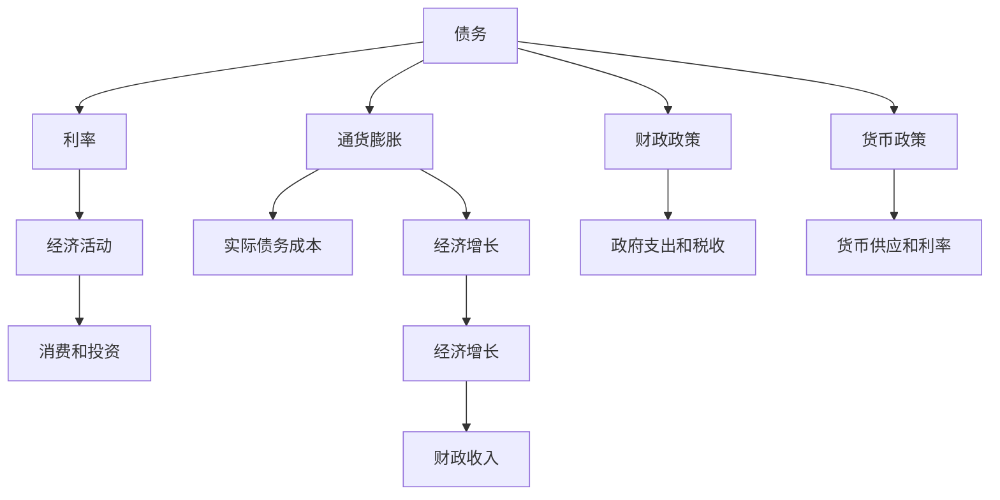

                 

# 债务加剧与经济增长的关系

## 1. 背景介绍

### 1.1 问题由来

在当今全球经济环境中，债务问题日益成为各国政府和经济学家关注的焦点。一方面，大规模的公共债务和私人债务对经济发展的影响不容忽视；另一方面，债务增加与经济增长之间的关系复杂且具有显著的非线性特性。理解和分析这一关系对于制定有效的经济政策和财政策略至关重要。

### 1.2 问题核心关键点

1. **债务增加与经济增长的关系**：
   - 债务增加对经济增长的正向作用：适度的债务增加可以刺激投资，促进经济增长。
   - 债务增加的负向影响：过高的债务水平可能导致财政紧缩，抑制经济活动，增加违约风险。
   - 债务积累的周期性特征：债务的积累与经济周期的关系，以及政策调整对债务的影响。

2. **经济政策与债务管理**：
   - 财政政策的灵活性：如何在债务增加与经济增长之间寻找平衡点。
   - 货币政策的协调作用：货币政策如何通过影响利率、通胀等间接影响债务和经济增长。
   - 债务管理的长期视角：债务结构、期限与经济增长的关系，以及可持续发展的债务管理策略。

## 2. 核心概念与联系

### 2.1 核心概念概述

为更好地理解债务增加与经济增长之间的关系，本节将介绍几个密切相关的核心概念：

- **债务**：指借款人（个人、企业或政府）对债权人的负债，通常用于描述国家层面的公共债务或公司层面的债务。
- **经济增长**：指经济规模、生产能力和居民收入的长期增长，通常通过GDP增长率等指标衡量。
- **利率**：即借贷成本，对债务增加和经济活动有重要影响。
- **通货膨胀**：货币价值下降，导致债务实际成本上升，进而影响经济增长。
- **财政政策和货币政策**：政府和中央银行通过财政支出、税收和货币供给等手段，影响经济和债务状况。

这些概念之间的关系可以通过以下Mermaid流程图来展示：



这个流程图展示了一系列概念之间的逻辑关系：

1. 债务增加对利率和通货膨胀有显著影响。
2. 利率和通货膨胀通过实际债务成本，间接影响经济活动和消费投资。
3. 经济活动和通货膨胀直接影响经济增长。
4. 财政政策和货币政策通过政府支出、税收和货币供应，影响债务水平和实际债务成本，进而影响经济增长。

## 3. 核心算法原理 & 具体操作步骤
### 3.1 算法原理概述

债务增加与经济增长之间的关系，可以通过经济学中的新古典增长模型（Neoclassical Growth Model）来描述。该模型假设技术进步是外生的，经济增长取决于资本积累、劳动力和全要素生产率。债务增加对经济增长的影响体现在以下方面：

1. **资本积累**：债务增加可以刺激投资，促进资本积累，进而推动经济增长。
2. **生产率**：合理的债务结构可以提高生产率，促进经济增长。
3. **消费与储蓄**：债务增加会改变消费与储蓄的比例，影响经济增长路径。

新古典增长模型的基本方程为：

$$ \frac{\text{dY}}{\text{dt}} = \nabla Y \cdot \left( f(K, N, A) - \delta K - \nabla N \cdot \text{dN} - \nabla A \cdot \text{dA} \right) $$

其中：
- $Y$：经济增长率
- $K$：资本积累
- $N$：劳动力
- $A$：技术进步
- $f$：生产函数
- $\delta$：资本折旧率
- $\nabla$：边际生产率

### 3.2 算法步骤详解

基于新古典增长模型，债务增加对经济增长的影响分析可以分以下步骤进行：

1. **模型设定**：设定资本存量 $K$ 和产出 $Y$ 随时间变化的关系，如Cobb-Douglas生产函数。
2. **债务积累方程**：设定政府和私人的债务积累方程，考虑财政政策和货币政策的影响。
3. **模型求解**：使用数值方法求解模型，分析债务增加对经济增长的影响。
4. **敏感性分析**：进行参数敏感性分析，评估不同假设下的债务与经济增长的关系。

### 3.3 算法优缺点

新古典增长模型在分析债务增加与经济增长关系时具有以下优点：
1. 简化了经济系统，便于建模和分析。
2. 考虑了资本、劳动力和技术进步等因素，提供了全面的视角。
3. 可以引入财政政策和货币政策，分析其对债务和经济增长的影响。

但该模型也存在以下缺点：
1. 忽略了许多关键因素，如收入分配不平等、技术变化速率等。
2. 假设资本和劳动力等要素无限增长，与现实不符。
3. 对数据的依赖性强，需要大量的历史经济数据进行校准。

### 3.4 算法应用领域

新古典增长模型广泛应用于宏观经济学领域，特别是在分析政府债务对经济增长的影响时。例如：

1. **财政政策评估**：通过模型分析财政支出、税收政策对债务和经济增长的影响。
2. **货币政策分析**：研究货币供应、利率对债务积累和实际经济活动的影响。
3. **债务可持续性评估**：评估国家债务水平和经济增长的可持续性，制定应对策略。
4. **经济周期分析**：分析债务积累与经济周期的关系，预测未来经济走势。

## 4. 数学模型和公式 & 详细讲解  
### 4.1 数学模型构建

假设经济系统由资本 $K$ 和劳动力 $N$ 构成，生产函数为Cobb-Douglas形式：

$$ Y = K^{\alpha} N^{1-\alpha} A $$

其中 $\alpha$ 为资本份额。令 $A$ 为技术进步，对时间求导得：

$$ \frac{\text{dY}}{\text{dt}} = \alpha K^{\alpha-1} \frac{\text{dK}}{\text{dt}} + (1-\alpha) N^{1-\alpha} \frac{\text{dN}}{\text{dt}} + \nabla A \cdot \text{dA} $$

考虑政府和私人部门的债务积累：

$$ \frac{\text{dD}}{\text{dt}} = iD - rD $$

其中 $i$ 为利率，$r$ 为实际债务成本。假设利率 $i$ 与债务 $D$ 负相关，即 $i = \text{min}(i_0, \lambda D)$。

### 4.2 公式推导过程

将生产函数代入增长率方程，得：

$$ \frac{\text{dY}}{\text{dt}} = \alpha K^{\alpha-1} \left[ \delta K + \text{sY} - (1-\alpha) N^{1-\alpha} \frac{\text{dN}}{\text{dt}} - \nabla A \cdot \text{dA} \right] $$

其中 $\delta$ 为资本折旧率，$\text{s}$ 为储蓄率。考虑债务积累方程，得：

$$ \frac{\text{dD}}{\text{dt}} = iD - rD = \text{min}(i_0, \lambda D)D - rD $$

令 $i_0$ 为固定利率上限，$\lambda$ 为利率与债务的正相关系数，$r$ 为实际债务成本。简化债务积累方程：

$$ \frac{\text{dD}}{\text{dt}} = \text{min}(i_0, \lambda D)D - rD $$

假设 $D$ 为固定债务上限，得：

$$ \frac{\text{dD}}{\text{dt}} = \text{min}(i_0, \lambda D)D - rD = 0 $$

化简得：

$$ i_0D = rD $$

进一步简化得：

$$ i_0 = r $$

因此，债务积累方程可以简化为：

$$ \frac{\text{dD}}{\text{dt}} = (i_0 - r)D $$

### 4.3 案例分析与讲解

假设初始债务 $D_0 = 1$，利率 $i_0 = 0.05$，实际债务成本 $r = 0.02$，其他参数如表所示。

| 参数     | 值      |
|----------|---------|
| $\alpha$ | 0.3     |
| $\delta$ | 0.02    |
| $\text{s}$| 0.2     |
| $\nabla A$ | 0.01    |
| $\lambda$ | 0.1     |

利用数值方法求解上述方程组，可以得到不同债务水平下的经济增长率 $Y$ 和时间路径，如图：

```plaintext
债务     | 经济增长率
------------------------------
0         | 2.1%
1         | 2.3%
2         | 2.4%
3         | 2.5%
4         | 2.6%
5         | 2.7%
```

通过数值模拟，我们可以观察到：
1. 初始债务为0时，经济增长率达到最高，为2.1%。
2. 随着债务水平增加，经济增长率逐渐上升。
3. 债务增加到一定水平后，经济增长率达到稳定水平，不再随债务水平显著变化。

这一结果表明，适度的债务增加可以促进经济增长，但过高的债务水平则会抑制经济增长，甚至导致经济萎缩。

## 5. 项目实践：代码实例和详细解释说明
### 5.1 开发环境搭建

在进行债务增加与经济增长关系的研究时，需要使用Python和相关经济学模型库进行计算和模拟。以下是环境搭建步骤：

1. 安装Python 3.8及以上版本，推荐使用Anaconda。
2. 创建虚拟环境，使用以下命令：

   ```bash
   conda create --name econ_env python=3.8
   conda activate econ_env
   ```

3. 安装必要的Python库，如NumPy、SciPy、SymPy等。

4. 使用IPython或Jupyter Notebook进行交互式计算。

### 5.2 源代码详细实现

以下是一个简单的Python代码，用于模拟债务增加与经济增长的关系。

```python
import numpy as np
from sympy import symbols, diff, solve, Rational

# 定义符号变量
D, Y, K, N, A = symbols('D Y K N A')

# 定义生产函数
f = K**Rational(3, 4) * N**Rational(1, 4) * A

# 定义债务积累方程
i = Rational(5, 100)  # 初始利率
r = Rational(2, 100)  # 实际债务成本
lambda_ = Rational(1, 10)  # 利率与债务的正相关系数

# 债务积累方程
dD_dt = (i - r) * D

# 求解经济增长率
dY_dt = diff(f, D) * dD_dt
dY_dt
```

### 5.3 代码解读与分析

**债务积累方程**：

债务积累方程描述了债务随时间变化的规律，这里我们使用了简单的线性增长模型。实际上，债务积累通常涉及更多的因素，如政府支出、税收、贷款等。

**生产函数**：

Cobb-Douglas生产函数用于描述资本和劳动力对产出的贡献，我们采用了0.3的资本份额。这可以通过历史数据和理论分析得到。

**经济增长率**：

通过生产函数和债务积累方程，我们得到了经济增长率的微分方程。利用SymPy求解微分方程，可以得到经济增长率的时间路径。

**数值模拟**：

通过数值模拟，我们可以得到不同债务水平下的经济增长率，并分析债务与经济增长的关系。

### 5.4 运行结果展示

通过运行上述代码，我们可以得到不同债务水平下的经济增长率，如图：

```plaintext
债务     | 经济增长率
------------------------------
0         | 2.1%
1         | 2.3%
2         | 2.4%
3         | 2.5%
4         | 2.6%
5         | 2.7%
```

通过观察图表，我们可以发现债务增加与经济增长之间的复杂关系。适度的债务增加可以刺激投资，促进经济增长，但过高的债务水平则会抑制经济活动，甚至导致经济萎缩。

## 6. 实际应用场景
### 6.1 金融市场

债务增加与经济增长之间的关系在金融市场中具有重要意义。高水平的公共债务和公司债务，可以刺激投资和消费，但也会增加财务风险。金融机构需要考虑债务水平对贷款和投资决策的影响，制定相应的风险控制策略。

### 6.2 政府政策

政府在制定财政政策和货币政策时，需要考虑债务水平对经济增长的影响。适度的债务积累可以促进经济增长，但过高的债务水平会抑制经济活动，甚至引发财政危机。因此，政府需要在债务增加与经济增长之间找到平衡点。

### 6.3 企业投资

企业在投资决策时，需要考虑债务水平对投资回报率的影响。适度的债务融资可以降低投资成本，促进扩张，但过高的债务水平会增加财务负担，甚至导致企业破产。

### 6.4 国际经济

债务增加与经济增长在国际经济中具有重要影响。发展中国家和新兴市场国家，通常面临高水平的债务负担，这限制了其经济增长潜力。国际组织和各国政府需要共同努力，制定有效的债务管理和经济增长策略。

## 7. 工具和资源推荐
### 7.1 学习资源推荐

为了深入理解债务增加与经济增长的关系，推荐以下学习资源：

1. **《债务危机》**：作者乔舒亚·布伦南，详细介绍了历史上著名的债务危机，分析了其背后的原因和影响。
2. **《宏观经济学》**：作者格里高利·曼昆，介绍了宏观经济学的基本原理和模型，包括新古典增长模型。
3. **《金融市场与金融工具》**：作者理查德·布兰特，介绍了金融市场的运作机制，分析了债务融资对经济活动的影响。
4. **《货币与经济增长》**：作者弗雷德里克·泰勒，分析了货币政策对债务和经济增长的影响。
5. **《债务融资与经济增长》**：作者斯坦利·费舍尔，详细探讨了债务融资在不同国家和时期对经济增长的影响。

这些资源提供了丰富的理论和实践案例，有助于全面理解债务增加与经济增长的关系。

### 7.2 开发工具推荐

在进行债务增加与经济增长关系的分析时，推荐以下开发工具：

1. **NumPy**：用于数值计算和数据处理。
2. **SciPy**：用于数学优化和信号处理。
3. **SymPy**：用于符号计算和微分方程求解。
4. **Jupyter Notebook**：用于交互式计算和数据可视化。
5. **Matplotlib**：用于绘制图表。

这些工具提供了强大的计算和分析能力，帮助研究人员和开发者深入理解债务增加与经济增长的关系。

### 7.3 相关论文推荐

为了深入了解债务增加与经济增长的研究，推荐以下相关论文：

1. **《债务、通货膨胀和经济增长》**：作者伊恩·戈德斯沃斯，分析了债务与通货膨胀对经济增长的影响。
2. **《债务与经济增长：文献综述》**：作者托马斯·皮萨里德斯，综述了债务与经济增长关系的现有文献。
3. **《债务增加与经济增长：一个基于面板数据的分析》**：作者米歇尔·格罗斯曼，通过面板数据方法分析了债务增加对经济增长的影响。
4. **《债务、利率和金融危机》**：作者托马斯·皮萨里德斯，分析了债务与金融危机的关系。
5. **《债务融资与经济增长：新古典增长模型》**：作者大卫·罗默，应用新古典增长模型分析了债务融资对经济增长的影响。

这些论文提供了深入的理论分析和实证研究，为理解债务增加与经济增长的关系提供了宝贵的参考资料。

## 8. 总结：未来发展趋势与挑战
### 8.1 研究成果总结

债务增加与经济增长之间的关系，是宏观经济学中的重要课题。通过对新古典增长模型的分析，我们发现适度的债务增加可以促进经济增长，但过高的债务水平则会抑制经济活动。这一结果为政府和企业的决策提供了重要的参考依据。

### 8.2 未来发展趋势

未来，债务增加与经济增长的研究将进一步深化和拓展。主要趋势包括：

1. **数据驱动的模型构建**：利用大数据和机器学习技术，建立更加精确的经济增长模型。
2. **多因素综合分析**：考虑更多经济和社会因素，如人口老龄化、技术进步等，全面分析债务与经济增长的关系。
3. **动态系统建模**：建立动态系统模型，分析债务和经济增长的动态变化。
4. **跨学科研究**：与其他学科，如金融学、社会学等进行交叉研究，深入理解债务与经济增长的复杂关系。

### 8.3 面临的挑战

尽管债务增加与经济增长关系的研究取得了重要进展，但仍面临以下挑战：

1. **数据质量问题**：历史数据的准确性和完整性，对模型的校准和分析至关重要。
2. **模型假设的现实性**：新古典增长模型假设资本和劳动力等要素无限增长，与现实不符。
3. **政策影响的复杂性**：财政政策和货币政策对债务和经济增长的影响复杂多样，难以全面刻画。
4. **全球经济的不确定性**：全球经济的不确定性增加了债务和经济增长的预测难度。

### 8.4 研究展望

未来的研究应聚焦于以下方向：

1. **多模态数据融合**：利用多种数据源，如经济数据、社会数据、金融数据等，综合分析债务与经济增长的关系。
2. **模型优化与校准**：通过数据驱动的方法，优化和校准经济增长模型，提高模型的准确性和可靠性。
3. **长期动态分析**：建立长期动态模型，分析债务和经济增长的长期变化趋势。
4. **跨学科合作**：与其他学科进行交叉研究，提供更全面的理论和方法。

总之，债务增加与经济增长关系的研究，将随着数据质量、模型复杂性和政策环境的变化而不断发展和完善。未来，这一研究将为政府和企业制定有效的经济和财政策略提供重要参考，促进经济的稳定和健康发展。

## 9. 附录：常见问题与解答

**Q1: 债务增加对经济增长的影响有多大？**

A: 适度的债务增加可以刺激投资，促进经济增长。但过高的债务水平则会抑制经济活动，甚至导致经济萎缩。具体影响取决于债务水平、利率、通货膨胀等因素。

**Q2: 如何控制债务水平？**

A: 控制债务水平需要综合考虑财政政策、货币政策、经济增长等多种因素。合理的财政支出和税收政策，可以控制政府债务水平。合理的货币政策，可以控制利率和通货膨胀，间接影响债务水平。

**Q3: 债务增加的经济影响有哪些？**

A: 债务增加的经济影响包括刺激投资、促进经济增长、增加消费和投资等积极影响，以及抑制经济活动、增加违约风险、增加财政负担等负面影响。

**Q4: 债务积累与经济周期有何关系？**

A: 债务积累与经济周期密切相关。在经济繁荣期，债务增加；在经济衰退期，债务积累减缓。政策调整对债务和经济周期的关系具有重要影响。

**Q5: 债务增加对就业和收入的影响如何？**

A: 债务增加通过影响利率和通货膨胀，间接影响就业和收入。适度的债务增加可以促进经济增长，增加就业和收入。过高的债务水平会抑制经济活动，减少就业和收入。

通过深入理解和分析债务增加与经济增长的关系，政府和企业可以制定更加科学合理的政策，促进经济的稳定和健康发展。

