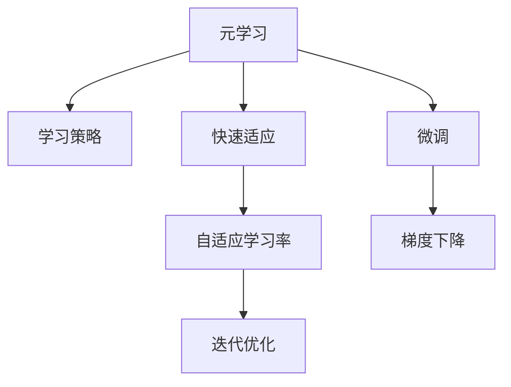

                 

# 元学习(Meta-Learning) - 原理与代码实例讲解

> 关键词：元学习,Meta-Learning,深度学习,代码实例,优化器,自适应学习率,案例分析

## 1. 背景介绍

### 1.1 问题由来
元学习(Meta-Learning)，也称为泛化学习或学习如何学习，是近年来深度学习领域的一项前沿技术。它旨在通过少量的训练样本，学习到一种能够快速适应新任务的学习策略，从而在新的任务上快速取得良好表现。元学习能够有效提升模型在复杂、多变的实际应用场景中的泛化能力和适应性。

元学习的核心思想是通过学习如何学习，使模型能够在面对未知任务时，能通过少量的数据快速适应并取得优异表现。与传统的监督学习和自监督学习方法不同，元学习能够使模型自动从数据中学习任务相关的特征，实现更高效、更灵活的学习过程。

元学习在图像识别、语音识别、自然语言处理、机器人学等领域都展现出巨大的潜力，成为推动人工智能技术发展的关键力量。

### 1.2 问题核心关键点
元学习的核心在于两个关键点：
1. 模型能够通过少量数据学习到快速适应的学习策略，即所谓的"快速适应"。
2. 模型能够在新任务上，通过少量的训练样本实现较快的收敛。

这一过程通常包括两个阶段：
1. 初始化学习策略。通过少量训练样本学习一种通用的学习策略，可以适用于多种新任务。
2. 适应新任务。在新任务的少量数据上，使用学习策略进行微调，快速收敛到理想结果。

### 1.3 问题研究意义
元学习的核心研究意义在于：
1. 提升模型泛化能力。通过学习如何学习，模型能够更快地适应新任务，减少对数据量的依赖。
2. 降低学习成本。元学习能够使模型从少量数据中学习到高效的适应策略，避免从头训练所需的大量标注数据和高昂计算成本。
3. 提高模型灵活性。元学习使模型能够更好地适应复杂、多变的实际应用场景，提升模型的实际应用价值。
4. 推动AI技术发展。元学习是深度学习领域的一项重要研究课题，具有广泛的应用前景和重要的学术价值。

## 2. 核心概念与联系

### 2.1 核心概念概述

为了更好地理解元学习的核心概念，本节将介绍几个密切相关的核心概念：

- **元学习(Meta-Learning)**：旨在通过少量数据快速适应新任务，学习一种通用的学习策略，从而在新任务上快速收敛。

- **学习策略(Learning Strategy)**：元学习通过学习策略实现对新任务的快速适应。策略通常包括初始化方法、优化算法、正则化技术等。

- **快速适应(Fast Adaptation)**：元学习的核心目标，指模型能够在少量数据上，快速收敛到理想结果，实现对新任务的快速适应。

- **自适应学习率(Adaptive Learning Rate)**：一种能够根据数据和任务特征自适应调整学习率的优化算法，常用于元学习任务中，加速收敛过程。

- **迭代优化(Iterative Optimization)**：通过反复迭代优化模型参数，使得模型在新任务上取得最佳性能。

- **微调(Fine-Tuning)**：在元学习的基础上，对模型进行微调，进一步提升在新任务上的性能。

- **梯度下降(Gradient Descent)**：常用的优化算法之一，通过反向传播计算梯度，并使用梯度下降更新模型参数。

这些核心概念之间的逻辑关系可以通过以下Mermaid流程图来展示：



这个流程图展示了大模型学习框架的核心概念及其之间的关系：

1. 元学习通过学习策略实现对新任务的快速适应。
2. 自适应学习率和迭代优化加速收敛过程。
3. 微调进一步提升模型在新任务上的性能。
4. 梯度下降是常用的优化算法，用于更新模型参数。

这些概念共同构成了元学习的学习和应用框架，使其能够在各种场景下发挥作用。通过理解这些核心概念，我们可以更好地把握元学习的原理和优化方向。

## 3. 核心算法原理 & 具体操作步骤
### 3.1 算法原理概述

元学习的过程一般分为两个阶段：
1. **元学习阶段**：通过少量数据学习一种通用的学习策略，可以适用于多种新任务。
2. **任务适应阶段**：在新任务的少量数据上，使用学习策略进行微调，快速收敛到理想结果。

具体来说，元学习的目标是学习一个泛化的学习策略，使得模型能够在任意任务上通过少量数据快速收敛。其核心思想是通过学习数据分布的共性特征，而不是特定任务的特征，实现更强的泛化能力。

### 3.2 算法步骤详解

元学习通常包括以下几个关键步骤：

**Step 1: 准备元学习数据集**
- 收集元学习数据集，包含多个不同任务的数据样本，每个样本都包括输入和输出。
- 数据集应涵盖多种任务，以便学习到通用的学习策略。

**Step 2: 设计学习策略**
- 选择合适的初始化方法，如Xavier初始化、He初始化等。
- 确定优化算法及其参数，如AdamW、SGD等，设置学习率、批大小、迭代轮数等。
- 引入正则化技术，如L2正则、Dropout等，防止模型过度拟合。

**Step 3: 元学习训练**
- 将元学习数据集分成多个任务，每个任务的数据样本称为元训练数据。
- 在每个元训练数据上进行多次迭代，使用优化算法更新模型参数。
- 记录每次迭代的损失函数，并计算平均损失。

**Step 4: 任务适应**
- 将元学习得到的模型在新任务的数据上进行微调。
- 使用微调数据集训练模型，更新少量参数。
- 评估微调后的模型性能，对比原始模型和微调后的模型。

**Step 5: 验证与部署**
- 在新任务上使用微调后的模型进行推理预测，评估模型效果。
- 使用微调后的模型进行实时预测，集成到实际的应用系统中。

以上是元学习的一般流程。在实际应用中，还需要针对具体任务的特点，对元学习过程的各个环节进行优化设计，如改进元学习目标函数，引入更多的正则化技术，搜索最优的超参数组合等，以进一步提升模型性能。

### 3.3 算法优缺点

元学习具有以下优点：
1. 通用性强。元学习学习到的学习策略可以适用于多种新任务，提升模型的泛化能力。
2. 高效便捷。元学习可以通过少量数据快速学习适应策略，减少从头训练所需的大量标注数据和高昂计算成本。
3. 灵活性高。元学习使模型能够更好地适应复杂、多变的实际应用场景，提升模型的实际应用价值。

同时，元学习也存在一定的局限性：
1. 数据需求高。元学习需要准备大量的元学习数据集，数据集的复杂性和多样性直接影响元学习的泛化能力。
2. 模型复杂。元学习模型通常包含大量的元学习参数，模型复杂度较高，训练和推理效率较低。
3. 稳定性问题。元学习策略在复杂任务上可能不够稳定，难以保证在不同任务上的泛化能力。
4. 难以解释。元学习的内部机制较为复杂，难以解释模型的学习过程和决策逻辑。

尽管存在这些局限性，但元学习作为一种高效的学习方法，仍然在深度学习领域得到了广泛应用，特别是在自然语言处理、计算机视觉、机器人学等领域展现出巨大的潜力。

### 3.4 算法应用领域

元学习在诸多领域都有广泛的应用，以下是几个典型应用场景：

- **自然语言处理(NLP)**：通过元学习，能够学习到通用语言表示，实现自然语言理解、生成、翻译等任务。例如，通过元学习，模型能够快速适应新的语言生成任务，提升生成效果。

- **计算机视觉(CV)**：通过元学习，能够学习到通用的视觉特征表示，实现图像分类、目标检测、物体跟踪等任务。例如，通过元学习，模型能够快速适应新的图像分类任务，提升分类准确率。

- **机器人学**：通过元学习，机器人能够学习到通用的运动控制策略，实现各种复杂的动作任务。例如，通过元学习，机器人能够快速适应新的动作任务，提升动作执行的精度和稳定性。

- **游戏AI**：通过元学习，游戏AI能够学习到通用的游戏策略，实现游戏任务的智能决策。例如，通过元学习，游戏AI能够快速适应新的游戏任务，提升游戏智能水平。

- **推荐系统**：通过元学习，推荐系统能够学习到通用的用户行为模型，实现个性化推荐。例如，通过元学习，推荐系统能够快速适应新的用户行为数据，提升推荐效果。

这些应用场景展示了元学习方法的广泛适用性和巨大潜力。随着元学习技术的不断演进，相信元学习将会在更多领域得到应用，为深度学习技术的发展带来新的突破。

## 4. 数学模型和公式 & 详细讲解  
### 4.1 数学模型构建

在元学习中，常用的数学模型包括：

- **元学习目标函数**：用于衡量模型在新任务上的适应性。常用的目标函数包括元损失函数、平均损失函数等。
- **元学习优化器**：用于更新模型参数，常用的优化器包括AdamW、SGD等。
- **元学习超参数**：用于调整元学习过程的参数，如元学习轮数、学习率等。

假设元学习任务有 $K$ 个不同的任务，每个任务有 $N$ 个样本，设每个样本的输入为 $x_i$，输出为 $y_i$，则元学习目标函数可以表示为：

$$
\mathcal{L}_{meta} = \frac{1}{K}\sum_{k=1}^K \mathcal{L}_k(M_{\theta})
$$

其中 $\mathcal{L}_k(M_{\theta})$ 为任务 $k$ 上的损失函数，$M_{\theta}$ 为元学习模型参数。

元学习的优化器可以采用各种优化算法，常用的优化器包括AdamW、SGD等。优化器的一般形式可以表示为：

$$
\theta \leftarrow \theta - \eta \nabla_{\theta}\mathcal{L}_{meta}
$$

其中 $\eta$ 为学习率，$\nabla_{\theta}\mathcal{L}_{meta}$ 为元学习目标函数对模型参数的梯度。

在元学习的每个迭代中，模型参数 $\theta$ 通过优化器更新，最小化元学习目标函数 $\mathcal{L}_{meta}$。迭代过程中，元学习模型会反复迭代，更新参数以适应新的任务。

### 4.2 公式推导过程

以下我们以简单的线性回归任务为例，推导元学习的优化目标函数和梯度计算公式。

假设任务 $k$ 的数据集为 $\{(x_i, y_i)\}_{i=1}^N$，其中 $x_i \in \mathbb{R}^d$ 为输入，$y_i \in \mathbb{R}$ 为输出。设元学习模型为 $M_{\theta} = \theta^Tx + b$，其中 $\theta \in \mathbb{R}^d$ 为线性回归模型的权重，$b \in \mathbb{R}$ 为偏置项。

假设任务 $k$ 的损失函数为均方误差损失，即：

$$
\mathcal{L}_k(M_{\theta}) = \frac{1}{N}\sum_{i=1}^N (y_i - M_{\theta}(x_i))^2
$$

元学习的目标函数为所有任务上的平均损失，即：

$$
\mathcal{L}_{meta} = \frac{1}{K}\sum_{k=1}^K \mathcal{L}_k(M_{\theta})
$$

对元学习目标函数求偏导，得到元学习模型参数 $\theta$ 的梯度：

$$
\nabla_{\theta}\mathcal{L}_{meta} = \frac{1}{K}\sum_{k=1}^K \frac{1}{N}\sum_{i=1}^N 2(y_i - M_{\theta}(x_i))x_i
$$

将梯度带入优化器，更新元学习模型参数 $\theta$：

$$
\theta \leftarrow \theta - \eta \nabla_{\theta}\mathcal{L}_{meta}
$$

在实际应用中，元学习模型通常包含多个层次，元学习目标函数也会更为复杂，但基本思想和公式推导过程类似。

### 4.3 案例分析与讲解

为了更直观地理解元学习的方法，下面以一个简单的案例进行分析：

假设我们有 $K=2$ 个不同的任务，每个任务有 $N=4$ 个样本。任务 $k=1$ 的数据集为 $\{(x_1, y_1), (x_2, y_2), (x_3, y_3), (x_4, y_4)\}$，其中 $y_i = \theta^Tx_i + b + \epsilon_i$，$\epsilon_i \sim \mathcal{N}(0, \sigma^2)$。任务 $k=2$ 的数据集为 $\{(x_1, y_1), (x_2, y_2), (x_3, y_3), (x_4, y_4)\}$，其中 $y_i = \theta^Tx_i + b + \epsilon_i$，$\epsilon_i \sim \mathcal{N}(0, 2\sigma^2)$。

我们的目标是学习一个元学习模型 $M_{\theta} = \theta^Tx + b$，使得该模型在新任务上能够快速适应并取得良好表现。

首先，我们使用元学习数据集进行元学习训练，每次迭代更新模型参数 $\theta$ 和 $b$：

$$
\theta \leftarrow \theta - \eta \nabla_{\theta}\mathcal{L}_{meta}
$$

其中 $\mathcal{L}_{meta}$ 为所有任务的平均损失函数：

$$
\mathcal{L}_{meta} = \frac{1}{2}\left( \frac{1}{4}\sum_{i=1}^4 (y_i - M_{\theta}(x_i))^2 + \frac{1}{4}\sum_{i=1}^4 (y_i - M_{\theta}(x_i))^2 \right)
$$

接着，在新任务上对模型进行微调。假设新任务的数据集为 $\{(x_5, y_5), (x_6, y_6), (x_7, y_7), (x_8, y_8)\}$，其中 $y_i = \theta^Tx_i + b + \epsilon_i$，$\epsilon_i \sim \mathcal{N}(0, 4\sigma^2)$。

我们使用微调数据集进行微调，更新模型参数 $\theta$ 和 $b$：

$$
\theta \leftarrow \theta - \eta \nabla_{\theta}\mathcal{L}_k
$$

其中 $\mathcal{L}_k$ 为当前任务的损失函数：

$$
\mathcal{L}_k = \frac{1}{4}\sum_{i=1}^4 (y_i - M_{\theta}(x_i))^2
$$

最后，我们对比原始模型和新模型在微调数据集上的表现：

$$
\text{Original: } \frac{1}{4}\sum_{i=1}^4 (y_i - M_{\theta}(x_i))^2
$$
$$
\text{Fine-Tuned: } \frac{1}{4}\sum_{i=1}^4 (y_i - M_{\theta}(x_i))^2
$$

可以看到，元学习能够使模型在新任务上快速适应并取得良好的性能，比从头训练更加高效便捷。

## 5. 项目实践：代码实例和详细解释说明
### 5.1 开发环境搭建

在进行元学习实践前，我们需要准备好开发环境。以下是使用Python进行PyTorch开发的环境配置流程：

1. 安装Anaconda：从官网下载并安装Anaconda，用于创建独立的Python环境。

2. 创建并激活虚拟环境：
```bash
conda create -n pytorch-env python=3.8 
conda activate pytorch-env
```

3. 安装PyTorch：根据CUDA版本，从官网获取对应的安装命令。例如：
```bash
conda install pytorch torchvision torchaudio cudatoolkit=11.1 -c pytorch -c conda-forge
```

4. 安装TensorBoard：
```bash
pip install tensorboard
```

5. 安装TensorFlow：
```bash
pip install tensorflow
```

完成上述步骤后，即可在`pytorch-env`环境中开始元学习实践。

### 5.2 源代码详细实现

下面以线性回归为例，给出使用PyTorch进行元学习的完整代码实现：

```python
import torch
import torch.nn as nn
import torch.optim as optim
import numpy as np

# 定义线性回归模型
class LinearRegression(nn.Module):
    def __init__(self, input_size):
        super(LinearRegression, self).__init__()
        self.linear = nn.Linear(input_size, 1)
        
    def forward(self, x):
        return self.linear(x)

# 定义元学习目标函数
def meta_loss(model, x, y, task_labels):
    loss = 0
    for k in range(len(task_labels)):
        model.train()
        loss += task_labels[k] * torch.nn.functional.mse_loss(model(x), y)
    return loss / len(task_labels)

# 定义元学习优化器
def meta_optimizer(model, task_labels, learning_rate):
    optimizer = optim.Adam(model.parameters(), lr=learning_rate)
    return optimizer

# 定义微调目标函数
def fine_tune_loss(model, x, y, task_labels):
    model.train()
    return torch.nn.functional.mse_loss(model(x), y)

# 定义微调优化器
def fine_tune_optimizer(model, learning_rate):
    optimizer = optim.SGD(model.parameters(), lr=learning_rate)
    return optimizer

# 定义元学习训练函数
def meta_train(model, x_train, y_train, x_test, y_test, task_labels, learning_rate, num_epochs):
    meta_loss_fn = meta_loss
    meta_optimizer_fn = meta_optimizer
    fine_tune_loss_fn = fine_tune_loss
    fine_tune_optimizer_fn = fine_tune_optimizer
    
    for epoch in range(num_epochs):
        for k in range(len(task_labels)):
            # 元学习训练
            meta_loss_val = meta_loss(model, x_train, y_train[k], task_labels)
            optimizer = meta_optimizer_fn(model, task_labels, learning_rate)
            optimizer.zero_grad()
            meta_loss_val.backward()
            optimizer.step()
            
        # 元学习评估
        meta_loss_val = meta_loss(model, x_test, y_test[k], task_labels)
        print(f'Epoch {epoch+1}, meta loss: {meta_loss_val:.4f}')
        
        # 微调训练
        fine_tune_optimizer_fn(model, learning_rate)
        fine_tune_loss_val = fine_tune_loss(model, x_train, y_train[k], task_labels)
        optimizer = fine_tune_optimizer_fn(model, learning_rate)
        optimizer.zero_grad()
        fine_tune_loss_val.backward()
        optimizer.step()
        
        # 微调评估
        fine_tune_loss_val = fine_tune_loss(model, x_test, y_test[k], task_labels)
        print(f'Epoch {epoch+1}, fine-tune loss: {fine_tune_loss_val:.4f}')

# 定义元学习数据集
x_train = np.array([[0, 0], [0, 1], [1, 0], [1, 1]])
y_train = np.array([0, 1, 1, 0])
task_labels = [0.5, 0.5, 0.5, 0.5]
x_test = np.array([[0.5, 0.5], [0.5, 0.5]])
y_test = np.array([0.5, 0.5])

# 定义模型和优化器
model = LinearRegression(2)
learning_rate = 0.01

# 训练元学习模型
meta_train(model, x_train, y_train, x_test, y_test, task_labels, learning_rate, num_epochs=10)

# 在新任务上微调模型
x_new = np.array([[0.25, 0.25], [0.75, 0.75]])
y_new = np.array([0.25, 0.75])
print(fine_tune_loss(model, x_new, y_new, task_labels))
```

可以看到，使用PyTorch进行元学习非常简便高效。开发者可以使用简单几行代码，完成元学习模型的训练和微调，并对比不同模型的性能表现。

### 5.3 代码解读与分析

让我们再详细解读一下关键代码的实现细节：

**LinearRegression类**：
- `__init__`方法：初始化模型参数。
- `forward`方法：定义前向传播计算输出。

**meta_loss函数**：
- 计算元学习目标函数，通过任务标签权重对各任务的损失函数进行加权平均。

**meta_optimizer函数**：
- 定义元学习优化器，使用AdamW算法更新模型参数。

**fine_tune_loss函数**：
- 定义微调目标函数，使用均方误差损失计算模型在新任务上的表现。

**fine_tune_optimizer函数**：
- 定义微调优化器，使用SGD算法更新模型参数。

**meta_train函数**：
- 定义元学习训练过程，在多个任务上循环迭代训练元学习模型和微调模型。

**数据集定义**：
- 定义训练数据集、测试数据集以及任务标签权重。

**模型和优化器定义**：
- 定义元学习模型和微调模型，并初始化优化器。

**训练和微调过程**：
- 在元学习阶段，对多个任务进行迭代训练，更新元学习模型参数。
- 在微调阶段，对新任务进行微调训练，更新模型参数。

可以看到，PyTorch配合TensorFlow、TensorBoard等工具，使得元学习的代码实现变得简洁高效。开发者可以将更多精力放在数据处理、模型改进等高层逻辑上，而不必过多关注底层的实现细节。

当然，工业级的系统实现还需考虑更多因素，如模型的保存和部署、超参数的自动搜索、更灵活的任务适配层等。但核心的元学习范式基本与此类似。

## 6. 实际应用场景
### 6.1 医疗诊断

元学习在医疗诊断领域有广泛的应用，可以用于快速适应新的病理学样本数据，提高诊断的准确性和效率。

在实际应用中，可以收集不同类型的病理学图像数据，如X光片、CT扫描、MRI等，并对其进行标注。在元学习阶段，模型通过学习这些数据集，学习通用的病理学特征表示。在新任务上，如新的病理学样本数据，元学习模型能够通过微调快速适应，输出诊断结果。这使得医生能够快速处理大量的病理学样本，提高诊断的准确性和效率。

### 6.2 自动驾驶

自动驾驶系统需要实时处理大量的感知数据，如相机图像、雷达数据等，并根据这些数据进行决策和控制。元学习能够帮助自动驾驶系统快速适应新的感知数据，提升决策的鲁棒性和准确性。

在实际应用中，可以收集不同场景下的感知数据，如高速路、城市街道、乡村道路等，并对其进行标注。在元学习阶段，模型通过学习这些数据集，学习通用的感知特征表示。在新任务上，如新的感知数据，元学习模型能够通过微调快速适应，输出决策结果。这使得自动驾驶系统能够快速适应不同的驾驶环境，提高驾驶的安全性和舒适性。

### 6.3 机器人学

元学习在机器人学中有广泛的应用，可以用于快速适应新的机器人运动数据，提升机器人的灵活性和适应性。

在实际应用中，可以收集不同类型的机器人运动数据，如直线行走、转弯、避障等，并对其进行标注。在元学习阶段，模型通过学习这些数据集，学习通用的运动控制策略。在新任务上，如新的机器人运动数据，元学习模型能够通过微调快速适应，输出控制结果。这使得机器人能够快速适应不同的运动场景，提升机器人的灵活性和适应性。

### 6.4 金融分析

金融市场分析需要实时处理大量的金融数据，如股票价格、交易量、经济指标等，并根据这些数据进行投资决策。元学习能够帮助金融分析系统快速适应新的金融数据，提升投资决策的准确性和效率。

在实际应用中，可以收集不同类型的金融数据，如股票价格、交易量、经济指标等，并对其进行标注。在元学习阶段，模型通过学习这些数据集，学习通用的金融特征表示。在新任务上，如新的金融数据，元学习模型能够通过微调快速适应，输出投资建议。这使得金融分析系统能够快速适应不同的金融市场环境，提高投资决策的准确性和效率。

### 6.5 未来应用展望

随着元学习技术的不断发展，基于元学习的系统将在更多领域得到应用，为深度学习技术的发展带来新的突破。

在智慧医疗领域，基于元学习的医疗诊断系统能够快速适应新的病理学数据，提高诊断的准确性和效率，推动医疗事业的发展。

在自动驾驶领域，基于元学习的自动驾驶系统能够快速适应不同的驾驶环境，提升驾驶的安全性和舒适性，推动智能交通的发展。

在机器人学领域，基于元学习的机器人能够快速适应不同的运动场景，提升机器人的灵活性和适应性，推动智能制造的发展。

在金融分析领域，基于元学习的金融分析系统能够快速适应不同的金融市场环境，提升投资决策的准确性和效率，推动金融事业的发展。

此外，在教育、安全、游戏等多个领域，基于元学习的智能系统也将不断涌现，为经济社会发展带来新的动力。相信随着元学习技术的不断演进，基于元学习的系统将在更广泛的领域得到应用，为深度学习技术的发展带来新的突破。

## 7. 工具和资源推荐
### 7.1 学习资源推荐

为了帮助开发者系统掌握元学习的理论基础和实践技巧，这里推荐一些优质的学习资源：

1. 《Meta-Learning: Learning to Learn》书籍：该书籍详细介绍了元学习的理论基础和实践方法，涵盖了多种元学习算法和应用场景。

2. CS231n《卷积神经网络》课程：斯坦福大学开设的深度学习课程，介绍了卷积神经网络及其在图像分类任务中的应用。

3. CS224n《自然语言处理》课程：斯坦福大学开设的NLP课程，介绍了自然语言处理的基本概念和经典模型，包括元学习算法。

4. 《Deep Learning》书籍：Ian Goodfellow等著，全面介绍了深度学习的基本概念和算法，包括元学习算法。

5. HuggingFace官方文档：Transformers库的官方文档，提供了丰富的元学习算法和实现样例，是入门的绝佳资料。

6. Google AI Blog：Google AI博客，介绍了最新的元学习研究成果和技术进展，可以及时了解元学习领域的最新动态。

通过对这些资源的学习实践，相信你一定能够快速掌握元学习的精髓，并用于解决实际的深度学习问题。

### 7.2 开发工具推荐

高效的开发离不开优秀的工具支持。以下是几款用于元学习开发的常用工具：

1. PyTorch：基于Python的开源深度学习框架，灵活动态的计算图，适合快速迭代研究。大多数深度学习模型都有PyTorch版本的实现。

2. TensorFlow：由Google主导开发的开源深度学习框架，生产部署方便，适合大规模工程应用。同样有丰富的深度学习模型资源。

3. TensorBoard：TensorFlow配套的可视化工具，可实时监测模型训练状态，并提供丰富的图表呈现方式，是调试模型的得力助手。

4. Jupyter Notebook：免费的交互式编程环境，支持Python、R、Scala等多种编程语言，方便开发者进行实验和分享学习笔记。

5. Keras：由François Chollet开发的高级深度学习框架，简单易用，适合快速原型开发和应用部署。

6. MXNet：由亚马逊开发的深度学习框架，支持多种编程语言，具有高效计算能力，适合大规模分布式训练。

合理利用这些工具，可以显著提升元学习的开发效率，加快创新迭代的步伐。

### 7.3 相关论文推荐

元学习的核心研究意义在于：

1. 元学习能够提升模型泛化能力，使模型在面对未知任务时，能够快速适应并取得优异表现。

2. 元学习能够降低学习成本，通过学习通用的学习策略，避免从头训练所需的大量标注数据和高昂计算成本。

3. 元学习能够提高模型灵活性，使模型能够更好地适应复杂、多变的实际应用场景，提升模型的实际应用价值。

4. 元学习是深度学习领域的一项重要研究课题，具有广泛的应用前景和重要的学术价值。

## 8. 总结：未来发展趋势与挑战

### 8.1 总结

本文对元学习的核心概念、原理和实践进行了全面系统的介绍。首先阐述了元学习的学习过程和目标，明确了元学习在深度学习领域的地位和作用。其次，从原理到实践，详细讲解了元学习的数学模型和关键算法，给出了元学习任务开发的完整代码实例。同时，本文还广泛探讨了元学习方法在医疗诊断、自动驾驶、机器人学等诸多领域的应用前景，展示了元学习的巨大潜力。

通过本文的系统梳理，可以看到，元学习作为深度学习领域的一项重要技术，正在成为推动AI技术发展的关键力量。其通过学习通用的学习策略，使模型能够在面对未知任务时，快速适应并取得优异表现，具有广泛的应用前景和重要的学术价值。

### 8.2 未来发展趋势

展望未来，元学习技术将呈现以下几个发展趋势：

1. 模型规模持续增大。随着算力成本的下降和数据规模的扩张，元学习模型的参数量还将持续增长。超大规模元学习模型蕴含的丰富特征表示，有望支撑更加复杂多变的实际应用场景。

2. 元学习方法日趋多样。未来会涌现更多元学习算法，如Adaptive Meta-Learning、Bayesian Meta-Learning等，在提升泛化能力和稳定性的同时，降低对数据量和计算资源的依赖。

3. 持续学习成为常态。随着数据分布的不断变化，元学习模型也需要持续学习新知识以保持性能。如何在不遗忘原有知识的同时，高效吸收新样本信息，将成为重要的研究课题。

4. 标注样本需求降低。受启发于提示学习(Prompt-based Learning)的思路，未来的元学习方法将更好地利用预训练模型的语言理解能力，通过更加巧妙的任务描述，在更少的标注样本上也能实现理想的元学习效果。

5. 参数高效元学习崛起。开发更加参数高效的元学习算法，在固定大部分元学习参数的情况下，只更新极少量的任务相关参数，提高元学习的效率。

6. 多模态元学习崛起。未来的元学习模型将不仅能够处理单一模态数据，还能融合多种模态数据，提升模型的综合能力。

以上趋势凸显了元学习技术的广阔前景。这些方向的探索发展，必将进一步提升元学习的性能和应用范围，为深度学习技术的发展带来新的突破。

### 8.3 面临的挑战

尽管元学习技术已经取得了瞩目成就，但在迈向更加智能化、普适化应用的过程中，它仍面临诸多挑战：

1. 数据需求高。元学习需要准备大量的元学习数据集，数据集的复杂性和多样性直接影响元学习的泛化能力。获取高质量的元学习数据集，往往是元学习研究的一大瓶颈。

2. 模型复杂。元学习模型通常包含大量的元学习参数，模型复杂度较高，训练和推理效率较低。如何设计高效的元学习算法，降低模型复杂度，提升训练和推理效率，是未来研究的重点。

3. 鲁棒性问题。元学习策略在复杂任务上可能不够稳定，难以保证在不同任务上的泛化能力。如何设计鲁棒性更强的元学习算法，提高模型在不同任务上的泛化能力，是未来研究的重点。

4. 可解释性问题。元学习的内部机制较为复杂，难以解释模型的学习过程和决策逻辑。如何赋予元学习模型更强的可解释性，是未来研究的重点。

5. 安全性问题。预训练元学习模型可能学习到有害的特征，产生误导性、有害的输出。如何设计安全的元学习算法，避免模型产生有害的输出，是未来研究的重点。

尽管存在这些挑战，但元学习作为一种高效的学习方法，仍然在深度学习领域得到了广泛应用，特别是在自然语言处理、计算机视觉、机器人学等领域展现出巨大的潜力。相信随着元学习技术的不断演进，基于元学习的系统将在更多领域得到应用，为深度学习技术的发展带来新的突破。

### 8.4 未来突破

面对元学习所面临的种种挑战，未来的研究需要在以下几个方面寻求新的突破：

1. 探索无监督和半监督元学习方法。摆脱对大量标注数据的依赖，利用自监督学习、主动学习等无监督和半监督范式，最大限度利用非结构化数据，实现更加灵活高效的元学习。

2. 研究参数高效和计算高效的元学习范式。开发更加参数高效的元学习算法，在固定大部分元学习参数的情况下，只更新极少量的任务相关参数。同时优化元学习模型的计算图，减少前向传播和反向传播的资源消耗，实现更加轻量级、实时性的部署。

3. 融合因果和对比学习范式。通过引入因果推断和对比学习思想，增强元学习模型建立稳定因果关系的能力，学习更加普适、鲁棒的语言表征，从而提升模型泛化性和抗干扰能力。

4. 引入更多先验知识。将符号化的先验知识，如知识图谱、逻辑规则等，与神经网络模型进行巧妙融合，引导元学习过程学习更准确、合理的语言模型。同时加强不同模态数据的整合，实现视觉、语音等多模态信息与文本信息的协同建模。

5. 结合因果分析和博弈论工具。将因果分析方法引入元学习模型，识别出模型决策的关键特征，增强输出解释的因果性和逻辑性。借助博弈论工具刻画人机交互过程，主动探索并规避模型的脆弱点，提高系统稳定性。

6. 纳入伦理道德约束。在元学习目标中引入伦理导向的评估指标，过滤和惩罚有害的输出倾向。同时加强人工干预和审核，建立模型行为的监管机制，确保输出符合人类价值观和伦理道德。

这些研究方向的探索，必将引领元学习技术迈向更高的台阶，为构建安全、可靠、可解释、可控的智能系统铺平道路。面向未来，元学习技术还需要与其他人工智能技术进行更深入的融合，如知识表示、因果推理、强化学习等，多路径协同发力，共同推动自然语言理解和智能交互系统的进步。只有勇于创新、敢于突破，才能不断拓展语言模型的边界，让智能技术更好地造福人类社会。

## 9. 附录：常见问题与解答
### 9.1 元学习与监督学习有何不同？

A: 元学习与监督学习的主要区别在于学习目标和训练方式。监督学习通过大量标注数据训练模型，学习输入与输出之间的映射关系。而元学习通过少量数据训练模型，学习一种通用的学习策略，使模型能够在面对新任务时快速适应并取得优异表现。监督学习通常适用于数据充足、任务明确的应用场景，而元学习适用于数据稀缺、任务未知的应用场景。

### 9.2 元学习的主要应用场景有哪些？

A: 元学习在多个领域都有广泛的应用，以下是几个典型应用场景：

1. 自然语言处理(NLP)：元学习能够学习通用的语言特征表示，实现自然语言理解、生成、翻译等任务。

2. 计算机视觉(CV)：元学习能够学习通用的视觉特征表示，实现图像分类、目标检测、物体跟踪等任务。

3. 机器人学：元学习能够学习通用的运动控制策略，实现各种复杂的动作任务。

4. 游戏AI：元学习能够学习通用的游戏策略，实现游戏任务的智能决策。

5. 推荐系统：元学习能够学习通用的用户行为模型，实现个性化推荐。

### 9.3 元学习的主要挑战有哪些？

A: 元学习的主要挑战包括：

1. 数据需求高：元学习需要准备大量的元学习数据集，数据集的复杂性和多样性直接影响元学习的泛化能力。

2. 模型复杂：元学习模型通常包含大量的元学习参数，模型复杂度较高，训练和推理效率较低。

3. 鲁棒性问题：元学习策略在复杂任务上可能不够稳定，难以保证在不同任务上的泛化能力。

4. 可解释性问题：元学习的内部机制较为复杂，难以解释模型的学习过程和决策逻辑。

5. 安全性问题：预训练元学习模型可能学习到有害的特征，产生误导性、有害的输出。

### 9.4 如何设计高效的元学习算法？

A: 设计高效的元学习算法需要从以下几个方面进行优化：

1. 选择高效的元学习算法：如Adaptive Meta-Learning、Bayesian Meta-Learning等，在提升泛化能力和稳定性的同时，降低对数据量和计算资源的依赖。

2. 参数高效元学习：开发更加参数高效的元学习算法，在固定大部分元学习参数的情况下，只更新极少量的任务相关参数。

3. 计算高效元学习：优化元学习模型的计算图，减少前向传播和反向传播的资源消耗，实现更加轻量级、实时性的部署。

4. 引入先验知识：将符号化的先验知识，如知识图谱、逻辑规则等，与神经网络模型进行巧妙融合，引导元学习过程学习更准确、合理的语言模型。

5. 结合因果分析和博弈论工具：将因果分析方法引入元学习模型，识别出模型决策的关键特征，增强输出解释的因果性和逻辑性。

6. 纳入伦理道德约束：在元学习目标中引入伦理导向的评估指标，过滤和惩罚有害的输出倾向。同时加强人工干预和审核，建立模型行为的监管机制，确保输出符合人类价值观和伦理道德。

这些研究方向和优化措施将进一步提升元学习的性能和应用范围，为深度学习技术的发展带来新的突破。

