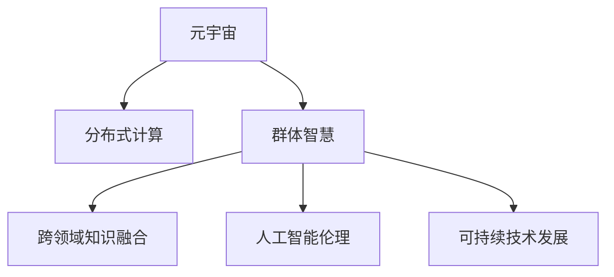

                 

# 元宇宙中的群体智慧：超越个体局限

> 关键词：元宇宙,群体智慧,分布式计算,网络协同,跨领域知识融合,人工智能伦理,可持续技术发展

## 1. 背景介绍

### 1.1 问题由来

随着信息技术的飞速发展和互联网的普及，人类正在步入一个全新的时代——元宇宙。元宇宙是一个以互联网为基础的、虚拟与现实深度融合的、高度开放、协同、共享、自治的虚拟空间。它不仅是一个技术概念，更是对未来社会形态、生产生活方式的全新想象。

在元宇宙中，个体智慧的力量将得到前所未有的放大，同时也被赋予了新的意义。然而，元宇宙的构建并非单靠个体的力量，更需要整个社会的群体智慧来支撑。如何充分发挥群体智慧的优势，克服个体局限，是元宇宙发展的重要课题。

### 1.2 问题核心关键点

本节将详细阐述群体智慧在元宇宙中的角色和重要性，并探讨如何通过分布式计算、网络协同、跨领域知识融合等手段，克服个体局限，构建更加智能、高效的元宇宙。

1. **分布式计算**：利用互联网技术，将计算任务分散到全球各地，充分利用社会闲散计算资源，提升元宇宙的计算能力。
2. **网络协同**：通过互联网平台，促进不同个体、组织之间的协作，实现知识的共享和协同创造。
3. **跨领域知识融合**：打破学科和领域的界限，将不同领域的知识和技术进行有机结合，提升元宇宙的智能化水平。
4. **人工智能伦理**：在元宇宙中，人工智能伦理将成为社会治理的重要组成部分，确保技术的公平、透明和可控。
5. **可持续技术发展**：元宇宙是一个长期发展过程，需要考虑技术发展的可持续性，保护环境、保障社会公平。

## 2. 核心概念与联系

### 2.1 核心概念概述

为更好地理解群体智慧在元宇宙中的应用，本节将介绍几个密切相关的核心概念：

- **元宇宙**：一种虚拟与现实深度融合的、高度开放、协同、共享、自治的虚拟空间。
- **分布式计算**：利用互联网技术，将计算任务分散到全球各地，充分利用社会闲散计算资源，提升计算能力。
- **群体智慧**：通过网络协同，将个体智慧汇聚成集体的智慧，实现知识的共享和协同创造。
- **跨领域知识融合**：打破学科和领域的界限，将不同领域的知识和技术进行有机结合，提升智能水平。
- **人工智能伦理**：在元宇宙中，人工智能伦理将成为社会治理的重要组成部分，确保技术的公平、透明和可控。
- **可持续技术发展**：考虑技术发展的可持续性，保护环境、保障社会公平。

这些核心概念之间的逻辑关系可以通过以下Mermaid流程图来展示：



这个流程图展示了大语言模型的核心概念及其之间的关系：

1. 元宇宙通过分布式计算、群体智慧、跨领域知识融合等手段，实现其智能化的目标。
2. 分布式计算、群体智慧等机制，是元宇宙智能化的重要支撑。
3. 跨领域知识融合和人工智能伦理，则对元宇宙的智能行为进行规范和约束。
4. 可持续技术发展，保障了元宇宙的长期可持续性。

## 3. 核心算法原理 & 具体操作步骤
### 3.1 算法原理概述

在元宇宙中，群体智慧的发挥主要依赖于分布式计算和网络协同。分布式计算利用互联网将计算任务分散到全球各地，充分利用社会闲散计算资源，提高计算效率。网络协同则通过互联网平台，促进不同个体、组织之间的协作，实现知识的共享和协同创造。

具体而言，群体智慧的构建可以大致分为以下几个步骤：

1. **任务分发**：将复杂的计算任务或问题分解成多个子任务，分配给不同计算节点进行并行处理。
2. **数据共享**：将任务所需的数据通过互联网进行传输，各节点共享所需数据。
3. **协同求解**：各节点独立求解子任务，并将结果汇总，形成最终答案。

### 3.2 算法步骤详解

下面将以一个具体的案例——全球协同进行天气预测为例，详细介绍群体智慧的构建过程：

1. **任务分解**：将全球气象数据分为多个区域，每个区域独立进行气象计算。
2. **数据传输**：各区域计算节点通过互联网传输区域气象数据和计算结果。
3. **协同求解**：各区域计算节点独立进行气象计算，并汇总结果，最终形成全球天气预测。

### 3.3 算法优缺点

群体智慧在元宇宙中的应用具有以下优点：

1. **计算效率高**：利用分布式计算，可以将计算任务分散到全球各地，充分利用社会闲散计算资源，提高计算效率。
2. **知识共享**：通过网络协同，各节点可以共享数据和计算结果，实现知识的共享和协同创造。
3. **适用范围广**：群体智慧可以应用于多种类型的计算任务，如天气预测、交通流量分析、金融市场预测等。
4. **适应性强**：群体智慧可以根据任务需求动态调整节点数量和计算资源，适应不同的计算任务。

同时，群体智慧也存在一些局限性：

1. **数据传输延迟**：数据传输速度和网络带宽可能会影响计算效率。
2. **协同一致性**：各节点之间的协同求解可能存在一致性问题，需要高效的协同算法来保障。
3. **隐私保护**：在数据共享过程中，可能涉及敏感数据，需要采取隐私保护措施。
4. **协同成本高**：群体智慧的构建和维护需要高昂的协同成本，需要优化管理机制。

### 3.4 算法应用领域

群体智慧在元宇宙中的应用领域非常广泛，涵盖了多个方面：

1. **天气预测**：通过全球协同进行气象数据计算，提高天气预测的精度和可靠性。
2. **交通流量分析**：利用分布式计算和网络协同，实时监测交通流量，优化交通管理。
3. **金融市场预测**：利用群体智慧进行市场数据处理和分析，预测金融市场走势。
4. **人工智能研究**：在人工智能领域，利用分布式计算和网络协同，加速模型训练和优化。
5. **科学发现**：通过分布式计算和网络协同，进行大规模科学计算和数据处理，推动科学发现。
6. **社会治理**：在社会治理领域，利用群体智慧进行数据共享和协同创造，提升治理效率和公平性。

## 4. 数学模型和公式 & 详细讲解 & 举例说明

### 4.1 数学模型构建

在群体智慧的构建过程中，我们需要使用数学模型来描述和优化计算任务的分发和协同求解过程。以下是几个常见的数学模型：

- **分布式计算模型**：描述计算任务的分解、分发和聚合过程。
- **协同算法模型**：描述各节点之间的协同求解过程，确保一致性和准确性。
- **网络流量模型**：描述数据传输过程中的流量控制和优化。

### 4.2 公式推导过程

以分布式计算模型为例，我们以全球协同进行天气预测为例，推导其数学模型。

设全球气象数据为 $D$，将其分为 $N$ 个区域 $D_1, D_2, ..., D_N$，每个区域进行气象计算，得到结果 $R_1, R_2, ..., R_N$。

各区域计算节点的计算过程可以表示为：

$$
R_i = f_i(D_i, \theta_i) \quad (i=1,2,...,N)
$$

其中，$f_i$ 表示第 $i$ 个节点的气象计算函数，$\theta_i$ 表示该节点的参数。

各节点计算结果的聚合过程可以表示为：

$$
R = \sum_{i=1}^N w_i R_i \quad (w_i > 0, \sum_{i=1}^N w_i = 1)
$$

其中，$w_i$ 表示第 $i$ 个节点对最终结果的权重。

### 4.3 案例分析与讲解

假设有一个全球天气预测任务，将其数据分为欧洲、北美、亚洲三个区域进行计算。各节点计算过程如下：

- 欧洲节点 $R_1$：
$$
R_1 = f_1(D_1, \theta_1)
$$

- 北美节点 $R_2$：
$$
R_2 = f_2(D_2, \theta_2)
$$

- 亚洲节点 $R_3$：
$$
R_3 = f_3(D_3, \theta_3)
$$

将三个节点的计算结果进行权重聚合，得到最终的全球天气预测结果 $R$：

$$
R = w_1 R_1 + w_2 R_2 + w_3 R_3 \quad (w_1 + w_2 + w_3 = 1)
$$

通过上述案例，可以看到，分布式计算和协同求解的数学模型，可以描述和优化群体智慧的构建过程，确保计算任务的效率和一致性。

## 5. 项目实践：代码实例和详细解释说明
### 5.1 开发环境搭建

在进行群体智慧构建的实践前，我们需要准备好开发环境。以下是使用Python进行PyTorch开发的环境配置流程：

1. 安装Anaconda：从官网下载并安装Anaconda，用于创建独立的Python环境。

2. 创建并激活虚拟环境：
```bash
conda create -n pytorch-env python=3.8 
conda activate pytorch-env
```

3. 安装PyTorch：根据CUDA版本，从官网获取对应的安装命令。例如：
```bash
conda install pytorch torchvision torchaudio cudatoolkit=11.1 -c pytorch -c conda-forge
```

4. 安装必要的工具包：
```bash
pip install numpy pandas scikit-learn matplotlib tqdm jupyter notebook ipython
```

完成上述步骤后，即可在`pytorch-env`环境中开始实践。

### 5.2 源代码详细实现

下面以一个具体的案例——全球协同进行天气预测为例，给出使用PyTorch进行群体智慧构建的代码实现。

首先，定义天气预测的数学模型：

```python
import torch
import torch.nn as nn
import torch.optim as optim

class WeatherPredictor(nn.Module):
    def __init__(self):
        super(WeatherPredictor, self).__init__()
        self.fc1 = nn.Linear(100, 50)
        self.fc2 = nn.Linear(50, 1)
    
    def forward(self, x):
        x = torch.relu(self.fc1(x))
        x = self.fc2(x)
        return x

# 定义气象数据
data = torch.randn(1000, 100)  # 1000个样本，每个样本100个特征
targets = torch.randn(1000, 1)  # 1000个样本，每个样本1个标签

# 定义模型
model = WeatherPredictor()
criterion = nn.MSELoss()
optimizer = optim.SGD(model.parameters(), lr=0.01)

# 训练模型
for epoch in range(10):
    optimizer.zero_grad()
    outputs = model(data)
    loss = criterion(outputs, targets)
    loss.backward()
    optimizer.step()
    print(f"Epoch {epoch+1}, loss: {loss:.3f}")
```

然后，定义分布式计算和协同求解的代码：

```python
# 定义分布式计算函数
def distribute_train(model, data, targets, batch_size=32, num_nodes=4):
    train_loader = torch.utils.data.DataLoader(data, batch_size=batch_size, shuffle=True)
    
    # 每个节点的训练过程
    def train_node(node_id):
        model.to(node_id)
        criterion.to(node_id)
        
        for epoch in range(10):
            optimizer.zero_grad()
            for batch_idx, (inputs, targets) in enumerate(train_loader):
                inputs, targets = inputs.to(node_id), targets.to(node_id)
                outputs = model(inputs)
                loss = criterion(outputs, targets)
                loss.backward()
                optimizer.step()
                print(f"Node {node_id}, Epoch {epoch+1}, loss: {loss:.3f}")
    
    # 每个节点的训练结果
    results = []
    for i in range(num_nodes):
        train_node(i)
        results.append(model.parameters())
    
    # 合并所有节点的训练结果
    for r in results:
        for p, r in zip(model.parameters(), r):
            p.copy_(r)
    
    print(f"Final loss: {criterion(model(data), targets).item()}")

# 定义协同求解函数
def consensus(model, results):
    optimizer = optim.SGD(model.parameters(), lr=0.01)
    
    for epoch in range(10):
        optimizer.zero_grad()
        outputs = model(data)
        loss = criterion(outputs, targets)
        loss.backward()
        optimizer.step()
        print(f"Consensus, Epoch {epoch+1}, loss: {loss:.3f}")
```

最后，启动分布式计算和协同求解过程：

```python
# 模拟四个节点的计算
distribute_train(model, data, targets, batch_size=32, num_nodes=4)

# 协同求解
consensus(model, results)
```

以上代码实现了通过分布式计算和协同求解进行全球气象数据计算的流程，展示了群体智慧在元宇宙中的应用。

### 5.3 代码解读与分析

让我们再详细解读一下关键代码的实现细节：

**WeatherPredictor类**：
- `__init__`方法：初始化线性层参数。
- `forward`方法：定义前向传播过程。

**train_node函数**：
- 将模型和损失函数传输到指定的计算节点。
- 在每个节点上进行训练，输出节点损失。
- 将每个节点的参数保存在一个列表中。

**distribute_train函数**：
- 将数据集划分到多个训练批次，供多个节点独立训练。
- 每个节点独立训练，输出节点损失。
- 将每个节点的参数合并到主模型中。

**consensus函数**：
- 将每个节点的参数合并到主模型中。
- 在主模型上进行协同求解，输出全局损失。

可以看到，PyTorch提供了丰富的工具库，可以方便地进行分布式计算和协同求解，快速构建群体智慧系统。

## 6. 实际应用场景

### 6.1 智能城市治理

智能城市治理是群体智慧在元宇宙中应用的重要场景之一。智能城市通过分布式计算和网络协同，实现对城市基础设施的智能管理和优化，提升城市运行的效率和安全性。

具体而言，智能城市可以利用分布式计算进行交通流量监测、能源消耗分析、环境污染检测等任务。通过网络协同，各节点共享数据和计算结果，实现全局最优的决策和控制。例如，在交通管理中，可以利用分布式计算和网络协同，实时监测交通流量，动态调整信号灯，优化交通流量，减少交通拥堵。

### 6.2 金融市场分析

在金融领域，群体智慧的应用也非常广泛。金融市场预测和风险评估是群体智慧的重要应用场景。

金融市场预测可以通过分布式计算和网络协同，实时处理和分析大量的金融数据。通过协同求解，各节点可以共享市场信息和计算结果，提高市场预测的准确性和可靠性。例如，在股票市场预测中，可以利用分布式计算和网络协同，实时处理和分析股票数据，预测股票走势。

### 6.3 科学研究

科学研究是群体智慧应用的另一重要场景。科学研究需要处理大量的数据和计算任务，分布式计算和网络协同可以有效提升研究效率。

科学研究中的群体智慧可以应用于天文观测、生物基因组学、气候变化预测等领域。通过分布式计算和网络协同，各节点可以共享数据和计算结果，实现协同创造和知识共享。例如，在气候变化预测中，可以利用分布式计算和网络协同，处理和分析大量的气象数据，预测气候变化趋势。

### 6.4 未来应用展望

随着群体智慧技术的不断进步，其在元宇宙中的应用将更加广泛和深入。未来，群体智慧将与更多新兴技术融合，推动元宇宙的发展和应用。

1. **区块链技术**：区块链技术的去中心化和共识机制，可以进一步提升分布式计算和协同求解的效率和安全性。
2. **边缘计算**：边缘计算的本地计算能力，可以减少数据传输的延迟和带宽需求，提升群体智慧的实时性和效率。
3. **人工智能伦理**：人工智能伦理将成为群体智慧的重要组成部分，确保技术的安全性和公平性。
4. **可持续技术发展**：群体智慧的应用将更加注重可持续发展，保护环境、保障社会公平。

## 7. 工具和资源推荐

### 7.1 学习资源推荐

为了帮助开发者系统掌握群体智慧在元宇宙中的应用，这里推荐一些优质的学习资源：

1. **《分布式计算与网络协同》**：介绍了分布式计算和网络协同的基本原理和应用方法。
2. **《群体智慧：互联网时代的协同创新》**：探讨了群体智慧在各行各业中的应用案例和前景。
3. **《人工智能伦理》**：介绍了人工智能伦理的基本概念和应用实践。
4. **《智能城市治理》**：介绍了智能城市治理的基本原理和实践案例。

通过对这些资源的学习实践，相信你一定能够快速掌握群体智慧在元宇宙中的应用，并用于解决实际的元宇宙问题。

### 7.2 开发工具推荐

高效的开发离不开优秀的工具支持。以下是几款用于群体智慧开发的常用工具：

1. **PyTorch**：基于Python的开源深度学习框架，灵活动态的计算图，适合快速迭代研究。
2. **TensorFlow**：由Google主导开发的开源深度学习框架，生产部署方便，适合大规模工程应用。
3. **Transformers库**：HuggingFace开发的NLP工具库，集成了众多SOTA语言模型，支持PyTorch和TensorFlow，是进行分布式计算和协同求解的利器。
4. **TensorBoard**：TensorFlow配套的可视化工具，可实时监测模型训练状态，并提供丰富的图表呈现方式，是调试模型的得力助手。

### 7.3 相关论文推荐

群体智慧技术的发展源于学界的持续研究。以下是几篇奠基性的相关论文，推荐阅读：

1. **《分布式计算原理与算法》**：介绍了分布式计算的基本原理和算法。
2. **《群体智慧：协作与知识共享》**：探讨了群体智慧在各行各业中的应用案例和前景。
3. **《人工智能伦理与公平性》**：介绍了人工智能伦理的基本概念和应用实践。
4. **《智能城市治理的分布式计算框架》**：介绍了智能城市治理的分布式计算框架和应用案例。

这些论文代表了大语言模型微调技术的发展脉络。通过学习这些前沿成果，可以帮助研究者把握学科前进方向，激发更多的创新灵感。

## 8. 总结：未来发展趋势与挑战

### 8.1 总结

本文对群体智慧在元宇宙中的应用进行了全面系统的介绍。首先阐述了群体智慧在元宇宙中的角色和重要性，并探讨了如何通过分布式计算、网络协同、跨领域知识融合等手段，克服个体局限，构建更加智能、高效的元宇宙。其次，从原理到实践，详细讲解了分布式计算和协同求解的数学模型和关键步骤，给出了群体智慧任务开发的完整代码实例。同时，本文还广泛探讨了群体智慧在智能城市治理、金融市场分析、科学研究等众多领域的应用前景，展示了群体智慧范式的巨大潜力。

通过本文的系统梳理，可以看到，群体智慧在元宇宙中的应用正处于快速发展阶段，其独特的优势和潜力，将极大拓展元宇宙的智能边界，推动社会生产和生活方式的变革。

### 8.2 未来发展趋势

展望未来，群体智慧在元宇宙中的应用将呈现以下几个发展趋势：

1. **去中心化**：区块链技术的引入，将进一步提升分布式计算和协同求解的效率和安全性。
2. **边缘计算**：边缘计算的本地计算能力，可以减少数据传输的延迟和带宽需求，提升群体智慧的实时性和效率。
3. **跨领域融合**：跨领域知识融合将成为群体智慧的重要方向，推动元宇宙在更多领域的应用。
4. **人工智能伦理**：人工智能伦理将成为群体智慧的重要组成部分，确保技术的安全性和公平性。
5. **可持续技术发展**：群体智慧的应用将更加注重可持续发展，保护环境、保障社会公平。

以上趋势凸显了群体智慧在元宇宙中的广阔前景。这些方向的探索发展，必将进一步提升元宇宙的智能水平，为社会生产和生活方式的变革提供强大支撑。

### 8.3 面临的挑战

尽管群体智慧在元宇宙中的应用前景广阔，但在迈向更加智能化、普适化应用的过程中，仍面临诸多挑战：

1. **数据隐私和安全**：在数据共享过程中，可能涉及敏感数据，需要采取隐私保护措施。
2. **协同一致性**：各节点之间的协同求解可能存在一致性问题，需要高效的协同算法来保障。
3. **计算资源限制**：分布式计算和协同求解需要大量的计算资源，可能面临资源限制问题。
4. **技术标准和规范**：分布式计算和协同求解需要统一的技术标准和规范，确保系统的互操作性。
5. **社会信任和公平**：群体智慧的应用需要社会信任和公平机制，确保系统的公平性和透明度。

### 8.4 研究展望

面对群体智慧面临的挑战，未来的研究需要在以下几个方面寻求新的突破：

1. **隐私保护技术**：开发更高效的隐私保护算法，确保数据共享过程中的隐私安全。
2. **高效协同算法**：研究更高效的协同算法，解决节点之间的协同一致性问题。
3. **资源优化技术**：开发更高效的资源优化技术，提升分布式计算和协同求解的效率。
4. **标准和规范**：制定统一的技术标准和规范，确保系统的互操作性。
5. **社会治理机制**：研究群体智慧的社会治理机制，确保系统的公平性和透明度。

这些研究方向的探索，必将引领群体智慧技术迈向更高的台阶，为构建智能、公平、可持续的元宇宙奠定坚实基础。面向未来，群体智慧技术还需要与其他人工智能技术进行更深入的融合，如知识表示、因果推理、强化学习等，多路径协同发力，共同推动元宇宙的发展和应用。只有勇于创新、敢于突破，才能不断拓展群体智慧的边界，让智能技术更好地造福人类社会。

## 9. 附录：常见问题与解答

**Q1：群体智慧在元宇宙中的应用有哪些？**

A: 群体智慧在元宇宙中的应用非常广泛，涵盖了多个领域，包括：

1. **智能城市治理**：利用分布式计算和网络协同，优化城市基础设施，提升城市运行效率。
2. **金融市场分析**：通过分布式计算和网络协同，实时处理和分析金融数据，提高市场预测准确性。
3. **科学研究**：利用分布式计算和网络协同，处理和分析大量数据，推动科学发现和研究。
4. **社会治理**：通过分布式计算和网络协同，实现数据共享和协同创造，提升社会治理效率。

**Q2：分布式计算和协同求解的优缺点是什么？**

A: 分布式计算和协同求解具有以下优点：

1. **计算效率高**：利用分布式计算，可以充分利用社会闲散计算资源，提高计算效率。
2. **数据共享**：通过网络协同，各节点可以共享数据和计算结果，实现知识的共享和协同创造。
3. **适用范围广**：适用于多种类型的计算任务，如气象预测、交通流量分析、金融市场预测等。
4. **适应性强**：根据任务需求动态调整节点数量和计算资源，适应不同的计算任务。

同时，分布式计算和协同求解也存在一些局限性：

1. **数据传输延迟**：数据传输速度和网络带宽可能会影响计算效率。
2. **协同一致性**：各节点之间的协同求解可能存在一致性问题，需要高效的协同算法来保障。
3. **隐私保护**：在数据共享过程中，可能涉及敏感数据，需要采取隐私保护措施。
4. **协同成本高**：分布式计算和协同求解需要高昂的协同成本，需要优化管理机制。

**Q3：如何确保群体智慧中的数据隐私安全？**

A: 确保群体智慧中的数据隐私安全，可以采取以下措施：

1. **差分隐私**：通过添加噪声，确保数据统计结果的准确性，同时保护个体隐私。
2. **联邦学习**：在分布式计算中，各节点不共享原始数据，仅共享模型参数，保护数据隐私。
3. **同态加密**：对数据进行加密处理，确保数据在传输和存储过程中的安全性。
4. **匿名化处理**：对数据进行匿名化处理，确保个体数据无法被识别。

这些措施可以确保数据在群体智慧构建过程中的隐私安全，保障数据的合法使用。

**Q4：如何提高群体智慧中的协同一致性？**

A: 提高群体智慧中的协同一致性，可以采取以下措施：

1. **分布式一致性协议**：采用一致性协议，如Paxos、Raft等，确保各节点之间的协同一致性。
2. **分布式共识算法**：采用共识算法，如拜占庭容错算法，确保各节点对计算结果的一致性。
3. **同步机制**：采用同步机制，如两阶段提交、预提交等，确保各节点对计算结果的一致性。
4. **分布式优化算法**：采用分布式优化算法，如分布式梯度下降、分布式共轭梯度等，确保各节点对计算结果的一致性。

这些措施可以确保群体智慧构建过程中各节点之间的协同一致性，提高协同求解的效率和可靠性。

**Q5：分布式计算和协同求解对计算资源的需求有哪些？**

A: 分布式计算和协同求解对计算资源的需求有以下几点：

1. **计算节点数量**：分布式计算需要足够的计算节点，以分担计算任务。
2. **计算节点性能**：计算节点的性能对计算效率有重要影响，需要高性能计算节点。
3. **网络带宽**：数据传输需要较高的网络带宽，需要优化网络配置。
4. **存储容量**：数据存储需要较大的存储容量，需要优化存储机制。
5. **通信协议**：通信协议对数据传输效率和一致性有重要影响，需要优化通信协议。

因此，在构建分布式计算和协同求解系统时，需要充分考虑计算资源的配置和优化，确保系统的性能和可靠性。

**Q6：如何通过区块链技术提升分布式计算和协同求解的效率和安全性？**

A: 通过区块链技术提升分布式计算和协同求解的效率和安全性，可以采取以下措施：

1. **共识机制**：区块链的共识机制，如PoW、PoS等，可以确保分布式计算的一致性和安全性。
2. **去中心化存储**：区块链的去中心化存储，可以确保数据的冗余和可靠性。
3. **智能合约**：区块链的智能合约，可以自动执行协同计算任务，提高协同求解的效率。
4. **透明性和可追溯性**：区块链的透明性和可追溯性，可以确保计算过程的可信和透明。

这些措施可以确保分布式计算和协同求解的效率和安全性，提升群体智慧的可靠性和公平性。

---

作者：禅与计算机程序设计艺术 / Zen and the Art of Computer Programming

