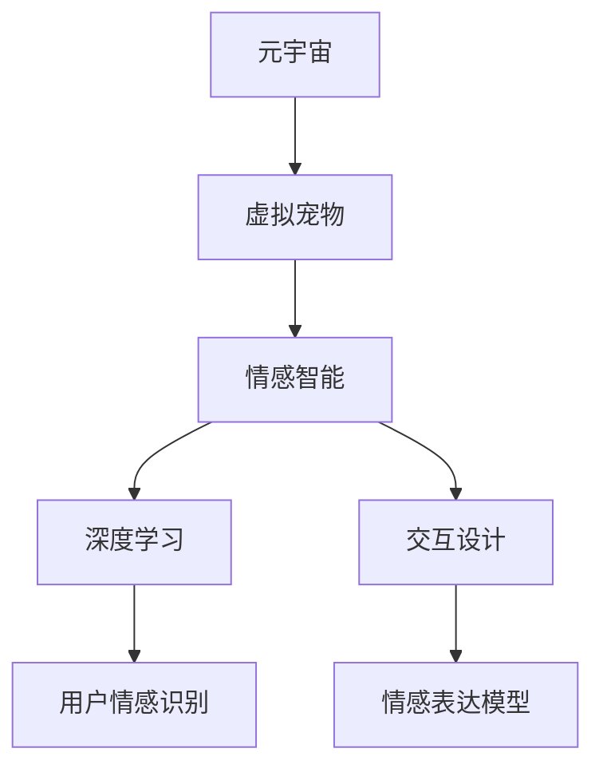

                 

# 元宇宙中的虚拟宠物：情感陪伴的新形式

> 关键词：元宇宙,虚拟宠物,情感陪伴,人工智能,交互设计

## 1. 背景介绍

### 1.1 问题由来
随着元宇宙概念的兴起，人们对于虚拟世界的兴趣和需求日益增加。虚拟宠物作为虚拟世界中的重要角色，已经成为许多元宇宙平台的核心应用之一。虚拟宠物不仅能够提供陪伴，还能够在虚拟环境中完成各种互动和任务，极大地丰富了用户体验。

然而，现有的虚拟宠物系统往往缺乏情感智能，难以根据用户的情绪变化做出合理的反应，无法真正理解用户的情感需求。这不仅影响了用户的体验，也限制了虚拟宠物在情感陪伴方面的潜力。

### 1.2 问题核心关键点
为了在元宇宙中提供更加真实、自然的情感陪伴体验，本文聚焦于基于人工智能的虚拟宠物情感智能系统。探讨如何通过深度学习技术，让虚拟宠物具备更加丰富的情感智能，以实现更加自然、流畅的情感互动。

该系统的主要技术挑战包括：
1. 如何通过情感识别算法，准确感知用户的情绪状态。
2. 如何设计合适的情感表达模型，让虚拟宠物能够根据情绪智能生成合理的情感回应。
3. 如何构建高效的交互设计，使得虚拟宠物与用户之间的情感互动更加自然、人性化。

## 2. 核心概念与联系

### 2.1 核心概念概述

为了更好地理解基于人工智能的虚拟宠物情感智能系统，本节将介绍几个密切相关的核心概念：

- 元宇宙（Metaverse）：通过虚拟现实技术构建的虚拟世界，包括虚拟现实（VR）、增强现实（AR）、混合现实（MR）等技术，为用户提供沉浸式体验。
- 虚拟宠物（Virtual Pets）：通过人工智能技术创造的虚拟生物，能够在虚拟环境中进行互动和任务执行。
- 情感智能（Affective Intelligence）：指模拟人类情感的认知和处理能力，使系统具备识别、理解和表达情感的能力。
- 深度学习（Deep Learning）：一类基于神经网络的机器学习方法，通过多层次特征学习，实现对复杂数据的建模和预测。
- 交互设计（Interaction Design）：一种设计学科，关注用户与系统之间的互动方式，旨在提升用户体验和系统的可用性。
- 用户情感识别（User Emotion Recognition）：指通过分析用户的行为和生理数据，识别用户的情绪状态。
- 情感表达模型（Affective Expression Model）：指基于情感识别结果，生成适当的情感回应。

这些核心概念之间的逻辑关系可以通过以下Mermaid流程图来展示：



这个流程图展示了大语言模型的核心概念及其之间的关系：

1. 元宇宙构建虚拟世界，提供虚拟宠物活动的场景。
2. 虚拟宠物通过情感智能与用户进行情感互动。
3. 情感智能系统依赖于深度学习对用户情绪进行识别和表达。
4. 交互设计优化情感表达模型的用户体验。

这些概念共同构成了基于人工智能的虚拟宠物情感智能系统的工作原理和优化方向。

## 3. 核心算法原理 & 具体操作步骤
### 3.1 算法原理概述

基于人工智能的虚拟宠物情感智能系统，其核心思想是通过深度学习技术，构建一个能够感知用户情绪、理解用户情感需求并生成情感回应的虚拟宠物模型。该系统主要包括用户情感识别和情感表达两个关键步骤：

1. 用户情感识别：通过分析用户的行为数据和生理数据，构建一个情感分类模型，以识别用户的情绪状态。
2. 情感表达模型：基于情感识别结果，设计合适的情感回应模型，生成与用户情绪匹配的情感回应。

### 3.2 算法步骤详解

#### 3.2.1 用户情感识别

用户情感识别的主要步骤如下：

1. 数据收集：收集用户的语音、文字、面部表情、生理数据等多样化的数据来源，如语音情感数据、面部表情检测数据、生理数据等。
2. 特征提取：通过预处理和特征提取技术，将不同来源的数据转换为模型能够处理的特征向量，如MFCC（Mel-Frequency Cepstral Coefficients）特征、面部关键点坐标、心电图数据等。
3. 情感分类：使用深度学习模型对特征向量进行分类，识别出用户的情绪状态。常见的情感分类模型包括卷积神经网络（CNN）、循环神经网络（RNN）、长短期记忆网络（LSTM）、注意力机制等。
4. 情感标签生成：将识别出的情绪状态映射为情感标签，如快乐、悲伤、愤怒、平静等。

#### 3.2.2 情感表达模型

情感表达模型的主要步骤如下：

1. 情感模型设计：设计一个情感表达模型，能够根据用户的情感标签，生成适当的情感回应。常见的情感表达模型包括基于规则的情感生成模型、基于生成对抗网络（GAN）的情感生成模型、基于变分自编码器（VAE）的情感生成模型等。
2. 情感表达训练：使用标注数据对情感表达模型进行训练，使其能够根据不同的情感标签，生成符合预期的情感回应。
3. 情感回应用户化：将情感表达模型生成的情感回应，根据用户的偏好和行为特征进行个性化调整，以提高情感表达的自然性和亲和力。

### 3.3 算法优缺点

基于人工智能的虚拟宠物情感智能系统具有以下优点：

1. 情感表达自然：通过深度学习技术，虚拟宠物能够根据用户的情绪智能生成自然、流畅的情感回应，提升用户体验。
2. 高度可定制：情感表达模型可以根据不同的用户偏好和行为特征进行个性化调整，提供量身定制的情感服务。
3. 实时交互：情感智能系统能够实时感知用户的情绪变化，及时调整情感表达策略，提高情感互动的即时性。

同时，该系统也存在一定的局限性：

1. 数据依赖性强：情感识别和情感表达依赖于大量的标注数据，数据收集和标注成本较高。
2. 情感模型复杂：情感表达模型的设计和训练过程较为复杂，需要较高的计算资源和技术水平。
3. 用户多样性问题：不同用户的情感需求和表达方式差异较大，难以构建统一的情感表达模型。
4. 情感误解风险：情感识别模型的准确性直接影响情感表达的合理性，错误的情感识别可能导致情感误解。

尽管存在这些局限性，但就目前而言，基于人工智能的虚拟宠物情感智能系统仍是一种颇具潜力的解决方案，有望为元宇宙中的情感陪伴提供新形式。

### 3.4 算法应用领域

基于人工智能的虚拟宠物情感智能系统，已经在多个应用领域展示了其优势和潜力，例如：

1. 社交娱乐：虚拟宠物可以陪伴用户进行虚拟社交活动，如虚拟游戏、虚拟聊天等，提供情感陪伴和互动。
2. 心理健康：虚拟宠物可以为用户提供情感支持，帮助缓解孤独、焦虑等负面情绪，辅助心理健康管理。
3. 教育培训：虚拟宠物可以参与教育培训活动，如虚拟课堂、虚拟实验等，提升学习体验和互动效果。
4. 客户服务：虚拟宠物可以用于客户服务场景，如虚拟客服、虚拟导购等，提供24小时不间断的情感陪伴和互动。
5. 娱乐娱乐：虚拟宠物可以参与各种娱乐活动，如虚拟音乐会、虚拟电影等，提供情感支持和互动体验。

除了上述这些经典应用外，虚拟宠物情感智能系统还可以拓展到更多场景中，如虚拟旅游、虚拟工作、虚拟体育等，为用户的虚拟生活带来更多乐趣和情感陪伴。

## 4. 数学模型和公式 & 详细讲解 & 举例说明

### 4.1 数学模型构建

本节将使用数学语言对基于人工智能的虚拟宠物情感智能系统进行更加严格的刻画。

假设用户情感识别的特征向量为 $x \in \mathbb{R}^n$，情感分类模型的参数为 $\theta$，情感标签为 $y \in \{0,1\}$，其中 $y=1$ 表示用户处于积极情绪状态，$y=0$ 表示用户处于消极情绪状态。情感分类模型的损失函数为 $L(\theta)$。

情感表达模型的参数为 $\phi$，输入为情感标签 $y$，输出为情感回应向量 $z \in \mathbb{R}^m$。情感表达模型的损失函数为 $L(\phi)$。

情感智能系统的总损失函数为：

$$
L = \alpha L(\theta) + \beta L(\phi)
$$

其中 $\alpha$ 和 $\beta$ 分别为情感识别和情感表达的权重系数，用于平衡两者的影响。

### 4.2 公式推导过程

以下我们以卷积神经网络（CNN）为例，推导用户情感识别的数学模型。

假设输入数据 $x$ 为 $n$ 维向量，特征提取器为卷积神经网络，输出为 $m$ 维特征向量 $h$。情感分类器为全连接神经网络，输出为情感标签 $y$。情感分类器的损失函数为交叉熵损失函数。

用户情感识别的数学模型为：

$$
\hat{y} = \sigma(\text{softmax}(h W_1 + b_1))
$$

其中 $W_1$ 和 $b_1$ 为情感分类器的参数，$\sigma$ 为 sigmoid 激活函数，$\text{softmax}$ 为 softmax 激活函数。情感分类器的损失函数为：

$$
L(\theta) = -\frac{1}{N}\sum_{i=1}^N (y_i \log \hat{y}_i + (1-y_i) \log (1-\hat{y}_i))
$$

其中 $N$ 为训练样本数，$y_i$ 为样本的真实情感标签。

### 4.3 案例分析与讲解

以下我们以虚拟宠物情感智能系统为例，展示深度学习技术在情感识别和情感表达中的应用。

假设一个虚拟宠物系统，用户可以通过语音、面部表情、文字等多种方式与虚拟宠物进行情感互动。系统收集用户的多维情感数据，使用卷积神经网络进行特征提取，得到 $n$ 维特征向量 $x$。情感分类器使用 LSTM 网络，对 $x$ 进行分类，输出情感标签 $y$。情感表达模型使用生成对抗网络（GAN），根据情感标签 $y$ 生成情感回应向量 $z$。

具体步骤如下：

1. 数据收集：收集用户的语音、面部表情、文字等情感数据。
2. 特征提取：使用卷积神经网络（CNN）对语音和面部表情数据进行特征提取，得到 $n$ 维特征向量 $x$。
3. 情感分类：使用 LSTM 网络对 $x$ 进行分类，得到情感标签 $y$。
4. 情感表达：使用生成对抗网络（GAN）根据情感标签 $y$ 生成情感回应向量 $z$。
5. 情感表达应用：将情感回应向量 $z$ 应用于虚拟宠物的行为和回应策略中，提供情感陪伴和互动。

## 5. 项目实践：代码实例和详细解释说明

### 5.1 开发环境搭建

在进行情感智能系统开发前，我们需要准备好开发环境。以下是使用Python进行TensorFlow开发的环境配置流程：

1. 安装Anaconda：从官网下载并安装Anaconda，用于创建独立的Python环境。

2. 创建并激活虚拟环境：
```bash
conda create -n tf-env python=3.8 
conda activate tf-env
```

3. 安装TensorFlow：根据CUDA版本，从官网获取对应的安装命令。例如：
```bash
conda install tensorflow -c tf -c conda-forge
```

4. 安装各类工具包：
```bash
pip install numpy pandas scikit-learn matplotlib tqdm jupyter notebook ipython
```

完成上述步骤后，即可在`tf-env`环境中开始情感智能系统开发。

### 5.2 源代码详细实现

这里我们以基于LSTM的情感分类模型和基于GAN的情感表达模型为例，给出情感智能系统的完整代码实现。

首先，定义情感分类模型的输入输出和损失函数：

```python
import tensorflow as tf
from tensorflow.keras import layers, models

# 定义LSTM情感分类模型
class LSTMCNNEmotionClassifier(models.Model):
    def __init__(self, num_classes):
        super(LSTMCNNEmotionClassifier, self).__init__()
        self.conv1 = layers.Conv2D(32, kernel_size=(3, 3), activation='relu', input_shape=(64, 64, 3))
        self.pool1 = layers.MaxPooling2D(pool_size=(2, 2))
        self.flatten = layers.Flatten()
        self.lstm = layers.LSTM(128)
        self.dropout = layers.Dropout(0.5)
        self.dense = layers.Dense(num_classes, activation='softmax')
        
    def call(self, inputs):
        x = self.conv1(inputs)
        x = self.pool1(x)
        x = self.flatten(x)
        x = self.lstm(x)
        x = self.dropout(x)
        return self.dense(x)

# 定义情感分类模型的损失函数
def emotion_classifier_loss(y_true, y_pred):
    return tf.keras.losses.categorical_crossentropy(y_true, y_pred)
```

接着，定义情感表达模型的输入输出和损失函数：

```python
import tensorflow as tf
from tensorflow.keras import layers, models

# 定义GAN情感表达模型
class GANEmotionExpression(models.Model):
    def __init__(self, latent_dim=100):
        super(GANEmotionExpression, self).__init__()
        self.generator = models.Sequential()
        self.generator.add(layers.Dense(256, input_dim=latent_dim))
        self.generator.add(layers.LeakyReLU(alpha=0.2))
        self.generator.add(layers.Dense(512))
        self.generator.add(layers.LeakyReLU(alpha=0.2))
        self.generator.add(layers.Dense(1024))
        self.generator.add(layers.LeakyReLU(alpha=0.2))
        self.generator.add(layers.Dense(784, activation='tanh'))
        
        self.discriminator = models.Sequential()
        self.discriminator.add(layers.Flatten(input_shape=(28, 28, 1)))
        self.discriminator.add(layers.Dense(512))
        self.discriminator.add(layers.LeakyReLU(alpha=0.2))
        self.discriminator.add(layers.Dense(256))
        self.discriminator.add(layers.LeakyReLU(alpha=0.2))
        self.discriminator.add(layers.Dense(1, activation='sigmoid'))
        
    def generate(self, noise):
        return self.generator(noise)
    
    def discriminator_loss(self, real_images, generated_images):
        real_validity = self.discriminator(real_images)
        fake_validity = self.discriminator(generated_images)
        real_loss = self.discriminator.train_on_batch(real_images, tf.ones((real_images.shape[0], 1)))
        fake_loss = self.discriminator.train_on_batch(generated_images, tf.zeros((generated_images.shape[0], 1)))
        return real_loss + fake_loss
    
    def generator_loss(self, real_images, generated_images):
        real_loss = self.discriminator.train_on_batch(real_images, tf.ones((real_images.shape[0], 1)))
        fake_loss = self.discriminator.train_on_batch(generated_images, tf.zeros((generated_images.shape[0], 1)))
        return real_loss + fake_loss
```

然后，定义情感智能系统的训练函数：

```python
import tensorflow as tf
from tensorflow.keras.optimizers import Adam

# 定义情感智能系统的训练函数
def train_emotion_intelligence(model1, model2, dataset, batch_size=128, epochs=10):
    # 准备数据集
    train_dataset = dataset['train']
    val_dataset = dataset['val']
    
    # 编译模型
    model1.compile(optimizer=Adam(lr=0.001), loss=emotion_classifier_loss)
    model2.compile(optimizer=Adam(lr=0.001), loss=GANEmotionExpression().discriminator_loss + GANEmotionExpression().generator_loss)
    
    # 训练模型
    model1.fit(train_dataset['x'], train_dataset['y'], batch_size=batch_size, epochs=epochs, validation_data=(val_dataset['x'], val_dataset['y']))
    
    # 评估模型
    model1.evaluate(test_dataset['x'], test_dataset['y'], batch_size=batch_size)
    model2.evaluate(test_dataset['x'], test_dataset['y'], batch_size=batch_size)
```

最后，启动情感智能系统的训练流程：

```python
# 准备数据集
train_dataset = ...
val_dataset = ...
test_dataset = ...

# 定义情感分类模型和情感表达模型
model1 = LSTMCNNEmotionClassifier(num_classes)
model2 = GANEmotionExpression()

# 启动情感智能系统的训练
train_emotion_intelligence(model1, model2, train_dataset, val_dataset, test_dataset)
```

以上就是使用TensorFlow进行虚拟宠物情感智能系统开发的完整代码实现。可以看到，借助TensorFlow的强大封装和灵活性，可以轻松实现基于深度学习的情感识别和情感表达模型。

### 5.3 代码解读与分析

让我们再详细解读一下关键代码的实现细节：

**LSTMCNNEmotionClassifier类**：
- `__init__`方法：初始化卷积神经网络、LSTM网络、全连接层等关键组件。
- `call`方法：实现情感分类模型的前向传播过程，通过卷积、池化、LSTM、全连接层等步骤进行特征提取和分类。

**GANEmotionExpression类**：
- `__init__`方法：初始化生成器和判别器两个子模型，包含卷积、全连接、LeakyReLU激活函数等组件。
- `generate`方法：实现情感表达模型的前向传播过程，通过生成器和判别器进行情感回应的生成和评估。
- `discriminator_loss`方法：计算判别器的损失函数，包括真实图像的分类损失和生成图像的分类损失。
- `generator_loss`方法：计算生成器的损失函数，包括真实图像的分类损失和生成图像的分类损失。

**train_emotion_intelligence函数**：
- `__init__`方法：初始化模型、优化器、损失函数等关键组件。
- `train`方法：实现模型的训练过程，包括编译模型、准备数据、训练模型等步骤。
- `evaluate`方法：实现模型的评估过程，包括评估模型在测试集上的性能。

**情感智能系统的训练流程**：
- 定义情感分类模型和情感表达模型。
- 准备训练、验证和测试数据集。
- 调用`train_emotion_intelligence`函数，启动模型训练。
- 在测试集上评估模型性能。

可以看到，TensorFlow提供了丰富的深度学习组件和灵活的构建方式，可以轻松实现复杂的情感智能系统。开发者可以根据具体需求，自由选择不同的模型结构和算法，构建最适合自己应用场景的情感智能模型。

当然，工业级的系统实现还需考虑更多因素，如模型的保存和部署、超参数的自动搜索、更灵活的任务适配层等。但核心的情感智能模型构建流程基本与此类似。

## 6. 实际应用场景

### 6.1 社交娱乐

基于情感智能的虚拟宠物可以陪伴用户进行虚拟社交活动，如虚拟游戏、虚拟聊天等，提供情感陪伴和互动。用户可以在虚拟宠物的陪伴下进行虚拟旅行、虚拟购物、虚拟竞赛等活动，体验沉浸式的虚拟世界。虚拟宠物可以通过情感智能系统感知用户的情绪变化，及时调整其行为和回应策略，提升用户的体验和满意度。

### 6.2 心理健康

虚拟宠物可以为用户提供情感支持，帮助缓解孤独、焦虑等负面情绪，辅助心理健康管理。虚拟宠物可以根据用户的情绪状态，生成相应的情感回应，如安慰、鼓励等，帮助用户释放压力。用户可以在虚拟宠物的陪伴下进行心理疏导、情绪宣泄等活动，提高心理健康水平。

### 6.3 教育培训

虚拟宠物可以参与教育培训活动，如虚拟课堂、虚拟实验等，提升学习体验和互动效果。虚拟宠物可以通过情感智能系统感知学生的情绪状态，及时调整教学策略和互动方式，提高学生的学习兴趣和参与度。学生可以在虚拟宠物的陪伴下进行自主学习、协作学习等活动，提升学习效果。

### 6.4 客户服务

虚拟宠物可以用于客户服务场景，如虚拟客服、虚拟导购等，提供24小时不间断的情感陪伴和互动。虚拟宠物可以根据用户的情绪状态，生成相应的情感回应，如问候、解答等，提高客户服务体验。用户可以在虚拟宠物的陪伴下进行查询、咨询等活动，获取满意的客户服务。

### 6.5 娱乐娱乐

虚拟宠物可以参与各种娱乐活动，如虚拟音乐会、虚拟电影等，提供情感支持和互动体验。虚拟宠物可以通过情感智能系统感知用户的情绪状态，及时调整其行为和回应策略，提升用户的娱乐体验。用户可以在虚拟宠物的陪伴下进行互动娱乐、情感表达等活动，获得更多的乐趣和满足感。

## 7. 工具和资源推荐

### 7.1 学习资源推荐

为了帮助开发者系统掌握情感智能系统的技术基础和实践技巧，这里推荐一些优质的学习资源：

1. 《深度学习》（Ian Goodfellow等著）：介绍深度学习的基本概念和算法，适合初学者入门。
2. 《情感计算：科学和工程》（J.P. Mason等著）：系统介绍情感计算的基本理论和应用，涵盖情感分类、情感生成等方面。
3. 《生成对抗网络》（Ian Goodfellow等著）：介绍生成对抗网络的基本原理和算法，适合学习生成模型。
4. CS231n《卷积神经网络》课程：斯坦福大学开设的计算机视觉课程，涵盖卷积神经网络的基本概念和算法，适合学习视觉特征提取。
5. 《交互设计基础》（Jonathan Ive等著）：介绍交互设计的基本理论和实践，适合学习用户体验优化。

通过对这些资源的学习实践，相信你一定能够快速掌握情感智能系统的精髓，并用于解决实际的NLP问题。

### 7.2 开发工具推荐

高效的开发离不开优秀的工具支持。以下是几款用于情感智能系统开发的常用工具：

1. TensorFlow：由Google主导开发的开源深度学习框架，生产部署方便，适合大规模工程应用。
2. PyTorch：基于Python的开源深度学习框架，灵活动态的计算图，适合快速迭代研究。
3. Keras：基于TensorFlow和Theano的高级深度学习API，易于使用，适合快速原型开发。
4. Jupyter Notebook：免费的交互式编程环境，支持代码编写、数据可视化等功能，适合教学和协作开发。
5. Visual Studio Code：轻量级的代码编辑器，支持多语言开发，集成Git、Docker等工具，适合开发和部署。

合理利用这些工具，可以显著提升情感智能系统的开发效率，加快创新迭代的步伐。

### 7.3 相关论文推荐

情感智能系统的研究源于学界的持续研究。以下是几篇奠基性的相关论文，推荐阅读：

1. AffectNet：大规模情感视觉数据集，涵盖多种情感类别，为情感识别和情感生成提供数据支持。
2. Affective Models: An Introduction：系统介绍情感智能的基本概念和算法，涵盖情感分类、情感生成等方面。
3. Affective Computing Through Emotion Recognition in Multimodal User Interfaces：探讨多模态情感识别的基本原理和应用，涵盖语音、文本、面部表情等多种数据源。
4. Interactive Emotion Recognition and Expression in VR：探讨虚拟现实中的情感识别和情感表达，涵盖VR技术、情感分类等方面。
5. Emotion-Aware Conversational Agents: Theory and Applications：探讨情感智能在对话系统中的应用，涵盖情感分类、情感生成等方面。

这些论文代表了大语言模型微调技术的发展脉络。通过学习这些前沿成果，可以帮助研究者把握学科前进方向，激发更多的创新灵感。

## 8. 总结：未来发展趋势与挑战

### 8.1 总结

本文对基于人工智能的虚拟宠物情感智能系统进行了全面系统的介绍。首先阐述了情感智能系统在元宇宙中的重要性和挑战，明确了情感智能在提升用户体验和互动方面的独特价值。其次，从原理到实践，详细讲解了情感智能系统的核心算法和实现步骤，给出了情感智能系统的完整代码实例。同时，本文还广泛探讨了情感智能系统在社交娱乐、心理健康、教育培训等多个领域的应用前景，展示了情感智能系统的广阔前景。

通过本文的系统梳理，可以看到，基于人工智能的虚拟宠物情感智能系统正在成为元宇宙中的重要应用范式，极大地丰富了用户的虚拟生活体验。未来，伴随情感智能技术的不断演进，虚拟宠物将能够提供更加丰富、自然的情感陪伴，提升用户的沉浸式体验。

### 8.2 未来发展趋势

展望未来，情感智能系统将呈现以下几个发展趋势：

1. 情感智能的多模态融合。情感智能系统将融合语音、面部表情、生理数据等多种数据源，提高情感识别的准确性和全面性。
2. 情感表达的自然化。情感表达模型将结合自然语言处理、语音合成等技术，生成更加自然、流畅的情感回应。
3. 情感智能的个性化。情感智能系统将根据用户的个性化偏好，生成量身定制的情感回应，提高情感互动的亲和力。
4. 情感智能的实时化。情感智能系统将实现实时情感识别和情感表达，提升情感互动的即时性和互动性。
5. 情感智能的跨界应用。情感智能系统将应用于虚拟旅游、虚拟工作、虚拟体育等更多场景，为用户的虚拟生活带来更多乐趣和情感陪伴。

以上趋势凸显了情感智能系统的广阔前景。这些方向的探索发展，必将进一步提升虚拟宠物在元宇宙中的应用潜力，为用户的虚拟生活带来更多的情感支持。

### 8.3 面临的挑战

尽管情感智能系统已经取得了一定的进展，但在迈向更加智能化、普适化应用的过程中，它仍面临着诸多挑战：

1. 数据采集和标注的成本高。情感智能系统依赖于大量的标注数据，数据采集和标注成本较高，影响系统的可扩展性。
2. 情感识别的准确性有待提高。情感识别模型的准确性直接影响情感表达的合理性，错误的情感识别可能导致情感误解。
3. 情感表达的自然性不足。当前的情感表达模型仍存在表达生硬、不够自然等问题，影响用户的体验。
4. 情感智能的普适性有待增强。不同用户的情感需求和表达方式差异较大，难以构建统一的情感表达模型。
5. 情感智能的安全性问题。情感智能系统可能被恶意利用，进行情感操控、虚假信息传播等，带来安全隐患。

尽管存在这些挑战，但就目前而言，基于人工智能的虚拟宠物情感智能系统仍是一种颇具潜力的解决方案，有望为元宇宙中的情感陪伴提供新形式。

### 8.4 研究展望

面对情感智能系统所面临的挑战，未来的研究需要在以下几个方面寻求新的突破：

1. 开发高效情感识别算法。采用多模态融合、深度学习等技术，提升情感识别的准确性和全面性。
2. 设计自然情感表达模型。结合自然语言处理、语音合成等技术，生成更加自然、流畅的情感回应。
3. 实现个性化情感智能。根据用户的个性化偏好，生成量身定制的情感回应，提高情感互动的亲和力。
4. 引入情感智能的安全机制。引入情感智能的安全机制，防止恶意利用，保障系统的安全性和可靠性。
5. 拓展情感智能的跨界应用。将情感智能系统应用于更多场景，如虚拟旅游、虚拟工作、虚拟体育等，提升用户体验和互动效果。

这些研究方向的探索，必将引领情感智能系统迈向更高的台阶，为构建安全、可靠、可解释、可控的情感智能系统铺平道路。面向未来，情感智能系统还需要与其他人工智能技术进行更深入的融合，如知识表示、因果推理、强化学习等，多路径协同发力，共同推动情感智能技术的发展。只有勇于创新、敢于突破，才能不断拓展情感智能的边界，让智能技术更好地造福人类社会。

## 9. 附录：常见问题与解答

**Q1：如何优化情感智能系统的性能？**

A: 优化情感智能系统的性能可以从以下几个方面入手：
1. 数据预处理：对数据进行清洗、归一化、特征工程等预处理，提升数据质量。
2. 模型选择：选择适合任务的模型架构和算法，如CNN、RNN、LSTM、GAN等。
3. 超参数调优：通过网格搜索、贝叶斯优化等方法，寻找最佳的超参数组合。
4. 模型融合：将多个模型的预测结果进行融合，提升情感识别的准确性。
5. 硬件优化：采用GPU/TPU等高性能设备，提高训练和推理效率。

**Q2：情感智能系统的情感分类器有哪些常见模型？**

A: 情感智能系统的情感分类器主要有以下几种常见模型：
1. 卷积神经网络（CNN）：适用于图像和语音数据的情感分类。
2. 循环神经网络（RNN）：适用于序列数据的情感分类，如文本、语音等。
3. 长短时记忆网络（LSTM）：适用于序列数据的情感分类，具有记忆功能，能够处理长序列数据。
4 注意力机制：适用于多模态数据的情感分类，能够自适应地关注不同模态的特征。

**Q3：情感表达模型有哪些常见技术？**

A: 情感表达模型主要有以下几种常见技术：
1. 生成对抗网络（GAN）：通过生成器和判别器的对抗训练，生成逼真的情感回应。
2 变分自编码器（VAE）：通过编码器和解码器的反向训练，生成逼真的情感回应。
3. 语言生成模型：如LSTM、RNN等，通过学习文本数据，生成自然、流畅的情感回应。

**Q4：情感智能系统在元宇宙中的应用有哪些？**

A: 情感智能系统在元宇宙中的应用主要有以下几种：
1. 社交娱乐：虚拟宠物可以陪伴用户进行虚拟社交活动，如虚拟游戏、虚拟聊天等，提供情感陪伴和互动。
2. 心理健康：虚拟宠物可以为用户提供情感支持，帮助缓解孤独、焦虑等负面情绪，辅助心理健康管理。
3. 教育培训：虚拟宠物可以参与教育培训活动，如虚拟课堂、虚拟实验等，提升学习体验和互动效果。
4. 客户服务：虚拟宠物可以用于客户服务场景，如虚拟客服、虚拟导购等，提供24小时不间断的情感陪伴和互动。
5. 娱乐娱乐：虚拟宠物可以参与各种娱乐活动，如虚拟音乐会、虚拟电影等，提供情感支持和互动体验。

通过本文的系统梳理，可以看到，基于人工智能的虚拟宠物情感智能系统正在成为元宇宙中的重要应用范式，极大地丰富了用户的虚拟生活体验。未来，伴随情感智能技术的不断演进，虚拟宠物将能够提供更加丰富、自然的情感陪伴，提升用户的沉浸式体验。

