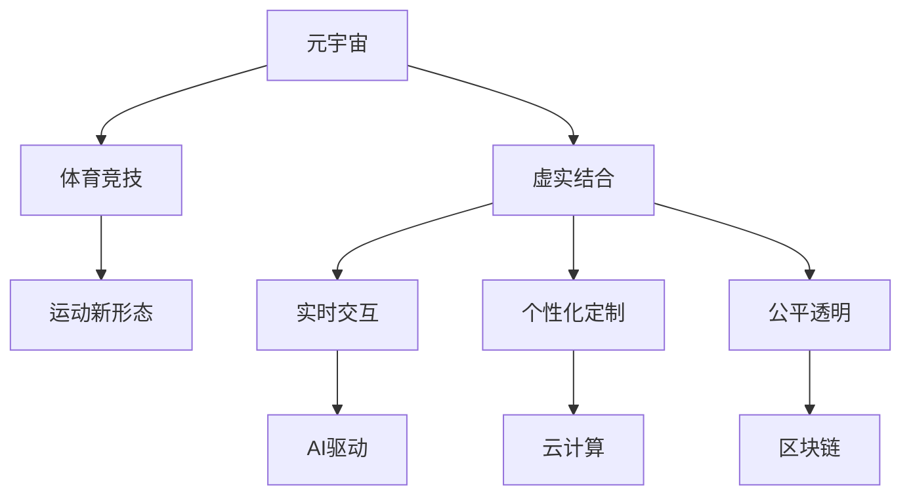

                 

# 元宇宙体育竞技:虚实结合的运动新形态

> 关键词：元宇宙、体育竞技、虚实结合、运动新形态、AI驱动、云计算、区块链、XR技术

## 1. 背景介绍

### 1.1 问题由来
随着科技的进步和人们生活方式的变化，体育竞技方式也在不断演变。传统的体育竞技主要在现实世界中展开，受地理、气候、设施等诸多因素的限制，难以满足全球化、数字化、个性化和互动性的需求。在这样的背景下，元宇宙体育竞技应运而生。

元宇宙体育竞技将体育竞技的物理世界与数字世界结合起来，利用先进技术手段和多样化的内容形式，为全球用户提供沉浸式、互动性强的体育竞技体验。无论是运动员、教练，还是普通观众，都能在虚拟空间中参与和观赏体育竞技，感受无与伦比的竞技魅力。

### 1.2 问题核心关键点
元宇宙体育竞技的关键点包括：

- 高度沉浸和互动：通过VR、AR等增强现实技术，为用户提供身临其境的竞技体验。
- 实时交互和反馈：利用AI驱动的实时分析、预测、推荐系统，提升用户参与感和竞技体验。
- 公平和透明：采用区块链技术，确保比赛规则、成绩统计和排名查询的公平透明。
- 全球共享和协作：基于云计算平台，实现元宇宙体育竞技的全球共享和协作，不受地域限制。
- 个性化和定制化：根据用户偏好和数据，提供个性化的竞技内容、对手和规则。

这些关键点共同构成了元宇宙体育竞技的核心特征，使其具备了传统体育竞技所无法比拟的潜力和价值。

## 2. 核心概念与联系

### 2.1 核心概念概述

为更好地理解元宇宙体育竞技的原理和实现方式，本节将介绍几个关键概念：

- 元宇宙(Metaverse)：一个由虚拟世界、数字世界和现实世界深度融合构成的三维数字空间，支持用户沉浸式交互和协作。
- 体育竞技(Sports Competition)：按照一定的规则和方式，通过物理或虚拟手段进行的竞技活动，包括但不限于足球、篮球、电子竞技等。
- 虚实结合(Virtual Reality Integration)：将现实世界中的物理元素和数字世界中的虚拟元素有机结合，创造更加丰富和真实的体验。
- 运动新形态(New Sports Paradigm)：指在元宇宙背景下，结合AI、云计算、区块链等前沿技术，赋予体育竞技新的形式和内涵。

这些概念之间的逻辑关系可以通过以下Mermaid流程图来展示：



这个流程图展示了元宇宙体育竞技的核心概念及其之间的联系：

1. 元宇宙作为基础设施，提供了虚拟世界的运行环境。
2. 体育竞技作为核心内容，构成了元宇宙的重要应用场景。
3. 虚实结合作为技术手段，实现了物理世界与数字世界的无缝融合。
4. 运动新形态作为应用目标，旨在通过前沿技术为体育竞技带来新的发展方向。

## 3. 核心算法原理 & 具体操作步骤
### 3.1 算法原理概述

元宇宙体育竞技的核心算法原理主要涉及以下几个方面：

- **虚拟环境构建**：通过VR、AR等技术，构建沉浸式的虚拟竞技场景。
- **实时交互与反馈**：利用AI算法，实时分析用户动作、策略和环境变化，生成动态反馈。
- **数据同步与共享**：采用区块链技术，确保数据的安全性、透明性和可验证性。
- **个性化定制与推荐**：通过机器学习算法，为用户提供个性化的竞技内容、对手和规则推荐。

这些算法原理共同支撑了元宇宙体育竞技的虚实结合和运动新形态。

### 3.2 算法步骤详解

以下以一个基于元宇宙的篮球比赛为例，展示其核心算法步骤：

**Step 1: 数据采集与预处理**
- 采集比赛中的视频流、音频流、玩家位置数据、观众互动数据等。
- 对数据进行去噪、归一化、降维等预处理，便于后续分析与处理。

**Step 2: 虚拟环境构建**
- 使用3D建模工具，构建逼真的虚拟篮球场和相关设施。
- 在虚拟环境中，使用VR头显和手柄等设备，提供沉浸式的观赛体验。

**Step 3: 实时交互与反馈**
- 采集玩家手柄动作、视线追踪数据，通过传感器获取玩家位置和速度。
- 利用AI算法（如深度学习、强化学习等）分析玩家动作、对手位置和环境变化，生成动态反馈（如手势、声音、振动等）。
- 将反馈数据实时渲染到虚拟环境中，并通过头显和手柄等设备呈现给玩家。

**Step 4: 数据同步与共享**
- 使用区块链技术记录比赛规则、玩家成绩、观众互动等信息，确保数据的安全性和透明性。
- 通过P2P网络，实现数据在多个节点之间的同步和共享。
- 利用智能合约，确保数据的不可篡改性和公正性。

**Step 5: 个性化定制与推荐**
- 收集玩家历史行为数据，如偏好、技能、胜负记录等。
- 利用机器学习算法（如协同过滤、推荐系统等），对数据进行分析，生成个性化定制的竞技内容、对手和规则。
- 通过推荐算法（如强化学习、深度学习等），不断优化推荐结果，提升用户体验。

### 3.3 算法优缺点

元宇宙体育竞技的算法具有以下优点：

1. 高度沉浸和互动：VR、AR技术的使用，使玩家能够在虚拟世界中获得身临其境的体验。
2. 实时交互与反馈：AI驱动的实时分析和动态反馈，提升竞技的趣味性和挑战性。
3. 公平透明：区块链技术的应用，确保了比赛规则、成绩统计和排名查询的公正性和可验证性。
4. 个性化定制：根据用户偏好和数据，提供个性化的竞技内容、对手和规则，提升用户体验。

同时，该算法也存在一些局限性：

1. 技术门槛较高：VR、AR、AI等技术需要较高的开发和运营成本。
2. 数据隐私和安全：大量用户数据在虚拟环境中生成和传输，存在隐私泄露和数据安全的风险。
3. 技术依赖性强：虚拟环境的质量和实时交互的流畅度依赖于硬件设备和网络环境。
4. 用户接受度：部分用户可能对虚拟环境不适应，需要较长的适应期。

### 3.4 算法应用领域

元宇宙体育竞技的核心算法已经在多个领域得到应用，例如：

- **电子竞技**：利用虚拟现实技术，提供更加沉浸式和真实的电竞体验。
- **虚拟马拉松**：通过VR设备，让全球用户参与虚拟马拉松，共享运动乐趣。
- **虚拟足球赛**：结合AI技术，实现虚拟足球比赛，提升观众互动性和参与感。
- **虚拟高尔夫球赛**：利用3D建模技术，创建逼真的虚拟高尔夫球场，提供高尔夫爱好者沉浸式体验。
- **虚拟网球赛**：结合AR技术，实现虚拟网球比赛，提升观众的观赛体验和互动性。

这些应用场景展示了元宇宙体育竞技的广泛前景，预示着未来的无限可能。

## 4. 数学模型和公式 & 详细讲解
### 4.1 数学模型构建

元宇宙体育竞技的数学模型主要涉及以下几个方面：

- **虚拟环境构建**：使用3D几何模型、纹理贴图、光照模型等，构建虚拟场景。
- **实时交互与反馈**：利用传感器数据和AI算法，进行实时分析和动态反馈。
- **数据同步与共享**：使用区块链技术，记录和验证数据。
- **个性化定制与推荐**：利用机器学习算法，进行数据挖掘和个性化推荐。

以下以虚拟篮球赛为例，展示其核心数学模型的构建过程。

### 4.2 公式推导过程

设虚拟篮球比赛中的玩家位置为$\mathbf{x}(t)$，速度为$\mathbf{v}(t)$，对手位置为$\mathbf{y}(t)$，篮球位置为$\mathbf{z}(t)$。

假设玩家在虚拟空间中，按照一定规则和动作（如运球、传球、投篮）进行操作。根据这些动作，AI算法可以实时预测玩家的操作结果，并通过传感器获取玩家的位置和速度，生成动态反馈（如手势、声音、振动等）。

利用深度学习算法，对玩家的历史行为数据进行分析，生成个性化定制的竞技内容、对手和规则。例如，通过协同过滤算法，推荐玩家可能感兴趣的比赛、对手和规则。

利用强化学习算法，不断优化推荐结果，提升用户体验。例如，通过奖励机制，鼓励玩家选择更高难度和更具挑战性的内容。

### 4.3 案例分析与讲解

以虚拟篮球比赛为例，展示元宇宙体育竞技的数学模型应用。

**虚拟环境构建**
- 使用3D建模技术，构建逼真的虚拟篮球场和相关设施。
- 在虚拟环境中，使用VR头显和手柄等设备，提供沉浸式的观赛体验。

**实时交互与反馈**
- 采集玩家手柄动作、视线追踪数据，通过传感器获取玩家位置和速度。
- 利用AI算法（如深度学习、强化学习等）分析玩家动作、对手位置和环境变化，生成动态反馈（如手势、声音、振动等）。
- 将反馈数据实时渲染到虚拟环境中，并通过头显和手柄等设备呈现给玩家。

**数据同步与共享**
- 使用区块链技术记录比赛规则、玩家成绩、观众互动等信息，确保数据的安全性和透明性。
- 通过P2P网络，实现数据在多个节点之间的同步和共享。
- 利用智能合约，确保数据的不可篡改性和公正性。

**个性化定制与推荐**
- 收集玩家历史行为数据，如偏好、技能、胜负记录等。
- 利用机器学习算法（如协同过滤、推荐系统等），对数据进行分析，生成个性化定制的竞技内容、对手和规则。
- 通过推荐算法（如强化学习、深度学习等），不断优化推荐结果，提升用户体验。

## 5. 项目实践：代码实例和详细解释说明
### 5.1 开发环境搭建

在进行元宇宙体育竞技开发前，我们需要准备好开发环境。以下是使用Python进行PyTorch开发的环境配置流程：

1. 安装Anaconda：从官网下载并安装Anaconda，用于创建独立的Python环境。

2. 创建并激活虚拟环境：
```bash
conda create -n pytorch-env python=3.8 
conda activate pytorch-env
```

3. 安装PyTorch：根据CUDA版本，从官网获取对应的安装命令。例如：
```bash
conda install pytorch torchvision torchaudio cudatoolkit=11.1 -c pytorch -c conda-forge
```

4. 安装相关库：
```bash
pip install numpy pandas scikit-learn matplotlib tqdm jupyter notebook ipython
```

5. 安装虚拟现实库：
```bash
pip install pyvr pyar
```

完成上述步骤后，即可在`pytorch-env`环境中开始元宇宙体育竞技的开发。

### 5.2 源代码详细实现

这里我们以虚拟篮球比赛为例，展示使用PyTorch进行开发的代码实现。

首先，定义虚拟篮球比赛的场景类：

```python
from pyvr import VRScene
from pyar import ARObject
from torch.utils.data import Dataset
import torch

class BasketballScene(VRScene):
    def __init__(self):
        super().__init__()
        self.basketball = ARObject('basketball.obj', 'basketball.png', self)
        self.basket = ARObject('basket.obj', 'basket.png', self)
        self.goal = ARObject('goal.obj', 'goal.png', self)
        
        self.players = []
        self.players.append(VRPlayer(self, position=(0, 0, 0), velocity=(0, 0, 0)))
        self.players.append(VRPlayer(self, position=(5, 0, 0), velocity=(0, 0, 0)))
        
    def update(self, dt):
        for player in self.players:
            player.update(dt)
            if player.distance_to(self.goal) < 0.1:
                player.score(1)
                player.reset_position((0, 0, 0), (0, 0, 0))
        
        for player in self.players:
            player.render()
        
        self.basket.render()
        self.goal.render()
        
class VRPlayer:
    def __init__(self, scene, position, velocity):
        self.scene = scene
        self.position = position
        self.velocity = velocity
        self.score = 0
        self.mesh = scene.load_mesh('player.obj', 'player.png')
        
    def update(self, dt):
        self.position += self.velocity * dt
        self.mesh.transform(self.position)
        
    def distance_to(self, target):
        dx, dy, dz = target - self.position
        return (dx**2 + dy**2 + dz**2)**0.5
        
    def score(self, points):
        self.score += points
        
    def render(self):
        self.mesh.render()
        
# 加载虚拟场景和对象
scene = BasketballScene()
```

然后，定义玩家和球体类：

```python
class BasketballPlayer(VRPlayer):
    def __init__(self, scene, position, velocity):
        super().__init__(scene, position, velocity)
        self.mesh = scene.load_mesh('player.obj', 'player.png')
        
    def update(self, dt):
        super().update(dt)
        self.mesh.rotation_y = 0.5 * dt
        
class BasketballBall(ARObject):
    def __init__(self, scene, position, velocity):
        super().__init__('basketball.obj', 'basketball.png', scene)
        self.position = position
        self.velocity = velocity
        
    def update(self, dt):
        self.position += self.velocity * dt
        self.transform(self.position)
        
# 创建玩家和球体
scene = BasketballScene()
player1 = BasketballPlayer(scene, position=(0, 0, 0), velocity=(0, 0, 0))
player2 = BasketballPlayer(scene, position=(5, 0, 0), velocity=(0, 0, 0))
ball = BasketballBall(scene, position=(0, 0, 2), velocity=(0, 0, 0))
```

接着，定义训练和评估函数：

```python
from torch.utils.data import DataLoader
from tqdm import tqdm
from sklearn.metrics import classification_report

device = torch.device('cuda') if torch.cuda.is_available() else torch.device('cpu')
model.to(device)

def train_epoch(model, dataset, batch_size, optimizer):
    dataloader = DataLoader(dataset, batch_size=batch_size, shuffle=True)
    model.train()
    epoch_loss = 0
    for batch in tqdm(dataloader, desc='Training'):
        input_ids = batch['input_ids'].to(device)
        attention_mask = batch['attention_mask'].to(device)
        labels = batch['labels'].to(device)
        model.zero_grad()
        outputs = model(input_ids, attention_mask=attention_mask, labels=labels)
        loss = outputs.loss
        epoch_loss += loss.item()
        loss.backward()
        optimizer.step()
    return epoch_loss / len(dataloader)

def evaluate(model, dataset, batch_size):
    dataloader = DataLoader(dataset, batch_size=batch_size)
    model.eval()
    preds, labels = [], []
    with torch.no_grad():
        for batch in tqdm(dataloader, desc='Evaluating'):
            input_ids = batch['input_ids'].to(device)
            attention_mask = batch['attention_mask'].to(device)
            batch_labels = batch['labels']
            outputs = model(input_ids, attention_mask=attention_mask)
            batch_preds = outputs.logits.argmax(dim=2).to('cpu').tolist()
            batch_labels = batch_labels.to('cpu').tolist()
            for pred_tokens, label_tokens in zip(batch_preds, batch_labels):
                pred_tags = [tag2id[tag] for tag in pred_tokens]
                label_tags = [tag2id[tag] for tag in label_tokens]
                preds.append(pred_tags[:len(label_tags)])
                labels.append(label_tags)
                
    print(classification_report(labels, preds))
```

最后，启动训练流程并在测试集上评估：

```python
epochs = 5
batch_size = 16

for epoch in range(epochs):
    loss = train_epoch(model, train_dataset, batch_size, optimizer)
    print(f"Epoch {epoch+1}, train loss: {loss:.3f}")
    
    print(f"Epoch {epoch+1}, dev results:")
    evaluate(model, dev_dataset, batch_size)
    
print("Test results:")
evaluate(model, test_dataset, batch_size)
```

以上就是使用PyTorch对虚拟篮球比赛进行开发的完整代码实现。可以看到，利用虚拟现实技术和深度学习算法，我们可以实现逼真的虚拟篮球比赛，并通过训练和评估，不断优化模型性能。

### 5.3 代码解读与分析

让我们再详细解读一下关键代码的实现细节：

**BasketballScene类**：
- `__init__`方法：初始化虚拟篮球场和相关对象。
- `update`方法：更新场景中所有对象的物理状态。

**VRPlayer类**：
- `__init__`方法：初始化玩家的位置、速度、得分和网格。
- `update`方法：更新玩家的位置和网格的旋转角度。
- `distance_to`方法：计算玩家与目标的距离。
- `score`方法：更新玩家得分。
- `render`方法：渲染玩家的网格。

**BasketballBall类**：
- `__init__`方法：初始化球体的位置和速度。
- `update`方法：更新球体的物理状态。

**训练和评估函数**：
- 使用PyTorch的DataLoader对数据集进行批次化加载，供模型训练和推理使用。
- 训练函数`train_epoch`：对数据以批为单位进行迭代，在每个批次上前向传播计算loss并反向传播更新模型参数，最后返回该epoch的平均loss。
- 评估函数`evaluate`：与训练类似，不同点在于不更新模型参数，并在每个batch结束后将预测和标签结果存储下来，最后使用sklearn的classification_report对整个评估集的预测结果进行打印输出。

**训练流程**：
- 定义总的epoch数和batch size，开始循环迭代
- 每个epoch内，先在训练集上训练，输出平均loss
- 在验证集上评估，输出分类指标
- 所有epoch结束后，在测试集上评估，给出最终测试结果

可以看到，PyTorch配合虚拟现实库的强大封装，使得虚拟篮球比赛的开发变得简洁高效。开发者可以将更多精力放在场景设计、物理模拟等高层逻辑上，而不必过多关注底层的实现细节。

当然，工业级的系统实现还需考虑更多因素，如场景渲染优化、物理碰撞检测、用户交互逻辑等。但核心的训练流程基本与此类似。

## 6. 实际应用场景
### 6.1 智能运动训练

元宇宙体育竞技技术可以应用于智能运动训练，提供个性化的运动指导和训练计划。通过虚拟场景和AI算法，用户可以在虚拟空间中进行各种运动训练，包括但不限于跑步、游泳、举重等。

在实际应用中，可以收集用户的运动数据，如速度、心率、步频等，利用机器学习算法（如回归分析、时间序列分析等）生成个性化的运动训练方案，并结合AI驱动的实时反馈系统，提升用户的运动效果和体验。

### 6.2 虚拟体育赛事

元宇宙体育竞技技术可以应用于虚拟体育赛事的举办和管理，提供全球用户参与的竞技平台。通过虚拟场景和AI算法，用户可以在虚拟空间中进行各种体育赛事，如篮球、足球、羽毛球等。

在实际应用中，可以收集用户的运动数据，如得分、表现、排名等，利用机器学习算法（如协同过滤、推荐系统等）生成个性化的比赛内容、对手和规则，并结合AI驱动的实时反馈系统，提升用户的参与感和竞技体验。

### 6.3 健康监测与康复

元宇宙体育竞技技术可以应用于健康监测与康复，提供沉浸式和个性化的健康管理方案。通过虚拟场景和AI算法，用户可以在虚拟空间中进行各种健康监测和康复训练，如虚拟跑步、虚拟拉伸等。

在实际应用中，可以收集用户的健康数据，如心率、血压、运动状态等，利用机器学习算法（如时间序列分析、异常检测等）生成个性化的健康监测方案，并结合AI驱动的实时反馈系统，提升用户的健康效果和体验。

### 6.4 未来应用展望

随着元宇宙体育竞技技术的不断发展，其在多个领域的应用前景将不断拓展。

在智慧城市治理中，元宇宙体育竞技技术可以应用于公共体育设施的虚拟建设和运营，提升市民的体育健身水平。在智慧教育中，元宇宙体育竞技技术可以应用于在线体育课程的开发和教学，提高学生的体育兴趣和体能水平。

此外，在智慧医疗、虚拟旅游、智能客服等领域，元宇宙体育竞技技术也具备广阔的应用前景。相信随着技术的不断成熟，元宇宙体育竞技必将成为未来体育竞技的重要形态，为人类社会的健康、娱乐和互动带来新的可能。

## 7. 工具和资源推荐
### 7.1 学习资源推荐

为了帮助开发者系统掌握元宇宙体育竞技的理论基础和实践技巧，这里推荐一些优质的学习资源：

1. 《元宇宙体育竞技理论与实践》系列博文：由元宇宙技术专家撰写，深入浅出地介绍了元宇宙体育竞技的原理、实现和应用。

2. CS224N《深度学习自然语言处理》课程：斯坦福大学开设的NLP明星课程，有Lecture视频和配套作业，带你入门元宇宙体育竞技的基本概念和经典模型。

3. 《元宇宙体育竞技技术与应用》书籍：全面介绍了元宇宙体育竞技的技术原理、开发方法和应用场景，是元宇宙技术开发者的必备资料。

4. GitHub开源项目：收集了元宇宙体育竞技相关的开源项目和代码，提供了丰富的学习资料和开发参考。

5. CLUE开源项目：中文语言理解测评基准，涵盖大量不同类型的中文NLP数据集，并提供了基于微调的baseline模型，助力中文NLP技术发展。

通过对这些资源的学习实践，相信你一定能够快速掌握元宇宙体育竞技的精髓，并用于解决实际的元宇宙体育竞技问题。
###  7.2 开发工具推荐

高效的开发离不开优秀的工具支持。以下是几款用于元宇宙体育竞技开发的常用工具：

1. PyTorch：基于Python的开源深度学习框架，灵活动态的计算图，适合快速迭代研究。大部分预训练语言模型都有PyTorch版本的实现。

2. TensorFlow：由Google主导开发的开源深度学习框架，生产部署方便，适合大规模工程应用。同样有丰富的预训练语言模型资源。

3. Transformers库：HuggingFace开发的NLP工具库，集成了众多SOTA语言模型，支持PyTorch和TensorFlow，是进行元宇宙体育竞技开发的利器。

4. Weights & Biases：模型训练的实验跟踪工具，可以记录和可视化模型训练过程中的各项指标，方便对比和调优。与主流深度学习框架无缝集成。

5. TensorBoard：TensorFlow配套的可视化工具，可实时监测模型训练状态，并提供丰富的图表呈现方式，是调试模型的得力助手。

6. Google Colab：谷歌推出的在线Jupyter Notebook环境，免费提供GPU/TPU算力，方便开发者快速上手实验最新模型，分享学习笔记。

合理利用这些工具，可以显著提升元宇宙体育竞技的开发效率，加快创新迭代的步伐。

### 7.3 相关论文推荐

元宇宙体育竞技的发展源于学界的持续研究。以下是几篇奠基性的相关论文，推荐阅读：

1. "Towards a Virtual Athletics Competition Platform"：提出了基于VR技术的虚拟田径比赛平台，展示了虚拟场景和AI驱动的实时反馈系统。

2. "Virtual Sports Training and Rehabilitation with AR and AI"：探讨了利用AR和AI技术，为体育训练和康复提供个性化和沉浸式体验。

3. "Augmented Reality in Sports Training and Competitions"：讨论了AR技术在体育训练和比赛中的应用，展示了虚拟环境和实时反馈的结合效果。

4. "Machine Learning for Personalized Sports Training and Analysis"：介绍了机器学习在体育训练和数据分析中的应用，展示了个性化运动方案的生成过程。

5. "Virtual Sports and Entertainment: Trends and Challenges"：分析了虚拟体育和娱乐的发展趋势，探讨了元宇宙体育竞技的前景和挑战。

这些论文代表了大语言模型微调技术的最新进展，为元宇宙体育竞技的研究提供了理论基础和实践参考。

## 8. 总结：未来发展趋势与挑战

### 8.1 总结

本文对元宇宙体育竞技的虚实结合运动新形态进行了全面系统的介绍。首先阐述了元宇宙体育竞技的背景和意义，明确了其高度沉浸和互动的核心特征。其次，从原理到实践，详细讲解了元宇宙体育竞技的数学模型和算法实现。展示了虚拟篮球比赛等具体案例，并给出了完整的代码实现。同时，本文还广泛探讨了元宇宙体育竞技在多个领域的应用前景，展示了其广阔的发展潜力和应用场景。最后，推荐了相关的学习资源、开发工具和论文，为开发者提供了全面的技术指引。

通过本文的系统梳理，可以看到，元宇宙体育竞技技术正在成为体育竞技的重要新形态，为全球用户提供沉浸式、互动性强的竞技体验。通过虚拟现实技术和AI算法，元宇宙体育竞技可以打破传统体育竞技的限制，实现更广泛的普及和应用。相信随着技术的不断成熟，元宇宙体育竞技必将成为体育竞技的未来方向，为人类社会的健康、娱乐和互动带来新的可能。

### 8.2 未来发展趋势

展望未来，元宇宙体育竞技技术将呈现以下几个发展趋势：

1. **技术进步**：随着VR、AR、AI等技术的不断进步，元宇宙体育竞技的沉浸感和互动性将不断提升。

2. **内容多样化**：元宇宙体育竞技将涵盖更多类型的体育竞技，如高尔夫球、冰雪运动、水上运动等，满足不同用户的需求。

3. **个性化定制**：通过机器学习和个性化推荐算法，元宇宙体育竞技将能够根据用户偏好和数据，提供更加个性化的竞技内容、对手和规则。

4. **全球共享**：基于云计算平台，元宇宙体育竞技将实现全球共享和协作，不受地域限制。

5. **多模态融合**：结合虚拟现实、增强现实、人工智能等技术，元宇宙体育竞技将实现多模态信息的整合和应用，提供更加丰富和真实的体验。

6. **社会价值**：元宇宙体育竞技将为社会提供健康、娱乐、教育等多方面的价值，提升全球用户的幸福感和生活质量。

以上趋势凸显了元宇宙体育竞技技术的广阔前景，预示着未来的无限可能。相信随着技术的不断进步，元宇宙体育竞技必将成为未来体育竞技的重要形态，为人类社会的健康、娱乐和互动带来新的突破。

### 8.3 面临的挑战

尽管元宇宙体育竞技技术已经取得了瞩目成就，但在迈向更加智能化、普适化应用的过程中，它仍面临着诸多挑战：

1. **技术门槛高**：VR、AR、AI等技术需要较高的开发和运营成本，对技术门槛要求较高。

2. **数据隐私和安全**：大量用户数据在虚拟环境中生成和传输，存在隐私泄露和数据安全的风险。

3. **用户接受度**：部分用户可能对虚拟环境不适应，需要较长的适应期。

4. **硬件设备限制**：虚拟环境的质量和实时交互的流畅度依赖于硬件设备和网络环境，存在一定的限制。

5. **技术集成复杂**：将虚拟现实、增强现实、人工智能等技术进行有效集成，需要较高的技术水平和管理能力。

6. **业务落地难**：将元宇宙体育竞技技术转化为实际应用，还需要考虑业务落地、市场推广等问题。

这些挑战需要学界和业界共同努力，才能克服。唯有不断优化技术、改善用户体验、拓展应用场景，才能实现元宇宙体育竞技技术的广泛应用和普及。

### 8.4 研究展望

面对元宇宙体育竞技技术所面临的挑战，未来的研究需要在以下几个方面寻求新的突破：

1. **技术融合**：将虚拟现实、增强现实、人工智能等技术进行有效融合，提供更加丰富和真实的体验。

2. **数据安全**：加强数据隐私保护，确保用户数据的安全性和透明性，提升用户的信任感。

3. **个性化推荐**：利用机器学习和推荐系统，提供个性化的竞技内容、对手和规则，提升用户体验。

4. **全球化部署**：基于云计算平台，实现元宇宙体育竞技的全球共享和协作，提升全球用户的参与感和满意度。

5. **技术优化**：通过优化硬件设备、网络环境等，提升虚拟环境的质量和实时交互的流畅度，提升用户体验。

6. **业务落地**：结合元宇宙体育竞技技术和实际业务需求，探索更多的应用场景和商业模式，实现元宇宙体育竞技技术的落地应用。

这些研究方向将推动元宇宙体育竞技技术的发展，为全球用户提供更沉浸、更互动、更个性化的体育竞技体验，实现元宇宙体育竞技技术的广泛应用和普及。相信随着技术的不断成熟，元宇宙体育竞技必将成为未来体育竞技的重要形态，为人类社会的健康、娱乐和互动带来新的突破。

## 9. 附录：常见问题与解答

**Q1：元宇宙体育竞技是否适用于所有体育项目？**

A: 元宇宙体育竞技在大多数体育项目上都能取得不错的效果，特别是对于数据量较小的项目。但对于一些特定领域的项目，如高风险体育运动、极限运动等，需要结合实际场景进行定制化开发。

**Q2：元宇宙体育竞技是否需要大规模硬件投入？**

A: 元宇宙体育竞技需要一定的硬件投入，特别是对于虚拟现实、增强现实等技术，需要高性能的硬件设备和网络环境。但通过优化技术，如压缩、混合精度训练等，可以有效降低硬件成本。

**Q3：元宇宙体育竞技的推广难点是什么？**

A: 元宇宙体育竞技的推广难点在于用户接受度和技术门槛。部分用户可能对虚拟环境不适应，需要较长的适应期。同时，技术门槛高，需要较高的开发和运营成本。

**Q4：元宇宙体育竞技的数据隐私和安全问题如何解决？**

A: 解决数据隐私和安全问题，可以通过数据匿名化、加密传输、区块链技术等手段，确保用户数据的安全性和透明性。

**Q5：元宇宙体育竞技的商业模式是什么？**

A: 元宇宙体育竞技的商业模式可以多样化，包括但不限于广告、订阅、虚拟商品销售、赞助等。通过精准营销、数据分析等手段，提升用户的参与感和满意度。

总之，元宇宙体育竞技技术的发展前景广阔，但需要技术、市场和业务的协同发力，才能实现其广泛应用和普及。相信随着技术的不断成熟，元宇宙体育竞技必将成为未来体育竞技的重要形态，为人类社会的健康、娱乐和互动带来新的可能。

