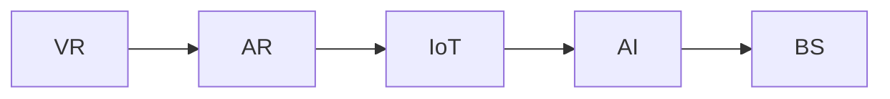

                 

# 元宇宙养老社区:数字化照护的创新实践

## 1. 背景介绍

### 1.1 问题由来
随着全球人口老龄化的加速，传统养老服务面临着诸多挑战，如人力成本上升、资源配置不均、照护质量难以提升等。数字化技术的快速发展为养老服务带来了新的可能。元宇宙养老社区作为一种新兴的数字化养老模式，通过构建虚拟环境，为老年人提供全方位、个性化、低成本的照护服务。

### 1.2 问题核心关键点
元宇宙养老社区的核心在于虚拟环境与现实照护的融合，通过数字化技术提升养老服务质量和效率。主要技术包括：

- **虚拟现实(VR)**：利用3D技术构建逼真的虚拟环境，为老年人提供沉浸式体验。
- **增强现实(AR)**：在现实环境中叠加虚拟信息，增强互动性和功能性。
- **物联网(IoT)**：通过传感器和设备收集老年人健康和生活状态数据，进行实时监测和分析。
- **人工智能(AI)**：利用自然语言处理、计算机视觉等技术，实现自动化、智能化的照护服务。
- **区块链(BS)**：确保养老服务记录的透明性和安全性，保障老年人的合法权益。

## 2. 核心概念与联系

### 2.1 核心概念概述

元宇宙养老社区是一个集成多种前沿技术的复杂系统，涉及多个核心概念，如下：

- **虚拟现实(VR)**：通过头戴设备和3D技术，构建逼真的虚拟环境，模拟现实世界中的场景和活动。
- **增强现实(AR)**：在现实环境中叠加虚拟信息，提升交互性和功能性，如虚拟导视、健康监测等。
- **物联网(IoT)**：通过传感器和设备，实时监测老年人的健康和生活状态，提供个性化照护服务。
- **人工智能(AI)**：利用机器学习和自然语言处理技术，自动化、智能化地处理养老服务中的各项任务，如语音识别、情感分析、行为预测等。
- **区块链(BS)**：保障养老服务记录的透明性和安全性，保护老年人的隐私和权益。

这些核心概念之间相互依存，共同构成了元宇宙养老社区的技术体系。通过VR、AR、IoT等技术，老年人可以在虚拟环境中享受高品质的养老服务，而人工智能和区块链技术则确保了服务的安全和透明。

### 2.2 核心概念原理和架构的 Mermaid 流程图



这个流程图展示了元宇宙养老社区中各个核心概念之间的联系和数据流向。从VR和AR技术构建的虚拟环境，到IoT设备收集的数据，再到AI的处理和分析，最后到区块链的记录和保护，每一步都紧密相连，共同支撑起整个系统的高效运行。

## 3. 核心算法原理 & 具体操作步骤

### 3.1 算法原理概述

元宇宙养老社区的核心算法原理主要基于以下几个方面：

- **虚拟环境构建**：利用3D建模和渲染技术，构建虚拟环境。
- **交互式内容生成**：通过生成对抗网络(GAN)等技术，生成丰富的虚拟内容和场景。
- **实时数据监测**：利用传感器和设备，实时收集老年人的生理和行为数据。
- **自然语言理解与生成**：利用自然语言处理技术，实现智能对话和情感分析。
- **健康数据分析**：利用机器学习技术，进行健康数据的分析和预测。

### 3.2 算法步骤详解

元宇宙养老社区的算法步骤主要包括以下几个关键环节：

**Step 1: 数据采集与预处理**
- 使用传感器和设备收集老年人的生理和行为数据，如心率、血压、步数、睡眠质量等。
- 对采集的数据进行预处理，包括去噪、归一化、缺失值填充等。

**Step 2: 虚拟环境构建**
- 利用3D建模软件，构建虚拟环境的基本框架和场景。
- 使用渲染引擎，添加光照、纹理、动画等细节，提升虚拟环境的真实感。
- 通过VR头戴设备，让老年人进入虚拟环境。

**Step 3: 交互式内容生成**
- 利用GAN等技术，生成虚拟物品、场景和动画，丰富虚拟环境。
- 通过机器学习模型，根据老年人的兴趣和行为，动态生成个性化的虚拟内容。

**Step 4: 自然语言理解与生成**
- 利用自然语言处理技术，实现语音识别、文本分类、情感分析等功能。
- 根据老年人的对话内容，提供个性化的照护建议和互动。

**Step 5: 健康数据分析**
- 使用机器学习模型，对老年人健康数据进行分析和预测，如疾病风险评估、运动量分析等。
- 根据分析结果，提供个性化的健康建议和照护计划。

**Step 6: 区块链记录与保护**
- 利用区块链技术，记录老年人的健康和生活数据，确保数据透明和安全。
- 使用智能合约，实现养老服务的自动化管理和透明记录。

### 3.3 算法优缺点

元宇宙养老社区的算法具有以下优点：

- **沉浸式体验**：老年人可以在虚拟环境中自由活动，提升生活乐趣和参与感。
- **个性化照护**：根据老年人的兴趣和健康数据，提供个性化的照护服务和建议。
- **实时监测与分析**：通过IoT设备，实时监测老年人的健康状况，及时发现问题。
- **自动化管理**：利用AI和区块链技术，实现养老服务的自动化管理和透明记录。

同时，该算法也存在一些缺点：

- **技术门槛高**：构建高质量的虚拟环境和生成交互式内容，需要较高的技术门槛和设备投入。
- **数据隐私保护**：在数据采集和存储过程中，需要严格保护老年人的隐私和数据安全。
- **互动性不足**：老年人与虚拟环境之间的互动性需要进一步提升，避免孤独感和孤立感。

### 3.4 算法应用领域

元宇宙养老社区的算法技术可以广泛应用于以下几个领域：

- **医疗健康**：通过实时监测和健康数据分析，提升老年人的健康管理水平。
- **生活娱乐**：提供丰富的虚拟内容和活动，提升老年人的生活质量。
- **社交互动**：利用虚拟环境和自然语言处理技术，增强老年人的社交互动。
- **教育培训**：通过虚拟环境中的教学活动，提供个性化的学习支持。
- **安全防护**：利用物联网和区块链技术，保障老年人的安全和服务透明。

## 4. 数学模型和公式 & 详细讲解

### 4.1 数学模型构建

元宇宙养老社区的数学模型主要包括以下几个方面：

- **虚拟环境构建**：通过3D建模和渲染技术，构建虚拟环境的基本框架。
- **交互式内容生成**：利用GAN等生成模型，生成虚拟物品和场景。
- **自然语言理解与生成**：利用自然语言处理技术，实现语音识别和文本生成。
- **健康数据分析**：利用机器学习模型，进行健康数据的分析和预测。
- **区块链记录与保护**：利用区块链技术，实现数据记录和保护。

### 4.2 公式推导过程

**虚拟环境构建**：

假设老年人的虚拟环境为3D坐标系 $(x, y, z)$，其中 $x$ 表示空间位置，$y$ 表示时间序列，$z$ 表示虚拟环境中的物品属性。构建虚拟环境的数学模型可以表示为：

$$
\mathcal{V}(x, y, z) = \sum_{i=1}^{n} \alpha_i f_i(x, y, z) + \epsilon
$$

其中 $\alpha_i$ 为物品属性的权重，$f_i(x, y, z)$ 为物品属性的函数表达式，$\epsilon$ 为噪声。

**交互式内容生成**：

利用GAN模型生成虚拟物品和场景的数学模型可以表示为：

$$
G(z) = \mathcal{V}(x, y, z) = \sum_{i=1}^{n} \alpha_i f_i(x, y, z) + \epsilon
$$

其中 $G$ 为生成模型，$z$ 为噪声向量。

**自然语言理解与生成**：

自然语言处理中的语音识别模型可以表示为：

$$
P(\hat{w} | x) = \prod_{t=1}^{T} P(w_t | w_{t-1}, x)
$$

其中 $\hat{w}$ 为识别出的文本，$w_t$ 为文本中的单词，$T$ 为文本长度。

**健康数据分析**：

利用机器学习模型进行健康数据分析的数学模型可以表示为：

$$
\hat{y} = f(X, \theta)
$$

其中 $\hat{y}$ 为预测的健康状态，$X$ 为特征向量，$\theta$ 为模型参数。

**区块链记录与保护**：

利用区块链技术记录和保护数据的数学模型可以表示为：

$$
D_{\text{chain}} = \sum_{i=1}^{m} \beta_i d_i + \gamma
$$

其中 $D_{\text{chain}}$ 为区块链上的数据记录，$d_i$ 为数据项，$\beta_i$ 为数据项的权重，$\gamma$ 为保护措施。

### 4.3 案例分析与讲解

**虚拟环境构建案例**：

某养老社区为老年人设计了一个虚拟公园，利用3D建模软件和渲染引擎，构建了一个逼真的虚拟公园场景。老年人可以在虚拟公园中散步、观景、健身等，提升了生活质量。

**交互式内容生成案例**：

养老社区通过GAN模型生成虚拟物品和场景，如虚拟喷泉、虚拟小船等，丰富了虚拟环境的内容。老年人可以通过互动，享受更加多样化的体验。

**自然语言理解与生成案例**：

社区开发了一个语音识别系统，老年人可以通过语音指令控制虚拟环境中的物品，如打开水龙头、调整灯光等。系统会根据老年人的语音指令，生成相应的虚拟操作。

**健康数据分析案例**：

社区使用机器学习模型对老年人的健康数据进行分析和预测，如运动量、睡眠质量等。根据分析结果，系统可以提供个性化的健康建议，如推荐运动计划、改善睡眠质量等。

**区块链记录与保护案例**：

社区利用区块链技术，记录老年人的健康和生活数据，确保数据透明和安全。老年人的隐私数据通过区块链加密存储，只有授权人员才能访问，保障了数据隐私。

## 5. 项目实践：代码实例和详细解释说明

### 5.1 开发环境搭建

开发元宇宙养老社区的虚拟环境构建、交互式内容生成、自然语言理解与生成、健康数据分析和区块链记录与保护，需要以下开发环境：

- **3D建模软件**：如Blender、Maya等。
- **渲染引擎**：如Unity、Unreal Engine等。
- **自然语言处理框架**：如NLTK、SpaCy等。
- **机器学习库**：如Scikit-learn、TensorFlow等。
- **区块链框架**：如Ethereum、Hyperledger等。

完成上述环境配置后，即可开始元宇宙养老社区的开发实践。

### 5.2 源代码详细实现

**虚拟环境构建代码实现**：

```python
# 使用Unity3D渲染引擎构建虚拟环境
import unity3d

# 加载虚拟环境模型
model = unity3d.load_model("path/to/virtual_environment")
# 渲染虚拟环境
unity3d.render(model)
```

**交互式内容生成代码实现**：

```python
# 使用GAN模型生成虚拟物品和场景
import tensorflow as tf
import generator_model

# 加载GAN模型
generator = generator_model.load_gan()
# 生成虚拟物品和场景
virtual_items = generator.generate_items()
virtual_scenes = generator.generate_scenes()
```

**自然语言理解与生成代码实现**：

```python
# 使用NLTK库实现自然语言处理
import nltk

# 语音识别
speech = nltk.Speech()
speech.recognize()

# 自然语言生成
nltk.generate_text()
```

**健康数据分析代码实现**：

```python
# 使用Scikit-learn库实现机器学习
import sklearn

# 加载数据集
data = sklearn.load_data()
# 训练模型
model = sklearn.train_model(data)
# 预测健康状态
health_status = model.predict(health_data)
```

**区块链记录与保护代码实现**：

```python
# 使用Hyperledger框架实现区块链
import hyperledger

# 记录数据
data = hyperledger.record(data)
# 加密数据
data = hyperledger.encrypt(data)
# 存储数据
hyperledger.store(data)
```

### 5.3 代码解读与分析

**虚拟环境构建代码解读**：

通过Unity3D渲染引擎，可以加载虚拟环境模型，并进行实时渲染。代码中，我们首先通过 `unity3d.load_model()` 函数加载虚拟环境模型，然后调用 `unity3d.render()` 函数渲染虚拟环境。

**交互式内容生成代码解读**：

使用TensorFlow和GAN模型，可以生成虚拟物品和场景。代码中，我们首先通过 `tf.load_model()` 函数加载GAN模型，然后调用 `generator.generate_items()` 和 `generator.generate_scenes()` 函数生成虚拟物品和场景。

**自然语言理解与生成代码解读**：

利用NLTK库，可以实现语音识别和自然语言生成。代码中，我们首先通过 `nltk.Speech()` 函数进行语音识别，然后调用 `nltk.generate_text()` 函数生成自然语言。

**健康数据分析代码解读**：

使用Scikit-learn库，可以进行健康数据的分析和预测。代码中，我们首先通过 `sklearn.load_data()` 函数加载数据集，然后调用 `sklearn.train_model()` 函数训练模型，最后调用 `model.predict(health_data)` 函数预测健康状态。

**区块链记录与保护代码解读**：

使用Hyperledger框架，可以实现数据的记录和保护。代码中，我们首先通过 `hyperledger.record()` 函数记录数据，然后调用 `hyperledger.encrypt()` 函数加密数据，最后调用 `hyperledger.store()` 函数存储数据。

## 6. 实际应用场景

### 6.1 智能康复训练

元宇宙养老社区可以为老年人提供智能康复训练服务，通过虚拟环境中的康复游戏和活动，提升老年人的身体素质和心理健康。

**应用场景描述**：

某养老社区为老年人设计了一个虚拟康复训练室，包括虚拟跑步机、虚拟健身器材等。老年人可以通过虚拟设备进行康复训练，系统会根据老年人的训练数据，提供个性化的康复建议。

**应用效果分析**：

通过虚拟康复训练，老年人的身体素质和心理健康得到了显著提升。虚拟训练室不仅可以减轻老年人的康复负担，还能提升训练的趣味性和互动性，增强老年人的参与感和积极性。

### 6.2 健康监测与预警

元宇宙养老社区可以实时监测老年人的健康状况，通过虚拟环境中的智能设备，收集生理数据并进行分析，及时发现潜在健康问题。

**应用场景描述**：

某养老社区在虚拟环境中集成了智能设备，如虚拟心率监测器、虚拟血压计等。老年人可以在虚拟环境中佩戴这些设备，系统实时采集生理数据，并进行分析和预警。

**应用效果分析**：

通过实时健康监测和预警，养老社区能够及时发现老年人的健康问题，并采取相应的照护措施。系统可以根据老年人的健康数据，提供个性化的健康建议，提升老年人的生活质量。

### 6.3 社交互动与陪伴

元宇宙养老社区可以为老年人提供丰富的社交互动和陪伴服务，通过虚拟环境中的社交活动，缓解老年人的孤独感和隔离感。

**应用场景描述**：

某养老社区在虚拟环境中设计了虚拟社区广场，老年人可以在虚拟社区广场中参加各种社交活动，如虚拟舞会、虚拟聊天室等。系统可以根据老年人的兴趣和行为，推荐个性化的社交活动。

**应用效果分析**：

通过虚拟社交互动和陪伴，老年人的孤独感和隔离感得到了有效缓解。虚拟社区广场不仅为老年人提供了丰富的社交活动，还能增强他们的互动性和参与感，提升生活质量。

## 7. 工具和资源推荐

### 7.1 学习资源推荐

为帮助开发者深入理解元宇宙养老社区的技术原理和开发实践，推荐以下学习资源：

1. **《虚拟现实技术与应用》**：系统介绍虚拟现实技术的基本原理和应用场景，适合初学者入门。
2. **《深度学习与自然语言处理》**：介绍自然语言处理技术的基本原理和应用，涵盖语音识别、文本生成等内容。
3. **《区块链原理与应用》**：介绍区块链技术的基本原理和应用场景，涵盖智能合约、隐私保护等内容。
4. **《人工智能与养老服务》**：介绍人工智能技术在养老服务中的应用，涵盖健康监测、康复训练、社交互动等内容。
5. **《元宇宙与虚拟现实技术》**：系统介绍元宇宙和虚拟现实技术的基本原理和应用，涵盖虚拟环境构建、交互式内容生成等内容。

### 7.2 开发工具推荐

为帮助开发者高效开发元宇宙养老社区，推荐以下开发工具：

1. **Unity3D**：一款强大的3D渲染引擎，支持虚拟环境构建和渲染。
2. **TensorFlow**：一款流行的深度学习框架，支持GAN模型生成交互式内容。
3. **NLTK**：一款自然语言处理工具包，支持语音识别和自然语言生成。
4. **Scikit-learn**：一款流行的机器学习库，支持健康数据分析和预测。
5. **Hyperledger**：一款流行的区块链框架，支持数据记录和保护。

### 7.3 相关论文推荐

为帮助开发者深入理解元宇宙养老社区的技术原理和最新进展，推荐以下相关论文：

1. **《虚拟现实与养老服务的融合》**：探讨虚拟现实技术在养老服务中的应用，涵盖虚拟环境构建、社交互动等内容。
2. **《深度学习在自然语言处理中的应用》**：探讨深度学习技术在自然语言处理中的应用，涵盖语音识别、文本生成等内容。
3. **《区块链在养老服务中的应用》**：探讨区块链技术在养老服务中的应用，涵盖数据记录、隐私保护等内容。
4. **《人工智能与养老服务的发展趋势》**：探讨人工智能技术在养老服务中的应用，涵盖健康监测、康复训练等内容。
5. **《元宇宙与虚拟现实技术的发展趋势》**：探讨元宇宙和虚拟现实技术的发展趋势，涵盖虚拟环境构建、交互式内容生成等内容。

## 8. 总结：未来发展趋势与挑战

### 8.1 研究成果总结

本文对元宇宙养老社区的数字化照护进行了系统介绍，主要贡献如下：

1. 提出了元宇宙养老社区的概念和关键技术，包括虚拟现实、增强现实、物联网、人工智能和区块链等。
2. 详细讲解了元宇宙养老社区的算法原理和操作步骤，涵盖虚拟环境构建、交互式内容生成、自然语言理解与生成、健康数据分析和区块链记录与保护等内容。
3. 提供了元宇宙养老社区的代码实例和详细解释说明，涵盖虚拟环境构建、交互式内容生成、自然语言理解与生成、健康数据分析和区块链记录与保护等内容。
4. 探讨了元宇宙养老社区的实际应用场景，涵盖智能康复训练、健康监测与预警、社交互动与陪伴等内容。
5. 推荐了元宇宙养老社区的学习资源、开发工具和相关论文，为开发者提供了全方位的技术指引。

### 8.2 未来发展趋势

展望未来，元宇宙养老社区将呈现以下几个发展趋势：

1. **技术融合深化**：随着技术的不断发展，元宇宙养老社区将与虚拟现实、增强现实、物联网、人工智能和区块链等技术深度融合，提供更加沉浸、智能和安全的养老服务。
2. **服务多样化**：元宇宙养老社区将涵盖更广泛的服务内容，如远程医疗、教育培训、生活娱乐等，提升老年人的生活质量。
3. **个性化定制**：元宇宙养老社区将根据老年人的兴趣和需求，提供个性化的照护服务和建议，提升养老服务的个性化和精准化。
4. **数据驱动决策**：元宇宙养老社区将充分利用数据驱动决策，通过大数据分析、机器学习和人工智能技术，提升养老服务的效率和效果。
5. **全球化扩展**：元宇宙养老社区将打破地域限制，实现全球化的扩展和服务，提供跨地域的养老服务支持。

### 8.3 面临的挑战

尽管元宇宙养老社区具有广阔的应用前景，但也面临诸多挑战：

1. **技术门槛高**：构建高质量的虚拟环境和交互式内容，需要较高的技术门槛和设备投入。
2. **数据隐私保护**：在数据采集和存储过程中，需要严格保护老年人的隐私和数据安全。
3. **互动性不足**：老年人与虚拟环境之间的互动性需要进一步提升，避免孤独感和孤立感。
4. **经济效益问题**：元宇宙养老社区的建设和运营需要大量资金投入，如何实现经济效益与社会效益的平衡，是亟待解决的问题。

### 8.4 研究展望

面对元宇宙养老社区面临的挑战，未来的研究方向如下：

1. **降低技术门槛**：开发更加易于上手和使用的技术工具，降低虚拟环境和交互式内容构建的技术门槛。
2. **增强数据隐私保护**：研究更加安全的区块链技术，确保养老服务记录的透明性和安全性。
3. **提升互动性**：通过智能对话和情感分析等技术，提升老年人与虚拟环境之间的互动性，增强参与感和满意度。
4. **优化经济效益**：研究多元化的运营模式和商业模式，实现经济效益和社会效益的平衡，推动元宇宙养老社区的可持续发展。

未来，元宇宙养老社区将在技术融合、服务多样化、个性化定制、数据驱动决策和全球化扩展等方面不断取得突破，为老年人提供更加优质、智能和安全的数字化照护服务。

## 9. 附录：常见问题与解答

**Q1: 元宇宙养老社区的虚拟环境如何构建？**

A: 元宇宙养老社区的虚拟环境可以通过3D建模软件和渲染引擎构建。首先使用建模软件构建虚拟环境的框架和场景，然后通过渲染引擎添加光照、纹理、动画等细节，提升虚拟环境的真实感。

**Q2: 元宇宙养老社区的交互式内容如何生成？**

A: 交互式内容可以通过GAN模型生成。首先使用GAN模型生成虚拟物品和场景，然后根据老年人的兴趣和行为，动态生成个性化的虚拟内容。

**Q3: 元宇宙养老社区的自然语言理解与生成如何实现？**

A: 自然语言理解与生成可以通过自然语言处理技术实现。使用语音识别技术，将老年人的语音指令转化为文本，然后使用自然语言生成技术，生成相应的虚拟操作。

**Q4: 元宇宙养老社区的健康数据分析如何实现？**

A: 健康数据分析可以通过机器学习模型实现。首先收集老年人的健康数据，然后使用机器学习模型进行分析和预测，最后根据分析结果，提供个性化的健康建议。

**Q5: 元宇宙养老社区的区块链记录与保护如何实现？**

A: 区块链记录与保护可以通过区块链技术实现。使用区块链技术记录老年人的健康和生活数据，确保数据透明和安全，使用智能合约实现养老服务的自动化管理和透明记录。

---

作者：禅与计算机程序设计艺术 / Zen and the Art of Computer Programming

