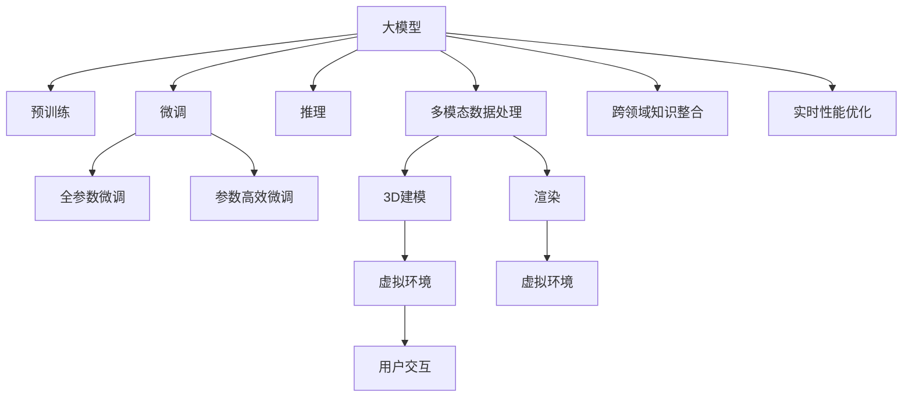

                 

# 元宇宙大模型:虚拟现实世界的AI大脑

> 关键词：元宇宙,大模型,虚拟现实,人工智能,AI大脑

## 1. 背景介绍

### 1.1 问题由来
随着科技的快速发展，虚拟现实(VR)和增强现实(AR)技术不断革新，人类对于沉浸式体验的需求日益增长。元宇宙作为一种新型的互联网应用形式，以其高沉浸感、低延迟、强互动性等特点，正在成为数字化时代的热门话题。而如何构建一个真实、沉浸、智能的元宇宙，成为了各大企业争相探索的新方向。

大模型技术，尤其是预训练语言模型(如GPT系列、BERT等)，凭借其强大的语言理解和生成能力，在虚拟现实和元宇宙领域展现出广阔的应用前景。大模型不仅能够处理自然语言交互，还可以辅助生成虚拟环境、角色控制、语音识别、图像理解等多种功能，成为虚拟世界的"AI大脑"。

### 1.2 问题核心关键点
构建虚拟现实世界的AI大脑，核心在于如何将大模型技术与虚拟环境深度融合。这需要解决以下几个关键问题：

- **虚拟环境建模**：构建符合人类认知逻辑的虚拟世界，需要先进的3D建模和渲染技术，以及丰富的地理、社会、文化等背景知识。
- **多模态数据处理**：虚拟世界中的用户交互方式多样，包括文字、语音、图像、动作等多种形式，大模型需要具备处理多模态数据的能力。
- **跨领域知识整合**：元宇宙涉及领域广泛，涵盖游戏、社交、教育、商务等多个方面，大模型需要灵活运用不同领域的知识，提供多功能服务。
- **实时性能优化**：虚拟现实应用对计算性能要求极高，大模型需要适应低延迟、高并发的实时计算环境。

### 1.3 问题研究意义
研究元宇宙大模型，对于拓展AI技术的应用边界，提升用户体验，推动元宇宙技术的产业化进程，具有重要意义：

1. **增强用户体验**：通过大模型的自然语言处理能力，为用户提供更智能、更自然的交互体验，提升用户黏性。
2. **提升开发效率**：大模型可以自动化处理大量繁琐的工作，如文本生成、语音转写等，加速元宇宙应用的开发部署。
3. **促进技术创新**：元宇宙领域的应用场景丰富多样，大模型技术的引入将催生更多前沿研究方向，推动技术突破。
4. **推动产业升级**：通过AI技术赋能虚拟世界，可以拓展元宇宙在教育、医疗、旅游等多个行业的应用，促进经济社会发展。

## 2. 核心概念与联系

### 2.1 核心概念概述

为更好地理解元宇宙大模型的构建，本节将介绍几个密切相关的核心概念：

- **大模型(Large Model)**：以自回归(如GPT)或自编码(如BERT)模型为代表的大规模预训练语言模型。通过在大规模无标签文本语料上进行预训练，学习通用的语言表示，具备强大的语言理解和生成能力。
- **元宇宙(Metaverse)**：一个由多个虚拟世界构成的虚拟空间，用户可以通过虚拟现实设备进入，进行社交、娱乐、教育、工作等多种活动。
- **虚拟现实(VR)**：利用计算机生成的虚拟场景和交互，通过传感器和控制器，让用户沉浸在虚拟环境中。
- **增强现实(AR)**：将数字信息叠加在现实世界之上，增强现实环境的用户体验。
- **AI大脑**：指能够理解人类语言、行为，处理多模态数据，辅助生成虚拟环境的智能系统。

这些核心概念之间的逻辑关系可以通过以下Mermaid流程图来展示：



这个流程图展示了大模型在元宇宙中的核心作用和关键步骤：

1. 大模型通过预训练获得基础能力。
2. 微调优化模型在特定任务上的性能，包括全参数微调和参数高效微调。
3. 模型进行推理，生成虚拟内容。
4. 处理多模态数据，理解用户行为。
5. 整合跨领域知识，提升智能水平。
6. 优化实时性能，适应高并发环境。

这些概念共同构成了元宇宙大模型的基础框架，使其能够实现对虚拟世界的智能控制和实时交互。

## 3. 核心算法原理 & 具体操作步骤
### 3.1 算法原理概述

元宇宙大模型的构建，本质上是一个预训练-微调-推理的复杂过程。其核心思想是：

1. **预训练**：在大规模无标签数据上，通过自监督学习任务训练模型，使其具备通用的语言表示能力。
2. **微调**：在特定任务上，使用少量标注数据，通过有监督学习优化模型在虚拟世界中的应用性能。
3. **推理**：在虚拟环境中，模型实时处理用户交互，生成虚拟内容，实现智能控制和实时响应。

基于上述思想，元宇宙大模型的构建流程主要包括以下几个关键步骤：

- **收集和处理虚拟环境数据**：收集虚拟世界的地理、社会、文化等背景知识，进行数据清洗和标注。
- **预训练大模型**：在大规模无标签数据上，使用自监督学习任务进行预训练，学习通用的语言表示。
- **微调模型**：在特定任务上，使用少量标注数据，通过有监督学习优化模型性能。
- **推理应用**：在虚拟环境中，实时处理用户交互，生成虚拟内容，实现智能控制和实时响应。

### 3.2 算法步骤详解

**Step 1: 收集和处理虚拟环境数据**

在元宇宙大模型的构建中，数据的收集和处理是至关重要的。以下是大模型数据处理的常见步骤：

1. **数据收集**：收集虚拟世界的地理、社会、文化等背景知识，如图形、音频、文本、视频等。
2. **数据清洗**：去除噪声和无用数据，确保数据质量和多样性。
3. **数据标注**：对数据进行人工标注，如语义角色标注、动作标记等。

**Step 2: 预训练大模型**

预训练大模型是元宇宙大模型的基础。以下是大模型预训练的常见步骤：

1. **选择合适的预训练模型**：根据任务需求，选择适合的大模型，如GPT系列、BERT、T5等。
2. **数据准备**：准备预训练数据集，确保数据规模和质量。
3. **模型训练**：在大规模无标签数据上，使用自监督学习任务进行预训练，如掩码语言模型、下一句预测等。
4. **保存预训练模型**：将训练好的模型保存下来，供后续微调使用。

**Step 3: 微调模型**

微调是元宇宙大模型构建的核心环节，以下是大模型微调的常见步骤：

1. **任务定义**：根据应用场景，定义任务，如文本生成、语音识别、图像理解等。
2. **数据准备**：准备微调数据集，确保数据标注准确。
3. **模型适配**：根据任务需求，适配模型的输出层和损失函数。
4. **模型训练**：在微调数据集上，使用有监督学习优化模型性能。
5. **模型评估**：在验证集上评估模型性能，调整超参数。

**Step 4: 推理应用**

在虚拟环境中，大模型需要实时处理用户交互，生成虚拟内容。以下是大模型推理的常见步骤：

1. **模型加载**：在虚拟环境中部署微调后的模型。
2. **用户交互**：接收用户输入，如文本、语音、图像等。
3. **模型推理**：将用户输入输入模型，生成虚拟内容或控制虚拟环境。
4. **反馈调整**：根据用户反馈，调整模型参数或改进模型推理。

### 3.3 算法优缺点

元宇宙大模型的构建方法具有以下优点：

- **高效性**：使用预训练-微调的方式，能够在较短时间内构建具备通用能力和特定任务能力的模型。
- **灵活性**：大模型可以根据不同应用场景进行微调，灵活性高。
- **多样性**：可以处理多种形式的输入数据，如文本、语音、图像等，适用于多模态交互。

同时，该方法也存在一定的局限性：

- **数据依赖**：微调效果依赖于标注数据的质量和数量，获取高质量标注数据的成本较高。
- **泛化能力**：当目标任务与预训练数据的分布差异较大时，微调的性能提升有限。
- **可解释性**：大模型的决策过程通常缺乏可解释性，难以对其推理逻辑进行分析和调试。

尽管存在这些局限性，但就目前而言，预训练-微调方法仍是大模型在元宇宙领域应用的最主流范式。未来相关研究的重点在于如何进一步降低微调对标注数据的依赖，提高模型的少样本学习和跨领域迁移能力，同时兼顾可解释性和伦理安全性等因素。

### 3.4 算法应用领域

元宇宙大模型在虚拟现实和元宇宙领域的应用十分广泛，包括但不限于以下几个方面：

- **虚拟现实应用**：通过大模型处理用户输入，生成虚拟场景、控制虚拟角色等。
- **社交平台**：构建虚拟社交网络，实现用户间自然语言交流、视频会议等功能。
- **教育培训**：创建虚拟课堂、虚拟实验，提升教学效果。
- **医疗健康**：提供虚拟医疗咨询、手术模拟等，提高医疗服务水平。
- **游戏娱乐**：开发虚拟游戏、虚拟世界，提供沉浸式游戏体验。
- **商务合作**：构建虚拟会议、虚拟展览等，促进远程合作。

除了上述这些经典应用外，元宇宙大模型还被创新性地应用于更多场景中，如虚拟旅游、虚拟展览、虚拟政务等，为虚拟世界的构建提供了新的思路和方法。

## 4. 数学模型和公式 & 详细讲解 & 举例说明

### 4.1 数学模型构建

在大模型微调的过程中，涉及多个数学模型和公式。以下是对核心模型的详细讲解。

假设大模型为 $M_{\theta}$，其中 $\theta$ 为模型参数。

**预训练过程**：
假设预训练数据集为 $D=\{(x_i,y_i)\}_{i=1}^N$，$x_i \in \mathcal{X}, y_i \in \mathcal{Y}$，$y_i$ 为掩码语言模型(Masked Language Model, MLM)的目标。掩码语言模型定义为：
$$
p(x_i|y_i) = \frac{e^{MLM(x_i|y_i)}}{\sum_{j \in \mathcal{V}} e^{MLM(x_j|y_i)}} 
$$
其中 $\mathcal{V}$ 为所有可能的词汇，$MLM(x_j|y_i)$ 表示在输入 $y_i$ 下，词汇 $x_j$ 被预测的概率。

**微调过程**：
假设微调任务为文本生成，即给定输入 $x$，生成目标文本 $y$。微调模型为 $M_{\theta}$，输出层为线性分类器，损失函数为交叉熵损失。微调数据集为 $D'=\{(x_i,y_i)\}_{i=1}^M$。微调模型的预测为 $\hat{y}=M_{\theta}(x)$。

微调目标函数为：
$$
\mathcal{L}(\theta) = -\frac{1}{M}\sum_{i=1}^M \ell(M_{\theta}(x_i),y_i)
$$

其中 $\ell$ 为交叉熵损失，定义为：
$$
\ell(M_{\theta}(x_i),y_i) = -[y_i\log M_{\theta}(x_i)+(1-y_i)\log(1-M_{\theta}(x_i))]
$$

### 4.2 公式推导过程

以下是对预训练和微调模型的详细推导。

**掩码语言模型推导**：
假设预训练数据集中第 $i$ 个输入 $x_i$ 的长度为 $L$，其中 $L$ 个位置中有 $K$ 个位置被掩码。掩码语言模型的目标是在已知的 $L-K$ 个位置上，预测被掩码的 $K$ 个位置上的词汇。设掩码位置为 $P$，则掩码语言模型的概率定义如下：
$$
p(x_i|y_i) = \frac{e^{\sum_{p \in P} \log p(x_p|y_i)}}{\prod_{p \in P} \sum_{j \in \mathcal{V}} e^{MLM(x_j|y_i)}}
$$

**微调模型推导**：
假设微调数据集中第 $i$ 个输入 $x_i$ 的长度为 $L$，微调模型的输出为 $\hat{y}=M_{\theta}(x)$。微调模型的损失函数为交叉熵损失，定义为：
$$
\ell(M_{\theta}(x_i),y_i) = -[y_i\log M_{\theta}(x_i)+(1-y_i)\log(1-M_{\theta}(x_i))]
$$

微调目标函数为：
$$
\mathcal{L}(\theta) = -\frac{1}{M}\sum_{i=1}^M \ell(M_{\theta}(x_i),y_i)
$$

将 $\ell$ 代入 $\mathcal{L}$ 中，得：
$$
\mathcal{L}(\theta) = -\frac{1}{M}\sum_{i=1}^M [y_i\log M_{\theta}(x_i)+(1-y_i)\log(1-M_{\theta}(x_i))]
$$

### 4.3 案例分析与讲解

以文本生成任务为例，分析大模型微调的数学模型和推导过程。

假设微调数据集中第 $i$ 个输入 $x_i$ 的长度为 $L$，微调模型的输出为 $\hat{y}=M_{\theta}(x)$。微调模型的损失函数为交叉熵损失，定义为：
$$
\ell(M_{\theta}(x_i),y_i) = -[y_i\log M_{\theta}(x_i)+(1-y_i)\log(1-M_{\theta}(x_i))]
$$

微调目标函数为：
$$
\mathcal{L}(\theta) = -\frac{1}{M}\sum_{i=1}^M [y_i\log M_{\theta}(x_i)+(1-y_i)\log(1-M_{\theta}(x_i))]
$$

**损失函数推导**：
假设微调数据集中第 $i$ 个输入 $x_i$ 的长度为 $L$，微调模型的输出为 $\hat{y}=M_{\theta}(x)$。微调模型的损失函数为交叉熵损失，定义为：
$$
\ell(M_{\theta}(x_i),y_i) = -[y_i\log M_{\theta}(x_i)+(1-y_i)\log(1-M_{\theta}(x_i))]
$$

微调目标函数为：
$$
\mathcal{L}(\theta) = -\frac{1}{M}\sum_{i=1}^M [y_i\log M_{\theta}(x_i)+(1-y_i)\log(1-M_{\theta}(x_i))]
$$

将 $\ell$ 代入 $\mathcal{L}$ 中，得：
$$
\mathcal{L}(\theta) = -\frac{1}{M}\sum_{i=1}^M [y_i\log M_{\theta}(x_i)+(1-y_i)\log(1-M_{\theta}(x_i))]
$$

**微调步骤**：
1. **数据准备**：收集微调数据集，进行预处理。
2. **模型适配**：根据任务需求，适配模型的输出层和损失函数。
3. **模型训练**：在微调数据集上，使用有监督学习优化模型性能。
4. **模型评估**：在验证集上评估模型性能，调整超参数。
5. **模型应用**：在虚拟环境中，实时处理用户交互，生成虚拟内容。

## 5. 项目实践：代码实例和详细解释说明

### 5.1 开发环境搭建

在进行元宇宙大模型微调实践前，我们需要准备好开发环境。以下是使用Python进行PyTorch开发的环境配置流程：

1. 安装Anaconda：从官网下载并安装Anaconda，用于创建独立的Python环境。

2. 创建并激活虚拟环境：
```bash
conda create -n pytorch-env python=3.8 
conda activate pytorch-env
```

3. 安装PyTorch：根据CUDA版本，从官网获取对应的安装命令。例如：
```bash
conda install pytorch torchvision torchaudio cudatoolkit=11.1 -c pytorch -c conda-forge
```

4. 安装Transformers库：
```bash
pip install transformers
```

5. 安装各类工具包：
```bash
pip install numpy pandas scikit-learn matplotlib tqdm jupyter notebook ipython
```

完成上述步骤后，即可在`pytorch-env`环境中开始微调实践。

### 5.2 源代码详细实现

下面我们以文本生成任务为例，给出使用Transformers库对GPT模型进行微调的PyTorch代码实现。

首先，定义微调任务的数据处理函数：

```python
from transformers import GPT2Tokenizer
from torch.utils.data import Dataset
import torch

class TextGenerationDataset(Dataset):
    def __init__(self, texts, lengths, tokenizer):
        self.texts = texts
        self.lengths = lengths
        self.tokenizer = tokenizer
        
    def __len__(self):
        return len(self.texts)
    
    def __getitem__(self, item):
        text = self.texts[item]
        length = self.lengths[item]
        
        encoding = self.tokenizer(text, max_length=length, return_tensors='pt')
        input_ids = encoding['input_ids']
        attention_mask = encoding['attention_mask']
        
        return {'input_ids': input_ids, 
                'attention_mask': attention_mask,
                'labels': input_ids}

# 定义标签和id的映射
tag2id = {'<unk>': 0, '<s>': 1, '<e>': 2, 'padding': 3}
id2tag = {v: k for k, v in tag2id.items()}

# 创建dataset
tokenizer = GPT2Tokenizer.from_pretrained('gpt2')

train_dataset = TextGenerationDataset(train_texts, train_lengths, tokenizer)
dev_dataset = TextGenerationDataset(dev_texts, dev_lengths, tokenizer)
test_dataset = TextGenerationDataset(test_texts, test_lengths, tokenizer)
```

然后，定义模型和优化器：

```python
from transformers import GPT2ForCausalLM
from transformers import AdamW

model = GPT2ForCausalLM.from_pretrained('gpt2')
```

接着，定义训练和评估函数：

```python
from torch.utils.data import DataLoader
from tqdm import tqdm
from sklearn.metrics import pearsonr

device = torch.device('cuda') if torch.cuda.is_available() else torch.device('cpu')
model.to(device)

def train_epoch(model, dataset, batch_size, optimizer, length):
    dataloader = DataLoader(dataset, batch_size=batch_size, shuffle=True)
    model.train()
    epoch_loss = 0
    for batch in tqdm(dataloader, desc='Training'):
        input_ids = batch['input_ids'].to(device)
        attention_mask = batch['attention_mask'].to(device)
        labels = batch['labels'].to(device)
        model.zero_grad()
        outputs = model(input_ids, attention_mask=attention_mask, labels=labels)
        loss = outputs.loss
        epoch_loss += loss.item()
        loss.backward()
        optimizer.step()
    return epoch_loss / len(dataloader)

def evaluate(model, dataset, batch_size, length):
    dataloader = DataLoader(dataset, batch_size=batch_size)
    model.eval()
    preds, labels = [], []
    with torch.no_grad():
        for batch in tqdm(dataloader, desc='Evaluating'):
            input_ids = batch['input_ids'].to(device)
            attention_mask = batch['attention_mask'].to(device)
            labels = batch['labels'].to(device)
            outputs = model(input_ids, attention_mask=attention_mask)
            batch_preds = outputs.logits.argmax(dim=2).to('cpu').tolist()
            batch_labels = labels.to('cpu').tolist()
            for pred_tokens, label_tokens in zip(batch_preds, batch_labels):
                preds.append(pred_tokens[:len(label_tokens)])
                labels.append(label_tokens)
                
    print(f"Pearson correlation: {pearsonr(labels, preds)[0]:.3f}")
```

最后，启动训练流程并在测试集上评估：

```python
epochs = 5
batch_size = 16
length = 20

for epoch in range(epochs):
    loss = train_epoch(model, train_dataset, batch_size, optimizer, length)
    print(f"Epoch {epoch+1}, train loss: {loss:.3f}")
    
    print(f"Epoch {epoch+1}, dev results:")
    evaluate(model, dev_dataset, batch_size, length)
    
print("Test results:")
evaluate(model, test_dataset, batch_size, length)
```

以上就是使用PyTorch对GPT2模型进行文本生成任务微调的完整代码实现。可以看到，得益于Transformers库的强大封装，我们可以用相对简洁的代码完成GPT2模型的加载和微调。

### 5.3 代码解读与分析

让我们再详细解读一下关键代码的实现细节：

**TextGenerationDataset类**：
- `__init__`方法：初始化文本、长度、分词器等关键组件。
- `__len__`方法：返回数据集的样本数量。
- `__getitem__`方法：对单个样本进行处理，将文本输入编码为token ids，进行定长padding，最终返回模型所需的输入。

**tag2id和id2tag字典**：
- 定义了标签与数字id之间的映射关系，用于将token-wise的预测结果解码回真实的标签。

**训练和评估函数**：
- 使用PyTorch的DataLoader对数据集进行批次化加载，供模型训练和推理使用。
- 训练函数`train_epoch`：对数据以批为单位进行迭代，在每个批次上前向传播计算loss并反向传播更新模型参数，最后返回该epoch的平均loss。
- 评估函数`evaluate`：与训练类似，不同点在于不更新模型参数，并在每个batch结束后将预测和标签结果存储下来，最后使用Pearson相关系数对整个评估集的预测结果进行打印输出。

**训练流程**：
- 定义总的epoch数和batch size，开始循环迭代
- 每个epoch内，先在训练集上训练，输出平均loss
- 在验证集上评估，输出Pearson相关系数
- 所有epoch结束后，在测试集上评估，给出最终测试结果

可以看到，PyTorch配合Transformers库使得GPT模型微调的代码实现变得简洁高效。开发者可以将更多精力放在数据处理、模型改进等高层逻辑上，而不必过多关注底层的实现细节。

当然，工业级的系统实现还需考虑更多因素，如模型的保存和部署、超参数的自动搜索、更灵活的任务适配层等。但核心的微调范式基本与此类似。

## 6. 实际应用场景
### 6.1 智能客服系统

基于元宇宙大模型的虚拟现实客服系统，可以广泛应用于智能客服系统的构建。传统客服往往需要配备大量人力，高峰期响应缓慢，且一致性和专业性难以保证。而使用元宇宙大模型的虚拟客服系统，可以7x24小时不间断服务，快速响应客户咨询，用自然流畅的语言解答各类常见问题。

在技术实现上，可以收集企业内部的历史客服对话记录，将问题和最佳答复构建成监督数据，在此基础上对预训练大模型进行微调。微调后的虚拟客服系统能够自动理解用户意图，匹配最合适的答案模板进行回复。对于客户提出的新问题，还可以接入检索系统实时搜索相关内容，动态组织生成回答。如此构建的智能客服系统，能大幅提升客户咨询体验和问题解决效率。

### 6.2 金融舆情监测

金融机构需要实时监测市场舆论动向，以便及时应对负面信息传播，规避金融风险。传统的人工监测方式成本高、效率低，难以应对网络时代海量信息爆发的挑战。基于元宇宙大模型的文本分类和情感分析技术，为金融舆情监测提供了新的解决方案。

具体而言，可以收集金融领域相关的新闻、报道、评论等文本数据，并对其进行主题标注和情感标注。在此基础上对预训练大模型进行微调，使其能够自动判断文本属于何种主题，情感倾向是正面、中性还是负面。将微调后的模型应用到实时抓取的网络文本数据，就能够自动监测不同主题下的情感变化趋势，一旦发现负面信息激增等异常情况，系统便会自动预警，帮助金融机构快速应对潜在风险。

### 6.3 个性化推荐系统

当前的推荐系统往往只依赖用户的历史行为数据进行物品推荐，无法深入理解用户的真实兴趣偏好。基于元宇宙大模型的个性化推荐系统，可以更好地挖掘用户行为背后的语义信息，从而提供更精准、多样的推荐内容。

在实践中，可以收集用户浏览、点击、评论、分享等行为数据，提取和用户交互的物品标题、描述、标签等文本内容。将文本内容作为模型输入，用户的后续行为（如是否点击、购买等）作为监督信号，在此基础上微调预训练大模型。微调后的模型能够从文本内容中准确把握用户的兴趣点。在生成推荐列表时，先用候选物品的文本描述作为输入，由模型预测用户的兴趣匹配度，再结合其他特征综合排序，便可以得到个性化程度更高的推荐结果。

### 6.4 未来应用展望

随着元宇宙大模型的不断发展，其在虚拟现实和元宇宙领域的应用前景将更加广阔。

在智慧医疗领域，基于元宇宙大模型的虚拟医疗咨询、手术模拟等应用，将提升医疗服务的智能化水平，辅助医生诊疗，加速新药开发进程。

在智能教育领域，元宇宙大模型可应用于虚拟课堂、虚拟实验等方面，提升教学效果，实现个性化学习。

在智慧城市治理中，元宇宙大模型可应用于城市事件监测、舆情分析、应急指挥等环节，提高城市管理的自动化和智能化水平，构建更安全、高效的未来城市。

此外，在企业生产、社会治理、文娱传媒等众多领域，元宇宙大模型技术的引入将不断涌现，为传统行业数字化转型升级提供新的技术路径。相信随着技术的日益成熟，元宇宙大模型必将在构建智能人机交互的元宇宙中扮演越来越重要的角色。

## 7. 工具和资源推荐
### 7.1 学习资源推荐

为了帮助开发者系统掌握元宇宙大模型的理论基础和实践技巧，这里推荐一些优质的学习资源：

1. 《Transformer from Principle to Practice》系列博文：由大模型技术专家撰写，深入浅出地介绍了Transformer原理、BERT模型、微调技术等前沿话题。

2. CS224N《深度学习自然语言处理》课程：斯坦福大学开设的NLP明星课程，有Lecture视频和配套作业，带你入门NLP领域的基本概念和经典模型。

3. 《Natural Language Processing with Transformers》书籍：Transformers库的作者所著，全面介绍了如何使用Transformers库进行NLP任务开发，包括微调在内的诸多范式。

4. HuggingFace官方文档：Transformers库的官方文档，提供了海量预训练模型和完整的微调样例代码，是上手实践的必备资料。

5. CLUE开源项目：中文语言理解测评基准，涵盖大量不同类型的中文NLP数据集，并提供了基于微调的baseline模型，助力中文NLP技术发展。

通过对这些资源的学习实践，相信你一定能够快速掌握元宇宙大模型的精髓，并用于解决实际的NLP问题。
###  7.2 开发工具推荐

高效的开发离不开优秀的工具支持。以下是几款用于元宇宙大模型微调开发的常用工具：

1. PyTorch：基于Python的开源深度学习框架，灵活动态的计算图，适合快速迭代研究。大部分预训练语言模型都有PyTorch版本的实现。

2. TensorFlow：由Google主导开发的开源深度学习框架，生产部署方便，适合大规模工程应用。同样有丰富的预训练语言模型资源。

3. Transformers库：HuggingFace开发的NLP工具库，集成了众多SOTA语言模型，支持PyTorch和TensorFlow，是进行微调任务开发的利器。

4. Weights & Biases：模型训练的实验跟踪工具，可以记录和可视化模型训练过程中的各项指标，方便对比和调优。与主流深度学习框架无缝集成。

5. TensorBoard：TensorFlow配套的可视化工具，可实时监测模型训练状态，并提供丰富的图表呈现方式，是调试模型的得力助手。

6. Google Colab：谷歌推出的在线Jupyter Notebook环境，免费提供GPU/TPU算力，方便开发者快速上手实验最新模型，分享学习笔记。

合理利用这些工具，可以显著提升元宇宙大模型微调任务的开发效率，加快创新迭代的步伐。

### 7.3 相关论文推荐

元宇宙大模型和微调技术的发展源于学界的持续研究。以下是几篇奠基性的相关论文，推荐阅读：

1. Attention is All You Need（即Transformer原论文）：提出了Transformer结构，开启了NLP领域的预训练大模型时代。

2. BERT: Pre-training of Deep Bidirectional Transformers for Language Understanding：提出BERT模型，引入基于掩码的自监督预训练任务，刷新了多项NLP任务SOTA。

3. Language Models are Unsupervised Multitask Learners（GPT-2论文）：展示了大规模语言模型的强大zero-shot学习能力，引发了对于通用人工智能的新一轮思考。

4. Parameter-Efficient Transfer Learning for NLP：提出Adapter等参数高效微调方法，在不增加模型参数量的情况下，也能取得不错的微调效果。

5. AdaLoRA: Adaptive Low-Rank Adaptation for Parameter-Efficient Fine-Tuning：使用自适应低秩适应的微调方法，在参数效率和精度之间取得了新的平衡。

这些论文代表了大语言模型微调技术的发展脉络。通过学习这些前沿成果，可以帮助研究者把握学科前进方向，激发更多的创新灵感。

## 8. 总结：未来发展趋势与挑战

### 8.1 总结

本文对基于预训练-微调的大模型在元宇宙中的应用进行了全面系统的介绍。首先阐述了大模型和微调技术的研究背景和意义，明确了微调在拓展大模型应用、提升虚拟世界性能方面的独特价值。其次，从原理到实践，详细讲解了元宇宙大模型的数学模型和关键步骤，给出了微调任务开发的完整代码实例。同时，本文还广泛探讨了微调方法在虚拟现实、智能客服、金融舆情等多个行业领域的应用前景，展示了元宇宙大模型的广阔应用场景。最后，本文精选了微调技术的各类学习资源，力求为读者提供全方位的技术指引。

通过本文的系统梳理，可以看到，基于大模型-微调范式在元宇宙中的应用前景广阔，具有高效、灵活、多样等优点，能够显著提升虚拟世界的智能水平和用户体验。未来，随着预训练语言模型和微调方法的不断演进，元宇宙大模型必将在构建高沉浸、低延迟、强互动的虚拟世界中发挥重要作用。

### 8.2 未来发展趋势

展望未来，元宇宙大模型将呈现以下几个发展趋势：

1. **模型规模持续增大**：随着算力成本的下降和数据规模的扩张，预训练语言模型的参数量还将持续增长。超大规模语言模型蕴含的丰富语言知识，有望支撑更加复杂多变的虚拟世界应用。

2. **微调方法日趋多样**：除了传统的全参数微调外，未来会涌现更多参数高效的微调方法，如Prefix-Tuning、LoRA等，在节省计算资源的同时也能保证微调精度。

3. **持续学习成为常态**：随着数据分布的不断变化，元宇宙大模型也需要持续学习新知识以保持性能。如何在不遗忘原有知识的同时，高效吸收新样本信息，将成为重要的研究课题。

4. **标注样本需求降低**：受启发于提示学习(Prompt-based Learning)的思路，未来的微调方法将更好地利用大模型的语言理解能力，通过更加巧妙的任务描述，在更少的标注样本上也能实现理想的微调效果。

5. **跨领域知识整合**：元宇宙大模型涉及领域广泛，涵盖游戏、社交、教育、商务等多个方面，大模型需要灵活运用不同领域的知识，提供多功能服务。

6. **多模态微调崛起**：当前的微调主要聚焦于纯文本数据，未来会进一步拓展到图像、视频、语音等多模态数据微调。多模态信息的融合，将显著提升语言模型对现实世界的理解和建模能力。

7. **模型通用性增强**：经过海量数据的预训练和多领域任务的微调，未来的元宇宙大模型将具备更强大的常识推理和跨领域迁移能力，逐步迈向通用人工智能(AGI)的目标。

以上趋势凸显了元宇宙大模型的广阔前景。这些方向的探索发展，必将进一步提升元宇宙系统的性能和应用范围，为人类认知智能的进化带来深远影响。

### 8.3 面临的挑战

尽管元宇宙大模型在虚拟世界中的应用已经取得了一定的进展，但在迈向更加智能化、普适化应用的过程中，它仍面临着诸多挑战：

1. **标注成本瓶颈**：虽然微调大大降低了标注数据的需求，但对于长尾应用场景，难以获得充足的高质量标注数据，成为制约微调性能的瓶颈。如何进一步降低微调对标注样本的依赖，将是一大难题。

2. **模型鲁棒性不足**：当前微调模型面对域外数据时，泛化性能往往大打折扣。对于测试样本的微小扰动，微调模型的预测也容易发生波动。如何提高微调模型的鲁棒性，避免灾难性遗忘，还需要更多理论和实践的积累。

3. **推理效率有待提高**：大规模语言模型虽然精度高，但在实际部署时往往面临推理速度慢、内存占用大等效率问题。如何在保证性能的同时，简化模型结构，提升推理速度，优化资源占用，将是重要的优化方向。

4. **可解释性亟需加强**：当前微调模型更像是"黑盒"系统，难以解释其内部工作机制和决策逻辑。对于医疗、金融等高风险应用，算法的可解释性和可审计性尤为重要。如何赋予元宇宙大模型更强的可解释性，将是亟待攻克的难题。

5. **安全性有待保障**：预训练语言模型难免会学习到有偏见、有害的信息，通过微调传递到虚拟世界，产生误导性、歧视性的输出，给实际应用带来安全隐患。如何从数据和算法层面消除模型偏见，避免恶意用途，确保输出的安全性，也将是重要的研究课题。

6. **知识整合能力不足**：现有的元宇宙大模型往往局限于任务内数据，难以灵活吸收和运用更广泛的先验知识。如何让元宇宙大模型更好地与外部知识库、规则库等专家知识结合，形成更加全面、准确的信息整合能力，还有很大的想象空间。

正视元宇宙大模型面临的这些挑战，积极应对并寻求突破，将是大模型在元宇宙领域成功应用的关键。相信随着学界和产业界的共同努力，这些挑战终将一一被克服，元宇宙大模型必将在构建智能人机交互的元宇宙中扮演越来越重要的角色。

### 8.4 研究展望

未来，元宇宙大模型的研究需要在以下几个方面寻求新的突破：

1. **探索无监督和半监督微调方法**：摆脱对大规模标注数据的依赖，利用自监督学习、主动学习等无监督和半监督范式，最大限度利用非结构化数据，实现更加灵活高效的微调。

2. **研究参数高效和计算高效的微调范式**：开发更加参数高效的微调方法，在固定大部分预训练参数的同时，只更新极少量的任务相关参数。同时优化微调模型的计算图，减少前向传播和反向传播的资源消耗，实现更加轻量级、实时性的部署。

3. **融合因果和对比学习范式**：通过引入因果推断和对比学习思想，增强元宇宙大模型建立稳定因果关系的能力，学习更加普适、鲁棒的语言表征，从而提升模型泛化性和抗干扰能力。

4. **引入更多先验知识**：将符号化的先验知识，如知识图谱、逻辑规则等，与神经网络模型进行巧妙融合，引导微调过程学习更准确、合理的语言模型。同时加强不同模态数据的整合，实现视觉、语音等多模态信息与文本信息的协同建模。

5. **结合因果分析和博弈论工具**：将因果分析方法引入元宇宙大模型，识别出模型决策的关键特征，增强输出解释的因果性和逻辑性。借助博弈论工具刻画人机交互过程，主动探索并规避模型的脆弱点，提高系统稳定性。

6. **纳入伦理道德约束**：在模型训练目标中引入伦理导向的评估指标，过滤和惩罚有偏见、有害的输出倾向。同时加强人工干预和审核，建立模型行为的监管机制，确保输出符合人类价值观和伦理道德。

这些研究方向的探索，必将引领元宇宙大模型迈向更高的台阶，为构建安全、可靠、可解释、可控的智能系统铺平道路。面向未来，元宇宙大模型还需要与其他人工智能技术进行更深入的融合，如知识表示、因果推理、强化学习等，多路径协同发力，共同推动智能人机交互系统的进步。只有勇于创新、敢于突破，才能不断拓展元宇宙大模型的边界，让智能技术更好地造福人类社会。

## 9. 附录：常见问题与解答

**Q1：元宇宙大模型是否适用于所有虚拟现实应用？**

A: 元宇宙大模型在大多数虚拟现实应用上都能取得不错的效果，特别是对于数据量较小的任务。但对于一些特定领域的任务，如军事、航天等，可能需要更加定制化的解决方案。

**Q2：如何选择合适的学习率？**

A: 元宇宙大模型的学习率一般要比预训练时小1-2个数量级，如果使用过大的学习率，容易破坏预训练权重，导致过拟合。一般建议从1e-5开始调参，逐步减小学习率，直至收敛。也可以使用warmup策略，在开始阶段使用较小的学习率，再逐渐过渡到预设值。

**Q3：模型鲁棒性不足的问题如何解决？**

A: 为提高元宇宙大模型的鲁棒性，可以从以下几个方面入手：
1. 数据增强：通过对抗样本训练、数据增强等方法，增强模型的泛化能力。
2. 正则化：使用L2正则、Dropout等技术，防止过拟合。
3. 多模型集成：训练多个微调模型，取平均输出，抑制过拟合。

**Q4：推理效率有待提高的问题如何解决？**

A: 为提高元宇宙大模型的推理效率，可以从以下几个方面入手：
1. 模型压缩：使用模型压缩技术，减小模型规模，减少计算资源消耗。
2. 硬件加速：利用GPU、TPU等硬件加速设备，提高计算效率。
3. 推理优化：使用推理优化技术，如模型剪枝、量化加速等，进一步提升推理速度。

**Q5：可解释性亟需加强的问题如何解决？**

A: 为增强元宇宙大模型的可解释性，可以从以下几个方面入手：
1. 特征提取：使用可解释性较强的特征提取方法，如LIME、SHAP等。
2. 模型可视化：使用模型可视化工具，展示模型的推理过程和关键特征。
3. 交互式解释：提供交互式解释工具，让用户能够了解模型决策的依据。

通过这些技术手段，可以显著提高元宇宙大模型的可解释性，增强用户对模型的信任和接受度。

**Q6：安全性有待保障的问题如何解决？**

A: 为保障元宇宙大模型的安全性，可以从以下几个方面入手：
1. 数据清洗：对数据进行严格的清洗和预处理，去除有害信息。
2. 模型训练：在模型训练中引入伦理导向的约束，过滤有害数据。
3. 风险监控：建立风险监控机制，实时检测模型的输出，防止有害信息传播。

通过这些措施，可以有效避免元宇宙大模型在应用过程中出现安全问题，保障系统的安全性和可靠性。

**Q7：知识整合能力不足的问题如何解决？**

A: 为增强元宇宙大模型的知识整合能力，可以从以下几个方面入手：
1. 多模态融合：引入多模态数据融合技术，如跨模态嵌入、联合训练等。
2. 知识图谱：将知识图谱与语言模型结合，引入先验知识。
3. 外部知识库：与外部知识库结合，如DBpedia、Wikipedia等，增强模型的知识覆盖。

通过这些技术手段，可以有效提高元宇宙大模型的知识整合能力，提升其在多领域应用中的表现。

---

作者：禅与计算机程序设计艺术 / Zen and the Art of Computer Programming

