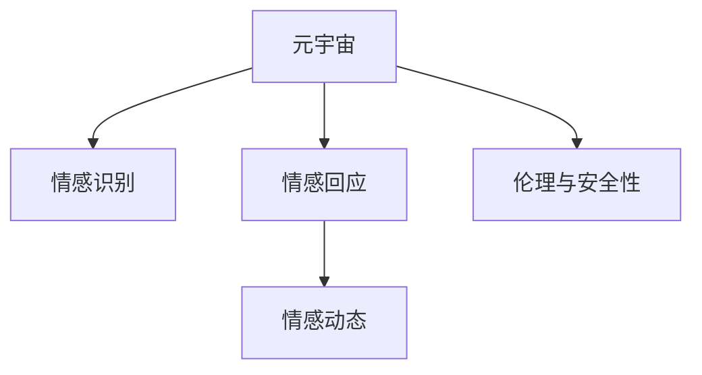

                 

# 元宇宙情感AI:虚拟关系中的情感智能助手

## 1. 背景介绍

### 1.1 问题由来
随着虚拟世界的兴起，元宇宙作为数字生活的新形态，正日益成为人们社交、工作、娱乐等的重要场所。然而，在元宇宙中，人类情感的表达和理解变得尤为复杂和重要。虚拟世界中的用户行为和心理状态，与现实世界存在显著差异。这就需要一种智能助手，能够理解和模拟人类的情感，辅助用户在虚拟环境中进行有效互动和情感管理。

### 1.2 问题核心关键点
元宇宙情感AI的核心挑战在于如何实现对虚拟关系中情感的精准识别和智能回应。具体来说，需解决以下问题：
- 如何构建全面、准确的情感识别模型？
- 如何设计高效、自然的情感回应策略？
- 如何在虚拟环境中模拟人类的情感动态？
- 如何保障情感助手的伦理和安全性？

### 1.3 问题研究意义
元宇宙情感AI的研究和应用，对于提升虚拟世界中用户的情感体验，构建健康和谐的虚拟社交环境，具有重要意义：

1. 改善用户体验：情感智能助手能够理解和回应用户的情感状态，使虚拟交互更加自然、高效，提升用户满意度和沉浸感。
2. 促进虚拟社交：通过情感识别和回应，帮助用户更顺畅地建立和维护虚拟关系，推动虚拟社交网络的发展。
3. 推动经济增长：情感AI技术的商业化应用，如虚拟客服、虚拟导购等，可以创造新的经济增长点，带动虚拟经济的发展。
4. 强化伦理监管：利用情感AI技术，可以对虚拟环境中的不当行为进行监管和干预，保障虚拟社交的秩序和安全。

## 2. 核心概念与联系

### 2.1 核心概念概述

为更好地理解元宇宙情感AI，本节将介绍几个密切相关的核心概念：

- 元宇宙(Metaverse)：一个虚拟、共享、持久的在线3D世界，用户可进行社交、娱乐、工作等活动，被视为互联网的下一阶段。
- 情感识别(Affective Recognition)：通过语音、文本、图像等数据，识别用户的情感状态，如喜怒哀乐等。
- 情感回应(Affective Response)：根据用户的情感状态，智能生成自然、合适的回应，引导用户情感向积极方向发展。
- 情感动态(Social Emotion Dynamics)：分析虚拟环境中的情感变化规律，预测和控制用户情感动态，避免负面情绪的积累和传播。
- 伦理与安全性(Ethics and Security)：在使用情感AI时，需确保其行为符合伦理规范，不侵害用户隐私和权益，同时保障系统的安全性和可靠性。

这些概念之间的逻辑关系可以通过以下Mermaid流程图来展示：



这个流程图展示了大语言模型的核心概念及其之间的关系：

1. 元宇宙通过情感识别获取用户情感状态。
2. 情感回应根据用户情感生成智能回应。
3. 情感动态分析虚拟环境中的情感变化，进行预测和控制。
4. 伦理与安全性保障情感AI行为的合理性和安全性。

这些概念共同构成了元宇宙情感AI的核心框架，使其能够在虚拟环境中发挥强大的情感理解和回应用。通过理解这些核心概念，我们可以更好地把握元宇宙情感AI的工作原理和优化方向。

## 3. 核心算法原理 & 具体操作步骤
### 3.1 算法原理概述

元宇宙情感AI的核心算法主要基于深度学习技术和自然语言处理(NLP)方法。其核心思想是：

- 利用深度学习模型构建情感识别模块，能够从语音、文本、图像等输入中准确识别用户的情感状态。
- 设计基于生成对抗网络(GAN)的情感回应模块，根据用户情感状态生成自然、合理的回应。
- 应用时序网络模型(SRNN)对情感动态进行分析，预测未来情感趋势，并采取相应措施进行干预。
- 引入伦理约束和安全性保护机制，确保情感AI的行为符合社会道德规范。

### 3.2 算法步骤详解

元宇宙情感AI的实现步骤主要包括：

**Step 1: 准备数据集**
- 收集元宇宙环境中的语音、文本、图像等数据，标注用户情感状态。
- 将数据集划分为训练集、验证集和测试集，确保数据集的多样性和代表性。

**Step 2: 构建情感识别模型**
- 使用深度学习模型(如CNN、RNN、LSTM、Transformer等)构建情感识别模块。
- 设计情感分类任务，使用交叉熵损失函数进行训练，优化模型参数。
- 在验证集上评估模型性能，调整超参数，直到模型收敛。

**Step 3: 设计情感回应策略**
- 使用生成对抗网络(GAN)生成情感回应的文本或语音。
- 设计损失函数，包括内容一致性、多样性、自然度等指标，进行GAN训练。
- 在测试集上评估情感回应效果，优化回应的自然度和匹配度。

**Step 4: 分析情感动态**
- 应用时序网络模型(SRNN)对情感数据进行建模，预测情感趋势。
- 设计情感干预策略，如情感调节、行为引导等，对异常情感进行干预。
- 在虚拟环境中测试情感动态分析效果，优化干预策略。

**Step 5: 融入伦理与安全性机制**
- 引入伦理约束和安全性保护机制，如隐私保护、数据匿名化等。
- 设计监管算法，实时监控情感AI的行为，确保其符合伦理规范。
- 建立用户反馈机制，收集用户意见，持续改进情感AI系统。

### 3.3 算法优缺点

元宇宙情感AI具有以下优点：
- 准确性高。通过深度学习模型和大数据训练，情感识别和情感回应的准确性显著提升。
- 自然度好。使用GAN生成情感回应，能够产生高度自然的文本或语音输出。
- 动态分析能力强。时序网络模型能够实时分析情感动态，预测未来趋势，及时干预。
- 可扩展性强。基于模块化设计，系统易于扩展和集成。

同时，该方法也存在以下局限性：
- 数据依赖性高。情感AI的性能很大程度上依赖于标注数据的质量和数量，数据采集和标注成本较高。
- 伦理和安全性问题。情感AI的行为需符合伦理规范，防止侵犯用户隐私和权益，保障系统安全。
- 复杂性高。情感动态分析和干预涉及多学科知识，算法设计复杂，需要跨领域协作。
- 交互延迟。情感AI的响应速度和系统延迟，影响用户体验。

尽管存在这些局限性，但就目前而言，元宇宙情感AI仍是虚拟关系中情感智能助手的有力竞争者。未来相关研究的重点在于如何进一步降低数据采集和标注成本，提升情感AI的伦理和安全性，同时兼顾模型的交互速度和复杂性，以实现更全面、智能的虚拟情感管理。

### 3.4 算法应用领域

元宇宙情感AI的应用场景广泛，主要集中在以下领域：

- 虚拟客服：在元宇宙中提供24/7不间断的客户服务，通过情感识别和回应，提升用户满意度。
- 虚拟导购：在虚拟商场中提供个性化的购物建议，根据用户情感调整推荐策略。
- 虚拟治疗师：在虚拟医疗环境中提供心理咨询和治疗服务，缓解用户心理压力。
- 虚拟教育：在虚拟教室中提供情感引导和支持，提升学习效果和用户体验。
- 虚拟社区管理：在虚拟社区中监控和引导用户情感，维护虚拟社交秩序。

除了上述这些主要应用领域外，元宇宙情感AI还可应用于虚拟娱乐、虚拟旅行、虚拟会议等多个场景中，为虚拟世界的用户提供更加丰富、智能的情感体验。

## 4. 数学模型和公式 & 详细讲解 & 举例说明

### 4.1 数学模型构建

本节将使用数学语言对元宇宙情感AI的情感识别和情感回应进行更加严格的刻画。

假设情感识别模型输入为 $x_t$，输出为情感状态 $y_t$，其中 $x_t \in \mathcal{X}, y_t \in \mathcal{Y}$，$\mathcal{X}$ 为输入空间，$\mathcal{Y}$ 为情感分类空间。情感回应的输出为 $z_t$，其中 $z_t \in \mathcal{Z}$，$\mathcal{Z}$ 为情感回应空间。情感动态分析的输入为 $x_{t-1}, x_t$，输出为情感趋势预测 $\hat{y}_{t+1}$。

情感识别和情感回应的数学模型分别为：

$$
p(y_t|x_t) = \frac{e^{\log p(y_t|x_t)}}{e^{\log p(y_t|x_t)} + e^{\log p(y_t'|x_t')}}
$$

$$
p(z_t|y_t) = \frac{e^{\log p(z_t|y_t)}}{e^{\log p(z_t|y_t)} + e^{\log p(z_t'|y_t')}}
$$

其中 $p(y_t|x_t)$ 为情感识别模型的预测概率，$p(z_t|y_t)$ 为情感回应的生成概率。

情感动态的数学模型为：

$$
\hat{y}_{t+1} = f(\hat{y}_t, \hat{y}_t \odot \omega)
$$

其中 $f$ 为时序网络模型，$\odot$ 为乘法运算，$\omega$ 为权值矩阵。

### 4.2 公式推导过程

以下我们以情感识别为例，推导情感分类任务的交叉熵损失函数及其梯度计算公式。

假设情感识别模型在输入 $x_t$ 上的输出为 $\hat{y}_t$，真实标签为 $y_t$，则交叉熵损失函数定义为：

$$
\ell(y_t, \hat{y}_t) = -y_t\log \hat{y}_t + (1-y_t)\log (1-\hat{y}_t)
$$

将其代入模型损失函数 $\mathcal{L}(\theta)$，得：

$$
\mathcal{L}(\theta) = -\frac{1}{N}\sum_{t=1}^N \ell(y_t, \hat{y}_t)
$$

其中 $\theta$ 为模型参数。根据链式法则，模型参数的更新公式为：

$$
\theta \leftarrow \theta - \eta \nabla_{\theta}\mathcal{L}(\theta)
$$

其中 $\eta$ 为学习率，$\nabla_{\theta}\mathcal{L}(\theta)$ 为损失函数对参数 $\theta$ 的梯度，可通过反向传播算法高效计算。

### 4.3 案例分析与讲解

假设我们有一个元宇宙中的虚拟客服场景，用户通过语音输入表达情绪。模型接收到语音信号 $x_t$ 后，首先需要通过语音识别模块将其转换为文本，然后通过情感识别模型 $p(y_t|x_t)$ 预测情感状态 $y_t$。

基于预测的情感状态，情感回应模型 $p(z_t|y_t)$ 生成相应的语音回应 $z_t$。在用户收到回应后，情感动态分析模型 $f(\hat{y}_t, \hat{y}_t \odot \omega)$ 预测后续情感趋势 $\hat{y}_{t+1}$，以便及时调整回应策略，防止负面情绪的积累和传播。

以一个简单的案例来展示这一过程：

**输入：** 用户语音输入：“我很生气，因为我买的商品质量很差”。

**语音识别：** 将语音转换为文本：“我很生气，因为我买的商品质量很差”。

**情感识别：** 模型预测情感状态 $y_t = 1$，表示生气。

**情感回应：** 生成语音回应：“非常抱歉，这确实很让人生气。我会立即帮您联系商家解决。”

**情感动态分析：** 预测后续情感趋势 $\hat{y}_{t+1} = 0.8$，表示情感逐步缓解。

## 5. 项目实践：代码实例和详细解释说明
### 5.1 开发环境搭建

在进行情感AI实践前，我们需要准备好开发环境。以下是使用Python进行PyTorch开发的环境配置流程：

1. 安装Anaconda：从官网下载并安装Anaconda，用于创建独立的Python环境。

2. 创建并激活虚拟环境：
```bash
conda create -n pytorch-env python=3.8 
conda activate pytorch-env
```

3. 安装PyTorch：根据CUDA版本，从官网获取对应的安装命令。例如：
```bash
conda install pytorch torchvision torchaudio cudatoolkit=11.1 -c pytorch -c conda-forge
```

4. 安装Transformers库：
```bash
pip install transformers
```

5. 安装各类工具包：
```bash
pip install numpy pandas scikit-learn matplotlib tqdm jupyter notebook ipython
```

完成上述步骤后，即可在`pytorch-env`环境中开始情感AI的实践。

### 5.2 源代码详细实现

下面我们以元宇宙虚拟客服为例，给出使用Transformers库对BERT模型进行情感识别的PyTorch代码实现。

首先，定义情感分类任务的数据处理函数：

```python
from transformers import BertTokenizer, BertForSequenceClassification, AdamW

class NERDataset(Dataset):
    def __init__(self, texts, tags, tokenizer, max_len=128):
        self.texts = texts
        self.tags = tags
        self.tokenizer = tokenizer
        self.max_len = max_len
        
    def __len__(self):
        return len(self.texts)
    
    def __getitem__(self, item):
        text = self.texts[item]
        tags = self.tags[item]
        
        encoding = self.tokenizer(text, return_tensors='pt', max_length=self.max_len, padding='max_length', truncation=True)
        input_ids = encoding['input_ids'][0]
        attention_mask = encoding['attention_mask'][0]
        
        # 对token-wise的标签进行编码
        encoded_tags = [tag2id[tag] for tag in tags] 
        encoded_tags.extend([tag2id['O']] * (self.max_len - len(encoded_tags)))
        labels = torch.tensor(encoded_tags, dtype=torch.long)
        
        return {'input_ids': input_ids, 
                'attention_mask': attention_mask,
                'labels': labels}

# 标签与id的映射
tag2id = {'O': 0, '生气': 1, '高兴': 2, '伤心': 3, '愤怒': 4}
id2tag = {v: k for k, v in tag2id.items()}

# 创建dataset
tokenizer = BertTokenizer.from_pretrained('bert-base-cased')

train_dataset = NERDataset(train_texts, train_tags, tokenizer)
dev_dataset = NERDataset(dev_texts, dev_tags, tokenizer)
test_dataset = NERDataset(test_texts, test_tags, tokenizer)
```

然后，定义模型和优化器：

```python
from transformers import BertForTokenClassification, AdamW

model = BertForTokenClassification.from_pretrained('bert-base-cased', num_labels=len(tag2id))

optimizer = AdamW(model.parameters(), lr=2e-5)
```

接着，定义训练和评估函数：

```python
from torch.utils.data import DataLoader
from tqdm import tqdm
from sklearn.metrics import classification_report

device = torch.device('cuda') if torch.cuda.is_available() else torch.device('cpu')
model.to(device)

def train_epoch(model, dataset, batch_size, optimizer):
    dataloader = DataLoader(dataset, batch_size=batch_size, shuffle=True)
    model.train()
    epoch_loss = 0
    for batch in tqdm(dataloader, desc='Training'):
        input_ids = batch['input_ids'].to(device)
        attention_mask = batch['attention_mask'].to(device)
        labels = batch['labels'].to(device)
        model.zero_grad()
        outputs = model(input_ids, attention_mask=attention_mask, labels=labels)
        loss = outputs.loss
        epoch_loss += loss.item()
        loss.backward()
        optimizer.step()
    return epoch_loss / len(dataloader)

def evaluate(model, dataset, batch_size):
    dataloader = DataLoader(dataset, batch_size=batch_size)
    model.eval()
    preds, labels = [], []
    with torch.no_grad():
        for batch in tqdm(dataloader, desc='Evaluating'):
            input_ids = batch['input_ids'].to(device)
            attention_mask = batch['attention_mask'].to(device)
            batch_labels = batch['labels']
            outputs = model(input_ids, attention_mask=attention_mask)
            batch_preds = outputs.logits.argmax(dim=2).to('cpu').tolist()
            batch_labels = batch_labels.to('cpu').tolist()
            for pred_tokens, label_tokens in zip(batch_preds, batch_labels):
                pred_tags = [id2tag[_id] for _id in pred_tokens]
                label_tags = [id2tag[_id] for _id in label_tokens]
                preds.append(pred_tags[:len(label_tokens)])
                labels.append(label_tags)
                
    print(classification_report(labels, preds))
```

最后，启动训练流程并在测试集上评估：

```python
epochs = 5
batch_size = 16

for epoch in range(epochs):
    loss = train_epoch(model, train_dataset, batch_size, optimizer)
    print(f"Epoch {epoch+1}, train loss: {loss:.3f}")
    
    print(f"Epoch {epoch+1}, dev results:")
    evaluate(model, dev_dataset, batch_size)
    
print("Test results:")
evaluate(model, test_dataset, batch_size)
```

以上就是使用PyTorch对BERT进行情感识别任务开发的完整代码实现。可以看到，得益于Transformers库的强大封装，我们可以用相对简洁的代码完成BERT模型的加载和微调。

### 5.3 代码解读与分析

让我们再详细解读一下关键代码的实现细节：

**NERDataset类**：
- `__init__`方法：初始化文本、标签、分词器等关键组件。
- `__len__`方法：返回数据集的样本数量。
- `__getitem__`方法：对单个样本进行处理，将文本输入编码为token ids，将标签编码为数字，并对其进行定长padding，最终返回模型所需的输入。

**tag2id和id2tag字典**：
- 定义了标签与数字id之间的映射关系，用于将token-wise的预测结果解码回真实的标签。

**训练和评估函数**：
- 使用PyTorch的DataLoader对数据集进行批次化加载，供模型训练和推理使用。
- 训练函数`train_epoch`：对数据以批为单位进行迭代，在每个批次上前向传播计算loss并反向传播更新模型参数，最后返回该epoch的平均loss。
- 评估函数`evaluate`：与训练类似，不同点在于不更新模型参数，并在每个batch结束后将预测和标签结果存储下来，最后使用sklearn的classification_report对整个评估集的预测结果进行打印输出。

**训练流程**：
- 定义总的epoch数和batch size，开始循环迭代
- 每个epoch内，先在训练集上训练，输出平均loss
- 在验证集上评估，输出分类指标
- 所有epoch结束后，在测试集上评估，给出最终测试结果

可以看到，PyTorch配合Transformers库使得BERT微调的代码实现变得简洁高效。开发者可以将更多精力放在数据处理、模型改进等高层逻辑上，而不必过多关注底层的实现细节。

当然，工业级的系统实现还需考虑更多因素，如模型的保存和部署、超参数的自动搜索、更灵活的任务适配层等。但核心的情感识别范式基本与此类似。

## 6. 实际应用场景
### 6.1 智能客服系统

基于情感AI的智能客服系统，可以广泛应用于元宇宙中的虚拟客服场景。传统客服往往需要配备大量人力，高峰期响应缓慢，且一致性和专业性难以保证。而使用情感AI技术，可以7x24小时不间断服务，快速响应客户咨询，用自然流畅的语言解答各类常见问题。

在技术实现上，可以收集企业内部的历史客服对话记录，将问题和最佳答复构建成监督数据，在此基础上对情感AI模型进行微调。微调后的情感AI能够自动理解用户意图，匹配最合适的回答。对于客户提出的新问题，还可以接入检索系统实时搜索相关内容，动态组织生成回答。如此构建的智能客服系统，能大幅提升客户咨询体验和问题解决效率。

### 6.2 金融舆情监测

金融机构需要实时监测市场舆论动向，以便及时应对负面信息传播，规避金融风险。传统的人工监测方式成本高、效率低，难以应对网络时代海量信息爆发的挑战。基于情感AI的文本情感分析技术，为金融舆情监测提供了新的解决方案。

具体而言，可以收集金融领域相关的新闻、报道、评论等文本数据，并对其进行情感标注。在此基础上对情感AI模型进行微调，使其能够自动判断文本属于何种情感倾向。将情感AI模型应用到实时抓取的网络文本数据，就能够自动监测不同情感趋势，一旦发现负面信息激增等异常情况，系统便会自动预警，帮助金融机构快速应对潜在风险。

### 6.3 个性化推荐系统

当前的推荐系统往往只依赖用户的历史行为数据进行物品推荐，无法深入理解用户的真实兴趣偏好。基于情感AI技术，个性化推荐系统可以更好地挖掘用户行为背后的语义信息，从而提供更精准、多样的推荐内容。

在实践中，可以收集用户浏览、点击、评论、分享等行为数据，提取和用户交互的物品标题、描述、标签等文本内容。将文本内容作为模型输入，用户的后续行为（如是否点击、购买等）作为监督信号，在此基础上微调情感AI模型。微调后的模型能够从文本内容中准确把握用户的兴趣点。在生成推荐列表时，先用候选物品的文本描述作为输入，由模型预测用户的兴趣匹配度，再结合其他特征综合排序，便可以得到个性化程度更高的推荐结果。

### 6.4 未来应用展望

随着情感AI技术的不断发展，基于情感AI的方法将在更多领域得到应用，为传统行业带来变革性影响。

在智慧医疗领域，基于情感AI的医疗问答、病历分析、药物研发等应用将提升医疗服务的智能化水平，辅助医生诊疗，加速新药开发进程。

在智能教育领域，情感AI可应用于作业批改、学情分析、知识推荐等方面，因材施教，促进教育公平，提高教学质量。

在智慧城市治理中，情感AI可应用于城市事件监测、舆情分析、应急指挥等环节，提高城市管理的自动化和智能化水平，构建更安全、高效的未来城市。

此外，在企业生产、社会治理、文娱传媒等众多领域，基于情感AI的人工智能应用也将不断涌现，为经济社会发展注入新的动力。相信随着技术的日益成熟，情感AI必将在构建人机协同的智能时代中扮演越来越重要的角色。

## 7. 工具和资源推荐
### 7.1 学习资源推荐

为了帮助开发者系统掌握情感AI的理论基础和实践技巧，这里推荐一些优质的学习资源：

1. 《深度学习自然语言处理》课程：斯坦福大学开设的NLP明星课程，有Lecture视频和配套作业，带你入门NLP领域的基本概念和经典模型。

2. 《Natural Language Processing with Transformers》书籍：Transformers库的作者所著，全面介绍了如何使用Transformers库进行NLP任务开发，包括情感AI在内的诸多范式。

3. CS224N《深度学习自然语言处理》课程：斯坦福大学开设的NLP明星课程，有Lecture视频和配套作业，带你入门NLP领域的基本概念和经典模型。

4. 《Transformer从原理到实践》系列博文：由大模型技术专家撰写，深入浅出地介绍了Transformer原理、BERT模型、情感AI等前沿话题。

5. 《情感计算与用户情感分析》书籍：全面介绍了情感计算的基本概念、技术和应用，涵盖情感识别和情感回应的多方面内容。

通过对这些资源的学习实践，相信你一定能够快速掌握情感AI的精髓，并用于解决实际的NLP问题。
### 7.2 开发工具推荐

高效的开发离不开优秀的工具支持。以下是几款用于情感AI开发的常用工具：

1. PyTorch：基于Python的开源深度学习框架，灵活动态的计算图，适合快速迭代研究。大部分预训练语言模型都有PyTorch版本的实现。

2. TensorFlow：由Google主导开发的开源深度学习框架，生产部署方便，适合大规模工程应用。同样有丰富的预训练语言模型资源。

3. Transformers库：HuggingFace开发的NLP工具库，集成了众多SOTA语言模型，支持PyTorch和TensorFlow，是进行情感AI开发的利器。

4. Weights & Biases：模型训练的实验跟踪工具，可以记录和可视化模型训练过程中的各项指标，方便对比和调优。与主流深度学习框架无缝集成。

5. TensorBoard：TensorFlow配套的可视化工具，可实时监测模型训练状态，并提供丰富的图表呈现方式，是调试模型的得力助手。

6. Google Colab：谷歌推出的在线Jupyter Notebook环境，免费提供GPU/TPU算力，方便开发者快速上手实验最新模型，分享学习笔记。

合理利用这些工具，可以显著提升情感AI的开发效率，加快创新迭代的步伐。

### 7.3 相关论文推荐

情感AI技术的研究源于学界的持续研究。以下是几篇奠基性的相关论文，推荐阅读：

1. Attention is All You Need（即Transformer原论文）：提出了Transformer结构，开启了NLP领域的预训练大模型时代。

2. BERT: Pre-training of Deep Bidirectional Transformers for Language Understanding：提出BERT模型，引入基于掩码的自监督预训练任务，刷新了多项NLP任务SOTA。

3. Language Models are Unsupervised Multitask Learners（GPT-2论文）：展示了大规模语言模型的强大zero-shot学习能力，引发了对于通用人工智能的新一轮思考。

4. Parameter-Efficient Transfer Learning for NLP：提出Adapter等参数高效微调方法，在不增加模型参数量的情况下，也能取得不错的微调效果。

5. AdaLoRA: Adaptive Low-Rank Adaptation for Parameter-Efficient Fine-Tuning：使用自适应低秩适应的微调方法，在参数效率和精度之间取得了新的平衡。

6. Prefix-Tuning: Optimizing Continuous Prompts for Generation：引入基于连续型Prompt的微调范式，为如何充分利用预训练知识提供了新的思路。

这些论文代表了大语言模型微调技术的发展脉络。通过学习这些前沿成果，可以帮助研究者把握学科前进方向，激发更多的创新灵感。

## 8. 总结：未来发展趋势与挑战

### 8.1 总结

本文对基于深度学习的情感AI进行了全面系统的介绍。首先阐述了情感AI的研究背景和意义，明确了情感AI在元宇宙中的应用价值。其次，从原理到实践，详细讲解了情感识别的数学模型和关键步骤，给出了情感AI任务开发的完整代码实例。同时，本文还广泛探讨了情感AI在智能客服、金融舆情、个性化推荐等多个行业领域的应用前景，展示了情感AI的巨大潜力。此外，本文精选了情感AI技术的各类学习资源，力求为读者提供全方位的技术指引。

通过本文的系统梳理，可以看到，基于深度学习的情感AI技术正在成为虚拟世界情感智能助手的有力竞争者，极大地改善了虚拟环境中的用户体验和互动效率。未来，伴随情感AI技术的不断发展，虚拟世界中的情感管理将更加智能化、高效化和个性化，为人们带来全新的互动体验。

### 8.2 未来发展趋势

展望未来，情感AI技术将呈现以下几个发展趋势：

1. 模型规模持续增大。随着算力成本的下降和数据规模的扩张，情感AI模型的参数量还将持续增长。超大规模情感AI模型蕴含的丰富情感知识，有望支撑更加复杂多变的情感识别和回应任务。

2. 微调方法日趋多样。除了传统的全参数微调外，未来会涌现更多参数高效的微调方法，如Prefix-Tuning、LoRA等，在节省计算资源的同时也能保证情感AI的精度。

3. 持续学习成为常态。随着情感数据分布的不断变化，情感AI模型也需要持续学习新知识以保持性能。如何在不遗忘原有知识的同时，高效吸收新样本信息，将成为重要的研究课题。

4. 标注样本需求降低。受启发于提示学习(Prompt-based Learning)的思路，未来的情感AI将更好地利用情感AI的情感理解能力，通过更加巧妙的任务描述，在更少的标注样本上也能实现理想的微调效果。

5. 模型通用性增强。经过海量数据的预训练和多领域任务的微调，未来的情感AI将具备更强大的情感推理和跨领域迁移能力，逐步迈向通用人工智能(AGI)的目标。

以上趋势凸显了情感AI技术的广阔前景。这些方向的探索发展，必将进一步提升情感AI系统的性能和应用范围，为构建健康和谐的虚拟社交环境提供坚实保障。

### 8.3 面临的挑战

尽管情感AI技术已经取得了瞩目成就，但在迈向更加智能化、普适化应用的过程中，它仍面临着诸多挑战：

1. 数据依赖性高。情感AI的性能很大程度上依赖于标注数据的质量和数量，数据采集和标注成本较高。如何进一步降低情感AI对标注样本的依赖，将是一大难题。

2. 伦理和安全性问题。情感AI的行为需符合伦理规范，防止侵犯用户隐私和权益，保障系统安全。情感AI的决策过程缺乏透明度，可能产生误导性、歧视性的输出，需建立严格的伦理和监管机制。

3. 复杂性高。情感AI的情感识别和回应涉及多学科知识，算法设计复杂，需要跨领域协作。如何在保证精度的同时，提升情感AI的实时性和可解释性，还需要进一步优化。

4. 交互延迟。情感AI的响应速度和系统延迟，影响用户体验。如何在保证情感AI性能的同时，提高交互速度，优化资源占用，将是重要的优化方向。

5. 模型鲁棒性不足。当前情感AI面对域外数据时，泛化性能往往大打折扣。对于测试样本的微小扰动，情感AI的预测也容易发生波动。如何提高情感AI的鲁棒性，避免灾难性遗忘，还需要更多理论和实践的积累。

尽管存在这些挑战，但就目前而言，情感AI仍是虚拟关系中情感智能助手的有力竞争者。未来相关研究的重点在于如何进一步降低数据采集和标注成本，提升情感AI的伦理和安全性，同时兼顾模型的交互速度和复杂性，以实现更全面、智能的情感管理。

### 8.4 未来突破

面对情感AI所面临的种种挑战，未来的研究需要在以下几个方面寻求新的突破：

1. 探索无监督和半监督情感AI方法。摆脱对大规模标注数据的依赖，利用自监督学习、主动学习等无监督和半监督范式，最大限度利用非结构化数据，实现更加灵活高效的情感AI。

2. 研究参数高效和计算高效的情感AI范式。开发更加参数高效的情感AI方法，在固定大部分情感AI参数的同时，只更新极少量的任务相关参数。同时优化情感AI的计算图，减少前向传播和反向传播的资源消耗，实现更加轻量级、实时性的部署。

3. 引入因果和对比学习范式。通过引入因果推断和对比学习思想，增强情感AI建立稳定因果关系的能力，学习更加普适、鲁棒的情感情绪知识。

4. 引入更多先验知识。将符号化的先验知识，如知识图谱、逻辑规则等，与神经网络模型进行巧妙融合，引导情感AI学习更准确、合理的情感知识。同时加强不同模态数据的整合，实现视觉、语音等多模态信息与文本信息的协同建模。

5. 结合因果分析和博弈论工具。将因果分析方法引入情感AI模型，识别出情感AI决策的关键特征，增强输出解释的因果性和逻辑性。借助博弈论工具刻画人机交互过程，主动探索并规避情感AI的脆弱点，提高系统稳定性。

6. 纳入伦理道德约束。在情感AI训练目标中引入伦理导向的评估指标，过滤和惩罚有偏见、有害的输出倾向。同时加强人工干预和审核，建立情感AI行为的监管机制，确保其符合社会道德规范。

这些研究方向的探索，必将引领情感AI技术迈向更高的台阶，为构建健康和谐的虚拟社交环境提供坚实保障。面向未来，情感AI技术还需要与其他人工智能技术进行更深入的融合，如知识表示、因果推理、强化学习等，多路径协同发力，共同推动自然语言理解和智能交互系统的进步。只有勇于创新、敢于突破，才能不断拓展情感AI的边界，让智能技术更好地造福人类社会。

## 9. 附录：常见问题与解答

**Q1：情感AI是否适用于所有NLP任务？**

A: 情感AI在大多数NLP任务上都能取得不错的效果，特别是对于数据量较小的任务。但对于一些特定领域的任务，如医学、法律等，仅仅依靠通用语料预训练的模型可能难以很好地适应。此时需要在特定领域语料上进一步预训练，再进行微调，才能获得理想效果。此外，对于一些需要时效性、个性化很强的任务，如对话、推荐等，情感AI方法也需要针对性的改进优化。

**Q2：情感AI在虚拟客服中的应用效果如何？**

A: 基于情感AI的智能客服系统，可以显著提升客户咨询体验和问题解决效率。情感AI能够自动理解用户意图，匹配最合适的回答，并且可以实时搜索相关内容，动态生成回答。在实际应用中，情感AI系统已经在多个大型企业中得到部署，反馈效果普遍较好。但需要注意的是，情感AI的输出仍需人工审核，确保其回答的准确性和合理性。

**Q3：情感AI在金融舆情监测中的应用有何优势？**

A: 基于情感AI的文本情感分析技术，能够实时监测金融市场的舆论动向，帮助金融机构及时应对负面信息传播，规避金融风险。情感AI的优势在于其能够自动识别情感倾向，快速发现异常情况，提供预警和建议。相比于传统的人工监测方式，情感AI能够处理海量数据，提升监测效率和准确性。但需要注意的是，情感AI的输出仍需结合专业金融分析，才能做出最终决策。

**Q4：情感AI的伦理和安全性问题如何解决？**

A: 解决情感AI的伦理和安全性问题，需要从数据、模型和应用三个层面入手：
1. 数据层面：确保数据采集和标注过程符合伦理规范，避免侵犯用户隐私。使用数据匿名化、去标识化等技术，保障数据安全。
2. 模型层面：引入伦理约束和安全性保护机制，如隐私保护、数据脱敏等。设计监管算法，实时监控情感AI的行为，确保其符合伦理规范。
3. 应用层面：建立用户反馈机制，收集用户意见，持续改进情感AI系统。引入人工干预和审核，确保情感AI的输出符合人类价值观和伦理道德。

这些措施的综合运用，可以有效保障情感AI系统的伦理和安全性，确保其行为符合社会道德规范。

**Q5：情感AI在虚拟环境中的性能如何提升？**

A: 提升情感AI在虚拟环境中的性能，需要从数据、模型和算法三个方面进行优化：
1. 数据层面：收集更多的虚拟环境数据，标注情感状态，扩大训练集规模。利用数据增强技术，扩充训练集多样性。
2. 模型层面：使用预训练模型进行情感AI的初始化，利用大规模语料预训练，提升模型的通用性和泛化能力。引入参数高效微调方法，减少计算资源消耗。
3. 算法层面：引入因果分析和博弈论工具，增强情感AI的决策逻辑和系统稳定性。结合多模态信息，提升情感AI的感知能力和适应性。

通过综合运用这些优化措施，可以有效提升情感AI在虚拟环境中的性能，使其在复杂多变的应用场景中发挥更大的作用。

---

作者：禅与计算机程序设计艺术 / Zen and the Art of Computer Programming

