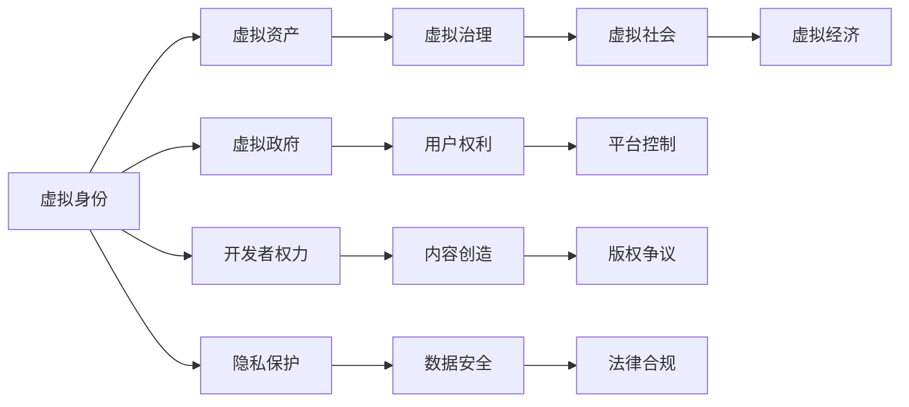

                 

## 1. 背景介绍

在科技与虚拟现实飞速发展的今天，元宇宙已成为影响深远的概念。元宇宙，即通过虚拟现实、增强现实等技术构建的沉浸式数字世界。在这个数字空间中，人们可以进行互动、交流、交易等活动，仿佛置身于另一个现实世界。然而，这个虚拟世界的背后，却是一场权力与利益的博弈。本文将深入探讨元宇宙中的政治问题，分析虚拟世界的权力结构与运行机制，以及它们如何影响元宇宙的未来发展。

## 2. 核心概念与联系

### 2.1 核心概念概述

在元宇宙中，权力博弈主要围绕以下几个关键概念展开：

- **虚拟身份**：用户通过虚拟化身在元宇宙中活动，这些虚拟身份构成了虚拟世界的基本单元。
- **虚拟资产**：包括虚拟土地、虚拟房产、虚拟货币等，是元宇宙中的价值载体。
- **虚拟治理**：元宇宙的管理与规则制定，包括法律、伦理、隐私保护等方面。
- **虚拟社会**：由用户、开发者、平台服务商等构成，形成了复杂的社会网络。
- **虚拟经济**：通过虚拟货币和虚拟资产交易形成的经济体系。

这些概念相互交织，形成了一个复杂的虚拟社会生态系统，其中权力斗争尤为突出。

### 2.2 核心概念原理和架构的 Mermaid 流程图



### 2.3 核心概念联系

在元宇宙中，各个核心概念间存在紧密联系。虚拟身份是虚拟社会的个体基础，虚拟资产是虚拟经济的核心，虚拟治理保障了虚拟社会的秩序与公正，而虚拟经济则是虚拟世界可持续发展的动力。用户权利、平台控制和开发者权力是权力斗争的核心，影响着元宇宙的治理结构和生态平衡。隐私保护和数据安全是虚拟治理的重要内容，法律合规是保障虚拟世界秩序的基石。

## 3. 核心算法原理 & 具体操作步骤

### 3.1 算法原理概述

元宇宙政治的核心算法原理，主要体现在以下几个方面：

- **分布式治理**：通过区块链等分布式技术，实现去中心化的权力分配。
- **智能合约**：利用智能合约自动化执行交易与治理规则，减少人为干预。
- **权力分配算法**：如权益分配算法、投票权算法等，决定虚拟资产与治理权力的分配。

### 3.2 算法步骤详解

1. **虚拟身份管理**：
    - 用户注册虚拟身份，并进行身份验证。
    - 用户身份与现实世界身份绑定，以实现真实身份的信任。
    - 通过虚拟身份管理器，管理用户的权限和角色。

2. **虚拟资产管理**：
    - 设计虚拟资产的创建、交易、存储机制。
    - 实现虚拟货币与虚拟商品的交易系统。
    - 引入资产发行、交易清算等规则，保障虚拟经济的稳定。

3. **虚拟治理**：
    - 制定虚拟世界的基本规则与法律。
    - 设计虚拟治理机构，如虚拟政府、社区委员会等。
    - 引入治理投票、提案机制，实现去中心化的决策过程。

4. **虚拟社会网络**：
    - 构建虚拟社会关系网络，如好友、群组、社区等。
    - 实现社交互动、内容分享等功能。
    - 设计虚拟市场、经济模型，促进虚拟社会的发展。

5. **虚拟经济体系**：
    - 设计虚拟货币系统，如加密货币、稳定币等。
    - 实现虚拟资产的流通与增值。
    - 引入经济模型与宏观调控机制，保障虚拟经济的平衡。

### 3.3 算法优缺点

- **优点**：
    - 去中心化：分布式治理和智能合约，减少了中心化机构对权力的控制。
    - 自动化：智能合约和分布式技术，提高了治理和交易的效率。
    - 透明度：区块链技术的公开透明性，保障了权力的透明与公正。

- **缺点**：
    - 复杂性：分布式治理和智能合约增加了系统的复杂性，容易出现漏洞。
    - 依赖技术：技术依赖性强，一旦技术失效，权力博弈可能陷入混乱。
    - 治理难题：去中心化带来了权力分散，如何高效治理是一个挑战。

### 3.4 算法应用领域

元宇宙政治的核心算法广泛应用于以下几个领域：

- **虚拟现实应用**：如VR游戏、虚拟社交平台、虚拟城市等。
- **金融科技**：虚拟货币交易、虚拟资产管理、金融创新等。
- **数字版权**：版权保护、内容创作者权益分配等。
- **电子商务**：虚拟商品交易、虚拟市场建设等。
- **社会治理**：虚拟社区管理、虚拟城市规划等。

## 4. 数学模型和公式 & 详细讲解

### 4.1 数学模型构建

在元宇宙中，虚拟身份、虚拟资产、虚拟治理等核心概念，可以抽象为数学模型。假设元宇宙中有 $N$ 个用户，每个用户拥有 $A_i$ 个虚拟资产，资产总价值为 $V$，治理投票权为 $W_i$，虚拟社会网络中的连接数为 $E$。

### 4.2 公式推导过程

1. **虚拟身份模型**：
    - 用户身份验证：$P_{\text{valid}} = f(\text{ID}, \text{Proof})$
    - 权限管理：$P_{\text{permission}} = g(\text{ID}, \text{Role})$

2. **虚拟资产模型**：
    - 虚拟资产创建：$A_{\text{create}} = h(\text{Creator}, \text{Type}, \text{Value})$
    - 虚拟资产交易：$A_{\text{transfer}} = k(\text{Seller}, \text{Buyer}, \text{Price})$
    - 资产存储：$A_{\text{store}} = l(A_i)$

3. **虚拟治理模型**：
    - 虚拟法律制定：$L = \{l_1, l_2, ..., l_m\}$
    - 虚拟政府：$G = \{g_1, g_2, ..., g_n\}$
    - 治理投票：$Voting = \{Voter, Proposal, Result\}$

4. **虚拟社会网络模型**：
    - 社交网络构建：$E = \{u_i, u_j\}$
    - 社交互动：$Interactions = \{u_i, u_j, \text{Action}\}$
    - 内容分享：$Content = \{C_i, \text{User}\}$

5. **虚拟经济模型**：
    - 虚拟货币系统：$Currency = \{C_i, Value, Supply\}$
    - 虚拟资产流通：$Flow = \{A_i, Price\}$
    - 宏观调控：$Control = \{Policy, \text{Adjustment}\}$

### 4.3 案例分析与讲解

假设在元宇宙中有两个平台：A平台和B平台。两个平台采用不同的权力分配算法和智能合约设计，因此它们的治理结构和虚拟社会生态不同。

- **A平台**：采用基于共识的权力分配算法，每个用户有相等的投票权。智能合约自动化执行交易和治理决策。A平台的治理透明高效，但容易出现权力分散，决策过程复杂。

- **B平台**：采用基于贡献的权力分配算法，根据用户资产和参与度分配投票权。智能合约与虚拟政府协同工作，高效管理虚拟社会。B平台的治理结构集中，但权力控制较强。

## 5. 项目实践：代码实例和详细解释说明

### 5.1 开发环境搭建

为了进行元宇宙政治的开发，我们需要搭建一个虚拟身份管理、虚拟资产管理、虚拟治理和虚拟社会网络的平台。以下是开发环境搭建的步骤：

1. 安装Python环境，使用Anaconda管理依赖库。
2. 安装Flask、Django、React等Web框架，用于构建平台后端和前端。
3. 安装TensorFlow、PyTorch等深度学习框架，用于数据分析和机器学习。
4. 安装Ethereum等区块链平台，用于分布式治理和智能合约开发。
5. 安装AWS、GCP等云服务，用于分布式计算和存储。

### 5.2 源代码详细实现

以下是元宇宙政治开发的一个简单示例，主要展示了虚拟身份和虚拟资产的管理：

```python
from flask import Flask, jsonify
from web3 import Web3

app = Flask(__name__)

# 初始化Web3，连接Ethereum网络
web3 = Web3(Web3.HTTPProvider('https://mainnet.infura.io/v3/YOUR_INFURA_API_KEY_HERE'))

# 虚拟身份管理
@app.route('/identity', methods=['POST'])
def create_identity():
    # 创建虚拟身份，生成私钥
    private_key = web3.eth.account.create()
    public_key = private_key.public_key.to_string()

    # 存储公钥到区块链，返回虚拟身份ID
    identity_id = web3.eth.account.store(Web3.toHex(public_key))

    return jsonify({'id': identity_id})

# 虚拟资产管理
@app.route('/asset', methods=['POST'])
def create_asset():
    # 创建虚拟资产，设置初始值
    asset_id = '123456'
    asset_name = 'Metaverse Coin'
    asset_value = 10.0

    # 将资产信息存储在区块链，返回虚拟资产ID
    asset_id = web3.eth资产.add(asset_id, asset_name, asset_value)

    return jsonify({'id': asset_id})

if __name__ == '__main__':
    app.run(host='0.0.0.0', port=5000)
```

### 5.3 代码解读与分析

这段代码主要实现了虚拟身份的创建和虚拟资产的发行。通过Flask框架搭建后端服务，使用Web3连接Ethereum网络，生成虚拟身份和虚拟资产的信息，并存储在区块链上。使用HTTP请求接口，可以方便地对虚拟身份和虚拟资产进行管理。

### 5.4 运行结果展示

启动服务后，可以通过访问`http://localhost:5000/identity`和`http://localhost:5000/asset`，创建虚拟身份和虚拟资产。结果将以JSON格式返回，展示了虚拟身份ID和虚拟资产ID。

## 6. 实际应用场景

### 6.1 虚拟政府治理

虚拟政府是元宇宙政治的核心组成部分。虚拟政府通过分布式治理和智能合约，实现对虚拟社会的管理与决策。

- **决策机制**：采用去中心化的共识机制，如PoS（权益证明）、DPoS（授权权益证明）等。
- **执行机制**：智能合约自动化执行决策，减少人为干预。
- **监督机制**：虚拟社区进行公开监督，保障治理透明。

### 6.2 虚拟经济体系

虚拟经济体系是元宇宙发展的驱动力。虚拟货币和虚拟资产交易，为元宇宙提供了丰富的经济活动。

- **虚拟货币**：如加密货币、稳定币等，用于交易和存储价值。
- **虚拟资产**：如虚拟房产、虚拟艺术品等，提供增值和投资机会。
- **金融工具**：如借贷、保险等，丰富虚拟经济生态。

### 6.3 虚拟社会网络

虚拟社会网络是元宇宙的基础设施，通过社交互动、内容分享等功能，构建虚拟社区。

- **社交互动**：好友、群组、社区等，促进用户交流与合作。
- **内容分享**：博客、视频、音乐等，丰富虚拟生活。
- **市场交易**：虚拟商品、服务交易，促进经济活动。

### 6.4 未来应用展望

未来，元宇宙政治将迎来以下发展趋势：

- **去中心化治理**：进一步完善分布式治理机制，减少中心化机构控制。
- **智能合约自动化**：智能合约技术普及，实现高效、透明、自动化的治理。
- **多平台互联**：不同平台间的互联互通，形成更大的虚拟社会生态。
- **社会治理创新**：利用AI和区块链技术，提高社会治理效率。
- **虚拟资产多样化**：发展更多虚拟资产类型，丰富元宇宙经济。

## 7. 工具和资源推荐

### 7.1 学习资源推荐

- **《区块链原理与实践》**：深入介绍区块链技术，涵盖分布式治理、智能合约等内容。
- **《虚拟现实技术与应用》**：讲解虚拟现实的基础知识与实际应用。
- **《元宇宙：虚拟世界的未来》**：探讨元宇宙的发展趋势与应用场景。
- **《数字货币与区块链技术》**：介绍加密货币和区块链技术的原理与实践。
- **《人工智能与元宇宙》**：讨论AI技术在元宇宙中的应用与未来发展。

### 7.2 开发工具推荐

- **Flask**：简单易用的Web框架，适合搭建虚拟身份管理和虚拟资产管理平台。
- **Django**：功能强大的Web框架，适合搭建虚拟治理和社会网络平台。
- **React**：流行的前端框架，适合构建虚拟社区和内容分享平台。
- **Ethereum**：领先的区块链平台，适合分布式治理和智能合约开发。
- **AWS/GCP/Google Cloud**：领先的云服务平台，适合分布式计算和存储。

### 7.3 相关论文推荐

- **《元宇宙治理框架设计》**：研究元宇宙治理框架，提出分布式治理和智能合约的结合方法。
- **《区块链技术在虚拟资产管理中的应用》**：探讨区块链技术在虚拟资产管理中的应用。
- **《基于智能合约的虚拟经济模型研究》**：研究智能合约在虚拟经济中的作用，提出虚拟经济模型。
- **《元宇宙虚拟政府的设计与实现》**：研究虚拟政府的设计与实现，提出分布式治理的解决方案。
- **《虚拟社会网络分析与建模》**：研究虚拟社会网络的建模与分析方法，提出社交互动与内容分享模型。

## 8. 总结：未来发展趋势与挑战

### 8.1 研究成果总结

元宇宙政治研究主要集中在以下几个方面：

- **去中心化治理**：分布式治理和智能合约是元宇宙的核心技术，能够实现高效透明的管理与决策。
- **虚拟身份与资产**：虚拟身份和虚拟资产是元宇宙的重要组成部分，需要完善管理与保护机制。
- **虚拟社会网络**：虚拟社会网络是元宇宙的基础设施，通过社交互动和内容分享，构建虚拟社区。
- **虚拟经济体系**：虚拟货币和虚拟资产交易，为元宇宙提供了丰富的经济活动。

### 8.2 未来发展趋势

未来，元宇宙政治将呈现以下发展趋势：

- **去中心化治理**：分布式治理和智能合约普及，减少中心化机构控制。
- **智能合约自动化**：智能合约技术普及，实现高效、透明、自动化的治理。
- **多平台互联**：不同平台间的互联互通，形成更大的虚拟社会生态。
- **社会治理创新**：利用AI和区块链技术，提高社会治理效率。
- **虚拟资产多样化**：发展更多虚拟资产类型，丰富元宇宙经济。

### 8.3 面临的挑战

元宇宙政治发展中仍面临诸多挑战：

- **技术成熟度**：分布式治理、智能合约等技术仍需进一步成熟，以应对复杂场景。
- **治理结构设计**：去中心化治理设计复杂，需要合理平衡权力与效率。
- **用户隐私保护**：虚拟身份和数据隐私保护需加强，避免数据滥用。
- **法律合规性**：元宇宙涉及跨多个国家法律，合规性问题需解决。
- **市场监管**：虚拟经济需建立有效的市场监管机制，防止金融风险。

### 8.4 研究展望

未来，元宇宙政治研究将在以下几个方向寻求突破：

- **分布式治理优化**：优化分布式治理机制，提高治理效率与透明度。
- **智能合约扩展**：扩展智能合约功能，实现更复杂的虚拟治理与经济活动。
- **隐私保护技术**：开发隐私保护技术，保障用户隐私与数据安全。
- **法律合规框架**：建立元宇宙法律合规框架，保障平台和用户的合法权益。
- **市场监管机制**：建立虚拟经济的市场监管机制，防范金融风险。

## 9. 附录：常见问题与解答

### 9.1 Q1：元宇宙政治的本质是什么？

A: 元宇宙政治的本质是虚拟世界的权力分配与利益博弈。通过分布式治理和智能合约，实现去中心化的权力分配，保障虚拟社会的公正与透明。

### 9.2 Q2：元宇宙政治的优点有哪些？

A: 元宇宙政治的优点包括：
- 去中心化：分布式治理和智能合约，减少了中心化机构对权力的控制。
- 自动化：智能合约和分布式技术，提高了治理和交易的效率。
- 透明度：区块链技术的公开透明性，保障了权力的透明与公正。

### 9.3 Q3：元宇宙政治面临的主要挑战是什么？

A: 元宇宙政治面临的主要挑战包括：
- 技术成熟度：分布式治理、智能合约等技术仍需进一步成熟，以应对复杂场景。
- 治理结构设计：去中心化治理设计复杂，需要合理平衡权力与效率。
- 用户隐私保护：虚拟身份和数据隐私保护需加强，避免数据滥用。
- 法律合规性：元宇宙涉及跨多个国家法律，合规性问题需解决。
- 市场监管：虚拟经济需建立有效的市场监管机制，防止金融风险。

### 9.4 Q4：如何应对元宇宙政治的挑战？

A: 应对元宇宙政治的挑战，可以从以下几个方面入手：
- 技术研发：加强分布式治理和智能合约技术的研发，提高其成熟度和安全性。
- 治理优化：优化去中心化治理机制，平衡权力与效率，提高治理效率。
- 隐私保护：开发隐私保护技术，保障用户隐私与数据安全。
- 法律合规：建立元宇宙法律合规框架，保障平台和用户的合法权益。
- 市场监管：建立虚拟经济的市场监管机制，防范金融风险。

作者：禅与计算机程序设计艺术 / Zen and the Art of Computer Programming

