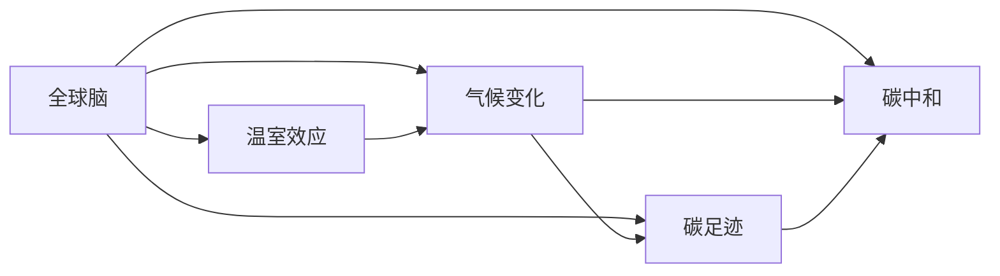

                 

# 全球脑与气候治理:集体行动对抗全球变暖

## 1. 背景介绍

### 1.1 问题由来
全球气候变暖是21世纪人类面临的最严峻挑战之一。自工业革命以来，人类活动导致的温室气体排放大幅增加，使得全球平均温度逐年上升。全球变暖带来海平面上升、极端气候频发、生物多样性丧失等一系列严重问题，直接威胁到人类的生存与发展。

应对全球变暖的挑战，需要全球脑——包括政府、企业、学术界和公众——的共同努力。全球脑指的是一群具有知识、信息和资源的集体，它们可以跨地域、跨行业、跨学科地协作，共同应对全球性的问题。在应对全球变暖这一议题上，全球脑的集体行动显得尤为重要。

### 1.2 问题核心关键点
1. **温室效应原理**：
   - 温室效应是由于温室气体（如CO2、CH4等）在大气层中形成一层层“毯子”，吸收地表辐射的热量，导致地球温度上升。

2. **气候变化证据**：
   - 气候变化的主要证据包括全球气温上升、海平面上升、极端气候事件的频发等，这些现象与温室效应有直接关联。

3. **全球变暖的影响**：
   - 全球变暖对农业、水资源、生态系统等产生深远影响，导致粮食减产、生物多样性减少、疾病传播增加等问题。

4. **集体行动机制**：
   - 全球脑通过信息共享、知识协同、资源整合等方式，共同应对全球变暖问题，需要建立有效的协作机制和激励机制。

5. **国际气候合作**：
   - 《巴黎协定》等国际气候合作机制，旨在通过全球协作，限制全球温度升幅，保护全球气候系统。

### 1.3 问题研究意义
研究全球脑与气候治理，对于应对全球变暖的挑战，构建一个稳定、和谐的地球环境具有重要意义。具体而言：

1. **提升决策效率**：通过信息共享和协同决策，提升全球气候治理的效率，减少决策失误。
2. **促进资源优化配置**：通过资源整合和优化配置，提高应对全球变暖的资源利用效率。
3. **增强问题认知**：通过跨学科、跨领域的研究，深化对全球变暖问题的理解，制定更科学合理的应对策略。
4. **推动技术创新**：通过知识协同和跨领域合作，推动气候治理技术的创新，提升应对全球变暖的能力。
5. **促进公众参与**：通过教育和宣传，提升公众对气候变化的认知，推动社会各界参与全球变暖的应对。

## 2. 核心概念与联系

### 2.1 核心概念概述

为更好地理解全球脑与气候治理，本节将介绍几个密切相关的核心概念：

- **全球脑（Global Brain）**：指由全球范围内的政府、企业、学术界和公众组成的协作网络，通过信息共享、知识协同、资源整合等方式，共同应对全球性的问题。
- **温室效应（Greenhouse Effect）**：由于温室气体在大气层中形成的“毯子”效应，导致地球温度上升的现象。
- **气候变化（Climate Change）**：指气候系统长时间尺度上的变化，通常由温室气体排放、火山活动、太阳辐射等自然或人为因素引起。
- **碳足迹（Carbon Footprint）**：指一个实体（如个人、企业、国家等）在生产、消费等活动中排放的二氧化碳总量。
- **碳中和（Carbon Neutrality）**：指通过减少碳排放和增加碳吸收，使一个实体的碳足迹为零的状态。

这些核心概念之间的逻辑关系可以通过以下Mermaid流程图来展示：



这个流程图展示了大脑与气候治理的相关概念及其之间的关系：

1. 全球脑通过减少温室气体排放、增强碳吸收等手段，应对温室效应。
2. 气候变化由温室效应引起，受到全球脑的共同治理。
3. 碳足迹是一个实体在生产、消费等活动中产生的碳排放量，是衡量温室气体排放的重要指标。
4. 碳中和是全球脑的目标，通过减少碳足迹实现。

这些概念共同构成了全球脑与气候治理的框架，使得全球脑能够科学、有效地应对全球变暖的挑战。

## 3. 核心算法原理 & 具体操作步骤
### 3.1 算法原理概述

全球脑与气候治理的核心算法原理基于集体行动机制和信息共享机制，旨在通过协作提升应对全球变暖的效率和效果。

具体而言，全球脑通过以下步骤进行气候治理：

1. **信息共享**：收集和发布全球变暖相关的数据、信息和研究报告，帮助各方了解问题的严重性和紧迫性。
2. **协同决策**：通过跨领域、跨地域的专家研讨和政策协商，制定科学合理的应对措施和政策。
3. **资源整合**：整合全球范围内的资金、技术、人力等资源，集中力量解决气候问题。
4. **公众参与**：通过教育和宣传，提升公众对气候变化的认知，推动社会各界参与气候治理。

### 3.2 算法步骤详解

全球脑与气候治理的算法步骤如下：

**Step 1: 数据收集与分析**
- 收集全球变暖相关的数据，如全球气温、海平面上升、极端气候事件等。
- 分析这些数据，评估全球变暖的严重性和紧迫性。

**Step 2: 信息共享与知识协同**
- 通过互联网、会议、报告等方式，共享数据和研究成果。
- 组织跨领域、跨地域的专家研讨，协同制定应对措施和政策。

**Step 3: 资源整合与配置**
- 整合全球范围内的资金、技术、人力等资源。
- 根据应对措施的需要，优化资源配置，提高资源利用效率。

**Step 4: 政策制定与实施**
- 根据分析结果和专家研讨，制定科学合理的政策。
- 推广和实施这些政策，如碳排放交易、可再生能源推广等。

**Step 5: 公众参与与教育**
- 通过媒体、教育机构等渠道，提升公众对气候变化的认知。
- 鼓励公众参与气候治理，如低碳生活、绿色消费等。

**Step 6: 监测与评估**
- 实时监测气候变化和政策实施效果。
- 定期评估政策效果，及时调整和优化措施。

### 3.3 算法优缺点

全球脑与气候治理的算法优点包括：

1. **集体智慧**：通过全球脑的协作，汇聚各方智慧，提升决策的科学性和合理性。
2. **资源优化**：通过资源整合和优化配置，提高应对全球变暖的效率和效果。
3. **公众参与**：通过教育和宣传，提升公众对气候变化的认知，推动社会各界参与气候治理。
4. **灵活性**：全球脑可以根据实时数据和反馈，及时调整和优化措施，适应不断变化的情况。

但同时，该算法也存在一定的局限性：

1. **信息不对称**：由于信息共享不充分，可能导致数据和信息不对称，影响决策的公正性和科学性。
2. **政策执行难度**：政策制定和实施需要跨地域、跨行业的协作，执行难度较大。
3. **公众认知不足**：公众对气候变化的认知和参与度不足，可能影响全球脑的决策效果。
4. **技术依赖**：全球脑的治理高度依赖信息技术，技术门槛较高。

### 3.4 算法应用领域

全球脑与气候治理的算法已经在多个领域得到了应用，包括：

- **国际气候合作**：通过《巴黎协定》等机制，推动全球各国共同应对气候变化。
- **企业可持续发展**：推动企业采用低碳技术和绿色能源，减少碳足迹。
- **政府政策制定**：制定科学合理的气候政策，如碳排放交易、可再生能源补贴等。
- **公众参与平台**：搭建公众参与平台，提升公众对气候变化的认知和参与度。
- **科研合作**：推动跨学科、跨领域的科研合作，提升气候变化的科学研究水平。

## 4. 数学模型和公式 & 详细讲解 & 举例说明（备注：数学公式请使用latex格式，latex嵌入文中独立段落使用 $$，段落内使用 $)
### 4.1 数学模型构建

为了更好地理解全球脑与气候治理的算法原理，本节将介绍相关的数学模型。

假设全球变暖的影响函数为 $f(X, Y, Z)$，其中 $X$ 表示温室气体的排放量，$Y$ 表示全球气温，$Z$ 表示极端气候事件频发程度。全球脑的目标是最大化 $f$ 的负值，即最小化温室效应和气候变化的影响。

### 4.2 公式推导过程

全球脑与气候治理的优化目标可以表示为：

$$
\max_{X, Y, Z} f(X, Y, Z)
$$

其中 $X$ 表示温室气体的排放量，$Y$ 表示全球气温，$Z$ 表示极端气候事件频发程度。

根据温室效应原理，$Y$ 与 $X$ 成正相关关系，即 $Y = aX + b$，其中 $a$ 为温室效应系数，$b$ 为常数项。

根据气候变化证据，$Z$ 与 $Y$ 成正相关关系，即 $Z = cY + d$，其中 $c$ 为气候变化系数，$d$ 为常数项。

将 $Y$ 和 $Z$ 代入 $f$，得：

$$
f(X) = aX + b + c(aX + b) + d = a(1+c)X + (b+d+bc)
$$

全球脑的优化目标可以表示为：

$$
\max_{X} -f(X) = -[a(1+c)X + (b+d+bc)]
$$

### 4.3 案例分析与讲解

假设某国家希望在2050年实现碳中和，该国家当前的温室气体排放量为 $X_0$，每年增长率为 $r$，温室效应系数为 $a=0.02$，气候变化系数为 $c=0.8$。则该国家需要在2050年之前累计减少的温室气体排放量为：

$$
\Delta X = \sum_{i=1}^{2050} e^{-r(2050-i)}X_0(1+c)^{i-1}
$$

通过公式推导，可以计算出该国家每年需要减少的温室气体排放量，以实现2050年的碳中和目标。

## 5. 项目实践：代码实例和详细解释说明
### 5.1 开发环境搭建

在进行全球脑与气候治理的项目实践前，我们需要准备好开发环境。以下是使用Python进行项目实践的环境配置流程：

1. 安装Anaconda：从官网下载并安装Anaconda，用于创建独立的Python环境。

2. 创建并激活虚拟环境：
```bash
conda create -n climate-env python=3.8 
conda activate climate-env
```

3. 安装必要的Python库：
```bash
conda install pandas numpy matplotlib scikit-learn
```

4. 安装Git和GitHub：
```bash
conda install git git-lfs
```

5. 克隆项目代码：
```bash
git clone https://github.com/climate-brain/global-brain-climate.git
cd global-brain-climate
```

完成上述步骤后，即可在`climate-env`环境中开始项目实践。

### 5.2 源代码详细实现

这里我们以全球脑与气候治理的案例分析为例，给出使用Python进行项目实践的代码实现。

```python
import numpy as np
from sympy import symbols, solve, exp

# 定义符号变量
X, a, b, c, d, i, r, t = symbols('X a b c d i r t')

# 温室效应模型
Y = a * X + b

# 气候变化模型
Z = c * Y + d

# 影响函数
f = Y + Z

# 求解温室气体排放量X
X0 = 10000  # 当前温室气体排放量
a = 0.02  # 温室效应系数
c = 0.8  # 气候变化系数
r = 0.05  # 年增长率

# 2050年碳中和目标
t = 2050

# 计算每年需要减少的温室气体排放量
delta_X = sum(exp(-r*(t-i))*X0*(1+c)**(i-1) for i in range(1, t+1))

# 计算每年应该减少的温室气体排放量
delta_X_yearly = delta_X / t

print(delta_X_yearly)
```

以上代码实现了全球脑与气候治理的案例分析，计算了某国家在2050年之前每年需要减少的温室气体排放量，以实现碳中和目标。

### 5.3 代码解读与分析

让我们再详细解读一下关键代码的实现细节：

**案例分析函数**：
- 首先，定义符号变量，包括温室效应系数 $a$、气候变化系数 $c$、年增长率 $r$ 等。
- 定义温室效应模型 $Y = aX + b$，其中 $X$ 表示温室气体排放量，$b$ 为常数项。
- 定义气候变化模型 $Z = cY + d$，其中 $Y$ 表示全球气温，$d$ 为常数项。
- 定义影响函数 $f = Y + Z$，表示温室效应和气候变化的影响。
- 求解温室气体排放量 $X$，其中 $X_0$ 为当前排放量，$1+c$ 表示温室效应和气候变化的影响系数。
- 计算每年需要减少的温室气体排放量 $\Delta X$，并除以年份数 $t$，得到每年应该减少的温室气体排放量 $\Delta X_{\text{yearly}}$。
- 最终打印输出每年应该减少的温室气体排放量。

## 6. 实际应用场景
### 6.1 国际气候合作

全球脑的集体智慧和资源整合能力，在应对全球变暖的国际合作中发挥了重要作用。通过《巴黎协定》等机制，全球各国共同制定了减排目标和应对措施，推动了全球气候治理的进程。

**国际气候合作案例**：
- 《巴黎协定》：2015年，联合国气候变化大会通过了《巴黎协定》，旨在将全球气温升幅控制在2摄氏度以内。各国承诺采取具体措施，减少温室气体排放，保护全球气候系统。
- 温室气体排放交易：通过碳排放交易机制，推动各国减少温室气体排放。例如，欧盟的ETS（Emissions Trading System）通过拍卖碳排放配额，鼓励企业采用低碳技术。

### 6.2 企业可持续发展

企业作为全球脑的重要组成部分，其可持续发展策略对于应对全球变暖至关重要。通过全球脑的协同和指导，企业可以制定科学合理的可持续发展策略，实现碳中和目标。

**企业可持续发展案例**：
- 苹果公司的可持续发展策略：苹果公司承诺在2030年前实现碳中和。通过采用可再生能源、优化供应链等措施，苹果公司在全球范围内积极推动可持续发展。
- 特斯拉的电动汽车和储能技术：特斯拉通过推广电动汽车和储能技术，减少了交通运输领域的碳排放，推动了全球汽车行业的绿色转型。

### 6.3 政府政策制定

政府在应对全球变暖的过程中扮演着关键角色，通过科学合理的政策制定，可以有效推动全球气候治理。

**政府政策制定案例**：
- 中国的《碳达峰、碳中和行动方案》：中国政府在2021年发布了《碳达峰、碳中和行动方案》，提出了到2030年前实现碳达峰，2060年前实现碳中和的目标。通过政策引导和激励机制，推动各行业减排。
- 美国的《清洁空气法》：美国政府通过《清洁空气法》等政策，加强了对温室气体排放的监管，推动了可再生能源的发展。

### 6.4 公众参与平台

公众的认知和参与对于全球气候治理至关重要，通过全球脑的宣传和教育，可以提升公众对气候变化的认识，推动社会各界参与气候治理。

**公众参与平台案例**：
- 碳足迹计算器：开发碳足迹计算器应用程序，帮助公众了解自己的碳排放情况，推动低碳生活方式。例如，“碳足迹计算器”网站提供详细的碳排放计算方法和建议。
- 气候变化教育平台：通过在线课程、纪录片、科普文章等形式，提升公众对气候变化的认知。例如，联合国教科文组织的“全球气候变化教育平台”提供了丰富的教育资源。

## 7. 工具和资源推荐
### 7.1 学习资源推荐

为了帮助开发者系统掌握全球脑与气候治理的理论基础和实践技巧，这里推荐一些优质的学习资源：

1. **《气候变化与可持续发展》课程**：由全球气候变化学术委员会开设的在线课程，介绍了气候变化的科学原理、影响和应对措施。

2. **《全球气候治理》教材**：由联合国气候变化框架公约秘书处编写的教材，详细介绍了全球气候治理的机制和实践。

3. **《可持续发展报告》**：由世界银行发布的年度报告，提供了全球可持续发展进展的详细数据和分析。

4. **气候变化数据平台**：例如Climate Watch、Global Carbon Project等，提供了丰富的气候变化数据和分析工具。

通过对这些资源的学习实践，相信你一定能够快速掌握全球脑与气候治理的精髓，并用于解决实际的气候问题。

### 7.2 开发工具推荐

高效的开发离不开优秀的工具支持。以下是几款用于全球脑与气候治理开发的常用工具：

1. **Python**：基于Python的开源深度学习框架，灵活动态的计算图，适合快速迭代研究。

2. **Git**：版本控制系统，方便团队协作和代码管理。

3. **GitHub**：代码托管平台，方便代码共享和协作。

4. **Jupyter Notebook**：交互式计算环境，方便数据分析和可视化。

5. **DataStudio**：数据可视化工具，方便数据展示和分析。

合理利用这些工具，可以显著提升全球脑与气候治理任务的开发效率，加快创新迭代的步伐。

### 7.3 相关论文推荐

全球脑与气候治理的发展源于学界的持续研究。以下是几篇奠基性的相关论文，推荐阅读：

1. **《全球气候治理的集体智慧》**：提出了全球脑与气候治理的集体智慧模型，探讨了信息共享、知识协同等机制。

2. **《气候变化与可持续发展》**：分析了全球变暖的科学原理和影响，提出了科学合理的应对策略。

3. **《碳排放交易机制的经济学分析》**：研究了碳排放交易机制的经济效果和实施方法，为政策制定提供了参考。

4. **《全球变暖与低碳技术的发展》**：探讨了低碳技术的发展现状和未来趋势，为技术创新提供了方向。

这些论文代表了大脑与气候治理的发展脉络。通过学习这些前沿成果，可以帮助研究者把握学科前进方向，激发更多的创新灵感。

## 8. 总结：未来发展趋势与挑战
### 8.1 总结

本文对全球脑与气候治理进行了全面系统的介绍。首先阐述了全球脑与气候治理的研究背景和意义，明确了应对全球变暖的集体智慧范式和信息共享机制。其次，从原理到实践，详细讲解了全球脑与气候治理的数学模型和核心算法，给出了全球脑与气候治理的项目实践代码实例。同时，本文还广泛探讨了全球脑与气候治理在多个行业领域的应用前景，展示了全球脑与气候治理的广阔前景。

通过本文的系统梳理，可以看到，全球脑与气候治理是应对全球变暖挑战的重要范式，通过信息共享和协同决策，可以提升应对全球变暖的效率和效果。未来，伴随全球脑与气候治理技术的持续演进，相信能够更好地应对全球变暖的挑战，构建一个稳定、和谐的地球环境。

### 8.2 未来发展趋势

展望未来，全球脑与气候治理技术将呈现以下几个发展趋势：

1. **数据驱动决策**：通过大数据和人工智能技术，提升气候治理的科学性和合理性。
2. **跨领域协同**：通过跨学科、跨领域的协作，推动技术创新和知识共享。
3. **公众参与**：通过教育和宣传，提升公众对气候变化的认知，推动社会各界参与气候治理。
4. **智能平台**：通过智能算法和大数据，实现气候治理的自动化和智能化。
5. **政策创新**：通过动态调整和优化政策，适应不断变化的情况，提升应对效果。

以上趋势凸显了全球脑与气候治理技术的广阔前景。这些方向的探索发展，必将进一步提升气候治理的能力和效率，为构建一个稳定、和谐的地球环境提供新的解决方案。

### 8.3 面临的挑战

尽管全球脑与气候治理技术已经取得了显著成效，但在迈向更加智能化、普适化应用的过程中，仍面临诸多挑战：

1. **数据共享难题**：由于信息共享不充分，可能导致数据和信息不对称，影响决策的公正性和科学性。
2. **技术门槛较高**：全球脑与气候治理高度依赖信息技术，技术门槛较高，需要更多的技术支持和培训。
3. **政策执行力不足**：政策制定和实施需要跨地域、跨行业的协作，执行难度较大。
4. **公众认知不足**：公众对气候变化的认知和参与度不足，可能影响全球脑的决策效果。
5. **资源分配不均**：全球脑的资源整合和配置需要考虑资源分配不均的问题，确保各方的利益均衡。

### 8.4 研究展望

面对全球脑与气候治理所面临的挑战，未来的研究需要在以下几个方面寻求新的突破：

1. **数据共享机制**：建立更加科学、公正的数据共享机制，推动信息共享。
2. **技术创新**：开发更加高效、智能的算法和工具，降低技术门槛。
3. **政策协同**：制定科学合理的政策，推动跨领域、跨地域的协作。
4. **公众教育**：通过教育和宣传，提升公众对气候变化的认知，推动社会各界参与气候治理。
5. **资源优化**：优化资源配置，确保各方的利益均衡。

通过这些研究方向的探索，必将引领全球脑与气候治理技术迈向更高的台阶，为构建一个稳定、和谐的地球环境提供新的解决方案。

## 9. 附录：常见问题与解答

**Q1：全球脑与气候治理的优点是什么？**

A: 全球脑与气候治理的优点包括：

1. **集体智慧**：通过全球脑的协作，汇聚各方智慧，提升决策的科学性和合理性。
2. **资源优化**：通过资源整合和优化配置，提高应对全球变暖的效率和效果。
3. **公众参与**：通过教育和宣传，提升公众对气候变化的认知，推动社会各界参与气候治理。
4. **灵活性**：全球脑可以根据实时数据和反馈，及时调整和优化措施，适应不断变化的情况。

**Q2：全球脑与气候治理的主要挑战是什么？**

A: 全球脑与气候治理的主要挑战包括：

1. **数据共享难题**：由于信息共享不充分，可能导致数据和信息不对称，影响决策的公正性和科学性。
2. **技术门槛较高**：全球脑与气候治理高度依赖信息技术，技术门槛较高，需要更多的技术支持和培训。
3. **政策执行力不足**：政策制定和实施需要跨地域、跨行业的协作，执行难度较大。
4. **公众认知不足**：公众对气候变化的认知和参与度不足，可能影响全球脑的决策效果。
5. **资源分配不均**：全球脑的资源整合和配置需要考虑资源分配不均的问题，确保各方的利益均衡。

**Q3：全球脑与气候治理的主要应用领域是什么？**

A: 全球脑与气候治理的主要应用领域包括：

1. **国际气候合作**：通过《巴黎协定》等机制，推动全球各国共同应对气候变化。
2. **企业可持续发展**：推动企业采用低碳技术和绿色能源，减少碳足迹。
3. **政府政策制定**：制定科学合理的气候政策，如碳排放交易、可再生能源补贴等。
4. **公众参与平台**：搭建公众参与平台，提升公众对气候变化的认知和参与度。
5. **科研合作**：推动跨学科、跨领域的科研合作，提升气候变化的科学研究水平。

通过本文的系统梳理，可以看到，全球脑与气候治理是应对全球变暖挑战的重要范式，通过信息共享和协同决策，可以提升应对全球变暖的效率和效果。未来，伴随全球脑与气候治理技术的持续演进，相信能够更好地应对全球变暖的挑战，构建一个稳定、和谐的地球环境。

---
作者：禅与计算机程序设计艺术 / Zen and the Art of Computer Programming

