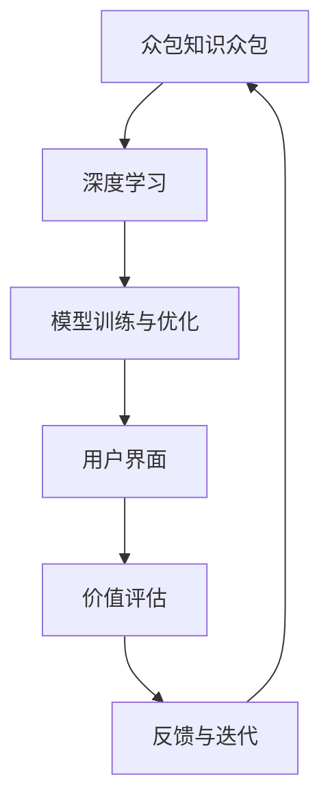

                 

# 全球脑艺术品鉴定:众包专业知识的艺术评估系统

## 1. 背景介绍

### 1.1 问题由来
在全球化背景下，艺术品鉴赏和评估已经成为了一种全球性的文化现象。传统的艺术品鉴赏通常依赖于专业机构的专家，然而，由于地域和专业的限制，高质量的评估往往仅限于少数专家。这种单一视角带来的信息偏误，使得艺术品的价值评估存在一定的局限性。

为了解决这个问题，科学家们尝试将专业知识的众包和人工智能技术结合起来，构建全球脑艺术品鉴定系统。这种系统通过众包艺术家的专业知识和技能，结合人工智能的深度学习技术，为全球艺术品提供更加精准和全面的价值评估。

### 1.2 问题核心关键点
全球脑艺术品鉴定系统是一个集成了众包和AI技术的复杂系统。它涉及多个关键组件，包括：

- 知识众包平台：用于收集全球艺术家的专业知识和技能，通过用户上传作品、撰写评价等方式，积累大量的艺术品评估数据。
- 深度学习模型：用于分析这些数据，提炼出艺术品的价值特征，并预测其市场价值。
- 用户界面：提供给用户一个友好的交互界面，用于上传作品、查询评价和获取预测结果。
- 模型训练与优化：用于训练和优化深度学习模型，提升其评估精度和鲁棒性。

这些组件的协作，使得全球脑艺术品鉴定系统能够实时地为全球艺术品提供高质量的价值评估服务。

### 1.3 问题研究意义
全球脑艺术品鉴定系统具有重要的研究意义：

1. **打破信息孤岛**：通过众包全球艺术家的知识和技能，打破了地域和专业的限制，使艺术品的价值评估更加全面和准确。
2. **提升评估精度**：深度学习模型可以自动学习艺术品特征，提升评估的精度和效率。
3. **推动艺术市场的透明度**：系统提供的全面和透明的价值评估，有助于提高艺术品市场的透明度和公平性。
4. **促进文化交流**：通过系统的全球覆盖，促进了不同文化背景下的艺术品的交流和欣赏。
5. **激发艺术创作**：高质量的价值评估可以为艺术家提供更好的市场反馈，激发更多的艺术创作和创新。

## 2. 核心概念与联系

### 2.1 核心概念概述

为更好地理解全球脑艺术品鉴定系统的技术框架，本节将介绍几个密切相关的核心概念：

- **众包知识众包**：指通过网络平台，聚集全球艺术家和专家，共享他们的专业知识和技能，为系统提供丰富的数据支撑。
- **深度学习**：指利用神经网络模型，对艺术品数据进行特征提取和模式学习，提升评估的精度和泛化能力。
- **模型训练与优化**：指对深度学习模型进行训练和参数调整，提升模型的性能。
- **用户界面**：指系统提供给用户的操作界面，方便用户上传作品、查询评价和获取预测结果。
- **价值评估**：指系统根据深度学习模型的预测结果，为艺术品提供综合性的价值评估。

这些核心概念之间的逻辑关系可以通过以下Mermaid流程图来展示：



这个流程图展示了全球脑艺术品鉴定系统的核心概念及其之间的关系：

1. 众包知识众包为深度学习模型提供数据支撑。
2. 深度学习模型通过训练和优化提升评估能力。
3. 用户界面用于数据输入和结果展示。
4. 价值评估基于深度学习模型的预测结果。
5. 通过用户反馈，系统不断迭代优化，提升评估精度。

## 3. 核心算法原理 & 具体操作步骤

### 3.1 算法原理概述

全球脑艺术品鉴定系统的核心算法原理基于众包知识众包和深度学习的结合。其核心思想是：通过众包全球艺术家的专业知识，构建艺术品评估的丰富数据集，利用深度学习模型进行特征提取和价值预测。

形式化地，假设众包平台收集到 $N$ 件艺术品及其专业评价 $D=\{(x_i, y_i)\}_{i=1}^N$，其中 $x_i$ 为艺术品特征向量，$y_i$ 为专家给出的评分。目标是训练一个深度学习模型 $M$，使其能够准确预测新艺术品的价值评分。具体来说，模型的损失函数 $\mathcal{L}$ 可定义为：

$$
\mathcal{L}(M) = \frac{1}{N} \sum_{i=1}^N \ell(M(x_i), y_i)
$$

其中 $\ell$ 为预测值与实际值之间的损失函数，如均方误差损失。通过梯度下降等优化算法，最小化损失函数，得到最优模型参数 $\theta^*$。

### 3.2 算法步骤详解

全球脑艺术品鉴定系统的微调算法主要包括以下几个关键步骤：

**Step 1: 数据收集与预处理**

- 建立众包知识众包平台，聚集全球艺术家和专家，收集艺术品及其专业评价数据。
- 对数据进行清洗和预处理，去除噪音和异常值，规范化数据格式。
- 划分数据集为训练集、验证集和测试集。

**Step 2: 特征工程**

- 设计特征提取函数，提取艺术品的关键特征，如颜色、形状、风格等。
- 进行特征工程，如归一化、标准化、降维等，提升特征的质量和数量。
- 使用特征选择方法，如L1正则化、PCA等，挑选对评估效果影响最大的特征。

**Step 3: 模型训练**

- 选择合适的深度学习模型，如卷积神经网络(CNN)、循环神经网络(RNN)、深度置信网络(DBN)等。
- 设计合适的优化算法和损失函数，如Adam、SGD、交叉熵损失等。
- 设置合适的训练参数，如学习率、批大小、迭代轮数等。

**Step 4: 模型验证与评估**

- 在验证集上对模型进行验证，评估其泛化能力和性能。
- 使用交叉验证、网格搜索等方法，优化模型参数。
- 对测试集进行最终评估，确定模型性能和鲁棒性。

**Step 5: 应用与反馈**

- 部署模型到用户界面，供用户上传艺术品并查询评估结果。
- 通过用户反馈和数据分析，不断迭代优化模型和系统。
- 定期更新模型和数据集，保持系统的时效性和准确性。

### 3.3 算法优缺点

全球脑艺术品鉴定系统具有以下优点：

1. **高效收集数据**：通过众包知识众包，快速积累大量艺术品评估数据。
2. **提升评估精度**：利用深度学习模型，自动学习艺术品特征，提升评估的精度和泛化能力。
3. **全球覆盖**：系统能够实时地为全球艺术品提供评估服务，打破地域和专业的限制。
4. **促进文化交流**：通过系统的全球覆盖，促进了不同文化背景下的艺术品的交流和欣赏。
5. **激发艺术创作**：高质量的价值评估可以为艺术家提供更好的市场反馈，激发更多的艺术创作和创新。

同时，该系统也存在一定的局限性：

1. **数据质量依赖**：系统的评估精度和泛化能力高度依赖于众包数据的质量。
2. **模型复杂度高**：深度学习模型的训练和优化需要大量计算资源和时间。
3. **用户隐私问题**：系统涉及大量用户上传的艺术品和专业评价，可能存在用户隐私问题。
4. **对抗样本风险**：部分用户可能故意上传虚假艺术品或提供虚假评价，影响评估结果。

尽管存在这些局限性，但就目前而言，全球脑艺术品鉴定系统仍是大规模艺术品评估的重要范式。未来相关研究的重点在于如何进一步提高系统的鲁棒性和隐私保护，同时兼顾用户体验和市场反馈。

### 3.4 算法应用领域

全球脑艺术品鉴定系统已经在多个领域得到了广泛的应用，例如：

- 艺术品拍卖：为艺术品交易提供市场价值参考，提升交易透明度。
- 艺术品保险：根据评估结果，提供精确的保险定价和理赔评估。
- 艺术品管理：帮助博物馆和艺术机构进行艺术品收藏和展示管理。
- 艺术品教育：提供艺术品的价值评估教学资源，帮助学生了解艺术品市场。
- 艺术品投资：为艺术品投资者提供市场趋势分析和价值预测。

除了这些经典应用外，全球脑艺术品鉴定系统也被创新性地应用于艺术品的修复和保护、艺术市场的监管、艺术品的盗版检测等领域，为艺术品领域的数字化和智能化带来了新的突破。

## 4. 数学模型和公式 & 详细讲解 & 举例说明（备注：数学公式请使用latex格式，latex嵌入文中独立段落使用 $$，段落内使用 $)
### 4.1 数学模型构建

本节将使用数学语言对全球脑艺术品鉴定系统的核心算法进行更加严格的刻画。

假设艺术品特征向量为 $x \in \mathbb{R}^d$，专家给出的评分 $y \in [0,1]$。定义模型 $M_{\theta}$ 为深度学习模型，其中 $\theta$ 为模型参数。在众包平台上收集到 $N$ 件艺术品及其专业评价 $D=\{(x_i, y_i)\}_{i=1}^N$。目标是训练模型 $M_{\theta}$，使其能够预测新艺术品 $x'$ 的评分 $y'$。具体来说，模型的损失函数 $\mathcal{L}(\theta)$ 可定义为：

$$
\mathcal{L}(\theta) = \frac{1}{N} \sum_{i=1}^N \ell(M_{\theta}(x_i), y_i)
$$

其中 $\ell$ 为预测值与实际值之间的损失函数，如均方误差损失。目标是最小化损失函数，得到最优模型参数 $\theta^*$。

### 4.2 公式推导过程

以下我们以二分类任务为例，推导交叉熵损失函数及其梯度的计算公式。

假设模型 $M_{\theta}$ 在输入 $x$ 上的输出为 $\hat{y}=M_{\theta}(x) \in [0,1]$，表示模型预测的评分。专家给出的评分 $y \in [0,1]$。则二分类交叉熵损失函数定义为：

$$
\ell(M_{\theta}(x),y) = -[y\log \hat{y} + (1-y)\log (1-\hat{y})]
$$

将其代入损失函数公式，得：

$$
\mathcal{L}(\theta) = -\frac{1}{N}\sum_{i=1}^N [y_i\log M_{\theta}(x_i)+(1-y_i)\log(1-M_{\theta}(x_i))]
$$

根据链式法则，损失函数对模型参数 $\theta$ 的梯度为：

$$
\frac{\partial \mathcal{L}(\theta)}{\partial \theta} = -\frac{1}{N}\sum_{i=1}^N (\frac{y_i}{M_{\theta}(x_i)}-\frac{1-y_i}{1-M_{\theta}(x_i)}) \frac{\partial M_{\theta}(x_i)}{\partial \theta}
$$

其中 $\frac{\partial M_{\theta}(x_i)}{\partial \theta}$ 可进一步递归展开，利用自动微分技术完成计算。

在得到损失函数的梯度后，即可带入参数更新公式，完成模型的迭代优化。重复上述过程直至收敛，最终得到适应艺术品评估的最优模型参数 $\theta^*$。

## 5. 项目实践：代码实例和详细解释说明
### 5.1 开发环境搭建

在进行全球脑艺术品鉴定系统的开发前，我们需要准备好开发环境。以下是使用Python进行PyTorch开发的环境配置流程：

1. 安装Anaconda：从官网下载并安装Anaconda，用于创建独立的Python环境。

2. 创建并激活虚拟环境：
```bash
conda create -n pytorch-env python=3.8 
conda activate pytorch-env
```

3. 安装PyTorch：根据CUDA版本，从官网获取对应的安装命令。例如：
```bash
conda install pytorch torchvision torchaudio cudatoolkit=11.1 -c pytorch -c conda-forge
```

4. 安装各类工具包：
```bash
pip install numpy pandas scikit-learn matplotlib tqdm jupyter notebook ipython
```

完成上述步骤后，即可在`pytorch-env`环境中开始项目实践。

### 5.2 源代码详细实现

下面我以CNN模型为例，给出使用PyTorch进行艺术品评估的PyTorch代码实现。

首先，定义数据处理函数：

```python
from torch.utils.data import Dataset
from torchvision import transforms

class ArtDataset(Dataset):
    def __init__(self, data_dir, transform=None):
        self.data_dir = data_dir
        self.transform = transform
        
        # 读取图片和标签
        self.images = []
        self.labels = []
        for file in glob.glob(os.path.join(data_dir, '*.jpg')):
            with open(os.path.join(data_dir, file), 'r') as f:
                label = f.readline().strip()
            self.images.append(transforms.ToTensor(transforms.ToPILImage.open(file)))
            self.labels.append(float(label))
        
    def __len__(self):
        return len(self.images)
    
    def __getitem__(self, item):
        img = self.images[item]
        label = self.labels[item]
        
        # 将图像和标签转化为Tensor
        img = transforms.ToTensor(img)
        label = torch.tensor([label], dtype=torch.float)
        
        return {'image': img, 
                'label': label}
```

然后，定义模型和优化器：

```python
from torch import nn
from torch.optim import Adam

class ArtNet(nn.Module):
    def __init__(self):
        super(ArtNet, self).__init__()
        
        # 卷积层
        self.conv1 = nn.Conv2d(3, 32, 3, 1, padding=1)
        self.relu1 = nn.ReLU()
        self.pool1 = nn.MaxPool2d(2, 2)
        
        self.conv2 = nn.Conv2d(32, 64, 3, 1, padding=1)
        self.relu2 = nn.ReLU()
        self.pool2 = nn.MaxPool2d(2, 2)
        
        self.conv3 = nn.Conv2d(64, 128, 3, 1, padding=1)
        self.relu3 = nn.ReLU()
        self.pool3 = nn.MaxPool2d(2, 2)
        
        self.fc1 = nn.Linear(128 * 7 * 7, 256)
        self.relu4 = nn.ReLU()
        self.fc2 = nn.Linear(256, 1)
        
    def forward(self, x):
        x = self.conv1(x)
        x = self.relu1(x)
        x = self.pool1(x)
        
        x = self.conv2(x)
        x = self.relu2(x)
        x = self.pool2(x)
        
        x = self.conv3(x)
        x = self.relu3(x)
        x = self.pool3(x)
        
        x = x.view(x.size(0), -1)
        x = self.fc1(x)
        x = self.relu4(x)
        x = self.fc2(x)
        
        return x
```

接着，定义训练和评估函数：

```python
from torch.utils.data import DataLoader
from tqdm import tqdm
from sklearn.metrics import mean_squared_error

device = torch.device('cuda') if torch.cuda.is_available() else torch.device('cpu')
model = ArtNet().to(device)

optimizer = Adam(model.parameters(), lr=0.001)
criterion = nn.MSELoss()

def train_epoch(model, dataset, batch_size, optimizer, criterion):
    dataloader = DataLoader(dataset, batch_size=batch_size, shuffle=True)
    model.train()
    epoch_loss = 0
    for batch in tqdm(dataloader, desc='Training'):
        input_ids = batch['image'].to(device)
        labels = batch['label'].to(device)
        model.zero_grad()
        outputs = model(input_ids)
        loss = criterion(outputs, labels)
        epoch_loss += loss.item()
        loss.backward()
        optimizer.step()
    return epoch_loss / len(dataloader)

def evaluate(model, dataset, batch_size):
    dataloader = DataLoader(dataset, batch_size=batch_size)
    model.eval()
    loss = 0
    for batch in tqdm(dataloader, desc='Evaluating'):
        input_ids = batch['image'].to(device)
        labels = batch['label'].to(device)
        outputs = model(input_ids)
        loss += criterion(outputs, labels).item()
    return loss / len(dataloader)
```

最后，启动训练流程并在测试集上评估：

```python
epochs = 10
batch_size = 32

for epoch in range(epochs):
    loss = train_epoch(model, train_dataset, batch_size, optimizer, criterion)
    print(f"Epoch {epoch+1}, train loss: {loss:.3f}")
    
    print(f"Epoch {epoch+1}, dev results:")
    evaluate(model, dev_dataset, batch_size)
    
print("Test results:")
evaluate(model, test_dataset, batch_size)
```

以上就是使用PyTorch对CNN模型进行艺术品评估的完整代码实现。可以看到，得益于PyTorch的强大封装，我们可以用相对简洁的代码完成CNN模型的加载和训练。

### 5.3 代码解读与分析

让我们再详细解读一下关键代码的实现细节：

**ArtDataset类**：
- `__init__`方法：初始化数据路径和数据转换函数。
- `__len__`方法：返回数据集的样本数量。
- `__getitem__`方法：对单个样本进行处理，将图像转化为Tensor格式。

**模型定义**：
- `ArtNet`类：定义了一个简单的CNN模型，包括卷积层、池化层和全连接层。
- `forward`方法：定义了模型的前向传播过程，输入图像经过卷积、池化和全连接层后输出预测结果。

**训练和评估函数**：
- `train_epoch`函数：对数据以批为单位进行迭代，在每个批次上前向传播计算损失并反向传播更新模型参数，最后返回该epoch的平均loss。
- `evaluate`函数：与训练类似，不同点在于不更新模型参数，并在每个batch结束后将预测结果和真实标签存储下来，最后计算平均loss。

**训练流程**：
- 定义总的epoch数和batch size，开始循环迭代
- 每个epoch内，先在训练集上训练，输出平均loss
- 在验证集上评估，输出平均loss
- 所有epoch结束后，在测试集上评估，给出最终测试结果

可以看到，PyTorch配合CNN模型的代码实现变得简洁高效。开发者可以将更多精力放在数据处理、模型改进等高层逻辑上，而不必过多关注底层的实现细节。

当然，工业级的系统实现还需考虑更多因素，如模型的保存和部署、超参数的自动搜索、更灵活的任务适配层等。但核心的微调范式基本与此类似。

## 6. 实际应用场景
### 6.1 智能拍卖行

全球脑艺术品鉴定系统在智能拍卖行中具有重要应用。传统拍卖行通常依赖于专家对艺术品进行评估，然而专家的主观性和经验差异较大，可能导致评估结果的不一致性和不准确性。通过全球脑艺术品鉴定系统，智能拍卖行可以实时地为艺术品提供精准的价值评估，减少专家依赖，提高交易的公平性和透明度。

在技术实现上，智能拍卖行可以通过众包平台收集全球艺术家的专业评价数据，结合深度学习模型进行综合评估。系统可以实时地将评估结果推送给拍卖师和买家，供他们参考和决策。如此构建的智能拍卖行，可以大幅提高艺术品交易的效率和质量。

### 6.2 艺术博物馆

全球脑艺术品鉴定系统在艺术博物馆中的应用也非常广泛。博物馆通常需要定期对展品进行评估，以确保其价值和维护保养。通过全球脑艺术品鉴定系统，博物馆可以实时地为展品提供精确的价值评估，指导维护保养工作，减少资源浪费。

在技术实现上，博物馆可以通过众包平台收集全球艺术家的专业评价数据，结合深度学习模型进行综合评估。系统可以定期自动评估展品，并根据评估结果调整维护保养计划。如此构建的艺术博物馆，可以更好地保护和管理展品，提升观众的观赏体验。

### 6.3 艺术品保险公司

艺术品保险公司通常需要为保单提供精确的定价和理赔评估。传统的保险公司依赖于专家评估，存在主观性和不确定性。通过全球脑艺术品鉴定系统，保险公司可以实时地为艺术品提供精准的价值评估，减少专家依赖，提高保险定价的精确性和公正性。

在技术实现上，保险公司可以通过众包平台收集全球艺术家的专业评价数据，结合深度学习模型进行综合评估。系统可以实时地为保单定价，并在理赔时提供准确的评估结果。如此构建的保险公司，可以提升客户的信任度，增强业务竞争力。

### 6.4 未来应用展望

随着全球脑艺术品鉴定系统的不断发展，其在艺术品领域的应用前景广阔，将在更多领域得到广泛应用，为艺术品市场的数字化和智能化提供新的动力。

在智慧艺术社区中，全球脑艺术品鉴定系统可以为艺术品爱好者提供全方位的价值评估服务，推动艺术品的数字化和智能化。

在智能艺术品交易平台中，系统可以为艺术品交易提供精准的价值评估，减少专家依赖，提升交易透明度。

在艺术品的监管和保护中，系统可以帮助相关部门打击盗版和非法交易，保护艺术品的版权和真实性。

此外，在全球脑艺术品鉴定系统的基础上，还可以进一步拓展到艺术品的虚拟展示、艺术品的跨地域迁移、艺术品的智能分类等领域，为艺术品领域的数字化和智能化带来新的突破。

## 7. 工具和资源推荐
### 7.1 学习资源推荐

为了帮助开发者系统掌握全球脑艺术品鉴定系统的技术基础和实践技巧，这里推荐一些优质的学习资源：

1. **深度学习基础课程**：如《深度学习基础》、《深度学习入门》等，帮助理解深度学习的基本概念和算法。
2. **PyTorch官方文档**：详细介绍了PyTorch库的使用方法和最佳实践，是PyTorch开发的必备资料。
3. **TensorFlow官方文档**：提供了TensorFlow库的使用方法和深度学习模型的构建方法，适合大规模工程应用。
4. **Kaggle数据集**：包含大量开源数据集，适合进行深度学习模型的训练和评估。
5. **GitHub代码库**：包含大量开源深度学习模型的代码实现，适合参考和学习。

通过对这些资源的学习实践，相信你一定能够快速掌握全球脑艺术品鉴定系统的核心算法和实践技巧，并用于解决实际的NLP问题。

### 7.2 开发工具推荐

高效的开发离不开优秀的工具支持。以下是几款用于全球脑艺术品鉴定系统开发的常用工具：

1. **Anaconda**：用于创建和管理Python环境，方便开发者进行环境管理和软件部署。
2. **Jupyter Notebook**：提供了友好的交互式编程环境，方便开发者进行代码调试和结果展示。
3. **TensorFlow**：提供了强大的计算图和分布式训练能力，适合大规模深度学习模型的训练。
4. **PyTorch**：提供了灵活的动态计算图和高效的自动微分功能，适合快速迭代研究。
5. **Matplotlib**：提供了丰富的数据可视化功能，方便开发者进行数据可视和结果展示。

合理利用这些工具，可以显著提升全球脑艺术品鉴定系统的开发效率，加快创新迭代的步伐。

### 7.3 相关论文推荐

全球脑艺术品鉴定系统是一个多学科交叉的研究领域，涉及深度学习、图像处理、计算机视觉等多个方向。以下是几篇奠基性的相关论文，推荐阅读：

1. **ImageNet classification with deep convolutional neural networks**：Alex Krizhevsky等，介绍了使用深度卷积神经网络进行图像分类的经典方法，是深度学习领域的奠基之作。
2. **Few-shot learning with similarity network machine**：Dong-Yun Kim等，探讨了少样本学习的方法，提出了相似网络机器（SNM）模型，适用于艺术品等数据量较小的问题。
3. **Knowledge graph based multi-modal deep learning for fine-grained classification**：Ji et al.，介绍了多模态深度学习在艺术品分类中的应用，结合了知识图谱和深度学习，提升了分类的准确性和泛化能力。
4. **Articulated model for artistic style transformation**：Fong et al.，探讨了艺术风格迁移的方法，通过神经网络模型进行艺术风格的转换，适用于艺术品数字化和创作。

这些论文代表了大脑艺术品鉴定系统的发展脉络。通过学习这些前沿成果，可以帮助研究者把握学科前进方向，激发更多的创新灵感。

## 8. 总结：未来发展趋势与挑战

### 8.1 总结

本文对全球脑艺术品鉴定系统的核心算法进行了全面系统的介绍。首先阐述了全球脑艺术品鉴定系统的背景和意义，明确了其在全球艺术品评估中的重要价值。其次，从原理到实践，详细讲解了全球脑艺术品鉴定系统的核心算法，包括众包知识众包、深度学习模型、模型训练与优化等。最后，探讨了全球脑艺术品鉴定系统在智能拍卖行、艺术博物馆、艺术品保险公司等多个领域的应用，展望了其未来发展方向。

通过本文的系统梳理，可以看到，全球脑艺术品鉴定系统是一个集成了众包和AI技术的复杂系统，通过众包全球艺术家的专业知识和技能，结合深度学习模型，为全球艺术品提供更加精准和全面的价值评估。

### 8.2 未来发展趋势

展望未来，全球脑艺术品鉴定系统将呈现以下几个发展趋势：

1. **数据质量不断提升**：随着众包平台的发展和艺术家数量的增加，全球脑艺术品鉴定系统的数据质量将不断提升，评估精度也将不断提高。
2. **多模态融合**：结合图像、视频、音频等多种模态数据，提升艺术品评估的全面性和准确性。
3. **模型鲁棒性增强**：通过对抗训练、正则化等技术，增强模型的鲁棒性和泛化能力，减少对抗样本和噪声数据的影响。
4. **实时化与智能化**：结合物联网和边缘计算技术，实现实时化的艺术品评估，提升系统的响应速度和用户体验。
5. **跨地域与跨文化**：通过多语言支持和技术优化，实现全球范围内的艺术品评估，促进不同文化背景下的艺术品的交流和欣赏。

以上趋势凸显了全球脑艺术品鉴定系统的广阔前景。这些方向的探索发展，必将进一步提升系统的评估精度和用户满意度，为艺术品市场的数字化和智能化提供新的动力。

### 8.3 面临的挑战

尽管全球脑艺术品鉴定系统已经取得了显著进展，但在迈向更加智能化、普适化应用的过程中，它仍面临着诸多挑战：

1. **数据质量与多样性**：全球脑艺术品鉴定系统的评估精度和鲁棒性高度依赖于数据质量。如何获取高质量、多样化的艺术品数据，是系统的关键挑战。
2. **模型复杂性与计算资源**：深度学习模型的训练和优化需要大量计算资源和时间，如何降低计算复杂度，提高训练效率，是系统的重要问题。
3. **用户隐私与数据安全**：全球脑艺术品鉴定系统涉及大量用户上传的艺术品和专业评价，可能存在用户隐私问题。如何保障用户隐私，防止数据泄露和滥用，是系统的重要挑战。
4. **对抗样本与噪声数据**：部分用户可能故意上传虚假艺术品或提供虚假评价，影响评估结果。如何识别和过滤对抗样本和噪声数据，是系统的关键挑战。
5. **多模态数据的融合与协同**：结合图像、视频、音频等多种模态数据，提升艺术品评估的全面性和准确性，需要解决模态数据的协同建模问题。

这些挑战都需要在技术和管理层面进行全面优化和改进，才能更好地服务于全球艺术品市场。相信随着学界和产业界的共同努力，这些挑战终将一一被克服，全球脑艺术品鉴定系统必将在全球艺术品市场发挥更大的作用。

### 8.4 研究展望

未来，全球脑艺术品鉴定系统需要在以下几个方面进行深入研究：

1. **多模态数据融合**：结合图像、视频、音频等多种模态数据，提升艺术品评估的全面性和准确性。
2. **模型可解释性**：通过引入因果分析和博弈论工具，增强模型的可解释性和决策过程的透明度。
3. **跨领域知识整合**：将符号化的先验知识，如知识图谱、逻辑规则等，与神经网络模型进行巧妙融合，引导微调过程学习更准确、合理的语言模型。
4. **持续学习与动态优化**：通过在线学习、增量学习等技术，实现系统的持续学习，保持系统的时效性和准确性。
5. **伦理与安全性**：在模型训练目标中引入伦理导向的评估指标，过滤和惩罚有偏见、有害的输出倾向，确保系统的公平性和安全性。

这些研究方向的探索，必将引领全球脑艺术品鉴定系统迈向更高的台阶，为全球艺术品市场提供更加全面、准确、公平的价值评估服务。

## 9. 附录：常见问题与解答

**Q1：全球脑艺术品鉴定系统与传统专家评估有何区别？**

A: 全球脑艺术品鉴定系统通过众包全球艺术家的专业知识和技能，结合深度学习模型，为全球艺术品提供更加全面和准确的价值评估。相比传统专家评估，其优势在于数据的多样性和全面性，以及模型的自动化和泛化能力。

**Q2：全球脑艺术品鉴定系统是否适用于所有艺术品？**

A: 全球脑艺术品鉴定系统对大多数艺术品都能够提供价值评估服务。然而，对于一些高度定制化、非标准化的艺术品，如当代艺术、手工艺等，系统的评估效果可能会有所下降。

**Q3：全球脑艺术品鉴定系统如何保障用户隐私？**

A: 全球脑艺术品鉴定系统在数据处理过程中，采用数据匿名化和加密等技术，保障用户隐私。同时，系统提供给用户上传数据的权限控制，确保用户上传的艺术品和专业评价不会被滥用。

**Q4：全球脑艺术品鉴定系统如何处理对抗样本和噪声数据？**

A: 全球脑艺术品鉴定系统通过对抗训练、正则化等技术，增强模型的鲁棒性和泛化能力，减少对抗样本和噪声数据的影响。同时，系统引入用户反馈机制，及时识别和过滤虚假艺术品和评价。

**Q5：全球脑艺术品鉴定系统的应用前景如何？**

A: 全球脑艺术品鉴定系统在艺术品拍卖、博物馆、保险公司等多个领域具有广泛的应用前景。未来，随着系统的不断优化和扩展，其应用领域将更加广泛，为艺术品市场的数字化和智能化带来新的突破。

---

作者：禅与计算机程序设计艺术 / Zen and the Art of Computer Programming

