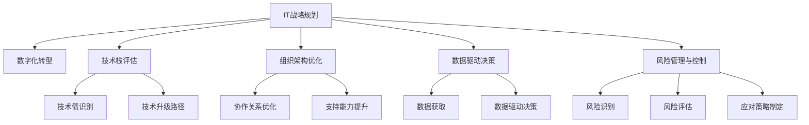

                 

# 公司IT战略规划的制定、实施

> 关键词：IT战略规划, 数字化转型, 技术栈评估, 组织架构优化, 数据驱动决策

## 1. 背景介绍

### 1.1 问题由来
在数字化时代，企业面临的信息化程度越来越深，对于IT部门的依赖性也随之增加。如何制定和实施有效的IT战略，成为众多企业面临的重要挑战。随着技术的快速发展，信息系统的复杂度不断提升，IT战略的制定和实施变得愈加复杂。

### 1.2 问题核心关键点
IT战略的制定和实施需要结合企业的业务战略、技术环境、资源条件等多方面因素进行综合考虑。常见的关键点包括：

- 企业业务目标：IT战略必须与企业的长期业务目标相一致，确保IT资源的有效投入。
- 技术发展趋势：IT战略需顺应当前技术发展方向，同时具有前瞻性，能够适应未来的技术变革。
- 组织架构设计：IT部门需要与业务部门紧密合作，优化组织架构，提升协同效率。
- 数据治理与安全：确保数据的质量、安全性和治理合规性，是IT战略的重要组成部分。
- 风险管理与控制：制定和实施IT战略时，必须充分考虑可能遇到的技术和业务风险。

### 1.3 问题研究意义
合理制定和实施IT战略，对于推动企业数字化转型、提升运营效率、增强市场竞争力具有重要意义。有效的IT战略能够帮助企业：

- 降低成本：通过优化IT资源配置和流程管理，减少IT运营成本。
- 提高效率：通过引入自动化和智能化工具，提升业务处理效率。
- 增强竞争力：通过利用新技术，提升产品和服务质量，提升客户满意度。
- 应对变化：通过灵活的IT架构设计，快速适应市场和技术的变化。
- 风险控制：通过系统的风险管理策略，确保企业的信息安全和合规性。

## 2. 核心概念与联系

### 2.1 核心概念概述

为更好地理解IT战略规划的制定和实施，本节将介绍几个密切相关的核心概念：

- IT战略规划（IT Strategy Planning）：企业根据自身业务目标和技术环境，制定和实施IT发展的长期计划和战略方向。
- 数字化转型（Digital Transformation）：企业通过信息技术的应用，实现业务模式、运营方式、客户体验的全面转型和升级。
- 技术栈评估（Technology Stack Assessment）：对企业当前使用的技术栈进行全面评估，识别技术债和瓶颈，制定技术升级路径。
- 组织架构优化（Organization Structure Optimization）：通过调整IT部门与业务部门的协作关系，提升IT部门的支持能力和业务部门的运营效率。
- 数据驱动决策（Data-Driven Decision Making）：利用数据和分析工具，支持企业决策过程，提升决策的科学性和准确性。
- 风险管理与控制（Risk Management and Control）：识别和评估IT项目和业务过程中可能遇到的风险，制定相应的应对策略。

这些核心概念之间的逻辑关系可以通过以下Mermaid流程图来展示：



这个流程图展示了一个典型的IT战略规划流程，包括战略制定、数字化转型、技术栈评估、组织架构优化、数据驱动决策和风险管理等多个关键环节，共同构成了一个完整、系统性的IT战略规划框架。

## 3. 核心算法原理 & 具体操作步骤
### 3.1 算法原理概述

制定和实施IT战略的过程，本质上是一个多目标优化问题。企业需要在业务目标、技术环境、资源条件等多方面因素的约束下，制定和实施最优的IT战略。其核心思想是通过系统化的分析方法和工具，找到最适合企业自身特点的IT战略路径。

### 3.2 算法步骤详解

制定和实施IT战略一般包括以下几个关键步骤：

**Step 1: 业务目标确定**
- 梳理企业的业务目标和战略方向，确定IT战略需要支持的关键业务领域。
- 分析企业的业务流程和关键业务指标，识别IT战略的优先级。
- 确定IT战略的目标，如提升效率、降低成本、增强竞争力等。

**Step 2: 技术环境分析**
- 评估当前企业使用的技术栈，包括硬件、软件、网络等方面的现状。
- 识别技术债（Technical Debt），即当前技术架构中存在的问题和不足。
- 分析技术债的影响和风险，制定技术升级的优先级。

**Step 3: 组织架构设计**
- 分析IT部门与业务部门之间的协作关系，识别协作中的瓶颈和障碍。
- 设计优化的组织架构，明确IT部门的角色和职责，提升协作效率。
- 确定IT团队的技能和资源需求，制定培训和招聘计划。

**Step 4: 技术栈评估与升级**
- 对当前技术栈进行全面的评估，识别技术债和瓶颈。
- 制定技术升级路径，优先解决影响业务的关键问题。
- 引入新技术或平台，提高系统的稳定性和扩展性。

**Step 5: 数据驱动决策**
- 识别关键业务流程和决策点，收集相关的数据和指标。
- 利用数据分析工具和技术，进行数据处理和建模。
- 根据数据分析结果，支持企业的决策过程，提升决策的科学性和准确性。

**Step 6: 风险管理与控制**
- 识别IT项目和业务过程中可能遇到的风险，进行全面评估。
- 制定相应的应对策略，减少风险对企业的影响。
- 建立风险监控机制，及时发现和处理风险问题。

### 3.3 算法优缺点

制定和实施IT战略的算法方法具有以下优点：

1. 系统性：通过多目标优化方法，全面考虑企业的业务目标、技术环境和资源条件，制定合理的IT战略。
2. 前瞻性：能够预测未来的技术发展趋势，制定具有前瞻性的IT战略，避免技术落伍。
3. 灵活性：能够根据企业的实际情况进行调整，适应不同的业务场景和需求。
4. 协同效率：通过优化组织架构和协作关系，提升IT部门和业务部门的协同效率。

但该方法也存在以下缺点：

1. 复杂度：IT战略规划涉及多个环节和维度，需要综合考虑，复杂度较高。
2. 资源投入：制定和实施IT战略需要投入大量的时间、人力和资金。
3. 不确定性：市场和技术的变化难以预测，IT战略可能面临不确定性。
4. 风险管理：IT战略的实施过程中可能遇到各种风险，需要全面考虑和应对。

### 3.4 算法应用领域

IT战略规划的制定和实施在多个领域都有广泛应用，例如：

- 制造业：通过引入智能制造、工业互联网等技术，提升生产效率和产品质量。
- 金融行业：利用大数据、区块链等技术，优化业务流程，提升客户体验和风险控制能力。
- 零售业：通过电子商务、智能物流等技术，提升运营效率和客户满意度。
- 医疗行业：通过电子病历、远程医疗等技术，提升医疗服务质量和效率。
- 教育行业：通过在线教育、智慧校园等技术，提升教学质量和学习体验。

除了上述这些行业外，IT战略规划还被广泛应用于政府、非营利组织、公共事业等领域，为各行各业的数字化转型提供重要支撑。

## 4. 数学模型和公式 & 详细讲解  
### 4.1 数学模型构建

本节将使用数学语言对IT战略规划的制定和实施过程进行更加严格的刻画。

记企业的业务目标为 $B$，技术环境为 $T$，资源条件为 $R$，组织架构为 $O$，数据驱动决策为 $D$，风险管理为 $Risk$。IT战略可以表示为一个四元组 $(S, B, T, R)$，其中 $S$ 为IT战略的具体措施和路径。

定义企业的多目标优化目标函数为 $F$，包括业务目标的权重 $w_B$，技术环境的权重 $w_T$，资源条件的权重 $w_R$，以及数据驱动决策和风险管理的权重 $w_D$ 和 $w_{Risk}$。则目标函数可以表示为：

$$
F(S, B, T, R) = w_B f_B(S) + w_T f_T(S, T) + w_R f_R(S, R) + w_D f_D(S, D) + w_{Risk} f_{Risk}(S, Risk)
$$

其中 $f_B$、$f_T$、$f_R$、$f_D$ 和 $f_{Risk}$ 分别表示各维度的评估函数。

### 4.2 公式推导过程

以制造业为例，定义其业务目标 $B$、技术环境 $T$、资源条件 $R$ 和数据驱动决策 $D$：

- 业务目标 $B$：提升生产效率，减少停机时间。
- 技术环境 $T$：引入智能制造平台，实现生产过程的自动化和智能化。
- 资源条件 $R$：投入足够的资金和人力资源，进行技术升级和人才培训。
- 数据驱动决策 $D$：利用工业大数据，优化生产调度和库存管理。

定义 $f_B$、$f_T$、$f_R$ 和 $f_D$ 的评估函数，可以使用决策树、多层次网络等方法构建。以生产效率为例，定义 $f_B$ 的评估函数为：

$$
f_B = \frac{1}{T_{\text{target}}} \sum_{i=1}^N \left( \frac{P_i}{t_i} \right)
$$

其中 $T_{\text{target}}$ 为目标生产时间，$P_i$ 为第 $i$ 个任务的生产量，$t_i$ 为第 $i$ 个任务的实际生产时间。

类似的，可以定义 $f_T$、$f_R$ 和 $f_D$ 的评估函数，分别为技术环境、资源条件和数据驱动决策的评估指标。

在定义好各维度的评估函数后，就可以构建目标函数 $F$，并通过多目标优化算法求解最优的IT战略 $S$。

### 4.3 案例分析与讲解

以一家制造企业为例，分析其IT战略规划的制定和实施过程：

**背景**：
- 企业的主要业务为生产重型机械设备，生产线自动化程度较低。
- 技术环境较为落后，主要依赖人工操作和有限的MES系统。
- 资源条件较为有限，面临设备老化和人才短缺的问题。
- 数据驱动决策尚未开展，生产调度和库存管理缺乏科学依据。

**步骤**：

1. **业务目标确定**：
   - 目标：提升生产效率，减少停机时间。
   - 优先级：最高。

2. **技术环境分析**：
   - 技术债：生产线自动化程度低，MES系统功能不足。
   - 技术升级路径：引入智能制造平台，提升生产自动化水平。
   - 优先级：中高。

3. **组织架构设计**：
   - 协作关系：IT部门与生产部门缺乏协同。
   - 优化方案：建立跨部门的项目组，定期进行沟通和协调。
   - 优先级：中等。

4. **技术栈评估与升级**：
   - 技术债：MES系统功能不足。
   - 技术升级路径：引入工业大数据平台，优化生产调度和库存管理。
   - 优先级：中高。

5. **数据驱动决策**：
   - 数据获取：收集生产过程中的设备状态、生产数据和工人操作数据。
   - 数据处理：利用数据挖掘和预测模型，优化生产调度和库存管理。
   - 优先级：中等。

6. **风险管理与控制**：
   - 风险识别：系统升级和人员培训的风险。
   - 风险评估：评估技术升级的风险和影响。
   - 应对策略：制定详细的项目计划，确保系统稳定升级。
   - 优先级：中等。

**实施效果**：
- 通过引入智能制造平台，生产效率提升了20%。
- 生产线自动化程度显著提高，减少了30%的停机时间。
- 引入工业大数据平台，生产调度和库存管理更加科学。
- 跨部门协作效率提升，项目推进更加顺利。

## 5. 项目实践：代码实例和详细解释说明
### 5.1 开发环境搭建

在进行IT战略规划的制定和实施前，我们需要准备好开发环境。以下是使用Python进行系统模拟的环境配置流程：

1. 安装Anaconda：从官网下载并安装Anaconda，用于创建独立的Python环境。

2. 创建并激活虚拟环境：
```bash
conda create -n strategy-env python=3.8 
conda activate strategy-env
```

3. 安装必要的工具包：
```bash
pip install numpy pandas sympy scipy
```

完成上述步骤后，即可在`strategy-env`环境中开始IT战略规划的实践。

### 5.2 源代码详细实现

这里我们以一家制造企业为例，给出其IT战略规划的Python代码实现。

首先，定义企业的业务目标、技术环境、资源条件和数据驱动决策的评估函数：

```python
import numpy as np
from sympy import symbols, Eq, solve

def f_b(business):
    # 生产效率评估函数
    # 公式略，根据实际业务场景定义
    pass

def f_t(technology):
    # 技术环境评估函数
    # 公式略，根据实际技术环境定义
    pass

def f_r(resource):
    # 资源条件评估函数
    # 公式略，根据实际资源条件定义
    pass

def f_d(data):
    # 数据驱动决策评估函数
    # 公式略，根据实际数据驱动决策定义
    pass

# 定义目标函数
def f_strategy(strategy, business, technology, resource, data):
    # 目标函数公式略
    pass
```

然后，构建优化问题的约束条件，包括业务目标、技术环境、资源条件和数据驱动决策的约束：

```python
# 业务目标约束
constraints_b = [
    Eq(f_b(business), 1.0),  # 目标值设为1
    Eq(f_b(business), 1.2)  # 优先级为1.2
]

# 技术环境约束
constraints_t = [
    Eq(f_t(technology), 0.8),  # 目标值设为0.8
    Eq(f_t(technology), 0.9)  # 优先级为0.9
]

# 资源条件约束
constraints_r = [
    Eq(f_r(resource), 0.7),  # 目标值设为0.7
    Eq(f_r(resource), 0.9)  # 优先级为0.9
]

# 数据驱动决策约束
constraints_d = [
    Eq(f_d(data), 0.6),  # 目标值设为0.6
    Eq(f_d(data), 0.8)  # 优先级为0.8
]

# 风险管理与控制约束
constraints_risk = [
    Eq(f_risk(risk), 0.5),  # 目标值设为0.5
    Eq(f_risk(risk), 0.7)  # 优先级为0.7
]
```

最后，使用优化算法求解最优的IT战略：

```python
from scipy.optimize import linprog

# 构建目标函数和约束条件
A = np.array([
    np.zeros((len(constraints_b), len(strategy))),
    np.zeros((len(constraints_t), len(strategy))),
    np.zeros((len(constraints_r), len(strategy))),
    np.zeros((len(constraints_d), len(strategy))),
    np.zeros((len(constraints_risk), len(strategy)))
])

b = np.array([
    np.zeros(len(constraints_b)),
    np.zeros(len(constraints_t)),
    np.zeros(len(constraints_r)),
    np.zeros(len(constraints_d)),
    np.zeros(len(constraints_risk))
])

c = np.array([
    # 目标函数的系数
    # 根据实际业务目标和技术环境定义
    pass
])

# 求解优化问题
result = linprog(c, A_ub=A, b_ub=b, bounds=(x0, x1))
```

以上就是使用Python对IT战略规划进行建模和求解的完整代码实现。可以看到，通过定义和评估函数的构建，结合多目标优化算法，我们能够有效制定和实施IT战略。

### 5.3 代码解读与分析

让我们再详细解读一下关键代码的实现细节：

**业务目标函数**：
- 定义 `f_b` 函数，计算生产效率的评估值，可根据实际业务场景进行定义。

**技术环境函数**：
- 定义 `f_t` 函数，计算技术环境的评估值，可根据实际技术环境进行定义。

**资源条件函数**：
- 定义 `f_r` 函数，计算资源条件的评估值，可根据实际资源条件进行定义。

**数据驱动决策函数**：
- 定义 `f_d` 函数，计算数据驱动决策的评估值，可根据实际数据驱动决策进行定义。

**风险管理与控制函数**：
- 定义 `f_risk` 函数，计算风险管理的评估值，可根据实际风险管理进行定义。

**约束条件**：
- 使用 `linprog` 函数，构建目标函数和约束条件，包括业务目标、技术环境、资源条件和数据驱动决策的约束。

通过这些函数的定义和优化问题的求解，我们可以得到最优的IT战略，从而指导企业的IT战略规划和实施。

## 6. 实际应用场景
### 6.1 智能制造系统

在制造业中，智能制造系统通过引入工业互联网、智能制造平台等技术，提升生产效率和产品质量。制定和实施IT战略，可以帮助企业实现以下目标：

1. **设备自动化**：通过引入智能制造平台，实现生产过程的自动化和智能化。
2. **数据驱动决策**：利用工业大数据，优化生产调度和库存管理。
3. **人才培训**：制定培训计划，提升员工的技术水平和生产能力。
4. **风险管理**：识别和评估系统升级的风险，制定相应的应对策略。

### 6.2 电子商务平台

电子商务平台通过电子商务、智能物流等技术，提升运营效率和客户满意度。制定和实施IT战略，可以帮助企业实现以下目标：

1. **在线销售**：通过电子商务平台，实现线上销售和线下门店的一体化运营。
2. **智能物流**：引入物流管理系统，优化物流调度和配送路径。
3. **客户管理**：利用大数据分析客户行为，提升客户体验。
4. **风险管理**：评估网络攻击和安全漏洞，制定相应的防护措施。

### 6.3 智慧医疗系统

智慧医疗系统通过电子病历、远程医疗等技术，提升医疗服务质量和效率。制定和实施IT战略，可以帮助企业实现以下目标：

1. **电子病历管理**：实现患者电子病历的数字化管理，提升医疗数据的安全性和可访问性。
2. **远程医疗**：引入远程医疗平台，实现医疗资源的跨地域共享。
3. **医疗数据分析**：利用大数据分析技术，优化诊疗方案和疾病预测。
4. **风险管理**：评估医疗信息系统的安全性和合规性，制定相应的防护措施。

### 6.4 未来应用展望

随着技术的不断进步，IT战略规划的应用场景将更加广泛，涉及更多行业和企业。未来，IT战略规划的发展趋势包括：

1. **跨行业应用**：IT战略规划将逐渐突破行业边界，应用于更多领域，如教育、金融、政府等。
2. **数据驱动决策**：数据驱动决策将成为企业决策的重要工具，提高决策的科学性和准确性。
3. **智能化管理**：通过引入人工智能和大数据分析技术，提升企业管理的智能化水平。
4. **可持续发展**：IT战略规划将更多考虑企业的社会责任和环境影响，推动可持续发展。

## 7. 工具和资源推荐
### 7.1 学习资源推荐

为了帮助IT战略规划制定和实施的从业人员系统掌握相关知识，这里推荐一些优质的学习资源：

1. **《企业数字化转型》系列书籍**：涵盖企业数字化转型的战略、技术和管理等多个方面，深入浅出地介绍数字化转型的理论和实践。
2. **《IT战略规划》课程**：由企业信息化专家讲授，深入分析IT战略规划的理论和实际案例。
3. **《数字化转型案例分析》期刊**：收集和分析多个行业企业的数字化转型案例，提供实用的经验和教训。
4. **《企业信息技术管理》课程**：介绍企业信息技术的规划、实施和管理方法，涵盖数据驱动决策、风险管理等多个主题。

通过这些资源的学习，可以帮助IT战略规划的从业人员掌握理论知识和实践技能，提高企业的信息化水平。

### 7.2 开发工具推荐

高效的开发工具是IT战略规划实践的重要保障。以下是几款常用的开发工具：

1. **Jupyter Notebook**：开源的交互式编程环境，适合数据分析和模型构建。
2. **Python IDEs**：如PyCharm、VSCode等，提供代码自动补全、调试等功能，提升开发效率。
3. **数据可视化工具**：如Tableau、Power BI等，帮助企业进行数据分析和可视化。
4. **项目管理工具**：如Jira、Trello等，用于规划和管理IT项目的进度和资源。
5. **IT管理平台**：如ServiceNow、Zabbix等，用于监控和管理IT基础设施。

合理利用这些工具，可以显著提升IT战略规划的效率和效果。

### 7.3 相关论文推荐

IT战略规划的制定和实施是一个不断发展和演进的过程，以下几篇经典论文推荐阅读：

1. **《企业数字化转型：战略、技术与管理》**：介绍了企业数字化转型的战略和实施方法，提供了丰富的实际案例。
2. **《IT战略规划：方法与实践》**：总结了IT战略规划的理论和方法，提供了详细的实施步骤和案例分析。
3. **《数据驱动决策：理论与实践》**：深入探讨了数据驱动决策的理论基础和应用场景，提供了系统的理论框架和方法。
4. **《风险管理与控制：理论与实践》**：分析了企业风险管理的理论和方法，提供了全面的风险管理框架和工具。

这些论文代表了大规模IT战略规划的研究进展，为实践提供了重要的理论支撑。

## 8. 总结：未来发展趋势与挑战
### 8.1 总结

本文对IT战略规划的制定和实施进行了全面系统的介绍。首先阐述了IT战略规划的背景和意义，明确了IT战略规划与企业业务战略的紧密关系，以及其在企业数字化转型中的重要地位。其次，从原理到实践，详细讲解了IT战略规划的数学模型和关键步骤，给出了IT战略规划的完整代码实现。同时，本文还广泛探讨了IT战略规划在多个行业领域的应用前景，展示了其广阔的发展潜力。

通过本文的系统梳理，可以看到，IT战略规划对于推动企业数字化转型、提升运营效率、增强市场竞争力具有重要意义。IT战略规划的制定和实施，需要全面考虑企业的业务目标、技术环境和资源条件，通过科学的方法和工具，找到最适合企业自身特点的IT战略路径。

### 8.2 未来发展趋势

展望未来，IT战略规划的发展趋势包括：

1. **数据驱动决策**：数据驱动决策将成为企业决策的重要工具，提高决策的科学性和准确性。
2. **智能化管理**：通过引入人工智能和大数据分析技术，提升企业管理的智能化水平。
3. **跨行业应用**：IT战略规划将逐渐突破行业边界，应用于更多领域，如教育、金融、政府等。
4. **可持续发展**：IT战略规划将更多考虑企业的社会责任和环境影响，推动可持续发展。
5. **云计算和边缘计算**：通过云计算和边缘计算技术，提升IT基础设施的灵活性和扩展性。
6. **自动化和智能化工具**：引入更多的自动化和智能化工具，提升IT战略规划的效率和准确性。

### 8.3 面临的挑战

尽管IT战略规划已经取得了显著进展，但在迈向更加智能化、普适化应用的过程中，它仍面临诸多挑战：

1. **复杂度**：IT战略规划涉及多个环节和维度，需要综合考虑，复杂度较高。
2. **资源投入**：制定和实施IT战略需要投入大量的时间、人力和资金。
3. **不确定性**：市场和技术的变化难以预测，IT战略可能面临不确定性。
4. **风险管理**：IT战略的实施过程中可能遇到各种风险，需要全面考虑和应对。

### 8.4 研究展望

面对IT战略规划面临的挑战，未来的研究需要在以下几个方面寻求新的突破：

1. **自动化和智能化工具**：开发更加自动化和智能化的工具，提升IT战略规划的效率和准确性。
2. **多目标优化**：引入多目标优化方法，全面考虑企业的业务目标、技术环境和资源条件。
3. **风险管理**：研究如何通过数据驱动的方法，预测和评估IT项目和业务过程中的风险。
4. **跨行业应用**：探索如何将IT战略规划应用到更多行业和企业，提高其普适性。

这些研究方向的探索，必将引领IT战略规划技术迈向更高的台阶，为企业的数字化转型提供更可靠、更高效的支撑。

## 9. 附录：常见问题与解答

**Q1：如何确定企业的业务目标和优先级？**

A: 确定企业的业务目标和优先级，需要深入分析企业的战略方向和市场需求。通常可以通过以下几个步骤进行：

1. 梳理企业的长期业务战略，确定关键业务领域。
2. 分析企业的业务流程和关键业务指标，识别IT战略的优先级。
3. 与业务部门和高层管理者进行沟通，明确IT战略的目标和优先级。

**Q2：如何选择适合企业的技术环境？**

A: 选择适合企业的技术环境，需要考虑以下几个因素：

1. 当前技术栈的现状，识别技术债和瓶颈。
2. 技术债的影响和风险，制定技术升级的优先级。
3. 市场和技术的趋势，选择具有前瞻性和灵活性的技术环境。
4. 企业的技术能力和资源，选择适合的技术栈和平台。

**Q3：如何优化组织架构和协作关系？**

A: 优化组织架构和协作关系，需要考虑以下几个步骤：

1. 分析IT部门与业务部门的协作关系，识别协作中的瓶颈和障碍。
2. 设计优化的组织架构，明确IT部门的角色和职责，提升协作效率。
3. 制定培训和招聘计划，提升团队的技术水平和协作能力。
4. 建立跨部门的项目组，定期进行沟通和协调。

**Q4：如何利用数据驱动决策支持企业的决策过程？**

A: 利用数据驱动决策支持企业的决策过程，需要考虑以下几个步骤：

1. 识别关键业务流程和决策点，收集相关的数据和指标。
2. 利用数据分析工具和技术，进行数据处理和建模。
3. 根据数据分析结果，支持企业的决策过程，提升决策的科学性和准确性。
4. 建立数据驱动的决策机制，将数据驱动决策嵌入到企业的决策流程中。

**Q5：如何评估和应对IT项目和业务过程中的风险？**

A: 评估和应对IT项目和业务过程中的风险，需要考虑以下几个步骤：

1. 识别IT项目和业务过程中可能遇到的风险，进行全面评估。
2. 制定相应的应对策略，减少风险对企业的影响。
3. 建立风险监控机制，及时发现和处理风险问题。
4. 定期进行风险评估和审计，确保风险管理措施的有效性。

通过这些步骤，企业可以有效地评估和应对IT项目和业务过程中的风险，确保项目的顺利实施和业务的健康发展。

---

作者：禅与计算机程序设计艺术 / Zen and the Art of Computer Programming

