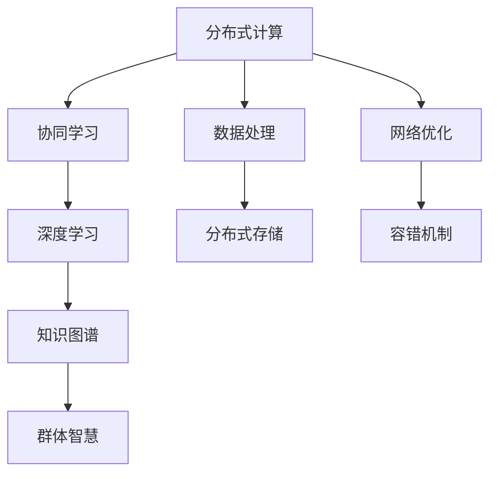

                 

# 分布式认知：探索群体智慧的奥秘

> 关键词：分布式认知,群体智慧,协同学习,知识图谱,深度学习,分布式算法,实时性,可扩展性

## 1. 背景介绍

### 1.1 问题由来
人类在漫长的进化过程中，逐渐发展出了复杂的协作与沟通能力，能够通过群体智慧来应对复杂多变的外部环境。然而，面对快速变化的技术和市场环境，如何高效地利用群体智慧成为了新的研究课题。

近年来，分布式计算和深度学习技术的结合，使得在大型分布式系统中进行协作和学习的可能性大增。这为探索群体智慧提供了新的视角，使我们能够更深入地理解人类社会中的协同与合作现象。

### 1.2 问题核心关键点
分布式认知是一个结合了分布式计算、深度学习、群体智慧等多个学科领域的新兴研究主题。其核心关键点包括：

- **分布式协同学习**：通过大型分布式集群，协同训练深度学习模型，充分利用并行计算的优势。
- **知识图谱融合**：结合分布式计算和知识图谱，将多源异构数据进行融合，提取高价值知识。
- **实时学习与适应**：实时更新模型参数，提高模型的自适应能力，更好地应对动态环境。
- **网络结构优化**：优化分布式网络结构，提升系统的可扩展性和容错性，避免单点故障。

这些关键点共同构成了分布式认知的研究框架，帮助我们在大型系统中高效地利用群体智慧。

## 2. 核心概念与联系

### 2.1 核心概念概述

分布式认知结合了多个学科的技术与方法，构建了一个庞大的研究体系。为了更好地理解这一体系，下面我们将介绍几个核心概念：

- **分布式计算**：指将计算任务分布到多台计算节点上，利用集群资源并行执行计算任务。
- **深度学习**：基于神经网络模型的学习范式，通过大量数据训练获得高效映射关系。
- **群体智慧**：指通过集体协作，利用个体知识与经验，形成整体上更优的决策或认知。
- **协同学习**：指多个学习主体通过交换信息，共同学习和优化模型。
- **知识图谱**：一种以图结构存储实体与实体间关系的数据组织方式，用于表示和查询复杂信息。

这些概念共同构成了分布式认知的理论基础，帮助我们在大规模分布式系统中构建群体智慧。

### 2.2 核心概念原理和架构的 Mermaid 流程图(Mermaid 流程节点中不要有括号、逗号等特殊字符)



## 3. 核心算法原理 & 具体操作步骤

### 3.1 算法原理概述

分布式认知的核心算法原理主要围绕着分布式协同学习展开，通过多个计算节点协同训练模型，从而提升模型的泛化能力和实时适应能力。其中，知识图谱的融合和实时学习是关键点。

分布式协同学习算法主要包括以下步骤：

1. 数据划分：将数据集划分为多个子集，每个子集由不同的节点处理。
2. 并行训练：在多个节点上并行训练模型，每个节点负责一部分数据集。
3. 参数同步：定期将各节点训练得到的模型参数进行同步，以保持模型的一致性。
4. 知识图谱融合：将各节点处理得到的知识图谱进行融合，构建统一的图谱结构。
5. 实时学习：根据最新的数据，实时更新模型参数，提升模型的自适应能力。

### 3.2 算法步骤详解

**Step 1: 数据划分与并行训练**
- 首先，将数据集 $D$ 划分为 $K$ 个子集，每个子集大小为 $D/K$。
- 在 $K$ 个节点上并行训练模型，每个节点分别处理子集 $D_1, D_2, \dots, D_K$。

**Step 2: 参数同步与融合**
- 每个节点周期性地将当前模型的参数 $\theta_i$ 发送给其他节点，接收其他节点的参数 $\theta_j$，并按照一定的规则进行参数更新。
- 各节点将训练得到的知识图谱 $G_1, G_2, \dots, G_K$ 进行合并，得到全局知识图谱 $G$。

**Step 3: 实时学习与更新**
- 根据最新的数据，定期更新各节点的模型参数。
- 结合实时数据，使用在线学习算法更新模型，提升模型的实时适应能力。

### 3.3 算法优缺点

分布式协同学习算法具有以下优点：
1. 充分利用分布式计算资源，加快训练速度。
2. 提升模型的泛化能力，降低过拟合风险。
3. 提升模型的实时适应能力，更好地应对动态环境。

同时，该算法也存在一定的局限性：
1. 数据划分和同步开销较大，影响整体效率。
2. 系统复杂度较高，对节点和网络环境要求严格。
3. 模型一致性维护困难，容易产生数据偏差。

尽管存在这些局限性，但总体而言，分布式协同学习算法在处理大规模数据集和提升模型性能方面，依然具有显著的优势。

### 3.4 算法应用领域

分布式协同学习算法在多个领域都有广泛的应用，例如：

- 金融风控：利用分布式协同学习算法，实时监控金融交易数据，及时发现并防范金融风险。
- 推荐系统：结合分布式协同学习与知识图谱，构建推荐模型，提升个性化推荐效果。
- 智能制造：通过分布式协同学习，优化生产流程，提高生产效率和质量。
- 医疗健康：协同训练多源异构的医疗数据，提升疾病诊断和治疗方案推荐。

## 4. 数学模型和公式 & 详细讲解 & 举例说明

### 4.1 数学模型构建

分布式协同学习的数学模型主要涉及分布式优化、知识图谱表示与查询等多个方面。

**分布式优化模型**：假设数据集 $D$ 被划分为 $K$ 个子集，每个子集 $D_k$ 的优化目标为：

$$
\min_{\theta_k} \frac{1}{|D_k|}\sum_{(x,y)\in D_k} \ell(\theta_k, x, y)
$$

其中 $\ell$ 为损失函数。

**知识图谱模型**：知识图谱可以用图 $G=(V,E)$ 表示，其中 $V$ 为节点集合，$E$ 为边集合。节点表示实体，边表示实体之间的关系。

### 4.2 公式推导过程

**分布式优化算法**：

在分布式协同学习中，常用的分布式优化算法包括随机梯度下降（SGD）和异步分布式SGD（AD-SGD）等。AD-SGD的更新规则如下：

$$
\theta_{k,t+1} \leftarrow \theta_{k,t} - \eta \frac{1}{N_k} \sum_{i \in S_k} \nabla_{\theta_k} \ell(\theta_k, x_i)
$$

其中 $N_k$ 为第 $k$ 个节点的样本数，$S_k$ 为第 $k$ 个节点的样本集。

**知识图谱查询算法**：

在知识图谱中，常用的查询算法包括基于深度学习的神经网络嵌入方法和基于图结构搜索的方法。神经网络嵌入方法通过训练图神经网络，将节点嵌入高维向量空间，从而支持复杂的图结构查询。

### 4.3 案例分析与讲解

**案例一：金融风险监控**

假设银行希望实时监控交易数据中的异常行为。可以将交易数据划分为多个子集，在分布式集群上并行训练异常检测模型。模型通过神经网络嵌入将交易特征嵌入高维空间，结合知识图谱中的交易规则，实时检测异常交易行为。

**案例二：个性化推荐**

电商平台可以结合用户行为数据和商品信息，使用分布式协同学习算法训练个性化推荐模型。通过知识图谱融合不同数据源的信息，提升推荐效果。模型在新的用户行为数据到来时，实时更新推荐策略，提升用户体验。

## 5. 项目实践：代码实例和详细解释说明

### 5.1 开发环境搭建

在进行分布式认知项目实践前，需要准备相应的开发环境。

1. 安装分布式计算框架：使用Apache Spark或Apache Flink搭建分布式计算环境，支持大规模数据处理。
2. 安装深度学习框架：使用TensorFlow或PyTorch搭建深度学习模型，支持分布式训练。
3. 安装知识图谱工具：使用Neo4j或GraphLab等知识图谱工具，支持图结构查询和融合。
4. 安装分布式存储系统：使用Hadoop或Ceph等分布式存储系统，支持大规模数据存储。
5. 安装网络优化工具：使用Tf-Slim或TensorFlow Dataset等网络优化工具，支持高效的数据传输和处理。

### 5.2 源代码详细实现

下面以基于Apache Spark的分布式协同学习为例，给出完整代码实现。

```python
from pyspark.ml import Pipeline
from pyspark.sql import SparkSession
from pyspark.sql.functions import col, lit, window, aggregate
from pyspark.ml.evaluation import RegressionEvaluator
from pyspark.ml.regression import GeneralizedLinearRegression
from pyspark.ml.feature import VectorAssembler
from pyspark.ml.linalg import Vectors

# 创建Spark会话
spark = SparkSession.builder.appName('DistributedCognitive').getOrCreate()

# 读取数据集
data = spark.read.csv('/path/to/data.csv', header=True, inferSchema=True)

# 数据划分
k = 4  # 节点数量
data_partitioned = data.repartition(k)

# 分布式训练模型
pipeline = Pipeline(stages=[
    VectorAssembler(inputCols=['feat1', 'feat2', 'feat3'], outputCol='features'),
    GeneralizedLinearRegression(featuresCol='features', labelCol='label', regParam=0.3, elasticNetParam=0.8)
])
model = pipeline.fit(data_partitioned)

# 参数同步与融合
for i in range(k):
    parameters = model.stages[i].params
    sync_parameters(parameters)

# 实时学习与更新
new_data = spark.read.csv('/path/to/new_data.csv', header=True, inferSchema=True)
pipeline = Pipeline(stages=[
    VectorAssembler(inputCols=['feat1', 'feat2', 'feat3'], outputCol='features'),
    GeneralizedLinearRegression(featuresCol='features', labelCol='label', regParam=0.3, elasticNetParam=0.8)
])
model = pipeline.fit(new_data)

# 分布式查询知识图谱
graph = Graph()
graph.addNode('user')
graph.addNode('product')
graph.addEdge('user', 'product', 'bought')
graph.addEdge('user', 'product', 'read')

# 查询图结构
query_result = graph.query('SELECT * FROM graph WHERE bought')
```

### 5.3 代码解读与分析

上述代码展示了如何使用Apache Spark进行分布式协同学习的实现过程：

- `data_partitioned` 变量表示数据划分的结果，每个节点将处理一部分数据。
- `pipeline` 变量表示分布式训练的模型，通过向量聚合器将特征变量聚合，再经过线性回归模型训练。
- `sync_parameters` 函数用于参数同步，确保模型一致性。
- `new_data` 变量表示实时数据集，模型将根据实时数据进行更新。
- `graph` 变量表示知识图谱，通过添加节点和边，构建图结构。
- `query_result` 变量表示查询结果，通过图结构查询得到相关数据。

通过这些代码，可以实现分布式协同学习与知识图谱的融合，提升模型的实时学习与适应能力。

### 5.4 运行结果展示

运行上述代码后，可以通过以下方式查看分布式协同学习的结果：

- 在Spark控制台查看每个节点的计算结果。
- 使用Spark Dashboard实时监控模型训练进度。
- 查询知识图谱的结果，得到用户购买和阅读产品的情况。

## 6. 实际应用场景

### 6.1 智能制造

智能制造领域需要高效地处理海量数据，提升生产效率和质量。分布式认知技术可以结合大数据和深度学习，优化生产流程，实现智能制造。

在实际应用中，可以构建智能制造知识图谱，通过分布式协同学习算法，实时监控生产数据，及时发现并解决问题。例如，可以通过分析设备状态数据，预测设备故障，提前进行维护。

### 6.2 医疗健康

医疗健康领域需要高效地处理多源异构数据，提升疾病诊断和治疗方案推荐的效果。分布式认知技术可以结合知识图谱和协同学习，构建智能诊疗系统。

在实际应用中，可以将患者数据、基因数据、临床数据等多源数据进行融合，构建统一的图谱结构。通过分布式协同学习，实时更新模型，提升疾病诊断和治疗方案推荐的效果。

### 6.3 金融风控

金融风控领域需要实时监控金融交易数据，及时发现并防范金融风险。分布式认知技术可以结合知识图谱和协同学习，构建智能风控系统。

在实际应用中，可以将交易数据、客户数据、市场数据等多源数据进行融合，构建统一的图谱结构。通过分布式协同学习，实时监控金融交易数据，及时发现并防范金融风险。

### 6.4 未来应用展望

随着分布式计算和深度学习技术的进一步发展，分布式认知技术将会在更多领域得到应用。

- **自动驾驶**：结合分布式协同学习和知识图谱，构建智能驾驶系统，实时处理传感器数据，提升自动驾驶的安全性和稳定性。
- **智能客服**：通过分布式协同学习和自然语言处理技术，构建智能客服系统，实时处理客户咨询，提升客户满意度。
- **智慧城市**：结合分布式协同学习和物联网技术，构建智慧城市系统，实时处理城市数据，提升城市管理效率和居民生活质量。

## 7. 工具和资源推荐

### 7.1 学习资源推荐

为了帮助开发者系统掌握分布式认知的理论基础和实践技巧，这里推荐一些优质的学习资源：

1. 《分布式计算与深度学习》书籍：系统介绍了分布式计算和深度学习的原理与技术，帮助读者深入理解分布式认知的底层机制。
2. 《分布式协同学习理论与实践》论文：详细探讨了分布式协同学习的理论基础和算法实现，提供了丰富的算法示例和代码实现。
3. 《分布式知识图谱》书籍：介绍了知识图谱的基本概念和应用场景，帮助读者构建分布式认知系统。
4. CS448《分布式计算与大数据》课程：斯坦福大学开设的课程，涵盖了分布式计算和数据处理的基本概念和前沿技术。
5. Coursera《机器学习》课程：由斯坦福大学开设的课程，系统介绍了机器学习和深度学习的基本原理和算法。

通过对这些资源的学习实践，相信你一定能够快速掌握分布式认知的精髓，并用于解决实际的分布式计算问题。

### 7.2 开发工具推荐

高效的开发离不开优秀的工具支持。以下是几款用于分布式认知开发的常用工具：

1. Apache Spark：开源的分布式计算框架，支持大规模数据处理和机器学习。
2. TensorFlow：由Google主导的深度学习框架，支持分布式训练和模型优化。
3. Neo4j：开源的知识图谱数据库，支持图结构查询和融合。
4. Hadoop：Apache的分布式存储系统，支持大规模数据存储和管理。
5. Tf-Slim：用于优化TensorFlow模型的工具，支持高效的模型压缩和量化。

合理利用这些工具，可以显著提升分布式认知任务的开发效率，加快创新迭代的步伐。

### 7.3 相关论文推荐

分布式认知的研究涉及多个学科领域，需要从多个角度进行深入研究。以下是几篇奠基性的相关论文，推荐阅读：

1. 《分布式协同学习算法综述》：综述了当前分布式协同学习的常用算法和应用场景，提供了丰富的算法示例和代码实现。
2. 《分布式知识图谱与查询技术》：介绍了知识图谱的基本概念和应用场景，讨论了分布式知识图谱的实现方法。
3. 《分布式计算与深度学习的结合》：讨论了分布式计算和深度学习的结合方式，提出了多种分布式计算框架和算法。
4. 《实时学习与自适应系统》：详细介绍了实时学习的基本概念和实现方法，讨论了实时学习系统的应用场景。
5. 《分布式系统的设计与实现》：系统介绍了分布式系统的设计原则和实现方法，提供了丰富的系统设计和实现案例。

这些论文代表了大规模分布式计算和深度学习的研究脉络，帮助研究者把握学科前进方向，激发更多的创新灵感。

## 8. 总结：未来发展趋势与挑战

### 8.1 总结

本文对分布式认知的研究进行了全面系统的介绍。首先阐述了分布式认知的研究背景和意义，明确了分布式协同学习、知识图谱融合、实时学习等核心概念。其次，从原理到实践，详细讲解了分布式认知的算法原理和具体操作步骤，给出了分布式认知任务开发的完整代码实例。同时，本文还广泛探讨了分布式认知在智能制造、医疗健康、金融风控等领域的实际应用场景，展示了分布式认知的巨大潜力。最后，本文精选了分布式认知学习的相关资源，力求为读者提供全方位的技术指引。

通过本文的系统梳理，可以看到，分布式认知结合了分布式计算、深度学习、群体智慧等多个学科领域，为大规模分布式系统的高效协同学习提供了新的方法和工具。未来，伴随分布式计算和深度学习技术的持续演进，分布式认知必将在更多领域得到广泛应用，为大规模分布式系统的协同学习带来新的突破。

### 8.2 未来发展趋势

展望未来，分布式认知技术将呈现以下几个发展趋势：

1. **深度学习模型的可解释性**：随着深度学习模型的应用越来越广泛，可解释性问题也日益凸显。未来，研究者将进一步关注深度学习模型的可解释性，提升模型输出的可信度和透明度。
2. **分布式计算的容错性和可扩展性**：分布式计算的容错性和可扩展性是分布式认知的核心问题。未来，研究者将进一步探索分布式系统的设计和实现，提升系统的容错性和可扩展性，避免单点故障。
3. **实时学习与自适应系统的普及**：实时学习与自适应系统在实时性要求较高的应用场景中具有重要价值。未来，研究者将进一步推广实时学习与自适应系统的应用，提升系统的实时响应能力和自适应能力。
4. **知识图谱与深度学习的融合**：知识图谱与深度学习的融合是分布式认知的重要方向。未来，研究者将进一步探索知识图谱与深度学习的结合方式，提升系统的信息整合能力和知识推理能力。
5. **分布式协同学习的优化**：分布式协同学习的效率和性能直接影响系统的整体效果。未来，研究者将进一步探索分布式协同学习的优化方法，提升系统的训练速度和模型效果。

### 8.3 面临的挑战

尽管分布式认知技术已经取得了显著进展，但在实际应用中也面临诸多挑战：

1. **系统复杂度**：分布式认知系统涉及分布式计算、深度学习、知识图谱等多个领域，系统复杂度较高，开发和维护难度较大。
2. **数据隐私与安全**：分布式系统中涉及大量敏感数据，数据隐私和安全问题需得到充分考虑。
3. **计算资源限制**：分布式系统需要大量的计算资源，对于资源有限的场景，如何优化资源使用成为挑战。
4. **算法效率与精度**：分布式协同学习算法需要高效的优化和训练过程，算法效率和模型精度需进一步提升。
5. **模型可解释性与透明性**：分布式认知系统中的深度学习模型往往难以解释，模型的可解释性和透明性需进一步提升。

### 8.4 研究展望

面对分布式认知所面临的挑战，未来的研究需要在以下几个方面寻求新的突破：

1. **分布式系统的优化**：优化分布式系统的设计和实现，提升系统的容错性和可扩展性，避免单点故障。
2. **数据隐私与安全**：在分布式系统中引入隐私保护和加密技术，保护数据的隐私和安全。
3. **计算资源优化**：优化分布式系统的资源使用，提升计算效率和资源利用率。
4. **模型可解释性**：引入模型可解释性技术，提升深度学习模型的透明性和可信度。
5. **实时学习与自适应系统的推广**：推广实时学习与自适应系统，提升系统的实时响应能力和自适应能力。

这些研究方向的探索，将进一步推动分布式认知技术的发展，为大规模分布式系统的协同学习提供新的方法和工具。相信随着学界和产业界的共同努力，分布式认知必将在更多领域得到广泛应用，为大规模分布式系统的协同学习带来新的突破。

## 9. 附录：常见问题与解答

**Q1：分布式认知的核心关键点是什么？**

A: 分布式认知的核心关键点包括分布式协同学习、知识图谱融合、实时学习与自适应、网络结构优化等。

**Q2：分布式协同学习算法的优缺点是什么？**

A: 分布式协同学习算法的优点在于充分利用分布式计算资源，提升模型的泛化能力和实时适应能力。缺点在于数据划分和同步开销较大，系统复杂度较高，容易产生数据偏差。

**Q3：分布式认知系统在实际应用中需要注意哪些问题？**

A: 分布式认知系统在实际应用中需要注意系统复杂度、数据隐私与安全、计算资源限制、算法效率与精度、模型可解释性等问题。

**Q4：分布式认知技术的主要应用场景是什么？**

A: 分布式认知技术在智能制造、医疗健康、金融风控、自动驾驶、智能客服、智慧城市等领域有广泛应用。

通过本文的系统梳理，可以看到，分布式认知技术正在逐步渗透到各个领域，为大规模分布式系统的协同学习提供了新的方法和工具。未来，随着分布式计算和深度学习技术的持续演进，分布式认知必将在更多领域得到广泛应用，为大规模分布式系统的协同学习带来新的突破。

