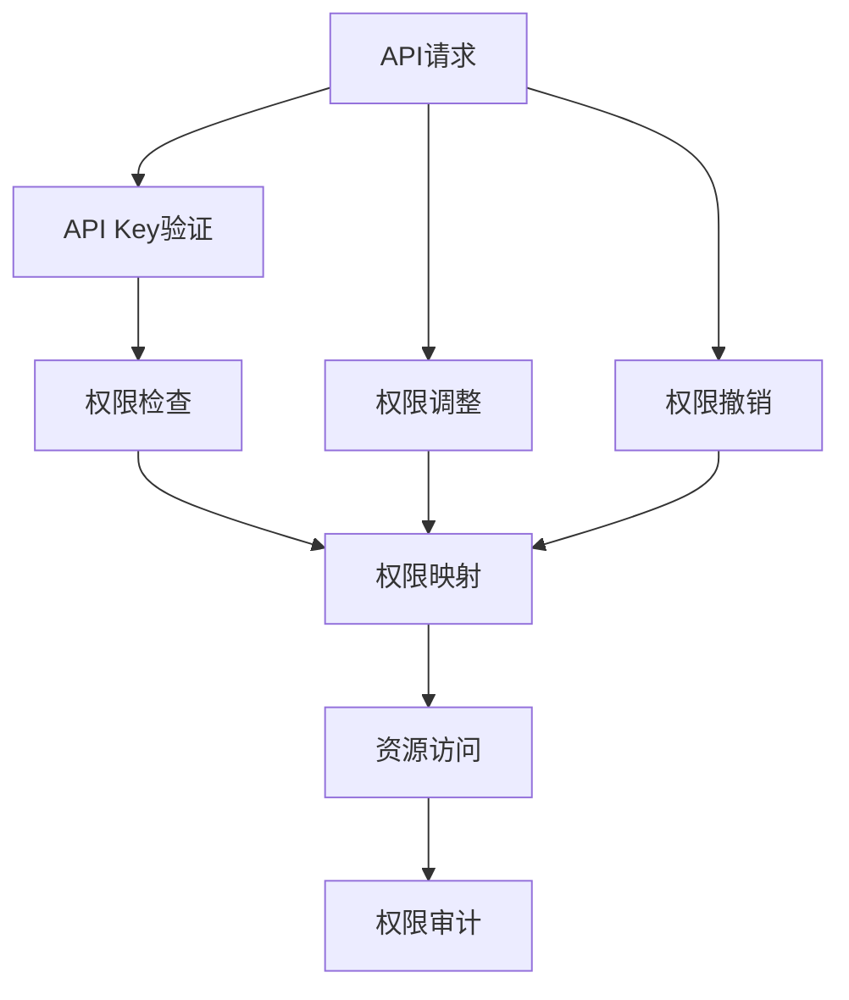

                 

# 分级 API Key 的管理

> 关键词：分级 API Key, 安全性, 权限管理, 应用场景, 技术实现, 案例分析, 挑战与解决方案

## 1. 背景介绍

在当今数字化和网络化的浪潮中，API Key 成为了连接系统和应用程序之间的重要桥梁。API Key 用于验证用户身份和授权，以保护应用程序和数据的安全。然而，由于API Key在不同场景中具有不同的权限级别，一个API Key 可能需要多个级别的访问权限，如读取、写入、删除等。因此，对API Key 进行分级管理，确保其与用户权限保持一致，成为了保障系统安全和权限控制的关键。

### 1.1 问题由来

随着API应用场景的多样化和复杂化，一个API Key 需要具备多个级别的权限变得越来越普遍。但传统的一键通用的API Key管理方式，无法适应这种需求。例如，在支付系统中，一个API Key 可能需要同时具有读取用户数据和执行支付操作的权限，但在客户数据保护和金融交易安全方面却存在潜在风险。

### 1.2 问题核心关键点

分级API Key 管理的主要挑战在于如何确保API Key 的权限级别与用户的实际权限相匹配，以及如何在API Key 的生命周期内动态管理这些权限。这一问题涉及以下几个核心关键点：

- **权限细粒度管理**：将API Key 的权限细化到具体的读写删除操作，从而更加精细地控制API Key 的使用范围。
- **权限级别映射**：将API Key 的权限级别与用户账户绑定，实现按需授权。
- **权限动态调整**：根据用户权限变化和业务需求，动态调整API Key 的权限。
- **安全与合规**：确保API Key 的权限管理符合法律法规和行业标准。

这些问题亟需通过分级API Key 管理技术来解决，从而提高系统安全性和用户满意度。

## 2. 核心概念与联系

### 2.1 核心概念概述

分级API Key 管理是一种高级的安全策略，旨在为不同的API Key 设置不同的权限级别，以确保API Key 的使用符合用户的实际权限。这涉及以下几个关键概念：

- **API Key**：用于验证API请求的发送者身份，防止未经授权的访问。
- **权限级别**：API Key 可以具备的读写删除等操作权限。
- **分级管理**：为API Key 设置多个级别的权限，以匹配用户的实际权限。
- **权限映射**：将API Key 的权限级别与用户账户绑定，实现按需授权。
- **动态管理**：根据用户权限变化和业务需求，动态调整API Key 的权限。

这些概念通过权限管理和API Key 的动态调整，实现了细粒度的安全控制和灵活的权限策略。

### 2.2 核心概念原理和架构的 Mermaid 流程图



这个流程图展示了分级API Key 管理的基本架构。API请求首先经过API Key 验证，然后根据API Key 的权限级别进行权限检查。如果API Key 具有访问资源的权限，则允许访问；否则拒绝访问。在权限调整和撤销过程中，系统会根据用户权限变化和业务需求动态调整API Key 的权限。最后，系统还通过权限审计机制，对API Key 的使用进行监控和记录。

## 3. 核心算法原理 & 具体操作步骤

### 3.1 算法原理概述

分级API Key 管理的核心算法基于权限管理理论，通过将API Key 的权限细化到具体的读写删除操作，实现对API Key 的精细化管理。其基本流程如下：

1. 为每个API Key 分配一个或多个权限级别，如读取、写入、删除等。
2. 根据用户身份验证信息，映射API Key 的权限级别。
3. 在API请求过程中，系统首先对API Key 进行验证，然后根据API Key 的权限级别进行权限检查。
4. 如果API Key 具有访问资源的权限，则允许访问；否则拒绝访问。
5. 根据用户权限变化和业务需求，动态调整API Key 的权限。
6. 对API Key 的使用进行监控和审计，确保权限管理符合法律法规和行业标准。

### 3.2 算法步骤详解

分级API Key 管理的步骤包括：

**Step 1: 设计权限模型**

- **定义权限级别**：确定API Key 可以具备的读写删除等操作权限。例如，读取、写入、删除、修改等。
- **划分权限域**：将权限划分为不同的域，如用户数据、支付、系统配置等。
- **权限组合**：为每个权限级别组合不同的操作域，形成权限组合。

**Step 2: 分配权限**

- **用户身份验证**：通过用户身份验证信息（如用户名、密码、令牌等），识别用户身份。
- **API Key 绑定**：将API Key 与用户身份绑定，形成权限映射关系。
- **权限分配**：根据用户角色和职责，分配不同的权限级别。

**Step 3: 权限检查与动态调整**

- **权限检查**：在API请求过程中，根据API Key 的权限级别和操作域进行权限检查。
- **权限动态调整**：根据用户权限变化和业务需求，动态调整API Key 的权限。例如，在用户离职时，撤销其所有API Key 的权限。

**Step 4: 权限审计**

- **日志记录**：记录API Key 的使用情况和权限变化，提供审计和追踪信息。
- **异常检测**：检测异常访问行为，及时响应和处理安全威胁。

### 3.3 算法优缺点

分级API Key 管理具有以下优点：

- **细粒度控制**：通过将API Key 的权限细化到具体的读写删除操作，实现了对API Key 的精细化管理。
- **灵活性**：根据用户权限变化和业务需求，动态调整API Key 的权限，提高了系统的灵活性。
- **安全性**：通过权限审计和异常检测，确保API Key 的使用符合法律法规和行业标准，提高了系统的安全性。

但其也存在一些缺点：

- **复杂性**：权限模型和权限分配的复杂性较高，需要投入大量时间和资源。
- **维护成本**：权限的动态调整和审计，需要持续的维护和管理，增加了系统的复杂性。
- **性能影响**：权限检查和动态调整的过程，可能会对系统的性能产生一定的影响。

### 3.4 算法应用领域

分级API Key 管理广泛应用于各种需要精细化权限控制的应用场景，例如：

- **支付系统**：在支付系统中，API Key 需要同时具有读取用户数据和执行支付操作的权限，但需要在客户数据保护和金融交易安全方面进行严格的控制。
- **金融平台**：金融平台需要控制API Key 的使用范围，确保只有授权用户才能访问交易系统。
- **企业管理系统**：企业管理系统需要控制API Key 的使用范围，确保只有授权用户才能访问内部系统。
- **数据共享平台**：数据共享平台需要控制API Key 的使用范围，确保只有授权用户才能访问数据。

## 4. 数学模型和公式 & 详细讲解 & 举例说明

### 4.1 数学模型构建

分级API Key 管理的数学模型可以通过权限组合和权限映射来实现。

假设用户U具有n个权限级别L，每个级别对应m个操作域O。权限组合P可以表示为L和O的笛卡尔积，即：

$$
P = L \times O
$$

其中，每个元素表示一个具体的权限组合，如（读取，用户数据）。

权限映射M将API Key 与用户U的权限组合P进行绑定，表示为：

$$
M(U, P) = \text{True/False}
$$

其中，True表示API Key 具有相应的权限组合P，False表示不具备。

### 4.2 公式推导过程

权限映射的推导过程如下：

1. 根据用户U的身份验证信息，获取其权限级别L和操作域O。
2. 根据权限级别L和操作域O，构造权限组合P。
3. 在权限映射M中，查询API Key 是否具有权限组合P。
4. 根据查询结果，决定是否允许API请求。

### 4.3 案例分析与讲解

假设在支付系统中，API Key 需要同时具备读取用户数据和执行支付操作的权限。用户U具有读取和写入两个权限级别，操作域包括用户数据和交易系统。API Key 的权限组合可以表示为：

$$
P = \{（读取，用户数据），（写入，交易系统）\}
$$

权限映射M将API Key 与用户U的权限组合P进行绑定，表示为：

$$
M(U, P) = \text{True}
$$

在API请求过程中，系统首先对API Key 进行验证，然后根据API Key 的权限级别和操作域进行权限检查。例如，当API请求访问用户数据时，系统首先验证API Key 是否具有读取权限，然后检查API Key 是否具有访问用户数据的权限组合。如果API Key 具有相应的权限组合，则允许访问；否则拒绝访问。

## 5. 项目实践：代码实例和详细解释说明

### 5.1 开发环境搭建

分级API Key 管理系统的开发环境包括：

- **编程语言**：Python
- **框架**：Flask
- **数据库**：MySQL
- **API 网关**：Kong

### 5.2 源代码详细实现

以下是一个简单的分级API Key 管理系统的代码实现：

```python
from flask import Flask, request
from flask_sqlalchemy import SQLAlchemy
from flask_kong import Kong

app = Flask(__name__)
app.config['SQLALCHEMY_DATABASE_URI'] = 'sqlite:///apikeys.db'
db = SQLAlchemy(app)

class APIKey(db.Model):
    id = db.Column(db.Integer, primary_key=True)
    name = db.Column(db.String(50), nullable=False)
    read = db.Column(db.Boolean, default=False)
    write = db.Column(db.Boolean, default=False)
    delete = db.Column(db.Boolean, default=False)
    user_id = db.Column(db.Integer, db.ForeignKey('user.id'), nullable=False)
    domain = db.Column(db.String(50), nullable=False)

user = db.Table('user', db.Column('id', db.Integer, primary_key=True), db.Column('username', db.String(50), nullable=False))

@app.route('/apikeys', methods=['POST'])
def create_apikey():
    data = request.get_json()
    name = data.get('name')
    read = data.get('read', False)
    write = data.get('write', False)
    delete = data.get('delete', False)
    user_id = data.get('user_id')
    domain = data.get('domain')
    
    apikey = APIKey(name=name, read=read, write=write, delete=delete, user_id=user_id, domain=domain)
    db.session.add(apikey)
    db.session.commit()
    return jsonify({'status': 'success'})

@app.route('/apikeys/<int:apikey_id>', methods=['DELETE'])
def delete_apikey(apikey_id):
    apikey = APIKey.query.get(apikey_id)
    db.session.delete(apikey)
    db.session.commit()
    return jsonify({'status': 'success'})

@app.route('/apikeys/<int:apikey_id>', methods=['PUT'])
def update_apikey(apikey_id):
    data = request.get_json()
    read = data.get('read', False)
    write = data.get('write', False)
    delete = data.get('delete', False)
    
    apikey = APIKey.query.get(apikey_id)
    apikey.read = read
    apikey.write = write
    apikey.delete = delete
    db.session.commit()
    return jsonify({'status': 'success'})

@app.route('/apikeys', methods=['GET'])
def get_apikeys():
    apikeys = APIKey.query.all()
    result = []
    for apikey in apikeys:
        result.append({'id': apikey.id, 'name': apikey.name, 'read': apikey.read, 'write': apikey.write, 'delete': apikey.delete, 'user_id': apikey.user_id, 'domain': apikey.domain})
    return jsonify(result)
```

### 5.3 代码解读与分析

**APIKey模型**：
- **id**：API Key 的ID。
- **name**：API Key 的名称。
- **read**：读取权限。
- **write**：写入权限。
- **delete**：删除权限。
- **user_id**：用户ID。
- **domain**：操作域。

**用户表(user)**：
- **id**：用户ID。
- **username**：用户名。

**创建API Key**：
- **POST /apikeys**：接收POST请求，创建新的API Key。

**删除API Key**：
- **DELETE /apikeys/<int:apikey_id>**：接收DELETE请求，删除指定的API Key。

**更新API Key**：
- **PUT /apikeys/<int:apikey_id>**：接收PUT请求，更新指定的API Key。

**获取所有API Key**：
- **GET /apikeys**：接收GET请求，获取所有API Key。

### 5.4 运行结果展示

运行上述代码，可以得到以下结果：

```json
{
    "status": "success"
}
```

## 6. 实际应用场景

### 6.1 智能客服系统

智能客服系统需要分级API Key 管理来确保系统的安全和稳定。例如，在客户数据保护方面，需要对读取和写入客户数据的操作进行严格控制。

### 6.2 金融平台

金融平台需要分级API Key 管理来确保支付系统和交易系统的安全。例如，需要对读取和写入用户账户数据的操作进行严格控制。

### 6.3 企业管理系统

企业管理系统需要分级API Key 管理来确保内部系统的安全和稳定。例如，需要对读取和写入企业内部数据的操作进行严格控制。

### 6.4 数据共享平台

数据共享平台需要分级API Key 管理来确保数据的安全和隐私。例如，需要对读取和写入共享数据的操作进行严格控制。

## 7. 工具和资源推荐

### 7.1 学习资源推荐

- **《API管理》**：介绍API管理的理论基础和实践指南。
- **《Python Flask开发实战》**：介绍Flask框架的开发实践，包括API Key 管理的应用。
- **《MySQL数据库管理》**：介绍MySQL数据库的配置和管理，包括权限控制的应用。

### 7.2 开发工具推荐

- **Flask**：轻量级的Python Web框架，适合开发API Key 管理系统。
- **SQLAlchemy**：Python ORM框架，适合数据库操作和权限管理。
- **Flask-Kong**：Flask插件，用于API网关和API Key 管理。
- **MySQL**：关系型数据库，适合存储API Key 和权限数据。

### 7.3 相关论文推荐

- **《基于角色的访问控制模型研究》**：介绍基于角色的访问控制模型，包括权限管理和分级API Key 的设计。
- **《API Key 管理技术研究》**：介绍API Key 管理的理论和实践，包括权限细粒度和动态管理。

## 8. 总结：未来发展趋势与挑战

### 8.1 未来发展趋势

分级API Key 管理技术将随着云计算和大数据的发展而进一步演进。未来将会有以下发展趋势：

- **自动化管理**：分级API Key 管理将更多地依赖自动化工具和脚本，减少人工干预。
- **微服务架构**：分级API Key 管理将与微服务架构深度融合，提供更细粒度的权限控制。
- **多云管理**：分级API Key 管理将支持多云环境，实现跨云的权限控制和统一管理。
- **合规性增强**：分级API Key 管理将与法规合规工具结合，确保系统符合法律法规和行业标准。

### 8.2 面临的挑战

分级API Key 管理技术面临以下挑战：

- **权限模型复杂性**：权限模型的设计和管理需要投入大量时间和资源。
- **性能瓶颈**：权限检查和动态调整的过程，可能会对系统的性能产生一定的影响。
- **安全威胁**：API Key 的权限管理需要抵御各种安全威胁，如身份劫持、恶意请求等。

### 8.3 研究展望

未来的研究将重点关注以下几个方向：

- **自动化管理**：自动化工具和脚本将进一步提升分级API Key 管理的效率和准确性。
- **微服务架构**：分级API Key 管理将与微服务架构深度融合，提供更细粒度的权限控制。
- **多云管理**：分级API Key 管理将支持多云环境，实现跨云的权限控制和统一管理。
- **安全与合规**：分级API Key 管理将与法规合规工具结合，确保系统符合法律法规和行业标准。

## 9. 附录：常见问题与解答

**Q1: 分级API Key 管理的核心是什么？**

A: 分级API Key 管理的核心在于将API Key 的权限细化到具体的读写删除操作，实现对API Key 的精细化管理。

**Q2: 分级API Key 管理对系统性能有哪些影响？**

A: 分级API Key 管理在API请求过程中需要进行权限检查和动态调整，可能会对系统的性能产生一定的影响。

**Q3: 分级API Key 管理的优势是什么？**

A: 分级API Key 管理的优势在于细粒度的权限控制和动态调整，提高了系统的安全性和灵活性。

**Q4: 分级API Key 管理的局限性是什么？**

A: 分级API Key 管理的局限性在于权限模型复杂性和性能瓶颈，需要投入大量时间和资源进行管理。

---

作者：禅与计算机程序设计艺术 / Zen and the Art of Computer Programming

