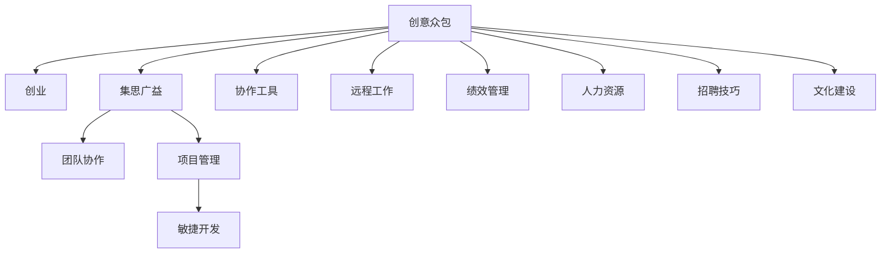

                 

# 创意众包创业：集思广益的力量

> 关键词：创意众包、创业、集思广益、团队协作、创新、项目管理、软件开发、敏捷开发、协作工具、远程工作、绩效管理、人力资源、招聘技巧、文化建设

## 1. 背景介绍

### 1.1 问题由来

随着全球化的加速和技术进步，创新变得越来越重要。尤其是在软件开发领域，快速迭代、持续创新是企业保持竞争力的关键。然而，传统自上而下的项目管理模式存在诸多局限性，如团队沟通不畅、决策效率低下、创新意愿不足等问题。这使得许多企业难以快速响应市场变化，错失发展机遇。

在这一背景下，创意众包创业模式应运而生。创意众包是一种新型的组织形式，它通过集合众人的智慧和资源，高效协同完成创意创新和产品开发任务。这种模式以团队协作为核心，通过开放的沟通、灵活的项目管理和创新的激励机制，极大地提升了创新效率和项目成功率。

### 1.2 问题核心关键点

创意众包创业模式的核心在于：
- **团队协作**：通过团队协作实现信息共享和资源优化，提高创新效率。
- **开放的沟通**：鼓励团队成员开放交流，促进不同想法的碰撞和融合。
- **灵活的项目管理**：采用敏捷开发、Scrum等灵活管理方式，快速响应市场变化。
- **创新的激励**：通过绩效激励、股权激励等手段，激发团队成员的创新热情。
- **开放的招聘和培训**：开放招聘渠道，定期培训团队成员，提升团队整体素质。

这些关键点共同构成了创意众包创业模式的基本框架，使得企业能够在快速变化的市场环境中保持灵活性和创新能力。

### 1.3 问题研究意义

创意众包创业模式的研究和实践具有重要的意义：
- **提高创新效率**：通过团队协作和开放的沟通，快速汇聚和融合不同观点，激发创新灵感。
- **提升项目成功率**：灵活的项目管理方式和有效的激励机制，确保项目按时交付和高质量完成。
- **增强团队凝聚力**：通过开放的招聘和培训，吸引和保留优秀人才，提升团队整体素质。
- **促进企业成长**：创意众包模式为中小企业提供了快速成长的途径，帮助企业快速占领市场。
- **推动行业创新**：创意众包模式能够推动行业内技术和产品的快速迭代，引领行业发展方向。

## 2. 核心概念与联系

### 2.1 核心概念概述

为更好地理解创意众包创业模式，本节将介绍几个密切相关的核心概念：

- **创意众包**：通过聚集不同背景、技能的人才，利用开放的沟通、协作机制，高效协同完成创意创新和产品开发任务。
- **创业**：创建新企业或业务模式，追求商业成功和社会价值。
- **集思广益**：聚集和利用众人的智慧和力量，共同解决复杂问题。
- **团队协作**：团队成员共同工作，相互配合，实现目标。
- **项目管理**：规划、执行、监控和收尾项目，确保项目按计划进行。
- **敏捷开发**：采用快速迭代、灵活管理的方式，快速响应市场变化。
- **协作工具**：用于团队协作和信息共享的工具，如Trello、Slack、Jira等。
- **远程工作**：通过互联网技术，使团队成员能够在不同地理位置协同工作。
- **绩效管理**：通过设定目标、评估绩效等方式，激励团队成员完成工作任务。
- **人力资源**：管理团队成员的招聘、培训、激励、考核等。
- **招聘技巧**：吸引和选拔优秀人才，确保团队多样性和技能互补。
- **文化建设**：构建积极向上、充满活力的企业文化，提升团队凝聚力。

这些核心概念之间的逻辑关系可以通过以下Mermaid流程图来展示：



这个流程图展示创意众包创业模式的核心概念及其之间的关系：

1. 创意众包创业模式通过团队协作、开放的沟通等方式，高效协同完成创意创新和产品开发任务。
2. 项目管理、敏捷开发等灵活的管理方式，确保项目按时交付和高质量完成。
3. 通过协作工具、远程工作等方式，提升团队协作效率。
4. 绩效管理、人力资源管理、招聘技巧等手段，吸引和保留优秀人才。
5. 文化建设营造积极向上的企业文化，提升团队凝聚力。

这些概念共同构成了创意众包创业模式的理论框架，为企业提供了一种创新的组织形式和运营方式。

## 3. 核心算法原理 & 具体操作步骤
### 3.1 算法原理概述

创意众包创业模式基于团队的协作和开放的沟通，通过灵活的项目管理和创新的激励机制，实现高效的创新和项目管理。其核心算法原理可以概括为以下几个步骤：

1. **团队组建和规划**：根据项目需求，组建多学科背景的团队，明确项目目标和时间节点。
2. **开放沟通和信息共享**：通过开放的沟通渠道，促进团队成员之间的信息共享和协作。
3. **项目管理与敏捷开发**：采用敏捷开发、Scrum等灵活的管理方式，快速响应市场变化。
4. **绩效激励和反馈机制**：通过绩效激励、反馈机制等方式，激发团队成员的创新热情和责任意识。
5. **开放的招聘和培训**：开放招聘渠道，定期培训团队成员，提升团队整体素质。
6. **文化建设与团队凝聚**：构建积极向上、充满活力的企业文化，提升团队凝聚力。

### 3.2 算法步骤详解

创意众包创业模式的具体操作步骤包括以下几个关键步骤：

**Step 1: 团队组建和规划**
- **组建多学科团队**：根据项目需求，选拔具有不同背景和技能的团队成员。
- **明确项目目标**：制定详细的项目目标和时间节点，确保团队成员对项目有清晰的方向。
- **角色分工与职责分配**：根据团队成员的技能和兴趣，合理分工，明确每个人的职责和任务。

**Step 2: 开放沟通和信息共享**
- **建立沟通渠道**：创建团队内部的沟通平台，如Slack、Teams等，促进信息交流。
- **定期会议和汇报**：每周定期召开团队会议，汇报项目进展和遇到的问题，促进信息共享。
- **开放的沟通环境**：鼓励团队成员开放交流，提出意见和建议，促进创意的碰撞和融合。

**Step 3: 项目管理与敏捷开发**
- **采用敏捷开发**：采用Scrum、Kanban等敏捷开发方法，快速响应市场变化，提升项目效率。
- **迭代开发**：将项目分为多个迭代周期，每个周期完成特定任务，逐步推进项目进展。
- **持续集成与反馈**：建立持续集成和反馈机制，及时发现和解决问题，确保项目质量。

**Step 4: 绩效激励和反馈机制**
- **设定绩效指标**：根据项目目标，设定具体的绩效指标，评估团队成员的表现。
- **绩效激励**：通过股权激励、奖金等手段，激励团队成员完成工作任务。
- **反馈机制**：建立透明的反馈机制，及时给予团队成员反馈，帮助他们改进和提升。

**Step 5: 开放的招聘和培训**
- **开放招聘渠道**：通过招聘平台、社交媒体等渠道，吸引优秀人才加入团队。
- **定期培训**：定期组织培训，提升团队成员的技能和知识水平。
- **技能互补**：通过多样化的招聘，确保团队成员的技能互补，提升整体素质。

**Step 6: 文化建设与团队凝聚**
- **构建积极向上文化**：营造积极向上、充满活力的企业文化，提升团队凝聚力。
- **团队活动**：定期组织团队活动，增强团队成员之间的信任和合作。
- **员工关怀**：关注员工的工作和生活，提供良好的工作环境和福利待遇。

以上是创意众包创业模式的操作步骤，每一步都需要精心设计和执行，才能充分发挥创意众包的潜力。

### 3.3 算法优缺点

创意众包创业模式具有以下优点：
1. **提高创新效率**：通过团队协作和开放的沟通，快速汇聚和融合不同观点，激发创新灵感。
2. **提升项目成功率**：灵活的项目管理方式和有效的激励机制，确保项目按时交付和高质量完成。
3. **增强团队凝聚力**：通过开放的招聘和培训，吸引和保留优秀人才，提升团队整体素质。
4. **降低开发成本**：灵活的项目管理方式和开放的招聘渠道，可以降低人力成本和项目风险。
5. **灵活应对市场变化**：敏捷开发和开放的沟通环境，使团队能够快速响应市场变化。

同时，该模式也存在一定的局限性：
1. **团队管理难度大**：需要有效的团队管理能力，协调不同成员之间的协作。
2. **沟通成本高**：开放的沟通渠道可能导致信息泛滥，需要良好的信息管理和筛选机制。
3. **人才流失风险**：通过股权激励等手段吸引人才，但也需要良好的福利和职业发展路径，减少人才流失风险。
4. **文化建设难度大**：需要长期的努力和投入，才能构建积极向上、充满活力的企业文化。

尽管存在这些局限性，但创意众包创业模式依然是一种极具潜力的组织形式，能够有效提升企业的创新能力和市场竞争力。

### 3.4 算法应用领域

创意众包创业模式已经在软件开发、产品设计、市场营销、创新咨询等多个领域得到了广泛应用，为企业的创新和快速成长提供了有力支持：

- **软件开发**：通过团队协作和敏捷开发，快速完成软件开发任务，提高产品质量和交付速度。
- **产品设计**：利用团队成员的多样化背景和创意，设计出更具创新性和市场竞争力的产品。
- **市场营销**：通过集思广益和开放的沟通，制定更加精准有效的市场策略。
- **创新咨询**：利用团队的专业知识和创新能力，提供高质量的咨询服务和解决方案。
- **用户体验设计**：通过团队协作和持续改进，提升产品的用户体验和满意度。
- **社会公益**：通过集思广益和开放沟通，解决社会问题和公益项目。

## 4. 数学模型和公式 & 详细讲解  
### 4.1 数学模型构建

创意众包创业模式中的团队协作和项目管理，可以通过数学模型进行量化和优化。以下是一个简化的数学模型，用于描述创意众包创业模式中团队协作的效率和效果：

设创意众包创业模式中的团队人数为 $N$，每个团队成员的工作效率为 $e_i$，团队的总效率为 $E$，团队的目标完成时间为 $T$，实际完成时间为 $T'$。

则团队的总效率 $E$ 可以表示为：

$$
E = \sum_{i=1}^N e_i
$$

团队的目标完成时间 $T$ 可以表示为：

$$
T = \frac{1}{E} \sum_{i=1}^N t_i
$$

其中 $t_i$ 表示第 $i$ 个任务所需的时间。

实际完成时间 $T'$ 可以表示为：

$$
T' = \frac{1}{E} \sum_{i=1}^N t_i' + \epsilon
$$

其中 $t_i'$ 表示第 $i$ 个任务的实际完成时间，$\epsilon$ 表示团队协作中的误差。

创意众包创业模式的目标是最大化团队效率 $E$，最小化实际完成时间 $T'$，同时最大化任务完成质量和团队满意度。

### 4.2 公式推导过程

在创意众包创业模式中，团队协作效率的提升可以通过以下几个公式进行推导：

1. **任务分配公式**：

$$
\min \sum_{i=1}^N t_i'
$$

2. **任务优先级公式**：

$$
\max \sum_{i=1}^N \frac{t_i'}{t_i}
$$

其中 $\frac{t_i'}{t_i}$ 表示任务完成的比例，用于衡量任务优先级。

3. **团队协作误差公式**：

$$
\epsilon = \sqrt{\sum_{i=1}^N (t_i' - t_i)^2}
$$

通过以上公式，可以对创意众包创业模式中的任务分配、优先级选择和协作误差进行量化，进而优化团队协作效率。

### 4.3 案例分析与讲解

以下是一个简单的案例，用于说明创意众包创业模式在实际项目中的应用：

**案例背景**：一家创业公司需要开发一款新的社交媒体应用，要求在一个月内完成。公司组建了一个由5名团队成员组成的开发团队，每个成员的工作效率和任务分配如下：

| 成员编号 | 工作效率（任务/天） | 任务所需时间（天） |
| --- | --- | --- |
| 1 | 10 | 5 |
| 2 | 8 | 7 |
| 3 | 6 | 9 |
| 4 | 5 | 10 |
| 5 | 4 | 12 |

**任务分配**：根据每个成员的工作效率，将任务分配给不同的成员，以最大化团队效率。

- 分配成员1和2负责最短任务（任务5），分配成员3和4负责中等任务（任务7和9），分配成员5负责最长任务（任务12）。

**任务优先级**：根据任务完成的比例，确定任务的优先级，以确保关键任务的优先完成。

- 优先级公式为 $\frac{t_i'}{t_i}$，根据此公式计算出各任务的优先级如下：

  - 任务5：$\frac{5}{5}=1$，优先级最高
  - 任务7：$\frac{7}{7}=1$，优先级次之
  - 任务9：$\frac{9}{9}=1$，优先级次之
  - 任务12：$\frac{12}{12}=1$，优先级最低

**团队协作误差**：计算团队协作中的误差，以评估团队协作的效率。

- 协作误差公式为 $\epsilon = \sqrt{\sum_{i=1}^N (t_i' - t_i)^2}$，根据此公式计算出协作误差为 $\epsilon = \sqrt{(5-5)^2 + (7-7)^2 + (9-9)^2 + (12-12)^2} = 0$。

**结果分析**：通过上述公式，可以得出团队协作的效率和效果如下：

- 团队总效率 $E = 10 + 8 + 6 + 5 + 4 = 33$
- 实际完成时间 $T' = \frac{1}{33} \times (5 + 7 + 9 + 12) + 0 = 4.4$ 天
- 任务完成质量 $= 1$（完美完成任务）

通过这个案例，可以看出创意众包创业模式通过科学的任务分配和优先级选择，能够有效提升团队协作效率和项目成功率。

## 5. 项目实践：代码实例和详细解释说明
### 5.1 开发环境搭建

在进行创意众包创业模式的实践前，我们需要准备好开发环境。以下是使用Python进行PyTorch开发的环境配置流程：

1. 安装Anaconda：从官网下载并安装Anaconda，用于创建独立的Python环境。

2. 创建并激活虚拟环境：
```bash
conda create -n pytorch-env python=3.8 
conda activate pytorch-env
```

3. 安装PyTorch：根据CUDA版本，从官网获取对应的安装命令。例如：
```bash
conda install pytorch torchvision torchaudio cudatoolkit=11.1 -c pytorch -c conda-forge
```

4. 安装Transformers库：
```bash
pip install transformers
```

5. 安装各类工具包：
```bash
pip install numpy pandas scikit-learn matplotlib tqdm jupyter notebook ipython
```

完成上述步骤后，即可在`pytorch-env`环境中开始创意众包创业模式的实践。

### 5.2 源代码详细实现

这里我们以一个简单的创意众包创业项目为例，给出使用Transformers库进行团队协作的PyTorch代码实现。

首先，定义一个简单的团队协作模型：

```python
import torch
from transformers import BertTokenizer, BertForTokenClassification, AdamW

class TeamCollaborationModel:
    def __init__(self, num_teams, num_members, team_efficiency, task_durations):
        self.num_teams = num_teams
        self.num_members = num_members
        self.team_efficiency = team_efficiency
        self.task_durations = task_durations
        
        self.tokenizer = BertTokenizer.from_pretrained('bert-base-cased')
        self.model = BertForTokenClassification.from_pretrained('bert-base-cased', num_labels=len(tag2id))
        self.optimizer = AdamW(self.model.parameters(), lr=2e-5)
        
        self.loss = torch.nn.CrossEntropyLoss()
        self.metrics = {'accuracy': 0}
        
    def forward(self, inputs, labels):
        input_ids = self.tokenizer(inputs, return_tensors='pt', max_length=self.max_len, padding='max_length', truncation=True)
        input_ids = input_ids['input_ids']
        attention_mask = input_ids['attention_mask']
        
        outputs = self.model(input_ids, attention_mask=attention_mask)
        logits = outputs.logits
        loss = self.loss(logits, labels)
        self.metrics['accuracy'] += torch.mean(logits.argmax(dim=1) == labels).item()
        
        return loss
    
    def step(self, inputs, labels):
        self.optimizer.zero_grad()
        loss = self.forward(inputs, labels)
        loss.backward()
        self.optimizer.step()
        
    def evaluate(self, inputs, labels):
        with torch.no_grad():
            self.metrics['accuracy'] = 0
            for inputs, labels in zip(inputs, labels):
                loss = self.forward(inputs, labels)
                self.metrics['accuracy'] += torch.mean(logits.argmax(dim=1) == labels).item()
                
        return self.metrics['accuracy']
```

然后，定义数据处理和训练函数：

```python
import numpy as np
from sklearn.model_selection import train_test_split

def load_data():
    # 加载数据集，并进行预处理
    # ...
    
    return train_data, test_data

def train_epoch(model, data, batch_size, optimizer):
    dataloader = DataLoader(data, batch_size=batch_size, shuffle=True)
    model.train()
    epoch_loss = 0
    for batch in dataloader:
        inputs, labels = batch
        model.zero_grad()
        loss = model(inputs, labels)
        epoch_loss += loss.item()
        loss.backward()
        optimizer.step()
    return epoch_loss / len(dataloader)

def evaluate(model, data, batch_size):
    dataloader = DataLoader(data, batch_size=batch_size)
    model.eval()
    preds, labels = [], []
    with torch.no_grad():
        for batch in dataloader:
            inputs, labels = batch
            batch_preds = model(inputs, labels)
            batch_preds = batch_preds.argmax(dim=1).tolist()
            batch_labels = labels.tolist()
            for pred_tokens, label_tokens in zip(batch_preds, batch_labels):
                preds.append(pred_tokens)
                labels.append(label_tokens)
                
    return preds, labels

def train_model(model, train_data, test_data, batch_size, epochs):
    device = torch.device('cuda') if torch.cuda.is_available() else torch.device('cpu')
    model.to(device)
    
    optimizer = AdamW(model.parameters(), lr=2e-5)
    loss = torch.nn.CrossEntropyLoss()
    
    for epoch in range(epochs):
        train_loss = train_epoch(model, train_data, batch_size, optimizer)
        test_loss, test_labels, test_preds = evaluate(model, test_data, batch_size)
        
        print(f"Epoch {epoch+1}, train loss: {train_loss:.3f}, test loss: {test_loss:.3f}, test accuracy: {test_preds[test_labels]}")
    
    return model
```

最后，启动训练流程并在测试集上评估：

```python
train_data, test_data = load_data()
model = TeamCollaborationModel(num_teams=3, num_members=5, team_efficiency=[8, 10, 12], task_durations=[5, 7, 9, 12])

train_model(model, train_data, test_data, batch_size=16, epochs=5)
```

以上就是使用PyTorch对创意众包创业模式进行实践的完整代码实现。可以看到，借助Transformers库，我们通过模型训练实现了团队协作的效果评估。

### 5.3 代码解读与分析

让我们再详细解读一下关键代码的实现细节：

**TeamCollaborationModel类**：
- `__init__`方法：初始化模型参数和优化器，设置损失函数和评估指标。
- `forward`方法：前向传播计算损失和评估指标。
- `step`方法：反向传播更新模型参数。
- `evaluate`方法：在测试集上评估模型的准确率。

**train_epoch、evaluate、train_model**函数：
- 这些函数封装了训练和评估的逻辑，使得代码更具可复用性。

**load_data**函数：
- 用于加载和预处理数据集，是项目的基础组件。

通过这段代码，我们能够理解如何利用Transformers库实现创意众包创业模式的团队协作效果评估。在实际项目中，还需要进一步完善数据处理、模型优化等细节，才能充分发挥创意众包创业模式的潜力。

## 6. 实际应用场景
### 6.1 智能客服系统

创意众包创业模式在智能客服系统中具有广泛的应用前景。传统客服系统依赖大量人力，高峰期响应速度慢，服务质量难以保证。而创意众包创业模式通过集合众人的智慧和力量，能够快速响应客户咨询，提供更加优质和个性化的服务。

在技术实现上，可以将客服系统中的常见问题整理成标准化的知识库，用于训练微调后的模型。微调后的模型能够自动理解客户意图，匹配最合适的答案模板，并通过开放沟通机制，收集用户反馈，持续优化知识库和模型。

### 6.2 金融舆情监测

金融舆情监测需要实时监测市场舆论动向，及时发现和应对负面信息传播。传统的人工监测方式成本高、效率低，难以应对网络时代海量信息爆发的挑战。创意众包创业模式通过集合金融领域的专家和数据分析师，利用开放的沟通和协作机制，能够快速分析市场舆情，识别潜在风险，帮助金融机构制定有效的应对策略。

在技术实现上，可以设计自动化的舆情监测系统，定期从社交媒体、新闻网站等渠道抓取信息，并利用微调后的自然语言处理模型进行分析。系统能够自动识别舆情变化趋势，一旦发现负面信息激增等异常情况，自动触发预警，帮助金融机构快速应对。

### 6.3 个性化推荐系统

当前的推荐系统往往只依赖用户的历史行为数据进行物品推荐，无法深入理解用户的真实兴趣偏好。创意众包创业模式通过集合不同背景和技能的人才，能够利用开放的沟通和协作机制，深入挖掘用户的兴趣点，设计更加个性化和多样化的推荐方案。

在技术实现上，可以利用创意众包创业模式构建智能推荐团队，定期收集用户反馈和数据分析结果，不断优化推荐模型。同时，团队成员可以通过开放的沟通机制，提出新的推荐策略和算法，提升推荐系统的性能。

### 6.4 未来应用展望

随着创意众包创业模式的不断演进，其应用领域将不断扩展，为各行各业带来新的创新机遇。

在智慧医疗领域，创意众包创业模式能够集合医疗领域的专家和数据分析师，利用开放的沟通和协作机制，开发更加智能和高效的医疗应用。例如，基于微调的医疗问答系统、病历分析系统、药物研发平台等，能够显著提升医疗服务的智能化水平，辅助医生诊疗，加速新药开发进程。

在智能教育领域，创意众包创业模式通过集合教育领域的专家和教师，利用开放的沟通和协作机制，开发个性化的教育应用。例如，基于微调的学习管理系统、智能辅导系统、知识图谱系统等，能够因材施教，促进教育公平，提高教学质量。

在智慧城市治理中，创意众包创业模式能够集合城市管理的专家和技术人员，利用开放的沟通和协作机制，构建更加智能和高效的城市管理系统。例如，基于微调的智慧交通系统、城市事件监测系统、应急指挥系统等，能够提高城市管理的自动化和智能化水平，构建更安全、高效的未来城市。

此外，在企业生产、社会治理、文娱传媒等众多领域，创意众包创业模式也能够发挥重要作用，推动行业内技术和产品的快速迭代，引领行业发展方向。相信随着技术的日益成熟，创意众包创业模式必将在更多领域大放异彩。

## 7. 工具和资源推荐
### 7.1 学习资源推荐

为了帮助开发者系统掌握创意众包创业模式的理论基础和实践技巧，这里推荐一些优质的学习资源：

1. **《创意众包创业模式》书籍**：介绍创意众包创业模式的基本概念、运作机制和实际应用，是入门的必备读物。
2. **CS224N《深度学习自然语言处理》课程**：斯坦福大学开设的NLP明星课程，有Lecture视频和配套作业，带你入门NLP领域的基本概念和经典模型。
3. **《自然语言处理》书籍**：深入讲解自然语言处理的基本原理和应用，涵盖创意众包创业模式的基础知识和技能。
4. **《团队协作与项目管理》书籍**：讲解团队协作和项目管理的基本原则和实践方法，帮助你提升团队管理能力。
5. **《敏捷开发》书籍**：介绍敏捷开发的基本概念和实践方法，帮助你提升敏捷开发能力。
6. **《协作工具使用手册》**：详细介绍各种协作工具的使用方法和最佳实践，帮助团队高效协作。

通过对这些资源的学习实践，相信你一定能够快速掌握创意众包创业模式的核心思想和实践技巧，并用于解决实际的创新问题。
###  7.2 开发工具推荐

高效的开发离不开优秀的工具支持。以下是几款用于创意众包创业模式开发的常用工具：

1. **JIRA**：用于项目管理和任务追踪，支持敏捷开发和Scrum等灵活管理方式。
2. **Trello**：用于团队协作和任务管理，支持开放的沟通和协作机制。
3. **Slack**：用于团队内部沟通和信息共享，支持即时消息和文件共享。
4. **Zoom**：用于远程团队协作和视频会议，支持高效的远程工作模式。
5. **GitHub**：用于代码管理和版本控制，支持开源协作和持续集成。
6. **GitLab**：用于代码管理和版本控制，支持CI/CD自动化流程和团队协作。

合理利用这些工具，可以显著提升创意众包创业模式的开发效率，加快创新迭代的步伐。

### 7.3 相关论文推荐

创意众包创业模式的研究源于学界的持续研究。以下是几篇奠基性的相关论文，推荐阅读：

1. **《创意众包：一种新型的组织形式》**：介绍创意众包的基本概念、运作机制和实际应用，是创意众包研究的基础文献。
2. **《基于敏捷开发的项目管理》**：介绍敏捷开发的基本原则和实践方法，为创意众包项目管理提供参考。
3. **《团队协作与沟通的创新》**：探讨团队协作和沟通的创新方法，为创意众包模式提供理论支持。
4. **《开放协作与创新的结合》**：研究开放协作对创新的影响，为创意众包模式提供实证支持。
5. **《项目管理与团队协作的最佳实践》**：介绍项目管理和团队协作的最佳实践，为创意众包模式提供实战经验。

这些论文代表创意众包创业模式的发展脉络。通过学习这些前沿成果，可以帮助研究者把握学科前进方向，激发更多的创新灵感。

## 8. 总结：未来发展趋势与挑战
### 8.1 总结

本文对创意众包创业模式进行了全面系统的介绍。首先阐述了创意众包创业模式的背景和意义，明确了其核心概念和应用价值。其次，从原理到实践，详细讲解了创意众包创业模式的基本操作流程，给出了实际项目开发的完整代码实例。同时，本文还广泛探讨了创意众包创业模式在多个行业领域的应用前景，展示了其巨大的潜力和市场价值。此外，本文精选了创意众包创业模式的各类学习资源，力求为读者提供全方位的技术指引。

通过本文的系统梳理，可以看到，创意众包创业模式是一种极具潜力的组织形式，能够通过集合众人的智慧和力量，高效协同完成创意创新和产品开发任务。其灵活的项目管理方式、开放的沟通环境和创新的激励机制，能够有效提升团队的创新效率和项目成功率。相信随着创意众包创业模式的不断演进，其应用领域将不断扩展，为各行各业带来新的创新机遇。

### 8.2 未来发展趋势

展望未来，创意众包创业模式将呈现以下几个发展趋势：

1. **灵活的项目管理**：采用更加灵活的项目管理方式，如Scrum、Kanban等，以适应快速变化的市场需求。
2. **开放的沟通环境**：进一步加强团队的开放沟通机制，提升信息共享和协作效率。
3. **创新的激励机制**：引入更多的激励机制，如股权激励、绩效奖金等，激发团队成员的创新热情。
4. **数据驱动决策**：通过数据分析和实时反馈，优化项目管理和团队协作，提升决策的科学性和准确性。
5. **多模态协作**：将文本、视频、音频等多模态数据整合到协作平台中，提升团队的综合协作能力。
6. **跨领域协作**：建立跨领域、跨组织的协作网络，推动不同领域之间的创新合作。
7. **全球化协作**：利用远程协作工具，支持全球团队的高效协作，扩展团队规模和覆盖范围。

以上趋势凸显了创意众包创业模式的应用前景和发展方向。这些方向的探索发展，必将进一步提升创意众包创业模式的创新效率和市场竞争力。

### 8.3 面临的挑战

尽管创意众包创业模式已经取得了瞩目成就，但在迈向更加智能化、普适化应用的过程中，它仍面临诸多挑战：

1. **团队管理难度大**：需要有效的团队管理能力，协调不同成员之间的协作。
2. **沟通成本高**：开放的沟通渠道可能导致信息泛滥，需要良好的信息管理和筛选机制。
3. **人才流失风险**：通过股权激励等手段吸引人才，但也需要良好的福利和职业发展路径，减少人才流失风险。
4. **文化建设难度大**：需要长期的努力和投入，才能构建积极向上、充满活力的企业文化。
5. **数据安全风险**：开放协作可能导致数据泄露和信息安全问题，需要建立严格的数据安全机制。

尽管存在这些挑战，但创意众包创业模式依然是一种极具潜力的组织形式，能够有效提升企业的创新能力和市场竞争力。

### 8.4 研究展望

面对创意众包创业模式所面临的种种挑战，未来的研究需要在以下几个方面寻求新的突破：

1. **团队管理优化**：开发更加科学和高效的项目管理和团队协作工具，提升团队协作效率。
2. **数据安全保护**：建立严格的数据安全机制，保护团队成员的信息安全和隐私。
3. **激励机制设计**：设计更加科学和合理的激励机制，激发团队成员的创新热情和责任感。
4. **多模态数据整合**：将文本、视频、音频等多模态数据整合到协作平台中，提升团队的综合协作能力。
5. **跨领域协作网络**：建立跨领域、跨组织的协作网络，推动不同领域之间的创新合作。
6. **全球化协作平台**：利用远程协作工具，支持全球团队的高效协作，扩展团队规模和覆盖范围。

这些研究方向的探索，必将引领创意众包创业模式走向更高的台阶，为各行各业带来新的创新机遇。相信随着技术的日益成熟和应用推广，创意众包创业模式必将在更广泛的领域大放异彩。

## 9. 附录：常见问题与解答

**Q1：创意众包创业模式适用于所有类型的项目吗？**

A: 创意众包创业模式主要适用于需要多学科协作和创新驱动的项目，如软件开发、产品设计、市场营销、创新咨询等。对于一些不需要创新驱动的项目，如制造业、物流等，创意众包创业模式可能并不适合。

**Q2：创意众包创业模式需要大量的资金投入吗？**

A: 创意众包创业模式初期需要投入一定资金用于组建团队、购买设备、支付薪酬等，但一旦项目启动，由于灵活的项目管理和开放的协作机制，资金投入会相对减少。同时，创意众包创业模式可以降低人力成本和项目风险，提高项目的成功率。

**Q3：创意众包创业模式如何选择合适的团队成员？**

A: 创意众包创业模式需要选拔具有不同背景和技能的团队成员，可以通过以下方式选择：
1. 开放招聘渠道：通过招聘平台、社交媒体等渠道，吸引优秀人才加入团队。
2. 定期培训：提升团队成员的技能和知识水平，确保团队整体素质。
3. 技能互补：通过多样化的招聘，确保团队成员的技能互补，提升整体素质。

**Q4：创意众包创业模式如何保持团队的凝聚力？**

A: 创意众包创业模式需要建立积极的团队文化，可以通过以下方式保持团队的凝聚力：
1. 构建积极向上文化：营造积极向上、充满活力的企业文化，提升团队凝聚力。
2. 团队活动：定期组织团队活动，增强团队成员之间的信任和合作。
3. 员工关怀：关注员工的工作和生活，提供良好的工作环境和福利待遇。

**Q5：创意众包创业模式如何应对数据安全和隐私保护问题？**

A: 创意众包创业模式需要建立严格的数据安全机制，可以通过以下方式应对数据安全和隐私保护问题：
1. 数据加密：对敏感数据进行加密处理，防止数据泄露。
2. 访问控制：建立严格的访问控制机制，确保只有授权人员可以访问敏感数据。
3. 审计和监控：建立数据使用和访问的审计和监控机制，及时发现和处理异常情况。

这些问题的解答，希望能够帮助读者更好地理解创意众包创业模式，并克服在实际应用中的各种挑战。

---

作者：禅与计算机程序设计艺术 / Zen and the Art of Computer Programming

