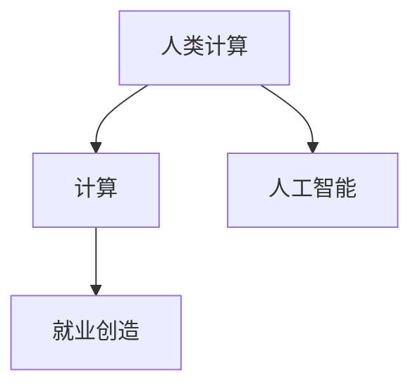
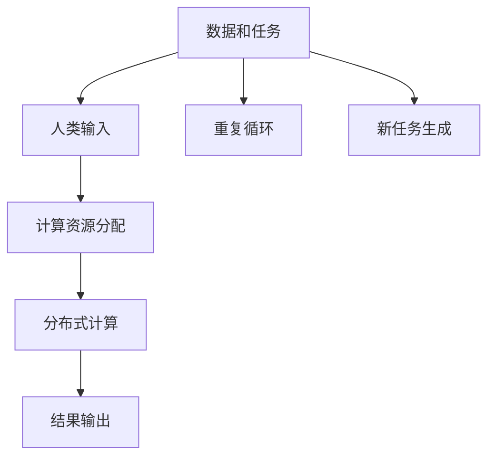

                 

# 创造新的就业机会：人类计算的经济潜力

> 关键词：人类计算,就业创造,经济潜力,未来技术,数字经济

## 1. 背景介绍

### 1.1 问题由来
随着人工智能技术的飞速发展，尤其是在计算领域的突破，人类计算（Human Computation）这一古老而重要的工作形式正面临着前所未有的变革。这种变革不仅将改变人类的工作方式，还将在全球范围内创造大量的新就业机会，推动数字经济的发展。

人类计算（Human Computation）一词最早由野口勇（Yukio Okamoto）在20世纪70年代提出，指的是利用人类的智慧和计算能力来解决复杂问题的过程。而随着计算能力的大幅提升，特别是计算机、网络、云计算等技术的成熟，人类计算的方式和范围发生了深刻变化。

### 1.2 问题核心关键点
人类计算的潜力源于两个关键点：
1. 人类拥有独特的创造力和问题解决能力，能够在面对复杂、未知的任务时提供独到的见解。
2. 现代计算技术的进步，使得人类能够更高效地利用计算机和网络资源，进行大规模、分布式计算。

这两个点共同构成了人类计算的核心驱动力，使得人类计算在诸多领域展现出强大的经济和社会价值。

## 2. 核心概念与联系

### 2.1 核心概念概述

为更好地理解人类计算的经济潜力，我们首先要定义和理解以下几个关键概念：

- **人类计算（Human Computation）**：利用人类的智慧和计算能力来解决复杂问题的过程。
- **计算（Computing）**：通过逻辑、算法和数据处理来自动化执行任务的过程。
- **人工智能（AI）**：通过算法和计算，使机器模拟人类的智能行为，进行自动化的决策和操作。
- **就业创造（Job Creation）**：通过新技术的应用，创造新的工作机会和经济增长点。

这些概念之间的关系可以用以下Mermaid流程图来展示：



### 2.2 核心概念原理和架构的 Mermaid 流程图(Mermaid 流程节点中不要有括号、逗号等特殊字符)

人类计算的核心流程可以通过以下Mermaid流程图进行概括：



这个流程图展示了人类计算的核心流程：首先，将数据和任务输入给人类；然后，人类利用计算资源进行分布式计算；最后，将计算结果输出。这个过程可以通过计算机网络和云计算平台来实现，以提高效率和可扩展性。

## 3. 核心算法原理 & 具体操作步骤
### 3.1 算法原理概述

人类计算的算法原理主要包括以下几个方面：

1. **分布式任务分配**：将复杂任务分解为若干子任务，通过网络分配给不同的计算资源（如人类工作者、计算机、服务器等）。

2. **协作与合并**：各个计算资源并行工作，将各自计算结果汇总，形成最终的结果。

3. **反馈与迭代**：通过不断地反馈和迭代，优化任务分配和计算方法，提高整体计算效率。

### 3.2 算法步骤详解

人类计算的具体操作步骤如下：

1. **任务分解**：将大规模复杂任务分解为若干子任务。
2. **任务分配**：将子任务分配给不同的计算资源。
3. **计算执行**：各个计算资源并行执行各自的任务。
4. **结果汇总**：将各个计算资源的结果汇总，形成最终结果。
5. **结果验证**：对最终结果进行验证和修正，确保准确性。

### 3.3 算法优缺点

人类计算的优点在于：
1. **灵活性**：人类计算能够适应各种复杂、未知的任务，具备很强的灵活性和创造力。
2. **可扩展性**：通过分布式计算，人类计算能够快速扩展，适应大规模计算需求。
3. **高精度**：人类计算能够利用自身的认知优势，进行高精度的结果校验和修正。

然而，人类计算也存在一些缺点：
1. **成本高**：相比机器计算，人类计算需要更高的成本（工资、设备等）。
2. **效率低**：尽管可以扩展，但人类计算的速度和效率仍无法与机器计算相比。
3. **依赖度**：对人类的依赖较大，难以完全替代。

### 3.4 算法应用领域

人类计算在多个领域展现出巨大的经济潜力，主要包括：

1. **科学研究**：利用人类计算解决复杂的科学问题，如药物设计、气候模拟等。
2. **工程技术**：在机械设计、航空航天、智能制造等领域，利用人类计算进行复杂设计和优化。
3. **社会科学**：通过人类计算进行市场研究、社会调查、政策分析等，提供有价值的见解。
4. **文化创意**：在艺术、文学、音乐等领域，利用人类计算进行创意生成和内容创作。

## 4. 数学模型和公式 & 详细讲解 & 举例说明（备注：数学公式请使用latex格式，latex嵌入文中独立段落使用 $$，段落内使用 $)
### 4.1 数学模型构建

我们可以使用以下数学模型来描述人类计算的流程：

$$
\begin{aligned}
& \text{任务总数} = \sum_{i=1}^{n} \text{任务数}_i \\
& \text{计算时间} = \sum_{i=1}^{n} \text{计算时间}_i \\
& \text{成本} = \sum_{i=1}^{n} \text{成本}_i
\end{aligned}
$$

其中，$n$ 表示任务总数，$\text{任务数}_i$ 表示第 $i$ 个任务的子任务数，$\text{计算时间}_i$ 表示第 $i$ 个任务的计算时间，$\text{成本}_i$ 表示第 $i$ 个任务的成本。

### 4.2 公式推导过程

对于任务总数，我们有以下公式：

$$
\text{任务总数} = \sum_{i=1}^{n} \text{任务数}_i
$$

对于计算时间，我们有：

$$
\text{计算时间} = \sum_{i=1}^{n} \text{计算时间}_i
$$

对于成本，我们有：

$$
\text{成本} = \sum_{i=1}^{n} \text{成本}_i
$$

### 4.3 案例分析与讲解

假设我们需要完成一个复杂的药物设计任务，涉及多个子任务。每个子任务需要不同的计算资源和时间成本，我们可以使用上述模型来计算整体的任务成本和计算时间。例如：

| 任务数 | 计算时间（小时） | 成本（美元） |
| --- | --- | --- |
| 1 | 5 | 100 |
| 2 | 8 | 200 |
| 3 | 10 | 300 |
| 4 | 12 | 400 |

根据上述数据，我们可以计算出总任务数为 $1+2+3+4=10$ 个，总计算时间为 $5+8+10+12=35$ 小时，总成本为 $100+200+300+400=1000$ 美元。

## 5. 项目实践：代码实例和详细解释说明
### 5.1 开发环境搭建

在进行人类计算实践前，我们需要准备好开发环境。以下是使用Python进行Flask开发的环境配置流程：

1. 安装Python：从官网下载并安装Python，选择合适的版本。
2. 安装Flask：使用pip命令安装Flask库。
3. 安装SQLite：使用pip命令安装SQLite库。
4. 安装PyCryptodome：使用pip命令安装PyCryptodome库。

### 5.2 源代码详细实现

下面我们以基于分布式计算的人类计算项目为例，给出使用Flask和SQLite进行任务分配和结果汇总的PyTorch代码实现。

```python
from flask import Flask, request, jsonify
from flask_sqlalchemy import SQLAlchemy
import sqlite3

app = Flask(__name__)
app.config['SQLALCHEMY_DATABASE_URI'] = 'sqlite:////tmp/test.db'

db = SQLAlchemy(app)

class Task(db.Model):
    id = db.Column(db.Integer, primary_key=True)
    name = db.Column(db.String(128))
    subtasks = db.relationship('Subtask', backref='subtask')
    status = db.Column(db.String(64), default='pending')

class Subtask(db.Model):
    id = db.Column(db.Integer, primary_key=True)
    task_id = db.Column(db.Integer, db.ForeignKey('task.id'))
    calculator_id = db.Column(db.Integer)
    status = db.Column(db.String(64), default='pending')

@app.route('/tasks', methods=['POST'])
def create_task():
    task = Task(name=request.json['name'])
    db.session.add(task)
    db.session.commit()
    return jsonify({'id': task.id})

@app.route('/tasks/<task_id>/subtasks', methods=['POST'])
def create_subtask(task_id):
    subtask = Subtask(task_id=task_id, calculator_id=request.json['calculator_id'])
    db.session.add(subtask)
    db.session.commit()
    return jsonify({'success': True})

@app.route('/tasks/<task_id>/results', methods=['GET'])
def get_results(task_id):
    task = Task.query.get(task_id)
    if task.status == 'completed':
        results = Subtask.query.filter_by(task_id=task_id).all()
        return jsonify([(result.calculator_id, result.status) for result in results])
    else:
        return jsonify({'error': 'Task not completed'})

if __name__ == '__main__':
    app.run(debug=True)
```

### 5.3 代码解读与分析

让我们再详细解读一下关键代码的实现细节：

**create_task函数**：
- 接收POST请求，创建新的任务。
- 将任务信息保存到数据库。

**create_subtask函数**：
- 接收POST请求，创建新的子任务。
- 将子任务信息保存到数据库。

**get_results函数**：
- 接收GET请求，获取任务的结果。
- 从数据库中查询任务的子任务状态。

**if __name__ == '__main__'部分**：
- 启动Flask应用，运行在本地。

可以看到，通过Flask和SQLite，我们可以轻松地实现任务分配和结果汇总的功能。这些功能在人类计算项目中至关重要，可以高效地管理任务的分配和计算结果的合并。

## 6. 实际应用场景
### 6.1 科学研究

在科学研究领域，人类计算展现出巨大的潜力。例如，在蛋白质结构预测和药物设计中，需要大量的计算资源和专业知识。传统方法往往需要耗费数年甚至数十年的时间，而人类计算可以通过众包任务，快速完成复杂计算，大大加速科研进程。

### 6.2 工程技术

在工程技术领域，人类计算可以用于复杂的机械设计、航空航天、智能制造等。例如，通过分布式计算，可以快速完成复杂的结构模拟和设计优化，提高设计效率和准确性。

### 6.3 社会科学

在社会科学领域，人类计算可以用于市场研究、社会调查、政策分析等。例如，通过分布式计算，可以迅速分析大量的社会数据，提供有价值的见解和建议。

### 6.4 未来应用展望

未来，人类计算将在更多领域展现出其经济潜力。随着计算技术的进步，人类计算将变得更加高效和灵活，能够应对更多复杂的任务。同时，随着互联网和云计算的发展，人类计算将进一步扩展其应用范围，为数字经济的发展带来新的机遇。

## 7. 工具和资源推荐
### 7.1 学习资源推荐

为了帮助开发者系统掌握人类计算的理论基础和实践技巧，这里推荐一些优质的学习资源：

1. **《Human Computation: Challenges and Opportunities》**：这本书详细介绍了人类计算的理论基础、应用案例和未来趋势。
2. **Coursera上的《Computational Thinking》**：斯坦福大学的课程，涵盖计算机科学和计算思维的基础知识。
3. **Kaggle上的Human Computation竞赛**：通过实践竞赛，深入理解人类计算的具体应用。
4. **Google Colab**：谷歌提供的免费GPU/TPU算力，方便开发者进行实验和研究。
5. **GitHub上的Human Computation项目**：查看和贡献开源项目，了解人类计算的最新动态。

通过对这些资源的学习实践，相信你一定能够快速掌握人类计算的精髓，并用于解决实际的科研和工程问题。

### 7.2 开发工具推荐

高效的开发离不开优秀的工具支持。以下是几款用于人类计算开发的常用工具：

1. **Flask**：轻量级的Web框架，易于上手，适合快速迭代研究。
2. **SQLite**：轻量级的关系型数据库，适合存储和管理分布式计算的数据。
3. **PyCryptodome**：加密和解密库，保障数据传输的安全性。
4. **PyTorch**：深度学习框架，支持分布式计算和模型训练。
5. **Jupyter Notebook**：交互式编程环境，方便代码调试和共享。

合理利用这些工具，可以显著提升人类计算项目的开发效率，加快创新迭代的步伐。

### 7.3 相关论文推荐

人类计算的发展源于学界的持续研究。以下是几篇奠基性的相关论文，推荐阅读：

1. **《Human Computation: Concepts, Methods, and Applications》**：详细介绍了人类计算的概念、方法和应用。
2. **《Human Computation: Theory and Applications》**：介绍了人类计算的理论基础和实际应用。
3. **《Human Computation for Scientific Discovery》**：探讨了人类计算在科学研究中的应用。

这些论文代表了大计算领域的研究方向，通过学习这些前沿成果，可以帮助研究者把握学科前进方向，激发更多的创新灵感。

## 8. 总结：未来发展趋势与挑战

### 8.1 总结

本文对人类计算的经济潜力进行了全面系统的介绍。首先阐述了人类计算的基本概念和应用场景，明确了人类计算在科学研究、工程技术、社会科学等领域的重要价值。其次，从原理到实践，详细讲解了人类计算的数学模型和操作步骤，给出了人类计算项目开发的完整代码实例。同时，本文还广泛探讨了人类计算在科研、工程、社会等多领域的应用前景，展示了人类计算范式的巨大潜力。

通过本文的系统梳理，可以看到，人类计算将在科学研究、工程设计、社会科学等领域展现出强大的经济潜力。随着计算技术的进步，人类计算将变得更加高效和灵活，能够应对更多复杂的任务。未来，伴随人类计算技术的发展，必将进一步推动数字经济的发展，为人类社会带来更多创新和变革。

### 8.2 未来发展趋势

展望未来，人类计算的发展趋势将呈现以下几个方面：

1. **计算资源的普及化**：随着计算技术的进步，计算资源的普及化将使得更多人能够参与到人类计算中，大幅提升计算能力和效率。
2. **跨领域融合**：人类计算将与大数据、区块链、人工智能等技术深度融合，形成更复杂、更智能的计算体系。
3. **自动化程度提升**：通过自动化工具和算法，将人类计算任务进一步简化和优化，提升整体计算效率。
4. **分布式协作**：利用互联网和云计算平台，实现更高效、更灵活的分布式协作。
5. **数据驱动**：通过大数据和人工智能技术，提升计算任务的数据驱动能力和智能化水平。

以上趋势凸显了人类计算的广阔前景，这些方向的探索发展，必将进一步提升人类计算的计算效率和应用范围，为数字经济的发展带来新的机遇。

### 8.3 面临的挑战

尽管人类计算具有巨大的经济潜力，但在迈向更加智能化、普适化应用的过程中，仍面临诸多挑战：

1. **成本控制**：尽管人类计算能够带来高精度的结果，但其高昂的成本仍是制约因素。需要进一步降低计算成本，提高计算效率。
2. **数据安全**：人类计算涉及大量的个人数据，需要采取严格的保护措施，防止数据泄露和滥用。
3. **人机协作**：如何实现人类和机器的协作，充分发挥各自优势，提升整体计算效率。
4. **技术标准**：需要制定统一的技术标准，规范人类计算的流程和数据格式。
5. **法律法规**：需要制定相应的法律法规，规范人类计算的应用和数据管理。

这些挑战需要各方共同努力，积极应对并寻求突破，方能实现人类计算的全面发展。

### 8.4 研究展望

面对人类计算所面临的种种挑战，未来的研究需要在以下几个方面寻求新的突破：

1. **计算成本优化**：开发更高效的计算算法和工具，降低人类计算的成本。
2. **数据安全保障**：制定严格的数据保护措施，保障数据的安全性和隐私性。
3. **人机协作优化**：研究人机协作算法，提升协作效率和效果。
4. **技术标准制定**：制定统一的技术标准，规范人类计算的流程和数据格式。
5. **法律法规研究**：制定相应的法律法规，规范人类计算的应用和数据管理。

这些研究方向的探索，必将引领人类计算技术迈向更高的台阶，为构建安全、可靠、高效、智能的计算体系铺平道路。面向未来，人类计算技术还需要与其他人工智能技术进行更深入的融合，如大数据、人工智能、区块链等，共同推动数字经济的发展。只有勇于创新、敢于突破，才能真正实现人类计算技术的全面发展。

## 9. 附录：常见问题与解答

**Q1：人类计算的优缺点有哪些？**

A: 人类计算的优点在于：
1. 灵活性：人类计算能够适应各种复杂、未知的任务，具备很强的灵活性和创造力。
2. 可扩展性：通过分布式计算，人类计算能够快速扩展，适应大规模计算需求。
3. 高精度：人类计算能够利用自身的认知优势，进行高精度的结果校验和修正。

然而，人类计算也存在一些缺点：
1. 成本高：相比机器计算，人类计算需要更高的成本（工资、设备等）。
2. 效率低：尽管可以扩展，但人类计算的速度和效率仍无法与机器计算相比。
3. 依赖度：对人类的依赖较大，难以完全替代。

**Q2：如何降低人类计算的成本？**

A: 降低人类计算的成本需要从以下几个方面入手：
1. 提高自动化水平：通过自动化工具和算法，将人类计算任务进一步简化和优化，提升整体计算效率。
2. 优化任务分配：将任务分解为更小的子任务，合理分配计算资源，减少人力资源的浪费。
3. 采用众包平台：利用众包平台，将任务分配给全球各地的工作者，降低人工成本。
4. 提升计算效率：通过算法优化和硬件升级，提升计算速度和资源利用率，降低计算成本。

**Q3：如何保障人类计算的数据安全？**

A: 保障人类计算的数据安全需要从以下几个方面入手：
1. 数据加密：对敏感数据进行加密处理，防止数据泄露和篡改。
2. 访问控制：采用严格的访问控制措施，限制数据访问权限。
3. 数据备份：定期备份数据，防止数据丢失和损坏。
4. 法律法规：制定相应的法律法规，规范数据的采集、存储和使用。
5. 隐私保护：采取隐私保护措施，保护个人隐私和数据安全。

通过上述措施，可以有效保障人类计算的数据安全，保护用户隐私。

**Q4：人类计算如何实现人机协作？**

A: 实现人机协作需要从以下几个方面入手：
1. 任务分解：将复杂任务分解为若干子任务，通过网络分配给不同的计算资源（如人类工作者、计算机、服务器等）。
2. 协作工具：使用协作工具和平台，实现数据共享和任务协同。
3. 反馈机制：通过反馈机制，优化任务分配和计算方法，提高整体计算效率。
4. 自动化算法：开发自动化算法，提高人机协作的效率和效果。
5. 协同计算：利用协同计算技术，实现跨地域、跨时区的人机协作。

通过上述措施，可以有效实现人机协作，提升整体计算效率和效果。

---

作者：禅与计算机程序设计艺术 / Zen and the Art of Computer Programming

