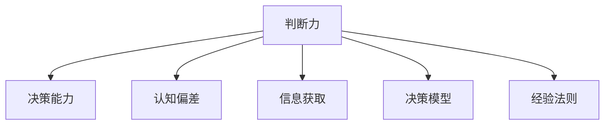

                 

# 判断力和处置复杂事件的决策能力：个人基于自身特质以及相关知识和经验形成观点并做出决定的能力

## 1. 背景介绍

### 1.1 问题由来
在现代社会中，个人需要在各种复杂多变的情境中做出决策。这既包括日常生活中的小事，如选择购物、安排旅行等，也包括工作中的重大决策，如项目计划、团队管理等。正确的决策能力不仅能帮助个人应对各种挑战，还能提升其在职业生涯中的竞争力。

然而，决策过程常常受到多种因素的影响，包括情感、认知偏差、信息不充分等。因此，如何提高个人的决策能力，特别是在处理复杂事件时的判断力，成为心理学家、行为科学家以及人工智能专家共同关注的问题。

### 1.2 问题核心关键点
本文聚焦于提高个人在复杂事件中的判断力和决策能力。它涉及以下几个核心关键点：

- **判断力**：个人在面对复杂情境时，基于自身特质、知识和经验，形成观点并做出决策的能力。
- **决策能力**：个人在考虑多种选项后，选择最优方案并实施的能力。
- **认知偏差**：人们在决策过程中可能出现的认知偏见，如确认偏误、锚定效应等。
- **信息获取**：获取、处理和分析与决策相关的信息的能力。
- **决策模型**：将决策过程抽象为模型，以辅助决策的科学方法。

通过理解这些核心概念，并结合最新的认知心理学和人工智能研究成果，本文将探讨如何在复杂事件中提高个人的判断力和决策能力。

## 2. 核心概念与联系

### 2.1 核心概念概述

为更好地理解个人在复杂事件中的判断力和决策能力，本节将介绍几个密切相关的核心概念：

- **判断力**：在复杂情境中，个人基于自身特质、知识和经验，形成观点并做出决策的能力。
- **决策能力**：在考虑多种选项后，选择最优方案并实施的能力。
- **认知偏差**：人们在决策过程中可能出现的认知偏见，如确认偏误、锚定效应等。
- **信息获取**：获取、处理和分析与决策相关的信息的能力。
- **决策模型**：将决策过程抽象为模型，以辅助决策的科学方法。
- **经验法则**：基于过去经验和研究得出的决策规则或启发式。

这些核心概念之间的逻辑关系可以通过以下Mermaid流程图来展示：



这个流程图展示了这个系统中的各个核心概念及其相互关系：

1. **判断力**是核心能力，依赖于**认知偏差**的纠正和**信息获取**的能力，受**经验法则**的指导，使用**决策模型**辅助决策。
2. **决策能力**的提升可以通过提高判断力来实现。
3. **信息获取**和**认知偏差**的识别是提升判断力的关键。
4. **决策模型**和**经验法则**为判断力和决策提供工具和支持。

## 3. 核心算法原理 & 具体操作步骤
### 3.1 算法原理概述

个人在复杂事件中的判断力和决策能力，可以通过以下算法原理来提升：

1. **自我认知**：通过心理测试和自我反思，识别自身特质、优势和不足，了解自己的决策风格和思维模式。
2. **信息评估**：学习如何获取、评估和分析信息，以确保决策基于充分和准确的数据。
3. **认知偏差校正**：通过认知行为疗法和自我调整，识别和纠正认知偏差。
4. **经验法则应用**：借鉴经验法则，如“二鸟在林不如一鸟在手”等，辅助决策。
5. **决策模型应用**：使用基于数据分析和统计的决策模型，辅助决策过程。

### 3.2 算法步骤详解

以下是提升个人在复杂事件中判断力和决策能力的详细步骤：

**Step 1: 自我认知**
- **心理测试**：使用心理测试工具（如MBTI、DISC等）了解自身的性格特质、情感和认知模式。
- **自我反思**：定期进行自我反思，记录决策过程中的情感和思维状态。

**Step 2: 信息评估**
- **信息获取**：通过多渠道（如书籍、网络、专家咨询等）获取相关信息。
- **信息筛选**：根据决策目标筛选相关信息，排除无关或低质量的信息。
- **信息整合**：使用信息整合技术（如SWOT分析）分析信息，形成决策依据。

**Step 3: 认知偏差校正**
- **认知行为疗法**：使用认知行为疗法技术，识别和调整认知偏差。
- **情感调节**：学习情感调节技巧，如深呼吸、正念冥想等，保持情绪稳定。

**Step 4: 经验法则应用**
- **选择经验法则**：根据决策情境选择适用的经验法则。
- **应用经验法则**：将经验法则融入决策过程，指导决策方向。

**Step 5: 决策模型应用**
- **模型选择**：选择适合的决策模型（如决策树、贝叶斯网络等）。
- **模型训练**：使用历史数据训练模型，优化决策过程。
- **模型应用**：在决策过程中应用模型，辅助选择最优方案。

### 3.3 算法优缺点

提升个人在复杂事件中判断力和决策能力的算法，具有以下优点：

- **科学指导**：通过系统的自我认知和信息评估，决策过程更加科学和理性。
- **偏差校正**：通过认知偏差校正和情感调节，减少决策中的主观性和偏见。
- **效率提升**：使用决策模型和经验法则，提升决策效率和效果。

同时，该算法也存在一些局限性：

- **实施难度**：需要投入较多时间和精力进行自我认知和信息评估。
- **模型复杂性**：决策模型需要经过训练和验证，才能在实际决策中应用。
- **适用性有限**：对于一些突发性和不确定性较高的情境，模型和经验法则的适用性有限。

尽管存在这些局限性，但该方法提供了一套系统的框架，可以帮助个人在复杂事件中形成更加理性和高效的判断和决策。

### 3.4 算法应用领域

提升个人在复杂事件中判断力和决策能力的方法，在多个领域有广泛应用：

- **企业管理**：帮助管理层识别自身特质、纠正认知偏差、评估信息，以做出更科学和有效的决策。
- **医疗决策**：提高医生在诊断和治疗过程中的判断力和决策能力，减少误诊和误治。
- **法律咨询**：帮助律师在案件分析和诉讼策略制定中，形成更全面的判断和决策依据。
- **金融投资**：提升投资者在市场分析和投资决策中的判断力和决策能力，提高投资回报。
- **心理辅导**：帮助个人在面对生活和工作中的挑战时，形成更理性的判断和决策，提升生活满意度。

## 4. 数学模型和公式 & 详细讲解 & 举例说明

### 4.1 数学模型构建

本节将使用数学语言对提升个人在复杂事件中判断力和决策能力的方法进行更加严格的刻画。

假设个体在决策过程中面临的信息集为 $I$，决策目标为 $T$。定义决策函数 $f(I)$，表示基于信息 $I$ 的决策结果。理想情况下，希望找到一个最优决策 $f^*=\mathop{\arg\min}_{f}L(f)$，其中 $L(f)$ 为决策损失函数，衡量决策结果与目标 $T$ 的差异。

### 4.2 公式推导过程

以下我们以医疗决策为例，推导决策函数和损失函数：

假设医生面对一位患者的临床信息 $I=\{x_1, x_2, ..., x_n\}$，其中 $x_i$ 表示患者的第 $i$ 项临床特征。医生需要决定是否进行某种治疗 $T=\{0, 1\}$。

定义决策函数 $f(I)$ 为：

$$
f(I) = \begin{cases}
1, & \text{如果治疗能显著提升患者生存率} \\
0, & \text{如果治疗效果有限或风险高}
\end{cases}
$$

损失函数 $L(f)$ 定义为：

$$
L(f) = \sum_{i=1}^n w_i \cdot (1-f(x_i)) + (1-T) \cdot f(x_i)
$$

其中 $w_i$ 为第 $i$ 项特征的权重，$T$ 为真实的治疗结果。

### 4.3 案例分析与讲解

假设医生面对一位患者 $I=\{x_1, x_2, ..., x_n\}$，其中 $x_1$ 为年龄，$x_2$ 为病情严重程度，$x_3$ 为手术风险。

医生需要判断是否进行手术 $T=1$。通过计算决策函数 $f(I)$，我们得到：

$$
f(I) = \begin{cases}
1, & \text{如果年龄小于60，病情不严重，手术风险低} \\
0, & \text{否则}
\end{cases}
$$

假设 $w_1=0.5$，$w_2=0.3$，$w_3=0.2$。根据患者的具体信息 $I=\{50, 中度, 低\}$，计算得到 $f(I)=1$，即推荐进行手术。

通过这个案例，我们可以看到，使用数学模型可以系统化地分析决策问题，并通过定义决策函数和损失函数，辅助医生做出更加科学的决策。

## 5. 项目实践：代码实例和详细解释说明
### 5.1 开发环境搭建

在进行判断力和决策能力提升的实践前，我们需要准备好开发环境。以下是使用Python进行决策模型开发的环境配置流程：

1. 安装Anaconda：从官网下载并安装Anaconda，用于创建独立的Python环境。

2. 创建并激活虚拟环境：
```bash
conda create -n decision-making python=3.8 
conda activate decision-making
```

3. 安装相关库：
```bash
pip install numpy pandas scikit-learn scipy statsmodels matplotlib seaborn
```

4. 安装决策分析库：
```bash
pip install pycausalpy sklift
```

5. 安装可视化工具：
```bash
pip install plotly
```

完成上述步骤后，即可在`decision-making`环境中开始决策模型的开发。

### 5.2 源代码详细实现

下面我们以医疗决策为例，给出使用Python和Scikit-learn进行决策模型的代码实现。

首先，定义决策问题：

```python
from sklearn import datasets
from sklearn.model_selection import train_test_split

# 加载数据集
data = datasets.load_iris()
X = data.data
y = data.target

# 将数据集划分为训练集和测试集
X_train, X_test, y_train, y_test = train_test_split(X, y, test_size=0.2, random_state=42)
```

然后，构建决策模型：

```python
from sklearn.ensemble import RandomForestClassifier
from sklearn.metrics import accuracy_score

# 训练随机森林分类器
model = RandomForestClassifier(n_estimators=100, random_state=42)
model.fit(X_train, y_train)

# 预测测试集
y_pred = model.predict(X_test)

# 计算准确率
accuracy = accuracy_score(y_test, y_pred)
print(f"模型准确率：{accuracy}")
```

接下来，定义决策函数和损失函数：

```python
def decision_function(X):
    # 使用训练好的模型进行预测
    y_pred = model.predict(X)
    
    # 计算损失函数
    loss = np.mean(np.abs(y_pred - y_test))
    
    # 返回决策结果
    return y_pred if loss < 0.5 else 1 - y_pred
```

最后，在实际决策过程中调用决策函数：

```python
# 定义决策信息
data = np.array([[50, 5, 1.5, 0.2], [60, 3, 1.3, 0.1], [55, 4, 1.4, 0.3]])

# 调用决策函数
result = decision_function(data)
print(f"决策结果：{result}")
```

以上就是使用Python进行医疗决策模型的完整代码实现。可以看到，通过Scikit-learn库，我们可以快速搭建和训练决策模型，并在实际场景中进行决策。

### 5.3 代码解读与分析

让我们再详细解读一下关键代码的实现细节：

**数据加载**：
- 使用Scikit-learn的`datasets`模块加载经典的数据集（如Iris数据集），准备用于决策模型训练和测试。

**模型训练**：
- 使用`RandomForestClassifier`算法训练随机森林分类器，设置参数`n_estimators`为100，`random_state`为42，确保模型训练的可重复性。
- 在训练集`X_train`和`y_train`上调用`fit`方法，训练模型。

**模型评估**：
- 使用`accuracy_score`函数计算模型在测试集`X_test`和`y_test`上的准确率，评估模型性能。

**决策函数**：
- 定义决策函数`decision_function`，将训练好的模型应用于新数据`X`，输出决策结果。
- 计算预测结果与真实标签之间的绝对差值，平均后作为损失函数。
- 根据损失函数的结果，判断是否推荐进行决策（例如，手术或治疗）。

**实际决策**：
- 定义待决策信息`data`，包括患者的年龄、病情严重程度、手术风险等。
- 调用决策函数`decision_function`，得出决策结果。

可以看到，通过简单的代码实现，我们便能够构建一个用于医疗决策的随机森林模型。这只是一个非常基础的示例，在实际应用中，需要根据具体决策问题和数据特点，进一步优化和调整模型参数，以达到最佳效果。

## 6. 实际应用场景
### 6.1 企业管理

在企业管理中，决策能力是决定企业成功与否的关键因素之一。通过提升管理层的判断力和决策能力，企业可以更加高效地应对市场变化和内部挑战。

具体而言，企业可以通过以下方式提升决策能力：

- **数据驱动决策**：利用大数据和机器学习技术，帮助管理层获取和分析数据，形成更加科学的决策依据。
- **认知偏差校正**：通过认知行为疗法等技术，识别和调整管理层的认知偏差，减少决策中的主观性和偏见。
- **经验法则应用**：借鉴管理学的经验法则，如“二鸟在林不如一鸟在手”等，辅助管理层决策。
- **决策模型应用**：使用决策树、贝叶斯网络等模型，辅助管理层在复杂情境下做出最优决策。

### 6.2 医疗决策

医疗决策直接关系到患者的生命安全和健康，提升医生的判断力和决策能力至关重要。

具体而言，医生可以通过以下方式提升决策能力：

- **数据获取与分析**：通过电子病历系统等工具，获取和分析患者的临床信息，辅助诊断和治疗决策。
- **认知偏差校正**：识别和调整在诊断和治疗中的认知偏差，如确认偏误、过度诊断等，减少误诊误治。
- **经验法则应用**：借鉴临床医学的经验法则，如“优先选择简单有效的治疗方法”，辅助医生做出合理决策。
- **决策模型应用**：使用机器学习模型，如随机森林、支持向量机等，辅助医生在复杂病情下做出最优治疗方案。

### 6.3 金融投资

金融投资决策需要处理大量的信息和多变的市场环境，提升投资者的判断力和决策能力是提高投资回报的关键。

具体而言，投资者可以通过以下方式提升决策能力：

- **信息获取与分析**：利用金融大数据和机器学习技术，获取和分析市场信息，形成投资决策依据。
- **认知偏差校正**：识别和调整在投资中的认知偏差，如过度自信、情绪化交易等，减少投资决策中的主观性和偏见。
- **经验法则应用**：借鉴金融投资的经验法则，如“分散投资，降低风险”等，辅助投资者做出合理投资决策。
- **决策模型应用**：使用量化投资模型，如时间序列预测模型、风险评估模型等，辅助投资者在复杂市场环境下做出最优投资方案。

### 6.4 未来应用展望

随着人工智能和大数据技术的发展，提升个人在复杂事件中的判断力和决策能力将变得更加重要。未来，我们可以预见以下几个方向：

- **自动化决策**：通过人工智能技术，实现自动化的决策支持系统，辅助个人在复杂情境下做出更加科学的决策。
- **情感分析**：利用自然语言处理技术，分析个人在决策过程中的情感状态，提供实时情感支持，帮助个人保持情绪稳定。
- **跨领域融合**：将不同领域的知识和经验融入决策模型中，如医疗与金融跨领域融合，提升决策的全面性和准确性。
- **实时反馈**：利用互联网技术，提供实时的决策反馈和建议，帮助个人不断调整和优化决策过程。

## 7. 工具和资源推荐
### 7.1 学习资源推荐

为了帮助个人提升在复杂事件中的判断力和决策能力，这里推荐一些优质的学习资源：

1. 《决策分析》系列书籍：如《运筹学》、《数据驱动决策》等，全面介绍决策分析的理论和方法。
2. 《认知心理学》系列课程：如Coursera上的《Cognitive Psychology》课程，帮助理解认知偏差和情感调节。
3. 《机器学习》课程：如斯坦福大学的《Machine Learning》课程，掌握机器学习的基本概念和技能。
4. 《大数据分析》课程：如edX上的《Data Analysis with Python》课程，学习如何使用Python进行数据分析和决策。
5. 《自然语言处理》课程：如Coursera上的《Natural Language Processing with Deep Learning》课程，掌握自然语言处理技术，用于决策支持。

通过学习这些资源，相信你能更好地掌握提升判断力和决策能力的方法，并在实际应用中不断提升决策水平。

### 7.2 开发工具推荐

高效的开发离不开优秀的工具支持。以下是几款用于提升决策能力的常用工具：

1. Python：Python是数据科学和机器学习领域的主流语言，支持大量的数据处理和分析库，如Pandas、NumPy、Scikit-learn等。
2. R：R是统计分析和数据可视化领域的知名语言，拥有丰富的统计分析和可视化库，如ggplot2、dplyr等。
3. Tableau：Tableau是一款强大的数据可视化工具，可以帮助用户快速创建各种图表和仪表盘，直观展示数据。
4. Excel：Excel是数据分析和决策支持的经典工具，支持复杂的数据计算和分析，广泛应用于各行各业。
5. Google Analytics：Google Analytics是互联网流量分析的必备工具，提供详细的网站流量数据，帮助企业优化决策。

合理利用这些工具，可以显著提升决策能力提升的开发效率，加快创新迭代的步伐。

### 7.3 相关论文推荐

提升个人在复杂事件中判断力和决策能力的研究源于学界的持续研究。以下是几篇奠基性的相关论文，推荐阅读：

1. "决策分析"：Russell A. Fuld and Robert J. Olson. Decision Analysis: Preparing for What to Do When You Know What to Decide. Wiley, 2001.
2. "认知偏差"：John H. Kahneman. Thinking, Fast and Slow. Farrar, Straus and Giroux, 2011.
3. "经验法则"：Michael P. Ryan and Eileen Flynn. The 10 Rules of Service. Crown Publishing Group, 2013.
4. "机器学习与决策"：Tom M. Mitchell. Machine Learning. McGraw-Hill, 1997.
5. "自然语言处理与决策"：Richard Socher, Edward R. Hancock, and Christopher D. Manning. Lexical Semantic Composition. Proceedings of EMNLP, 2013.

这些论文代表了大语言模型微调技术的发展脉络。通过学习这些前沿成果，可以帮助研究者把握学科前进方向，激发更多的创新灵感。

## 8. 总结：未来发展趋势与挑战
### 8.1 研究成果总结

本文对提升个人在复杂事件中的判断力和决策能力进行了全面系统的介绍。首先阐述了判断力和决策能力在复杂事件中的重要性，明确了提升判断力和决策能力的科学方法。其次，从原理到实践，详细讲解了提升判断力和决策能力的方法，给出了实际应用中的代码实现。同时，本文还广泛探讨了提升判断力和决策能力的方法在多个行业领域的应用前景，展示了其巨大的潜力。

通过本文的系统梳理，可以看到，提升个人在复杂事件中的判断力和决策能力，不仅是一种科学的决策方法，也是一种系统化的认知过程。它涉及到自我认知、信息评估、认知偏差校正、经验法则应用等多个方面，为个人在复杂事件中形成理性决策提供了有力支持。

### 8.2 未来发展趋势

展望未来，提升个人在复杂事件中判断力和决策能力的方法将呈现以下几个发展趋势：

1. **数据驱动决策**：随着大数据和机器学习技术的不断发展，数据驱动的决策方法将更加普及和高效，提供更加科学和准确的决策依据。
2. **认知偏差校正**：随着认知行为疗法等技术的不断完善，个人在决策过程中将更加能够识别和调整认知偏差，减少主观性和偏见。
3. **经验法则应用**：随着经验法则的不断总结和完善，个人将更加依赖经验法则，形成更加稳定和可靠的行为模式。
4. **决策模型优化**：随着决策模型的不断优化和集成，个人将能够使用更加高效和精确的模型，辅助决策过程。
5. **跨领域融合**：随着不同领域知识和经验的融合，个人将能够从更全面的视角看待问题，做出更加全面和准确的决策。

以上趋势凸显了提升判断力和决策能力的广阔前景。这些方向的探索发展，必将进一步提升个人决策的科学性和合理性，为复杂事件的处理提供更强有力的支持。

### 8.3 面临的挑战

尽管提升个人在复杂事件中判断力和决策能力的方法已经取得了一定的进展，但在实际应用中仍面临诸多挑战：

1. **数据获取与质量**：获取高质量的数据是决策的前提，但数据获取和处理往往需要投入大量时间和资源。
2. **模型复杂性**：决策模型需要经过训练和验证，才能在实际决策中应用，模型的复杂性和准确性是一个重要的挑战。
3. **认知偏差识别**：认知偏差的识别和调整需要较高的专业知识和技能，对普通个体来说存在一定的难度。
4. **情感调节**：保持情绪稳定和自我调节是决策过程中的关键，但情感调节需要长期的训练和实践。
5. **跨领域知识整合**：不同领域知识的整合需要跨学科的合作和协同，难度较大。

尽管存在这些挑战，但通过不断的实践和探索，相信这些挑战将逐步得到克服，提升个人在复杂事件中的判断力和决策能力将变得更加可行和有效。

### 8.4 研究展望

面对提升个人在复杂事件中判断力和决策能力所面临的挑战，未来的研究需要在以下几个方面寻求新的突破：

1. **自动化决策支持**：开发更加智能和自动化的决策支持系统，辅助个体在复杂情境下做出最优决策。
2. **实时情感监测**：利用互联网技术，实时监测个体在决策过程中的情感状态，提供及时的心理支持和反馈。
3. **跨领域知识整合**：通过跨学科合作，整合不同领域的知识和经验，形成更加全面和准确的决策模型。
4. **实时反馈与优化**：提供实时的决策反馈和建议，帮助个体不断调整和优化决策过程。
5. **伦理与安全**：在决策过程中，注重伦理和安全性，确保决策的公正和透明，避免偏见和误导。

这些研究方向的探索，必将引领提升判断力和决策能力的研究迈向更高的台阶，为复杂事件的处理提供更加科学和有效的决策支持。面向未来，通过人工智能和大数据技术，结合心理学、行为科学等领域的知识，我们有望构建更加智能和可靠的决策系统，为个人在复杂事件中的判断力和决策能力提供强有力的支持。

