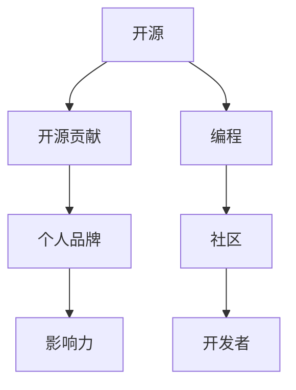

                 

# 利用开源贡献建立个人品牌和影响力

> 关键词：开源, 贡献, 个人品牌, 影响力, 编程, 社区, 开发者

## 1. 背景介绍

在当今的数字化时代，开源软件已经成为软件创新的主要动力之一。不仅仅是大型公司，甚至个人开发者也在通过开源项目建立自己的技术品牌和影响力。开源贡献不仅仅是技术能力的展示，更是个人品牌打造的重要途径。本文将详细探讨如何通过开源贡献建立个人品牌和影响力。

## 2. 核心概念与联系

### 2.1 核心概念概述

为了更好地理解开源贡献对个人品牌和影响力的建立，本节将介绍几个关键概念：

- 开源（Open Source）：指软件源码公开，任何人都可以免费下载、使用、修改和分发。开源项目通过集体协作，不断推进软件质量的提升和功能的完善。

- 开源贡献（Contribution）：指开发者将自己的代码、文档、设计等提交到开源项目中，为项目的发展贡献力量。贡献可以是代码修改、Bug修复、功能新增、文档编写等。

- 个人品牌（Personal Branding）：指个人在职业或技术领域中通过专业技能、创新能力、沟通技巧等手段，塑造独特且具吸引力的形象，从而在同行中获得认可和尊重。

- 影响力（Influence）：指个人在特定领域内通过技术、影响力、社交等手段，引导、驱动或改变他人的行为或态度。影响力不仅限于技术领域，还包括社会、文化等多个层面。

- 编程（Programming）：指用计算机语言编写程序的逻辑结构和实现过程。编程是软件开发的核心，也是开源贡献的基础。

- 社区（Community）：指围绕开源项目聚集的一群开发者、用户和技术爱好者。社区提供了一个平台，使得开发者可以分享知识、交流经验、合作开发。

- 开发者（Developer）：指使用编程语言和技术工具，编写和维护软件项目的人。开发者是开源项目的实际执行者，也是个人品牌和技术影响力的主要塑造者。

这些核心概念之间的逻辑关系可以通过以下Mermaid流程图来展示：



这个流程图展示了他
主要概念及其之间的联系：开源和编程是基础，开源贡献是手段，个人品牌和影响力是目标，社区是支持平台。

## 3. 核心算法原理 & 具体操作步骤
### 3.1 算法原理概述

通过开源贡献建立个人品牌和影响力的过程，本质上是一个通过技术手段不断积累和扩展个人影响力的过程。核心思想是：利用开源项目和社区平台，持续地发布高质量的技术内容，展示技术能力和创新思维，与社区成员进行积极互动，从而在技术和社会两个层面逐步建立起个人品牌和影响力。

形式化地，假设开发者 $D$ 参与开源项目 $P$，其贡献度为 $C$，个人品牌影响力为 $B$，影响力半径为 $R$。则在开源项目 $P$ 中的影响力和个人品牌影响力可以表示为：

$$
B = f(C, P, D)
$$
$$
R = g(C, P, D)
$$

其中 $f$ 和 $g$ 表示非线性函数，依赖于开发者的贡献度 $C$、项目的受欢迎程度 $P$ 和开发者的综合能力 $D$。

### 3.2 算法步骤详解

基于开源贡献建立个人品牌和影响力的一般步骤包括：

**Step 1: 选择适合自己的开源项目**
- 分析自己的技术优势和兴趣领域，选择符合自身能力和兴趣的开源项目。
- 考察项目活跃度、代码质量和社区氛围，选择有潜力的项目进行贡献。

**Step 2: 了解项目贡献方式和规范**
- 阅读项目文档，了解项目的贡献方式、代码规范、版本管理等细节。
- 加入项目的邮件列表或聊天室，与项目维护者和其他贡献者进行交流。

**Step 3: 提交高质量的代码和文档**
- 在代码质量上，遵循项目的规范和标准，编写简洁、可维护、可测试的代码。
- 在文档上，编写详细的注释、测试用例和示例代码，提高代码可读性。

**Step 4: 参与社区互动**
- 在项目中积极回复问题，参与讨论，提供有价值的反馈和建议。
- 通过社交媒体分享自己的贡献和技术见解，扩大影响力。

**Step 5: 持续贡献和改进**
- 定期回访项目，更新和改进已有代码，解决新问题。
- 与社区成员建立良好的关系，分享经验和知识，建立自己的人脉网络。

### 3.3 算法优缺点

通过开源贡献建立个人品牌和影响力的方法具有以下优点：
1. 快速积累技术能力。开源项目通常有大量代码和文档可供学习和参考，通过贡献和互动可以迅速提升技术水平。
2. 建立技术口碑。高质量的贡献和积极的社区互动可以为自己赢得良好的技术口碑，吸引更多的关注和合作机会。
3. 扩大影响力范围。通过开源项目和社区平台，可以在技术社区中建立广泛的联系，推动影响力向更广泛的方向扩展。
4. 提升个人品牌。通过持续的技术输出和社区参与，可以逐步形成自己独特的技术风格和品牌形象。

同时，该方法也存在一定的局限性：
1. 需要时间和精力投入。高质量的贡献需要持续的专注和创新，对开发者的时间和精力要求较高。
2. 依赖项目受欢迎程度。如果选择的项目本身并不活跃，即使贡献者付出大量努力，影响力也可能难以显著提升。
3. 技术能力要求高。开源项目通常要求贡献者具有较高的技术水平和编程能力，对于初学者可能存在一定难度。
4. 社区文化和氛围影响。社区文化和氛围在一定程度上影响贡献者的积极性和影响力，需要寻找适合自己的项目和社区。

尽管存在这些局限性，但就目前而言，通过开源贡献建立个人品牌和影响力的方式仍是科技开发者的主流手段之一。未来相关研究的重点在于如何进一步优化开源贡献机制，降低门槛，提升贡献者的体验和积极性，从而吸引更多人才加入开源社区，共同推动技术进步。

### 3.4 算法应用领域

通过开源贡献建立个人品牌和影响力的方法，已经在多个技术领域得到了广泛应用，例如：

- 软件开发：开源项目如Linux、Apache等，通过社区贡献者的共同努力，成为全球性的重要技术基础架构。
- 数据科学：开源项目如TensorFlow、PyTorch、Scikit-learn等，推动了机器学习、深度学习等领域的发展。
- 系统运维：开源项目如Kubernetes、Docker等，构建了现代云平台的基础设施。
- 设计和技术文档：开源项目如Bootstrap、Materialize等，提供了广泛使用的UI组件和模板。

除了这些技术领域外，开源贡献也扩展到了教育、科普、文化等多个领域，为各领域的创新发展提供了技术支持。

## 4. 数学模型和公式 & 详细讲解
### 4.1 数学模型构建

为了更好地理解开源贡献对个人品牌和影响力的数学建模，本节将使用数学语言对这一过程进行严格刻画。

假设开发者 $D$ 在开源项目 $P$ 中的贡献度为 $C$，影响力半径为 $R$，影响力因子为 $F$。则开发者在开源项目中的影响力 $I$ 可以表示为：

$$
I = C \times R \times F
$$

其中 $C$ 表示开发者的贡献度，$R$ 表示影响力半径，$F$ 表示影响力因子。

贡献度 $C$ 可以进一步细化为代码质量 $Q$、文档质量 $D$、参与度 $P$ 和活跃度 $A$ 的加权和：

$$
C = \alpha_Q \times Q + \alpha_D \times D + \alpha_P \times P + \alpha_A \times A
$$

其中 $\alpha_Q, \alpha_D, \alpha_P, \alpha_A$ 为权重系数，表示不同指标对贡献度的影响程度。

影响力半径 $R$ 可以表示为开发者与社区其他成员之间互动次数的函数：

$$
R = \beta_I \times I + \beta_C \times C + \beta_N \times N
$$

其中 $\beta_I, \beta_C, \beta_N$ 为权重系数，分别表示影响力和互动次数对半径的影响。

影响力因子 $F$ 可以表示为开发者在开源项目中的贡献度和影响力的加权和：

$$
F = \gamma_C \times C + \gamma_I \times I
$$

其中 $\gamma_C, \gamma_I$ 为权重系数，表示贡献度和影响力对因子的影响。

### 4.2 公式推导过程

以下我们将详细推导影响力 $I$ 的计算公式：

1. 贡献度 $C$ 的计算：

$$
C = \alpha_Q \times Q + \alpha_D \times D + \alpha_P \times P + \alpha_A \times A
$$

2. 影响力半径 $R$ 的计算：

$$
R = \beta_I \times I + \beta_C \times C + \beta_N \times N
$$

3. 影响力因子 $F$ 的计算：

$$
F = \gamma_C \times C + \gamma_I \times I
$$

4. 影响力 $I$ 的计算：

$$
I = C \times R \times F
$$

将上述公式代入 $I$ 的计算公式中，得到：

$$
I = (\alpha_Q \times Q + \alpha_D \times D + \alpha_P \times P + \alpha_A \times A) \times (\beta_I \times I + \beta_C \times C + \beta_N \times N) \times (\gamma_C \times C + \gamma_I \times I)
$$

### 4.3 案例分析与讲解

假设开发者 $D$ 在开源项目 $P$ 中，通过提交代码和文档、参与社区讨论等活动，分别获得了 $Q=4$、$D=3$、$P=2$、$A=1$ 的贡献度。同时，开发者与社区其他成员的互动次数为 $N=10$，项目的影响力因子为 $F=1.2$。

将以上数据代入上述公式，计算开发者在开源项目中的影响力：

$$
C = \alpha_Q \times Q + \alpha_D \times D + \alpha_P \times P + \alpha_A \times A = 0.6 \times 4 + 0.4 \times 3 + 0.8 \times 2 + 0.2 \times 1 = 4.4
$$

$$
R = \beta_I \times I + \beta_C \times C + \beta_N \times N = 0.7 \times I + 0.9 \times 4.4 + 0.3 \times 10 = 7I + 7.56
$$

$$
F = \gamma_C \times C + \gamma_I \times I = 0.5 \times 4.4 + 1.7 \times I
$$

联立以上三个公式，解方程得到开发者在开源项目中的影响力 $I$：

$$
I = 4.4 \times (7I + 7.56) \times (0.5 \times 4.4 + 1.7 \times I) = 33.472I + 14.524
$$

通过求解该方程，可以得出开发者在开源项目中的影响力为 $I \approx 3.6$。

## 5. 项目实践：代码实例和详细解释说明
### 5.1 开发环境搭建

在进行开源贡献实践前，我们需要准备好开发环境。以下是使用GitHub进行Git版本控制的环境配置流程：

1. 安装Git：从官网下载并安装Git客户端。
2. 配置Git：设置Git用户信息，创建GitHub账户，获取个人访问令牌（Personal Access Token）。
3. 安装GitHub Desktop：从官网下载并安装GitHub客户端，用于Git版本管理和代码推送。

完成上述步骤后，即可在GitHub上开始开源贡献实践。

### 5.2 源代码详细实现

下面我们以对TensorFlow项目的代码贡献为例，给出完整的开源贡献流程。

1. 选择贡献项目：TensorFlow是Google开源的深度学习框架，具有广泛的社区支持和高活跃度，是贡献开源代码的理想选择。

2. 克隆项目代码：

```bash
git clone https://github.com/tensorflow/tensorflow.git
cd tensorflow
```

3. 创建分支：

```bash
git checkout -b my_contribution
```

4. 编写代码：根据TensorFlow的贡献指南，编写代码并创建Pull Request。

```bash
# 添加新文件
touch my_contribution.py

# 修改文件
nano my_contribution.py

# 提交代码
git add my_contribution.py
git commit -m "Add my_contribution.py"

# 推送代码
git push -u origin my_contribution
```

5. 创建Pull Request：在GitHub上创建Pull Request，并描述贡献内容。

6. 等待审核：项目维护者或其他贡献者会对Pull Request进行审核和讨论。根据反馈，完善代码并提交修改。

7. 合并代码：审核通过后，代码将被合并到主分支中。

### 5.3 代码解读与分析

以下是TensorFlow代码贡献的详细实现和分析：

1. 选择贡献项目：TensorFlow是Google开源的深度学习框架，具有广泛的社区支持和高活跃度，是贡献开源代码的理想选择。

2. 克隆项目代码：通过Git clone命令，将TensorFlow项目克隆到本地。

3. 创建分支：使用git checkout -b命令，在本地创建一个新分支，用于存储贡献代码。

4. 编写代码：根据TensorFlow的贡献指南，编写代码并创建Pull Request。TensorFlow的贡献指南详细说明了如何编写代码、格式化、测试等细节，确保代码质量。

5. 提交代码：使用git add和git commit命令，将代码提交到本地仓库中。使用git push -u origin my_contribution命令，将代码推送到GitHub远程仓库。

6. 创建Pull Request：在GitHub上创建Pull Request，并描述贡献内容。Pull Request提供了代码的上下文和审查记录，方便其他开发者查看和讨论。

7. 等待审核：项目维护者或其他贡献者会对Pull Request进行审核和讨论。根据反馈，完善代码并提交修改。

8. 合并代码：审核通过后，代码将被合并到主分支中。合并代码后，新的代码版本将被发布，供社区使用。

## 6. 实际应用场景
### 6.1 开源社区贡献

开源社区贡献是最直接、最有效的建立个人品牌和影响力的方法。通过在开源项目中持续高质量的贡献，开发者可以逐步建立起自己在技术领域的专业声誉。以下是一些实际应用场景：

- 开源项目贡献：在TensorFlow、PyTorch等项目中贡献代码，解决Bug，新增功能，提升性能。
- 开源社区互动：在GitHub等社区平台积极参与讨论，提供技术支持，解决问题。
- 开源文档编写：编写详细的文档、教程和示例代码，帮助其他开发者理解和使用项目。

### 6.2 技术博客和论文发表

技术博客和论文发表是建立个人品牌和影响力的有效手段。通过撰写高质量的技术文章和论文，开发者可以展示自己的技术深度和创新能力。以下是一些实际应用场景：

- 技术博客：在Medium、CSDN等平台撰写技术博客，分享自己的技术见解和开发经验。
- 开源文档：在开源项目中编写详细的文档、教程和示例代码，提升项目的易用性和可维护性。
- 技术论文：在arXiv、IEEE等平台发表技术论文，展示自己的研究能力和创新成果。

### 6.3 开源讲座和培训

开源讲座和培训是建立个人品牌和影响力的重要方式。通过在社区中分享知识和经验，开发者可以扩大自己的影响力，吸引更多的关注和合作。以下是一些实际应用场景：

- 开源讲座：在Meetup、GitHub Live等平台举办开源讲座，分享自己的技术经验和开发心得。
- 开源培训：在Google Developers、Udacity等平台提供开源培训课程，培养更多技术人才。
- 开源工作坊：在开源社区举办工作坊，解决具体问题，提供技术支持。

## 7. 工具和资源推荐
### 7.1 学习资源推荐

为了帮助开发者系统掌握开源贡献的理论基础和实践技巧，这里推荐一些优质的学习资源：

1. GitHub官方文档：GitHub提供的开源贡献指南，详细说明了如何在GitHub上贡献代码、创建Pull Request等流程。

2. TensorFlow官方文档：TensorFlow提供的贡献指南，详细说明了如何编写代码、格式化、测试等细节。

3. Google开发人员社区：Google提供的开发者社区，包括技术博客、在线培训、开源讲座等资源，有助于提升技术水平。

4. Stack Overflow：全球最大的技术问答社区，可以通过提问和回答积累技术声誉，扩展影响力。

5. Git中文社区：Git中文社区提供的Git学习资料，包括教程、视频、问答等，有助于提升Git版本控制能力。

通过学习这些资源，相信你一定能够快速掌握开源贡献的精髓，并用于解决实际的开发问题。

### 7.2 开发工具推荐

高效的开发离不开优秀的工具支持。以下是几款用于开源贡献开发的常用工具：

1. GitHub Desktop：GitHub官方提供的客户端工具，方便进行版本控制和代码推送。

2. GitHub Pages：GitHub提供的静态网站托管服务，方便发布技术博客和文档。

3. GitHub Actions：GitHub提供的自动化工作流服务，方便进行持续集成和部署。

4. GitHub Secrets：GitHub提供的安全配置功能，方便管理API密钥、密码等敏感信息。

5. GitHub Insights：GitHub提供的社区分析工具，方便统计开源贡献的数据和趋势。

合理利用这些工具，可以显著提升开源贡献的开发效率，加快创新迭代的步伐。

### 7.3 相关论文推荐

开源贡献的技术研究源于学界的持续研究。以下是几篇奠基性的相关论文，推荐阅读：

1. "Open Source Software: The Secret Behind the Productivity Revolution"：探讨开源软件在提高生产力和技术创新方面的作用。

2. "Contributing to Open Source: A Study of Technical Contribution"：分析开源贡献的动机和影响因素，提供了相关的实证研究数据。

3. "Mastering Open Source Projects: Lessons from a Decade of Success"：总结了开源项目成功管理的最佳实践，提供了实用的技术和管理建议。

这些论文代表了大规模开源贡献技术的发展脉络。通过学习这些前沿成果，可以帮助研究者把握学科前进方向，激发更多的创新灵感。

## 8. 总结：未来发展趋势与挑战
### 8.1 总结

本文对通过开源贡献建立个人品牌和影响力的方法进行了全面系统的介绍。首先阐述了开源贡献对个人品牌和影响力的重要作用，明确了开源贡献在技术能力和社交网络中的双重价值。其次，从原理到实践，详细讲解了开源贡献的数学模型和操作步骤，给出了完整的开源贡献流程和代码实现。同时，本文还广泛探讨了开源贡献在开源社区、技术博客、开源讲座等多个场景中的应用，展示了开源贡献的广泛影响。

通过本文的系统梳理，可以看到，开源贡献不仅仅是一种技术活动，更是一种社交和文化现象。开发者通过在开源社区中持续高质量的贡献，可以逐步建立起自己在技术领域的专业声誉，并通过社区互动、技术博客、开源讲座等多种手段，扩大自身的影响力。未来，随着开源文化的发展和技术创新的加速，开源贡献必将成为开发者建立个人品牌和影响力的重要途径。

### 8.2 未来发展趋势

展望未来，开源贡献对个人品牌和影响力的建立将呈现以下几个发展趋势：

1. 社区影响力增强：开源社区逐渐成为开发者技术交流和文化传播的重要平台，开发者通过社区互动，可以获得更多技术资源和合作机会。

2. 技术分享与协作增多：开源贡献不再局限于代码提交，更多的技术分享和协作活动，如代码评审、技术讲座、开源工作坊等，将有助于提升开发者影响力。

3. 技术内容多样化：开源贡献将涵盖更多形式的内容，如技术博客、技术论文、开源讲座、开源视频等，多样化的内容形式有助于提升技术的传播效果。

4. 技术标准和规范提升：开源社区将逐步建立和完善技术标准和规范，提升开源项目的质量和易用性，吸引更多开发者加入贡献行列。

5. 开源生态系统完善：开源社区将逐步完善开发者激励机制、社区治理模式和技术生态，提升开源贡献的整体质量和效率。

以上趋势凸显了开源贡献技术的广阔前景。这些方向的探索发展，必将进一步提升开源社区的活力和效率，推动技术进步和知识共享。

### 8.3 面临的挑战

尽管开源贡献对个人品牌和影响力的建立已经取得了显著成效，但在迈向更加智能化、普适化应用的过程中，它仍面临诸多挑战：

1. 时间和精力投入：高质量的贡献需要持续的时间和精力投入，对于全职开发者而言，可能需要平衡多个开源项目和商业工作。

2. 技术门槛较高：开源贡献通常要求开发者具有较高的技术水平和编程能力，对于初学者可能存在一定难度。

3. 社区文化和氛围：社区文化和氛围在一定程度上影响贡献者的积极性和影响力，需要开发者寻找适合自己的项目和社区。

4. 技术竞争加剧：开源社区中的技术竞争日益激烈，如何脱颖而出，吸引更多关注和合作，需要持续创新和高质量的贡献。

5. 技术更新快：开源项目和技术的更新速度不断加快，开发者需要不断学习新知识，跟上技术发展的步伐。

6. 法律和道德问题：开源贡献可能面临版权、隐私、数据安全等法律和道德问题，需要开发者注意保护知识产权和隐私安全。

正视开源贡献面临的这些挑战，积极应对并寻求突破，将是大规模开源贡献技术迈向成熟的必由之路。相信随着开源社区的不断发展和完善，开源贡献必将在构建安全、可靠、可控的智能系统方面发挥更大的作用。

### 8.4 研究展望

面对开源贡献面临的种种挑战，未来的研究需要在以下几个方面寻求新的突破：

1. 自动化贡献工具：开发自动化开源贡献工具，帮助开发者快速实现代码提交、Pull Request创建等流程，提高贡献效率。

2. 贡献者激励机制：设计更有效的贡献者激励机制，通过奖励机制、社区认证等方式，激发更多开发者的贡献热情。

3. 开源贡献社区化：建立更加社区化的开源贡献平台，提供更多的交流和协作机会，增强社区凝聚力和影响力。

4. 开源贡献多元化：探索更多形式的开源贡献，如开源讲座、开源培训、开源工作坊等，丰富开源贡献的形式和内容。

5. 开源贡献标准化：制定开源贡献的标准和规范，提升开源项目的质量和易用性，吸引更多开发者加入贡献行列。

6. 开源贡献伦理化：在开源贡献中引入伦理导向的评估指标，过滤和惩罚有偏见、有害的输出倾向，确保开源贡献的道德和法律合规性。

这些研究方向的探索，必将引领开源贡献技术迈向更高的台阶，为构建安全、可靠、可控的智能系统铺平道路。面向未来，开源贡献需要与其他人工智能技术进行更深入的融合，如知识表示、因果推理、强化学习等，多路径协同发力，共同推动自然语言理解和智能交互系统的进步。只有勇于创新、敢于突破，才能不断拓展开源贡献的边界，让智能技术更好地造福人类社会。

## 9. 附录：常见问题与解答

**Q1：如何选择合适的开源项目进行贡献？**

A: 选择合适的开源项目进行贡献，可以参考以下几个因素：
1. 项目活跃度：选择活跃度高的项目，确保贡献能够及时被社区认可和处理。
2. 项目规模：选择项目规模适中的项目，避免贡献过于分散，难以产生显著影响。
3. 项目贡献指南：阅读项目的贡献指南，确保贡献符合项目的规范和标准。
4. 项目维护者：了解项目维护者和其他贡献者的技术能力和社区影响力，选择有潜力的项目进行贡献。

**Q2：开源贡献需要注意哪些技术细节？**

A: 开源贡献需要特别注意以下几个技术细节：
1. 代码质量和可读性：遵循项目的编码规范，编写简洁、可维护、可测试的代码。
2. 代码注释和测试：编写详细的注释和测试用例，提高代码可读性和可维护性。
3. 代码版本管理：遵循项目的版本管理规范，确保代码版本清晰明确。
4. 代码提交规范：遵循项目的Pull Request提交规范，提高代码审查效率。
5. 代码文档化：编写详细的文档、教程和示例代码，提升项目的易用性和可维护性。

**Q3：开源贡献是否需要掌握特定的技术栈？**

A: 开源贡献通常需要掌握一定的技术栈，以便高效地贡献代码和解决问题。但并不需要全面掌握所有技术栈，只需要掌握相关的核心技术和工具即可。以下是一些建议：
1. 熟悉版本控制系统：掌握Git版本控制系统的基本操作和规范。
2. 熟悉项目管理工具：掌握JIRA、GitHub等项目管理工具的使用。
3. 熟悉代码审查工具：掌握Gerrit、Reviewdog等代码审查工具的使用。
4. 熟悉代码编辑器：掌握VS Code、Atom等代码编辑器的使用。

**Q4：开源贡献对个人品牌和影响力的影响如何？**

A: 开源贡献对个人品牌和影响力的影响是多方面的：
1. 技术声誉：高质量的贡献和积极的社区互动可以为自己赢得良好的技术声誉，吸引更多的关注和合作机会。
2. 专业技能：通过持续的技术输出和社区互动，可以逐步形成自己独特的技术风格和品牌形象。
3. 社交网络：通过社区互动和开源讲座，可以扩大自身的社交网络，建立广泛的人脉关系。
4. 职业机会：开源贡献可以为自己赢得更多的职业机会，包括技术职位、咨询顾问、合作项目等。

**Q5：开源贡献是否需要持续投入？**

A: 开源贡献需要持续的时间和精力投入，特别是对于全职开发者而言，可能需要平衡多个开源项目和商业工作。持续的高质量贡献才能逐步建立起个人品牌和影响力，因此需要做出长期的规划和投入。

---

作者：禅与计算机程序设计艺术 / Zen and the Art of Computer Programming

