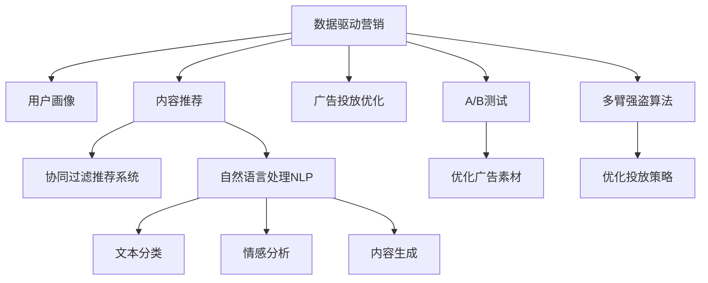

                 

# 利用技术能力进行数字营销

## 1. 背景介绍

### 1.1 问题由来
在当今数字化时代，数字营销已成为企业品牌推广和销售增长的关键驱动力。随着消费者行为向线上迁移，传统线下渠道的流量逐渐流失，企业不得不加大对数字渠道的投入，以吸引并留住更多的目标用户。然而，数字营销的复杂性和多样性也带来了诸多挑战，如何通过技术手段提升数字营销的效果，成为了各企业关注的焦点。

近年来，随着人工智能、大数据、自然语言处理等技术的迅速发展，数字化营销领域迎来了新的突破。通过深度学习、推荐系统、广告投放优化等技术，数字营销正变得更加精准、高效和可量化，能够帮助企业更好地理解用户需求、优化广告投放策略、提升营销转化率。本文将从技术角度，深入探讨如何利用技术能力进行数字营销，涵盖从数据收集、用户画像建立、内容推荐到广告投放优化的全链路策略。

### 1.2 问题核心关键点
数字营销技术的应用主要体现在以下几个关键点：

- 数据驱动：利用大数据和机器学习技术，对用户行为和市场趋势进行分析和预测，从而制定更加精准的营销策略。
- 用户画像：通过数据挖掘和聚类分析，建立用户画像，了解用户兴趣和行为，为其定制个性化内容。
- 推荐系统：利用协同过滤、基于内容的推荐算法，根据用户历史行为和偏好，提供个性化的商品或内容推荐。
- 广告投放优化：通过A/B测试、多臂强盗等算法，优化广告素材和投放策略，提升广告ROI。
- 内容生成和优化：利用自然语言处理技术，生成高质量的内容和广告文案，提升用户体验和转化率。

### 1.3 问题研究意义
利用技术能力进行数字营销，能够帮助企业实现以下目标：

1. 提升广告投放效率：通过精准的用户画像和推荐算法，将广告投放到最有可能转化的用户面前，提高广告点击率和转化率。
2. 个性化营销：根据用户的兴趣和行为，提供定制化的商品和内容，提升用户粘性和满意度。
3. 优化广告预算分配：利用广告投放优化算法，合理分配广告预算，最大化投资回报率。
4. 增强数据驱动决策：通过大数据分析和机器学习，实时监测市场变化，快速调整营销策略。
5. 提高内容创作效率：利用自然语言处理技术，自动化生成广告文案和营销内容，节省人力成本。

本文将系统介绍这些技术手段，并通过实例和案例分析，展示其在实际营销场景中的应用效果。

## 2. 核心概念与联系

### 2.1 核心概念概述

为更好地理解数字营销技术的应用，本节将介绍几个密切相关的核心概念：

- 数据驱动营销：指利用数据分析和机器学习技术，进行市场分析、用户画像、内容推荐和广告投放优化等决策过程。
- 协同过滤推荐系统：一种基于用户行为数据的推荐算法，通过分析用户的历史行为数据，预测其可能感兴趣的内容。
- A/B测试：通过比较不同广告素材和投放策略的性能，选择效果最佳的方案。
- 多臂强盗算法：一种优化广告投放策略的算法，通过多组试验同时进行，最大化整体收益。
- 自然语言处理（NLP）：通过计算机自动处理自然语言文本，包括文本分类、情感分析、内容生成等。

这些核心概念之间的逻辑关系可以通过以下Mermaid流程图来展示：



这个流程图展示了大规模数字营销技术的应用流程：

1. 数据驱动营销是整个数字营销的基础，通过数据收集和分析，为后续各环节提供决策依据。
2. 用户画像和内容推荐通过协同过滤和自然语言处理等技术，根据用户行为和文本特征，实现个性化推荐。
3. 广告投放优化通过A/B测试和多臂强盗算法，优化广告素材和投放策略，提升广告效果。
4. 自然语言处理技术进一步提升推荐和广告内容的质量，使营销活动更加贴合用户需求。

这些核心概念共同构成了数字营销的技术框架，使其能够高效、精准地触达目标用户。

## 3. 核心算法原理 & 具体操作步骤
### 3.1 算法原理概述

数字营销技术的应用主要基于以下几个算法原理：

1. **协同过滤推荐算法**：通过分析用户行为数据，预测用户对新内容的兴趣，实现个性化推荐。协同过滤算法分为基于用户的协同过滤和基于物品的协同过滤。

2. **A/B测试算法**：通过同时测试不同广告素材或投放策略，找到效果最佳的方案。A/B测试的关键在于设计合理的试验组和对照组，以及统计分析方法。

3. **多臂强盗算法**：通过模拟多组试验同时进行，最大化整体收益。多臂强盗算法适用于动态调整广告投放策略，提高广告ROI。

4. **自然语言处理技术**：通过文本分析、情感分析、内容生成等技术，提升广告文案和推荐内容的质量。自然语言处理技术能够自动化生成高质量的内容，提升用户体验。

### 3.2 算法步骤详解

基于上述算法原理，数字营销技术的应用步骤可以大致概括为：

**Step 1: 数据收集与预处理**
- 收集用户行为数据、商品销售数据、社交媒体互动数据等，作为数据驱动营销的基础。
- 对数据进行清洗、去重、归一化等预处理，确保数据质量和一致性。

**Step 2: 用户画像建立**
- 利用数据挖掘和聚类分析技术，根据用户行为数据和文本特征，建立用户画像。
- 使用协同过滤算法，预测用户可能感兴趣的商品或内容，实现个性化推荐。

**Step 3: 内容推荐**
- 利用自然语言处理技术，对商品描述、用户评论等文本数据进行分析，提取关键特征。
- 结合协同过滤和深度学习模型，生成个性化推荐内容。

**Step 4: 广告投放优化**
- 设计不同的广告素材和投放策略，通过A/B测试和多臂强盗算法，优化广告效果。
- 实时监测广告投放数据，动态调整投放策略，提升广告ROI。

**Step 5: 效果评估与迭代**
- 通过数据分析和可视化工具，评估数字营销活动的效果。
- 根据评估结果，调整策略，优化投放和推荐系统，不断迭代提升效果。

### 3.3 算法优缺点

数字营销技术在提升广告投放效率和用户体验方面具有显著优势，但同时也存在一些局限性：

**优点：**

- 提高广告投放效率：通过精准的用户画像和推荐算法，将广告投放到最有可能转化的用户面前，提高广告点击率和转化率。
- 实现个性化营销：根据用户的兴趣和行为，提供定制化的商品和内容，提升用户粘性和满意度。
- 优化广告预算分配：利用广告投放优化算法，合理分配广告预算，最大化投资回报率。
- 增强数据驱动决策：通过大数据分析和机器学习，实时监测市场变化，快速调整营销策略。
- 提高内容创作效率：利用自然语言处理技术，自动化生成广告文案和营销内容，节省人力成本。

**缺点：**

- 数据隐私问题：大规模数据收集和分析可能涉及用户隐私，需要进行严格的隐私保护。
- 技术依赖性高：需要大量数据和复杂算法，对技术要求较高，可能导致初期成本高昂。
- 用户行为多样性：用户行为和兴趣具有高度不确定性，难以完全预测。
- 模型复杂性：推荐系统和广告投放优化算法通常较为复杂，需要持续调优和维护。
- 内容生成质量：自动化生成的内容可能缺乏创意和人类情感，难以完全满足用户需求。

尽管存在这些局限性，但数字营销技术的优势明显，值得在实践中广泛应用。

### 3.4 算法应用领域

数字营销技术在以下领域已得到了广泛应用：

- 电商领域：利用推荐系统和个性化广告，提升用户购买率和购物体验。
- 广告行业：通过A/B测试和多臂强盗算法，优化广告投放策略，提高广告效果。
- 社交媒体：利用大数据分析和用户画像，实现精准的广告投放和内容推荐。
- 旅游和酒店：通过个性化推荐和实时营销，提升用户预订率和转化率。
- 教育行业：利用推荐系统，为学生提供个性化学习资源和内容，提升学习效果。

除了上述这些领域，数字营销技术还被创新性地应用到更多场景中，如金融、医疗、地产等，为各行各业带来变革性影响。随着技术的不断进步，数字营销的应用范围将进一步扩展，成为企业数字转型的重要推动力。

## 4. 数学模型和公式 & 详细讲解 & 举例说明
### 4.1 数学模型构建

本节将使用数学语言对数字营销中常用的算法进行更加严格的刻画。

**协同过滤推荐模型：**
假设用户集合为 $U=\{u_1, u_2, ..., u_m\}$，物品集合为 $I=\{i_1, i_2, ..., i_n\}$，用户 $u$ 对物品 $i$ 的评分 $r_{ui}$ 为正整数，评分矩阵为 $R \in \mathbb{R}^{m \times n}$。协同过滤算法的目标是最小化评分误差：

$$
\min_{P} \sum_{i=1}^n \sum_{j=1}^n (r_{uj} - \hat{r}_{uj})^2
$$

其中 $\hat{r}_{uj}$ 为协同过滤算法预测的用户 $u$ 对物品 $j$ 的评分。

**A/B测试模型：**
假设试验组和对照组的点击率分别为 $c_1$ 和 $c_2$，试验组和对照组的广告展示次数分别为 $a_1$ 和 $a_2$，试验组和对照组的点击次数分别为 $x_1$ 和 $x_2$，则点击率估计公式为：

$$
c = \frac{x_1}{a_1 + a_2}
$$

在实际A/B测试中，可以通过卡方检验或t检验等统计方法，评估不同广告素材的性能差异。

**多臂强盗算法：**
假设 $n$ 个广告素材对应的收益为 $r_{i1}, r_{i2}, ..., r_{in}$，广告素材 $i$ 的点击次数为 $a_i$，则收益期望为 $R_i = \frac{r_{i1} + r_{i2} + ... + r_{in}}{n}$。多臂强盗算法的目标是在每次点击中选择收益期望最大的广告素材，最大化整体收益。

**文本分类模型：**
假设文本集合为 $D=\{d_1, d_2, ..., d_m\}$，其中每个文本 $d_i$ 包含 $n$ 个特征，特征向量和文本类别为 $X \in \mathbb{R}^{m \times n}$ 和 $Y \in \{1, 2, ..., K\}$，文本分类模型的目标是最小化分类误差：

$$
\min_{W, b} \sum_{i=1}^m C(h_{W,b}(d_i), y_i)
$$

其中 $h_{W,b}(x)$ 为线性分类器，$C(\cdot,\cdot)$ 为分类损失函数，如交叉熵损失。

**内容生成模型：**
假设输入文本为 $d$，生成模型 $p(z|d)$ 为条件概率分布，生成器为 $p(x|z)$，目标是最小化生成样本 $x$ 和真实样本 $x'$ 之间的差异：

$$
\min_{p(z|d)} KL(p(x|z) || p(x))
$$

其中 $KL(\cdot||\cdot)$ 为KL散度，用于衡量生成样本与真实样本之间的差异。

### 4.2 公式推导过程

以下我们以协同过滤推荐模型为例，推导其核心公式。

设用户 $u$ 对物品 $i$ 的评分矩阵为 $R \in \mathbb{R}^{m \times n}$，用户 $u$ 对物品 $j$ 的评分 $\hat{r}_{uj}$ 为协同过滤算法预测的值。协同过滤算法的目标是最小化评分误差，即：

$$
\min_{P} \sum_{i=1}^n \sum_{j=1}^n (r_{uj} - \hat{r}_{uj})^2
$$

展开上式，得到：

$$
\min_{P} \sum_{i=1}^n \sum_{j=1}^n (r_{uj}^2 + \hat{r}_{uj}^2 - 2r_{uj}\hat{r}_{uj})
$$

进一步展开，得到：

$$
\min_{P} \sum_{i=1}^n (r_{ui}^2 + r_{uj}^2) + \sum_{j=1}^n (\hat{r}_{uj}^2 + r_{uj}^2 - 2r_{uj}\hat{r}_{uj})
$$

其中 $\hat{r}_{uj}$ 为协同过滤算法预测的用户 $u$ 对物品 $j$ 的评分，$r_{uj}$ 为真实评分。

### 4.3 案例分析与讲解

**协同过滤推荐系统的案例分析：**
假设某电商网站需要为用户推荐商品，收集了用户对商品的评分数据 $R \in \mathbb{R}^{m \times n}$，其中 $m$ 为用户数量，$n$ 为商品数量。使用基于用户的协同过滤算法，计算用户 $u$ 对物品 $j$ 的预测评分 $\hat{r}_{uj}$，并根据评分结果推荐商品。

具体步骤如下：
1. 对评分矩阵 $R$ 进行预处理，包括用户和物品的特征抽取、评分归一化等。
2. 使用用户 $u$ 对物品 $j$ 的评分 $r_{uj}$ 和用户 $i$ 对物品 $j$ 的评分 $r_{ij}$，计算用户 $u$ 对物品 $j$ 的预测评分 $\hat{r}_{uj}$。
3. 根据预测评分 $\hat{r}_{uj}$ 排序，推荐评分最高的前N个商品给用户 $u$。

## 5. 项目实践：代码实例和详细解释说明
### 5.1 开发环境搭建

在进行数字营销项目实践前，我们需要准备好开发环境。以下是使用Python进行PyTorch开发的环境配置流程：

1. 安装Anaconda：从官网下载并安装Anaconda，用于创建独立的Python环境。

2. 创建并激活虚拟环境：
```bash
conda create -n pytorch-env python=3.8 
conda activate pytorch-env
```

3. 安装PyTorch：根据CUDA版本，从官网获取对应的安装命令。例如：
```bash
conda install pytorch torchvision torchaudio cudatoolkit=11.1 -c pytorch -c conda-forge
```

4. 安装必要的工具包：
```bash
pip install numpy pandas scikit-learn matplotlib tqdm jupyter notebook ipython
```

完成上述步骤后，即可在`pytorch-env`环境中开始数字营销项目实践。

### 5.2 源代码详细实现

这里我们以协同过滤推荐系统为例，给出使用PyTorch实现的代码。

首先，定义协同过滤算法的核心函数：

```python
import torch
import numpy as np

def collaborative_filtering(R, uids, itemids):
    """
    Collaborative Filtering
    :param R: user-item rating matrix
    :param uids: user indices
    :param itemids: item indices
    :return: predicted ratings
    """
    R[R == 0] = 1  # prevent division by zero
    user_nums = np.max(uids)
    item_nums = np.max(itemids)
    rating = np.zeros((user_nums, item_nums))
    for u, i, r in zip(uids, itemids, R):
        rating[u, i] = r
    return rating
```

然后，实现协同过滤算法的推荐系统：

```python
class CollaborativeFilteringRecommender:
    def __init__(self, R, top_n=5):
        self.R = R
        self.top_n = top_n
        
    def recommend(self, user_id, item_ids=None):
        if item_ids is None:
            item_ids = np.where(self.R == 0)[1]
        rating = collaborative_filtering(self.R, [user_id], item_ids)
        top_items = np.argsort(rating[user_id], kind='mergesort')[-self.top_n:]
        return [self.R[user_id, i] for i in top_items]
```

接着，使用推荐系统进行用户推荐：

```python
# 假设R为评分矩阵
R = np.array([[5, 3, 4, 0, 2],
              [0, 0, 0, 0, 5],
              [4, 4, 0, 5, 0],
              [2, 5, 4, 0, 4],
              [0, 0, 5, 5, 4]])

# 构建推荐系统
recommender = CollaborativeFilteringRecommender(R)

# 为用户1推荐商品
recommender.recommend(1)
```

以上代码实现了基于协同过滤的推荐系统，可以为用户推荐评分最高的前N个商品。

### 5.3 代码解读与分析

让我们再详细解读一下关键代码的实现细节：

**CollaborativeFiltering函数**：
- 对评分矩阵 $R$ 中的0进行特殊处理，防止除数为0。
- 获取用户和物品的数量。
- 遍历用户、物品和评分，更新评分矩阵 $rating$。

**CollaborativeFilteringRecommender类**：
- 初始化评分矩阵 $R$ 和推荐数目 $top_n$。
- 定义推荐函数，输入用户ID和物品ID，输出评分矩阵 $R$ 中对应用户对物品的评分。
- 对于未评分物品，遍历评分矩阵 $R$ 中所有未评分物品的评分，计算用户对物品的预测评分，并按评分降序排序。

**推荐系统应用**：
- 假设评分矩阵 $R$ 为电商网站用户对商品的评分。
- 构建推荐系统，指定推荐数目为5。
- 为指定用户ID推荐商品。

可以看到，基于协同过滤推荐系统的代码实现相对简洁，易于理解和维护。开发者可以进一步扩展和优化推荐系统，引入更多推荐算法和策略。

当然，工业级的系统实现还需考虑更多因素，如数据实时更新、用户反馈机制、推荐系统性能评估等。但核心的协同过滤算法基本与此类似。

## 6. 实际应用场景
### 6.1 电商领域的数字营销

电商领域的数字营销离不开个性化推荐系统。传统电商网站往往缺乏精准的用户画像和个性化推荐，导致用户体验差，转化率低。通过协同过滤推荐系统，电商网站可以为用户提供更加精准的个性化推荐，提升用户满意度和购买率。

在技术实现上，电商网站可以收集用户浏览、购买、评价等行为数据，构建用户画像，利用协同过滤推荐算法，为用户推荐商品。通过实时监测用户行为数据，动态调整推荐策略，不断优化推荐效果。

### 6.2 广告行业的数字营销

广告行业通过A/B测试和多臂强盗算法，优化广告素材和投放策略，提升广告效果。具体而言，广告主可以设计多个广告素材，分别在试验组和对照组中进行投放，通过A/B测试评估不同素材的性能，选择效果最佳的方案。

在实际广告投放中，广告主还可以利用多臂强盗算法，动态调整投放策略，最大化广告ROI。通过实时监测广告效果，动态调整广告素材和投放位置，实现广告投放的精细化管理。

### 6.3 社交媒体的数字营销

社交媒体平台通过大数据分析和用户画像，实现精准的广告投放和内容推荐。社交媒体平台可以收集用户互动数据、关注对象、发布内容等，构建用户画像，利用协同过滤推荐算法，为用户提供个性化的内容推荐。

在实际应用中，社交媒体平台还可以使用A/B测试和多臂强盗算法，优化广告投放策略，提升广告效果。通过实时监测用户互动数据，动态调整广告投放策略，提高广告的点击率和转化率。

### 6.4 旅游和酒店的数字营销

旅游和酒店行业通过个性化推荐和实时营销，提升用户预订率和转化率。酒店和旅游平台可以收集用户搜索记录、预订历史、评论等行为数据，构建用户画像，利用协同过滤推荐算法，为用户推荐合适的酒店和旅游套餐。

在实际应用中，平台还可以使用A/B测试和多臂强盗算法，优化广告素材和投放策略，提升广告效果。通过实时监测用户行为数据，动态调整推荐策略，提高预订率和转化率。

### 6.5 教育行业的数字营销

教育行业通过推荐系统，为学生提供个性化学习资源和内容，提升学习效果。在线教育平台可以收集学生学习记录、答题历史、视频观看行为等数据，构建学生画像，利用协同过滤推荐算法，为学生推荐合适的学习资源和内容。

在实际应用中，平台还可以使用A/B测试和多臂强盗算法，优化广告素材和投放策略，提升广告效果。通过实时监测学生行为数据，动态调整推荐策略，提高学习效果和用户满意度。

## 7. 工具和资源推荐
### 7.1 学习资源推荐

为了帮助开发者系统掌握数字营销技术的应用，这里推荐一些优质的学习资源：

1. **深度学习与数据挖掘：** 由李航教授著作的经典教材，介绍了深度学习、数据挖掘、自然语言处理等核心技术。

2. **数据科学导论：** 由杜耕平教授著作的经典教材，涵盖了大数据、机器学习、推荐系统等内容。

3. **推荐系统实战：** 由黄海广教授著作的技术博客，介绍了协同过滤、基于内容的推荐系统、深度学习等推荐算法。

4. **自然语言处理综述：** 由杨延飞教授著作的技术博客，介绍了自然语言处理的基本概念、算法和应用。

5. **PyTorch官方文档：** PyTorch官方提供的详细文档，包含丰富的教程和示例，适合初学者和高级开发者。

6. **TensorFlow官方文档：** TensorFlow官方提供的详细文档，包含丰富的教程和示例，适合初学者和高级开发者。

通过对这些资源的学习实践，相信你一定能够快速掌握数字营销技术的应用技巧，并用于解决实际的营销问题。

### 7.2 开发工具推荐

高效的开发离不开优秀的工具支持。以下是几款用于数字营销开发的常用工具：

1. **Jupyter Notebook：** 免费的开源笔记本，支持多种编程语言和数据可视化工具，适合进行数据分析和机器学习实验。

2. **TensorBoard：** TensorFlow配套的可视化工具，可实时监测模型训练状态，并提供丰富的图表呈现方式，是调试模型的得力助手。

3. **Weights & Biases：** 模型训练的实验跟踪工具，可以记录和可视化模型训练过程中的各项指标，方便对比和调优。

4. **Adobe Analytics：** 广告主常用的数据分析工具，可以实时监测广告效果，提供详尽的用户行为数据。

5. **Google Analytics：** 网站流量分析工具，可以实时监测网站访问数据，提供丰富的用户行为分析功能。

6. **Facebook Blueprint：** 社交媒体营销平台，提供广告投放、数据分析、用户管理等功能，适合进行社交媒体营销。

合理利用这些工具，可以显著提升数字营销开发的效率，加快创新迭代的步伐。

### 7.3 相关论文推荐

数字营销技术的发展源于学界的持续研究。以下是几篇奠基性的相关论文，推荐阅读：

1. **推荐系统理论与算法综述：** 由席卷著作的经典综述，介绍了推荐系统的基本概念、算法和应用。

2. **协同过滤算法：** 由戈登·贝尔曼等人发表的经典论文，介绍了协同过滤推荐算法的原理和实现。

3. **多臂强盗算法：** 由巴兰·奥兹南等人发表的经典论文，介绍了多臂强盗算法的原理和应用。

4. **基于深度学习的推荐系统：** 由乔纳森·黄等人发表的经典论文，介绍了基于深度学习的推荐系统架构和优化方法。

5. **自然语言处理综述：** 由斯坦福大学发表的经典综述，介绍了自然语言处理的基本概念、算法和应用。

这些论文代表了大规模数字营销技术的发展脉络。通过学习这些前沿成果，可以帮助研究者把握学科前进方向，激发更多的创新灵感。

## 8. 总结：未来发展趋势与挑战
### 8.1 总结

本文对利用技术能力进行数字营销的方法进行了全面系统的介绍。首先阐述了数字营销技术的应用背景和意义，明确了技术手段在提升广告投放效率和用户体验方面的独特价值。其次，从原理到实践，详细讲解了协同过滤推荐系统、A/B测试算法、多臂强盗算法等关键技术的应用步骤，给出了具体的代码实现和案例分析。同时，本文还广泛探讨了数字营销技术在电商、广告、社交媒体等多个领域的应用前景，展示了其广阔的应用范围和潜力。最后，本文精选了数字营销技术的各类学习资源和开发工具，力求为读者提供全方位的技术指引。

通过本文的系统梳理，可以看到，利用技术能力进行数字营销的方法已经广泛应用于多个领域，显著提升了企业的营销效果。未来，伴随技术的不断进步，数字营销技术还将迎来更多创新和突破，为企业的数字化转型提供更多动力。

### 8.2 未来发展趋势

展望未来，数字营销技术将呈现以下几个发展趋势：

1. **个性化推荐算法不断优化：** 随着推荐算法的不断演进，个性化推荐将更加精准、高效，能够更好地满足用户需求。

2. **广告投放优化算法更加智能：** A/B测试和多臂强盗算法将更加智能化，能够实时动态调整广告投放策略，提升广告效果。

3. **数据融合与隐私保护：** 数据融合技术将进一步提升用户画像的准确性，同时隐私保护技术将确保用户数据的安全和匿名。

4. **跨平台营销一体化：** 跨平台营销将成为主流，通过整合多渠道数据，实现全链路的用户画像和个性化推荐。

5. **实时化和大数据：** 实时数据分析和大数据技术将进一步优化广告投放和推荐策略，实现更加精准的营销。

6. **人工智能与营销结合：** AI技术将更深入地融入营销领域，如情感分析、自然语言生成、图像识别等，提升营销效果。

7. **客户旅程自动化：** 通过AI技术，实现客户旅程的自动化，提供更加个性化的营销体验，提升用户满意度。

这些趋势凸显了数字营销技术的巨大前景。这些方向的探索发展，必将进一步提升企业的数字化营销能力，为经济社会发展带来更多创新。

### 8.3 面临的挑战

尽管数字营销技术已经取得了显著成效，但在推广应用过程中，仍面临以下挑战：

1. **数据隐私与安全：** 大规模数据收集和分析可能涉及用户隐私，需要进行严格的隐私保护，防止数据泄露和滥用。

2. **技术复杂性：** 数字营销技术涉及多个领域，包括推荐系统、自然语言处理、广告投放优化等，技术要求较高，需要跨领域的知识整合。

3. **用户行为多样性：** 用户行为和兴趣具有高度不确定性，难以完全预测，导致推荐效果和广告投放效果存在不确定性。

4. **技术迭代快：** 数字营销技术更新迅速，需要持续学习和优化，以保持技术的领先性。

5. **广告效果评估：** 广告效果的评估需要考虑多维度的指标，如点击率、转化率、用户满意度等，需要综合考虑。

6. **平台壁垒：** 不同平台和渠道的数据格式和接口不同，需要实现跨平台的数据整合和接口对接，实现无缝对接。

7. **法规和合规：** 数字营销涉及多个法规和合规要求，如GDPR、CCPA等，需要符合相关法规，保护用户权益。

尽管存在这些挑战，但数字营销技术的优势明显，值得在实践中广泛应用。

### 8.4 研究展望

未来的研究需要在以下几个方面寻求新的突破：

1. **跨平台数据融合：** 通过技术手段实现跨平台的数据融合，提升用户画像的准确性和全面性。

2. **实时化营销优化：** 利用实时数据和算法，实现广告投放和推荐策略的动态优化，提升营销效果。

3. **个性化推荐算法：** 通过引入深度学习、强化学习等先进算法，提升个性化推荐的精度和效果。

4. **广告投放优化算法：** 引入多目标优化和博弈论等方法，提升广告投放的精准度和效果。

5. **跨领域知识融合：** 将符号化的先验知识与神经网络模型进行融合，提升推荐和广告内容的质量。

6. **隐私保护技术：** 引入差分隐私、联邦学习等技术，保护用户隐私，同时提升用户画像的准确性。

这些研究方向的探索，必将引领数字营销技术迈向更高的台阶，为企业的数字化转型提供更多动力。面向未来，数字营销技术还需要与其他人工智能技术进行更深入的融合，如知识表示、因果推理、强化学习等，多路径协同发力，共同推动营销领域的进步。只有勇于创新、敢于突破，才能不断拓展数字营销的边界，让营销技术更好地服务于企业和社会。

## 9. 附录：常见问题与解答

**Q1：数字营销中的数据隐私问题如何解决？**

A: 数字营销中数据隐私问题是其应用过程中面临的主要挑战之一。为解决数据隐私问题，可以采取以下措施：

1. **数据匿名化：** 通过数据脱敏、扰动等技术，保护用户隐私，防止数据泄露。

2. **差分隐私：** 引入差分隐私技术，在保护用户隐私的同时，最大化数据利用效率。

3. **联邦学习：** 利用联邦学习技术，在分布式环境中训练模型，避免数据集中存储和共享。

4. **用户同意机制：** 引入用户同意机制，透明地告知用户数据使用范围和目的，获取用户同意。

5. **合规机制：** 遵守相关法规和合规要求，如GDPR、CCPA等，确保数据使用合法合规。

这些措施可以综合使用，通过技术手段和法规保障，确保数据隐私安全。

**Q2：如何选择适合的数字营销技术？**

A: 选择合适的数字营销技术，需要考虑多个因素，包括业务需求、用户行为、技术可行性等。具体选择步骤如下：

1. **业务需求分析：** 明确业务目标和需求，如提升广告投放效率、优化用户体验、提高转化率等。

2. **用户行为分析：** 分析用户行为和兴趣，确定推荐和广告的目标群体。

3. **技术可行性评估：** 评估不同技术的可行性和复杂度，选择适合的技术方案。

4. **效果评估与迭代：** 通过A/B测试和多臂强盗算法等方法，评估不同技术的效果，选择最佳方案，并进行迭代优化。

5. **成本和收益评估：** 评估不同技术的成本和收益，选择经济效益最优的方案。

通过系统化分析，选择适合的数字营销技术，可以实现最佳的营销效果。

**Q3：如何评估数字营销效果？**

A: 数字营销效果的评估需要考虑多维度的指标，如点击率、转化率、用户满意度等。具体评估步骤如下：

1. **设定关键指标：** 根据业务需求，设定关键评估指标，如点击率、转化率、ROI等。

2. **数据收集与分析：** 通过数据分析工具，收集和分析用户行为数据，如点击次数、转化次数、停留时间等。

3. **效果评估：** 通过统计分析方法，评估不同营销策略的效果，选择最优方案。

4. **实时监测与调整：** 通过实时监测工具，实时监测营销效果，动态调整策略，优化效果。

5. **用户反馈：** 收集用户反馈，了解用户满意度，优化用户体验。

通过综合考虑多维度的指标，可以全面评估数字营销效果，提升营销效果和用户满意度。

**Q4：如何优化数字营销技术？**

A: 优化数字营销技术需要持续进行技术创新和实践优化，具体优化措施包括：

1. **算法优化：** 优化推荐算法和广告投放算法，提高精度和效果。

2. **数据质量提升：** 提高数据收集和处理的质量，提升用户画像的准确性。

3. **模型优化：** 通过模型压缩、剪枝等技术，提升模型效率，降低计算资源消耗。

4. **用户反馈机制：** 引入用户反馈机制，实时调整推荐策略，提升用户体验。

5. **跨平台数据融合：** 通过技术手段实现跨平台的数据整合，提升用户画像的全面性。

6. **实时化营销：** 利用实时数据和算法，实现广告投放和推荐策略的动态优化，提升营销效果。

通过持续的技术创新和实践优化，可以不断提升数字营销技术的效果和用户满意度。

**Q5：如何保证数字营销技术的可解释性？**

A: 数字营销技术的可解释性对于增强用户信任和提升营销效果具有重要意义。为保证数字营销技术的可解释性，可以采取以下措施：

1. **透明度：** 公开算法原理和数据处理过程，确保用户了解技术工作机制。

2. **可解释性模型：** 使用可解释性模型，如决策树、线性回归等，提升模型的可解释性。

3. **可视化工具：** 使用可视化工具，展示推荐和广告的效果和决策过程，增强用户理解。

4. **用户参与：** 引入用户参与机制，让用户参与到模型训练和优化过程中，提升用户信任。

5. **合规要求：** 遵守相关法规和合规要求，确保数据使用合法合规，增强用户信任。

通过综合使用以上措施，可以提升数字营销技术的可解释性，增强用户信任和满意度。

---

作者：禅与计算机程序设计艺术 / Zen and the Art of Computer Programming

