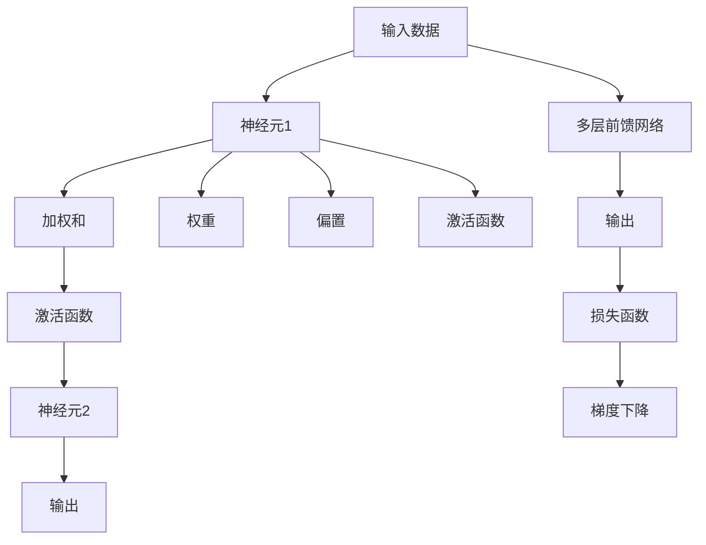

                 

# 前馈网络在AI模型中的应用

## 1. 背景介绍

### 1.1 问题由来

在人工智能领域，神经网络是一种模仿人类神经系统工作方式的计算模型，广泛应用于图像识别、语音识别、自然语言处理等任务。而前馈网络是神经网络的一种，在深度学习中扮演着关键角色，其原理和应用具有重要研究价值。

前馈网络之所以重要，是因为它是许多深度学习架构的基石，如卷积神经网络(CNNs)、递归神经网络(RNNs)、自编码器(AEs)等。它通过逐层向前传递输入信号，最后得到输出结果，这一过程简洁高效，适合于处理各种复杂问题。

### 1.2 问题核心关键点

当前馈网络在AI模型中的应用，涉及以下几个核心关键点：

- 神经元与权重：前馈网络的核心组件是神经元，每个神经元通过加权和激活函数计算得到输出。权重决定了输入与输出之间的关系。
- 激活函数：激活函数用于引入非线性，使模型能够学习复杂的函数映射。
- 损失函数与优化算法：前馈网络的训练需要定义损失函数，并使用优化算法如梯度下降优化权重，以便最小化损失函数。
- 网络结构：前馈网络的结构决定其能力和复杂性，包括网络深度、每层的神经元数量、连接方式等。

## 2. 核心概念与联系

### 2.1 核心概念概述

为更好地理解前馈网络在AI模型中的应用，本节将介绍几个密切相关的核心概念：

- 前馈网络(Feedforward Neural Network, FNN)：一种最简单的神经网络，其中数据只沿一个方向（即“前馈”）流动。前馈网络是深度学习的基石，包括单层前馈网络、多层前馈网络等。
- 神经元(Neuron)：前馈网络的基本计算单元，通常由权重、偏置、激活函数组成。神经元的输入经过加权和后，送入激活函数计算得到输出。
- 权重(Weight)：连接两个神经元的系数，决定输入和输出之间的关系。权重是网络需要优化的关键参数之一。
- 激活函数(Activation Function)：引入非线性的函数，将神经元的加权和转换为输出。常见的激活函数包括sigmoid、ReLU、tanh等。
- 损失函数(Loss Function)：衡量模型预测与真实值之间的差异，常用的损失函数包括均方误差、交叉熵等。
- 梯度下降(Gradient Descent)：一种常用的优化算法，通过反向传播计算梯度，迭代更新权重以最小化损失函数。

这些核心概念之间的逻辑关系可以通过以下Mermaid流程图来展示：



这个流程图展示了前馈网络的核心逻辑：输入数据经过多层的神经元加权和、激活函数处理，最终得到输出结果。同时，通过梯度下降优化损失函数，迭代更新权重和偏置。

## 3. 核心算法原理 & 具体操作步骤
### 3.1 算法原理概述

前馈网络的核心原理是逐层传递输入数据，通过加权和和激活函数计算得到输出结果。其训练过程通过反向传播算法，计算损失函数对权重和偏置的梯度，并使用梯度下降等优化算法迭代更新参数。

假设前馈网络包含 $N$ 层，输入为 $x$，输出为 $y$。第 $i$ 层的神经元数量为 $n_i$，神经元的加权和为 $z_i$，激活函数为 $\sigma$。则前馈网络的计算过程可以表示为：

$$
\begin{aligned}
& z_1 = W_1 x + b_1 \\
& z_2 = W_2 z_1 + b_2 \\
& \cdots \\
& z_N = W_N z_{N-1} + b_N \\
& y = \sigma(z_N)
\end{aligned}
$$

其中，$W_i$ 为第 $i$ 层的权重矩阵，$b_i$ 为偏置向量。激活函数 $\sigma$ 可以将加权和映射为输出。

### 3.2 算法步骤详解

前馈网络的训练通常包括以下几个关键步骤：

**Step 1: 数据预处理**

将原始数据转化为神经网络可以处理的形式，如将图像数据转化为像素矩阵，将文本数据转化为词向量。这一步需要对数据进行标准化、归一化、分批处理等操作。

**Step 2: 模型初始化**

随机初始化神经元的权重和偏置，通常使用正态分布或均匀分布进行初始化。

**Step 3: 前向传播**

将输入数据 $x$ 传递到网络中，计算得到最终的输出 $y$。

**Step 4: 计算损失函数**

根据输出 $y$ 和真实标签 $t$，计算损失函数 $L(y,t)$。常用的损失函数包括均方误差损失、交叉熵损失等。

**Step 5: 反向传播**

通过反向传播算法计算损失函数对权重和偏置的梯度，用于后续的参数更新。

**Step 6: 参数更新**

使用梯度下降等优化算法，根据梯度更新权重和偏置。

**Step 7: 迭代训练**

重复 Step 3 到 Step 6，直至收敛。

### 3.3 算法优缺点

前馈网络具有以下优点：

- 模型简单：前馈网络结构直观，易于理解和实现。
- 训练速度快：前馈网络训练过程中梯度传播简单，训练速度快。
- 通用性高：前馈网络可以应用于各种类型的任务，如图像分类、文本生成、语音识别等。

但同时也存在以下缺点：

- 过拟合风险：前馈网络容易过拟合，特别是在数据量较小的情况下。
- 非局部信息：前馈网络只考虑输入和输出之间的局部关系，难以捕捉长距离依赖。
- 需要大量数据：前馈网络需要大量的标注数据进行训练，训练成本较高。

### 3.4 算法应用领域

前馈网络在AI模型中具有广泛的应用，涵盖以下几个领域：

- 图像识别：前馈网络可以用于图像分类、目标检测、图像分割等任务，如CNN、ResNet、Inception等架构。
- 自然语言处理：前馈网络可以用于文本分类、机器翻译、文本生成等任务，如RNN、LSTM、Transformer等架构。
- 语音识别：前馈网络可以用于语音识别、语音合成等任务，如RNN、CNN、TCN等架构。
- 推荐系统：前馈网络可以用于用户行为分析、物品推荐等任务，如神经协同过滤、矩阵分解等。

## 4. 数学模型和公式 & 详细讲解 & 举例说明

### 4.1 数学模型构建

假设前馈网络包含 $N$ 层，输入为 $x$，输出为 $y$。第 $i$ 层的神经元数量为 $n_i$，神经元的加权和为 $z_i$，激活函数为 $\sigma$。则前馈网络的计算过程可以表示为：

$$
\begin{aligned}
& z_1 = W_1 x + b_1 \\
& z_2 = W_2 z_1 + b_2 \\
& \cdots \\
& z_N = W_N z_{N-1} + b_N \\
& y = \sigma(z_N)
\end{aligned}
$$

其中，$W_i$ 为第 $i$ 层的权重矩阵，$b_i$ 为偏置向量。激活函数 $\sigma$ 可以将加权和映射为输出。

### 4.2 公式推导过程

以单层前馈网络为例，推导均方误差损失函数及其梯度：

假设输入为 $x$，输出为 $y$，权重为 $W$，偏置为 $b$，激活函数为 $\sigma$。则单层前馈网络的计算过程可以表示为：

$$
z = Wx + b
$$

$$
y = \sigma(z)
$$

假设真实标签为 $t$，则均方误差损失函数为：

$$
L(y,t) = \frac{1}{2}(y-t)^2
$$

对于均方误差损失函数 $L(y,t)$ 对权重 $W$ 的梯度，通过链式法则可以计算得到：

$$
\frac{\partial L}{\partial W} = (y-t) \frac{\partial y}{\partial z} \frac{\partial z}{\partial W}
$$

其中 $\frac{\partial y}{\partial z}$ 为激活函数 $\sigma$ 的导数，$\frac{\partial z}{\partial W}$ 为 $W$ 对 $z$ 的导数。

### 4.3 案例分析与讲解

以图像分类为例，分析前馈网络的应用：

假设数据集包含 $m$ 张图像，每张图像 $x_i$ 经过前馈网络后，输出 $y_i$ 表示图像属于类别 $j$ 的概率。假设真实标签为 $t_i \in \{1,2,\cdots,C\}$，其中 $C$ 为类别数。

前馈网络包含 $L$ 层，第 $i$ 层的神经元数量为 $n_i$，激活函数为 $\sigma$。则前馈网络的计算过程可以表示为：

$$
z_1 = W_1 x_i + b_1
$$

$$
z_2 = W_2 z_1 + b_2
$$

$$
\cdots
$$

$$
z_L = W_L z_{L-1} + b_L
$$

$$
y_i = \sigma(z_L)
$$

假设损失函数为交叉熵损失函数，则单张图像的损失函数为：

$$
L_i = -\sum_{j=1}^C t_{i,j} \log \sigma(z_{L,i,j})
$$

其中 $t_{i,j}$ 为真实标签的one-hot编码，$z_{L,i,j}$ 为第 $i$ 张图像经过前馈网络后输出，属于类别 $j$ 的得分。

对所有样本的损失函数进行平均，得到均方误差损失函数：

$$
L = \frac{1}{m} \sum_{i=1}^m L_i
$$

通过反向传播算法，计算损失函数对权重 $W_l$ 的梯度：

$$
\frac{\partial L}{\partial W_l} = \frac{1}{m} \sum_{i=1}^m \frac{\partial L_i}{\partial z_l} \frac{\partial z_l}{\partial W_l}
$$

其中 $\frac{\partial L_i}{\partial z_l}$ 为损失函数对第 $l$ 层加权和 $z_l$ 的梯度，$\frac{\partial z_l}{\partial W_l}$ 为第 $l$ 层权重 $W_l$ 对加权和 $z_l$ 的导数。

## 5. 项目实践：代码实例和详细解释说明
### 5.1 开发环境搭建

在进行前馈网络项目实践前，我们需要准备好开发环境。以下是使用Python进行TensorFlow开发的环境配置流程：

1. 安装Anaconda：从官网下载并安装Anaconda，用于创建独立的Python环境。

2. 创建并激活虚拟环境：
```bash
conda create -n tf-env python=3.8 
conda activate tf-env
```

3. 安装TensorFlow：根据CUDA版本，从官网获取对应的安装命令。例如：
```bash
conda install tensorflow -c pytorch -c conda-forge
```

4. 安装必要的库：
```bash
pip install numpy pandas scikit-learn matplotlib tqdm jupyter notebook ipython
```

完成上述步骤后，即可在`tf-env`环境中开始项目实践。

### 5.2 源代码详细实现

下面我们以多层前馈网络为例，给出使用TensorFlow进行图像分类任务的代码实现。

首先，定义模型结构：

```python
import tensorflow as tf

class FeedforwardNetwork(tf.keras.Model):
    def __init__(self, input_size, hidden_sizes, output_size, activation=tf.nn.relu):
        super(FeedforwardNetwork, self).__init__()
        self.layers = []
        for i in range(len(hidden_sizes)):
            if i == 0:
                self.layers.append(tf.keras.layers.Dense(hidden_sizes[i], activation=activation, input_shape=(input_size,)))
            else:
                self.layers.append(tf.keras.layers.Dense(hidden_sizes[i], activation=activation))
        self.layers.append(tf.keras.layers.Dense(output_size, activation=None))

    def call(self, inputs):
        for layer in self.layers:
            inputs = layer(inputs)
        return inputs
```

然后，定义训练函数：

```python
def train(model, train_dataset, epochs, batch_size):
    model.compile(optimizer=tf.keras.optimizers.Adam(), loss=tf.keras.losses.CategoricalCrossentropy(), metrics=['accuracy'])
    model.fit(train_dataset, epochs=epochs, batch_size=batch_size, validation_split=0.2)
```

最后，启动训练流程：

```python
model = FeedforwardNetwork(input_size=784, hidden_sizes=[128, 64], output_size=10)
train(model, train_dataset, epochs=10, batch_size=64)
```

以上就是使用TensorFlow进行多层前馈网络图像分类的完整代码实现。可以看到，TensorFlow提供了高度封装的功能，使得模型定义和训练变得简洁高效。

### 5.3 代码解读与分析

让我们再详细解读一下关键代码的实现细节：

**FeedforwardNetwork类**：
- `__init__`方法：定义神经网络的层数和每层的神经元数量，包括输入层、隐藏层和输出层。
- `call`方法：在前向传播时，通过循环遍历所有层，将输入传递到输出层。

**train函数**：
- 使用TensorFlow的`compile`方法编译模型，设置优化器和损失函数。
- 使用`fit`方法训练模型，设置迭代轮数和批大小。
- 使用`validation_split`参数设置验证集比例。

**训练流程**：
- 定义输入数据维度和输出数据维度。
- 定义隐藏层神经元数量。
- 初始化模型。
- 调用训练函数进行模型训练。

可以看到，TensorFlow使得前馈网络的实现变得简单高效。开发者可以将更多精力放在模型架构设计和数据处理逻辑上，而不必过多关注底层实现细节。

当然，工业级的系统实现还需考虑更多因素，如模型保存和部署、超参数搜索、更灵活的任务适配层等。但核心的前馈网络实现基本与此类似。

## 6. 实际应用场景
### 6.1 图像识别

前馈网络在图像识别领域具有广泛应用，如卷积神经网络(CNNs)、残差网络(ResNets)、Inception架构等。这些网络结构都是基于前馈网络设计的，通过引入卷积、池化等操作，可以在保证计算效率的同时，处理高维的图像数据。

在实际应用中，可以通过收集大量图像数据，并将图像转换为像素矩阵，通过前馈网络进行图像分类、目标检测、图像分割等任务。对于复杂的图像识别任务，还可以引入多尺度、多任务学习等技术，提升模型的鲁棒性和泛化能力。

### 6.2 自然语言处理

前馈网络在自然语言处理领域同样具有重要应用，如循环神经网络(RNNs)、长短时记忆网络(LSTMs)、Transformer等。这些网络结构都是基于前馈网络设计的，通过引入循环、自注意力等操作，可以在保证计算效率的同时，处理高维的文本数据。

在实际应用中，可以通过收集大量文本数据，并将文本转换为词向量或词嵌入，通过前馈网络进行文本分类、命名实体识别、机器翻译等任务。对于复杂的自然语言处理任务，还可以引入多语言学习、跨领域迁移学习等技术，提升模型的多模态学习和泛化能力。

### 6.3 语音识别

前馈网络在语音识别领域也有广泛应用，如递归神经网络(RNNs)、卷积神经网络(CNNs)、时间卷积网络(TCNs)等。这些网络结构都是基于前馈网络设计的，通过引入时间域操作，可以在保证计算效率的同时，处理高维的语音信号数据。

在实际应用中，可以通过收集大量语音数据，并将语音转换为频谱图或MFCC特征，通过前馈网络进行语音识别、语音合成等任务。对于复杂的语音识别任务，还可以引入说话人识别、情感分析等技术，提升模型的实时性和准确性。

### 6.4 未来应用展望

随着前馈网络技术的发展，未来的应用前景将更加广阔。以下列举几个可能的发展方向：

1. 跨模态学习：前馈网络可以与其他模态的数据融合，如视觉、语音、文本等，进行跨模态学习，提升对复杂场景的理解和处理能力。

2. 异构网络融合：前馈网络可以与其他的深度学习网络结构（如CNNs、RNNs、GANs等）融合，构建更加复杂的混合网络结构，提升模型的综合性能。

3. 自适应学习：前馈网络可以通过自适应学习机制，动态调整网络结构和参数，以适应不同的数据和任务，提升模型的灵活性和泛化能力。

4. 联邦学习：前馈网络可以通过联邦学习机制，在分布式环境下进行模型训练，保护数据隐私的同时，提升模型的效率和鲁棒性。

5. 对抗学习：前馈网络可以通过对抗学习机制，训练对抗样本，提升模型的鲁棒性和泛化能力，增强模型的安全性。

总之，前馈网络作为深度学习的基本构件，将继续在人工智能领域发挥重要作用。未来的研究需要进一步探索其与多种新技术的结合，以构建更加智能、高效的AI模型。

## 7. 工具和资源推荐
### 7.1 学习资源推荐

为了帮助开发者系统掌握前馈网络的理论基础和实践技巧，这里推荐一些优质的学习资源：

1. 《深度学习》（Ian Goodfellow, Yoshua Bengio, Aaron Courville）：经典的深度学习教材，详细介绍了前馈网络的原理和应用。

2. 《TensorFlow官方文档》：TensorFlow的官方文档，提供了丰富的教程和示例代码，帮助开发者快速上手。

3. 《PyTorch官方文档》：PyTorch的官方文档，提供了详细的API文档和代码示例，方便开发者构建和调试模型。

4. 《机器学习实战》（Peter Harrington）：实战性的机器学习入门书籍，涵盖大量经典模型的实现和应用。

5. 《Keras官方文档》：Keras的官方文档，提供了简单易用的API，方便开发者快速构建深度学习模型。

通过对这些资源的学习实践，相信你一定能够快速掌握前馈网络的精髓，并用于解决实际的NLP问题。

### 7.2 开发工具推荐

高效的开发离不开优秀的工具支持。以下是几款用于前馈网络开发的常用工具：

1. TensorFlow：由Google主导开发的开源深度学习框架，生产部署方便，适合大规模工程应用。

2. PyTorch：基于Python的开源深度学习框架，灵活动态的计算图，适合快速迭代研究。

3. Keras：高层次的神经网络API，提供简单易用的API，方便开发者构建深度学习模型。

4. Weights & Biases：模型训练的实验跟踪工具，可以记录和可视化模型训练过程中的各项指标，方便对比和调优。

5. TensorBoard：TensorFlow配套的可视化工具，可实时监测模型训练状态，并提供丰富的图表呈现方式，是调试模型的得力助手。

合理利用这些工具，可以显著提升前馈网络开发的效率，加快创新迭代的步伐。

### 7.3 相关论文推荐

前馈网络在AI模型中的应用研究已经积累了大量成果，以下是几篇奠基性的相关论文，推荐阅读：

1. A Few Useful Things to Know About Neural Network Regularization（2015）：提出了一系列正则化方法，包括权重衰减、Dropout等，用于防止过拟合。

2. Deep Residual Learning for Image Recognition（2015）：提出残差网络结构，解决深度神经网络退化的问题，提升模型的性能和稳定性。

3. Bidirectional RNNs Applied to Natural Language Processing（1997）：提出双向循环神经网络，解决传统RNN模型在处理长序列数据时的局限性，提升模型的记忆和处理能力。

4. Attention Is All You Need（2017）：提出自注意力机制，用于处理长距离依赖，提升模型的表现力。

5. Learning Phrase Representations using RNN Encoder-Decoder for Statistical Machine Translation（2014）：提出编码器-解码器框架，用于机器翻译任务，提升了序列建模的能力。

这些论文代表了大前馈网络的研究进展，通过学习这些前沿成果，可以帮助研究者把握学科前进方向，激发更多的创新灵感。

## 8. 总结：未来发展趋势与挑战

### 8.1 总结

本文对前馈网络在AI模型中的应用进行了全面系统的介绍。首先阐述了前馈网络的基本原理和结构，明确了前馈网络在深度学习中的重要地位。其次，从原理到实践，详细讲解了前馈网络的数学模型和计算过程，给出了前馈网络实现的完整代码实例。同时，本文还广泛探讨了前馈网络在图像识别、自然语言处理、语音识别等多个领域的应用前景，展示了前馈网络的巨大潜力。此外，本文精选了前馈网络的学习资源，力求为读者提供全方位的技术指引。

通过本文的系统梳理，可以看到，前馈网络作为深度学习的基础构件，在处理各种复杂任务中发挥了重要作用。得益于其简洁高效的设计，前馈网络在学术界和工业界得到了广泛应用，推动了人工智能技术的发展。未来，伴随前馈网络与多种新技术的结合，前馈网络必将在人工智能领域持续发挥重要作用，为构建更加智能、高效的AI模型提供有力支持。

### 8.2 未来发展趋势

展望未来，前馈网络技术将呈现以下几个发展趋势：

1. 模型结构多样化：前馈网络的结构将更加多样化，如卷积神经网络、循环神经网络、自注意力机制等，能够适应更加复杂的数据和任务。

2. 计算效率提升：前馈网络的计算效率将进一步提升，通过硬件加速、算法优化等技术，实现更加实时、高效的模型推理。

3. 跨模态学习：前馈网络将与其他模态的数据融合，如视觉、语音、文本等，进行跨模态学习，提升对复杂场景的理解和处理能力。

4. 自适应学习：前馈网络可以通过自适应学习机制，动态调整网络结构和参数，以适应不同的数据和任务，提升模型的灵活性和泛化能力。

5. 联邦学习：前馈网络可以通过联邦学习机制，在分布式环境下进行模型训练，保护数据隐私的同时，提升模型的效率和鲁棒性。

6. 对抗学习：前馈网络可以通过对抗学习机制，训练对抗样本，提升模型的鲁棒性和泛化能力，增强模型的安全性。

以上趋势凸显了前馈网络技术的广阔前景。这些方向的探索发展，必将进一步提升前馈网络的性能和应用范围，为构建更加智能、高效的AI模型提供有力支持。

### 8.3 面临的挑战

尽管前馈网络技术已经取得了显著成果，但在迈向更加智能化、普适化应用的过程中，它仍面临诸多挑战：

1. 过拟合风险：前馈网络容易过拟合，特别是在数据量较小的情况下。如何进一步降低过拟合风险，提升模型的泛化能力，仍然是一个重要课题。

2. 计算资源消耗：前馈网络需要大量的计算资源，特别是在深度和宽度较大的网络中。如何优化模型结构，降低计算资源消耗，仍需进一步探索。

3. 可解释性不足：前馈网络作为黑盒模型，难以解释其内部工作机制和决策逻辑。对于高风险应用，如何提高模型的可解释性和可解释性，也将是一个重要的研究方向。

4. 跨模态融合：前馈网络与其他模态的数据融合，如视觉、语音、文本等，仍存在一些技术难题。如何高效融合多种模态数据，提升模型的性能，仍需深入研究。

5. 数据隐私保护：在前馈网络的大规模数据训练过程中，如何保护数据隐私，防止数据泄露，也是亟待解决的问题。

6. 对抗攻击抵御：前馈网络在实际应用中，容易受到对抗攻击，如何提升模型的鲁棒性，抵御对抗攻击，也是未来需要解决的重要问题。

正视前馈网络面临的这些挑战，积极应对并寻求突破，将是前馈网络技术持续发展的关键。相信随着学界和产业界的共同努力，这些挑战终将一一被克服，前馈网络必将在人工智能领域持续发挥重要作用。

### 8.4 研究展望

面对前馈网络所面临的种种挑战，未来的研究需要在以下几个方面寻求新的突破：

1. 引入对抗学习机制：通过训练对抗样本，提升模型的鲁棒性和泛化能力，增强模型的安全性。

2. 探索自适应学习机制：通过自适应学习，动态调整网络结构和参数，以适应不同的数据和任务，提升模型的灵活性和泛化能力。

3. 进行跨模态学习：通过引入视觉、语音、文本等多种模态数据，进行跨模态学习，提升模型的综合性能。

4. 优化计算效率：通过硬件加速、算法优化等技术，降低计算资源消耗，实现更加实时、高效的模型推理。

5. 加强数据隐私保护：在前馈网络的大规模数据训练过程中，采用联邦学习、差分隐私等技术，保护数据隐私，防止数据泄露。

6. 提高模型可解释性：通过引入符号化的先验知识，如知识图谱、逻辑规则等，与神经网络模型进行融合，提升模型的可解释性和可解释性。

这些研究方向的探索，必将引领前馈网络技术迈向更高的台阶，为构建安全、可靠、可解释、可控的智能系统铺平道路。面向未来，前馈网络技术还需要与其他人工智能技术进行更深入的融合，如知识表示、因果推理、强化学习等，多路径协同发力，共同推动人工智能技术的发展。只有勇于创新、敢于突破，才能不断拓展前馈网络的技术边界，让智能技术更好地造福人类社会。

## 9. 附录：常见问题与解答

**Q1：前馈网络为何需要激活函数？**

A: 激活函数用于引入非线性，使前馈网络能够学习复杂的函数映射。如果没有激活函数，前馈网络将退化为线性模型，无法处理非线性数据。

**Q2：前馈网络为何需要正则化？**

A: 前馈网络容易过拟合，特别是在数据量较小的情况下。正则化方法如权重衰减、Dropout等，可以防止过拟合，提升模型的泛化能力。

**Q3：前馈网络为何需要优化算法？**

A: 前馈网络的训练过程需要最小化损失函数，优化算法如梯度下降等，可以高效更新权重和偏置，提升模型的性能。

**Q4：前馈网络为何需要自适应学习？**

A: 前馈网络可以通过自适应学习机制，动态调整网络结构和参数，以适应不同的数据和任务，提升模型的灵活性和泛化能力。

**Q5：前馈网络为何需要对抗学习？**

A: 前馈网络在实际应用中，容易受到对抗攻击，如何提升模型的鲁棒性，抵御对抗攻击，是未来需要解决的重要问题。

综上所述，前馈网络在AI模型中的应用具有重要地位，未来仍有许多研究方向值得探索。相信随着技术的不断进步，前馈网络必将在人工智能领域发挥更大的作用，推动人工智能技术的发展。

---

作者：禅与计算机程序设计艺术 / Zen and the Art of Computer Programming

