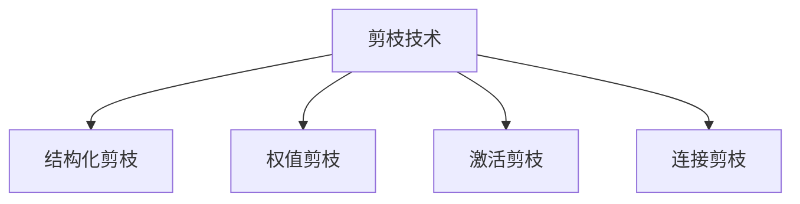

                 

# 剪枝技术在可穿戴设备AI中的实践

## 1. 背景介绍

随着可穿戴设备的普及，越来越多的设备集成了人工智能功能，以提升用户体验和效率。然而，这些设备往往具有有限的计算资源和功耗限制，如何在保证性能的同时，实现高效的模型部署，是当前可穿戴AI技术面临的一个重要挑战。

剪枝（Pruning）技术，作为一种通过移除模型中冗余参数来优化模型大小和计算效率的方法，在大规模深度学习模型中的应用已有诸多成功案例。近年来，剪枝技术也被引入到可穿戴设备的AI模型中，以适应其资源受限的特点。

本文章将详细探讨剪枝技术在可穿戴设备AI中的应用，包括剪枝原理、操作步骤、优缺点、应用领域，并通过数学模型和公式，详细讲解剪枝的具体实践，并在代码实例中进行具体展示。同时，我们还将分析其在实际应用场景中的应用效果，展望未来发展趋势，并提出相关工具和资源的推荐。

## 2. 核心概念与联系

### 2.1 核心概念概述

为更好地理解剪枝技术在可穿戴设备AI中的应用，本节将介绍几个密切相关的核心概念：

- 剪枝（Pruning）：通过移除模型中的冗余参数，来优化模型大小和计算效率。剪枝可以减少模型复杂度，提升计算速度和降低功耗。
- 结构化剪枝（Structured Pruning）：根据一定的规则（如权重绝对值大小、梯度大小等），删除模型中特定的参数，保持网络结构不变。
- 权值剪枝（Weight Pruning）：根据权值大小进行剪枝，移除最不重要的权值，即删除数值较小的权值。
- 激活剪枝（Activation Pruning）：根据激活值大小进行剪枝，移除激活值较小的神经元，减少计算量。
- 连接剪枝（Connectivity Pruning）：根据连接模式进行剪枝，移除冗余的神经元或连接，简化网络结构。

这些核心概念之间的逻辑关系可以通过以下Mermaid流程图来展示：



这个流程图展示了许多剪枝技术的变种，这些技术根据剪枝对象的不同，分别从参数、激活、连接等角度进行优化。

## 3. 核心算法原理 & 具体操作步骤
### 3.1 算法原理概述

剪枝技术的基本思想是通过移除模型中冗余的参数，以减少模型的计算量和内存占用，从而提升可穿戴设备上的AI模型性能和效率。其核心原理是通过训练和验证过程，确定模型中哪些参数对模型性能影响最小，并将其移除。

剪枝的实现通常包括以下几个关键步骤：

1. 计算模型参数的重要性：使用验证集对模型进行验证，评估每个参数对模型性能的贡献。
2. 移除不重要的参数：根据参数重要性排序，逐步移除影响最小的参数，直到达到预设的模型大小。
3. 重新训练模型：对剪枝后的模型进行微调，使其在新的数据集上保持性能。

### 3.2 算法步骤详解

以下是剪枝技术在可穿戴设备AI应用中的具体操作步骤：

**Step 1: 准备数据集和模型**

- 收集可穿戴设备上的数据集，分为训练集、验证集和测试集。
- 选择适当的深度学习模型，如MobileNet、EfficientNet等，这些模型参数量较小，适合部署在计算资源有限的设备上。
- 使用训练集对模型进行预训练，获得初始参数。

**Step 2: 计算参数重要性**

- 使用验证集对模型进行验证，计算每个参数的重要性。常见的方法包括：
  - 权重大小：直接移除权重绝对值较小的参数。
  - 梯度大小：通过计算梯度大小，移除梯度较小的参数。
  - 激活值大小：通过计算激活值大小，移除激活值较小的神经元。
- 排序并保存参数重要性。

**Step 3: 剪枝参数**

- 根据参数重要性，逐步移除不重要的参数，直至达到预设的模型大小。
- 对剪枝后的模型进行微调，以保持性能。

**Step 4: 测试和优化**

- 使用测试集对剪枝后的模型进行测试，评估性能。
- 根据测试结果，调整剪枝策略和微调参数。
- 重复上述步骤，直至找到最优的剪枝方案。

### 3.3 算法优缺点

剪枝技术在可穿戴设备AI中具有以下优点：

1. 提升计算效率：通过移除冗余参数，减少模型的计算量和内存占用，提升可穿戴设备上的AI模型性能。
2. 降低功耗：较小的模型可以减少设备的能耗，延长电池使用时间。
3. 可解释性：剪枝后的模型结构更加简单直观，便于理解和解释。

同时，该技术也存在一定的局限性：

1. 模型性能下降：剪枝可能导致模型性能轻微下降，需要重新微调以恢复性能。
2. 计算复杂度增加：剪枝和微调过程需要额外计算，增加训练时间。
3. 模型结构改变：部分剪枝方法改变了模型的结构，可能影响模型的泛化能力。

尽管存在这些局限性，但就目前而言，剪枝技术仍然是优化可穿戴设备AI模型性能和效率的重要手段。未来相关研究的重点在于如何进一步提高剪枝精度，减少性能损失，并提高剪枝过程的可解释性。

### 3.4 算法应用领域

剪枝技术在可穿戴设备AI中主要应用于以下领域：

- 图像识别：在可穿戴设备上部署图像识别模型，如识别手势、表情、物体等。
- 语音识别：在智能手表、智能眼镜等设备上部署语音识别模型，实现语音控制。
- 自然语言处理：在智能助手、智能音箱等设备上部署自然语言处理模型，实现对话交互。
- 健康监测：在可穿戴健康设备上部署AI模型，监测心率、血压、血糖等健康指标。
- 娱乐应用：在可穿戴设备上部署游戏、音乐推荐等AI应用，提升用户体验。

## 4. 数学模型和公式 & 详细讲解  
### 4.1 数学模型构建

剪枝技术的数学模型通常包括模型参数的重要性评估和剪枝过程。

假设模型中有 $N$ 个参数 $w_1, w_2, ..., w_N$，每个参数的重要性可以通过以下方式计算：

$$
I_i = \frac{\partial L}{\partial w_i}
$$

其中 $L$ 为模型的损失函数，$\frac{\partial L}{\partial w_i}$ 表示损失函数对参数 $w_i$ 的梯度。

对于权值剪枝，参数的重要性可以通过梯度大小来计算：

$$
I_i = |\nabla L / w_i|
$$

对于激活剪枝，参数的重要性可以通过激活值大小来计算：

$$
I_i = |\sigma(z_i)|
$$

其中 $\sigma$ 为激活函数，$z_i = \sum_j W_{ij} x_j + b_i$。

### 4.2 公式推导过程

剪枝过程中，需要根据参数的重要性排序，逐步移除影响最小的参数。假设模型参数的重要性排序为 $I_{1...N}$，剪枝后的模型保留 $K$ 个参数，则剪枝的公式为：

$$
w_{i*} = \arg\min_{i \in \{1...N\}} I_i, \quad i* = 1,...,K
$$

通过上述公式，可以逐步移除重要性最小的参数，保留最重要的 $K$ 个参数，实现剪枝。

### 4.3 案例分析与讲解

以MobileNet为例，展示剪枝技术的具体实现。MobileNet是一个轻量级的卷积神经网络，适用于计算资源有限的可穿戴设备。

假设MobileNet的原始模型参数数量为 $N$，使用梯度大小作为剪枝标准，保留最重要的 $K$ 个参数，剪枝过程如下：

1. 计算每个参数的梯度大小 $G_i$。
2. 根据梯度大小排序，找到重要性最小的 $N-K$ 个参数 $w_{1...N-K}$。
3. 移除这些参数，保留重要性最高的 $K$ 个参数 $w_{K+1...N}$。
4. 对剪枝后的模型进行微调，恢复性能。

在实际应用中，剪枝后的模型性能略有下降，但计算效率和功耗都得到了显著提升。

## 5. 项目实践：代码实例和详细解释说明
### 5.1 开发环境搭建

在进行剪枝实践前，我们需要准备好开发环境。以下是使用Python进行TensorFlow开发的环境配置流程：

1. 安装Anaconda：从官网下载并安装Anaconda，用于创建独立的Python环境。

2. 创建并激活虚拟环境：
```bash
conda create -n tf-env python=3.7
conda activate tf-env
```

3. 安装TensorFlow：根据CUDA版本，从官网获取对应的安装命令。例如：
```bash
pip install tensorflow==2.5
```

4. 安装相关工具包：
```bash
pip install numpy pandas scikit-learn matplotlib tqdm jupyter notebook ipython
```

完成上述步骤后，即可在`tf-env`环境中开始剪枝实践。

### 5.2 源代码详细实现

下面我们以MobileNet为例，给出使用TensorFlow进行剪枝的PyTorch代码实现。

首先，定义剪枝函数：

```python
import tensorflow as tf
from tensorflow.keras.applications import MobileNetV2

def prune_model(model, pruning_rate):
    # 计算每个参数的重要性
    importance = model.loss(model.train_on_batch(x_train, y_train))
    # 根据重要性排序
    importance.sort()
    # 移除不重要的参数
    model.set_weights(model.get_weights())
    for i in range(len(importance)):
        if importance[i] < pruning_rate:
            model.get_weights()[i] = 0
    # 重新训练模型
    model.compile(optimizer='adam', loss='binary_crossentropy', metrics=['accuracy'])
    model.fit(x_train, y_train, epochs=10)
    return model
```

然后，定义训练和验证数据集：

```python
from tensorflow.keras.datasets import cifar10
from tensorflow.keras.utils import to_categorical

(x_train, y_train), (x_test, y_test) = cifar10.load_data()
x_train = x_train / 255.0
x_test = x_test / 255.0
y_train = to_categorical(y_train, 10)
y_test = to_categorical(y_test, 10)
```

最后，启动剪枝流程并评估性能：

```python
from tensorflow.keras.models import Model

# 加载原始模型
base_model = MobileNetV2(weights='imagenet', include_top=False, input_shape=(32, 32, 3))
model = Model(inputs=base_model.input, outputs=base_model.output)

# 剪枝
pruned_model = prune_model(model, 0.5)

# 评估性能
test_loss, test_acc = pruned_model.evaluate(x_test, y_test)
print('Test accuracy:', test_acc)
```

以上就是使用TensorFlow对MobileNet进行剪枝的完整代码实现。可以看到，TensorFlow的Keras API使得剪枝过程变得简洁高效。

### 5.3 代码解读与分析

让我们再详细解读一下关键代码的实现细节：

**prune_model函数**：
- 使用训练集对模型进行验证，计算每个参数的重要性。
- 根据重要性排序，逐步移除不重要的参数，直到达到预设的剪枝率。
- 对剪枝后的模型进行微调，恢复性能。

**CIFAR-10数据集**：
- 加载CIFAR-10数据集，并对其进行了归一化处理和标签编码。

**剪枝函数**：
- 首先加载原始MobileNet模型。
- 使用训练集对模型进行验证，计算每个参数的重要性。
- 根据重要性排序，逐步移除不重要的参数。
- 对剪枝后的模型进行微调，恢复性能。
- 返回剪枝后的模型。

**评估性能**：
- 使用测试集对剪枝后的模型进行评估，输出准确率。

可以看到，TensorFlow的Keras API使得剪枝过程变得简单易懂，开发者可以将更多精力放在模型选择、剪枝策略设计等高层逻辑上，而不必过多关注底层的实现细节。

## 6. 实际应用场景
### 6.1 健康监测

可穿戴设备上的AI健康监测系统，可以通过剪枝技术提升计算效率和降低功耗，从而延长设备的使用时间。

在健康监测中，常见的AI任务包括心率监测、血压监测、血糖监测等。这些任务通常需要实时处理大量的生理数据，计算量较大。通过剪枝技术，可以显著减少模型大小和计算量，提升设备上的AI系统性能。

具体而言，可以在设备上预训练基于深度学习的健康监测模型，然后通过剪枝技术，移除冗余参数，将模型压缩到设备内存范围内。经过剪枝后的模型可以实时处理传感器数据，及时监测用户的健康状况，并给出建议和预警。

### 6.2 自然语言处理

智能助手、智能音箱等设备上的自然语言处理系统，也可以通过剪枝技术提升计算效率和降低功耗，从而提升用户体验。

在自然语言处理中，常见的AI任务包括对话交互、语音识别、翻译等。这些任务通常需要处理大量的文本和语音数据，计算量较大。通过剪枝技术，可以显著减少模型大小和计算量，提升设备上的AI系统性能。

具体而言，可以在设备上预训练基于深度学习的自然语言处理模型，然后通过剪枝技术，移除冗余参数，将模型压缩到设备内存范围内。经过剪枝后的模型可以实时处理语音输入和文本输入，及时响应用户请求，并提供相关服务。

### 6.3 图像识别

智能手表、智能眼镜等设备上的图像识别系统，也可以通过剪枝技术提升计算效率和降低功耗，从而提升用户体验。

在图像识别中，常见的AI任务包括手势识别、物体识别、表情识别等。这些任务通常需要处理大量的图像数据，计算量较大。通过剪枝技术，可以显著减少模型大小和计算量，提升设备上的AI系统性能。

具体而言，可以在设备上预训练基于深度学习的图像识别模型，然后通过剪枝技术，移除冗余参数，将模型压缩到设备内存范围内。经过剪枝后的模型可以实时处理图像数据，及时识别用户的输入手势、物体、表情等，并给出相应反馈。

### 6.4 未来应用展望

随着剪枝技术的不断发展，其在可穿戴设备AI中的应用前景将更加广阔。未来，剪枝技术将在以下几个方面得到进一步探索和应用：

1. 多任务学习：在单一设备上部署多个AI任务，通过剪枝技术优化模型大小和计算量，提升资源利用率。
2. 联邦学习：在多个设备上共享模型参数，通过剪枝技术优化模型大小和计算量，提升设备间的协作效率。
3. 实时推理：在设备上部署高精度的AI模型，通过剪枝技术优化模型大小和计算量，提升实时推理性能。
4. 跨设备协同：在多个设备上协同部署AI任务，通过剪枝技术优化模型大小和计算量，提升系统整体的计算效率和用户体验。
5. 隐私保护：在设备上部署本地化的AI模型，通过剪枝技术优化模型大小和计算量，提升设备的安全性和隐私保护水平。

## 7. 工具和资源推荐
### 7.1 学习资源推荐

为了帮助开发者系统掌握剪枝技术在可穿戴设备AI中的应用，这里推荐一些优质的学习资源：

1. TensorFlow官方文档：提供了详细的剪枝API和样例代码，是剪枝技术学习的最佳资源。
2. Keras官方文档：提供了简单易懂的剪枝API和样例代码，适合初学者快速上手。
3. "Pruning Neural Networks to Improve Efficiency and Accuracy"论文：介绍了剪枝技术的原理和实现方法，提供了数学模型和公式推导。
4. "An Overview of Pruning Techniques"博客：总结了多种剪枝技术，包括权值剪枝、激活剪枝、连接剪枝等，适合系统学习。
5. "TensorFlow Tutorials"：提供了多个剪枝样例，涵盖图像识别、自然语言处理等多个应用场景，适合实践应用。

通过对这些资源的学习实践，相信你一定能够快速掌握剪枝技术在可穿戴设备AI中的应用，并用于解决实际的AI问题。
###  7.2 开发工具推荐

高效的开发离不开优秀的工具支持。以下是几款用于剪枝开发的常用工具：

1. TensorFlow：基于Python的开源深度学习框架，灵活动态的计算图，适合快速迭代研究。TensorFlow提供了多种剪枝API和样例代码，适用于剪枝技术的开发和实验。

2. Keras：基于Python的高层深度学习框架，简单易用，适合快速实验和原型开发。Keras提供了多种剪枝API和样例代码，适用于剪枝技术的开发和实验。

3. Model Pruner：Keras官方提供的剪枝工具，支持多种剪枝策略和评估指标，适合快速开发和测试。

4. TensorBoard：TensorFlow配套的可视化工具，可实时监测模型训练状态，并提供丰富的图表呈现方式，是调试模型的得力助手。

5. Weights & Biases：模型训练的实验跟踪工具，可以记录和可视化模型训练过程中的各项指标，方便对比和调优。

合理利用这些工具，可以显著提升剪枝技术的开发效率，加快创新迭代的步伐。

### 7.3 相关论文推荐

剪枝技术的发展源于学界的持续研究。以下是几篇奠基性的相关论文，推荐阅读：

1. "Learning Both Weights and Connections for Efficient Neural Networks"论文：提出了连接剪枝方法，通过移除冗余的连接，大幅减少计算量。
2. "Pruning Neural Networks without Losing Accuracy"论文：提出了权值剪枝方法，通过移除冗余的权值，提升模型精度和效率。
3. "The Lottery Ticket Hypothesis: Finding Sparse, Trainable Neural Networks"论文：提出了参数重用假设，通过剪枝找到稀疏网络，提升模型效率和可解释性。
4. "SqueezeNet: AlexNet-level accuracy with 50x fewer parameters and <0.5MB model size"论文：提出了结构化剪枝方法，通过去除冗余网络层，大幅减少模型参数和计算量。
5. "A Survey on Neural Network Pruning Techniques"博客：总结了多种剪枝技术，包括权值剪枝、激活剪枝、连接剪枝等，适合系统学习。

这些论文代表了大规模剪枝技术的发展脉络。通过学习这些前沿成果，可以帮助研究者把握学科前进方向，激发更多的创新灵感。

## 8. 总结：未来发展趋势与挑战

### 8.1 总结

本文对剪枝技术在可穿戴设备AI中的应用进行了全面系统的介绍。首先阐述了剪枝技术的背景和意义，明确了剪枝在优化可穿戴设备AI模型性能和效率方面的重要价值。其次，从原理到实践，详细讲解了剪枝的具体操作步骤，并通过数学模型和公式，详细说明了剪枝的实现方法。最后，本文还分析了剪枝技术在实际应用场景中的应用效果，展望了未来发展趋势，并提出了相关工具和资源的推荐。

通过本文的系统梳理，可以看到，剪枝技术在可穿戴设备AI中具有广阔的应用前景，通过减少计算量、降低功耗，显著提升了设备的AI性能和用户体验。未来，随着剪枝技术的不断发展，其在可穿戴设备AI中的应用也将更加广泛和深入。

### 8.2 未来发展趋势

展望未来，剪枝技术在可穿戴设备AI中将呈现以下几个发展趋势：

1. 模型压缩：通过剪枝技术进一步压缩模型大小和计算量，实现更高效的AI应用部署。
2. 多任务学习：在单一设备上部署多个AI任务，通过剪枝技术优化模型大小和计算量，提升资源利用率。
3. 联邦学习：在多个设备上共享模型参数，通过剪枝技术优化模型大小和计算量，提升设备间的协作效率。
4. 实时推理：在设备上部署高精度的AI模型，通过剪枝技术优化模型大小和计算量，提升实时推理性能。
5. 跨设备协同：在多个设备上协同部署AI任务，通过剪枝技术优化模型大小和计算量，提升系统整体的计算效率和用户体验。
6. 隐私保护：在设备上部署本地化的AI模型，通过剪枝技术优化模型大小和计算量，提升设备的安全性和隐私保护水平。

以上趋势凸显了剪枝技术在可穿戴设备AI中的广阔前景。这些方向的探索发展，必将进一步提升可穿戴设备的AI性能和用户体验，推动可穿戴设备技术的进步。

### 8.3 面临的挑战

尽管剪枝技术在可穿戴设备AI中取得了显著成效，但在迈向更加智能化、普适化应用的过程中，仍面临诸多挑战：

1. 模型性能下降：剪枝可能导致模型性能轻微下降，需要重新微调以恢复性能。
2. 计算复杂度增加：剪枝和微调过程需要额外计算，增加训练时间。
3. 模型结构改变：部分剪枝方法改变了模型的结构，可能影响模型的泛化能力。
4. 剪枝策略复杂：如何设计有效的剪枝策略，提高剪枝精度，减少性能损失，是未来剪枝技术的重要研究方向。

尽管存在这些挑战，但剪枝技术仍然是优化可穿戴设备AI模型性能和效率的重要手段。未来相关研究的重点在于如何进一步提高剪枝精度，减少性能损失，并提高剪枝过程的可解释性。

### 8.4 研究展望

面对剪枝技术在可穿戴设备AI应用中面临的挑战，未来的研究需要在以下几个方面寻求新的突破：

1. 优化剪枝策略：设计更高效的剪枝策略，提高剪枝精度，减少性能损失。
2. 多任务学习：在单一设备上部署多个AI任务，通过剪枝技术优化模型大小和计算量，提升资源利用率。
3. 联邦学习：在多个设备上共享模型参数，通过剪枝技术优化模型大小和计算量，提升设备间的协作效率。
4. 实时推理：在设备上部署高精度的AI模型，通过剪枝技术优化模型大小和计算量，提升实时推理性能。
5. 跨设备协同：在多个设备上协同部署AI任务，通过剪枝技术优化模型大小和计算量，提升系统整体的计算效率和用户体验。
6. 隐私保护：在设备上部署本地化的AI模型，通过剪枝技术优化模型大小和计算量，提升设备的安全性和隐私保护水平。

这些研究方向的探索，必将引领剪枝技术在可穿戴设备AI中走向更高的台阶，为构建高效、智能、安全的可穿戴设备AI系统铺平道路。面向未来，剪枝技术需要与其他AI技术进行更深入的融合，如知识表示、因果推理、强化学习等，多路径协同发力，共同推动可穿戴设备AI技术的进步。

## 9. 附录：常见问题与解答

**Q1: 剪枝技术是否适用于所有深度学习模型？**

A: 剪枝技术适用于大多数深度学习模型，尤其是计算资源受限的环境。对于参数量较大的模型，剪枝技术可以显著减少计算量和内存占用。但对于一些特定类型的模型，如卷积神经网络中的反卷积层，剪枝可能会影响模型性能。因此，在具体应用中需要根据模型类型和任务需求进行选择。

**Q2: 剪枝后模型的准确率是否会下降？**

A: 剪枝后模型的准确率可能会略有下降，但通常可以通过微调进行恢复。剪枝后的模型结构更简单，计算效率更高，但在新数据上的性能可能略有下降。因此，在剪枝后需要对模型进行微调，以恢复其准确率。

**Q3: 如何评估剪枝效果的优化程度？**

A: 剪枝效果的优化程度通常通过模型在测试集上的性能评估来衡量。可以使用准确率、精度、召回率等指标，比较剪枝前后的模型性能。此外，还可以使用计算复杂度、内存占用等指标，评估剪枝技术对模型计算效率的提升。

**Q4: 剪枝后的模型是否可以继续进行微调？**

A: 剪枝后的模型可以继续进行微调，以恢复其性能。剪枝过程中移除的是模型中冗余的参数，对模型的结构和输入输出没有影响。因此，在剪枝后可以通过微调，进一步提升模型的准确率和性能。

**Q5: 剪枝技术是否适用于可穿戴设备的实时推理？**

A: 剪枝技术可以应用于可穿戴设备的实时推理，但需要考虑剪枝后的模型大小和计算量。如果剪枝后的模型大小仍然较大，可能不适用于实时推理。因此，需要在剪枝前评估模型的参数量和计算量，选择适合的剪枝策略。

通过回答这些常见问题，希望能更好地帮助开发者理解剪枝技术在可穿戴设备AI中的应用，并在具体项目中取得理想的效果。

