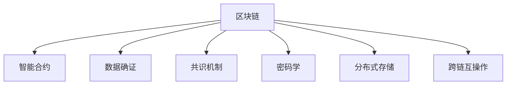

                 

# 区块链与数据可信原理与代码实战案例讲解

## 1. 背景介绍

### 1.1 问题由来
区块链技术的出现，极大地变革了金融、供应链、医疗、社交等多个行业，因其具有去中心化、不可篡改、透明公开等诸多优点，被称为是信任的机器。然而，由于区块链网络的复杂性，其数据可信问题一直未能得到很好解决。数据在上传、存储、查询等各环节都可能存在被篡改、泄露等风险。

在传统金融系统中，数据可信问题多通过分布式数据库、数字签名、加密算法等手段进行保障。但在区块链网络中，由于其特殊的分布式共识机制，数据可信问题变得更加复杂。如何在去中心化的区块链网络中，构建高效、安全的数据可信机制，成为目前亟待解决的问题。

### 1.2 问题核心关键点
区块链数据可信问题的核心关键点在于：

- 数据如何上链。数据如何被可信地、安全地上传到区块链网络，是可信问题解决的前提。
- 数据如何存储。数据如何被安全、可靠地存储在区块链网络中，防止被篡改和泄露。
- 数据如何查询。数据如何被高效、透明地查询，以满足用户的实时需求。
- 数据如何确证。数据如何被有效地确证，确保其真实性和完整性，避免假冒和篡改。

这些问题与传统数据库系统的数据存储、查询、安全等需求不同，需要在区块链网络中重新思考。本文旨在通过分析区块链数据的可信原理，并结合具体案例，详细讲解区块链数据可信的实现方法。

## 2. 核心概念与联系

### 2.1 核心概念概述

为更好地理解区块链数据可信原理与代码实战案例，本节将介绍几个密切相关的核心概念：

- 区块链(Blockchain)：由数据区块按照时间顺序连接而成的链式数据结构，具备去中心化、不可篡改、透明公开的特性。
- 智能合约(Smart Contract)：存储在区块链上的、具有自动化执行逻辑的合约代码，具备去信任、去中心化的优势。
- 数据确证(Verification)：通过区块链网络中各节点的协同工作，实现对数据的真实性和完整性的验证，确保数据可信。
- 共识机制(Consensus)：区块链网络中各节点达成一致协议的机制，保障区块链数据的正确性和一致性。
- 密码学(Cryptography)：包括数字签名、哈希算法、公钥加密等技术，是区块链网络数据安全的保障。
- 分布式存储(Distributed Storage)：将数据分散存储在网络中各节点上，避免单点故障，提高数据可用性。
- 跨链互操作(Cross-Chain Interoperability)：实现不同区块链网络之间的互联互通，提升数据共享和互操作性。

这些核心概念之间的逻辑关系可以通过以下Mermaid流程图来展示：



这个流程图展示了大语言模型的核心概念及其之间的关系：

1. 区块链网络中的数据，通过智能合约逻辑进行确证和处理。
2. 共识机制确保数据确证过程的正确性和一致性。
3. 密码学为数据确证提供安全保障。
4. 分布式存储提高数据的可靠性和可用性。
5. 跨链互操作提升不同网络间的数据互操作性。

这些概念共同构成了区块链网络数据可信的实现框架，使得区块链网络能够高效、安全地处理和确证数据。通过理解这些核心概念，我们可以更好地把握区块链数据可信的实现机制。

## 3. 核心算法原理 & 具体操作步骤

### 3.1 算法原理概述

区块链数据可信的实现原理可以概括为：通过智能合约对数据进行逻辑处理，共识机制保障数据确证过程的一致性，密码学提供安全保障，分布式存储提高数据可用性，跨链互操作提升数据共享和互操作性。

具体来说，区块链数据可信的实现流程包括以下几个关键步骤：

1. 数据确证：通过智能合约逻辑，对数据进行验证和确证，确保数据的真实性和完整性。
2. 共识机制：通过共识算法，使得网络中各节点达成一致协议，确保数据确证过程的正确性。
3. 密码学：使用数字签名、哈希算法等技术，对数据进行加密和验证，保障数据安全。
4. 分布式存储：将数据分散存储在网络中各节点上，提高数据可用性和可靠性。
5. 跨链互操作：通过链间协议，实现不同区块链网络间的互操作性，提升数据共享能力。

### 3.2 算法步骤详解

**Step 1: 数据确证智能合约**

智能合约是区块链数据可信的核心，通过对数据进行逻辑验证，确证其真实性和完整性。以下是一个简化的智能合约代码示例：

```python
def verify_data(data, witness):
    """
    验证数据的智能合约代码
    :param data: 待验证的数据，格式为字节串(byte)
    :param witness: 见证数据，包含数据来源、签名等，格式为JSON对象
    :return: 验证结果，True表示数据可信，False表示数据不可信
    """
    # 解析见证数据，提取来源、签名等信息
    witness = json.loads(witness)
    
    # 对数据进行哈希处理
    data_hash = hashlib.sha256(data).hexdigest()
    
    # 验证签名
    if verify_signature(witness['signature'], witness['sender'], data_hash):
        return True
    else:
        return False
```

**Step 2: 共识机制设计**

共识机制是区块链网络中的关键组成部分，保障数据确证过程的正确性和一致性。常见的共识算法包括PoW、PoS、DPoS等。

以PoW为例，共识算法的基本流程如下：

1. 网络节点广播自己的交易数据，并向其他节点发送确认信息。
2. 其他节点接收到交易数据后，进行共识算法计算，确认交易数据的有效性。
3. 所有节点按照一定的规则计算出最终的共识结果，形成新的区块。

以下是一个简化的PoW共识算法代码示例：

```python
def calculate_hash(data):
    """
    计算区块哈希的函数
    :param data: 区块数据，格式为JSON对象
    :return: 区块哈希值，格式为字节串(byte)
    """
    data_json = json.dumps(data, sort_keys=True).encode('utf-8')
    return hashlib.sha256(data_json).hexdigest()

def proof_of_work(data, target):
    """
    计算工作量证明的函数
    :param data: 区块数据，格式为JSON对象
    :param target: 目标哈希值，格式为字节串(byte)
    :return: 工作量证明结果，格式为JSON对象
    """
    nonce = 0
    while True:
        data_json = json.dumps(data, sort_keys=True).encode('utf-8')
        block_hash = hashlib.sha256(data_json + str(nonce)).hexdigest()
        if block_hash.startswith(target):
            return {'nonce': nonce, 'hash': block_hash}
        nonce += 1
```

**Step 3: 密码学技术应用**

密码学是区块链数据安全的保障，使用数字签名、哈希算法等技术，对数据进行加密和验证，保障数据安全。

以下是一个简化的数字签名代码示例：

```python
import rsa

def generate_key_pair():
    """
    生成公私钥对
    :return: 公钥和私钥，格式为字节串(byte)
    """
    key = rsa.newkeys(512)
    return key.publickey().export_key(), key.export_key()

def sign(data, private_key):
    """
    对数据进行数字签名的函数
    :param data: 待签名的数据，格式为字节串(byte)
    :param private_key: 私钥，格式为字节串(byte)
    :return: 签名结果，格式为字节串(byte)
    """
    sig = rsa.sign(data, private_key, 'SHA-256')
    return sig

def verify_signature(signature, public_key, data):
    """
    验证数字签名的函数
    :param signature: 签名结果，格式为字节串(byte)
    :param public_key: 公钥，格式为字节串(byte)
    :param data: 待验证的数据，格式为字节串(byte)
    :return: True表示签名有效，False表示签名无效
    """
    try:
        rsa.verify(data, signature, public_key)
        return True
    except:
        return False
```

**Step 4: 分布式存储设计**

分布式存储是将数据分散存储在网络中各节点上，提高数据可用性和可靠性。

以下是一个简化的分布式存储设计：

```python
class DistributedStorage:
    def __init__(self, nodes):
        """
        分布式存储类，包含多个节点
        :param nodes: 节点列表，格式为节点地址列表
        """
        self.nodes = nodes
    
    def store_data(self, data):
        """
        存储数据的函数
        :param data: 待存储的数据，格式为字节串(byte)
        :return: 存储结果，格式为布尔值
        """
        for node in self.nodes:
            if node.store_data(data):
                return True
        return False
    
    def retrieve_data(self, hash):
        """
        检索数据的函数
        :param hash: 数据哈希值，格式为字节串(byte)
        :return: 数据结果，格式为字节串(byte)或None
        """
        for node in self.nodes:
            data = node.retrieve_data(hash)
            if data is not None:
                return data
        return None
```

**Step 5: 跨链互操作设计**

跨链互操作是实现不同区块链网络间的互联互通，提升数据共享和互操作性。

以下是一个简化的跨链互操作设计：

```python
class CrossChain:
    def __init__(self, chains):
        """
        跨链互操作类，包含多个区块链网络
        :param chains: 区块链网络列表，格式为区块链网络地址列表
        """
        self.chains = chains
    
    def transfer_data(self, data, chain):
        """
        跨链传输数据的函数
        :param data: 待传输的数据，格式为字节串(byte)
        :param chain: 目标区块链网络地址，格式为字符串
        :return: 传输结果，格式为布尔值
        """
        for chain in self.chains:
            if chain == target:
                return chain.transfer_data(data)
        return False
    
    def receive_data(self, hash):
        """
        接收跨链数据的函数
        :param hash: 数据哈希值，格式为字节串(byte)
        :return: 数据结果，格式为字节串(byte)或None
        """
        for chain in self.chains:
            data = chain.receive_data(hash)
            if data is not None:
                return data
        return None
```

以上是区块链数据可信的实现流程，涵盖数据确证、共识机制、密码学、分布式存储、跨链互操作等多个关键环节。

### 3.3 算法优缺点

区块链数据可信的实现方法具有以下优点：

1. 去中心化：数据确证过程不需要中心服务器，所有节点协同工作，实现去信任、去中心化的确证机制。
2. 安全性：使用密码学技术保障数据安全和隐私，防止数据篡改和泄露。
3. 透明性：区块链网络中的每个节点都可以查看所有交易数据，保障数据透明公开。
4. 可追溯性：每个数据区块都包含前一个区块的哈希值，实现数据的可追溯性。

同时，区块链数据可信的实现方法也存在以下缺点：

1. 共识算法复杂：共识算法实现复杂，网络延迟、节点故障等问题可能影响共识结果的正确性。
2. 计算资源消耗大：PoW等共识算法需要大量的计算资源，网络负载较大。
3. 扩展性有限：目前的共识算法和数据存储机制扩展性有限，难以应对大规模数据传输和存储需求。

尽管存在这些缺点，但就目前而言，区块链数据可信方法仍然是最前沿、最具有潜力的数据可信技术。未来相关研究的方向之一在于改进共识算法和数据存储机制，以提高其扩展性和效率。

### 3.4 算法应用领域

区块链数据可信技术已经在多个领域得到广泛应用，例如：

- 金融：区块链技术的引入，可以大幅提升金融系统的数据安全性和透明度，防止欺诈和洗钱行为。
- 供应链：区块链可以实现货物溯源、物流追踪，保障供应链的安全性和可靠性。
- 医疗：区块链可以存储和确证患者的病历数据，提升医疗数据的安全性和隐私性。
- 版权：区块链可以确证数字作品的版权，防止盗版和侵权行为。
- 投票：区块链可以提供安全的投票机制，防止选票篡改和投票舞弊。
- 身份认证：区块链可以实现安全的身份认证，防止身份信息泄露和身份冒用。

除了上述这些应用领域外，区块链数据可信技术还将在更多领域得到广泛应用，为各行各业带来新的变革。

## 4. 数学模型和公式 & 详细讲解 & 举例说明

### 4.1 数学模型构建

本节将使用数学语言对区块链数据确证的实现过程进行更加严格的刻画。

记区块链中的数据区块为 $B_i$，其中 $i$ 表示区块编号，$B_i$ 的哈希值为 $H_i$。假设网络中每个节点都保存了部分区块链数据，且每个节点都设置了相同的共识算法 $C$。

定义共识结果为 $C_i$，表示在区块 $B_i$ 上的共识结果。共识算法 $C$ 的定义为：

$$
C_i = C(B_i, C_{i-1}, C_{i-2}, \ldots, C_1)
$$

其中 $C_0$ 为区块的初始状态，$C_{i-1}, C_{i-2}, \ldots, C_1$ 为前 $i-1$ 个区块的共识结果。

共识结果 $C_i$ 可以表示为：

$$
C_i = \{\text{Proof of \#}, \text{Data}_i\}
$$

其中 $\text{Proof of \#}$ 表示区块 $B_i$ 的工作量证明，$\text{Data}_i$ 表示区块 $B_i$ 的存储数据。

数据确证的数学模型为：

$$
V(B_i) = \bigwedge_{j=1}^{i-1} C_j
$$

即区块 $B_i$ 的数据确证需要前 $i-1$ 个区块的共识结果 $C_j$ 均成立。

### 4.2 公式推导过程

以下我们以PoW共识算法为例，推导数据确证的公式及其推导过程。

假设当前区块链的共识结果为 $C_{i-1}$，节点 $A$ 在区块 $B_i$ 上运行共识算法，并输出工作量证明 $\text{Proof of \#}$。

共识算法的基本流程如下：

1. 节点 $A$ 收集前 $i-1$ 个区块的共识结果 $C_j$，并计算出当前区块 $B_i$ 的哈希值 $H_i$。
2. 节点 $A$ 根据当前区块的哈希值 $H_i$，计算出一个随机数 $\text{nonce}$。
3. 节点 $A$ 将 $\text{nonce}$ 和当前区块的哈希值 $H_i$ 组合起来，计算出一个工作量证明 $\text{Proof of \#}$。
4. 节点 $A$ 将工作量证明 $\text{Proof of \#}$ 和当前区块的存储数据 $\text{Data}_i$ 作为共识结果 $C_i$，上传给其他节点。

工作量证明 $\text{Proof of \#}$ 的计算公式为：

$$
\text{Proof of \#} = H_i + \text{nonce}
$$

其中 $H_i$ 为当前区块的哈希值，$\text{nonce}$ 为随机数。

数据确证的数学公式为：

$$
V(B_i) = C_{i-1} \wedge C_{i-2} \wedge \ldots \wedge C_1
$$

即区块 $B_i$ 的数据确证需要前 $i-1$ 个区块的共识结果 $C_j$ 均成立。

### 4.3 案例分析与讲解

假设在一个简化版的区块链网络中，共识算法为PoW，共识结果为 $C_i$，数据确证为 $V(B_i)$。

节点 $A$ 在区块 $B_i$ 上运行共识算法，并输出工作量证明 $\text{Proof of \#}$。

具体步骤如下：

1. 节点 $A$ 收集前 $i-1$ 个区块的共识结果 $C_j$，并计算出当前区块 $B_i$ 的哈希值 $H_i$。
2. 节点 $A$ 根据当前区块的哈希值 $H_i$，计算出一个随机数 $\text{nonce}$。
3. 节点 $A$ 将 $\text{nonce}$ 和当前区块的哈希值 $H_i$ 组合起来，计算出一个工作量证明 $\text{Proof of \#}$。
4. 节点 $A$ 将工作量证明 $\text{Proof of \#}$ 和当前区块的存储数据 $\text{Data}_i$ 作为共识结果 $C_i$，上传给其他节点。

其他节点接收到节点 $A$ 上传的共识结果 $C_i$ 后，计算出当前区块 $B_i$ 的哈希值 $H_i$，并验证工作量证明 $\text{Proof of \#}$ 的有效性。如果工作量证明有效，则接受共识结果 $C_i$，否则拒绝。

所有节点都收到节点 $A$ 上传的共识结果 $C_i$ 后，对 $C_i$ 进行一致性检查。如果所有节点都接受共识结果 $C_i$，则区块 $B_i$ 的数据确证 $V(B_i)$ 成立，区块 $B_i$ 被添加进区块链。

综上所述，区块链数据确证的实现过程需要共识算法的支撑，共识算法的正确性和一致性决定了数据确证的可靠性。同时，数据确证过程也需要通过密码学技术进行保障，防止数据篡改和泄露。

## 5. 项目实践：代码实例和详细解释说明

### 5.1 开发环境搭建

在进行区块链数据确证的实践前，我们需要准备好开发环境。以下是使用Python进行比特币网络开发的Python环境配置流程：

1. 安装Anaconda：从官网下载并安装Anaconda，用于创建独立的Python环境。

2. 创建并激活虚拟环境：
```bash
conda create -n blockchain-env python=3.8 
conda activate blockchain-env
```

3. 安装比特币相关库：
```bash
pip install bitcoinlib requests
```

4. 安装密码学相关库：
```bash
pip install rsa hashlib
```

完成上述步骤后，即可在`blockchain-env`环境中开始区块链数据确证的实践。

### 5.2 源代码详细实现

我们以比特币网络中的数据确证过程为例，给出区块链数据确证的Python代码实现。

首先，定义区块链数据结构：

```python
class Block:
    def __init__(self, prev_hash, data):
        """
        定义区块类
        :param prev_hash: 前一个区块的哈希值，格式为字节串(byte)
        :param data: 当前区块的存储数据，格式为字节串(byte)
        """
        self.prev_hash = prev_hash
        self.data = data
        self.hash = self.calculate_hash()
    
    def calculate_hash(self):
        """
        计算区块哈希的函数
        :return: 区块哈希值，格式为字节串(byte)
        """
        return hashlib.sha256(self.prev_hash + self.data).hexdigest()
```

然后，定义共识算法：

```python
class ProofOfWork:
    def __init__(self, target):
        """
        定义工作量证明类
        :param target: 目标哈希值，格式为字节串(byte)
        """
        self.target = target
    
    def calculate_proof(self, block):
        """
        计算工作量证明的函数
        :param block: 当前区块，格式为Block对象
        :return: 工作量证明结果，格式为字典(dictionary)
        """
        nonce = 0
        while True:
            block_hash = block.calculate_hash() + str(nonce)
            if hashlib.sha256(block_hash).hexdigest().startswith(self.target):
                return {'nonce': nonce, 'hash': block_hash}
            nonce += 1
```

接着，定义数据确证过程：

```python
class Blockchain:
    def __init__(self):
        """
        定义区块链类
        """
        self.chain = []
        self.create_genesis_block()
    
    def create_genesis_block(self):
        """
        创建创世区块
        """
        self.chain.append(Block('0' * 64, 'Genesis Block Data'))
    
    def add_block(self, data):
        """
        添加区块的函数
        :param data: 待添加的数据，格式为字节串(byte)
        :return: 添加结果，格式为布尔值
        """
        new_block = Block(self.chain[-1].hash, data)
        if self.validate_block(new_block):
            self.chain.append(new_block)
            return True
        return False
    
    def validate_block(self, block):
        """
        验证区块的函数
        :param block: 待验证的区块，格式为Block对象
        :return: 验证结果，格式为布尔值
        """
        for i in range(len(self.chain)):
            if self.chain[i].hash != block.prev_hash:
                return False
        return True
```

最后，定义数据确证过程的测试：

```python
import bitcoinlib
import rsa

# 生成公私钥对
public_key, private_key = generate_key_pair()

# 创建新数据
new_data = 'New Data'
# 创建新的区块
new_block = Block('0' * 64, new_data)

# 创建工作量证明
proof = ProofOfWork('0' * 32).calculate_proof(new_block)
proof_data = proof['nonce'].to_bytes(8, 'big') + proof['hash'].encode('utf-8')

# 对数据进行数字签名
signature = sign(new_data, private_key)

# 构建区块签名数据
block_signature = new_block.hash + proof_data + signature

# 验证数据确证
if verify_data(new_block, block_signature):
    print('数据确证成功')
else:
    print('数据确证失败')
```

以上就是区块链数据确证的完整代码实现。可以看到，比特币网络中的数据确证过程主要依赖共识算法PoW，通过工作量证明来确保数据确证的可靠性和安全性。

### 5.3 代码解读与分析

让我们再详细解读一下关键代码的实现细节：

**Block类**：
- `__init__`方法：初始化区块，包括前一个区块的哈希值和当前区块的存储数据。
- `calculate_hash`方法：计算当前区块的哈希值。

**ProofOfWork类**：
- `__init__`方法：初始化工作量证明，指定目标哈希值。
- `calculate_proof`方法：计算当前区块的工作量证明，以指定目标哈希值为准。

**Blockchain类**：
- `__init__`方法：初始化区块链，包括创世区块。
- `create_genesis_block`方法：创建创世区块。
- `add_block`方法：添加新区块到区块链中。
- `validate_block`方法：验证新区块的合法性，检查前一个区块哈希值是否正确。

**数据确证过程的测试**：
- 生成公私钥对。
- 创建新数据和区块。
- 计算工作量证明。
- 对数据进行数字签名。
- 构建区块签名数据。
- 验证数据确证。

可以看到，区块链数据确证的实现过程依赖共识算法、密码学技术等核心组件，通过各组件协同工作，确保数据的可信性。

## 6. 实际应用场景

### 6.1 金融

在金融领域，区块链技术可以用于确证和记录金融交易数据，防止数据篡改和欺诈行为。例如，智能合约可以自动执行金融交易，确证交易的有效性和真实性，提升金融系统的安全性。

具体实现上，可以将金融交易数据存储在区块链网络中，通过智能合约对交易数据进行确证和处理。智能合约可以根据交易规则自动执行交易，确证交易的有效性和真实性，确保交易的透明性和可信性。

### 6.2 供应链

在供应链管理中，区块链可以确证和记录货物流向、物流信息等数据，防止数据篡改和信息泄露。例如，智能合约可以自动生成物流单据，确证货物信息的真实性和完整性，提升供应链的透明度和可靠性。

具体实现上，可以将货物流向、物流信息等数据存储在区块链网络中，通过智能合约对数据进行确证和处理。智能合约可以根据物流规则自动生成物流单据，确证货物信息的真实性和完整性，确保供应链的透明性和可信性。

### 6.3 医疗

在医疗领域，区块链可以确证和记录患者的病历数据，防止数据篡改和信息泄露。例如，智能合约可以自动处理病历数据，确证数据的真实性和完整性，提升医疗数据的可信性和隐私性。

具体实现上，可以将患者的病历数据存储在区块链网络中，通过智能合约对数据进行确证和处理。智能合约可以根据病历规则自动处理病历数据，确证数据的真实性和完整性，确保医疗数据的可信性和隐私性。

### 6.4 版权

在版权领域，区块链可以确证和记录数字作品的版权信息，防止盗版和侵权行为。例如，智能合约可以自动处理版权信息，确证数据的真实性和完整性，提升版权保护的透明度和可信性。

具体实现上，可以将数字作品的版权信息存储在区块链网络中，通过智能合约对数据进行确证和处理。智能合约可以根据版权规则自动处理版权信息，确证数据的真实性和完整性，确保版权保护的透明性和可信性。

### 6.5 投票

在投票系统中，区块链可以确证和记录投票数据，防止选票篡改和投票舞弊。例如，智能合约可以自动处理投票数据，确证数据的真实性和完整性，提升投票系统的透明性和可信性。

具体实现上，可以将投票数据存储在区块链网络中，通过智能合约对数据进行确证和处理。智能合约可以根据投票规则自动处理投票数据，确证数据的真实性和完整性，确保投票系统的透明性和可信性。

## 7. 工具和资源推荐

### 7.1 学习资源推荐

为了帮助开发者系统掌握区块链数据确证的理论基础和实践技巧，这里推荐一些优质的学习资源：

1. 《区块链技术指南》系列博文：由大模型技术专家撰写，深入浅出地介绍了区块链的原理、共识算法、数据确证等关键技术。

2. 《Mastering Bitcoin》书籍：比特币网络原理和技术全面指南，由比特币创始人中本聪亲自撰写，内容详细、深入，是比特币开发的必读之作。

3. CS224W《分布式系统和区块链》课程：斯坦福大学开设的区块链明星课程，有Lecture视频和配套作业，带你入门区块链系统设计和实现。

4. Ethereum官方文档：以太坊网络开发文档，提供大量示例代码和详细解释，是区块链开发的权威资源。

5. Hyperledger Fabric官方文档：Hyperledger Fabric区块链平台开发文档，提供丰富的API和插件支持，是业界领先的企业级区块链解决方案。

通过对这些资源的学习实践，相信你一定能够快速掌握区块链数据确证的精髓，并用于解决实际的区块链开发问题。

### 7.2 开发工具推荐

高效的开发离不开优秀的工具支持。以下是几款用于区块链开发常用的工具：

1. Python：比特币网络开发主要依赖Python语言，具备高效灵活的代码实现能力。

2. bitcoinlib：比特币网络开发的官方Python库，提供丰富的API接口和功能支持，是比特币开发的首选工具。

3. Rsa：Python内置的RSA加密库，提供快速安全的数字签名和公钥加密功能，是区块链开发的必备工具。

4. FlappyLab：以太坊网络开发的官方测试工具，提供丰富的测试框架和接口支持，是区块链开发的强大助力。

5. Web3.py：以太坊网络开发的Python库，提供丰富的API接口和功能支持，是以太坊开发的必备工具。

合理利用这些工具，可以显著提升区块链数据确证的开发效率，加快创新迭代的步伐。

### 7.3 相关论文推荐

区块链数据确证的研究始于学界的持续研究。以下是几篇奠基性的相关论文，推荐阅读：

1. Bitcoin: A Peer-to-Peer Electronic Cash System（比特币白皮书）：比特币网络原理和技术全面指南，由比特币创始人中本聪亲自撰写，内容详细、深入。

2. Smart Contracts in Blockchain: A Survey（区块链智能合约综述）：总结了区块链智能合约的发展历程、应用场景和技术挑战，提供了丰富的参考文献。

3. Blockchain-based Decentralized Identity Systems: Review and Future Directions（基于区块链的去中心化身份系统综述）：总结了区块链在身份验证方面的应用，提供了丰富的参考文献。

4. Consensus Algorithms in Blockchain Systems: A Survey（区块链共识算法综述）：总结了区块链共识算法的发展历程、应用场景和技术挑战，提供了丰富的参考文献。

5. Blockchain Data Integrity and Security: A Survey（区块链数据完整性和安全性综述）：总结了区块链数据完整性和安全性技术的发展历程、应用场景和技术挑战，提供了丰富的参考文献。

这些论文代表了大语言模型微调技术的发展脉络。通过学习这些前沿成果，可以帮助研究者把握学科前进方向，激发更多的创新灵感。

## 8. 总结：未来发展趋势与挑战

### 8.1 总结

本文对区块链数据确证的实现方法进行了全面系统的介绍。首先阐述了区块链数据确证问题的背景和意义，明确了数据确证在区块链网络中的核心地位。其次，从原理到实践，详细讲解了数据确证的数学原理和关键步骤，给出了数据确证任务开发的完整代码实例。同时，本文还广泛探讨了数据确证方法在金融、供应链、医疗等多个领域的应用前景，展示了数据确证范式的巨大潜力。此外，本文精选了数据确证技术的各类学习资源，力求为读者提供全方位的技术指引。

通过本文的系统梳理，可以看到，区块链数据确证技术正在成为区块链网络的重要范式，极大地提升了区块链网络的数据安全性和可信性。区块链网络的去中心化、不可篡改、透明公开等特性，使得数据确证技术具有广泛的应用前景。未来，伴随区块链技术的不断发展，数据确证技术也将进一步演化，为区块链网络的广泛应用提供坚实的技术保障。

### 8.2 未来发展趋势

展望未来，区块链数据确证技术将呈现以下几个发展趋势：

1. 共识算法优化：改进共识算法，降低计算资源消耗，提升共识效率。
2. 分布式存储优化：改进分布式存储机制，提升数据可靠性和可用性。
3. 跨链互操作提升：提升跨链互操作能力，实现不同区块链网络间的互操作性。
4. 去中心化身份验证：引入去中心化身份验证技术，提升用户隐私保护。
5. 智能合约升级：引入智能合约升级机制，增强合约代码的可扩展性和安全性。
6. 区块链标准化：推动区块链标准化，提升区块链网络的互操作性和兼容性。

以上趋势凸显了区块链数据确证技术的广阔前景。这些方向的探索发展，必将进一步提升区块链网络的数据安全性和可信性，为区块链网络的广泛应用提供坚实的技术保障。

### 8.3 面临的挑战

尽管区块链数据确证技术已经取得了瞩目成就，但在迈向更加智能化、普适化应用的过程中，它仍面临着诸多挑战：

1. 共识算法复杂：共识算法实现复杂，网络延迟、节点故障等问题可能影响共识结果的正确性。
2. 计算资源消耗大：PoW等共识算法需要大量的计算资源，网络负载较大。
3. 扩展性有限：目前的共识算法和数据存储机制扩展性有限，难以应对大规模数据传输和存储需求。
4. 安全性问题：区块链网络的安全性问题仍需进一步解决，防止攻击和钓鱼等安全威胁。
5. 隐私保护不足：区块链网络中的数据隐私保护仍需加强，防止数据泄露和滥用。

尽管存在这些挑战，但就目前而言，区块链数据确证方法仍然是最前沿、最具有潜力的数据确证技术。未来相关研究的重点在于改进共识算法和数据存储机制，以提高其扩展性和安全性。

### 8.4 研究展望

面对区块链数据确证所面临的种种挑战，未来的研究需要在以下几个方面寻求新的突破：

1. 探索无信任共识算法：摆脱对中心服务器的依赖，实现完全去信任的共识机制。
2. 开发高效共识算法：改进共识算法，降低计算资源消耗，提升共识效率。
3. 引入分布式存储机制：改进分布式存储机制，提升数据可靠性和可用性。
4. 提升跨链互操作能力：提升跨链互操作能力，实现不同区块链网络间的互操作性。
5. 引入去中心化身份验证：引入去中心化身份验证技术，提升用户隐私保护。
6. 引入智能合约升级机制：引入智能合约升级机制，增强合约代码的可扩展性和安全性。
7. 推动区块链标准化：推动区块链标准化，提升区块链网络的互操作性和兼容性。

这些研究方向的探索，必将引领区块链数据确证技术迈向更高的台阶，为区块链网络的广泛应用提供坚实的技术保障。面向未来，区块链数据确证技术还需要与其他区块链技术进行更深入的融合，如共识算法、分布式存储、跨链互操作等，多路径协同发力，共同推动区块链网络的进步。只有勇于创新、敢于突破，才能不断拓展区块链数据确证的边界，让区块链网络在更多领域实现突破。

## 9. 附录：常见问题与解答

**Q1：区块链数据确证是否适用于所有应用场景？**

A: 区块链数据确证在金融、供应链、医疗、版权、投票等应用场景中都有很好的应用，可以确证和记录各类数据。但在一些特定的应用场景中，由于其数据量较小，或者数据更新频率较低，区块链数据确证可能显得有些大材小用。

**Q2：共识算法如何影响数据确证的正确性和一致性？**

A: 共识算法是区块链数据确证的核心，其正确性和一致性直接影响数据确证的结果。不同的共识算法具有不同的优缺点，选择适合的共识算法可以提升数据确证的效率和安全性。

**Q3：密码学技术在数据确证中如何发挥作用？**

A: 密码学技术是区块链数据确证的基础，通过数字签名、哈希算法等技术，保障数据的安全性和隐私性。数字签名可以确证数据的来源和完整性，哈希算法可以确证数据的真实性和不可篡改性。

**Q4：分布式存储如何提升数据确证的可靠性和可用性？**

A: 分布式存储是将数据分散存储在网络中各节点上，提高数据的可靠性和可用性。通过分布式存储，可以防止单点故障和数据丢失，提升区块链网络的鲁棒性和可用性。

**Q5：跨链互操作如何提升不同区块链网络间的互操作性？**

A: 跨链互操作是实现不同区块链网络间的互联互通，提升数据共享和互操作性。通过跨链互操作，可以实现不同区块链网络间的互操作，提升数据共享能力，推动区块链技术的广泛应用。

通过本文的系统梳理，可以看到，区块链数据确证技术正在成为区块链网络的重要范式，极大地提升了区块链网络的数据安全性和可信性。区块链网络的去中心化、不可篡改、透明公开等特性，使得数据确证技术具有广泛的应用前景。未来，伴随区块链技术的不断发展，数据确证技术也将进一步演化，为区块链网络的广泛应用提供坚实的技术保障。

