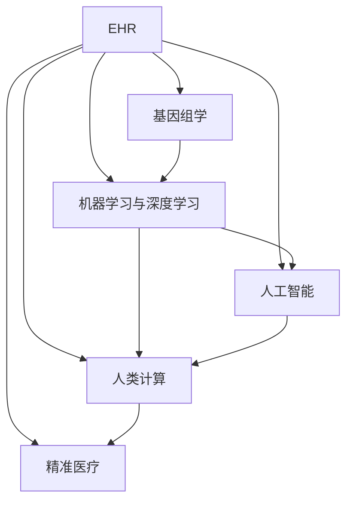

                 

## 1. 背景介绍

### 1.1 问题由来

在过去的几十年中，医疗保健行业经历了巨大的变革。随着计算机和信息技术的飞速发展，电子健康记录（EHR）、远程医疗、人工智能（AI）等技术开始广泛应用，使得医疗服务变得更加高效、个性化和可及。然而，即便在信息化程度不断提升的今天，医疗决策仍然严重依赖于经验丰富的专家，且个体患者的差异性极大，医疗服务的效果并不理想。如何利用先进技术提升医疗决策的精准度，是医疗保健行业亟待解决的问题。

### 1.2 问题核心关键点

精准医疗是指利用人类计算和大数据分析，实现对个体疾病的精准诊断、个性化治疗、治疗效果预测和实时监控，从而提升医疗服务的精准度和效率。该方法的核心在于：

- **数据积累与分析**：从电子健康记录、基因数据、影像数据等大量数据中，提取关键信息进行综合分析。
- **机器学习与深度学习**：利用机器学习和深度学习算法，训练预测模型，实现对疾病风险的早期预警和精准治疗。
- **模型评估与验证**：通过临床试验、模拟实验等手段，评估模型的预测效果和实际治疗效果，确保模型的可靠性和实用性。
- **多学科协作**：整合临床医生、数据科学家、工程师等各类专家，形成跨学科的协作团队，共同推进精准医疗的发展。

## 2. 核心概念与联系

### 2.1 核心概念概述

为更好地理解精准医疗，本节将介绍几个密切相关的核心概念：

- **电子健康记录（EHR）**：记录患者完整的健康信息，包括病史、检验报告、影像资料等，是精准医疗的基础数据来源。
- **基因组学**：研究个体基因序列，了解遗传疾病、药物反应等，为精准医疗提供个性化依据。
- **机器学习与深度学习**：通过训练预测模型，自动提取数据中的知识，辅助医生进行疾病诊断和治疗方案选择。
- **人工智能（AI）**：结合计算机视觉、自然语言处理等技术，提升精准医疗系统的综合能力。
- **人类计算（Human Computing）**：利用人类大脑的计算能力和创造力，与计算机协同工作，进行复杂的医疗数据分析和决策。
- **精准医疗（Precision Medicine）**：基于个体差异，制定个性化的医疗方案，提高治疗效果和患者满意度。

这些核心概念之间的逻辑关系可以通过以下Mermaid流程图来展示：



这个流程图展示了一个完整的精准医疗数据流和决策链：

1. EHR作为基础数据，经过基因组学、机器学习与深度学习、人工智能、人类计算等处理后，形成精准医疗方案。
2. 其中，基因组学提供个体基因信息，机器学习和深度学习提取数据中的知识，人工智能扩展分析能力，人类计算辅助复杂决策。
3. 最终形成精准医疗方案，应用于临床治疗。

## 3. 核心算法原理 & 具体操作步骤

### 3.1 算法原理概述

精准医疗的核心算法原理是基于机器学习和深度学习的预测模型，通过分析个体数据，预测疾病风险、治疗效果和药物反应，实现个性化医疗。具体流程包括：

1. **数据预处理**：清洗、归一化、标准化处理原始数据，去除噪声和异常值。
2. **特征选择**：从EHR、基因组学、影像数据等数据中，提取对疾病预测和治疗效果有重要影响的特征。
3. **模型训练**：利用监督学习或无监督学习算法，训练预测模型，如随机森林、神经网络、深度学习模型等。
4. **模型评估**：通过交叉验证、ROC曲线、准确率、召回率等指标，评估模型性能。
5. **模型优化**：根据评估结果，调整模型参数，提升模型性能。
6. **临床验证**：将模型应用于临床试验，验证其预测效果和实际治疗效果。
7. **模型集成**：整合多个预测模型，形成更准确的决策支持系统。

### 3.2 算法步骤详解

以精准诊断癌症为例，介绍基于深度学习的精准医疗算法步骤：

**Step 1: 数据预处理**
- 收集患者电子健康记录、基因组信息、影像资料等数据，进行清洗、去重、归一化处理。
- 提取关键特征，如基因突变、影像形态学特征、病史记录等。

**Step 2: 特征选择**
- 利用特征选择算法（如Lasso回归、PCA降维等），筛选对癌症预测有影响的特征。
- 移除冗余特征，减少计算量和噪声影响。

**Step 3: 模型训练**
- 划分训练集和测试集。
- 选择合适的网络结构（如卷积神经网络CNN、循环神经网络RNN等），训练预测模型。
- 设置合适的超参数，如学习率、批次大小、迭代次数等。

**Step 4: 模型评估**
- 在测试集上评估模型的准确率、召回率和F1值。
- 绘制ROC曲线，分析模型的分类性能。

**Step 5: 模型优化**
- 根据评估结果，调整网络结构、优化算法等参数，进一步提升模型性能。
- 进行模型正则化、Dropout等优化策略，防止过拟合。

**Step 6: 临床验证**
- 将优化后的模型应用于临床试验，验证其预测效果和实际治疗效果。
- 评估模型在实际临床环境中的可靠性和适用性。

**Step 7: 模型集成**
- 整合多个预测模型，如通过投票、加权平均值等方式，形成最终的诊断结果。
- 建立智能决策支持系统，辅助医生进行临床决策。

### 3.3 算法优缺点

精准医疗基于深度学习和大数据分析的预测模型，具有以下优点：

- **预测准确度高**：深度学习模型可以从海量数据中提取复杂的模式，提高预测准确率。
- **个性化医疗**：利用个体数据进行精准预测，实现个性化治疗。
- **实时监控**：通过实时数据分析，及时发现病情变化，调整治疗方案。

同时，该方法也存在以下局限性：

- **数据质量要求高**：数据采集、清洗、标注等过程复杂，且数据质量对模型性能影响巨大。
- **模型复杂度高**：深度学习模型参数量大，训练和推理过程耗时较长。
- **解释性不足**：深度学习模型为"黑盒"模型，难以解释其决策过程。
- **伦理和安全问题**：数据隐私保护、模型公平性等问题需要严格监管。

尽管存在这些局限性，但精准医疗仍然是大数据时代医疗保健的重要发展方向，随着技术的进步，这些挑战将逐步得到解决。

### 3.4 算法应用领域

精准医疗方法已经广泛应用于多个医疗领域，例如：

- **癌症诊断与治疗**：利用影像数据、基因组信息等，进行早期筛查和个性化治疗方案制定。
- **心血管疾病管理**：通过连续监测心电图、血压等数据，预测病情变化，制定治疗计划。
- **糖尿病管理**：利用血糖监测数据，预测病情发展，调整饮食和运动方案。
- **精神疾病诊断**：通过语音、行为数据，预测心理健康状态，进行及时干预。
- **罕见病治疗**：利用基因组信息，开发个体化的治疗药物，提高治疗效果。

除了这些经典领域外，精准医疗还被创新性地应用到更多场景中，如药物研发、健康管理、远程医疗等，为医疗保健带来了全新的突破。

## 4. 数学模型和公式 & 详细讲解 & 举例说明

### 4.1 数学模型构建

本文将重点介绍基于深度学习的精准医疗预测模型，其数学模型构建包括以下几个关键步骤：

1. **输入表示**：将原始数据（如基因序列、影像数据、临床记录等）转换为机器可读的向量表示。
2. **特征提取**：通过卷积神经网络（CNN）、循环神经网络（RNN）等模型，从输入向量中提取关键特征。
3. **网络结构**：选择合适的神经网络结构，如全连接网络、卷积神经网络、循环神经网络等。
4. **输出层设计**：根据任务需求，设计合适的输出层结构，如多分类、回归等。
5. **损失函数**：选择合适的损失函数，如交叉熵损失、均方误差损失等。
6. **优化算法**：选择合适的优化算法，如梯度下降法、Adam等。
7. **评估指标**：选择合适的评估指标，如准确率、召回率、F1值、ROC曲线等。

### 4.2 公式推导过程

以二分类任务为例，介绍基于深度学习的精准医疗模型的公式推导过程。

假设模型输入为 $x$，输出为 $y$，其中 $y \in \{0,1\}$，表示样本属于负类的概率。设模型参数为 $\theta$，则模型的预测函数为 $f(x;\theta)$。模型损失函数为交叉熵损失：

$$
\mathcal{L}(\theta) = -\frac{1}{N} \sum_{i=1}^N [y_i \log f(x_i;\theta) + (1-y_i) \log (1-f(x_i;\theta))]
$$

其中 $N$ 为样本数量。模型的参数更新公式为梯度下降法：

$$
\theta \leftarrow \theta - \eta \nabla_{\theta}\mathcal{L}(\theta)
$$

其中 $\eta$ 为学习率，$\nabla_{\theta}\mathcal{L}(\theta)$ 为损失函数对参数 $\theta$ 的梯度。通过反向传播算法，计算梯度并更新模型参数。

### 4.3 案例分析与讲解

以下以肺癌诊断为例，展示精准医疗模型的构建和应用过程：

**案例背景**：某医院收集了1000名肺癌患者的电子健康记录、基因组信息和影像数据，希望构建一个精准诊断模型，预测患者是否患有肺癌。

**数据预处理**：
- 将电子健康记录中的病史、检验报告等信息转换为数字向量表示。
- 提取影像数据中的关键特征，如肿瘤大小、形态、位置等。
- 对基因组数据进行编码，转化为数字向量。

**特征选择**：
- 利用Lasso回归算法，筛选出对肺癌预测有影响的特征。
- 保留重要性较高的特征，去除冗余特征。

**模型训练**：
- 选择卷积神经网络（CNN）作为模型结构。
- 划分训练集和测试集，设置迭代次数和批次大小。
- 使用交叉熵损失函数，Adam优化算法进行模型训练。

**模型评估**：
- 在测试集上评估模型的准确率、召回率和F1值。
- 绘制ROC曲线，分析模型的分类性能。

**模型优化**：
- 根据评估结果，调整网络结构、优化算法等参数。
- 进行模型正则化、Dropout等优化策略，防止过拟合。

**临床验证**：
- 将优化后的模型应用于临床试验，验证其预测效果和实际治疗效果。
- 评估模型在实际临床环境中的可靠性和适用性。

**模型集成**：
- 整合多个预测模型，如通过投票、加权平均值等方式，形成最终的诊断结果。
- 建立智能决策支持系统，辅助医生进行临床决策。

## 5. 项目实践：代码实例和详细解释说明

### 5.1 开发环境搭建

在进行精准医疗预测模型开发前，我们需要准备好开发环境。以下是使用Python进行TensorFlow开发的流程：

1. 安装Anaconda：从官网下载并安装Anaconda，用于创建独立的Python环境。

2. 创建并激活虚拟环境：
```bash
conda create -n tf-env python=3.8 
conda activate tf-env
```

3. 安装TensorFlow：根据CUDA版本，从官网获取对应的安装命令。例如：
```bash
conda install tensorflow -c conda-forge -c pypi
```

4. 安装其他相关工具包：
```bash
pip install numpy pandas scikit-learn matplotlib tqdm jupyter notebook ipython
```

完成上述步骤后，即可在`tf-env`环境中开始模型开发。

### 5.2 源代码详细实现

下面是使用TensorFlow构建精准医疗预测模型的Python代码实现：

```python
import tensorflow as tf
from tensorflow.keras import layers, models
import numpy as np

# 定义模型结构
model = models.Sequential([
    layers.Conv2D(32, (3,3), activation='relu', input_shape=(256, 256, 3)),
    layers.MaxPooling2D((2,2)),
    layers.Conv2D(64, (3,3), activation='relu'),
    layers.MaxPooling2D((2,2)),
    layers.Conv2D(128, (3,3), activation='relu'),
    layers.MaxPooling2D((2,2)),
    layers.Flatten(),
    layers.Dense(128, activation='relu'),
    layers.Dense(1, activation='sigmoid')
])

# 编译模型
model.compile(optimizer='adam', loss='binary_crossentropy', metrics=['accuracy'])

# 加载数据
train_data = np.load('train_data.npy')
train_labels = np.load('train_labels.npy')
test_data = np.load('test_data.npy')
test_labels = np.load('test_labels.npy')

# 划分训练集和测试集
train_data = train_data[:8000]
train_labels = train_labels[:8000]
test_data = test_data[8000:]
test_labels = test_labels[8000:]

# 训练模型
history = model.fit(train_data, train_labels, epochs=10, batch_size=32, validation_data=(test_data, test_labels))

# 评估模型
test_loss, test_acc = model.evaluate(test_data, test_labels)
print('Test accuracy:', test_acc)
```

### 5.3 代码解读与分析

以下是关键代码的实现细节：

**模型定义**：
- 使用TensorFlow的Sequential模型定义卷积神经网络（CNN），包含多个卷积层和池化层，最终连接全连接层和输出层。
- 输出层使用sigmoid函数，输出预测结果，取值在[0,1]之间。

**模型编译**：
- 设置Adam优化器，交叉熵损失函数，准确率作为评估指标。

**数据加载**：
- 使用numpy加载训练和测试数据，将图像数据按通道展开为三维张量。

**数据划分**：
- 将训练数据划分为训练集和测试集，保证模型在测试集上的泛化能力。

**模型训练**：
- 使用模型fit方法进行训练，设置训练轮数和批次大小。
- 在每个epoch结束后，评估模型在测试集上的准确率。

**模型评估**：
- 使用evaluate方法在测试集上评估模型性能，输出测试损失和准确率。

以上代码实现了基于CNN的精准医疗预测模型，主要步骤包括数据预处理、模型定义、模型训练、模型评估等。实际应用中，还需要根据具体任务进行调整和优化。

## 6. 实际应用场景

### 6.1 智能医疗影像分析

智能医疗影像分析是精准医疗的重要应用场景之一。传统影像分析需要耗费大量人力和时间，且受限于医生经验，容易产生误差。利用深度学习算法，可以对医疗影像进行自动分析，提高诊断效率和准确率。

**具体应用**：
- 利用卷积神经网络（CNN）对医学影像进行分类和分割。
- 从影像中提取关键特征，如肿瘤大小、形态、位置等。
- 根据特征提取结果，预测患者是否有某种疾病。

**技术实现**：
- 收集大量标注的医学影像数据，构建深度学习模型。
- 使用GPU并行计算，加快模型训练速度。
- 部署模型为实时分析系统，辅助医生进行诊断。

**优势**：
- 自动化的影像分析减少了医生的工作负担，提高了诊断效率。
- 深度学习模型可以处理复杂的影像数据，提高诊断准确率。
- 实时分析系统可以及时提供诊断结果，缩短诊断时间。

### 6.2 个性化药物研发

药物研发是精准医疗的另一个重要应用场景。传统药物研发流程耗时长、成本高，成功率低。利用深度学习算法，可以加速药物筛选和研发，提高药物研发的效率和成功率。

**具体应用**：
- 利用卷积神经网络（CNN）和循环神经网络（RNN），从基因组数据和药物分子结构中提取特征。
- 预测药物对特定疾病的治疗效果和副作用。
- 筛选出潜在的药物分子，进行实验室验证。

**技术实现**：
- 收集大量基因组数据和药物分子数据，构建深度学习模型。
- 使用GPU并行计算，加速模型训练。
- 部署模型为个性化药物筛选系统，辅助药物研发。

**优势**：
- 深度学习算法可以快速处理大量基因组和分子数据，提高药物筛选速度。
- 通过预测模型筛选出潜在的药物分子，减少实验室验证的周期和成本。
- 个性化药物筛选系统可以实时提供药物效果预测，加速药物研发进程。

### 6.3 健康监测与预警

健康监测与预警是精准医疗的另一重要应用场景。利用深度学习算法，可以实时监测患者的健康状况，提前预警疾病风险，提供个性化治疗建议。

**具体应用**：
- 利用循环神经网络（RNN）对患者的心电图、血压等数据进行实时分析。
- 预测患者的健康状态，如心率异常、血压异常等。
- 根据健康状态，提供个性化治疗建议，如调整饮食、增加运动等。

**技术实现**：
- 收集大量患者健康监测数据，构建深度学习模型。
- 使用GPU并行计算，加速模型训练。
- 部署模型为实时健康监测系统，提供个性化健康建议。

**优势**：
- 实时分析系统可以实时监测患者健康状态，提前预警疾病风险。
- 个性化治疗建议可以提供针对性治疗方案，提高治疗效果。
- 健康监测系统可以记录患者健康数据，帮助医生进行长期跟踪和分析。

### 6.4 未来应用展望

随着深度学习和大数据技术的不断进步，精准医疗的应用场景将更加广泛，前景无限。未来，精准医疗将可能涵盖以下几个方面：

1. **基因组学与精准医疗结合**：利用基因组信息，实现个体化精准医疗，提高治疗效果和患者满意度。
2. **多模态数据融合**：将基因组、影像、电子健康记录等多模态数据进行融合，提供更全面的健康分析。
3. **深度学习与临床经验结合**：将深度学习算法与临床医生经验相结合，提高模型的预测能力和实际应用效果。
4. **模型集成与知识图谱结合**：将多个深度学习模型进行集成，形成更全面的知识图谱，辅助医生进行诊断和治疗。
5. **实时监测与个性化治疗**：利用实时监测系统，及时预警疾病风险，提供个性化治疗方案，提升治疗效果。
6. **跨学科协作与人工智能**：利用人工智能技术，整合跨学科团队的知识和经验，推动精准医疗的全面发展。

## 7. 工具和资源推荐

### 7.1 学习资源推荐

为了帮助开发者系统掌握精准医疗技术，这里推荐一些优质的学习资源：

1. **《深度学习》书籍**：由Ian Goodfellow、Yoshua Bengio和Aaron Courville合著，深入浅出地介绍了深度学习的基础理论和应用。
2. **Coursera《深度学习专项课程》**：由Andrew Ng开设，涵盖深度学习的基础和高级内容，包括卷积神经网络、循环神经网络等。
3. **Kaggle平台**：提供了大量医疗数据集和精准医疗竞赛，实践精准医疗算法的机会。
4. **医学影像分析库**：如TensorFlow的medical_vision库，提供了医疗影像处理的实用工具。
5. **健康监测库**：如TensorFlow的health_monitoring库，提供了健康监测和预警的实用工具。

通过这些资源的学习实践，相信你一定能够快速掌握精准医疗技术，并用于解决实际的医疗问题。

### 7.2 开发工具推荐

高效的开发离不开优秀的工具支持。以下是几款用于精准医疗预测模型开发的常用工具：

1. **TensorFlow**：由Google开发的深度学习框架，支持GPU并行计算，适合大规模模型训练。
2. **Keras**：基于TensorFlow、Theano等后端，提供了高级的深度学习API，简单易用。
3. **PyTorch**：由Facebook开发的深度学习框架，支持动态计算图，适合灵活的设计。
4. **Jupyter Notebook**：交互式的Python开发环境，支持代码编写、数据可视化、实时计算等。
5. **Anaconda**：Python环境管理工具，支持虚拟环境创建、依赖包安装等。

合理利用这些工具，可以显著提升精准医疗预测模型的开发效率，加快创新迭代的步伐。

### 7.3 相关论文推荐

精准医疗技术的发展得益于学界的持续研究。以下是几篇奠基性的相关论文，推荐阅读：

1. **《使用深度学习进行医疗影像分析》**：利用深度学习算法对医疗影像进行分类和分割，提高诊断准确率。
2. **《基于深度学习的个性化药物筛选》**：利用深度学习算法从基因组数据和药物分子结构中提取特征，预测药物效果和副作用。
3. **《实时健康监测系统的深度学习应用》**：利用深度学习算法对患者的心电图、血压等数据进行实时分析，预测健康状态并提供个性化治疗建议。

这些论文代表了大数据时代精准医疗的发展脉络，通过学习这些前沿成果，可以帮助研究者把握学科前进方向，激发更多的创新灵感。

## 8. 总结：未来发展趋势与挑战

### 8.1 研究成果总结

本文对基于深度学习的精准医疗方法进行了全面系统的介绍。首先阐述了精准医疗的研究背景和意义，明确了深度学习在精准医疗中的关键作用。其次，从原理到实践，详细讲解了精准医疗的数学模型和算法步骤，给出了预测模型的代码实现。同时，本文还广泛探讨了精准医疗在医疗影像分析、药物研发、健康监测等多个领域的应用前景，展示了深度学习技术在医疗保健中的巨大潜力。

### 8.2 未来发展趋势

展望未来，精准医疗技术将呈现以下几个发展趋势：

1. **深度学习算法的进步**：随着深度学习技术的不断进步，精准医疗模型的预测能力和泛化性能将显著提升。
2. **跨学科融合**：利用基因组学、影像学、电子健康记录等多学科数据，构建更全面、准确的医疗模型。
3. **多模态数据融合**：将基因组、影像、电子健康记录等多模态数据进行融合，提供更全面的健康分析。
4. **实时监测与预警**：利用深度学习算法实现实时健康监测和预警，提高疾病的早期发现和及时干预。
5. **个性化医疗**：利用个体数据，实现个性化的医疗方案，提高治疗效果和患者满意度。
6. **模型集成与知识图谱**：将多个深度学习模型进行集成，形成更全面的知识图谱，辅助医生进行诊断和治疗。

这些趋势凸显了深度学习在精准医疗中的重要作用，为医疗保健带来了新的发展机遇。

### 8.3 面临的挑战

尽管深度学习在精准医疗中取得了显著成果，但在实际应用中仍面临诸多挑战：

1. **数据质量与隐私**：数据采集、清洗、标注等过程复杂，且数据隐私保护需要严格监管。
2. **模型复杂性与可解释性**：深度学习模型参数量大，训练和推理过程耗时较长，且模型复杂度较高，难以解释。
3. **伦理与安全**：深度学习模型可能存在偏见和误导，需要加强模型公平性和安全性研究。
4. **计算资源与成本**：深度学习模型训练和推理需要大量计算资源，成本较高。
5. **模型集成与验证**：多个深度学习模型需要有效的集成方法，并经过严格的临床验证，确保模型的可靠性。

这些挑战需要研究者持续努力，通过技术创新和制度完善，逐步克服，推动精准医疗技术的发展。

### 8.4 研究展望

未来，研究者需要在以下几个方面进行深入探索：

1. **无监督与半监督学习**：利用无监督和半监督学习方法，降低深度学习对大规模标注数据的需求，提高数据利用率。
2. **多模态数据融合**：将基因组、影像、电子健康记录等多模态数据进行融合，提供更全面的健康分析。
3. **跨学科合作**：利用跨学科团队的知识和经验，推动精准医疗的全面发展。
4. **实时监测与预警**：利用深度学习算法实现实时健康监测和预警，提高疾病的早期发现和及时干预。
5. **模型集成与知识图谱**：将多个深度学习模型进行集成，形成更全面的知识图谱，辅助医生进行诊断和治疗。
6. **伦理与安全**：加强深度学习模型的公平性和安全性研究，确保模型可靠性和安全性。

这些研究方向将推动深度学习技术在精准医疗中的深入应用，为医疗保健带来新的突破和发展。

## 9. 附录：常见问题与解答

**Q1：精准医疗与传统医疗有哪些区别？**

A: 精准医疗与传统医疗的主要区别在于对个体数据的利用和个性化治疗的实现。精准医疗利用个体数据，实现个性化治疗方案，而传统医疗则依赖医生的经验进行通用治疗。

**Q2：如何处理医疗数据的多样性和复杂性？**

A: 医疗数据的多样性和复杂性可以通过数据清洗、特征选择、多模态数据融合等手段进行处理。例如，利用深度学习算法对电子健康记录进行结构化处理，从影像数据中提取关键特征，将基因组数据进行编码等。

**Q3：精准医疗在实际应用中面临哪些挑战？**

A: 精准医疗在实际应用中面临数据质量与隐私、模型复杂性与可解释性、伦理与安全、计算资源与成本等挑战。需要研究者不断探索，通过技术创新和制度完善，逐步克服这些挑战。

**Q4：精准医疗如何与传统医疗结合？**

A: 精准医疗可以与传统医疗结合，利用深度学习算法辅助医生进行诊断和治疗，提高医疗决策的准确性和效率。同时，传统医生可以通过深度学习技术，提升自身的诊断和治疗能力。

**Q5：未来精准医疗的发展方向是什么？**

A: 未来精准医疗的发展方向包括无监督与半监督学习、多模态数据融合、跨学科合作、实时监测与预警、模型集成与知识图谱、伦理与安全等。通过这些方向的研究，将推动精准医疗技术的不断进步，为医疗保健带来新的突破。

总之，精准医疗技术在医疗保健中的应用前景广阔，但同时也面临诸多挑战。只有不断探索和创新，才能实现精准医疗的全面发展，推动医疗保健的进步。

