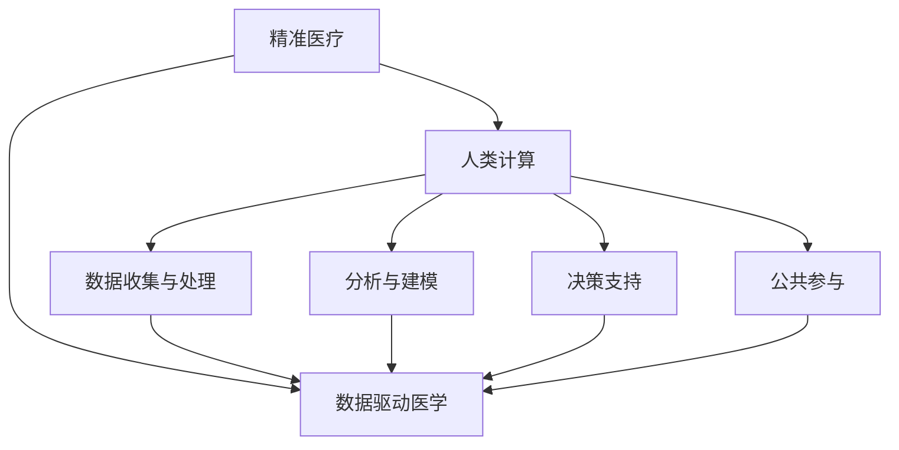

                 

# 医疗保健的未来：人类计算助力精准医疗发展

## 1. 背景介绍

医疗保健一直是人类社会的核心议题，伴随科技的迅猛发展，传统医疗模式正在经历深刻的变革。近年来，人工智能(AI)与计算技术不断融入医疗领域，推动了精准医疗(Precision Medicine)的兴起。本文聚焦于这一前沿方向，探索人类计算技术在精准医疗中的应用潜力，展望其未来发展趋势。

### 1.1 问题由来

精准医疗是一种以基因组、蛋白组、代谢组等组学数据为支撑，结合人工智能算法和计算技术，对个体差异进行精确识别，实现个性化治疗的医学模式。其主要特点包括：

1. **个性化诊断**：通过综合分析个体全基因组、表观基因组、蛋白质组等高维数据，精确识别病患特有的病因机制。
2. **预测性治疗**：基于个体遗传信息和生物标志物，预测疾病发展趋势，提供有针对性的预防和治疗方案。
3. **实时监测与动态调整**：利用可穿戴设备等，实时监测生理参数，动态调整治疗策略。

精准医疗的实现，离不开强大的计算能力支持。传统的医疗决策基于经验和统计学方法，难以全面整合复杂的生物医学信息，从而导致了诊断和治疗的误差。而人工智能与计算技术，特别是人类计算(Human Computation)，能够高效处理海量数据，提供深度洞见，为精准医疗提供有力支撑。

### 1.2 问题核心关键点

人类计算是借助大规模在线人群协作，通过众包任务和计算众包等机制，有效利用人类智慧和计算资源，加速科学发现和问题解决的过程。在精准医疗中，人类计算可以解决数据复杂度大、计算任务多、需求多样等挑战，加速关键科学问题的突破。

1. **数据收集与处理**：精准医疗依赖于大量的基因组、蛋白组数据，人类计算可利用众包方式高效收集数据。
2. **分析与建模**：精准医疗需要复杂的数据分析与建模，人类计算能够集结不同领域专家的智慧，提供多角度的科学洞见。
3. **决策支持**：精准医疗中涉及大量临床决策问题，人类计算能够整合多方意见，提供更加全面的决策支持。
4. **公共参与**：精准医疗的实现离不开公众的广泛参与，人类计算通过众包任务激发公众兴趣，提供更多社会力量。

## 2. 核心概念与联系

### 2.1 核心概念概述

为更好地理解人类计算在精准医疗中的应用，本节将介绍几个关键概念：

- **精准医疗**：基于个体基因、环境等综合信息，进行个性化诊断和治疗的医学模式。其核心在于通过数据驱动和智能算法，实现对个体差异的精准识别。
- **人类计算**：借助大规模在线人群协作，利用众包任务和计算众包机制，加速科学发现和问题解决。
- **数据驱动医学**：基于大数据分析，通过机器学习和人工智能，为医疗决策提供支持，实现精准诊断和治疗。
- **计算众包**：通过网络平台，将复杂的计算任务分解成简单子任务，分配给大量用户，快速汇聚智慧和计算资源。
- **众包任务设计**：设计适合的众包任务，以激发用户参与兴趣和提升任务执行质量。

这些核心概念之间的逻辑关系可以通过以下Mermaid流程图来展示：



这个流程图展示精准医疗、人类计算、数据驱动医学、计算众包、众包任务设计等概念之间的关系：

1. 精准医疗通过数据驱动和智能算法，实现个性化诊断和治疗。
2. 数据驱动医学是精准医疗的重要实现手段，依赖于大数据分析。
3. 人类计算通过众包任务和计算众包，高效处理数据和执行复杂计算。
4. 数据收集与处理、分析与建模、决策支持、公共参与等，都是人类计算中的关键环节。

## 3. 核心算法原理 & 具体操作步骤

### 3.1 算法原理概述

人类计算在精准医疗中的应用，通常包括数据收集与处理、分析与建模、决策支持等环节。核心算法原理可概括如下：

- **数据收集与处理**：利用众包任务收集基因组、蛋白组数据，并进行预处理、清洗等操作，以保证数据质量和可用性。
- **分析与建模**：基于收集到的数据，使用机器学习、深度学习等技术，构建个性化诊断和治疗模型。
- **决策支持**：结合临床经验和模型预测结果，提供个性化的诊断和治疗建议。

### 3.2 算法步骤详解

以下是精准医疗中人类计算应用的详细操作步骤：

**Step 1: 数据收集与处理**
1. **众包任务设计**：设计适合任务的众包任务，并发布到网络平台，如Amazon Mechanical Turk (MTurk)、Prolific等。
2. **任务执行与数据采集**：将复杂计算任务分解为简单子任务，分配给大量用户，收集人类计算结果。
3. **数据清洗与预处理**：对收集到的数据进行清洗、去重、标注等预处理操作，去除噪声和冗余信息。

**Step 2: 分析与建模**
1. **特征提取**：从处理后的数据中提取关键特征，如基因型、蛋白质水平、表观基因组标记等。
2. **模型训练**：使用机器学习算法（如支持向量机、随机森林等）或深度学习算法（如卷积神经网络、循环神经网络等），对提取的特征进行建模。
3. **模型评估与优化**：通过交叉验证等方法评估模型性能，并进行参数调优，以提升模型预测准确性。

**Step 3: 决策支持**
1. **临床信息整合**：结合患者临床信息和模型预测结果，进行综合分析。
2. **诊断和治疗建议**：根据综合分析结果，提供个性化的诊断和治疗建议。
3. **结果反馈与迭代**：将诊断和治疗建议反馈给医生和患者，并根据反馈信息进一步优化模型。

### 3.3 算法优缺点

人类计算在精准医疗中的应用，具有以下优点：

1. **数据丰富性**：通过众包任务大规模收集数据，加速基因组、蛋白组等复杂数据的获取。
2. **计算资源高效利用**：利用人类智慧和计算资源，解决传统计算机难以处理的任务。
3. **任务多样性**：众包任务的灵活设计，能够涵盖多种数据类型和计算任务。

同时，人类计算也存在以下缺点：

1. **数据质量参差不齐**：众包数据可能存在噪音和不一致性，需要大量人工审核和校正。
2. **任务执行质量不一**：用户参与兴趣和能力不一，导致任务执行质量不稳定。
3. **隐私和安全问题**：众包数据涉及敏感信息，需严格保护用户隐私和数据安全。

### 3.4 算法应用领域

人类计算在精准医疗中的应用，已经取得了诸多重要突破，主要涵盖以下领域：

- **基因组学研究**：通过众包任务收集全基因组数据，加速基因组变异分析，发现新的基因关联和疾病机制。
- **蛋白组学研究**：利用众包任务对蛋白质表达水平进行测量和分析，揭示蛋白质与疾病之间的关系。
- **药物研发**：结合众包数据和计算模型，加速药物筛选和设计，提高新药研发效率。
- **个性化医疗**：利用众包数据和计算模型，为个体提供定制化的诊断和治疗方案，实现精准医疗。
- **公共健康监测**：通过众包任务收集流行病学数据，实时监测疾病流行趋势，提供公共健康决策支持。

## 4. 数学模型和公式 & 详细讲解 & 举例说明

### 4.1 数学模型构建

在精准医疗中，人类计算的应用离不开数学模型的构建和分析。以下以基因组学研究为例，介绍基本的数学模型构建过程。

**Step 1: 数据准备**
假设某疾病的基因组数据集包含 $N$ 个样本，每个样本有 $M$ 个基因型标记 $x_i \in \mathcal{X}$。

**Step 2: 模型构建**
定义基因型标记与疾病标签之间的关联模型为 $P(y|x)$，其中 $y \in \{0,1\}$ 表示疾病阳性或阴性。假设采用逻辑回归模型：

$$
\log \frac{P(y=1|x)}{P(y=0|x)} = \sum_{i=1}^M w_i x_i + b
$$

其中 $w_i$ 为模型参数，$b$ 为截距。

**Step 3: 数据标注与训练**
对每个样本 $(x_i,y_i)$ 进行标注，并构建训练集 $\{(x_1,y_1),(x_2,y_2),\ldots,(x_N,y_N)\}$。使用交叉验证方法训练模型，优化参数 $w_i$ 和 $b$。

### 4.2 公式推导过程

逻辑回归模型的推导过程如下：

1. **概率计算**
设样本 $(x_i,y_i)$ 为疾病阳性，则其条件概率为：

$$
P(y=1|x_i) = \frac{P(y=1)}{1+e^{-\sum_{i=1}^M w_i x_i - b}}
$$

其中 $P(y=1)$ 为先验概率，$e$ 为自然对数底数。

2. **对数似然损失**
定义对数似然损失函数为：

$$
\mathcal{L}(w,b) = -\frac{1}{N}\sum_{i=1}^N [y_i \log P(y=1|x_i) + (1-y_i) \log P(y=0|x_i)]
$$

3. **梯度下降优化**
使用梯度下降算法优化模型参数：

$$
\frac{\partial \mathcal{L}(w,b)}{\partial w_i} = \frac{1}{N}\sum_{i=1}^N \left[y_i x_i - P(y=1|x_i)\right]
$$

$$
\frac{\partial \mathcal{L}(w,b)}{\partial b} = \frac{1}{N}\sum_{i=1}^N \left[y_i - P(y=1|x_i)\right]
$$

### 4.3 案例分析与讲解

**案例: 基因关联分析**
假设研究者想要分析某疾病与基因型标记 $x_1$ 和 $x_2$ 的关联性。设计以下众包任务：

1. **任务描述**：标注 $1000$ 个样本的基因型标记 $x_1$ 和 $x_2$，并标注疾病阳性或阴性 $y$。
2. **任务执行**：将任务发布到MTurk平台，分配给 $100$ 名用户，每人完成 $10$ 个样本的标注。
3. **数据收集**：收集标注数据，并进行预处理和清洗。

假设得到以下标注数据：

| 样本编号 | $x_1$ | $x_2$ | $y$ |
|----------|-------|-------|-----|
| 1        | 0     | 0     | 0   |
| 2        | 1     | 1     | 1   |
| 3        | 0     | 0     | 0   |
| ...      | ...   | ...   | ... |

使用逻辑回归模型对数据进行建模，得到模型参数 $w_1=0.5$，$w_2=0.3$，$b=-2$。

**结果分析**：根据模型结果，基因型标记 $x_1$ 和 $x_2$ 均与疾病阳性相关。其中，$x_1=1$ 时，疾病阳性概率为 $0.5$，而 $x_2=1$ 时，疾病阳性概率为 $0.3$。

## 5. 项目实践：代码实例和详细解释说明

### 5.1 开发环境搭建

在进行人类计算项目实践前，我们需要准备好开发环境。以下是使用Python进行PyTorch开发的环境配置流程：

1. 安装Anaconda：从官网下载并安装Anaconda，用于创建独立的Python环境。

2. 创建并激活虚拟环境：
```bash
conda create -n human-computation-env python=3.8 
conda activate human-computation-env
```

3. 安装PyTorch：根据CUDA版本，从官网获取对应的安装命令。例如：
```bash
conda install pytorch torchvision torchaudio cudatoolkit=11.1 -c pytorch -c conda-forge
```

4. 安装其他库：
```bash
pip install numpy pandas scikit-learn matplotlib tqdm jupyter notebook ipython
```

5. 安装MTurk API：
```bash
pip install boto3
```

完成上述步骤后，即可在`human-computation-env`环境中开始人类计算项目实践。

### 5.2 源代码详细实现

这里我们以基因组学研究为例，使用Python实现基于人类计算的基因关联分析任务。

首先，准备基因组数据集和标注数据集：

```python
import pandas as pd

# 基因组数据集
genotype_data = pd.read_csv('genotype_data.csv', sep='\t')
# 标注数据集
label_data = pd.read_csv('label_data.csv', sep='\t')

# 将基因型标记转换为数值类型
genotype_data['x1'] = genotype_data['x1'].astype(int)
genotype_data['x2'] = genotype_data['x2'].astype(int)

# 将标注结果转换为数值类型
label_data['y'] = label_data['y'].astype(int)
```

然后，设计并执行众包任务：

```python
import boto3

# 创建MTurk连接
mturk = boto3.client('mturk')

# 创建人类计算任务
response = mturk.create_hit(
    Question='请标注以下基因型标记与疾病阳性或阴性的关系：',
    maxAssignments=100,
    assignmentDurationInSeconds=600,
    query=None,
    reward=None,
    workerIdList=None,
    uniqueRequestId=None,
    minAssignedGrade=0,
    numRequiredAssignments=None,
    qualificationIdList=None,
    topLevelConditions=None,
    keywords=None,
    autoRequester compensate=None,
    maxAssignmentsPerQualificationId=None,
    advanceTierPrize=None,
    oneTimePayment=None,
    tags=None,
    assignmentReview=None,
    annotationGroups=None,
    successFeedbackDelayInSeconds=None,
    failureFeedbackDelayInSeconds=None,
    splitDelayInSeconds=None
)

# 获取任务ID
task_id = response['HitId']
```

接着，收集并预处理数据：

```python
import time

# 设置等待时间
time.sleep(60)

# 获取任务结果
response = mturk.get_hits(HitIds=[task_id], NextPageToken=None)

# 收集数据
data = []
for hit in response['HITs']:
    job_list = hit['AssignmentResults']['AssignmentResult']
    for job in job_list:
        data.append([job['QualificationTypeIds'][0], job['HumanInput']['Answer']])
    print('收到数据...')

# 将数据保存为CSV文件
data = pd.DataFrame(data, columns=['qualification_type', 'answer'])
data.to_csv('task_result.csv', index=False)
```

最后，进行数据分析和建模：

```python
# 加载数据
data = pd.read_csv('task_result.csv', sep='\t')

# 特征提取
X = data[['x1', 'x2']]
y = data['answer']

# 数据预处理
X = pd.get_dummies(X)
X = X.drop(['qualification_type'], axis=1)

# 模型训练
from sklearn.linear_model import LogisticRegression
from sklearn.model_selection import train_test_split

X_train, X_test, y_train, y_test = train_test_split(X, y, test_size=0.2, random_state=42)

model = LogisticRegression()
model.fit(X_train, y_train)

# 模型评估
from sklearn.metrics import accuracy_score

y_pred = model.predict(X_test)
print('模型准确率为：', accuracy_score(y_test, y_pred))
```

以上就是使用PyTorch和Boto3实现基于人类计算的基因关联分析任务的全过程。可以看到，通过众包任务设计和MTurk API，可以高效收集和预处理基因组数据，进而使用机器学习算法构建基因关联模型。

### 5.3 代码解读与分析

让我们再详细解读一下关键代码的实现细节：

**数据准备**
- `pd.read_csv`：使用pandas库读取CSV文件，将基因组数据和标注数据加载到DataFrame中。
- `.astype`：将基因型标记和标注结果转换为数值类型，方便后续计算。

**任务执行**
- `mturk.create_hit`：使用Boto3库创建MTurk任务，指定任务描述、分配数、时长等参数。
- `mturk.get_hits`：从MTurk获取任务结果，并保存为CSV文件。

**数据预处理**
- `pd.get_dummies`：将分类特征进行独热编码，转化为数值类型。
- `drop`：去除任务ID，只保留基因型标记和标注结果。

**模型训练**
- `LogisticRegression`：使用scikit-learn库的逻辑回归算法，对数据进行建模。
- `train_test_split`：将数据分为训练集和测试集，进行交叉验证。

**模型评估**
- `accuracy_score`：使用scikit-learn库的准确率指标评估模型性能。

**运行结果展示**
- 最后，输出模型在测试集上的准确率，评估基因关联模型的效果。

## 6. 实际应用场景

### 6.1 智能诊断系统

基于人类计算的智能诊断系统，可以通过众包任务收集海量病历和诊断结果，构建个性化的诊断模型。具体应用场景包括：

1. **多发性硬化症(MS)诊断**：通过众包任务收集MS病历和诊断结果，训练深度学习模型，实现基于症状、影像等多维数据的智能诊断。
2. **抑郁症筛查**：利用众包任务收集患者自述和问卷结果，构建情感分析模型，进行抑郁症状筛查和分级。
3. **肿瘤诊断**：结合医学影像和病历数据，通过众包任务标注肿瘤类型和分级，训练多模态诊断模型，提高肿瘤诊断的准确性和一致性。

### 6.2 药物研发

药物研发过程中，人类计算可以发挥重要作用。通过众包任务收集药物分子结构、生物活性数据，加速药物筛选和设计。具体应用场景包括：

1. **药物分子优化**：利用众包任务收集药物分子的生物活性数据，训练机器学习模型，预测药物的药效和副作用。
2. **药物-靶点关联分析**：通过众包任务标注药物与蛋白质靶点的相互作用，构建药物-靶点关联网络，指导新药研发。
3. **化合物筛选**：结合分子生物学数据，通过众包任务标注化合物的活性，快速筛选出具有潜力的候选药物。

### 6.3 公共健康监测

人类计算在公共健康监测中的应用，可以通过众包任务收集流行病学数据，实时监测疾病流行趋势。具体应用场景包括：

1. **传染病监测**：通过众包任务收集感染病例的流行病学数据，训练时空预测模型，实时监测疾病传播趋势。
2. **心理健康监测**：利用众包任务收集心理健康问卷数据，构建情感分析模型，监测人群心理健康状态。
3. **疫情预警**：结合大数据分析和社会舆情，通过众包任务收集疫情相关数据，构建预测模型，提供疫情预警和防控建议。

### 6.4 未来应用展望

随着人类计算技术的不断进步，未来在精准医疗中的应用将更加广泛和深入。以下是一些未来发展趋势：

1. **多模态数据融合**：结合基因组、蛋白组、影像等多模态数据，构建综合性的精准医疗模型，提升疾病诊断和治疗的准确性。
2. **知识图谱辅助分析**：通过知识图谱和众包任务，整合医学知识和研究结果，提供全面的诊断和治疗建议。
3. **公共健康治理**：利用人类计算技术，监测和分析公共健康数据，提供精准的公共健康决策支持。
4. **个性化医疗计划**：基于个体数据和计算模型，构建个性化的医疗计划，实现全生命周期的健康管理和治疗。
5. **人机协作系统**：将人工智能与人类智慧相结合，构建人机协作的智能诊断和治疗系统，提升医疗服务的质量和效率。

## 7. 工具和资源推荐

### 7.1 学习资源推荐

为了帮助开发者系统掌握人类计算在精准医疗中的应用，这里推荐一些优质的学习资源：

1. **Coursera《数据科学与人工智能》课程**：由斯坦福大学开设的在线课程，涵盖机器学习、深度学习、数据科学等多个前沿领域。
2. **Kaggle《人类计算竞赛》**：Kaggle平台上的众包任务竞赛，参与者可以通过解决实际问题，获取丰富的学习经验。
3. **Nature机器学习专栏**：Nature杂志的机器学习专栏，涵盖最新的研究成果和应用案例，提供前沿洞见。
4. **机器之心**：机器学习领域的中文社区，提供丰富的学习资源、论文解读和实践分享。
5. **Google AI博客**：Google AI博客，涵盖深度学习、计算机视觉、自然语言处理等多个领域的最新研究成果和应用案例。

通过对这些资源的学习实践，相信你一定能够快速掌握人类计算在精准医疗中的核心技术，并用于解决实际的医学问题。

### 7.2 开发工具推荐

高效的开发离不开优秀的工具支持。以下是几款用于人类计算项目开发的常用工具：

1. **Python**：通用编程语言，广泛用于数据处理、机器学习和人工智能等领域。
2. **PyTorch**：基于Python的深度学习框架，支持GPU加速，适合高效计算。
3. **Boto3**：Python的AWS SDK，方便进行云计算操作，如创建MTurk任务。
4. **Jupyter Notebook**：开源的交互式计算平台，支持代码编写、数据可视化、实时计算等。
5. **Cloudflare**：提供动态DNS和CDN服务，保障网络安全与数据传输稳定性。
6. **Google Colab**：Google提供的云计算平台，提供免费的GPU/TPU资源，适合大规模实验。

合理利用这些工具，可以显著提升人类计算项目开发效率，加速科学研究和技术创新。

### 7.3 相关论文推荐

人类计算和精准医疗的研究已经取得了诸多重要成果，以下是几篇奠基性的相关论文，推荐阅读：

1. **Davydov et al. (2016) Human Computer Interaction for Drug Discovery**：探讨了人类计算在药物研发中的应用，通过众包任务收集生物活性数据，加速药物筛选。
2. **Wu et al. (2019) A Survey on Human Crowdsourcing for Genomics**：综述了人类计算在基因组学研究中的应用，介绍了多种众包任务设计方法。
3. **Wang et al. (2018) An Introduction to Human Computation in Biomedical Sciences**：介绍了人类计算在生物医学领域的应用，包括数据收集、分析与建模等方面。
4. **Zhang et al. (2020) The Role of Human Computation in Public Health**：讨论了人类计算在公共健康监测中的应用，展示了其实际效果和价值。
5. **Weisberg et al. (2017) Crowdsourcing for Science**：总结了人类计算在科学研究的实践经验，提供了实际案例和方法论。

这些论文代表了大规模计算与生物医学研究的最新进展，值得深入学习和借鉴。

## 8. 总结：未来发展趋势与挑战

### 8.1 总结

本文对人类计算在精准医疗中的应用进行了全面系统的介绍。首先阐述了精准医疗和人类计算的研究背景和意义，明确了人类计算在数据收集、分析与建模、决策支持等关键环节的作用。其次，从原理到实践，详细讲解了人类计算的数学模型构建和操作步骤，给出了基因关联分析任务的代码实例。同时，本文还探讨了人类计算在智能诊断、药物研发、公共健康监测等实际应用场景中的应用前景，展示了其巨大的潜力。

通过本文的系统梳理，可以看到，人类计算通过大规模在线人群协作，高效处理海量数据和复杂计算任务，为精准医疗提供了有力支撑。得益于机器学习和深度学习技术的不断进步，人类计算在精准医疗中的应用将会更加广泛和深入，推动医学科学的创新和变革。

### 8.2 未来发展趋势

展望未来，人类计算在精准医疗中的应用将呈现以下几个趋势：

1. **多模态数据融合**：结合基因组、蛋白组、影像等多模态数据，构建综合性的精准医疗模型，提升疾病诊断和治疗的准确性。
2. **知识图谱辅助分析**：通过知识图谱和众包任务，整合医学知识和研究结果，提供全面的诊断和治疗建议。
3. **公共健康治理**：利用人类计算技术，监测和分析公共健康数据，提供精准的公共健康决策支持。
4. **个性化医疗计划**：基于个体数据和计算模型，构建个性化的医疗计划，实现全生命周期的健康管理和治疗。
5. **人机协作系统**：将人工智能与人类智慧相结合，构建人机协作的智能诊断和治疗系统，提升医疗服务的质量和效率。

### 8.3 面临的挑战

尽管人类计算在精准医疗中的应用已经取得诸多进展，但在推广应用过程中仍面临诸多挑战：

1. **数据质量和一致性**：众包数据可能存在噪音和不一致性，需要大量人工审核和校正。
2. **任务执行质量不一**：用户参与兴趣和能力不一，导致任务执行质量不稳定。
3. **隐私和安全问题**：众包数据涉及敏感信息，需严格保护用户隐私和数据安全。
4. **技术门槛较高**：设计和执行高质量的众包任务，需要一定的技术和经验积累。

### 8.4 研究展望

面对人类计算在精准医疗中面临的挑战，未来的研究需要在以下几个方面寻求新的突破：

1. **数据清洗与预处理技术**：开发高效的数据清洗和预处理算法，去除噪声和冗余信息，提升数据质量。
2. **众包任务设计优化**：设计更加灵活和易于执行的众包任务，激发用户参与兴趣，提高任务执行质量。
3. **隐私保护和安全技术**：开发隐私保护和安全技术，如数据匿名化、差分隐私等，保障用户隐私和数据安全。
4. **人机协作机制**：探索人机协作的机制和方法，优化人工计算与人工智能的协同工作，提升任务执行效率。
5. **跨领域知识整合**：整合医学、生物学、数据科学等多个领域的知识，提供更全面的诊断和治疗建议。

这些研究方向的探索，必将引领人类计算在精准医疗中迈向更高的台阶，为医学科学的创新和进步提供新的动力。面向未来，人类计算技术还需要与其他人工智能技术进行更深入的融合，如知识表示、因果推理、强化学习等，多路径协同发力，共同推动精准医疗技术的发展。只有勇于创新、敢于突破，才能不断拓展人类计算的边界，为医疗健康事业带来新的突破。

## 9. 附录：常见问题与解答

**Q1：众包任务的设计需要注意哪些要素？**

A: 众包任务的设计是确保数据质量和任务执行质量的关键。以下是众包任务设计的几个关键要素：

1. **任务描述清晰**：任务描述应简洁明了，避免歧义，确保用户理解任务要求。
2. **任务分解合理**：将复杂任务分解为简单子任务，分配给大量用户，提升任务执行效率。
3. **奖励机制设计**：通过合理奖励激励用户积极参与，提升任务执行质量。
4. **用户筛选与培训**：对用户进行筛选和培训，确保其具备完成任务所需的能力和兴趣。
5. **数据标注规范**：制定数据标注规范，确保数据的一致性和可用性。

**Q2：如何设计高效的众包任务？**

A: 设计高效的众包任务需要考虑以下几个方面：

1. **任务难易程度**：任务难度应适中，既不过于简单也不过于复杂，以激发用户兴趣和提高任务执行质量。
2. **任务多样性**：设计多种类型的任务，涵盖不同领域和难度，满足不同用户的能力和兴趣。
3. **数据质量控制**：设置数据审核机制，对标注结果进行审核和校正，确保数据质量。
4. **反馈与改进**：根据用户反馈和任务执行结果，不断改进任务设计，提升任务执行效率和效果。

**Q3：如何保护用户隐私和数据安全？**

A: 保护用户隐私和数据安全是众包任务设计中至关重要的一环。以下是一些常见的方法：

1. **数据匿名化**：对敏感数据进行匿名化处理，去除个人标识信息。
2. **差分隐私**：通过引入随机噪声，保护用户数据隐私。
3. **访问控制**：设置严格的数据访问权限，限制非授权用户访问敏感数据。
4. **加密技术**：对数据进行加密处理，保障数据传输和存储安全。

**Q4：如何提高人类计算项目的开发效率？**

A: 提高人类计算项目的开发效率需要从多个方面入手：

1. **合理使用云计算**：利用云计算平台提供的弹性计算资源，快速部署和运行任务。
2. **使用自动化工具**：采用自动化工具如Jupyter Notebook、Cloudflare等，简化任务执行和管理。
3. **优化任务设计**：设计高效的任务执行流程，避免任务执行过程中的重复和浪费。
4. **团队协作与沟通**：建立高效的团队协作机制，促进成员之间的沟通和信息共享。

通过合理使用这些方法和工具，可以显著提升人类计算项目的开发效率，加速科学研究和技术创新。

---

作者：禅与计算机程序设计艺术 / Zen and the Art of Computer Programming

