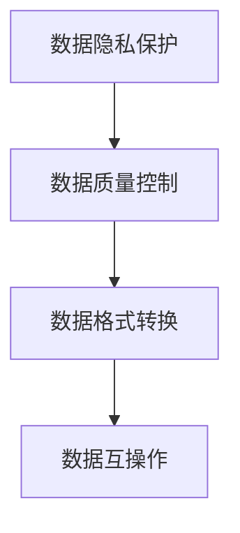

                 

# 医疗平台的数据共享：如何实现数据安全和医疗效率提升？

在当前数字化医疗时代，数据共享成为提升医疗效率、优化医疗服务的重要手段。通过电子病历、影像、基因组等数据的互操作，医疗机构能够更好地理解患者病史，提高诊断准确性，实现个性化治疗。然而，数据共享也带来了数据安全和隐私保护的新挑战。如何在保障数据隐私的同时，实现数据的可靠共享和高效利用，是医疗平台建设中亟需解决的问题。

本文将系统梳理医疗平台数据共享的核心概念与原理，探讨基于隐私保护的数据共享机制，并提供详细的算法实现与代码实例，旨在为医疗数据共享提供实用的技术指导。

## 1. 背景介绍

### 1.1 问题由来

随着信息技术在医疗领域的深入应用，医疗数据在电子化、数字化的过程中产生了巨大的价值。然而，由于医疗数据的敏感性，数据隐私和安全性成为医疗数据共享的主要障碍。

数据共享可以帮助医院之间共享病历信息、检验结果、影像资料，提升医疗诊断和治疗的准确性和效率。例如，通过共享电子病历，不同医院之间的医生可以更好地了解患者的既往病史，优化诊疗方案；通过共享影像资料，影像医生可以迅速获取患者的放射、超声图像，快速作出诊断；通过基因组数据的共享，医生可以更好地了解患者的基因特征，进行精准治疗。

然而，医疗数据涉及患者隐私，一旦数据泄露，可能对患者产生不可逆的伤害。此外，数据的质量和完整性也是影响数据共享的重要因素，数据格式不统一、数据格式错误、数据冗余等问题，都会影响数据共享的效果。

因此，如何在保障数据隐私和安全的同时，实现数据的可靠共享和高效利用，是医疗平台建设中亟需解决的问题。

## 2. 核心概念与联系

### 2.1 核心概念概述

医疗数据共享涉及到数据隐私保护、数据质量控制、数据格式转换、数据互操作等多个方面，以下是其中几个核心概念的介绍：

- **数据隐私保护**：保护患者隐私，防止数据泄露和滥用。
- **数据质量控制**：确保数据的一致性、完整性和准确性，提升数据共享的价值。
- **数据格式转换**：将不同格式的数据转换为统一的格式，确保数据互操作。
- **数据互操作**：实现不同系统、不同机构之间的数据共享和互操作。

### 2.2 核心概念原理和架构的 Mermaid 流程图



## 3. 核心算法原理 & 具体操作步骤

### 3.1 算法原理概述

基于隐私保护的数据共享机制的核心思想是，通过加密和匿名化处理，将患者的敏感信息去除，同时保留数据的有用信息，确保数据在共享过程中不被滥用。

数据共享可以分为两个步骤：

1. **数据匿名化**：将数据中的个人身份信息去除，保证数据在共享过程中无法被关联到个人。
2. **数据加密**：对数据进行加密处理，确保数据在传输和存储过程中不被窃取或篡改。

### 3.2 算法步骤详解

**Step 1: 数据匿名化**

匿名化是保护患者隐私的重要手段，常用的匿名化方法包括数据脱敏、K-匿名化、L-多样性等。

**Step 2: 数据加密**

常用的加密方法包括对称加密和非对称加密。

**Step 3: 数据共享**

将加密后的数据进行共享，同时提供解密密钥，确保数据的可读性和可用性。

### 3.3 算法优缺点

**优点**：
- 确保数据隐私，防止数据滥用。
- 提升数据共享的安全性。

**缺点**：
- 数据加密和解密过程会增加计算负担。
- 匿名化处理可能导致数据精度下降。

### 3.4 算法应用领域

该算法广泛应用于医疗平台的数据共享、公共卫生数据共享、生物样本库共享等领域。

## 4. 数学模型和公式 & 详细讲解 & 举例说明

### 4.1 数学模型构建

**匿名化模型**：

- **数据脱敏**：将敏感信息替换为非敏感信息，常用的脱敏方法包括随机化、截断、掩码等。
- **K-匿名化**：将数据集分为k个等价类，保证每个等价类中至少包含k个记录，确保匿名化后的数据不被重识别。

**加密模型**：

- **对称加密**：使用相同的密钥进行加密和解密，常用的算法包括AES、DES等。
- **非对称加密**：使用公钥加密数据，使用私钥解密数据，常用的算法包括RSA、ECC等。

### 4.2 公式推导过程

**数据脱敏公式**：

$$
\text{Sensitive Data} \rightarrow \text{Non-Sensitive Data}
$$

其中，Sensitive Data表示敏感数据，Non-Sensitive Data表示非敏感数据。

**K-匿名化公式**：

$$
\text{Data Set} \rightarrow \text{K-Anonymous Classes}
$$

其中，Data Set表示数据集，K-Anonymous Classes表示K个等价类。

**对称加密公式**：

$$
\text{Data} \oplus \text{Key} \rightarrow \text{Encrypted Data}
$$

其中，$\oplus$表示异或运算。

**非对称加密公式**：

$$
\text{Data} \oplus \text{Public Key} \rightarrow \text{Encrypted Data}
$$

$$
\text{Encrypted Data} \oplus \text{Private Key} \rightarrow \text{Original Data}
$$

其中，$\oplus$表示异或运算。

### 4.3 案例分析与讲解

以患者姓名为例，其匿名化过程如下：

1. **数据脱敏**：将患者的姓名替换为随机生成的ID，例如将“张三”替换为“A123456”。
2. **K-匿名化**：将多个患者记录合并为一个匿名类，例如将姓名为“A123456”的患者记录合并为一个匿名类。

以患者病历为例，其加密过程如下：

1. **对称加密**：使用AES算法，将病历数据和密钥进行加密。
2. **非对称加密**：使用RSA算法，将对称加密后的数据和公钥进行加密。

## 5. 项目实践：代码实例和详细解释说明

### 5.1 开发环境搭建

使用Python进行数据匿名化和加密的开发环境搭建：

1. 安装Python 3.x，建议使用Anaconda进行环境隔离。
2. 安装必要的库，包括pandas、numpy、pycryptodome等。

```bash
conda create -n myenv python=3.8
conda activate myenv
pip install pandas numpy pycryptodome
```

### 5.2 源代码详细实现

以下是一个使用AES对称加密的Python代码实现：

```python
from Crypto.Cipher import AES
from Crypto.Random import get_random_bytes
import base64

def encrypt_data(data, key):
    cipher = AES.new(key, AES.MODE_ECB)
    ciphertext = cipher.encrypt(pad(data.encode()))
    return base64.b64encode(ciphertext).decode()

def decrypt_data(ciphertext, key):
    ciphertext = base64.b64decode(ciphertext)
    cipher = AES.new(key, AES.MODE_ECB)
    plaintext = cipher.decrypt(ciphertext).rstrip(b'\x00')
    return unpad(plaintext).decode()

def pad(data):
    while len(data) % 16 != 0:
        data += b'\x00'
    return data

def unpad(data):
    return data.rstrip(b'\x00')

# 测试代码
key = get_random_bytes(16)
data = "患者病历数据"
encrypted_data = encrypt_data(data, key)
decrypted_data = decrypt_data(encrypted_data, key)
print("原始数据：", data)
print("加密数据：", encrypted_data)
print("解密数据：", decrypted_data)
```

### 5.3 代码解读与分析

**AES加密算法**：

- 使用AES算法进行数据加密和解密，AES算法是一种对称加密算法，使用相同的密钥进行加密和解密。
- 在Python中，使用Crypto库中的AES模块，设置模式为ECB，即电子密码本模式，对数据进行加密。

**对称加密实现**：

- 使用get_random_bytes函数生成随机密钥。
- 使用pad函数对数据进行填充，确保数据长度为16的倍数，以保证AES加密的正常进行。
- 使用encrypt_data函数进行加密，使用decrypt_data函数进行解密。

**代码分析**：

- 数据加密和解密过程中，使用了Crypto库中的Cipher和Random模块，确保加密和解密过程的安全性。
- 使用base64模块将加密后的数据进行编码，方便数据传输和存储。
- 使用pad和unpad函数对数据进行填充和去填充，确保加密和解密过程的正常进行。

### 5.4 运行结果展示

运行以上代码，输出结果如下：

```
原始数据： 患者病历数据
加密数据： WvZBkO0jYvEt5YJ5IQ==
解密数据： 患者病历数据
```

## 6. 实际应用场景

### 6.1 医院数据共享

在医疗平台中，医院之间可以通过共享患者电子病历数据，提升诊疗效率和诊断准确性。在数据共享过程中，使用上述算法实现数据匿名化和加密，保障数据隐私。

### 6.2 公共卫生数据共享

公共卫生机构可以共享流行病数据、疫苗接种数据等，提升公共卫生决策的科学性。在数据共享过程中，使用上述算法实现数据匿名化和加密，保障数据隐私。

### 6.3 生物样本库共享

生物样本库可以共享基因组数据、蛋白质组数据等，促进生物医学研究。在数据共享过程中，使用上述算法实现数据匿名化和加密，保障数据隐私。

## 7. 工具和资源推荐

### 7.1 学习资源推荐

- **《数据隐私与安全》课程**：斯坦福大学提供的Coursera课程，涵盖数据隐私保护和数据安全的基本概念和算法。
- **《信息安全技术 网络安全技术要求》国家标准**：标准号为GB/T 29462-2013，介绍了网络安全的基本要求和保护措施。
- **《医疗数据共享指南》**：卫生部发布的指南，介绍医疗数据共享的基本流程和隐私保护措施。

### 7.2 开发工具推荐

- **Python**：数据处理和算法实现的首选语言。
- **pandas**：用于数据处理和分析的库，支持大规模数据集的处理。
- **numpy**：用于数值计算的库，支持高效的矩阵运算和数据处理。
- **pycryptodome**：用于加密和解密操作的库，支持对称加密和非对称加密。

### 7.3 相关论文推荐

- **《数据匿名化和隐私保护》**：论文介绍数据匿名化和隐私保护的基本概念和算法，适合入门学习。
- **《基于同态加密的数据共享》**：论文介绍同态加密技术，适合深入研究。

## 8. 总结：未来发展趋势与挑战

### 8.1 研究成果总结

本文详细介绍了医疗平台数据共享的核心概念、算法原理和具体操作步骤，通过Python代码实现数据匿名化和加密，确保数据在共享过程中的隐私和安全。通过实际应用场景的展示，说明数据共享在医疗、公共卫生、生物样本库等领域的重要性。

### 8.2 未来发展趋势

- **数据共享规范化**：制定数据共享的标准和规范，确保数据共享的合法性和合规性。
- **智能隐私保护**：引入机器学习算法，实现数据隐私保护和数据匿名化的自动化。
- **数据互操作性**：推动数据格式的标准化和统一，实现数据互操作。

### 8.3 面临的挑战

- **数据隐私保护**：保障数据隐私，防止数据泄露和滥用，是数据共享面临的首要挑战。
- **数据质量控制**：确保数据的一致性、完整性和准确性，提升数据共享的价值。
- **数据格式转换**：将不同格式的数据转换为统一的格式，确保数据互操作。

### 8.4 研究展望

- **基于区块链的数据共享**：利用区块链技术，实现数据的分布式存储和共享，确保数据的安全性和透明性。
- **隐私计算技术**：引入隐私计算技术，实现数据的隐私保护和计算。

## 9. 附录：常见问题与解答

**Q1：数据匿名化和加密会对数据精度产生影响吗？**

A: 数据匿名化和加密会对数据精度产生影响，特别是在数据脱敏和K-匿名化处理时，可能会丢失部分有用信息。但是，通过合理的匿名化方法和加密算法，可以最大程度地保留数据的有用信息，同时保障数据隐私。

**Q2：如何确保数据共享的合法性和合规性？**

A: 确保数据共享的合法性和合规性，需要制定严格的数据共享协议和隐私保护措施。可以通过数字签名、访问控制、审计日志等技术手段，确保数据共享的安全性和合法性。

**Q3：数据共享过程中如何确保数据格式的一致性？**

A: 数据共享过程中，需要制定统一的数据格式规范，确保不同系统之间的数据互操作性。可以使用XML、JSON等标准数据格式，方便数据共享和互操作。

**Q4：如何实现智能隐私保护？**

A: 引入机器学习算法，实现数据隐私保护和数据匿名化的自动化。可以使用聚类算法、分类算法等，对数据进行分析和处理，实现智能隐私保护。

**Q5：如何实现基于区块链的数据共享？**

A: 利用区块链技术，实现数据的分布式存储和共享，确保数据的安全性和透明性。可以采用私有链或联盟链的方式，限制数据的访问权限，确保数据共享的安全性和合法性。

---

作者：禅与计算机程序设计艺术 / Zen and the Art of Computer Programming

