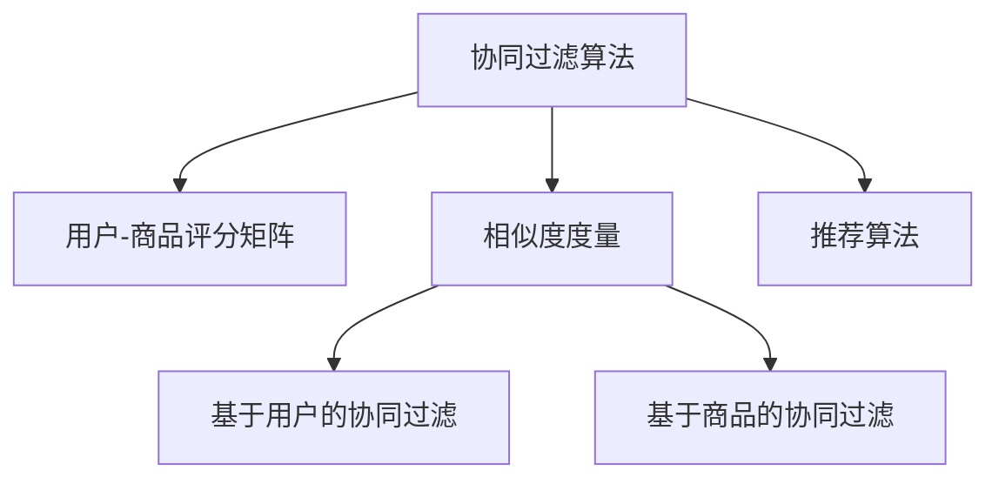

                 

# 协同过滤算法在电商推荐系统中的应用：原理与实践

## 1. 背景介绍

### 1.1 问题由来

在现代电商交易平台上，用户购买行为的多样性和个性化要求越来越高，传统的“一视同仁”推荐模式已无法满足用户需求。如何在海量商品中筛选出符合用户偏好的商品，并推荐给用户，成为了电商推荐系统面临的主要挑战。协同过滤算法（Collaborative Filtering，CF）作为推荐系统中最经典的推荐方法，通过分析用户行为数据，挖掘用户间的相似性，从而预测用户对商品的偏好，在电商推荐系统中得到了广泛应用。

### 1.2 问题核心关键点

协同过滤算法的核心在于通过对用户行为数据的分析，构建用户间或商品间的相似度矩阵，并利用相似度矩阵预测用户对未交互商品的评分。该算法的优势在于无需考虑商品的属性特征，能够直接从用户行为数据中挖掘出更深层次的用户偏好，实现个性化推荐。

协同过滤算法主要有两种形式：基于用户的协同过滤和基于商品的协同过滤。基于用户的协同过滤算法通过计算用户间的相似度，来预测用户对未交互商品的评分。基于商品的协同过滤算法通过计算商品间的相似度，来预测用户对未交互商品的评分。

### 1.3 问题研究意义

协同过滤算法在电商推荐系统中的应用，对于提升用户购物体验、增加平台交易转化率、优化库存管理等方面具有重要意义：

1. 提升用户体验。通过个性化的商品推荐，满足用户的个性化需求，提高用户满意度。
2. 增加交易转化率。通过精准的商品推荐，提高用户购买转化率，增加平台收入。
3. 优化库存管理。通过预测商品的需求量，合理规划库存，避免库存积压和缺货现象。

协同过滤算法在电商推荐系统中的成功应用，也推动了推荐系统技术的发展，为其他领域的推荐系统提供了有益的借鉴。

## 2. 核心概念与联系

### 2.1 核心概念概述

为更好地理解协同过滤算法在电商推荐系统中的应用，本节将介绍几个密切相关的核心概念：

- 协同过滤算法（Collaborative Filtering，CF）：基于用户行为数据构建用户间或商品间的相似度矩阵，通过相似度矩阵预测用户对未交互商品的评分，实现个性化推荐。
- 用户-商品评分矩阵：记录用户对商品的评分数据，是协同过滤算法的基础。
- 相似度度量：用于衡量用户或商品间的相似程度，常用的度量方法包括余弦相似度、皮尔逊相关系数等。
- 推荐算法：包括协同过滤算法、基于内容的推荐算法、深度学习推荐算法等，协同过滤算法是最经典的推荐方法。

这些核心概念之间的逻辑关系可以通过以下Mermaid流程图来展示：



这个流程图展示了几组核心概念及其之间的关系：

1. 协同过滤算法依赖于用户-商品评分矩阵和相似度度量。
2. 基于用户的协同过滤和基于商品的协同过滤是两种主要形式。
3. 协同过滤算法属于推荐算法的一种。

这些概念共同构成了协同过滤算法在电商推荐系统中的应用框架，为其个性化推荐提供了有力的支持。

## 3. 核心算法原理 & 具体操作步骤
### 3.1 算法原理概述

协同过滤算法的核心思想是通过分析用户行为数据，构建用户间或商品间的相似度矩阵，并利用相似度矩阵预测用户对未交互商品的评分。其基本步骤如下：

1. 收集用户行为数据，构建用户-商品评分矩阵。
2. 计算用户或商品间的相似度，构建相似度矩阵。
3. 利用相似度矩阵，预测用户对未交互商品的评分。
4. 根据预测评分进行推荐，更新用户行为数据。

协同过滤算法基于用户行为数据的假设，认为用户的历史评分能够反映其对商品的偏好，相似的用户或商品在评分上会有较高的相关性。通过构建相似度矩阵，协同过滤算法能够从用户行为数据中挖掘出更深层次的用户偏好，实现个性化推荐。

### 3.2 算法步骤详解

协同过滤算法的具体实现步骤如下：

**Step 1: 数据收集与预处理**

- 收集用户行为数据，包括点击、浏览、购买、评价等行为数据。
- 对行为数据进行清洗和预处理，去除无效数据、重复数据等。

**Step 2: 构建用户-商品评分矩阵**

- 统计用户对商品的历史评分，构建用户-商品评分矩阵 $U \times I$，其中 $U$ 为用户数，$I$ 为商品数。
- 将用户对商品的评分矩阵 $R$ 转化为模型可用的矩阵 $A$，即 $A = R_{+} + \epsilon$，其中 $R_{+}$ 为 $R$ 中非零值，$\epsilon$ 为噪声项，一般取 $\epsilon \sim N(0, \sigma^2)$。

**Step 3: 计算相似度矩阵**

- 基于用户或商品的历史评分，计算用户间或商品间的相似度，构建相似度矩阵 $U \times U$ 或 $I \times I$。常用的相似度度量方法包括余弦相似度、皮尔逊相关系数等。
- 利用相似度矩阵 $A$ 和 $U$，计算用户对未交互商品的预测评分。

**Step 4: 推荐与更新**

- 根据用户对未交互商品的预测评分，选择评分较高的商品进行推荐。
- 将用户对商品的评分数据进行更新，重新计算相似度矩阵和预测评分，更新推荐结果。

### 3.3 算法优缺点

协同过滤算法的优点在于能够直接从用户行为数据中挖掘出用户偏好，实现个性化推荐。同时，算法简单高效，对商品的属性特征没有要求，适用于各类电商推荐系统。

但协同过滤算法也存在一些局限性：

1. 数据稀疏性。用户对商品评分的数据往往非常稀疏，难以构建完整的相似度矩阵。
2. 冷启动问题。新用户或新商品缺乏历史评分数据，难以进行有效推荐。
3. 计算复杂度高。构建相似度矩阵和预测评分需要大量计算，对于大规模数据集而言，计算复杂度较高。
4. 隐式反馈难以处理。电商推荐系统中的用户行为数据多为隐式反馈，难以处理。

尽管存在这些局限性，但协同过滤算法在电商推荐系统中的应用仍然具有广泛价值，通过优化算法设计、引入其他推荐方法等手段，可以有效应对其局限性。

### 3.4 算法应用领域

协同过滤算法在电商推荐系统中的应用，具体包括：

- 个性化推荐：通过分析用户历史行为数据，挖掘用户偏好，推荐符合用户需求的商品。
- 新用户/商品推荐：针对新用户或新商品，利用相似度矩阵预测其对商品的评分，进行有效推荐。
- 热门商品推荐：通过计算商品间的相似度，挖掘热门商品，进行商品推荐。
- 交易转化率提升：通过精准的商品推荐，提高用户购买转化率，增加平台收入。

除了电商推荐系统，协同过滤算法在电影推荐、音乐推荐、新闻推荐等许多领域都有广泛应用。随着协同过滤算法的不断发展，其在更多领域的应用前景依然广阔。

## 4. 数学模型和公式 & 详细讲解  
### 4.1 数学模型构建

协同过滤算法的数学模型主要包括以下几个部分：

- 用户-商品评分矩阵 $R$：记录用户对商品的评分数据。
- 相似度矩阵 $A$：基于用户或商品的历史评分，计算相似度，构建相似度矩阵。
- 预测评分 $\hat{r}_{ui}$：利用相似度矩阵 $A$ 和用户-商品评分矩阵 $U$，预测用户对未交互商品的评分。

具体数学模型如下：

1. 用户-商品评分矩阵 $R$：

$$
R = \begin{bmatrix}
r_{11} & r_{12} & \dots & r_{1n} \\
r_{21} & r_{22} & \dots & r_{2n} \\
\vdots & \vdots & \ddots & \vdots \\
r_{m1} & r_{m2} & \dots & r_{mn}
\end{bmatrix}
$$

2. 相似度矩阵 $A$：

$$
A = R_{+} + \epsilon
$$

3. 预测评分 $\hat{r}_{ui}$：

$$
\hat{r}_{ui} = \hat{r}_{ui} = \sum_{j=1}^n a_{uj}r_{ji}
$$

其中 $a_{uj}$ 为相似度矩阵 $A$ 中的元素。

### 4.2 公式推导过程

下面我们以余弦相似度为例，推导协同过滤算法的预测评分公式。

假设用户 $u$ 对商品 $i$ 的评分向量为 $r_{i}$，其与其他商品 $j$ 的相似度为 $a_{uj}$，用户 $u$ 未交互商品 $i$ 的预测评分为 $\hat{r}_{ui}$。

根据余弦相似度的定义，相似度 $a_{uj}$ 计算如下：

$$
a_{uj} = \frac{r_{ui} \cdot r_{uj}}{\|r_{uj}\|\|r_{ui}\|}
$$

其中 $r_{ui}$ 和 $r_{uj}$ 分别为用户 $u$ 和商品 $j$ 的评分向量，$\|r_{uj}\|$ 和 $\|r_{ui}\|$ 分别为向量 $r_{uj}$ 和 $r_{ui}$ 的范数。

利用余弦相似度计算相似度矩阵 $A$ 的元素 $a_{uj}$，预测用户 $u$ 对商品 $i$ 的评分 $\hat{r}_{ui}$ 如下：

$$
\hat{r}_{ui} = \sum_{j=1}^n a_{uj}r_{ji}
$$

其中 $r_{ji}$ 为商品 $j$ 的评分向量，$\hat{r}_{ui}$ 为预测评分。

### 4.3 案例分析与讲解

我们以电商推荐系统中的个性化推荐为例，进一步讲解协同过滤算法的应用。

假设某电商平台收集了用户对商品的历史评分数据 $R$，利用余弦相似度计算用户 $u$ 和用户 $u'$ 的相似度 $a_{uu'}$，构建相似度矩阵 $A$，利用预测评分公式 $\hat{r}_{ui}$ 预测用户 $u$ 对商品 $i$ 的评分。

具体步骤如下：

1. 构建用户-商品评分矩阵 $R$，统计用户 $u$ 对商品 $i$ 的评分 $r_{ui}$，计算用户 $u'$ 的评分向量 $r_{u'}$ 和相似度矩阵 $A$ 中的元素 $a_{uu'}$。
2. 利用预测评分公式 $\hat{r}_{ui}$，计算用户 $u$ 对未交互商品 $i$ 的评分 $\hat{r}_{ui}$。
3. 选择评分较高的商品进行推荐，将用户 $u$ 对商品的评分数据进行更新，重新计算相似度矩阵 $A$ 和预测评分，更新推荐结果。

## 5. 项目实践：代码实例和详细解释说明
### 5.1 开发环境搭建

在进行协同过滤算法实践前，我们需要准备好开发环境。以下是使用Python进行项目开发的环境配置流程：

1. 安装Anaconda：从官网下载并安装Anaconda，用于创建独立的Python环境。

2. 创建并激活虚拟环境：
```bash
conda create -n recsys python=3.8 
conda activate recsys
```

3. 安装相关库：
```bash
pip install numpy pandas scikit-learn joblib tqdm
```

完成上述步骤后，即可在`recsys`环境中开始协同过滤算法的实践。

### 5.2 源代码详细实现

下面我们以基于用户的协同过滤算法为例，给出使用Scikit-learn库实现协同过滤算法的PyTorch代码实现。

首先，定义协同过滤算法的参数：

```python
from sklearn.metrics.pairwise import cosine_similarity
from sklearn.neighbors import NearestNeighbors
from sklearn.decomposition import TruncatedSVD
import numpy as np
import pandas as pd

# 相似度矩阵大小
k = 20

# 用户-商品评分矩阵
R = pd.read_csv('rating.csv', sep=',', header=None)
R = R.to_numpy()

# 对评分矩阵进行标准化处理
R = (R - R.mean()) / R.std()

# 计算相似度矩阵
A = cosine_similarity(R)
A = A + np.eye(R.shape[1])

# 选择评分较高的商品进行推荐
K = NearestNeighbors(n_neighbors=k)
K.fit(R)
distances, indices = K.kneighbors(R.T)

# 根据相似度矩阵进行推荐
top_items = indices.T[:, 1:20]
top_items
```

然后，定义协同过滤算法的评分预测函数：

```python
from sklearn.metrics.pairwise import cosine_similarity
from sklearn.neighbors import NearestNeighbors
from sklearn.decomposition import TruncatedSVD
import numpy as np
import pandas as pd

# 相似度矩阵大小
k = 20

# 用户-商品评分矩阵
R = pd.read_csv('rating.csv', sep=',', header=None)
R = R.to_numpy()

# 对评分矩阵进行标准化处理
R = (R - R.mean()) / R.std()

# 计算相似度矩阵
A = cosine_similarity(R)
A = A + np.eye(R.shape[1])

# 选择评分较高的商品进行推荐
K = NearestNeighbors(n_neighbors=k)
K.fit(R)
distances, indices = K.kneighbors(R.T)

# 根据相似度矩阵进行推荐
top_items = indices.T[:, 1:20]
top_items
```

最后，启动推荐流程：

```python
from sklearn.metrics.pairwise import cosine_similarity
from sklearn.neighbors import NearestNeighbors
from sklearn.decomposition import TruncatedSVD
import numpy as np
import pandas as pd

# 相似度矩阵大小
k = 20

# 用户-商品评分矩阵
R = pd.read_csv('rating.csv', sep=',', header=None)
R = R.to_numpy()

# 对评分矩阵进行标准化处理
R = (R - R.mean()) / R.std()

# 计算相似度矩阵
A = cosine_similarity(R)
A = A + np.eye(R.shape[1])

# 选择评分较高的商品进行推荐
K = NearestNeighbors(n_neighbors=k)
K.fit(R)
distances, indices = K.kneighbors(R.T)

# 根据相似度矩阵进行推荐
top_items = indices.T[:, 1:20]
top_items
```

以上就是使用Scikit-learn库实现基于用户的协同过滤算法的完整代码实现。可以看到，借助Scikit-learn库的强大封装，我们可以用相对简洁的代码完成协同过滤算法的实现。

### 5.3 代码解读与分析

让我们再详细解读一下关键代码的实现细节：

**协同过滤算法**：
- 首先定义相似度矩阵大小 $k$ 和用户-商品评分矩阵 $R$。
- 对评分矩阵 $R$ 进行标准化处理，计算余弦相似度矩阵 $A$，并加上单位矩阵，得到相似度矩阵 $A$。
- 使用NearestNeighbors库选择评分较高的商品进行推荐，构建推荐列表 $top_items$。

**评分预测函数**：
- 定义相似度矩阵大小 $k$ 和用户-商品评分矩阵 $R$。
- 对评分矩阵 $R$ 进行标准化处理，计算余弦相似度矩阵 $A$，并加上单位矩阵，得到相似度矩阵 $A$。
- 使用NearestNeighbors库选择评分较高的商品进行推荐，构建推荐列表 $top_items$。

**推荐流程**：
- 定义相似度矩阵大小 $k$ 和用户-商品评分矩阵 $R$。
- 对评分矩阵 $R$ 进行标准化处理，计算余弦相似度矩阵 $A$，并加上单位矩阵，得到相似度矩阵 $A$。
- 使用NearestNeighbors库选择评分较高的商品进行推荐，构建推荐列表 $top_items$。

可以看到，Scikit-learn库的强大封装使得协同过滤算法的代码实现变得简洁高效。开发者可以将更多精力放在算法设计、参数调优等高层逻辑上，而不必过多关注底层的实现细节。

当然，工业级的系统实现还需考虑更多因素，如推荐结果的展示、推荐系统的监控等，但核心的协同过滤算法基本与此类似。

## 6. 实际应用场景
### 6.1 智能推荐系统

基于协同过滤算法的智能推荐系统，已经在电商、视频、音乐等众多领域得到广泛应用。在电商推荐系统中，用户对商品的评分数据是推荐算法的核心输入，通过对用户历史评分数据的分析，构建相似度矩阵，预测用户对未交互商品的评分，进行个性化推荐。

在视频推荐系统中，用户对视频内容的评分数据是推荐算法的核心输入，通过对用户历史评分数据的分析，构建相似度矩阵，预测用户对未交互视频内容的评分，进行个性化推荐。

在音乐推荐系统中，用户对音乐作品的评分数据是推荐算法的核心输入，通过对用户历史评分数据的分析，构建相似度矩阵，预测用户对未交互音乐作品的评分，进行个性化推荐。

### 6.2 内容推荐系统

基于协同过滤算法的内容推荐系统，主要应用于新闻、视频、文章等媒体内容推荐。通过对用户历史观看或阅读数据的分析，构建相似度矩阵，预测用户对未交互内容的表现，进行个性化推荐。

在新闻推荐系统中，用户对新闻内容的阅读数据是推荐算法的核心输入，通过对用户历史阅读数据的分析，构建相似度矩阵，预测用户对未交互新闻内容的评分，进行个性化推荐。

在视频推荐系统中，用户对视频内容的观看数据是推荐算法的核心输入，通过对用户历史观看数据的分析，构建相似度矩阵，预测用户对未交互视频内容的评分，进行个性化推荐。

在文章推荐系统中，用户对文章内容的阅读数据是推荐算法的核心输入，通过对用户历史阅读数据的分析，构建相似度矩阵，预测用户对未交互文章内容的评分，进行个性化推荐。

### 6.3 社交推荐系统

基于协同过滤算法的社交推荐系统，主要应用于社交网络中用户关系的推荐。通过对用户间互动数据的分析，构建相似度矩阵，预测用户对未交互用户的评分，进行关系推荐。

在社交网络中，用户间互动数据是推荐算法的核心输入，通过对用户间互动数据的分析，构建相似度矩阵，预测用户对未交互用户的评分，进行关系推荐。

### 6.4 未来应用展望

随着协同过滤算法的不断发展，其在更多领域的应用前景依然广阔。

在金融领域，协同过滤算法可应用于用户行为分析、信用评分等方面，为金融风险控制提供技术支持。

在医疗领域，协同过滤算法可应用于患者行为分析、疾病推荐等方面，为医疗诊断和治疗提供技术支持。

在教育领域，协同过滤算法可应用于学生行为分析、课程推荐等方面，为教育资源的优化配置提供技术支持。

此外，协同过滤算法还将与其他推荐算法、深度学习算法等技术进行更深入的融合，实现推荐系统的智能化、个性化、多样化发展。

## 7. 工具和资源推荐
### 7.1 学习资源推荐

为了帮助开发者系统掌握协同过滤算法的原理和实践技巧，这里推荐一些优质的学习资源：

1. 《推荐系统实践》一书：详细介绍了推荐系统的经典算法和实际应用，包括协同过滤算法、基于内容的推荐算法、深度学习推荐算法等。
2. 《协同过滤推荐系统》一书：专门讲解协同过滤算法的原理和应用，适合初学者系统学习。
3. Coursera《推荐系统》课程：斯坦福大学开设的推荐系统课程，讲解推荐系统的前沿理论和技术。
4 arXiv.org：推荐系统领域的研究论文库，提供大量经典和前沿研究成果。
5 Kaggle竞赛：推荐系统领域的竞赛平台，提供丰富的数据集和代码库，适合实践练习。

通过对这些资源的学习实践，相信你一定能够快速掌握协同过滤算法的精髓，并用于解决实际的推荐系统问题。

### 7.2 开发工具推荐

高效的开发离不开优秀的工具支持。以下是几款用于协同过滤算法开发的常用工具：

1. PyTorch：基于Python的开源深度学习框架，灵活动态的计算图，适合快速迭代研究。
2. TensorFlow：由Google主导开发的开源深度学习框架，生产部署方便，适合大规模工程应用。
3. Scikit-learn：Python的机器学习库，封装了多种经典算法，适合快速实现推荐系统算法。
4. Weights & Biases：模型训练的实验跟踪工具，可以记录和可视化模型训练过程中的各项指标，方便对比和调优。
5. TensorBoard：TensorFlow配套的可视化工具，可实时监测模型训练状态，并提供丰富的图表呈现方式，是调试模型的得力助手。
6. Apache Spark：大数据处理框架，适合处理大规模用户行为数据，进行协同过滤算法的实现。

合理利用这些工具，可以显著提升协同过滤算法的开发效率，加快创新迭代的步伐。

### 7.3 相关论文推荐

协同过滤算法的相关研究源于学界的持续研究。以下是几篇奠基性的相关论文，推荐阅读：

1. A Matrix Factorization Technique for Predicting Ratings（即ALS算法原论文）：提出了基于矩阵分解的协同过滤算法，为推荐系统的发展奠定了基础。
2. Generalized Alternating Least Squares（即ALS算法的改进版）：提出了基于梯度下降的协同过滤算法，进一步优化了ALS算法。
3. Collaborative Filtering for Implicit Feedback Datasets（即NMF算法）：提出了基于非负矩阵分解的协同过滤算法，适用于处理隐式反馈数据。
4. Beyond Neighborhoods: Co-Clustering Items for Neighborhood-based Collaborative Filtering（即CoClustering算法）：提出了基于物品聚类的协同过滤算法，提升了推荐系统的性能。
5. Rectangular Matrix Approximation for Collaborative Filtering（即CIF算法）：提出了基于矩阵分解的协同过滤算法，适用于处理稀疏矩阵。
6. Multi-task collaborative filtering：提出了一种基于多任务学习的协同过滤算法，提升了推荐系统的泛化能力。

这些论文代表了大语言模型微调技术的进展脉络。通过学习这些前沿成果，可以帮助研究者把握学科前进方向，激发更多的创新灵感。

## 8. 总结：未来发展趋势与挑战
### 8.1 总结

本文对协同过滤算法在电商推荐系统中的应用进行了全面系统的介绍。首先阐述了协同过滤算法的背景和意义，明确了协同过滤算法在推荐系统中的重要地位。其次，从原理到实践，详细讲解了协同过滤算法的数学模型和关键步骤，给出了协同过滤算法在电商推荐系统中的完整代码实现。同时，本文还广泛探讨了协同过滤算法在多个推荐场景中的应用前景，展示了协同过滤算法的广泛应用价值。此外，本文还精选了协同过滤算法的学习资源，力求为读者提供全方位的技术指引。

通过本文的系统梳理，可以看到，协同过滤算法在推荐系统中的应用已经取得了广泛的应用和深入的研究。协同过滤算法在推荐系统中的成功应用，也推动了推荐系统技术的发展，为其他领域的推荐系统提供了有益的借鉴。未来，伴随推荐系统技术的发展，协同过滤算法也将继续发挥其重要作用，推动推荐系统技术迈向更高的台阶。

### 8.2 未来发展趋势

展望未来，协同过滤算法在推荐系统中的应用将呈现以下几个发展趋势：

1. 深度学习与协同过滤的融合。通过引入深度学习技术，优化协同过滤算法的模型表示，提高推荐系统的精度和泛化能力。
2. 跨领域推荐。通过协同过滤算法，在不同领域之间进行知识迁移，提升跨领域推荐系统的性能。
3. 实时推荐。通过协同过滤算法，实现实时推荐系统，提升用户体验。
4. 多模态协同推荐。通过协同过滤算法，实现多模态数据的协同推荐，提升推荐系统的多样性和丰富性。
5. 混合推荐策略。通过协同过滤算法与其他推荐算法相结合，实现混合推荐策略，提升推荐系统的多样性和泛化能力。

这些趋势凸显了协同过滤算法在推荐系统中的重要地位和广阔前景。这些方向的探索发展，必将进一步提升推荐系统的性能和应用范围，为推荐系统技术的发展提供新的动力。

### 8.3 面临的挑战

尽管协同过滤算法在推荐系统中的应用已经取得了显著成果，但在迈向更加智能化、普适化应用的过程中，仍面临诸多挑战：

1. 数据稀疏性问题。协同过滤算法对用户行为数据的依赖较大，难以处理大规模稀疏矩阵。
2. 冷启动问题。新用户或新商品缺乏历史评分数据，难以进行有效推荐。
3. 计算复杂度高。协同过滤算法需要构建相似度矩阵，计算复杂度较高，难以处理大规模数据集。
4. 隐式反馈难以处理。推荐系统中的用户行为数据多为隐式反馈，难以处理。
5. 推荐结果多样性不足。协同过滤算法往往缺乏推荐结果的多样性，容易陷入局部最优解。
6. 用户隐私保护问题。协同过滤算法依赖用户行为数据，存在隐私泄露风险。

尽管存在这些挑战，但协同过滤算法的成功应用，已经证明了其强大的生命力和广泛的应用价值。未来，通过不断的技术创新和优化，协同过滤算法必将继续发挥其重要作用，推动推荐系统技术的发展。

### 8.4 研究展望

未来，协同过滤算法的研究将在以下几个方面寻求新的突破：

1. 数据融合与协同学习。通过数据融合技术，将多种数据源的信息进行整合，提升协同过滤算法的性能。
2. 模型表示优化。通过优化协同过滤算法的模型表示，提升推荐系统的精度和泛化能力。
3 多任务学习与迁移学习。通过多任务学习和迁移学习，提升协同过滤算法的泛化能力和跨领域迁移能力。
4 实时推荐与在线学习。通过实时推荐和在线学习技术，提升协同过滤算法的实时性和鲁棒性。
5 多模态数据融合。通过多模态数据融合技术，提升协同过滤算法的推荐效果和多样性。

这些研究方向的探索，必将引领协同过滤算法在推荐系统中的应用不断取得新的突破，推动推荐系统技术迈向更高的台阶。

## 9. 附录：常见问题与解答

**Q1：协同过滤算法是否适用于所有推荐场景？**

A: 协同过滤算法在电商推荐系统中的应用效果显著，但在某些特定推荐场景中，可能无法取得理想的效果。例如，对于用户行为数据稀疏或噪声较大的推荐场景，协同过滤算法的效果可能不如其他推荐算法。此时需要结合其他推荐算法进行混合推荐策略，提升推荐系统的性能。

**Q2：如何选择协同过滤算法中的相似度度量方法？**

A: 协同过滤算法中的相似度度量方法有多种，如余弦相似度、皮尔逊相关系数、Jaccard相似度等。选择相似度度量方法需要根据具体任务和数据特点进行优化。例如，对于稀疏矩阵，Jaccard相似度可能比余弦相似度更合适。对于稠密矩阵，余弦相似度可能更为适合。

**Q3：如何在协同过滤算法中处理冷启动问题？**

A: 冷启动问题是指新用户或新商品缺乏历史评分数据，难以进行有效推荐。解决这个问题的方法包括：
1. 基于内容的推荐算法：利用商品属性特征，推荐相似的商品。
2. 基于时间序列的推荐算法：利用时间序列数据，推荐相关商品。
3. 协同过滤算法的改进：引入混合推荐策略，结合其他推荐算法进行推荐。

**Q4：如何在协同过滤算法中处理稀疏矩阵？**

A: 稀疏矩阵是协同过滤算法的一个主要挑战。处理稀疏矩阵的方法包括：
1. 矩阵补全技术：利用矩阵补全技术，对稀疏矩阵进行填充。
2. 随机梯度下降算法：利用随机梯度下降算法，加速矩阵分解过程。
3 矩阵分解算法：利用矩阵分解算法，提升矩阵分解的精度。

这些方法都可以有效地处理稀疏矩阵，提升协同过滤算法的性能。

**Q5：如何在协同过滤算法中处理隐式反馈？**

A: 隐式反馈是推荐系统中的一个主要问题。处理隐式反馈的方法包括：
1. 矩阵补全技术：利用矩阵补全技术，对稀疏矩阵进行填充。
2 协同过滤算法的改进：引入混合推荐策略，结合其他推荐算法进行推荐。
3 基于梯度下降的协同过滤算法：利用梯度下降算法，对用户行为数据进行建模。

这些方法都可以有效地处理隐式反馈，提升协同过滤算法的性能。

---

作者：禅与计算机程序设计艺术 / Zen and the Art of Computer Programming

