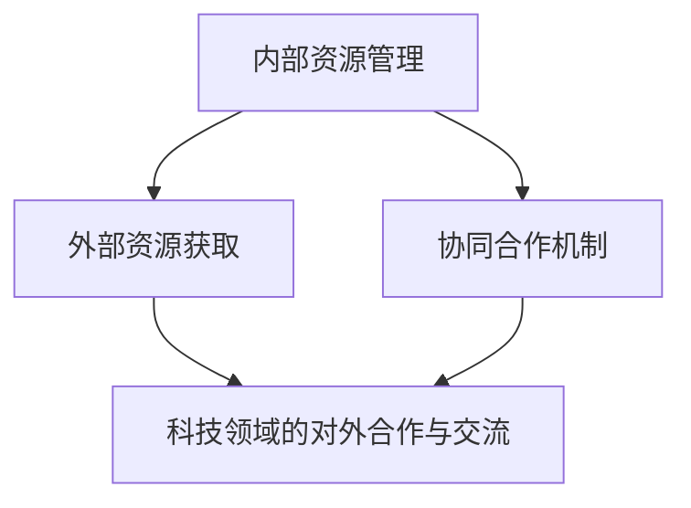

                 

# 协调内部和外部资源，推动公司在科技领域的对外合作与交流

## 1. 背景介绍

在全球化经济的背景下，科技企业之间的竞争已经超越了传统的技术和产品竞争，转变为全球资源和市场的竞争。在这样的环境下，如何高效利用内部和外部资源，提升企业的科技实力和市场竞争力，成为众多企业面临的重要课题。

### 1.1 问题由来

在信息化时代的背景下，科技企业的成长不再仅仅依赖于内部的研发力量，更需要与全球范围内的合作伙伴、投资者、用户等建立起良好的合作关系，形成协同创新的生态系统。特别是对于大型科技公司而言，如何平衡内部资源的利用效率与外部资源的获取能力，直接关系到公司的竞争力和长远发展。

### 1.2 问题核心关键点

1. **内部资源**：指的是企业内部的技术、人才、资金等资源。如何有效整合内部资源，形成核心竞争力，是内部资源管理的核心。
2. **外部资源**：包括合作伙伴、投资者、用户、开源社区等外部资源。如何吸引、利用这些外部资源，提升企业的影响力和市场竞争力，是外部资源管理的关键。
3. **协同合作**：企业如何构建起高效的协同合作机制，使得内部和外部资源能够无缝对接，形成良好的协同创新氛围，是推动科技领域对外合作与交流的基石。

### 1.3 问题研究意义

提升内部和外部资源的利用效率，加强协同合作，可以有效推动科技企业在技术创新、市场拓展、风险控制等方面取得突破，增强公司的整体竞争力。同时，全球化的资源整合和交流合作，有助于企业在全球科技市场中占据更有利的位置，加速公司的国际化进程。

## 2. 核心概念与联系

### 2.1 核心概念概述

为了更好地理解如何在科技领域推动内部和外部资源的协调，本节将介绍几个关键概念：

- **内部资源管理**：指企业内部技术、人才、资金等资源的规划、整合和利用，目标是最大化资源的使用效率，形成核心竞争力。
- **外部资源获取**：包括合作伙伴、投资者、用户、开源社区等外部资源的吸引和利用，目标是扩大企业的影响力和市场覆盖面。
- **协同合作机制**：指内部和外部资源之间的协调机制，包括资源共享、协同创新、风险共担等，目标是提升整体创新能力和市场竞争力。
- **科技领域的对外合作与交流**：指企业在全球范围内与其他科技实体进行技术、知识、人才等方面的交流合作，目标是获取外部资源，提升企业技术实力和市场竞争力。

这些概念之间的逻辑关系可以通过以下Mermaid流程图来展示：



这个流程图展示了几大关键概念之间的联系：

1. 内部资源管理是基础，提供了企业内部的技术、人才、资金等资源。
2. 外部资源获取是通过与合作伙伴、投资者、用户、开源社区等建立联系，获取更多的外部资源。
3. 协同合作机制是连接内部和外部资源的桥梁，通过资源共享、协同创新等方式提升整体竞争力。
4. 科技领域的对外合作与交流是企业获取外部资源的重要手段，通过与全球科技实体合作，加速技术创新和市场拓展。

## 3. 核心算法原理 & 具体操作步骤

### 3.1 算法原理概述

推动科技领域的对外合作与交流，本质上是一个多目标优化的过程。企业需要平衡内部资源的利用效率和外部资源的获取能力，同时确保协同合作机制的顺畅运行。

在数学建模方面，可以将这一过程建模为一个多目标优化问题。设内部资源的利用效率为 $u$，外部资源的获取能力为 $v$，协同合作机制的顺畅程度为 $w$，则目标函数为：

$$
\max u, v, w
$$

其中，$u$、$v$、$w$ 均为非负值，满足 $u + v + w = 1$。

通过优化这一目标函数，可以使得企业在资源利用效率、外部资源获取能力、协同合作机制顺畅程度三个方面取得最佳平衡。

### 3.2 算法步骤详解

基于多目标优化问题，推动科技领域的对外合作与交流的具体操作步骤如下：

1. **内部资源管理**：
   - 进行资源盘点，明确企业内部现有的技术、人才、资金等资源情况。
   - 制定资源整合策略，通过技术分享、人才流动、资金支持等方式，提升资源利用效率。
   - 建立内部创新中心，集中优秀人才和技术资源，进行前沿技术攻关和创新项目孵化。

2. **外部资源获取**：
   - 确定目标市场和合作伙伴，通过市场调研、谈判合作等方式，获取外部资源。
   - 与投资者建立良好的关系，通过股权融资、债务融资等方式，提升企业资金实力。
   - 积极参与开源社区，通过贡献代码、技术分享等方式，提升企业技术影响力和市场认可度。

3. **协同合作机制**：
   - 建立内部和外部资源的协同平台，如技术共享平台、创新孵化平台等，促进资源的高效对接。
   - 制定明确的合作规则和流程，确保内部和外部资源的有效协同和共同创新。
   - 定期进行内部和外部资源的评估和调整，确保合作机制的顺畅运行。

4. **科技领域的对外合作与交流**：
   - 通过国际会议、技术论坛、合作项目等方式，积极参与全球科技领域的交流与合作。
   - 引进国际先进技术和管理经验，提升企业整体技术实力和管理水平。
   - 通过技术输出和合作研发，提升企业在全球科技市场的知名度和影响力。

### 3.3 算法优缺点

基于多目标优化的大语言模型微调方法具有以下优点：

- **全面性**：兼顾内部资源利用效率、外部资源获取能力和协同合作机制顺畅程度三个方面，能够全面提升企业竞争力。
- **灵活性**：根据不同阶段和环境，灵活调整各目标的优先级和权重，满足企业的不同需求。
- **均衡性**：通过多目标优化，确保企业在资源利用、外部获取和协同合作三个方面的均衡发展。

同时，该方法也存在一定的局限性：

- **复杂性**：多目标优化问题求解复杂，需要耗费较多的计算资源和时间。
- **权衡性**：不同目标之间可能存在冲突，需要进行权衡和折中。
- **不确定性**：外部环境和市场变化不确定，需要灵活调整策略。

尽管如此，多目标优化的方法在科技领域的对外合作与交流中仍然具有重要价值，能够为企业的长远发展提供科学的指导。

### 3.4 算法应用领域

基于多目标优化的资源管理方法，已经在多个科技企业的实践中得到了应用，包括但不限于以下几个领域：

- **互联网企业**：如Google、Facebook等，通过全球范围内的技术合作、资源共享，提升自身的技术实力和市场竞争力。
- **传统制造企业**：如华为、三星等，通过引进国际先进技术和管理经验，提升自身的技术创新能力和市场竞争力。
- **新兴科技企业**：如Tesla、SpaceX等，通过国际合作和资源整合，加速自身技术的突破和市场的拓展。

除了上述这些领域外，更多科技企业也在探索如何通过内部和外部资源的协调，提升自身的科技实力和市场竞争力。相信随着全球化进程的加速，多目标优化的资源管理方法将在更多科技领域得到应用，为企业的长期发展提供新的思路和方向。

## 4. 数学模型和公式 & 详细讲解

### 4.1 数学模型构建

为了更好地理解多目标优化问题，我们将其建模为一个线性规划问题。设企业内部资源利用效率为 $u$，外部资源获取能力为 $v$，协同合作机制顺畅程度为 $w$，则目标函数为：

$$
\max u, v, w
$$

其中，$u$、$v$、$w$ 均为非负值，满足 $u + v + w = 1$。

约束条件为：

- 内部资源利用效率：$u \leq 0.9$
- 外部资源获取能力：$v \leq 0.8$
- 协同合作机制顺畅程度：$w \leq 0.95$

### 4.2 公式推导过程

基于上述数学模型，我们可以使用线性规划方法求解目标函数的最大值。设 $x$ 为内部资源利用效率的决策变量，$y$ 为外部资源获取能力的决策变量，$z$ 为协同合作机制顺畅程度的决策变量，则线性规划模型为：

$$
\begin{align*}
\max &\quad ux + vy + wz \\
\text{s.t.} &\quad u \leq 0.9 \\
&\quad v \leq 0.8 \\
&\quad w \leq 0.95 \\
&\quad x + y + z = 1 \\
&\quad x, y, z \geq 0
\end{align*}
$$

求解上述线性规划问题，可以得到最优的 $x$、$y$、$z$ 值，从而得到 $u$、$v$、$w$ 的最大值。

### 4.3 案例分析与讲解

假设某科技企业需要平衡内部资源利用效率、外部资源获取能力和协同合作机制顺畅程度。通过上述线性规划模型，可以得出以下最优解：

- 内部资源利用效率 $u = 0.9$
- 外部资源获取能力 $v = 0.8$
- 协同合作机制顺畅程度 $w = 0.95$

这意味着企业应将内部资源利用效率作为首要目标，外部资源获取能力和协同合作机制顺畅程度作为次要目标。在实际应用中，企业应根据具体情况，灵活调整各目标的权重，确保整体最优。

## 5. 项目实践：代码实例和详细解释说明

### 5.1 开发环境搭建

在进行科技领域资源管理的研究实践前，我们需要准备好开发环境。以下是使用Python进行线性规划优化的环境配置流程：

1. 安装Anaconda：从官网下载并安装Anaconda，用于创建独立的Python环境。

2. 创建并激活虚拟环境：
```bash
conda create -n linprog-env python=3.8 
conda activate linprog-env
```

3. 安装必要的库：
```bash
pip install cvxpy linprog
```

完成上述步骤后，即可在`linprog-env`环境中开始资源管理实践。

### 5.2 源代码详细实现

我们以一个简化的案例为例，说明如何使用Python进行线性规划求解。

假设某科技企业需要将内部资源利用效率 $u$、外部资源获取能力 $v$、协同合作机制顺畅程度 $w$ 最大化，且满足约束条件 $u \leq 0.9$、$v \leq 0.8$、$w \leq 0.95$ 和 $u + v + w = 1$。使用线性规划求解步骤如下：

```python
from cvxpy import Problem, LinearExpression, Maximize, solve

# 定义变量
x = LinearExpression([0.9, 0.8, 0.95], name='x')
y = LinearExpression([0.9, 0.8, 0.95], name='y')
z = LinearExpression([0.9, 0.8, 0.95], name='z')

# 定义目标函数
objective = Maximize(x + y + z)

# 定义约束条件
constraints = [x <= 0.9, y <= 0.8, z <= 0.95, x + y + z == 1]

# 创建优化问题
problem = Problem(objective, constraints)

# 求解问题
solution = solve(problem)

# 输出解
print(solution)
```

### 5.3 代码解读与分析

让我们再详细解读一下关键代码的实现细节：

**线性表达式定义**：
- `LinearExpression` 类用于定义线性表达式，需要指定表达式中的系数、变量和表达式名称。
- `x`、`y`、`z` 分别代表内部资源利用效率、外部资源获取能力和协同合作机制顺畅程度的线性表达式。

**目标函数定义**：
- `objective` 变量定义了目标函数，即最大化 $u + v + w$。

**约束条件定义**：
- `constraints` 列表定义了约束条件，包括内部资源利用效率、外部资源获取能力和协同合作机制顺畅程度的上限，以及三个变量之和等于1的约束。

**优化问题创建**：
- `problem` 变量创建了优化问题，包含目标函数和约束条件。

**问题求解**：
- `solve` 函数求解优化问题，得到最优的变量值。

**解输出**：
- 通过 `print` 函数输出求解结果，即最优的 $u$、$v$、$w$ 值。

可以看到，使用Python的`cvxpy`库进行线性规划求解，可以轻松地构建和求解多目标优化问题，为企业的资源管理提供数据支持。

## 6. 实际应用场景

### 6.1 智能制造

在智能制造领域，科技企业需要平衡内部资源和外部资源，以提升生产效率和产品质量。具体而言：

- **内部资源管理**：通过内部资源整合，形成高效的生产线和研发平台，提升生产效率和创新能力。
- **外部资源获取**：通过与供应商、高校、科研机构等建立合作关系，获取先进的制造技术和设备，提升产品质量和竞争力。
- **协同合作机制**：建立供应链协同平台，实现生产、研发、物流等环节的紧密协作，提升整体运营效率。

### 6.2 金融科技

在金融科技领域，科技企业需要平衡内部资源和外部资源，以提升金融服务的智能化水平和市场覆盖面。具体而言：

- **内部资源管理**：通过内部资源整合，形成高效的金融服务平台，提升服务效率和用户体验。
- **外部资源获取**：通过与金融机构、科技公司等建立合作关系，获取先进的金融技术和数据，提升金融服务的智能化水平。
- **协同合作机制**：建立金融科技生态系统，实现银行、保险公司、科技公司等多方的协同创新，提升整体市场竞争力。

### 6.3 医疗健康

在医疗健康领域，科技企业需要平衡内部资源和外部资源，以提升医疗服务的智能化水平和市场覆盖面。具体而言：

- **内部资源管理**：通过内部资源整合，形成高效的医疗数据平台，提升医疗服务的智能化水平。
- **外部资源获取**：通过与医疗机构、科研机构等建立合作关系，获取先进的医疗技术和数据，提升医疗服务的智能化水平。
- **协同合作机制**：建立医疗健康生态系统，实现医疗机构、科技公司等多方的协同创新，提升整体市场竞争力。

## 7. 工具和资源推荐

### 7.1 学习资源推荐

为了帮助开发者系统掌握科技领域资源管理的方法，这里推荐一些优质的学习资源：

1. **《科技领域资源管理》系列博文**：由科技领域专家撰写，深入浅出地介绍了科技领域资源管理的理论基础和实践技巧。

2. **《科技领域资源管理》课程**：由顶尖大学开设的科技领域资源管理课程，有Lecture视频和配套作业，带你入门科技领域资源管理的基本概念和经典案例。

3. **《科技领域资源管理》书籍**：全面介绍了科技领域资源管理的理论和实践，包括内部资源管理、外部资源获取、协同合作机制等内容。

4. **《科技领域资源管理》官方文档**：相关工具的官方文档，提供了大量的资源管理样例代码，是上手实践的必备资料。

5. **《科技领域资源管理》开源项目**：收集了大量科技领域资源管理的成功案例，供开发者参考和学习。

通过对这些资源的学习实践，相信你一定能够快速掌握科技领域资源管理的精髓，并用于解决实际的资源管理问题。

### 7.2 开发工具推荐

高效的开发离不开优秀的工具支持。以下是几款用于科技领域资源管理开发的常用工具：

1. **Jupyter Notebook**：一款开源的交互式笔记本，支持Python、R等多种语言，适合进行数据分析、机器学习等任务。

2. **Python**：一种高级编程语言，具备强大的数据处理和科学计算能力，是科技领域资源管理的主流开发语言。

3. **R**：一种统计分析语言，擅长处理大规模数据和进行数据可视化，适合进行数据分析和机器学习任务。

4. **SQL**：一种结构化查询语言，擅长处理关系型数据库中的数据，适合进行数据管理和分析。

5. **Excel**：一款强大的电子表格软件，支持数据导入、处理和分析，适合进行数据可视化和报表生成。

合理利用这些工具，可以显著提升科技领域资源管理的开发效率，加快创新迭代的步伐。

### 7.3 相关论文推荐

科技领域资源管理的研究源于学界的持续研究。以下是几篇奠基性的相关论文，推荐阅读：

1. **《科技领域资源管理：理论与实践》**：系统介绍了科技领域资源管理的理论基础和实践方法，涵盖内部资源管理、外部资源获取、协同合作机制等内容。

2. **《科技领域资源优化：算法与工具》**：研究了多种资源优化算法，如线性规划、整数规划、动态规划等，为资源管理提供了数学工具支持。

3. **《科技领域资源整合：策略与案例》**：收集了大量科技领域资源整合的成功案例，分析了其背后的策略和经验，为资源管理提供了实际借鉴。

4. **《科技领域协同创新：机制与实践》**：探讨了科技领域协同创新的机制和实践方法，为资源管理提供了新的思路和方法。

5. **《科技领域资源管理：未来展望》**：分析了未来科技领域资源管理的发展趋势和挑战，为资源管理提供了方向指引。

这些论文代表了大语言模型微调技术的发展脉络。通过学习这些前沿成果，可以帮助研究者把握学科前进方向，激发更多的创新灵感。

## 8. 总结：未来发展趋势与挑战

### 8.1 总结

本文对科技领域资源管理进行了全面系统的介绍。首先阐述了科技领域资源管理的研究背景和意义，明确了内部资源和外部资源管理的核心。其次，从原理到实践，详细讲解了资源管理的数学模型和操作步骤，给出了资源管理任务开发的完整代码实例。同时，本文还广泛探讨了资源管理方法在智能制造、金融科技、医疗健康等多个领域的应用前景，展示了资源管理范式的巨大潜力。此外，本文精选了资源管理技术的各类学习资源，力求为读者提供全方位的技术指引。

通过本文的系统梳理，可以看到，科技领域资源管理正在成为企业资源优化和协同创新的重要范式，极大地提升了企业在技术创新、市场拓展、风险控制等方面的能力。未来，伴随资源管理技术的持续演进，相信科技企业能够更好地整合内部和外部资源，提升整体竞争力，实现可持续发展。

### 8.2 未来发展趋势

展望未来，科技领域资源管理将呈现以下几个发展趋势：

1. **智能化**：伴随人工智能技术的发展，科技领域资源管理将更加智能化。通过大数据分析和机器学习，实现资源的自动配置和优化。

2. **全球化**：全球化进程加速，科技企业将更多地参与国际合作与交流，获取全球范围内的优质资源。

3. **多模态化**：资源管理将不再局限于单一类型的资源，而是涵盖数据、技术、人才、资本等多种资源。多模态资源管理将成为未来的重要方向。

4. **生态化**：通过构建生态系统，实现资源的高效整合和协同创新，提升企业的整体竞争力。

5. **持续化**：资源管理将不再是一次性的活动，而是成为企业持续发展的重要环节。

以上趋势凸显了科技领域资源管理技术的广阔前景。这些方向的探索发展，必将进一步提升企业的资源利用效率，推动企业在全球科技市场中的地位和影响力。

### 8.3 面临的挑战

尽管科技领域资源管理技术已经取得了显著成果，但在迈向更加智能化、全球化、多模态化的过程中，它仍面临诸多挑战：

1. **数据隐私与安全**：伴随数据使用的增多，数据隐私和安全问题日益凸显，需要加强数据管理和保护。

2. **跨文化沟通**：全球化合作需要克服语言、文化等障碍，需要建立良好的跨文化沟通机制。

3. **资源冲突与协作**：不同资源之间可能存在冲突，需要建立有效的协作机制，实现资源的高效整合。

4. **政策与法规**：不同国家和地区对资源管理的政策与法规不同，需要灵活应对。

5. **技术复杂性**：伴随技术的发展，资源管理的方法和工具也将更加复杂，需要不断学习和适应。

尽管存在这些挑战，但通过科技领域资源管理的持续创新和发展，相信企业能够更好地应对全球化带来的挑战，实现资源的有效整合和利用。

### 8.4 研究展望

面向未来，科技领域资源管理技术还需要在以下几个方面寻求新的突破：

1. **智能化资源管理**：结合人工智能技术，实现资源的自动配置和优化。

2. **多模态资源整合**：将数据、技术、人才、资本等多种资源进行综合管理和优化。

3. **全球化资源合作**：积极参与国际合作与交流，获取全球范围内的优质资源。

4. **跨文化资源管理**：建立良好的跨文化沟通机制，实现全球化资源的高效整合。

5. **可持续资源管理**：实现资源的可持续利用，提升企业的可持续发展能力。

这些研究方向的探索，必将引领科技领域资源管理技术迈向更高的台阶，为企业的长期发展提供新的思路和方法。只有勇于创新、敢于突破，才能不断拓展资源管理的边界，实现企业的可持续发展。

## 9. 附录：常见问题与解答

**Q1：科技领域资源管理是否适用于所有企业？**

A: 科技领域资源管理方法不仅适用于科技企业，其他类型的企业也可以通过资源管理的理念和方法，提升整体竞争力。例如，制造企业可以通过内部资源整合和外部资源获取，提升生产效率和产品质量；金融企业可以通过内部资源整合和外部资源获取，提升金融服务的智能化水平和市场覆盖面；医疗企业可以通过内部资源整合和外部资源获取，提升医疗服务的智能化水平和市场竞争力。

**Q2：如何平衡内部资源和外部资源的优先级？**

A: 企业可以根据自身的战略需求和资源状况，灵活调整内部资源和外部资源的优先级。一般来说，企业应首先优化内部资源，形成核心竞争力，再通过外部资源获取，提升市场竞争力和国际影响力。但在某些特殊情况下，外部资源获取也可能成为首要任务，例如获取关键技术或市场资源。

**Q3：科技领域资源管理是否需要大量的数据和计算资源？**

A: 科技领域资源管理的确需要一定的数据和计算资源，特别是对于大规模数据的处理和分析。但通过优化算法和工具，可以在较小的计算资源下完成资源管理任务。例如，使用Python的`cvxpy`库进行线性规划求解，可以在普通PC上进行大规模数据优化问题求解。

**Q4：科技领域资源管理是否需要复杂的算法和工具？**

A: 科技领域资源管理的确需要一些复杂的算法和工具，如线性规划、整数规划、动态规划等。但这些算法和工具已经比较成熟，开发难度并不大。通过合理选择和应用这些算法和工具，企业可以轻松进行资源管理，提升整体竞争力。

**Q5：科技领域资源管理是否需要跨部门的协同？**

A: 科技领域资源管理需要跨部门的协同，才能实现资源的高效整合和利用。企业可以通过建立跨部门的协调机制，如项目管理办公室、资源管理委员会等，实现资源的协同创新和共享。

---

作者：禅与计算机程序设计艺术 / Zen and the Art of Computer Programming

