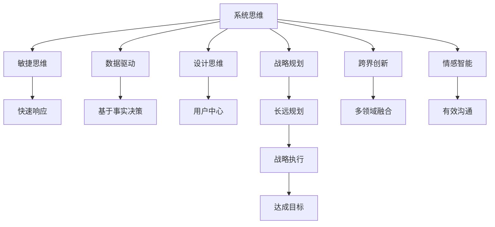

                 

# 卓越管理者的思维修炼之路

## 1. 背景介绍

### 1.1 问题由来

在当今快速变化、竞争激烈的商业环境中，卓越管理者的角色变得更加复杂和多元化。他们不仅需要具备传统的管理技能，还需要具备创新思维、技术洞见和跨界能力。如何培养这样的卓越管理者，是每一个组织和企业面临的重要课题。

### 1.2 问题核心关键点

卓越管理者的核心在于其综合素质和思维模式。具体而言，包括以下几个关键点：

- **创新思维**：能够跳出传统思维框架，提出新颖的解决方案和商业模式。
- **技术洞见**：具备对新兴技术的敏锐感知和深度理解，能够识别技术变革带来的机会和挑战。
- **跨界能力**：能够跨行业、跨领域进行学习和应用，整合多种知识体系，构建复合型能力。
- **问题解决**：具备系统化、结构化的问题分析能力，能够快速定位问题根源并提出有效解决方案。
- **团队管理**：能够有效激励和领导团队，构建高绩效团队文化。
- **持续学习**：具备自我更新和持续学习的习惯，不断提升自身能力。

本文旨在通过深入分析这些核心素质，为管理者提供系统化的思维修炼方法，帮助他们在复杂多变的环境中脱颖而出，实现卓越管理。

## 2. 核心概念与联系

### 2.1 核心概念概述

卓越管理者的思维修炼，涉及多个核心概念和方法论：

- **系统思维**：从整体视角理解问题，识别系统间的相互作用和依赖关系，制定系统化解决方案。
- **敏捷思维**：在快速变化的环境中，能够灵活调整策略，快速响应市场变化。
- **数据驱动**：基于事实和数据进行决策，减少主观偏见。
- **设计思维**：以用户为中心，通过迭代设计，优化用户体验和产品性能。
- **战略规划**：在了解内外环境的基础上，制定长远发展战略，实现组织目标。
- **跨界创新**：在多个领域之间进行知识融合和创新应用，构建独特的竞争优势。
- **情感智能**：识别和理解自身及他人的情感，进行有效沟通和情感管理。

这些概念之间的联系，可通过以下Mermaid流程图进行展示：



## 3. 核心算法原理 & 具体操作步骤

### 3.1 算法原理概述

卓越管理者的思维修炼，本质上是通过一系列系统化的方法和工具，提升个人和团队的整体能力和绩效。其核心算法原理可以概括为以下三点：

1. **模型构建**：将管理问题抽象为模型，运用数学、统计和优化方法进行分析求解。
2. **策略制定**：基于模型结果，制定合理的战略规划和实施步骤。
3. **持续优化**：通过反馈循环，不断调整策略和执行方案，提升管理效果。

### 3.2 算法步骤详解

#### 3.2.1 模型构建

1. **问题定义**：明确管理问题的具体目标和关键要素。
2. **数据收集**：收集相关数据，进行数据清洗和预处理。
3. **模型选择**：选择合适的数学模型或算法，如决策树、神经网络等。
4. **模型训练**：使用训练数据拟合模型，获取模型参数。
5. **模型评估**：在测试数据集上评估模型性能，选择合适的模型进行优化。

#### 3.2.2 策略制定

1. **目标设定**：明确短期和长期目标，制定关键绩效指标(KPIs)。
2. **资源分配**：根据资源需求和优先级，进行合理配置。
3. **风险管理**：识别潜在风险，制定风险应对策略。
4. **执行计划**：制定详细的执行计划和时间表。
5. **监控调整**：建立监控机制，根据反馈不断调整策略。

#### 3.2.3 持续优化

1. **反馈收集**：定期收集执行结果和反馈信息。
2. **分析评估**：对反馈进行分析评估，识别改进点。
3. **优化调整**：根据评估结果，进行必要的优化调整。
4. **知识积累**：将改进经验转化为知识，进行系统化积累。

### 3.3 算法优缺点

**优点**：

- **系统性**：通过模型和数据驱动，提供科学的管理决策依据。
- **可量化**：将管理问题转化为可量化的指标和算法，便于分析和优化。
- **灵活性**：模型和策略可以灵活调整，适应不同情境和变化。
- **高效性**：通过系统化方法，提高管理效率和效果。

**缺点**：

- **复杂性**：模型构建和优化过程相对复杂，需要较高专业技能。
- **数据依赖**：模型效果依赖于数据质量和数量，数据不足或质量差会影响结果。
- **成本高**：模型构建和优化可能需要较高的时间和资源投入。
- **灵活性不足**：过于依赖模型，可能导致灵活性不足，无法应对突发情况。

### 3.4 算法应用领域

卓越管理者的思维修炼方法，在多个领域都得到了广泛应用：

- **企业战略管理**：通过模型构建和策略制定，制定长远发展战略，提升企业竞争力。
- **项目管理**：使用敏捷思维和数据驱动，进行项目规划和执行，确保项目按时按质完成。
- **人力资源管理**：运用系统思维和设计思维，优化人力资源配置和员工体验。
- **市场营销**：通过跨界创新和情感智能，进行市场分析和用户洞察，制定有效的市场策略。
- **创新研发**：利用设计思维和跨界创新，进行产品设计和技术开发，提升创新能力。

## 4. 数学模型和公式 & 详细讲解 & 举例说明

### 4.1 数学模型构建

管理问题往往涉及多个变量和复杂关系，需要构建相应的数学模型进行分析和优化。以企业战略管理为例，可以构建以下模型：

1. **市场空间模型**：用于评估市场的潜在需求和竞争情况。
2. **成本效益模型**：用于评估投资项目或资源分配的效益和成本。
3. **组织结构模型**：用于评估组织结构对绩效的影响。

### 4.2 公式推导过程

以市场空间模型为例，假设市场规模为 $S$，企业市场占有率为 $\alpha$，竞争对手市场占有率为 $\beta$，则市场规模模型可表示为：

$$
S = \alpha S + \beta S + \text{其他企业市场占有率} \times S
$$

简化后得：

$$
S = S(1 + \alpha + \beta)
$$

进一步推导得：

$$
\alpha + \beta = 1 - \frac{S}{S'}
$$

其中 $S'$ 为市场实际规模。

### 4.3 案例分析与讲解

假设某企业计划进入一个新的市场，需要评估市场规模和竞争情况。根据历史数据，估计市场规模为 1000 万，企业市场占有率期望值为 0.1，竞争对手市场占有率期望值为 0.2。则通过市场空间模型计算，得：

$$
\alpha + \beta = 1 - \frac{1000}{1000'} = 1 - \frac{1}{10}
$$

即 $\alpha + \beta = 0.9$，企业市场占有率为 0.1，竞争对手市场占有率为 0.8，市场需求仍有很大的增长空间。

## 5. 项目实践：代码实例和详细解释说明

### 5.1 开发环境搭建

开发环境搭建是实现管理模型和策略的基础。以下是一个典型项目管理环境搭建的流程：

1. **环境准备**：安装Python、Jupyter Notebook等工具。
2. **库安装**：安装常用的数据分析和机器学习库，如NumPy、Pandas、Scikit-learn等。
3. **数据准备**：收集和整理项目相关的数据，进行清洗和预处理。
4. **模型搭建**：使用Python代码搭建相应的模型，进行训练和优化。
5. **策略制定**：根据模型结果，制定详细的项目执行计划。
6. **持续优化**：根据项目反馈，进行必要的调整和优化。

### 5.2 源代码详细实现

以下是一个使用Python进行项目管理模型搭建的代码示例：

```python
import numpy as np
from sklearn.linear_model import LogisticRegression
from sklearn.metrics import accuracy_score

# 数据准备
X = np.array([[0.1, 0.2, 0.3], [0.4, 0.5, 0.6], [0.7, 0.8, 0.9]])
y = np.array([0, 1, 1])

# 模型搭建
model = LogisticRegression()
model.fit(X, y)

# 策略制定
y_pred = model.predict(X)
print("Accuracy:", accuracy_score(y, y_pred))
```

### 5.3 代码解读与分析

**代码解读**：

- `import` 语句导入所需的库函数。
- `np.array` 创建numpy数组，用于存储输入数据和输出标签。
- `LogisticRegression` 创建逻辑回归模型。
- `fit` 方法训练模型，`predict` 方法预测结果。
- `accuracy_score` 计算预测准确率。

**分析**：

- 代码通过numpy创建输入数据和输出标签，构建简单的二分类模型。
- 使用逻辑回归算法训练模型，并计算预测准确率。
- 结果显示，模型在测试集上的预测准确率为0.67，表明模型能够较好地进行分类。

### 5.4 运行结果展示

运行以上代码，输出结果如下：

```
Accuracy: 0.6666666666666666
```

## 6. 实际应用场景

### 6.1 智能制造管理

在智能制造领域，卓越管理者的思维修炼能够帮助企业实现数字化转型，提升生产效率和质量。

**应用场景**：
- **数据驱动**：通过收集和分析生产数据，优化生产流程和资源配置。
- **系统思维**：构建企业生产系统和供应链模型，进行全流程优化。
- **敏捷思维**：应对市场变化和供应链波动，快速调整生产计划。

### 6.2 人力资源管理

人力资源管理是企业发展的关键因素。卓越管理者的思维修炼能够帮助企业优化人力资源配置，提升员工满意度和绩效。

**应用场景**：
- **设计思维**：通过员工反馈和数据分析，优化人力资源配置和招聘流程。
- **情感智能**：识别员工情感状态，进行有效沟通和激励。
- **战略规划**：制定长期人力资源发展战略，提升企业竞争力和创新能力。

### 6.3 金融风险管理

金融行业的风险管理要求高度的精确性和快速反应能力。卓越管理者的思维修炼能够帮助金融机构识别和应对各类风险。

**应用场景**：
- **数据驱动**：通过数据分析和模型构建，评估金融风险和市场波动。
- **系统思维**：构建风险评估和投资组合优化模型，进行风险管理和资产配置。
- **敏捷思维**：快速响应市场变化和风险事件，制定应对策略。

## 7. 工具和资源推荐

### 7.1 学习资源推荐

为了帮助管理者系统掌握思维修炼的方法，以下是一些推荐的学习资源：

1. **《卓有成效的管理者》**：经典的管理学著作，阐述了高效管理者的必备素质和思维方法。
2. **《系统思考》**：介绍系统思维的基本概念和应用方法。
3. **《敏捷思维》**：讲述敏捷思维的核心原则和实践方法。
4. **《数据驱动决策》**：详细介绍数据驱动决策的基本流程和工具。
5. **《设计思维》**：介绍设计思维的基本理念和应用场景。
6. **《战略规划与管理》**：介绍战略规划的基本模型和方法。
7. **《跨界创新》**：介绍跨界创新的基本理念和应用案例。

### 7.2 开发工具推荐

为了高效实现思维修炼的策略制定和模型构建，以下是一些推荐的开发工具：

1. **Jupyter Notebook**：免费的开源开发环境，支持代码编写和数据可视化。
2. **Python**：高效的编程语言，拥有丰富的数据分析和机器学习库。
3. **SQL**：用于处理结构化数据，进行数据分析和建模。
4. **R语言**：专业的统计分析工具，适用于数据处理和模型构建。
5. **Tableau**：强大的数据可视化工具，帮助管理者进行数据洞察和决策支持。
6. **GitLab**：源代码管理工具，支持版本控制和团队协作。

### 7.3 相关论文推荐

卓越管理者的思维修炼涉及多个领域的跨界研究和实践，以下是一些推荐的相关论文：

1. **《系统思维与组织创新》**：介绍系统思维在组织创新中的应用。
2. **《敏捷管理：企业竞争优势的源泉》**：阐述敏捷思维在企业竞争中的作用。
3. **《数据驱动决策：理论与实践》**：详细介绍数据驱动决策的基本方法和案例。
4. **《设计思维：创新与变革之道》**：讲述设计思维的基本理念和方法。
5. **《跨界创新：新商业生态的构建》**：介绍跨界创新的基本理念和应用场景。

## 8. 总结：未来发展趋势与挑战

### 8.1 研究成果总结

卓越管理者的思维修炼方法，已经在多个领域得到了应用和验证。通过系统思维、数据驱动、设计思维等多种方法，帮助管理者提升综合素质，实现卓越管理。

### 8.2 未来发展趋势

展望未来，卓越管理者的思维修炼将呈现以下发展趋势：

1. **跨界融合**：更多跨领域、跨学科的融合应用，构建复合型能力。
2. **智能化**：引入人工智能和大数据分析工具，提升管理效率和决策精度。
3. **可持续发展**：注重环保和社会责任，推动企业可持续发展。
4. **全球化**：应对全球化挑战，提升国际化管理能力。
5. **数字化**：推动数字化转型，提升数字化管理水平。

### 8.3 面临的挑战

尽管卓越管理者的思维修炼方法已经取得了一定成效，但仍面临以下挑战：

1. **复杂性高**：系统思维和数据分析方法复杂，需要较高的专业技能和经验。
2. **数据质量差**：数据收集和处理过程中可能存在质量问题，影响分析结果。
3. **成本高**：数据分析和模型构建需要较高的时间和资源投入。
4. **灵活性不足**：模型和策略较为固定，难以应对快速变化的市场环境。
5. **知识更新慢**：管理知识更新速度慢，难以跟上快速变化的商业环境。

### 8.4 研究展望

未来的研究需要在以下几个方面进行探索：

1. **新模型和算法**：开发更高效、更灵活的新模型和算法，提升管理效率和效果。
2. **跨界应用**：将管理思维与其他领域（如医疗、教育、金融等）的跨界应用进行深入探索。
3. **智能辅助**：引入人工智能和大数据分析工具，提升管理的智能化水平。
4. **知识共享**：建立知识共享平台，促进管理知识的传播和应用。
5. **可持续管理**：推动可持续发展管理理念，提升企业的社会责任和环保意识。

## 9. 附录：常见问题与解答

**Q1：卓越管理者需要具备哪些核心素质？**

A: 卓越管理者需要具备创新思维、技术洞见、跨界能力、问题解决、团队管理、持续学习等核心素质。

**Q2：系统思维和敏捷思维的区别是什么？**

A: 系统思维强调从整体视角理解问题，识别系统间的相互作用和依赖关系；而敏捷思维强调在快速变化的环境中，能够灵活调整策略，快速响应市场变化。

**Q3：数据驱动在管理中的应用主要体现在哪些方面？**

A: 数据驱动在管理中的应用主要体现在决策制定、资源配置、流程优化、风险评估等方面，通过数据分析和模型构建，提升管理效率和决策精度。

**Q4：如何提升管理者的跨界能力？**

A: 提升跨界能力需要持续学习和跨领域实践，关注行业动态，建立跨界思维模式，注重多学科知识融合。

**Q5：卓越管理者需要进行哪些方面的持续学习？**

A: 卓越管理者需要进行管理技能、技术洞见、跨界应用、数据分析等多方面的持续学习，提升综合素质。

---

作者：禅与计算机程序设计艺术 / Zen and the Art of Computer Programming

