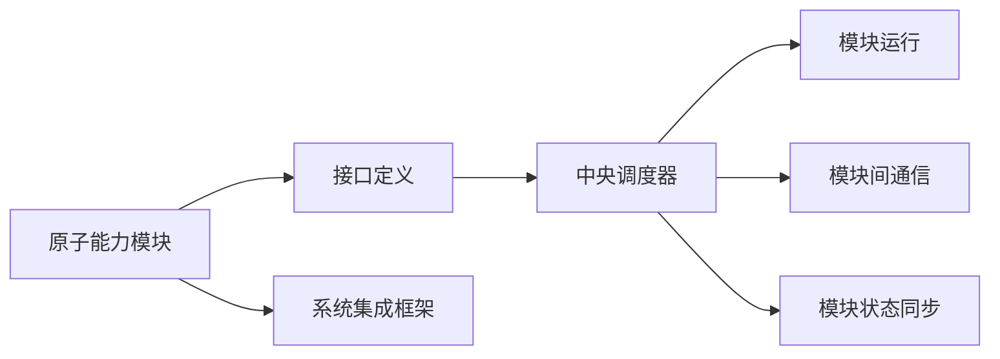

                 

## 1. 背景介绍

在快速迭代的软件开发过程中，如何高效构建高质量的应用系统成为了技术栈中的核心议题。传统的单一层级开发模式，从业务需求到系统实现，再到部署运行，存在诸多冗余和复杂性。近年来，微服务架构和组件化设计理念的兴起，为工程团队带来了新的解决方案。然而，这些方法仍然存在开发周期长、协作难度大等问题。

本文将从原子能力层的角度出发，重塑软件系统的工作流，提出了一种新的软件开发范式：原子能力层。该方法通过将软件系统划分为可独立构建、测试和部署的原子能力模块，使得开发团队能够更高效地构建和维护复杂应用。

## 2. 核心概念与联系

### 2.1 核心概念概述

原子能力层（Atomic Capability Layer, ACL）是一种新型的软件开发范式，其核心思想是将软件系统构建为一系列独立、完备、可复用的能力模块。这些模块以原子能力的形式存在，即在逻辑上和功能上都是自包含的，可以通过接口调用进行组装。

与传统的分层架构不同，原子能力层强调模块之间的解耦和独立性，能够适应更多变的业务场景。其核心组件包括：

1. **原子能力模块**：即最小化且功能完备的软件模块，拥有独立的数据库和运行环境。
2. **接口定义与协议**：定义各模块之间的通信协议和数据格式，确保模块间可靠交互。
3. **中央调度器**：负责调度各原子能力模块的运行，并管理模块间的通信和状态同步。
4. **系统集成框架**：提供统一的配置、编排和管理接口，使得不同模块可以灵活组合，构建复杂系统。

### 2.2 核心概念原理和架构的 Mermaid 流程图



该图表展示了原子能力层的核心组件及其相互关系：

- **原子能力模块**通过接口定义与中央调度器通信，并在系统集成框架的支持下与其他模块协同工作。
- **中央调度器**负责监控和管理模块的运行状态，确保整个系统的稳定性和可靠性。
- **系统集成框架**提供统一的接口规范，方便模块的快速组合和集成。

通过这种设计，原子能力层实现了模块之间的解耦和独立，能够灵活应对各种业务变化，同时保持系统的可靠性和可扩展性。

## 3. 核心算法原理 & 具体操作步骤

### 3.1 算法原理概述

原子能力层的核心算法原理主要基于事件驱动架构（Event-Driven Architecture, EDA）和组件化设计（Component-Based Design）。其核心思想是通过事件驱动机制实现模块间的异步通信，并通过组件化设计构建独立的原子能力模块。

原子能力层的实现步骤如下：

1. **模块划分**：将系统划分为多个独立、完备的模块。每个模块实现单一的功能，并拥有独立的数据库和运行环境。
2. **接口设计**：定义模块之间的通信协议和数据格式，确保模块间的可靠交互。接口设计通常包括请求和响应的规范、异常处理机制等。
3. **模块编排**：根据业务需求，组合多个原子能力模块，并通过系统集成框架进行编排和管理。编排通常包括模块的顺序、依赖关系、运行时参数等。
4. **调度与同步**：通过中央调度器管理模块的运行状态，协调模块间的通信和状态同步。中央调度器通常采用心跳机制和消息队列等技术实现。

### 3.2 算法步骤详解

以下是原子能力层实现的具体步骤：

**Step 1: 模块划分**

- 确定系统的核心功能模块，如用户管理、订单处理、库存管理等。每个模块实现单一的功能，并拥有独立的数据库和运行环境。
- 通过需求分析，将模块进一步细分为更小的原子能力单元，如用户认证、订单生成、库存查询等。

**Step 2: 接口设计**

- 定义模块之间的通信协议和数据格式，如HTTP REST API、gRPC、消息队列等。
- 设计接口请求和响应规范，包括参数、返回值、异常处理等细节。
- 实现模块间同步机制，如状态更新、数据缓存等。

**Step 3: 模块编排**

- 根据业务需求，组合多个原子能力模块，并通过系统集成框架进行编排和管理。编排通常包括模块的顺序、依赖关系、运行时参数等。
- 设计模块编排机制，如依赖注入、配置管理、服务发现等。

**Step 4: 调度与同步**

- 通过中央调度器管理模块的运行状态，协调模块间的通信和状态同步。中央调度器通常采用心跳机制和消息队列等技术实现。
- 实现模块间的异步通信和状态同步，确保整个系统的稳定性和可靠性。

### 3.3 算法优缺点

原子能力层具有以下优点：

1. **模块独立性强**：原子能力模块之间解耦合，能够适应更多变的业务场景。
2. **开发效率高**：每个模块独立开发、测试，开发周期短，协作难度小。
3. **系统可扩展性强**：模块可以灵活组合和扩展，满足不同业务需求。
4. **可靠性高**：模块之间的通信和状态同步机制，确保系统的高可用性和容错性。

同时，原子能力层也存在一些局限性：

1. **复杂度高**：系统由多个原子能力模块组成，设计和维护复杂度较高。
2. **系统协调难度大**：模块间的通信和同步需要精心设计，否则容易导致系统混乱。
3. **开发成本高**：模块独立开发和测试需要投入额外的时间和资源。
4. **部署难度大**：多个模块的部署和运维需要协调和集成。

### 3.4 算法应用领域

原子能力层主要适用于以下领域：

- **企业级应用**：如ERP、CRM、HRM等系统，能够支持复杂业务流程和多变的业务需求。
- **分布式系统**：如微服务架构、事件驱动架构等，能够实现模块之间的异步通信和协同工作。
- **大数据系统**：如数据湖、数据仓库等系统，能够处理海量数据和复杂的数据处理任务。
- **IoT系统**：如智能家居、智能交通等系统，能够实现设备之间的异步通信和数据交互。

原子能力层的构建方法，可以帮助企业在复杂多变的业务环境中，快速构建和维护高质量的系统。

## 4. 数学模型和公式 & 详细讲解

### 4.1 数学模型构建

在原子能力层的设计中，关键在于模块之间的通信和同步。我们假设系统由 $n$ 个原子能力模块 $M_1, M_2, ..., M_n$ 组成，每个模块拥有独立的数据库 $DB_1, DB_2, ..., DB_n$ 和运行环境。模块之间的通信和同步通过消息队列 $Q$ 实现。

### 4.2 公式推导过程

假设模块 $M_i$ 收到事件 $E_j$，则模块之间的交互可以表示为以下公式：

$$
\begin{aligned}
&\text{接收到事件 } E_j: M_i \rightarrow \\
&\text{处理事件 } E_j: M_i \rightarrow M_j \rightarrow DB_j \rightarrow M_i \rightarrow \\
&\text{事件响应 } E_j': M_j \rightarrow Q \rightarrow M_i \rightarrow DB_i \rightarrow M_j \rightarrow \\
&\text{模块状态同步 } S_i: M_i \rightarrow DB_i \rightarrow M_j \rightarrow DB_j \rightarrow M_i
\end{aligned}
$$

其中：

- $M_i \rightarrow M_j$ 表示模块间通信，通过接口调用实现。
- $M_i \rightarrow DB_i$ 表示模块向数据库写操作。
- $DB_i \rightarrow M_i$ 表示数据库向模块读操作。
- $M_i \rightarrow Q$ 表示模块向消息队列发送事件。
- $Q \rightarrow M_i$ 表示消息队列向模块发送事件。

### 4.3 案例分析与讲解

以下通过一个简单的案例，说明原子能力层的设计和实现过程：

假设我们需要构建一个在线购物系统，包含用户注册、商品管理、订单处理等模块。我们可以将系统划分为多个原子能力模块，如用户管理模块、商品管理模块、订单处理模块等。每个模块独立开发、测试，并通过接口定义和中央调度器进行组合和协同。

具体实现步骤如下：

1. **用户管理模块**：负责用户注册、登录、信息管理等。模块通过REST API提供接口服务，接收和响应用户请求。
2. **商品管理模块**：负责商品分类、搜索、库存管理等。模块通过REST API提供接口服务，接收和响应商家请求。
3. **订单处理模块**：负责订单生成、物流跟踪、支付处理等。模块通过REST API提供接口服务，接收和响应用户和商家请求。

模块之间的通信和同步通过消息队列实现，例如使用Kafka或RabbitMQ等。中央调度器负责管理模块的运行状态，协调模块间的通信和同步。

## 5. 项目实践：代码实例和详细解释说明

### 5.1 开发环境搭建

为了实现原子能力层，需要搭建一套完整的开发环境。以下是搭建环境的步骤：

1. **选择开发语言和框架**：选择适合的开发语言（如Java、Python）和框架（如Spring、Django）。
2. **配置数据库和消息队列**：配置独立的数据库和消息队列，如MySQL、Redis、Kafka等。
3. **安装依赖库和工具**：安装依赖库（如Spring Boot、Django Rest Framework）和开发工具（如IntelliJ IDEA、PyCharm）。

### 5.2 源代码详细实现

下面以用户管理模块为例，说明原子能力层的实现过程。

**用户管理模块**

```java
@RestController
@RequestMapping("/users")
public class UserController {
    
    @Autowired
    private UserService userService;
    
    @PostMapping
    public ResponseEntity<String> register(@RequestBody UserRequest userRequest) {
        User user = userService.register(userRequest);
        return ResponseEntity.ok(user.getName());
    }
    
    @GetMapping("/{id}")
    public ResponseEntity<User> getUser(@PathVariable Long id) {
        return ResponseEntity.ok(userService.getUserById(id));
    }
    
    @PostMapping("/login")
    public ResponseEntity<User> login(@RequestBody UserRequest userRequest) {
        User user = userService.login(userRequest);
        return ResponseEntity.ok(user);
    }
}
```

**UserRequest**

```java
public class UserRequest {
    private String name;
    private String email;
    private String password;
    
    // getters and setters
}
```

**UserService**

```java
@Service
public class UserService {
    
    @Autowired
    private UserRepository userRepository;
    
    @Transaction
    public User register(UserRequest userRequest) {
        User user = new User();
        user.setName(userRequest.getName());
        user.setEmail(userRequest.getEmail());
        user.setPassword(userRequest.getPassword());
        userRepository.save(user);
        return user;
    }
    
    public User getUserById(Long id) {
        return userRepository.findById(id).orElse(null);
    }
    
    public User login(UserRequest userRequest) {
        User user = userRepository.findByEmail(userRequest.getEmail());
        if (user != null && user.getPassword().equals(userRequest.getPassword())) {
            return user;
        } else {
            throw new AuthenticationException();
        }
    }
}
```

**UserRepository**

```java
@Repository
public interface UserRepository extends JpaRepository<User, Long> {
    User findByEmail(String email);
}
```

**User**

```java
@Entity
public class User {
    @Id
    @GeneratedValue(strategy = GenerationType.IDENTITY)
    private Long id;
    private String name;
    private String email;
    private String password;
    
    // getters and setters
}
```

### 5.3 代码解读与分析

通过上述代码，我们可以看到原子能力层的实现过程：

- **UserController** 作为用户管理模块的接口服务，接收和响应用户请求。
- **UserRequest** 用于封装用户注册、登录等请求参数。
- **UserService** 作为模块的核心业务逻辑，实现用户注册、登录、信息管理等操作。
- **UserRepository** 作为数据访问层，通过JPA提供数据库操作接口。
- **User** 作为数据模型，表示用户信息。

整个模块通过REST API提供接口服务，通过Spring Boot框架进行封装和管理。通过接口定义和中央调度器，模块之间的通信和同步能够灵活协调。

## 6. 实际应用场景

### 6.1 企业级应用

原子能力层在企业级应用中有着广泛的应用场景。例如，企业资源计划（ERP）系统、客户关系管理（CRM）系统、人力资源管理系统（HRM）等。通过将系统划分为多个原子能力模块，能够快速构建和维护复杂的企业级应用，提升企业的信息化水平。

### 6.2 分布式系统

原子能力层能够支持微服务架构和事件驱动架构，适合构建分布式系统。例如，电商系统、金融系统、物联网系统等。通过模块之间的异步通信和协同工作，能够实现系统的可靠性和高可用性。

### 6.3 大数据系统

原子能力层能够处理海量数据和复杂的数据处理任务，适合构建大数据系统。例如，数据湖、数据仓库、大数据平台等。通过模块之间的协同工作，能够实现数据的快速采集、存储、处理和分析。

### 6.4 未来应用展望

未来，原子能力层将在更多领域得到应用，为系统构建和维护带来新的思路和解决方案。例如，在智能家居、智能交通、智慧城市等新兴领域，通过模块化的设计，能够实现系统的快速构建和高效运维。

## 7. 工具和资源推荐

### 7.1 学习资源推荐

为了帮助开发者掌握原子能力层的开发技术，以下是一些推荐的资源：

1. **Spring Boot官方文档**：提供丰富的示例和API文档，是学习Spring Boot框架的入门首选。
2. **Django官方文档**：提供全面的教程和API文档，是学习Django框架的入门首选。
3. **《Java核心技术卷I》**：经典Java开发指南，涵盖Java基础、集合框架、网络编程等内容。
4. **《Python核心编程》**：经典Python开发指南，涵盖Python基础、面向对象编程、Web开发等内容。
5. **《微服务架构实战》**：讲解微服务架构的构建和运维，适合学习微服务架构的开发者。

### 7.2 开发工具推荐

以下是一些推荐的开发工具，用于原子能力层的开发和维护：

1. **IntelliJ IDEA**：功能强大的Java开发环境，提供代码提示、调试、版本控制等工具。
2. **PyCharm**：功能强大的Python开发环境，提供代码提示、调试、版本控制等工具。
3. **Docker**：容器化技术，提供轻量级、跨平台的应用部署解决方案。
4. **Kubernetes**：容器编排平台，提供自动扩展、资源管理、负载均衡等能力。
5. **Jenkins**：自动化部署工具，提供持续集成、持续交付的解决方案。

### 7.3 相关论文推荐

原子能力层作为新兴的软件架构，其理论和实践方法还在不断演进中。以下是一些相关论文，推荐阅读：

1. **《Atomic Service Platform: A new pattern for cloud native application development》**：介绍了原子服务平台的构建和应用，适合学习原子能力层的开发方法。
2. **《A Microservices Architecture for Cloud-Native Applications》**：介绍了微服务架构的设计和实现，适合学习微服务架构的开发者。
3. **《Event-Driven Architecture for Microservices》**：介绍了事件驱动架构的设计和实现，适合学习事件驱动架构的开发者。

## 8. 总结：未来发展趋势与挑战

### 8.1 研究成果总结

原子能力层作为一种新型的软件开发范式，已经在企业级应用、分布式系统、大数据系统等众多领域展示了其优越性。通过模块化的设计和组件化的构建，能够实现系统的快速构建和高效运维，提升企业的信息化水平和系统可靠性。

### 8.2 未来发展趋势

未来，原子能力层将呈现以下发展趋势：

1. **模块化程度更高**：模块的粒度将更加细化，能够更好地适应复杂业务需求。
2. **分布式架构更优**：原子能力层将进一步优化分布式架构，提升系统的可扩展性和可靠性。
3. **数据处理能力更强**：模块之间的协同工作将更加高效，能够处理更多复杂的数据处理任务。
4. **自动化运维更好**：原子能力层将进一步优化自动化运维，提升系统的稳定性和可维护性。

### 8.3 面临的挑战

尽管原子能力层有着广阔的前景，但在实际应用中仍面临诸多挑战：

1. **模块划分复杂**：模块的划分需要根据业务需求进行详细分析和设计，难度较高。
2. **接口定义复杂**：接口定义和实现需要严格规范，否则容易导致模块间通信混乱。
3. **系统协调复杂**：模块之间的协调和同步需要精心设计，否则容易导致系统不稳定。
4. **开发成本高**：模块独立开发和测试需要投入额外的时间和资源。

### 8.4 研究展望

未来，针对原子能力层的研究将继续深入，致力于解决上述挑战，进一步提升系统的开发效率和运维效率。以下是一些研究方向：

1. **自动化模块划分工具**：开发工具自动化划分模块，提升模块划分效率。
2. **接口定义自动化工具**：开发工具自动化定义和验证接口规范，提升接口设计效率。
3. **模块编排自动化工具**：开发工具自动化编排和部署模块，提升模块编排效率。
4. **自动化运维工具**：开发工具自动化监控和运维模块，提升系统运维效率。

通过这些研究方向的不断探索，原子能力层将不断完善和发展，成为软件开发的新范式。

## 9. 附录：常见问题与解答

**Q1: 原子能力层与微服务架构有何区别？**

A: 原子能力层和微服务架构都属于组件化设计，但原子能力层更加注重模块的独立性和原子性。每个模块独立开发、测试，通过接口调用实现模块间的通信。微服务架构更强调服务的独立部署和运维，每个服务可以独立部署和扩展。

**Q2: 原子能力层是否适合所有类型的应用系统？**

A: 原子能力层适用于复杂多变的业务场景，如企业级应用、分布式系统、大数据系统等。对于简单的系统，模块划分和接口定义的复杂度较高，可能不适用原子能力层。

**Q3: 原子能力层能否提升开发效率？**

A: 原子能力层能够提升开发效率，通过模块化设计和独立开发，每个模块能够快速构建和测试。同时，通过接口调用实现模块间的通信，减少了模块之间的耦合，提升了开发效率。

**Q4: 原子能力层是否易于维护？**

A: 原子能力层能够提升系统的维护效率，通过模块化的设计，每个模块独立维护和更新，减少了系统的耦合和复杂度。同时，通过接口调用实现模块间的通信，提升了系统的可维护性。

**Q5: 原子能力层是否适用于新兴技术？**

A: 原子能力层适用于新兴技术，如人工智能、区块链、物联网等。通过模块化的设计和组件化的构建，能够快速构建和维护复杂系统，提升系统的可扩展性和可靠性。

总之，原子能力层作为一种新型的软件开发范式，能够提升系统的开发效率和运维效率，适合复杂多变的业务场景。通过不断的探索和实践，原子能力层将不断完善和发展，成为软件开发的新范式。

---

作者：禅与计算机程序设计艺术 / Zen and the Art of Computer Programming

