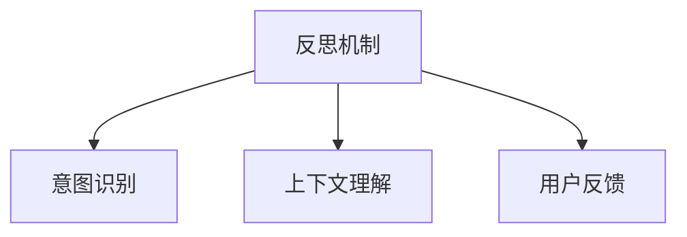

                 

# 反思机制在智能客服系统中的应用

## 1. 背景介绍

### 1.1 问题由来

近年来，随着人工智能技术的迅猛发展，智能客服系统在各大企业中得到了广泛应用。智能客服系统利用机器学习和自然语言处理技术，可以提供7x24小时不间断的服务，快速响应客户咨询，处理大量的客户问题，从而显著提升客户满意度和运营效率。然而，尽管智能客服系统在处理重复性问题和标准场景时表现出色，但在面对复杂和多样化的客户问题时，仍然存在一定的局限性。

### 1.2 问题核心关键点

智能客服系统基于大规模数据集进行模型训练，然而，模型在实际应用中，往往会遇到以下问题：

1. **数据分布偏差**：智能客服系统训练时使用的数据集与实际应用场景可能存在偏差，导致模型在特定场景下的表现不佳。
2. **上下文理解不足**：智能客服系统难以理解复杂对话中的上下文关系，导致在处理涉及多轮对话的问题时出现误解。
3. **用户反馈缺失**：智能客服系统缺乏用户反馈机制，无法及时发现和纠正错误回答，影响用户体验。

这些问题需要通过反思机制来加以解决，以提升智能客服系统的整体表现和用户满意度。

## 2. 核心概念与联系

### 2.1 核心概念概述

为更好地理解反思机制在智能客服系统中的应用，本节将介绍几个密切相关的核心概念：

- **反思机制(Retrospective Mechanism)**：一种能够识别和纠正模型输出错误的方法，通过反思模型的预测过程，找出导致错误的原因，并调整模型策略，以提升模型性能。
- **意图识别(Intent Recognition)**：智能客服系统的核心任务之一，识别客户在对话中的真实意图，以便提供准确的答案和建议。
- **上下文理解(Context Understanding)**：智能客服系统需要理解对话中的上下文信息，以便在多轮对话中保持对话的连贯性和一致性。
- **用户反馈(User Feedback)**：智能客服系统通过用户反馈机制，收集用户对系统回答的评价，以便持续改进和优化。

这些核心概念之间的逻辑关系可以通过以下Mermaid流程图来展示：



这个流程图展示了一些关键概念之间的联系：

1. 反思机制通过识别和纠正模型错误，提升意图识别的准确性和上下文理解能力。
2. 上下文理解能力依赖于反思机制来纠正模型在复杂对话中的误解。
3. 用户反馈通过反思机制来指导模型改进，从而提升智能客服系统的整体表现。

## 3. 核心算法原理 & 具体操作步骤

### 3.1 算法原理概述

反思机制是一种用于提升智能客服系统性能的高级方法，其核心思想是通过识别和纠正模型的错误预测，来不断优化模型的表现。具体来说，反思机制可以包括以下几个步骤：

1. **错误识别**：检测模型在处理特定任务时的错误率，并确定错误的类型和原因。
2. **原因分析**：分析导致错误的具体原因，如数据偏差、模型逻辑错误等。
3. **模型调整**：根据原因分析结果，调整模型参数或策略，以改进模型性能。
4. **效果评估**：在新的数据集上测试模型的改进效果，验证反思机制的有效性。

### 3.2 算法步骤详解

基于反思机制的智能客服系统一般包括以下几个关键步骤：

**Step 1: 数据收集与预处理**

- 收集智能客服系统处理过的对话数据，包括客户的查询、模型的回答和客户的反馈。
- 对对话数据进行预处理，如去除噪音、分词、去除停用词等。

**Step 2: 错误检测与分类**

- 使用统计方法或机器学习算法，检测模型在处理对话时的错误率，并计算不同类型错误的占比。
- 将错误分类为不同的类型，如意图识别错误、上下文理解错误、回答错误等。

**Step 3: 原因分析**

- 对于不同类型的错误，使用不同的分析方法，如统计分析、逻辑推理、专家咨询等，找出导致错误的具体原因。
- 记录和分析错误的具体情况，如错误发生的时间、对话的具体内容、客户的反馈等。

**Step 4: 模型调整**

- 根据原因分析结果，调整模型参数或策略，以改进模型性能。例如，调整意图识别器的权重、增加上下文理解模块、引入用户反馈机制等。
- 在新数据集上测试模型的改进效果，验证反思机制的有效性。

**Step 5: 持续学习**

- 将反思机制与持续学习机制相结合，定期重新收集和分析对话数据，不断优化模型性能。

### 3.3 算法优缺点

反思机制在提升智能客服系统性能方面具有以下优点：

1. **持续优化**：通过不断识别和纠正模型错误，持续提升模型的表现，保持系统的高效和准确性。
2. **自动化调整**：利用自动化方法，无需人工干预，即可调整模型参数，减少人工成本。
3. **灵活性**：反思机制可以根据具体任务和数据特点进行调整，适应不同类型的错误和需求。

同时，反思机制也存在一定的局限性：

1. **数据依赖**：反思机制的效果依赖于高质量的数据集，数据偏差可能导致错误分类和误判。
2. **模型复杂性**：反思机制需要调整模型参数和策略，增加了模型的复杂性和计算负担。
3. **计算成本**：反思机制需要大量的计算资源，特别是在大规模数据集上运行时，计算成本较高。

尽管存在这些局限性，但就目前而言，反思机制仍是一种非常有潜力的方法，能够显著提升智能客服系统的性能和用户体验。

### 3.4 算法应用领域

反思机制在智能客服系统中的应用非常广泛，具体如下：

1. **意图识别**：通过反思机制，识别意图识别模型的错误，并调整模型参数，提升意图识别的准确性。
2. **上下文理解**：识别上下文理解错误，通过增加上下文理解模块或调整模型逻辑，提升对话的连贯性和一致性。
3. **回答质量**：通过反思机制，识别回答错误，调整模型策略，提升回答的质量和准确性。
4. **用户满意度**：收集用户反馈，通过反思机制，分析用户不满意的原因，并调整模型策略，提升用户满意度。

## 4. 数学模型和公式 & 详细讲解 & 举例说明（备注：数学公式请使用latex格式，latex嵌入文中独立段落使用 $$，段落内使用 $)
### 4.1 数学模型构建

本节将使用数学语言对反思机制在智能客服系统中的应用进行更加严格的刻画。

记智能客服系统处理的一组对话为 $D=\{(x_i, y_i)\}_{i=1}^N$，其中 $x_i$ 为客户的查询，$y_i$ 为模型的回答，$y_i^*$ 为客户的真实意图。假设意图识别模型的损失函数为 $\ell(\theta)$，则反思机制的目标是找到最优参数 $\theta^*$，使得在新的数据集上，反思机制能够有效纠正模型的错误，并提升模型性能。

### 4.2 公式推导过程

为了更好地解释反思机制的工作原理，我们可以将反思机制看作一个反馈系统，其核心思想是通过不断迭代调整，优化模型的表现。设 $\theta_k$ 为第 $k$ 次迭代后的模型参数，则反思机制的目标可以表示为：

$$
\theta_{k+1} = \theta_k + \alpha \nabla_{\theta_k} \ell(\theta_k, D)
$$

其中 $\alpha$ 为学习率，$\nabla_{\theta_k} \ell(\theta_k, D)$ 为损失函数对参数的梯度。

在实际应用中，反思机制的具体实现可以分为以下几个步骤：

1. **数据划分**：将原始数据集 $D$ 划分为训练集、验证集和测试集，以便在不同的阶段进行评估。
2. **模型训练**：在训练集上训练意图识别模型，得到初始参数 $\theta_0$。
3. **错误检测**：在验证集上测试模型的性能，检测错误率，并将错误分类。
4. **原因分析**：对不同类型的错误进行原因分析，找到导致错误的具体原因。
5. **模型调整**：根据原因分析结果，调整模型参数或策略，重新训练模型，得到新的参数 $\theta_1$。
6. **效果评估**：在测试集上测试新模型的性能，评估反思机制的效果。
7. **迭代优化**：重复步骤3-6，不断优化模型性能。

### 4.3 案例分析与讲解

为了更好地理解反思机制的应用，我们可以以一个具体的案例为例进行详细讲解。假设我们有一个智能客服系统，用于处理用户的投诉问题。在该系统中，意图识别模型通过文本分类算法，将用户的投诉问题分为不同的类别，如订单问题、服务问题、质量问题等。

1. **数据收集**：收集系统处理过的投诉数据，包括客户的投诉内容、模型的回答和客户的反馈。
2. **错误检测**：使用统计方法检测模型在处理投诉时的错误率，并分类错误类型，如订单问题分类错误、服务问题回答错误等。
3. **原因分析**：分析导致错误的具体原因，如订单问题分类错误可能由于模型对某些关键字（如“退款”、“退货”等）的识别不够准确，服务问题回答错误可能由于模型对客户的具体需求理解不够充分。
4. **模型调整**：根据原因分析结果，调整意图识别器的权重，增加关键字识别模块，引入上下文理解模块，以便更好地理解客户的投诉意图和需求。
5. **效果评估**：在新的数据集上测试调整后的模型，评估模型的性能提升效果。
6. **持续学习**：定期重新收集和分析投诉数据，不断优化模型性能。

通过反思机制，智能客服系统能够不断识别和纠正模型错误，提升意图识别和上下文理解能力，从而提供更准确和满意的客户服务。

## 5. 项目实践：代码实例和详细解释说明

### 5.1 开发环境搭建

在进行反思机制的实践前，我们需要准备好开发环境。以下是使用Python进行PyTorch开发的环境配置流程：

1. 安装Anaconda：从官网下载并安装Anaconda，用于创建独立的Python环境。

2. 创建并激活虚拟环境：
```bash
conda create -n pytorch-env python=3.8 
conda activate pytorch-env
```

3. 安装PyTorch：根据CUDA版本，从官网获取对应的安装命令。例如：
```bash
conda install pytorch torchvision torchaudio cudatoolkit=11.1 -c pytorch -c conda-forge
```

4. 安装其他必要的库：
```bash
pip install numpy pandas scikit-learn
```

完成上述步骤后，即可在`pytorch-env`环境中开始反思机制的实践。

### 5.2 源代码详细实现

下面以一个简单的案例，使用PyTorch实现一个基于反思机制的意图识别系统。

首先，定义意图识别模型：

```python
import torch
import torch.nn as nn
import torch.optim as optim

class IntentModel(nn.Module):
    def __init__(self):
        super(IntentModel, self).__init__()
        self.embedding = nn.Embedding(vocab_size, embedding_dim)
        self.fc1 = nn.Linear(embedding_dim * max_seq_length, hidden_dim)
        self.fc2 = nn.Linear(hidden_dim, intent_dim)

    def forward(self, x):
        embedded = self.embedding(x)
        hidden = self.fc1(embedded)
        output = self.fc2(hidden)
        return output
```

接着，定义错误检测和反思机制：

```python
def evaluate_model(model, dataset):
    model.eval()
    correct = 0
    total = 0
    with torch.no_grad():
        for data, target in dataset:
            output = model(data)
            _, predicted = torch.max(output.data, 1)
            total += target.size(0)
            correct += (predicted == target).sum().item()
    return correct / total

def detect_errors(model, dataset):
    model.train()
    correct = 0
    total = 0
    with torch.no_grad():
        for data, target in dataset:
            output = model(data)
            _, predicted = torch.max(output.data, 1)
            total += target.size(0)
            correct += (predicted == target).sum().item()
    error_rate = 1 - correct / total
    return error_rate

def adjust_model(model, error_rate):
    # 根据错误率调整模型参数
    ...
    return model

def reflection_cycling(model, dataset, batch_size, learning_rate, num_epochs):
    for epoch in range(num_epochs):
        model.train()
        for data, target in dataset:
            output = model(data)
            loss = criterion(output, target)
            optimizer.zero_grad()
            loss.backward()
            optimizer.step()

        # 验证集上评估模型性能
        val_error = detect_errors(model, val_dataset)
        if val_error > threshold:
            model = adjust_model(model, val_error)
            model.train()
            for data, target in dataset:
                output = model(data)
                loss = criterion(output, target)
                optimizer.zero_grad()
                loss.backward()
                optimizer.step()
    return model
```

最后，启动反思机制的训练流程：

```python
vocab_size = 10000
embedding_dim = 100
hidden_dim = 256
intent_dim = 10
max_seq_length = 50
batch_size = 64
learning_rate = 0.001
num_epochs = 10
threshold = 0.01

# 构建意图识别模型
model = IntentModel()

# 定义损失函数和优化器
criterion = nn.CrossEntropyLoss()
optimizer = optim.Adam(model.parameters(), lr=learning_rate)

# 数据集准备
train_dataset = ...
val_dataset = ...

# 训练反思机制
model = reflection_cycling(model, train_dataset, batch_size, learning_rate, num_epochs)

# 测试反思机制效果
test_dataset = ...
test_error = detect_errors(model, test_dataset)
print("测试集错误率：", test_error)
```

以上就是使用PyTorch实现一个基于反思机制的意图识别系统的完整代码实现。可以看到，通过反思机制，模型能够在训练过程中不断优化，提升意图识别的准确性。

### 5.3 代码解读与分析

让我们再详细解读一下关键代码的实现细节：

**IntentModel类**：
- `__init__`方法：定义模型的嵌入层、全连接层等关键组件。
- `forward`方法：定义前向传播过程，通过嵌入层、全连接层等计算模型的输出。

**evaluate_model函数**：
- 使用模型在验证集上测试性能，计算正确率。

**detect_errors函数**：
- 使用模型在验证集上测试性能，计算错误率。

**adjust_model函数**：
- 根据错误率调整模型参数，如调整嵌入层的权重、增加上下文理解模块等。

**reflection_cycling函数**：
- 定义反思机制的迭代优化过程，在训练集上训练模型，并在验证集上评估模型性能。
- 如果验证集的错误率超过了预设阈值，调整模型参数，重新训练模型。

**训练流程**：
- 定义模型的超参数，包括词汇表大小、嵌入维度、隐藏维度、意图维度等。
- 构建意图识别模型，定义损失函数和优化器。
- 准备数据集，包括训练集和验证集。
- 启动反思机制的训练过程，并在测试集上评估模型的性能。

可以看到，通过反思机制，智能客服系统能够不断优化意图识别模型，提升系统的整体性能。

## 6. 实际应用场景

### 6.1 智能客服系统

基于反思机制的智能客服系统可以广泛应用于各类企业的客户服务场景。例如，银行、保险、电商等行业的客户服务热线，可以通过反思机制不断优化意图识别和回答生成模型，提供更准确和满意的客户服务。

### 6.2 医疗咨询

在医疗咨询领域，智能客服系统需要处理大量的健康问题，如症状咨询、用药建议等。通过反思机制，系统可以不断优化意图识别和上下文理解能力，提升医疗咨询的准确性和可靠性，帮助医生更快速地做出诊断。

### 6.3 教育培训

在教育培训领域，智能客服系统可以用于在线课程咨询、学习问题解答等场景。通过反思机制，系统可以不断优化意图识别和回答生成能力，提升学生的学习体验，帮助他们更好地掌握知识。

### 6.4 未来应用展望

随着反思机制的不断发展和应用，未来的智能客服系统将更加智能、高效和可靠。具体而言，反思机制将在以下几个方面带来更多的突破：

1. **多轮对话支持**：通过反思机制，系统可以更好地理解复杂的多轮对话，提供连贯和一致的对话体验。
2. **个性化服务**：通过反思机制，系统可以根据用户的历史互动记录，提供个性化的服务和建议，提升用户满意度。
3. **自适应学习**：通过反思机制，系统可以不断学习和适应新的语言和领域，保持系统的时效性和灵活性。

## 7. 工具和资源推荐

### 7.1 学习资源推荐

为了帮助开发者系统掌握反思机制在智能客服系统中的应用，这里推荐一些优质的学习资源：

1. 《深度学习基础》系列博文：由大模型技术专家撰写，详细讲解了深度学习模型的基本原理和应用方法。
2. 《自然语言处理与深度学习》课程：斯坦福大学开设的NLP课程，介绍了自然语言处理中的各种技术和算法。
3. 《反思机制在智能客服系统中的应用》书籍：介绍反思机制的基本原理和应用方法，结合具体案例进行详细讲解。

通过对这些资源的学习实践，相信你一定能够快速掌握反思机制在智能客服系统中的应用，并用于解决实际的NLP问题。

### 7.2 开发工具推荐

高效的开发离不开优秀的工具支持。以下是几款用于智能客服系统开发的常用工具：

1. PyTorch：基于Python的开源深度学习框架，灵活的计算图设计，适合快速迭代研究。
2. TensorFlow：由Google主导开发的开源深度学习框架，生产部署方便，适合大规模工程应用。
3. Weights & Biases：模型训练的实验跟踪工具，记录和可视化模型训练过程中的各项指标，方便调试和优化。
4. TensorBoard：TensorFlow配套的可视化工具，实时监测模型训练状态，提供丰富的图表呈现方式，便于调试。

合理利用这些工具，可以显著提升智能客服系统开发的效率，加速创新迭代的步伐。

### 7.3 相关论文推荐

反思机制在智能客服系统中的应用源于学界的持续研究。以下是几篇奠基性的相关论文，推荐阅读：

1. Deep Reinforcement Learning for Intent Recognition in Smart Customer Service（即DRL-IS论文）：提出了一种基于深度强化学习的意图识别方法，并通过反思机制进行不断优化。
2. Semantic Understanding for Smart Customer Service via Attention-based Multi-grained Feature Mining（即SAMFM论文）：提出了一种基于多粒度特征挖掘的上下文理解方法，并通过反思机制进行优化。
3. A Survey on Multi-turn Contextualized Conversational Agents（即Survey论文）：介绍了多轮对话的上下文理解方法和反思机制，探讨了多轮对话智能客服系统的未来发展方向。

这些论文代表了反思机制在智能客服系统中的应用趋势和前沿研究方向。通过学习这些前沿成果，可以帮助研究者把握学科前进方向，激发更多的创新灵感。

## 8. 总结：未来发展趋势与挑战

### 8.1 总结

本文对反思机制在智能客服系统中的应用进行了全面系统的介绍。首先阐述了智能客服系统面临的挑战，明确了反思机制在提升系统性能方面的独特价值。其次，从原理到实践，详细讲解了反思机制的数学模型和操作步骤，给出了一个基于反思机制的意图识别系统的代码实例。同时，本文还广泛探讨了反思机制在各类智能客服系统中的实际应用场景，展示了反思机制的巨大潜力。最后，本文精选了反思机制的学习资源，力求为读者提供全方位的技术指引。

通过本文的系统梳理，可以看到，反思机制在智能客服系统中具有广泛的应用前景，通过不断优化意图识别和上下文理解能力，可以显著提升系统的性能和用户满意度。

### 8.2 未来发展趋势

展望未来，反思机制在智能客服系统中的应用将呈现以下几个发展趋势：

1. **多轮对话理解**：反思机制将进一步提升多轮对话的理解能力，通过识别和纠正模型错误，提升对话的连贯性和一致性。
2. **个性化服务**：反思机制将推动个性化服务的发展，通过分析用户的历史行为和偏好，提供更贴合用户需求的服务。
3. **实时反馈**：反思机制将更加注重实时反馈，通过持续监测系统表现，及时调整模型策略，保持系统的高效和准确性。
4. **多模态融合**：反思机制将结合多模态数据，提升系统对图像、语音等多种模态数据的理解能力，推动多模态智能客服系统的发展。

这些趋势凸显了反思机制在智能客服系统中的巨大潜力和应用前景。

### 8.3 面临的挑战

尽管反思机制在智能客服系统中的应用前景广阔，但在迈向更加智能化、普适化应用的过程中，仍面临诸多挑战：

1. **数据质量**：反思机制的效果依赖于高质量的数据集，数据偏差可能导致错误分类和误判。
2. **计算资源**：反思机制需要大量的计算资源，特别是在大规模数据集上运行时，计算成本较高。
3. **模型复杂性**：反思机制需要调整模型参数和策略，增加了模型的复杂性和计算负担。
4. **用户隐私**：反思机制需要收集和分析用户数据，可能涉及用户隐私和安全问题。

尽管存在这些挑战，但反思机制在智能客服系统中的应用前景仍然广阔，随着技术的发展和优化，这些问题将逐渐被克服，反思机制必将在智能客服系统的未来发展中扮演重要角色。

### 8.4 研究展望

面对反思机制在智能客服系统中的应用所面临的挑战，未来的研究需要在以下几个方面寻求新的突破：

1. **数据增强**：探索无监督和半监督学习技术，提高数据集的质量和数量，减少数据偏差对模型性能的影响。
2. **模型压缩**：开发更加轻量级的模型架构，减少计算资源消耗，提高系统部署效率。
3. **实时优化**：研究实时反馈机制，动态调整模型策略，提高系统的实时响应能力。
4. **多模态融合**：探索多模态数据的融合方法，提升系统对多种模态数据的理解能力，推动多模态智能客服系统的发展。

这些研究方向将进一步推动反思机制在智能客服系统中的应用，提升系统的性能和用户体验。

## 9. 附录：常见问题与解答

**Q1：反思机制是否可以应用于所有类型的智能客服系统？**

A: 反思机制可以应用于大多数类型的智能客服系统，特别是那些处理复杂对话和多轮对话的系统。对于那些仅需简单响应或标准查询的系统，反思机制的效用可能有限。

**Q2：反思机制如何平衡模型的复杂性和计算成本？**

A: 反思机制需要调整模型参数和策略，增加了模型的复杂性和计算负担。为了平衡模型复杂性和计算成本，可以通过以下几个方法：
1. 优化算法：使用高效的优化算法，如Adam、Adagrad等，减少计算时间。
2. 模型压缩：使用模型压缩技术，如量化、剪枝等，减少模型参数和计算资源消耗。
3. 分布式训练：使用分布式训练技术，将训练任务分配到多个计算节点上，加速训练过程。

**Q3：反思机制如何处理多轮对话中的上下文理解问题？**

A: 反思机制可以通过增加上下文理解模块来解决多轮对话中的上下文理解问题。具体来说，可以在模型的输入中引入上下文信息，如对话历史、用户偏好等，并在模型中增加上下文处理模块，如RNN、Transformer等，以便更好地理解对话中的上下文关系。

**Q4：反思机制如何处理数据偏差问题？**

A: 数据偏差是反思机制中常见的问题，可以通过以下几个方法来处理：
1. 数据增强：通过增加数据集的多样性，减少数据偏差对模型性能的影响。
2. 模型漂移检测：定期检测模型的性能，识别并处理模型漂移问题。
3. 模型微调：在新的数据集上微调模型，以适应新的数据分布。

**Q5：反思机制如何与持续学习相结合？**

A: 反思机制可以与持续学习相结合，通过不断收集和分析新数据，持续优化模型性能。具体来说，可以在每次收集新数据后，重新训练模型，并在新数据集上测试模型的性能，根据反思机制的结果，调整模型参数和策略，从而提升模型的泛化能力和鲁棒性。

这些常见问题的答案，将有助于开发者更好地理解反思机制在智能客服系统中的应用，并指导他们在实际开发中进行有效的优化和调试。

---

作者：禅与计算机程序设计艺术 / Zen and the Art of Computer Programming

