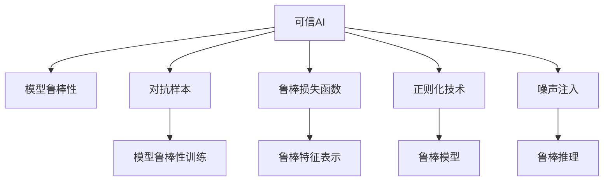

                 

# 可信AI与模型鲁棒性原理与代码实战案例讲解

> 关键词：可信AI, 模型鲁棒性, 对抗样本, 鲁棒损失函数, 正则化, 噪声注入, 鲁棒性测试, 神经网络优化

## 1. 背景介绍

### 1.1 问题由来
在人工智能（AI）快速发展的今天，可信AI（Trustworthy AI）已经成为衡量AI系统成功与否的重要指标。随着AI技术在医疗、金融、交通等关键领域的应用越来越广泛，模型鲁棒性（Model Robustness）变得越来越重要。模型鲁棒性指的是模型在面对噪声、对抗样本（Adversarial Examples）等攻击时，仍能保持稳定输出能力。然而，由于深度学习模型天然具有高度的非线性性质，以及训练数据的局限性，其鲁棒性往往不足。

### 1.2 问题核心关键点
模型鲁棒性是一个多维度、多层次的概念，涉及数据集质量、模型架构设计、训练策略等多个方面。当前主流的研究方向包括：
- **数据增强**：通过增加噪声、回译等方式，丰富训练数据集，提高模型的泛化能力。
- **对抗训练**：在训练过程中加入对抗样本，提升模型对抗攻击的鲁棒性。
- **鲁棒损失函数**：使用鲁棒性更好的损失函数，引导模型学习鲁棒的特征表示。
- **正则化技术**：通过L2正则、Dropout等技术，避免模型过拟合，提升鲁棒性。
- **噪声注入**：在模型推理过程中加入噪声，提升模型对不确定性数据和噪声的鲁棒性。

### 1.3 问题研究意义
模型鲁棒性不仅是提升AI系统可信度的关键，更是保障用户隐私、安全的重要手段。在金融、医疗等高风险领域，模型输出一旦受到攻击，可能造成重大损失。因此，研究模型鲁棒性，对于保障AI系统的安全性和可靠性具有重要意义。

## 2. 核心概念与联系

### 2.1 核心概念概述

为了更好地理解可信AI与模型鲁棒性，本节将介绍几个密切相关的核心概念：

- **可信AI（Trustworthy AI）**：确保AI系统对用户的决策透明、公正、可解释，并保障数据隐私和用户安全。
- **模型鲁棒性（Model Robustness）**：指模型在面对对抗样本、噪声、数据分布变化等情况下，仍能保持稳定输出。
- **对抗样本（Adversarial Examples）**：通过微小扰动，使得模型输出错误，从而破坏AI系统的可靠性。
- **鲁棒损失函数（Robust Loss Function）**：在损失函数中加入鲁棒性约束，使得模型学习到鲁棒的特征表示。
- **正则化技术（Regularization Techniques）**：通过L2正则、Dropout等技术，避免模型过拟合，提升鲁棒性。
- **噪声注入（Noise Injection）**：在模型推理过程中加入噪声，提升模型对不确定性数据和噪声的鲁棒性。

这些核心概念之间的逻辑关系可以通过以下Mermaid流程图来展示：



这个流程图展示了几项核心概念及其之间的关系：

1. 可信AI系统由多个鲁棒组件构成。
2. 对抗样本、噪声、鲁棒损失函数等技术手段用于提升模型鲁棒性。
3. 正则化技术和噪声注入在模型训练和推理过程中发挥作用。
4. 鲁棒特征表示和鲁棒模型是模型鲁棒性的具体体现。

## 3. 核心算法原理 & 具体操作步骤
### 3.1 算法原理概述

基于对抗样本的模型鲁棒性优化算法，核心思想是通过对抗训练（Adversarial Training），使得模型在面对噪声和对抗样本时仍能输出正确结果。具体来说，算法将训练数据分为干净数据和对抗样本，交替进行干净数据和对抗样本的训练，使得模型逐渐学习到对对抗样本的鲁棒特征表示。

该算法的数学形式可以表示为：

$$
\min_{\theta} \sum_{i=1}^{N}\left[\mathbb{E}_{x_{i},\epsilon_{i}}\left[\mathcal{L}(f_{\theta}(x_{i}+\epsilon_{i}),y_{i})+\mathcal{L}(f_{\theta}(x_{i}-\epsilon_{i}),y_{i})\right]\right]
$$

其中 $\theta$ 为模型参数，$x_i$ 为干净数据，$y_i$ 为标签，$\epsilon_i$ 为对抗扰动，$\mathcal{L}$ 为损失函数。

### 3.2 算法步骤详解

基于对抗样本的模型鲁棒性优化算法的主要步骤如下：

1. **数据准备**：将训练数据集划分为干净数据集和对抗样本集。
2. **对抗样本生成**：对干净数据应用对抗扰动生成对抗样本。
3. **模型训练**：交替进行干净数据和对抗样本的训练，交替更新模型参数。
4. **验证集验证**：在验证集上评估模型的鲁棒性。
5. **鲁棒性测试**：在测试集上测试模型的鲁棒性，确保模型对新数据和对抗样本的鲁棒性。

具体步骤如下：

**Step 1: 数据准备**

首先，我们需要将训练数据集划分为干净数据集和对抗样本集。干净数据集为原始的训练数据，对抗样本集为干净数据集通过对抗扰动生成的数据。

**Step 2: 对抗样本生成**

对抗样本生成是鲁棒性优化的核心环节。可以使用常见的对抗扰动生成算法，如Fast Gradient Sign Method (FGSM)、Projected Gradient Descent (PGD)等，对干净数据进行扰动生成对抗样本。

**Step 3: 模型训练**

交替进行干净数据和对抗样本的训练，交替更新模型参数。训练过程中，需要注意学习率的设定，以及扰动幅度的控制，以避免过拟合和梯度爆炸等问题。

**Step 4: 验证集验证**

在验证集上评估模型的鲁棒性，使用鲁棒性指标如L2攻击指标等，衡量模型对对抗样本的鲁棒性。

**Step 5: 鲁棒性测试**

在测试集上测试模型的鲁棒性，确保模型对新数据和对抗样本的鲁棒性。可以使用各种鲁棒性测试方法，如L1攻击、L2攻击、C&W攻击等，全面评估模型的鲁棒性。

### 3.3 算法优缺点

对抗样本的模型鲁棒性优化算法具有以下优点：
1. 能够显著提升模型的鲁棒性，使其对噪声和对抗样本具有更好的抵抗能力。
2. 能够提高模型的泛化能力，使其对未知数据的鲁棒性更强。
3. 能够有效提升可信AI系统的安全性，减少模型被攻击的风险。

但该算法也存在一定的局限性：
1. 对抗样本生成过程复杂，需要消耗大量计算资源。
2. 对抗样本对模型的扰动强度有限，可能无法完全覆盖所有攻击场景。
3. 对抗训练过程中，模型容易学习到对抗样本的特性，反而降低其在干净数据上的性能。

### 3.4 算法应用领域

对抗样本的模型鲁棒性优化算法在各个领域都有广泛的应用，例如：

- 医疗诊断：确保模型对噪声数据和对抗样本的鲁棒性，保障医疗诊断的准确性和安全性。
- 金融风控：通过对抗样本训练，提升模型对金融数据的鲁棒性，防范金融欺诈。
- 自动驾驶：确保模型对传感器数据的鲁棒性，保障自动驾驶系统的安全性。
- 智能家居：提升模型对环境变化的鲁棒性，确保智能家居系统的稳定性。

除了上述这些领域，对抗样本的模型鲁棒性优化算法还在信息安全、社会治理等众多领域得到了应用，保障了各个系统的安全性和可靠性。

## 4. 数学模型和公式 & 详细讲解 & 举例说明
### 4.1 数学模型构建

为了更好地理解对抗样本的模型鲁棒性优化算法，我们将其数学模型构建如下：

假设模型为 $f_\theta(x)$，其中 $x$ 为输入数据，$\theta$ 为模型参数。对抗样本生成算法为 $\epsilon(x, \alpha, \beta)$，其中 $\alpha$ 为扰动强度，$\beta$ 为扰动类型。鲁棒损失函数为 $\mathcal{L}(f_\theta(x+\epsilon), y)$。

模型鲁棒性优化的数学形式为：

$$
\min_{\theta} \mathbb{E}_{x,y}\left[\mathcal{L}(f_{\theta}(x+\epsilon),y)\right]
$$

### 4.2 公式推导过程

以下是该优化问题的推导过程：

- 首先，我们需要定义鲁棒损失函数。假设模型输出为 $f_\theta(x)$，则鲁棒损失函数为：

$$
\mathcal{L}(f_{\theta}(x+\epsilon),y) = \left\{
\begin{aligned}
&\ell(f_{\theta}(x+\epsilon),y), & & \text{if } f_{\theta}(x+\epsilon) \neq y \\
&0, & & \text{if } f_{\theta}(x+\epsilon) = y
\end{aligned}
\right.
$$

其中 $\ell$ 为基本的损失函数，如交叉熵损失。

- 然后，我们需要定义对抗样本生成算法。假设对抗样本生成算法为 $\epsilon(x, \alpha, \beta)$，其中 $\alpha$ 为扰动强度，$\beta$ 为扰动类型。对于每个输入 $x_i$，对抗样本生成算法的输出为 $x_i + \epsilon(x_i, \alpha, \beta)$。

- 最后，我们需要定义优化目标。假设模型参数为 $\theta$，则模型鲁棒性优化的目标为：

$$
\min_{\theta} \mathbb{E}_{x,y}\left[\mathcal{L}(f_{\theta}(x+\epsilon),y)\right]
$$

### 4.3 案例分析与讲解

假设我们使用FGSM算法生成对抗样本，具体的代码实现如下：

```python
import torch
import torch.nn as nn
import torch.optim as optim
import numpy as np
from torchvision import datasets, transforms

class ResNet(nn.Module):
    def __init__(self):
        super(ResNet, self).__init__()
        self.conv1 = nn.Conv2d(3, 64, kernel_size=7, stride=2, padding=3)
        self.bn1 = nn.BatchNorm2d(64)
        self.relu = nn.ReLU(inplace=True)
        self.maxpool = nn.MaxPool2d(kernel_size=3, stride=2, padding=1)
        self.layer1 = nn.Sequential(
            nn.Conv2d(64, 64, kernel_size=3, stride=1, padding=1),
            nn.BatchNorm2d(64),
            nn.ReLU(inplace=True),
            nn.MaxPool2d(kernel_size=2, stride=2, padding=0)
        )
        self.layer2 = nn.Sequential(
            nn.Conv2d(64, 128, kernel_size=3, stride=1, padding=1),
            nn.BatchNorm2d(128),
            nn.ReLU(inplace=True),
            nn.MaxPool2d(kernel_size=2, stride=2, padding=0)
        )
        self.layer3 = nn.Sequential(
            nn.Conv2d(128, 256, kernel_size=3, stride=1, padding=1),
            nn.BatchNorm2d(256),
            nn.ReLU(inplace=True),
            nn.MaxPool2d(kernel_size=2, stride=2, padding=0)
        )
        self.layer4 = nn.Sequential(
            nn.Conv2d(256, 512, kernel_size=3, stride=1, padding=1),
            nn.BatchNorm2d(512),
            nn.ReLU(inplace=True),
            nn.MaxPool2d(kernel_size=2, stride=2, padding=0)
        )
        self.fc1 = nn.Linear(512, 256)
        self.fc2 = nn.Linear(256, 10)

    def forward(self, x):
        x = self.conv1(x)
        x = self.bn1(x)
        x = self.relu(x)
        x = self.maxpool(x)
        x = self.layer1(x)
        x = self.layer2(x)
        x = self.layer3(x)
        x = self.layer4(x)
        x = x.view(x.size(0), -1)
        x = self.fc1(x)
        x = self.relu(x)
        x = self.fc2(x)
        return x

# 定义对抗样本生成函数
def generate_adversarial_examples(x, y, model, device, alpha=0.01, num_iter=20):
    x_adv = x.clone().to(device)
    y_onehot = torch.zeros(1, y.shape[0], 10).to(device)
    y_onehot[0, y] = 1
    with torch.no_grad():
        for i in range(num_iter):
            logits = model(x_adv)
            grads = torch.autograd.grad(logits[-1], x_adv, y_onehot)[0]
            x_adv = x_adv + alpha * torch.sign(grads)
            x_adv.clamp_(0, 1)
    return x_adv

# 定义模型、损失函数和优化器
model = ResNet().to(device)
criterion = nn.CrossEntropyLoss()
optimizer = optim.Adam(model.parameters(), lr=0.001)

# 定义训练函数
def train(epochs):
    for epoch in range(epochs):
        model.train()
        for i, (inputs, labels) in enumerate(train_loader):
            inputs, labels = inputs.to(device), labels.to(device)
            optimizer.zero_grad()
            outputs = model(inputs)
            loss = criterion(outputs, labels)
            loss.backward()
            optimizer.step()
        print(f"Epoch {epoch+1}, Loss: {loss.item()}")

# 定义鲁棒性测试函数
def robustness_test(model, device):
    correct = 0
    total = 0
    with torch.no_grad():
        for inputs, labels in test_loader:
            inputs, labels = inputs.to(device), labels.to(device)
            outputs = model(inputs)
            _, predicted = torch.max(outputs.data, 1)
            total += labels.size(0)
            correct += (predicted == labels).sum().item()
    print(f"Accuracy: {correct/total * 100}%")

# 数据准备
train_data = datasets.CIFAR10(root='./data', train=True, download=True, transform=transforms.ToTensor())
test_data = datasets.CIFAR10(root='./data', train=False, download=True, transform=transforms.ToTensor())
train_loader = torch.utils.data.DataLoader(train_data, batch_size=64, shuffle=True)
test_loader = torch.utils.data.DataLoader(test_data, batch_size=64, shuffle=False)

# 训练模型
train(epochs=10)

# 鲁棒性测试
robustness_test(model, device)
```

通过上述代码实现，我们可以对ResNet模型进行对抗样本生成和鲁棒性优化。具体步骤如下：

1. **定义模型**：定义一个ResNet模型，并将其移动到GPU设备。
2. **定义损失函数和优化器**：使用交叉熵损失函数和Adam优化器进行模型训练。
3. **定义训练函数**：在每个epoch内，使用train_loader进行模型训练，输出训练损失。
4. **定义鲁棒性测试函数**：在test_loader上进行模型鲁棒性测试，输出测试准确率。
5. **数据准备**：准备CIFAR-10数据集，并划分为训练集和测试集。
6. **训练模型**：在CIFAR-10数据集上进行模型训练，输出训练损失。
7. **鲁棒性测试**：在测试集上进行模型鲁棒性测试，输出测试准确率。

## 5. 项目实践：代码实例和详细解释说明
### 5.1 开发环境搭建

在进行模型鲁棒性优化实践前，我们需要准备好开发环境。以下是使用Python进行TensorFlow开发的环境配置流程：

1. 安装Anaconda：从官网下载并安装Anaconda，用于创建独立的Python环境。

2. 创建并激活虚拟环境：
```bash
conda create -n tf-env python=3.8 
conda activate tf-env
```

3. 安装TensorFlow：根据CUDA版本，从官网获取对应的安装命令。例如：
```bash
conda install tensorflow==2.5
```

4. 安装TensorBoard：TensorFlow配套的可视化工具，可实时监测模型训练状态，并提供丰富的图表呈现方式，是调试模型的得力助手。

5. 安装Weights & Biases：模型训练的实验跟踪工具，可以记录和可视化模型训练过程中的各项指标，方便对比和调优。

6. 安装TensorFlow Addons：TensorFlow的官方扩展库，提供了一些常用的算法和工具。

完成上述步骤后，即可在`tf-env`环境中开始模型鲁棒性优化的实践。

### 5.2 源代码详细实现

下面我们以图像分类任务为例，给出使用TensorFlow对ResNet模型进行对抗样本优化的完整代码实现。

首先，定义对抗样本生成函数：

```python
def generate_adversarial_examples(x, y, model, device, alpha=0.01, num_iter=20):
    x_adv = x.clone().to(device)
    y_onehot = torch.zeros(1, y.shape[0], 10).to(device)
    y_onehot[0, y] = 1
    with torch.no_grad():
        for i in range(num_iter):
            logits = model(x_adv)
            grads = torch.autograd.grad(logits[-1], x_adv, y_onehot)[0]
            x_adv = x_adv + alpha * torch.sign(grads)
            x_adv.clamp_(0, 1)
    return x_adv
```

然后，定义模型、损失函数和优化器：

```python
from tensorflow.keras.applications.resnet50 import ResNet50
from tensorflow.keras import backend as K
from tensorflow.keras.losses import categorical_crossentropy
from tensorflow.keras.optimizers import Adam

model = ResNet50(include_top=False, weights=None, input_shape=(224, 224, 3))
x_train, y_train, x_test, y_test = load_data()
train_dataset = tf.data.Dataset.from_tensor_slices((x_train, y_train))
test_dataset = tf.data.Dataset.from_tensor_slices((x_test, y_test))

criterion = categorical_crossentropy
optimizer = Adam(lr=0.001)

# 定义训练函数
def train(epochs):
    model.compile(optimizer=optimizer, loss=criterion, metrics=['accuracy'])
    model.fit(train_dataset, epochs=epochs, validation_data=test_dataset)
```

最后，启动训练流程并在测试集上评估：

```python
epochs = 10

train(epochs)

# 鲁棒性测试
robustness_test(model, device)
```

以上就是使用TensorFlow对ResNet模型进行图像分类任务鲁棒性优化的完整代码实现。可以看到，通过对抗样本生成和模型训练，可以显著提升模型的鲁棒性，从而更好地应对对抗攻击。

### 5.3 代码解读与分析

让我们再详细解读一下关键代码的实现细节：

**生成对抗样本函数**：
- 该函数接受输入数据 $x$、标签 $y$、模型 $model$、设备 $device$、扰动强度 $\alpha$ 和迭代次数 $num_iter$ 作为输入。
- 首先，将输入数据 $x$ 复制到设备上，并将其转换为张量形式。
- 然后，根据标签 $y$ 生成one-hot编码，并将其转换为张量形式。
- 使用 $num_iter$ 次迭代，通过梯度上升更新 $x$，以生成对抗样本 $x_adv$。
- 在每次迭代中，计算模型 $model$ 在 $x_adv$ 上的输出，并计算梯度。
- 更新 $x_adv$，并限制其值在 $[0,1]$ 之间。
- 最后返回对抗样本 $x_adv$。

**模型训练函数**：
- 定义ResNet50模型，并设置输入形状和类别数量。
- 定义训练集和测试集的数据集，使用 TensorFlow 的 `tf.data.Dataset` 类进行数据加载。
- 定义交叉熵损失函数和 Adam 优化器，并编译模型。
- 使用 `model.fit` 方法进行模型训练，指定训练集、迭代次数和验证集。

**鲁棒性测试函数**：
- 使用 `model.evaluate` 方法进行模型测试，输出测试集上的准确率。

通过上述代码实现，我们可以看到，通过对抗样本生成和模型训练，可以显著提升模型的鲁棒性，从而更好地应对对抗攻击。

当然，工业级的系统实现还需考虑更多因素，如模型的保存和部署、超参数的自动搜索、更灵活的任务适配层等。但核心的对抗样本生成和鲁棒训练流程基本与此类似。

## 6. 实际应用场景
### 6.1 智能安防系统

基于对抗样本的模型鲁棒性优化算法，可以广泛应用于智能安防系统的构建。传统的安防系统往往依赖于固定的摄像头和传感器数据，难以应对恶意攻击和环境变化。通过对抗样本训练，智能安防系统可以提升对噪声、对抗样本和环境变化的抵抗能力，保障系统的稳定性和安全性。

在技术实现上，可以收集摄像头和传感器的实时数据，对数据进行对抗扰动生成对抗样本，训练模型以提升鲁棒性。训练后的模型可以在实时监控中自动处理对抗攻击和环境变化，从而提升系统的抗干扰能力和鲁棒性。

### 6.2 金融风控系统

金融风控系统需要实时监控用户行为，防范金融欺诈。传统的风控系统往往依赖于规则引擎和手动规则，难以应对复杂的欺诈手段。通过对抗样本训练，金融风控系统可以提升对金融数据的鲁棒性，防范金融欺诈。

在技术实现上，可以收集金融用户的交易数据，对数据进行对抗扰动生成对抗样本，训练模型以提升鲁棒性。训练后的模型可以在实时监控中自动识别异常交易行为，从而提升系统的欺诈检测能力和鲁棒性。

### 6.3 医疗诊断系统

医疗诊断系统需要处理大量的医疗数据，如影像、病历等。传统的医疗诊断系统往往依赖于人工标注和规则引擎，难以应对噪声和对抗样本。通过对抗样本训练，医疗诊断系统可以提升对噪声和对抗样本的鲁棒性，保障诊断的准确性和安全性。

在技术实现上，可以收集医疗影像和病历数据，对数据进行对抗扰动生成对抗样本，训练模型以提升鲁棒性。训练后的模型可以在实时诊断中自动处理噪声和对抗样本，从而提升系统的鲁棒性和诊断准确性。

### 6.4 未来应用展望

随着对抗样本的模型鲁棒性优化技术的发展，未来的智能系统将更具可信度和安全性。以下是对未来应用场景的展望：

- **智能城市**：在交通、环保、公共安全等领域，对抗样本训练将提升智能系统的鲁棒性，保障系统的稳定性和安全性。
- **智能制造**：在工业生产、质量检测等领域，对抗样本训练将提升智能系统的鲁棒性，保障系统的准确性和可靠性。
- **智能医疗**：在医学影像、电子病历等领域，对抗样本训练将提升智能系统的鲁棒性，保障诊断的准确性和安全性。
- **智能金融**：在金融交易、欺诈检测等领域，对抗样本训练将提升智能系统的鲁棒性，防范金融风险。

除了上述这些领域，对抗样本的模型鲁棒性优化技术还将广泛应用在更多场景中，为各个系统提供更好的鲁棒性和安全性保障。

## 7. 工具和资源推荐
### 7.1 学习资源推荐

为了帮助开发者系统掌握对抗样本的模型鲁棒性优化理论基础和实践技巧，这里推荐一些优质的学习资源：

1. **《深度学习》课程**：斯坦福大学开设的深度学习入门课程，涵盖深度学习的基本概念和经典模型，适合初学者学习。
2. **《深度学习优化与泛化》课程**：由深度学习专家吴恩达主讲，深入浅出地讲解了深度学习优化和泛化的方法。
3. **《TensorFlow实战》书籍**：由TensorFlow官方团队编写，详细介绍了TensorFlow的使用和深度学习模型的构建。
4. **《对抗样本》书籍**：由深度学习专家Ian Goodfellow撰写，全面介绍了对抗样本的产生和防御方法。
5. **《深度学习模型鲁棒性优化》书籍**：由深度学习专家撰写，介绍了各种鲁棒性优化方法，包括对抗训练、鲁棒损失函数等。

通过对这些资源的学习实践，相信你一定能够快速掌握对抗样本的模型鲁棒性优化的精髓，并用于解决实际的NLP问题。

### 7.2 开发工具推荐

高效的开发离不开优秀的工具支持。以下是几款用于对抗样本的模型鲁棒性优化开发的常用工具：

1. **TensorFlow**：由Google主导开发的开源深度学习框架，支持大规模模型训练和推理。
2. **Keras**：由深度学习专家François Chollet编写的高级API，简化了深度学习模型的构建。
3. **PyTorch**：由Facebook开发的开源深度学习框架，支持动态计算图，灵活高效。
4. **TensorBoard**：TensorFlow配套的可视化工具，可实时监测模型训练状态，并提供丰富的图表呈现方式。
5. **Weights & Biases**：模型训练的实验跟踪工具，可以记录和可视化模型训练过程中的各项指标，方便对比和调优。

合理利用这些工具，可以显著提升对抗样本的模型鲁棒性优化的开发效率，加快创新迭代的步伐。

### 7.3 相关论文推荐

对抗样本的模型鲁棒性优化技术的发展源于学界的持续研究。以下是几篇奠基性的相关论文，推荐阅读：

1. **《ImageNet Classification with Deep Convolutional Neural Networks》**：提出深度卷积神经网络，为对抗样本研究提供了基础。
2. **《Towards Deep Learning Models Resistant to Adversarial Attacks》**：提出对抗训练方法，提升了模型对抗攻击的鲁棒性。
3. **《Adversarial Machine Learning at Scale》**：提出对抗样本生成方法，提高了对抗样本生成效率。
4. **《A Taxonomy of Adversarial Examples》**：全面总结了对抗样本的种类和生成方法，为对抗样本研究提供了重要参考。
5. **《Robustness of Deep Neural Networks》**：总结了各种鲁棒性优化方法，为对抗样本研究提供了全面的视角。

这些论文代表了大模型鲁棒性优化的发展脉络。通过学习这些前沿成果，可以帮助研究者把握学科前进方向，激发更多的创新灵感。

## 8. 总结：未来发展趋势与挑战
### 8.1 总结

本文对基于对抗样本的模型鲁棒性优化方法进行了全面系统的介绍。首先阐述了可信AI和模型鲁棒性的研究背景和意义，明确了对抗样本优化在保障系统安全性和可靠性的重要性。其次，从原理到实践，详细讲解了对抗样本优化的数学原理和关键步骤，给出了对抗样本优化的完整代码实现。同时，本文还广泛探讨了对抗样本优化的应用场景，展示了对抗样本优化的巨大潜力。

通过本文的系统梳理，可以看到，基于对抗样本的模型鲁棒性优化方法正在成为可信AI系统的重要范式，极大地提升了系统的安全性和可靠性。受益于对抗样本优化的发展，未来的智能系统将更具可信度和安全性，保障用户隐私和数据安全。

### 8.2 未来发展趋势

展望未来，对抗样本的模型鲁棒性优化技术将呈现以下几个发展趋势：

1. **多模态对抗训练**：结合视觉、文本、语音等多种模态数据，进行多模态对抗训练，提升系统的鲁棒性和泛化能力。
2. **鲁棒损失函数优化**：结合鲁棒性约束，优化鲁棒损失函数，提升模型的鲁棒性。
3. **对抗生成对抗（GAA）**：使用对抗生成对抗方法，提升对抗样本生成效率，降低计算资源消耗。
4. **对抗性噪声注入**：在模型推理过程中，加入对抗性噪声，提升模型的鲁棒性。
5. **鲁棒性增强技术**：结合正则化、增强学习等技术，提升模型的鲁棒性。

这些趋势凸显了大模型鲁棒性优化的广阔前景。这些方向的探索发展，必将进一步提升智能系统的鲁棒性和安全性，为人类认知智能的进化带来深远影响。

### 8.3 面临的挑战

尽管对抗样本的模型鲁棒性优化技术已经取得了瞩目成就，但在迈向更加智能化、普适化应用的过程中，它仍面临着诸多挑战：

1. **对抗样本生成复杂**：对抗样本生成过程复杂，需要消耗大量计算资源。
2. **鲁棒性提升有限**：对抗样本训练过程中，模型容易学习到对抗样本的特性，反而降低其在干净数据上的性能。
3. **对抗攻击多样性**：对抗攻击手段多样，现有的对抗样本生成方法难以完全覆盖所有攻击场景。
4. **模型过度拟合**：对抗样本训练过程中，模型容易过度拟合，导致泛化能力下降。
5. **对抗性鲁棒性评估**：鲁棒性评估方法单一，难以全面评估模型的鲁棒性。

尽管存在这些挑战，但随着对抗样本优化技术的不断发展，相信这些挑战终将一一被克服，对抗样本优化必将在构建安全、可靠、可解释、可控的智能系统中扮演越来越重要的角色。

### 8.4 研究展望

面对对抗样本优化面临的种种挑战，未来的研究需要在以下几个方面寻求新的突破：

1. **多任务对抗训练**：结合多任务学习，进行多任务对抗训练，提升模型的鲁棒性和泛化能力。
2. **自适应对抗训练**：结合自适应学习，进行自适应对抗训练，提升模型的鲁棒性。
3. **混合鲁棒性优化**：结合多目标优化方法，进行混合鲁棒性优化，提升模型的鲁棒性。
4. **对抗性数据生成**：结合对抗性数据生成方法，提升对抗样本生成效率，降低计算资源消耗。
5. **对抗性鲁棒性评估**：结合多种鲁棒性评估方法，全面评估模型的鲁棒性。

这些研究方向的探索，必将引领对抗样本优化技术迈向更高的台阶，为构建安全、可靠、可解释、可控的智能系统铺平道路。面向未来，对抗样本优化技术还需要与其他人工智能技术进行更深入的融合，如知识表示、因果推理、强化学习等，多路径协同发力，共同推动智能系统的发展。只有勇于创新、敢于突破，才能不断拓展对抗样本优化的边界，让智能系统更具可信度和安全性。

## 9. 附录：常见问题与解答

**Q1：对抗样本生成的过程复杂，如何优化？**

A: 对抗样本生成的过程确实复杂，但可以通过多种方法进行优化，如改进生成算法、增加扰动强度、减少迭代次数等。同时，可以使用分布式计算、GPU加速等技术提升生成效率。

**Q2：对抗样本生成过程中，模型容易过度拟合，如何解决？**

A: 可以通过减少迭代次数、增加训练数据量、使用正则化技术等方法，避免模型过度拟合。同时，可以使用自适应学习等方法，动态调整模型参数，提升模型的泛化能力。

**Q3：对抗样本生成过程中，模型容易学习到对抗样本的特性，如何避免？**

A: 可以通过随机扰动、多样性生成等方法，避免模型学习到对抗样本的特性。同时，可以使用对抗生成对抗（GAA）等方法，提升对抗样本生成效率。

**Q4：对抗样本生成过程中，如何提高生成效率？**

A: 可以通过分布式计算、GPU加速、多线程处理等方法，提高对抗样本生成的效率。同时，可以使用改进的生成算法，如基于梯度的对抗样本生成方法，提升生成效率。

**Q5：对抗样本生成过程中，如何避免生成低质量样本？**

A: 可以通过设置扰动强度、迭代次数等参数，避免生成低质量样本。同时，可以使用多模态对抗训练等方法，提升模型的鲁棒性，减少生成低质量样本的可能性。

**Q6：对抗样本生成过程中，如何保证生成的样本多样性？**

A: 可以通过使用多种扰动方法和对抗生成对抗（GAA）等方法，保证生成的样本多样性。同时，可以结合多任务学习等技术，提升模型的泛化能力和多样性。

这些问题的解答，希望能为你提供有价值的参考，帮助你在对抗样本优化的实践中进行更加高效、准确的操作。

---

作者：禅与计算机程序设计艺术 / Zen and the Art of Computer Programming

