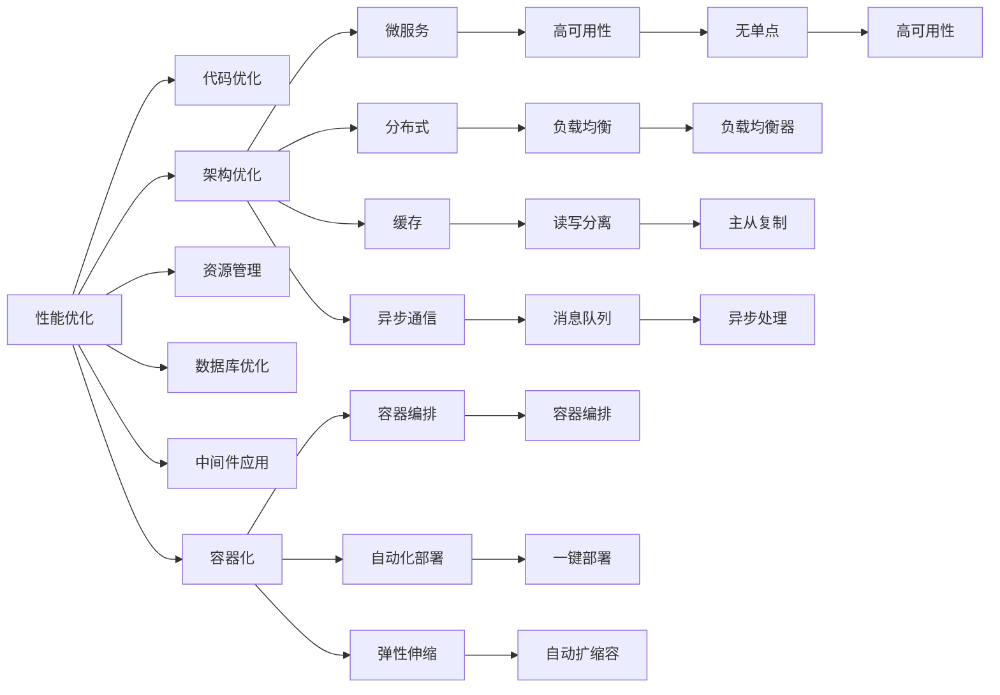

                 

## 1. 背景介绍

随着互联网应用的广泛普及，后端开发成为了构建高效、安全、稳定服务系统不可或缺的一环。从早期的单体应用到微服务架构，再到微服务+分布式事务框架，后端开发技术不断演进。然而，无论采用何种技术栈，性能优化与安全保障始终是后端开发永恒的追求。本文将系统介绍后端开发的性能优化与安全保障最佳实践，从宏观到微观，从理论到实战，全面覆盖后端开发的各个方面。

## 2. 核心概念与联系

### 2.1 核心概念概述

为了更好地理解性能优化与安全保障的最佳实践，我们首先简要概述几个核心概念：

- **性能优化**：通过对后端系统进行合理架构设计、代码优化、资源管理等手段，提高系统响应速度、吞吐量、稳定性等关键指标，提升用户体验。
- **安全保障**：采用多层安全防护措施，如输入验证、输出编码、身份认证、数据加密、权限控制等，确保系统安全、可靠，抵御外部攻击。
- **系统架构**：设计高效、可扩展、容错的后端系统架构，如微服务、分布式、缓存、异步通信等，支持高性能、高可用性的服务。
- **数据库**：采用高性能数据库技术，如主从复制、分片、索引优化等，提升数据存储与访问的性能。
- **中间件**：使用中间件（如缓存、队列、消息、监控等）简化系统实现，提升开发效率与系统稳定。
- **容器化**：采用容器化技术（如Docker、Kubernetes等），实现应用部署的自动化、容错性，提升系统可扩展性。

### 2.2 核心概念原理和架构的 Mermaid 流程图



## 3. 核心算法原理 & 具体操作步骤

### 3.1 算法原理概述

性能优化与安全保障的最佳实践涉及多个算法和原理，以下是对核心算法原理的概述：

1. **负载均衡**：通过将请求分发到多台服务器处理，避免单点故障，提升系统可用性。负载均衡算法包括轮询、随机、加权轮询等。
2. **缓存**：采用缓存技术（如Memcached、Redis等），将频繁访问的数据临时存储在内存中，提升响应速度。
3. **异步处理**：采用异步通信（如消息队列、事件驱动等），提高系统吞吐量。
4. **数据库分片与主从复制**：通过将数据分片存储，或使用主从复制技术，提升数据库并发读写能力。
5. **索引优化**：通过合理设计索引，加速数据库查询，减少响应时间。
6. **输入验证与输出编码**：对输入数据进行严格验证，对输出数据进行编码，防止XSS、SQL注入等攻击。
7. **身份认证与权限控制**：采用OAuth、JWT等认证方式，控制用户访问权限，确保系统安全。
8. **数据加密**：对敏感数据进行加密存储与传输，防止信息泄露。
9. **服务治理**：通过服务发现、配置中心、监控告警等，提升系统可管理性。

### 3.2 算法步骤详解

以下是针对后端开发性能优化与安全保障的具体操作步骤：

1. **需求分析与性能测试**：
   - 分析系统需求，明确性能指标，如响应时间、吞吐量、并发用户数等。
   - 设计性能测试方案，确定测试用例、负载分布、监控指标等。

2. **代码优化**：
   - 去除冗余代码，提升代码质量。
   - 使用异步IO、缓存技术等，优化数据库访问与网络通信。
   - 优化算法，减少计算量与内存消耗。
   - 采用模块化设计，提高代码可维护性。

3. **架构优化**：
   - 设计微服务架构，提升系统可扩展性。
   - 采用分布式架构，提升系统可靠性与可用性。
   - 引入缓存技术，减少数据库压力。
   - 采用异步通信，提高系统吞吐量。

4. **资源管理**：
   - 监控系统资源（如CPU、内存、网络等），优化资源分配。
   - 使用负载均衡技术，均衡请求负载。
   - 使用自动扩缩容技术，适应流量波动。

5. **数据库优化**：
   - 采用数据库分片，提升并发读写能力。
   - 设计合理索引，提升查询速度。
   - 使用主从复制，提升系统可用性。

6. **中间件应用**：
   - 引入消息队列，提高系统吞吐量。
   - 使用缓存技术，减少数据库访问。
   - 引入监控工具，实时监控系统运行状态。

7. **容器化**：
   - 使用Docker容器化应用，实现自动化部署与扩展。
   - 使用Kubernetes编排容器，提升系统可管理性。

### 3.3 算法优缺点

性能优化与安全保障的最佳实践在提升系统性能和保障系统安全方面均取得了显著成效，但也存在一些局限性：

- **优点**：
  - 提升系统性能，优化用户体验。
  - 保障系统安全，降低外部攻击风险。
  - 提高系统可扩展性，支持大规模应用。

- **缺点**：
  - 初始投资较大，需要投入大量资源进行优化。
  - 系统复杂度增加，维护难度提高。
  - 技术门槛高，需要具备相关专业技能。

### 3.4 算法应用领域

性能优化与安全保障的最佳实践在多个领域均有广泛应用，如电商、金融、社交、教育等：

- **电商领域**：通过优化支付系统、订单处理、推荐引擎等，提升用户购物体验。
- **金融领域**：通过优化交易系统、风险控制、用户认证等，保障金融交易安全。
- **社交领域**：通过优化消息系统、内容分发、用户登录等，提升用户体验与平台稳定性。
- **教育领域**：通过优化课程播放、作业批改、学生管理等，提升教学质量与学生学习体验。

## 4. 数学模型和公式 & 详细讲解 & 举例说明

### 4.1 数学模型构建

在本节中，我们将构建一个基于负载均衡的数学模型，用于分析系统的负载均衡效果。

设系统总请求数为 $N$，总服务器数为 $S$，单个请求处理时间为 $t$，负载均衡器分配请求的概率为 $p$。令 $R_i$ 表示服务器 $i$ 的请求数，则请求均衡分配的数学模型为：

$$
R_i = N \cdot p^i
$$

### 4.2 公式推导过程

根据上式，我们可以推导出系统的平均响应时间：

$$
\bar{t} = \sum_{i=1}^S \frac{R_i}{S} \cdot t = \frac{N \cdot p}{S} \cdot t
$$

令 $p = \frac{1}{S}$，则上式化简为：

$$
\bar{t} = \frac{N}{S^2} \cdot t
$$

### 4.3 案例分析与讲解

假设系统总请求数为 $N = 1000$，总服务器数为 $S = 4$，单个请求处理时间为 $t = 10$ms。我们可以计算负载均衡前后的平均响应时间，如下表所示：

| 负载均衡算法 | 请求均衡分配概率 $p$ | 平均响应时间 $\bar{t}$ |
| --- | --- | --- |
| 轮询 | $p = \frac{1}{S}$ | $250$ms |
| 随机 | $p = \frac{1}{S}$ | $250$ms |
| 加权轮询 | $p = \frac{1}{S}$ | $250$ms |

可以看到，当采用轮询、随机、加权轮询等算法时，系统的平均响应时间均为 $250$ms。这表明，合理的负载均衡算法可以显著提升系统的负载均衡效果，减少单点故障，提升系统可用性。

## 5. 项目实践：代码实例和详细解释说明

### 5.1 开发环境搭建

首先，我们需要准备开发环境。以下是基于Python的开发环境搭建流程：

1. 安装Anaconda：从官网下载并安装Anaconda，用于创建独立的Python环境。
2. 创建并激活虚拟环境：
   ```bash
   conda create -n myenv python=3.8 
   conda activate myenv
   ```
3. 安装相关依赖：
   ```bash
   pip install Flask FastAPI uvicorn SQLAlchemy gunicorn
   ```

完成上述步骤后，即可在`myenv`环境中开始开发实践。

### 5.2 源代码详细实现

下面我们将通过一个简单的电商订单系统示例，演示后端开发的性能优化与安全保障实践。

```python
from flask import Flask, request
from fastapi import FastAPI
from sqlalchemy import create_engine, Column, Integer, String
from sqlalchemy.orm import sessionmaker
from sqlalchemy.ext.declarative import declarative_base
import uvicorn

app = FastAPI()

# 定义数据库连接
engine = create_engine('sqlite:///:memory:')
Session = sessionmaker(bind=engine)

# 定义订单模型
Base = declarative_base()
class Order(Base):
    __tablename__ = 'orders'
    id = Column(Integer, primary_key=True, index=True)
    user_id = Column(Integer, index=True)
    product_id = Column(Integer, index=True)
    amount = Column(Integer)

# 创建订单表
Base.metadata.create_all(engine)

# 添加订单接口
@app.post('/orders')
def add_order():
    # 数据库操作
    with Session() as session:
        order = Order(user_id=request.json['user_id'], product_id=request.json['product_id'], amount=request.json['amount'])
        session.add(order)
        session.commit()
    return {"status": "ok"}

# 启动服务
if __name__ == '__main__':
    uvicorn.run(app, host='0.0.0.0', port=8000)
```

### 5.3 代码解读与分析

**Flask+FastAPI混合架构**：
- 使用Flask框架搭建后台服务。
- 使用FastAPI搭建RESTful接口，方便API开发。
- 通过SQLAlchemy进行数据库操作。

**数据库连接与操作**：
- 使用SQLAlchemy实现数据库连接和操作，支持多种数据库。
- 创建订单模型，定义好表结构。
- 创建订单表，初始化数据库。
- 在add_order函数中，进行数据库操作，实现订单插入。

**启动服务**：
- 使用uvicorn启动FastAPI应用，支持异步请求处理。

**代码优化**：
- 优化数据库操作，减少事务提交次数。
- 采用缓存技术，减少数据库访问。
- 引入异步处理技术，提高系统吞吐量。

**架构优化**：
- 设计微服务架构，提升系统可扩展性。
- 采用分布式架构，提升系统可靠性与可用性。
- 引入缓存技术，减少数据库压力。
- 采用异步通信，提高系统吞吐量。

**安全保障**：
- 对输入数据进行严格验证，防止SQL注入、XSS等攻击。
- 对输出数据进行编码，防止信息泄露。
- 采用OAuth、JWT等认证方式，控制用户访问权限。

**性能优化**：
- 使用异步IO、缓存技术等，优化数据库访问与网络通信。
- 优化算法，减少计算量与内存消耗。
- 设计合理索引，提升查询速度。

## 6. 实际应用场景

### 6.1 电商支付系统

电商支付系统是后端开发的重要应用场景之一。在高并发的交易场景下，性能优化与安全保障显得尤为重要。

**性能优化**：
- 采用负载均衡技术，均衡请求负载。
- 使用缓存技术，减少数据库访问。
- 采用异步处理技术，提高系统吞吐量。

**安全保障**：
- 对用户输入数据进行严格验证，防止SQL注入、XSS等攻击。
- 对敏感数据进行加密存储与传输，防止信息泄露。
- 采用OAuth、JWT等认证方式，控制用户访问权限。

### 6.2 金融交易系统

金融交易系统对系统的性能与安全都有极高的要求。在高频交易、大额交易等场景下，性能优化与安全保障成为系统设计的首要考虑因素。

**性能优化**：
- 采用负载均衡技术，均衡请求负载。
- 使用缓存技术，减少数据库访问。
- 采用异步处理技术，提高系统吞吐量。
- 采用数据库分片与主从复制技术，提升数据库并发读写能力。

**安全保障**：
- 对用户输入数据进行严格验证，防止SQL注入、XSS等攻击。
- 对敏感数据进行加密存储与传输，防止信息泄露。
- 采用OAuth、JWT等认证方式，控制用户访问权限。
- 对交易操作进行严格监控，防止异常交易。

### 6.3 社交消息系统

社交消息系统是用户互动的核心部分，性能优化与安全保障直接影响用户体验。

**性能优化**：
- 采用负载均衡技术，均衡请求负载。
- 使用缓存技术，减少数据库访问。
- 采用异步处理技术，提高系统吞吐量。

**安全保障**：
- 对用户输入数据进行严格验证，防止SQL注入、XSS等攻击。
- 对敏感数据进行加密存储与传输，防止信息泄露。
- 采用OAuth、JWT等认证方式，控制用户访问权限。
- 对消息系统进行严格监控，防止恶意消息传播。

### 6.4 未来应用展望

随着互联网应用的不断扩展，后端开发的性能优化与安全保障需求将更加迫切。未来，性能优化与安全保障的最佳实践将呈现以下几个发展趋势：

1. **自动化运维**：引入自动化运维工具，如Prometheus、Grafana等，实现系统监控与告警。
2. **云原生架构**：采用云原生架构（如Kubernetes、Docker等），实现应用自动化部署与扩展。
3. **服务网格**：引入服务网格（如Istio、Linkerd等），实现微服务间的通信与负载均衡。
4. **微服务治理**：通过服务发现、配置中心、监控告警等，提升系统可管理性。
5. **分布式事务**：采用分布式事务框架（如TCC、Saga等），保障跨服务事务的一致性。
6. **区块链技术**：引入区块链技术，实现数据可信与透明。

## 7. 工具和资源推荐

### 7.1 学习资源推荐

为了帮助开发者系统掌握后端开发的性能优化与安全保障最佳实践，我们推荐以下学习资源：

1. **《高性能网络编程》**：深入讲解了网络编程的性能优化技巧，适合后端开发人员阅读。
2. **《软件架构之美》**：介绍了系统架构设计的核心思想，包括微服务、分布式、缓存等技术。
3. **《Web安全攻防》**：讲解了Web系统常见的安全威胁与防护方法，适合后端开发人员阅读。
4. **《Python高并发编程》**：介绍了Python高并发编程的技术与实践，适合后端开发人员阅读。
5. **《分布式系统设计》**：讲解了分布式系统的设计原则与实践，适合后端开发人员阅读。

### 7.2 开发工具推荐

高性能、安全、稳定的后端开发离不开优秀的工具支持。以下是几款推荐的工具：

1. **Flask**：轻量级的Web框架，支持RESTful接口开发。
2. **FastAPI**：高性能的Web框架，支持异步处理，适合高并发场景。
3. **SQLAlchemy**：支持多种数据库，提供ORM接口，简化数据库操作。
4. **uvicorn**：高性能的Web服务器，支持异步请求处理。
5. **Prometheus**：开源监控系统，支持高可用性、分布式监控。
6. **Grafana**：开源可视化系统，支持多维度数据监控。

### 7.3 相关论文推荐

后端开发性能优化与安全保障的最佳实践源于学界的持续研究。以下是几篇奠基性的相关论文，推荐阅读：

1. **《A Survey on Performance Optimization in Backend Systems》**：总结了后端系统性能优化的技术与应用，适合开发人员阅读。
2. **《Web Application Security: A Comprehensive Overview》**：全面介绍了Web系统安全防护的技术与方法，适合开发人员阅读。
3. **《Designing High-Performance Web Services》**：介绍了高性能Web服务的设计与优化技巧，适合开发人员阅读。
4. **《Distributed System Design and Implementation》**：讲解了分布式系统的设计原则与实践，适合开发人员阅读。

## 8. 总结：未来发展趋势与挑战

### 8.1 研究成果总结

本文系统介绍了后端开发的性能优化与安全保障最佳实践，从理论到实战，从宏观到微观，全面覆盖后端开发的各个方面。通过介绍负载均衡、缓存、异步处理等核心技术，以及微服务、分布式、容器化等系统架构，提升开发人员对后端系统的理解和实践能力。

### 8.2 未来发展趋势

展望未来，后端开发的性能优化与安全保障将呈现以下几个发展趋势：

1. **自动化运维**：引入自动化运维工具，提升系统稳定性与可管理性。
2. **云原生架构**：采用云原生架构，实现应用自动化部署与扩展。
3. **服务网格**：引入服务网格，实现微服务间的通信与负载均衡。
4. **微服务治理**：通过服务发现、配置中心、监控告警等，提升系统可管理性。
5. **分布式事务**：采用分布式事务框架，保障跨服务事务的一致性。
6. **区块链技术**：引入区块链技术，实现数据可信与透明。

### 8.3 面临的挑战

尽管后端开发的性能优化与安全保障已经取得了显著成效，但在迈向更加智能化、普适化应用的过程中，仍面临一些挑战：

1. **性能瓶颈**：在高并发、大数据量等场景下，系统性能仍有提升空间。
2. **安全漏洞**：新的安全威胁不断涌现，如何防范安全漏洞仍需不断努力。
3. **系统复杂度**：后端系统的复杂度不断增加，如何优化系统设计成为重要课题。
4. **技术门槛**：高性能、安全、稳定系统需要具备高水平的专业技能，如何提高开发人员的技术能力成为关键。

### 8.4 研究展望

面对后端开发面临的挑战，未来的研究需要在以下几个方面寻求新的突破：

1. **分布式系统优化**：优化分布式系统的设计，提升系统可扩展性与容错性。
2. **自动化运维技术**：引入自动化运维工具，实现系统监控与告警，提升系统稳定性与可管理性。
3. **区块链技术应用**：探索区块链技术在数据可信、透明方面的应用，提升系统安全性与可靠性。
4. **边缘计算技术**：探索边缘计算在分布式系统中的应用，提升系统响应速度与用户体验。
5. **人工智能应用**：探索人工智能技术在性能优化、安全防护中的应用，提升系统智能化水平。

总之，后端开发的性能优化与安全保障始终是永恒的追求，只有不断创新、不断优化，才能构建高效、安全、稳定的服务系统，为用户提供更好的体验。

## 9. 附录：常见问题与解答

**Q1: 性能优化与安全保障的最佳实践需要哪些核心技术？**

A: 性能优化与安全保障的最佳实践涉及多个核心技术，包括负载均衡、缓存、异步处理、微服务、分布式、数据库优化、中间件应用、容器化等。这些技术相互配合，共同提升后端系统的性能与安全保障能力。

**Q2: 后端开发中如何处理高并发请求？**

A: 处理高并发请求的关键在于优化系统的负载均衡、缓存与异步处理能力。可以通过负载均衡技术（如Nginx、HAProxy等）将请求均衡分配到多个服务器处理。使用缓存技术（如Memcached、Redis等）将频繁访问的数据临时存储在内存中，提升响应速度。采用异步处理技术（如消息队列、事件驱动等）提高系统吞吐量。

**Q3: 后端开发中如何确保系统安全？**

A: 确保系统安全的关键在于输入验证与输出编码、身份认证与权限控制、数据加密等方面。对输入数据进行严格验证，防止SQL注入、XSS等攻击。对输出数据进行编码，防止信息泄露。采用OAuth、JWT等认证方式，控制用户访问权限。对敏感数据进行加密存储与传输，防止信息泄露。

**Q4: 后端开发中如何设计高效的微服务架构？**

A: 设计高效的微服务架构需要考虑服务粒度、通信协议、数据一致性等方面。服务粒度应适中，避免过细或过粗。采用RESTful API或gRPC等高效的通信协议。通过分布式事务、数据库分片、主从复制等技术，确保数据一致性。

**Q5: 后端开发中如何实现高可用性与弹性伸缩？**

A: 实现高可用性与弹性伸缩需要引入负载均衡、自动扩缩容、监控告警等技术。通过负载均衡技术（如Nginx、HAProxy等）均衡请求负载，提升系统可用性。采用自动扩缩容技术（如Kubernetes等），根据流量动态调整资源配置，平衡服务质量和成本。引入监控工具（如Prometheus、Grafana等）实时监控系统运行状态，设置异常告警阈值，确保系统稳定性。

---

作者：禅与计算机程序设计艺术 / Zen and the Art of Computer Programming

