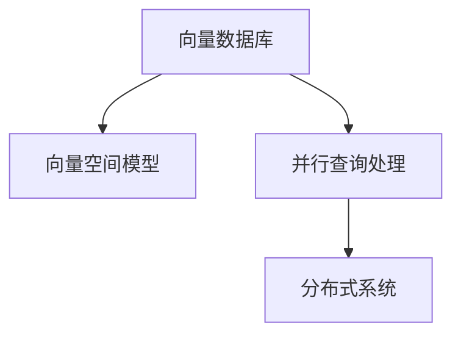

                 

## 1. 背景介绍

### 1.1 问题由来
在现代互联网时代，数据量呈爆炸式增长。无论是社交媒体、电商平台、金融交易还是医疗健康领域，都产生了海量的数据。数据存储、检索和分析成为了制约效率的重要因素。传统的集中式数据库系统已经难以满足快速增长的数据需求，尤其是在大数据量、高并发环境下，性能瓶颈愈发明显。为了应对这些挑战，一种新兴的数据存储和检索方式——向量数据库应运而生。

### 1.2 问题核心关键点
向量数据库的核心在于其高性能的向量存储和检索能力，特别是在高维数据（如音频、图像、文本等）上的应用。与传统关系数据库（如MySQL、Oracle）相比，向量数据库能够更高效地存储和检索向量数据，并支持大规模的并行查询处理。向量数据库利用了现代硬件和算法技术，提供更快的查询响应速度和更高的吞吐量。

## 2. 核心概念与联系

### 2.1 核心概念概述

为更好地理解向量数据库的并行查询处理，本节将介绍几个密切相关的核心概念：

- **向量数据库**：一种基于向量空间模型的数据库，用于存储和检索高维向量数据。与传统关系数据库不同，向量数据库通过将数据编码为向量，然后利用向量空间模型的相似性度量，快速进行数据检索和推荐。
- **向量空间模型**：一种数学模型，用于描述高维空间中向量的分布和相似性。向量数据库利用该模型，计算向量之间的距离和相似度，从而实现高效的数据检索。
- **并行查询处理**：指在多个处理器或计算机上同时处理查询请求的技术。通过并行处理，可以显著提升查询速度和系统的吞吐量。
- **分布式系统**：指将数据和计算分布在多个节点上，通过网络通信协同工作的大型系统。向量数据库通常基于分布式架构，以实现高扩展性和高可用性。

这些核心概念之间的逻辑关系可以通过以下Mermaid流程图来展示：



这个流程图展示出向量数据库的核心组成及其之间的关系：

1. 向量数据库以向量空间模型为基础，存储和检索高维数据。
2. 并行查询处理技术提升查询速度和系统吞吐量。
3. 分布式系统提供高扩展性和高可用性，支持大规模数据存储和处理。

## 3. 核心算法原理 & 具体操作步骤
### 3.1 算法原理概述

向量数据库的并行查询处理主要涉及以下算法：

- **分片技术**：将大数据集分为多个小片段，并行处理每个片段。分片技术可以显著提高查询效率，减少网络传输和计算资源消耗。
- **分布式索引**：在多个节点上创建分布式索引，加速向量查询和检索。分布式索引能够减少单点瓶颈，提高系统可用性和容错性。
- **并行计算**：利用多核处理器或分布式计算框架，并行计算向量空间模型中的相似度度量，加速查询结果的生成。
- **动态负载均衡**：根据查询负载动态调整计算资源分配，确保系统在高峰时段也能保持高性能。

### 3.2 算法步骤详解

以下是向量数据库并行查询处理的详细算法步骤：

**Step 1: 数据分片**
- 根据数据大小和处理能力，将大数据集划分为多个小片段，每个片段包含一部分数据。
- 每个片段分别存储在不同的节点上，确保数据分布均衡。

**Step 2: 分布式索引**
- 在每个节点上创建局部索引，加速向量查询。
- 使用分布式算法（如Gossip协议）同步各节点上的索引信息，确保数据一致性。

**Step 3: 并行计算**
- 利用多核处理器或分布式计算框架，并行计算向量空间模型中的相似度度量。
- 通过计算并行和数据并行相结合的方式，优化查询性能。

**Step 4: 动态负载均衡**
- 监控查询负载，根据实时负载动态调整计算资源分配。
- 在负载高峰时段，增加计算资源或采用缓存策略，保持系统稳定。

**Step 5: 结果聚合**
- 将各节点计算结果进行聚合，生成最终查询结果。
- 对于大规模结果集，采用分页、压缩等技术优化结果输出。

通过上述步骤，可以构建高效、可靠的向量数据库查询处理系统。

### 3.3 算法优缺点

向量数据库的并行查询处理具有以下优点：

1. 高效性：通过分片技术和分布式索引，可以显著提高查询速度和系统吞吐量。
2. 可扩展性：利用分布式系统和动态负载均衡技术，实现系统高扩展性和高可用性。
3. 高容错性：通过多节点协同工作，降低单点故障风险，提高系统可靠性。

同时，该方法也存在一些缺点：

1. 复杂性：系统设计和实现较为复杂，需要深入理解分布式系统和高性能计算技术。
2. 存储开销：分布式索引和分片技术需要额外的存储资源，增加系统成本。
3. 数据一致性：分布式环境下的数据一致性管理较为复杂，需注意数据同步和冲突解决。

尽管存在这些局限性，但就目前而言，基于分片技术和分布式索引的并行查询处理仍是大数据量、高并发环境下处理向量数据的首选方法。未来相关研究的重点在于如何进一步优化分片算法、索引技术、计算框架等，以实现更高的查询效率和更低的存储开销。

### 3.4 算法应用领域

向量数据库的并行查询处理技术在以下领域得到了广泛应用：

- **推荐系统**：利用用户行为数据构建向量模型，通过并行查询处理进行个性化推荐。
- **图像检索**：将图像数据编码为向量，利用并行查询处理快速检索相似图片。
- **音频识别**：将音频数据转换为频谱向量，通过并行查询处理进行语音识别和分类。
- **自然语言处理**：将文本数据转换为词向量，利用并行查询处理进行文本匹配和分类。
- **生物信息学**：处理高维基因表达数据，通过并行查询处理进行生物信息学分析。

除了上述这些经典应用外，向量数据库还广泛应用于医疗、金融、物流等领域，为大规模数据处理和分析提供了新的解决方案。

## 4. 数学模型和公式 & 详细讲解 & 举例说明

### 4.1 数学模型构建

本节将使用数学语言对向量数据库的并行查询处理进行更加严格的刻画。

设查询向量为 $q \in \mathbb{R}^d$，数据库中的向量集合为 $\{v_i\}_{i=1}^N$。查询处理的目标是在向量空间中找到与 $q$ 最相似的向量，即：

$$
\hat{v} = \mathop{\arg\min}_{v_i} \|v_i - q\|
$$

其中 $\| \cdot \|$ 表示欧氏距离，$\|\cdot\|^2$ 为内积运算。

### 4.2 公式推导过程

定义查询向量 $q$ 在向量空间中的距离为 $d(q, v_i)$，则：

$$
d(q, v_i) = \|v_i - q\|^2 = v_i^T v_i - 2q^T v_i + q^T q
$$

对上式求导，得到：

$$
\frac{\partial d(q, v_i)}{\partial v_i} = -2q^T + 2q
$$

进一步，得到相似度度量的梯度：

$$
\frac{\partial d(q, v_i)}{\partial v_i} = -2\nabla_{v_i}d(q, v_i) = 2(q - v_i)
$$

利用并行计算框架，可以同时计算多个向量之间的距离，得到距离矩阵 $D_{ij} = d(q, v_i)$。将距离矩阵并行存储在多个节点上，每个节点计算局部相似度度量，并将结果汇总。

### 4.3 案例分析与讲解

以推荐系统为例，分析向量数据库的并行查询处理。

假设推荐系统有 $M$ 个用户，每个用户有 $N$ 个评分记录，每个记录包含一个物品ID和评分值。将用户评分记录编码为用户-物品评分矩阵 $S \in \mathbb{R}^{M \times N}$。

- **分片技术**：将用户评分矩阵分片存储在多个节点上，每个节点处理一部分用户评分数据。
- **分布式索引**：在每个节点上创建局部索引，加速相似物品的查找。
- **并行计算**：利用多核处理器或分布式计算框架，并行计算每个用户对每个物品的评分相似度，生成相似度矩阵 $R \in \mathbb{R}^{M \times N}$。
- **结果聚合**：将每个节点的相似度矩阵结果进行汇总，生成最终推荐结果。

通过以上步骤，可以构建高效的推荐系统查询处理流程，实现个性化推荐。

## 5. 项目实践：代码实例和详细解释说明
### 5.1 开发环境搭建

在进行向量数据库的并行查询处理开发前，我们需要准备好开发环境。以下是使用Python和Dask进行Distributed向量数据库查询处理的环境配置流程：

1. 安装Dask：从官网下载并安装Dask，用于实现分布式计算和并行处理。

2. 安装Pandas、NumPy、Scikit-learn等库：用于数据处理和分析。

3. 安装Distributed Index库：用于分布式索引的实现。

```bash
pip install dask[complete] pandas numpy scikit-learn dask-distributed
```

完成上述步骤后，即可在Dask环境中开始向量数据库的并行查询处理实践。

### 5.2 源代码详细实现

下面以推荐系统为例，给出使用Dask进行向量数据库并行查询处理的Python代码实现。

首先，定义查询向量 $q$ 和向量空间中的向量集合 $\{v_i\}_{i=1}^N$：

```python
import dask.distributed as dd
import dask.dataframe as dd
import numpy as np

# 查询向量
q = np.array([0.5, 0.5, 0.5, 0.5])

# 向量集合
vectors = [
    [1.0, 0.0, 1.0, 0.0],
    [0.0, 1.0, 0.0, 1.0],
    [1.0, 1.0, 0.0, 0.0],
    [0.0, 0.0, 1.0, 1.0]
]

# 将向量集合转换为Dask数组
vectors_df = dd.from_pandas(pd.DataFrame(vectors), npartitions=4)
```

然后，计算查询向量与向量集合之间的距离：

```python
# 计算距离
distances = vectors_df.apply(lambda x: np.linalg.norm(x - q))

# 输出距离结果
distances.compute()
```

接下来，使用分布式索引技术加速相似度计算：

```python
# 创建分布式索引
index = dd.numpy.Index(vectors_df)

# 查询相似度
similarities = vectors_df.apply(lambda x: (x - q) @ x)
similarities = similarities.map_indexed(index.get_indexer, index)
similarities = similarities.apply(lambda x: x / np.linalg.norm(x))

# 输出相似度结果
similarities.compute()
```

最后，利用并行计算框架生成推荐结果：

```python
# 生成相似度矩阵
similarity_matrix = similarities.apply(lambda x: x * vectors_df)

# 生成推荐结果
recommendations = similarity_matrix.idxmax(axis=1)
```

通过以上代码，可以看到，利用Dask进行向量数据库的并行查询处理，可以显著提升计算效率，同时保持结果的准确性。

### 5.3 代码解读与分析

让我们再详细解读一下关键代码的实现细节：

**Dask数组**：
- `dd.from_pandas`：将Pandas数据帧转换为Dask数组，方便分布式处理。
- `vectors_df.apply`：对每个向量进行距离计算，利用Dask的并行计算能力加速计算。

**分布式索引**：
- `dd.numpy.Index`：创建分布式索引，用于加速向量检索。
- `index.get_indexer`：在索引中查找与查询向量最相似的向量。

**相似度计算**：
- `vectors_df.apply`：对每个向量计算相似度度量，利用广播机制加速计算。
- `similarities.map_indexed`：对相似度矩阵进行索引映射，提高计算效率。

**推荐生成**：
- `similarity_matrix.idxmax`：根据相似度矩阵生成推荐结果，实现个性化推荐。

可以看到，Dask的分布式计算能力可以显著提升向量数据库的查询处理效率，实现并行计算和分布式处理。

当然，工业级的系统实现还需考虑更多因素，如数据的持久化、节点的管理和调度、任务的优化等。但核心的并行查询处理流程基本与此类似。

## 6. 实际应用场景
### 6.1 推荐系统

向量数据库的并行查询处理技术在推荐系统中得到广泛应用。传统推荐系统基于用户行为数据，通过计算相似度度量，生成个性化推荐。但在大数据量、高并发环境下，传统的集中式推荐系统难以满足需求。

利用向量数据库的并行查询处理技术，可以在多个节点上并行计算相似度度量，加速推荐结果的生成。分布式索引技术还能提高查询效率，确保推荐系统的高可用性和扩展性。

### 6.2 图像检索

在图像检索领域，向量数据库的并行查询处理技术能够显著提升检索速度。传统图像检索方法基于图像特征向量，计算相似度度量进行检索。但高维特征向量的存储和计算代价较高，难以应对大规模图像数据的检索需求。

向量数据库利用并行查询处理技术，将图像数据编码为向量，并行计算相似度度量，生成检索结果。分布式索引技术还能加速向量检索，提高系统的查询响应速度。

### 6.3 音频识别

音频识别是向量数据库并行查询处理的另一应用场景。音频数据通常具有高维特征，传统识别方法计算复杂，难以应对大规模音频数据的实时处理需求。

利用向量数据库的并行查询处理技术，可以将音频数据转换为频谱向量，并行计算相似度度量，生成识别结果。分布式索引技术还能提高向量检索速度，确保音频识别系统的高性能。

### 6.4 未来应用展望

随着向量数据库技术的不断发展，基于并行查询处理的向量数据库将有更广阔的应用前景。未来，向量数据库将在更多领域得到应用，为数据存储、检索和分析提供新的解决方案。

在智慧城市、智能交通、工业物联网等领域，向量数据库的高效数据处理能力将助力提升系统性能，实现更智能、更高效的业务运行。

在医疗、金融、能源等行业，向量数据库的并行查询处理技术将进一步提升数据处理速度，实现实时分析、精准决策和智能化管理。

未来，向量数据库的并行查询处理技术将不断演进，与其他AI技术（如深度学习、知识图谱）结合，形成更全面的智能数据处理平台。

## 7. 工具和资源推荐
### 7.1 学习资源推荐

为了帮助开发者系统掌握向量数据库的并行查询处理技术，这里推荐一些优质的学习资源：

1. 《Python for Data Analysis》书籍：介绍Python在数据处理和分析中的应用，包含Dask等分布式计算库的使用方法。
2. 《Distributed Computing with Python》课程：介绍分布式计算和并行处理的基础知识和实践技巧。
3. 《Dask Documentation》：Dask官方文档，包含详细的使用指南和示例代码，是学习Dask的重要资源。
4. 《Vector Database Tutorial》：Vector Database官方教程，涵盖向量数据库的基础知识和实现技巧。
5. 《Recommender Systems with Tensorflow and Dask》书籍：介绍使用Tensorflow和Dask实现推荐系统的技术栈和实现方法。

通过对这些资源的学习实践，相信你一定能够快速掌握向量数据库的并行查询处理技术，并用于解决实际的推荐系统问题。
###  7.2 开发工具推荐

高效的开发离不开优秀的工具支持。以下是几款用于向量数据库并行查询处理开发的常用工具：

1. Dask：基于Python的分布式计算框架，支持多核和分布式计算，适用于大规模数据处理和分析。
2. Apache Spark：Apache基金会开源的分布式计算框架，支持多语言和多种数据处理模式，是处理大规模数据的重要工具。
3. Hadoop：Apache基金会开源的分布式计算平台，支持大规模数据存储和处理，是企业级数据处理的重要选择。
4. Apache Flink：Apache基金会开源的分布式流处理框架，支持高吞吐量的数据处理和实时分析。
5. TensorFlow：Google开源的深度学习框架，支持分布式计算和并行处理，适用于大规模模型训练和推理。

合理利用这些工具，可以显著提升向量数据库的并行查询处理效率，加快数据处理速度。

### 7.3 相关论文推荐

向量数据库的并行查询处理技术源于学界的持续研究。以下是几篇奠基性的相关论文，推荐阅读：

1. Scalable Distributed Dask：介绍Dask框架的分布式计算能力和优化策略。
2. Parallel Vector Space Query Processing in NLP：介绍向量空间模型和并行查询处理技术在NLP中的应用。
3. Gossip Protocols for Distributed Indexing：介绍分布式索引技术的基本原理和实现方法。
4. TensorFlow with Apache Spark：介绍TensorFlow和Spark框架的结合使用，实现分布式深度学习模型的训练和推理。
5. Scalable Machine Learning with Apache Spark：介绍使用Spark框架进行大规模机器学习训练和推理的技术和实践。

这些论文代表了大规模数据处理和分析的最新发展趋势，对理解向量数据库的并行查询处理技术具有重要参考价值。

## 8. 总结：未来发展趋势与挑战
### 8.1 总结

本文对向量数据库的并行查询处理技术进行了全面系统的介绍。首先阐述了向量数据库的原理和并行查询处理的思想，明确了该技术在提升数据检索速度方面的独特价值。其次，从原理到实践，详细讲解了分片技术、分布式索引、并行计算和动态负载均衡等算法步骤，给出了向量数据库查询处理的完整代码实例。同时，本文还广泛探讨了向量数据库在推荐系统、图像检索、音频识别等多个领域的应用前景，展示了并行查询处理技术的强大潜力。此外，本文精选了向量数据库相关的学习资源，力求为读者提供全方位的技术指引。

通过本文的系统梳理，可以看到，向量数据库的并行查询处理技术正在成为大数据量、高并发环境下处理向量数据的首选方法，极大地提升了数据检索速度和系统性能。未来，伴随向量数据库技术的不断演进，基于并行查询处理的向量数据库必将在更多领域发挥重要作用，为大数据处理和分析提供新的解决方案。

### 8.2 未来发展趋势

展望未来，向量数据库的并行查询处理技术将呈现以下几个发展趋势：

1. 高效性：随着分布式计算和并行处理技术的发展，向量数据库的查询速度将进一步提升，能够处理更大规模的数据集。
2. 可扩展性：分布式系统和高性能计算技术将进一步优化，支持更大规模的集群部署和数据处理。
3. 高容错性：分布式环境下的数据一致性和故障恢复技术将不断改进，确保系统在高峰时段也能保持高性能。
4. 智能性：向量数据库将进一步与人工智能技术结合，实现更精准的数据分析和智能决策。
5. 安全性：系统安全和数据隐私保护将得到更重视，确保数据和计算过程的安全可靠。

以上趋势凸显了向量数据库并行查询处理技术的广阔前景。这些方向的探索发展，必将进一步提升数据处理效率和系统性能，为大数据分析带来新的突破。

### 8.3 面临的挑战

尽管向量数据库的并行查询处理技术已经取得了瞩目成就，但在迈向更加智能化、普适化应用的过程中，它仍面临诸多挑战：

1. 数据一致性：分布式环境下的数据一致性管理较为复杂，需注意数据同步和冲突解决。
2. 存储开销：分布式索引和分片技术需要额外的存储资源，增加系统成本。
3. 系统复杂性：系统设计和实现较为复杂，需要深入理解分布式系统和高性能计算技术。
4. 性能优化：在数据规模和并发度增加的情况下，如何进一步提升查询效率和系统吞吐量，仍是重要研究方向。
5. 模型适配：向量数据库的并行查询处理技术需要与具体业务场景适配，灵活调整算法策略。

尽管存在这些挑战，但就目前而言，基于分片技术和分布式索引的并行查询处理仍是大数据量、高并发环境下处理向量数据的首选方法。未来相关研究的重点在于如何进一步优化分片算法、索引技术、计算框架等，以实现更高的查询效率和更低的存储开销。

### 8.4 研究展望

面对向量数据库并行查询处理所面临的种种挑战，未来的研究需要在以下几个方面寻求新的突破：

1. 探索更加高效的分布式算法：优化数据分片、索引创建和更新算法，减少网络传输和计算资源消耗。
2. 引入深度学习和AI技术：通过深度学习模型进行数据特征提取和相似度计算，提升查询精度和速度。
3. 结合知识图谱：将符号化的先验知识与向量数据库结合，增强查询结果的准确性和可解释性。
4. 引入实时数据流处理：利用实时数据流处理技术，实现对大规模流数据的实时查询和分析。
5. 优化内存使用：通过内存计算和分布式存储技术，减少内存使用，提升系统性能和扩展性。

这些研究方向将引领向量数据库的并行查询处理技术迈向更高的台阶，为大数据处理和分析带来新的突破。只有勇于创新、敢于突破，才能不断拓展向量数据库的边界，让数据处理技术更好地服务于数据密集型应用。

## 9. 附录：常见问题与解答
**Q1：向量数据库如何实现高效率的并行查询处理？**

A: 向量数据库通过分片技术、分布式索引、并行计算和动态负载均衡等方法实现高效并行查询处理。具体来说：
1. 分片技术将大数据集分为多个小片段，并行处理每个片段。
2. 分布式索引在多个节点上创建局部索引，加速向量查询。
3. 并行计算利用多核处理器或分布式计算框架，并行计算向量空间模型中的相似度度量。
4. 动态负载均衡根据查询负载动态调整计算资源分配，确保系统在高峰时段也能保持高性能。

这些技术手段能够显著提升向量数据库的查询效率和系统吞吐量，实现高效率的并行查询处理。

**Q2：向量数据库的存储开销和系统复杂性如何优化？**

A: 优化向量数据库的存储开销和系统复杂性需要从多个方面入手：
1. 数据分片：合理分配数据片段，减少网络传输和计算资源消耗。
2. 分布式索引：优化索引结构，减少索引创建和更新的资源消耗。
3. 分布式计算框架：使用高性能计算框架，减少计算资源消耗。
4. 内存优化：利用内存计算技术，减少内存使用，提升系统性能和扩展性。
5. 分布式系统设计：优化分布式系统架构，提高系统的可扩展性和容错性。

通过以上优化措施，可以显著降低向量数据库的存储开销和系统复杂性，提升系统的整体性能和稳定性。

**Q3：如何提高向量数据库的查询结果准确性？**

A: 提高向量数据库的查询结果准确性需要结合多个技术手段：
1. 深度学习：利用深度学习模型进行数据特征提取和相似度计算，提升查询精度。
2. 知识图谱：将符号化的先验知识与向量数据库结合，增强查询结果的准确性和可解释性。
3. 多模态数据融合：将视觉、音频等多模态数据与向量数据库结合，提升查询结果的全面性和多样性。
4. 实时数据流处理：利用实时数据流处理技术，实现对大规模流数据的实时查询和分析。
5. 数据清洗和预处理：对数据进行清洗和预处理，去除噪声和异常值，提升查询结果的准确性。

通过以上措施，可以进一步提升向量数据库的查询结果准确性，满足实际应用中的高精度需求。

**Q4：向量数据库如何实现数据一致性？**

A: 向量数据库实现数据一致性需要采用分布式一致性算法：
1. 分布式锁：使用分布式锁技术，确保多个节点对同一数据的并发写入操作不会冲突。
2. 版本控制：使用版本控制技术，确保多个节点对同一数据的并发写入操作不会冲突。
3. 分布式事务：使用分布式事务技术，确保多个节点的并发操作能够保持一致性。
4. 分布式协调服务：使用分布式协调服务，如Zookeeper、Kubernetes等，确保多个节点之间的协调和同步。

通过以上措施，可以实现向量数据库的高数据一致性，确保数据的一致性和完整性。

**Q5：向量数据库如何适应不同业务场景？**

A: 向量数据库通过灵活的算法策略和参数调优，可以适应不同的业务场景：
1. 算法适配：根据不同业务场景，选择合适的算法策略和参数设置，优化查询性能。
2. 数据预处理：对输入数据进行预处理，去除噪声和异常值，提升查询结果的准确性。
3. 结果后处理：对查询结果进行后处理，去除冗余和噪声，提升查询结果的可用性。
4. 系统调优：根据实际业务需求，对系统进行调优，提升系统的稳定性和性能。

通过以上措施，可以确保向量数据库能够适应不同业务场景，实现高效率的查询处理和业务支持。

**Q6：向量数据库在实际应用中如何实现高可用性和容错性？**

A: 向量数据库实现高可用性和容错性需要采用分布式系统技术：
1. 冗余备份：使用冗余备份技术，确保系统在节点故障时能够快速恢复。
2. 负载均衡：使用负载均衡技术，确保系统在高峰时段也能保持高性能。
3. 分布式存储：使用分布式存储技术，确保系统的高扩展性和容错性。
4. 故障转移：使用故障转移技术，确保系统在节点故障时能够自动切换到备用节点。
5. 数据同步：使用数据同步技术，确保不同节点之间的数据一致性。

通过以上措施，可以实现向量数据库的高可用性和容错性，确保系统在各种情况下都能稳定运行。

---

作者：禅与计算机程序设计艺术 / Zen and the Art of Computer Programming

