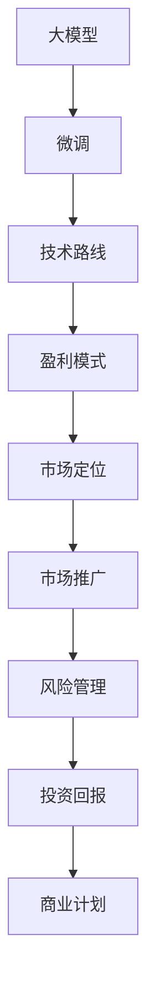

                 

# 商业模式选择：大模型创业的路线选择

> 关键词：商业模式,大模型创业,创业路线,市场定位,技术路线,盈利模式,市场推广,风险管理,投资回报

## 1. 背景介绍

### 1.1 问题由来

在人工智能（AI）尤其是深度学习领域，大模型（Large Models）的快速发展已经引起了业界的广泛关注。无论是学术界还是产业界，都正在探索如何利用这些大规模模型创造商业价值。然而，大模型创业面临着诸多挑战，包括市场定位、技术路线、盈利模式、市场推广、风险管理等。本文将深入分析这些核心问题，并提出实用的商业模式建议，为希望进入这一领域的企业和创业者提供指导。

### 1.2 问题核心关键点

1. **市场定位**：明确目标市场，识别潜在客户和需求，制定市场进入策略。
2. **技术路线**：选择合适的大模型和微调方法，确保技术先进性和实用性。
3. **盈利模式**：基于商业模式设计，确定价格策略、收费模式和服务类型。
4. **市场推广**：制定有效的市场推广策略，提升品牌知名度和市场占有率。
5. **风险管理**：识别和评估潜在风险，制定风险应对策略，确保商业计划的稳健性。

这些核心关键点将指导创业者在大模型创业的各个环节做出明智决策。

### 1.3 问题研究意义

深入分析大模型创业的商业模式，对于推动AI技术在产业界的实际应用具有重要意义：

1. **促进技术转化**：明确商业目标和技术需求，加速AI技术的落地和应用。
2. **提升商业价值**：优化盈利模式和市场推广策略，提高企业的市场竞争力。
3. **规避风险**：提前识别并应对潜在风险，保障商业计划的稳健性。
4. **激发创新**：提供商业模式设计的具体策略和方法，激发创业者的创新思维。

## 2. 核心概念与联系

### 2.1 核心概念概述

- **大模型（Large Models）**：指基于深度学习技术，具有数十亿至数百亿参数的模型，如BERT、GPT-3等。这些模型通常用于自然语言处理（NLP）、计算机视觉（CV）等任务。
- **微调（Fine-Tuning）**：指在大模型的基础上，针对特定任务（如情感分析、机器翻译等）进行训练，以提升模型在该任务上的表现。
- **商业模式（Business Model）**：企业通过特定的产品、服务和价格策略，创造并获取价值的方式。
- **技术路线（Technology Route）**：企业基于当前的技术趋势和资源条件，选择并实施的技术开发和应用策略。
- **盈利模式（Revenue Model）**：企业通过特定的产品、服务、渠道和定价策略，实现盈利的方式。

这些核心概念之间的关系可以由以下Mermaid流程图来展示：



这个流程图展示了大模型创业的各个环节和它们之间的逻辑联系：

1. 大模型是创业的基础，通过微调提升其适用性。
2. 技术路线确定具体的技术开发和应用策略。
3. 盈利模式决定企业的商业价值实现方式。
4. 市场定位明确目标客户和需求，制定市场进入策略。
5. 市场推广提升品牌知名度和市场占有率。
6. 风险管理识别并应对潜在风险，确保商业计划的稳健性。
7. 投资回报评估商业计划的可行性和经济性。

这些概念共同构成了大模型创业的框架，使得企业在各个环节可以系统地进行规划和实施。

## 3. 核心算法原理 & 具体操作步骤
### 3.1 算法原理概述

大模型创业的核心在于如何选择合适的技术路线和商业模式，以最大化商业价值。以下是这一过程的算法原理：

1. **数据准备**：收集和预处理数据，构建模型训练和验证所需的数据集。
2. **模型选择**：选择合适的大模型，考虑其性能、通用性和特定任务适配性。
3. **微调优化**：针对特定任务进行微调，优化模型性能。
4. **技术路线设计**：设计技术开发和应用策略，确保技术先进性和实用性。
5. **盈利模式确定**：根据市场需求和技术特点，确定价格策略、收费模式和服务类型。
6. **市场定位分析**：识别目标客户和需求，制定市场进入策略。
7. **市场推广策略**：设计有效的市场推广策略，提升品牌知名度和市场占有率。
8. **风险管理规划**：识别并评估潜在风险，制定风险应对策略。
9. **投资回报评估**：评估商业计划的可行性和经济性，确保投资回报。

### 3.2 算法步骤详解

#### 3.2.1 数据准备

数据准备是大模型创业的第一步，需要确保数据的质量和多样性：

1. **数据收集**：从公开数据集或合作机构获取数据，如GPT-3训练所需的10GB文本数据。
2. **数据预处理**：清洗和标注数据，确保数据质量和可用性。例如，对于情感分析任务，需要对数据进行情感标注。

#### 3.2.2 模型选择

选择合适的模型是创业成功的关键：

1. **评估模型性能**：基于现有数据集评估不同模型的性能，选择性能最优的模型。
2. **考虑通用性和特定任务适配性**：评估模型的通用性和特定任务的适配性，确保模型能够覆盖目标市场的需求。

#### 3.2.3 微调优化

微调优化是提升模型性能的有效手段：

1. **选择合适的微调方法**：如针对特定任务进行微调，或使用参数高效微调技术。
2. **优化超参数**：调整学习率、批次大小等超参数，确保模型训练效果。
3. **验证和调优**：使用验证集评估模型性能，进行必要的调优和优化。

#### 3.2.4 技术路线设计

技术路线设计是确保技术先进性和实用性的关键：

1. **选择合适的技术平台**：如TensorFlow、PyTorch等，确保技术平台具有良好的开发和部署能力。
2. **设计技术开发策略**：确定技术开发的关键路径和里程碑，确保技术开发进度。
3. **应用策略制定**：确定模型在实际应用中的部署方式，如云服务、本地部署等。

#### 3.2.5 盈利模式确定

盈利模式是确保商业价值实现的关键：

1. **确定价格策略**：基于模型性能和市场需求，制定合理的价格策略。
2. **选择合适的收费模式**：如按使用量收费、按结果收费等，确保盈利模式的可持续性。
3. **设计服务类型**：确定服务的具体类型，如API服务、定制服务等，确保服务的多样性。

#### 3.2.6 市场定位分析

市场定位分析是确定目标客户和需求的关键：

1. **识别目标客户**：分析市场需求，确定目标客户的特征和需求。
2. **制定市场进入策略**：根据目标客户的需求，制定市场进入策略，如B2B、B2C等。

#### 3.2.7 市场推广策略

市场推广策略是提升品牌知名度和市场占有率的关键：

1. **设计推广策略**：选择有效的推广渠道，如社交媒体、搜索引擎营销等。
2. **推广内容制作**：制作有吸引力的推广内容，如产品介绍视频、案例分析等。
3. **推广效果评估**：评估推广效果，进行必要的调整和优化。

#### 3.2.8 风险管理规划

风险管理是确保商业计划稳健性的关键：

1. **识别潜在风险**：分析项目中的潜在风险，如技术风险、市场风险等。
2. **制定风险应对策略**：制定应对策略，如备份数据、技术迭代等。
3. **风险监控和评估**：定期监控和评估风险，确保风险可控。

#### 3.2.9 投资回报评估

投资回报评估是确保商业计划可行性的关键：

1. **评估投资成本**：计算项目启动和运营所需的成本。
2. **评估收益潜力**：基于市场需求和技术特点，评估项目的收益潜力。
3. **制定投资回报计划**：制定详细的投资回报计划，确保商业计划的可行性和经济性。

### 3.3 算法优缺点

大模型创业的算法存在以下优缺点：

#### 3.3.1 优点

1. **技术先进性**：大模型和微调技术通常具有先进的技术特性，能够提升产品的竞争力。
2. **市场需求大**：随着AI技术的普及，市场对大模型的需求不断增长，提供商业机会。
3. **模式多样性**：有多种盈利模式可供选择，如按使用量收费、按结果收费等，灵活性较高。

#### 3.3.2 缺点

1. **高技术门槛**：需要较高的技术门槛，包括数据准备、模型训练等，对企业技术能力要求较高。
2. **市场竞争激烈**：大模型市场竞争激烈，需要具备较强的市场竞争力和创新能力。
3. **风险管理复杂**：涉及的技术和市场风险较多，需要综合考虑，制定全面的风险管理策略。

### 3.4 算法应用领域

大模型创业技术广泛适用于多个领域，如自然语言处理、计算机视觉、智能推荐等。以下是几个典型应用领域：

1. **智能客服**：利用大模型进行智能对话，提升客户体验和服务效率。
2. **智能推荐系统**：基于用户行为和偏好，推荐个性化的产品和服务。
3. **金融科技**：利用大模型进行风险评估、欺诈检测等，提升金融服务的安全性和效率。
4. **医疗健康**：利用大模型进行医学影像分析、疾病预测等，提升医疗服务的精准性和效率。

## 4. 数学模型和公式 & 详细讲解 & 举例说明

### 4.1 数学模型构建

大模型创业的数学模型主要基于经济学和运营管理的理论，以下是核心模型的构建：

1. **成本模型**：计算项目的启动和运营成本，确保商业计划的可行性。
2. **收益模型**：基于市场需求和模型性能，计算项目的收益潜力。
3. **风险模型**：基于项目涉及的技术和市场风险，计算风险发生的概率和影响。

### 4.2 公式推导过程

#### 4.2.1 成本模型

成本模型用于计算项目的启动和运营成本：

$$
\text{Cost} = C_{startup} + C_{operating} \times T
$$

其中：

- $C_{startup}$：项目启动成本。
- $C_{operating}$：项目运营成本。
- $T$：项目运营时间。

#### 4.2.2 收益模型

收益模型用于计算项目的收益潜力：

$$
\text{Revenue} = R_{base} + R_{additional} \times U
$$

其中：

- $R_{base}$：基本收益，如按使用量收费。
- $R_{additional}$：附加收益，如按结果收费。
- $U$：模型使用频率。

#### 4.2.3 风险模型

风险模型用于计算项目涉及的技术和市场风险：

$$
\text{Risk} = \sum_{i=1}^n P_i \times R_i
$$

其中：

- $P_i$：第$i$个风险发生的概率。
- $R_i$：第$i$个风险的影响程度。

### 4.3 案例分析与讲解

#### 4.3.1 智能推荐系统案例

某智能推荐系统公司使用GPT-3作为核心模型，针对电商平台的个性化推荐需求进行微调：

1. **数据准备**：收集电商平台的商品信息和用户行为数据，进行数据清洗和标注。
2. **模型选择**：选择GPT-3作为推荐模型的基础。
3. **微调优化**：针对推荐任务进行微调，优化模型性能。
4. **技术路线设计**：设计基于TensorFlow的推荐系统架构，确保技术先进性和实用性。
5. **盈利模式确定**：采用按使用量收费的盈利模式，确保盈利模式的可持续性。
6. **市场定位分析**：针对电商平台的用户需求，制定B2B的市场进入策略。
7. **市场推广策略**：在电商平台的推荐功能中嵌入广告，进行推广。
8. **风险管理规划**：监控推荐系统的稳定性和安全性，制定应对策略。
9. **投资回报评估**：计算项目启动和运营成本，评估项目的收益潜力。

通过以上步骤，该智能推荐系统公司成功在电商平台上部署了基于GPT-3的推荐系统，实现了显著的商业价值。

## 5. 项目实践：代码实例和详细解释说明

### 5.1 开发环境搭建

大模型创业的开发环境搭建需要考虑技术栈和工具的选择：

1. **选择编程语言**：Python是人工智能领域的主流编程语言，适合进行大模型的开发和微调。
2. **选择开发框架**：TensorFlow、PyTorch等深度学习框架，适合进行大模型的训练和部署。
3. **选择云平台**：AWS、Google Cloud等云平台，提供强大的计算资源和部署环境。

### 5.2 源代码详细实现

以下是一个基于TensorFlow进行大模型微调的Python代码示例：

```python
import tensorflow as tf
from transformers import TFAutoModelForSequenceClassification, AutoTokenizer
from transformers import Trainer, TrainingArguments

# 加载模型和分词器
model = TFAutoModelForSequenceClassification.from_pretrained('gpt-3')
tokenizer = AutoTokenizer.from_pretrained('gpt-3')

# 准备数据
train_dataset = ...

# 定义模型训练参数
training_args = TrainingArguments(
    output_dir="./results",
    per_device_train_batch_size=8,
    per_device_eval_batch_size=16,
    num_train_epochs=3,
    logging_steps=500,
    save_steps=500,
    evaluation_strategy="epoch",
    load_best_model_at_end=True,
    metric_for_best_model="acc",
)

# 定义模型训练器
trainer = Trainer(
    model=model,
    args=training_args,
    train_dataset=train_dataset,
    eval_dataset=val_dataset,
    compute_metrics=compute_metrics
)

# 训练模型
trainer.train()
```

### 5.3 代码解读与分析

#### 5.3.1 数据准备

数据准备是模型训练的基础，需要确保数据的质量和多样性：

1. **数据收集**：从公开数据集或合作机构获取数据，如电商平台的商品信息和用户行为数据。
2. **数据清洗**：清洗和标注数据，确保数据质量和可用性。例如，对于推荐任务，需要对数据进行用户行为和商品信息的标注。

#### 5.3.2 模型选择

选择合适的模型是创业成功的关键：

1. **评估模型性能**：基于现有数据集评估不同模型的性能，选择性能最优的模型。
2. **考虑通用性和特定任务适配性**：评估模型的通用性和特定任务的适配性，确保模型能够覆盖目标市场的需求。

#### 5.3.3 微调优化

微调优化是提升模型性能的有效手段：

1. **选择合适的微调方法**：如针对特定任务进行微调，或使用参数高效微调技术。
2. **优化超参数**：调整学习率、批次大小等超参数，确保模型训练效果。
3. **验证和调优**：使用验证集评估模型性能，进行必要的调优和优化。

## 6. 实际应用场景

### 6.1 智能客服

智能客服系统是利用大模型进行智能对话的典型应用场景：

1. **数据准备**：收集历史客服对话记录，进行数据清洗和标注。
2. **模型选择**：选择BERT作为智能对话模型的基础。
3. **微调优化**：针对智能对话任务进行微调，优化模型性能。
4. **技术路线设计**：设计基于TensorFlow的智能客服系统架构，确保技术先进性和实用性。
5. **盈利模式确定**：采用按使用量收费的盈利模式，确保盈利模式的可持续性。
6. **市场定位分析**：针对客服系统需求，制定B2B的市场进入策略。
7. **市场推广策略**：在企业内部推广智能客服系统，进行市场推广。
8. **风险管理规划**：监控智能客服系统的稳定性和安全性，制定应对策略。
9. **投资回报评估**：计算项目启动和运营成本，评估项目的收益潜力。

通过以上步骤，企业可以成功部署基于BERT的智能客服系统，提升客户体验和服务效率。

## 7. 工具和资源推荐

### 7.1 学习资源推荐

为了帮助开发者系统掌握大模型创业的理论基础和实践技巧，这里推荐一些优质的学习资源：

1. **《深度学习》课程**：斯坦福大学开设的深度学习课程，覆盖深度学习的基础知识和前沿技术。
2. **《TensorFlow教程》**：Google提供的TensorFlow教程，涵盖TensorFlow的基本使用和高级应用。
3. **《PyTorch教程》**：PyTorch官网提供的PyTorch教程，涵盖PyTorch的基本使用和深度学习模型开发。
4. **《自然语言处理》书籍**：清华大学出版社出版的自然语言处理书籍，涵盖NLP的基础知识和实际应用。
5. **《商业智能》书籍**：《商业智能入门与实战》，涵盖商业智能的基本概念和实际应用。

通过这些资源的学习，相信你一定能够快速掌握大模型创业的理论基础和实践技巧。

### 7.2 开发工具推荐

高效的开发离不开优秀的工具支持。以下是几款用于大模型创业开发的常用工具：

1. **TensorFlow**：基于Python的开源深度学习框架，灵活动态的计算图，适合快速迭代研究。
2. **PyTorch**：基于Python的开源深度学习框架，动态计算图，灵活性较高。
3. **Transformers库**：HuggingFace开发的NLP工具库，集成了众多SOTA语言模型，适合进行NLP任务的开发。
4. **Jupyter Notebook**：开源的交互式计算环境，支持Python编程和数据可视化，适合进行数据分析和模型开发。
5. **GitHub**：GitHub平台，提供代码托管和协作功能，适合进行版本控制和团队协作。

合理利用这些工具，可以显著提升大模型创业的开发效率，加快创新迭代的步伐。

### 7.3 相关论文推荐

大模型创业技术的发展离不开学界的持续研究。以下是几篇奠基性的相关论文，推荐阅读：

1. **《深度学习》（Deep Learning）**：Goodfellow等人的深度学习书籍，涵盖深度学习的基础知识和前沿技术。
2. **《Transformer》论文**：Vaswani等人的Transformer论文，介绍Transformer模型及其在NLP领域的应用。
3. **《BERT: Pre-training of Deep Bidirectional Transformers for Language Understanding》**：Devlin等人的BERT论文，介绍BERT模型及其在NLP领域的应用。
4. **《GPT-3》论文**：Brown等人的GPT-3论文，介绍GPT-3模型及其在NLP领域的应用。
5. **《Parameter-Efficient Transfer Learning for NLP》**：Howard等人的论文，介绍参数高效微调技术，用于减少微调过程中模型的参数量。

这些论文代表了大模型创业技术的发展脉络，通过学习这些前沿成果，可以帮助研究者把握学科前进方向，激发更多的创新灵感。

## 8. 总结：未来发展趋势与挑战

### 8.1 研究成果总结

本文对大模型创业的商业模式进行了全面系统的介绍。首先阐述了市场定位、技术路线、盈利模式、市场推广、风险管理等核心问题，明确了大模型创业的方向和目标。其次，从原理到实践，详细讲解了技术实施的具体步骤，给出了大模型创业的完整代码实例。最后，本文探讨了大模型创业在智能客服、智能推荐等领域的实际应用场景，展示了其广阔的市场前景。

通过本文的系统梳理，可以看到，大模型创业技术正在成为人工智能领域的核心技术，引领AI技术在多个行业领域的实际应用。未来，伴随技术的不断演进和应用场景的拓展，大模型创业必将在商业化进程中发挥更大的作用，为各行各业带来深刻的变革。

### 8.2 未来发展趋势

展望未来，大模型创业技术将呈现以下几个发展趋势：

1. **技术路线多样化**：随着技术的发展，将出现更多适用于特定场景的技术路线，如基于Transformer的微调、基于知识图谱的推荐等。
2. **盈利模式多元化**：随着市场需求的拓展，将出现更多元的盈利模式，如按效果收费、按服务收费等。
3. **市场推广智能化**：通过AI技术进行市场推广，提升推广效果和效率。
4. **风险管理智能化**：利用AI技术进行风险评估和监控，提升风险管理水平。
5. **商业价值最大化**：通过技术创新和市场推广，最大化商业价值，提升企业竞争力。

以上趋势凸显了大模型创业技术的广阔前景。这些方向的探索发展，必将进一步提升大模型创业的商业价值和技术应用水平，为人类社会的数字化转型注入新的动力。

### 8.3 面临的挑战

尽管大模型创业技术已经取得了显著进展，但在迈向商业化的过程中，仍面临诸多挑战：

1. **技术门槛高**：需要较高的技术门槛，包括数据准备、模型训练等，对企业技术能力要求较高。
2. **市场竞争激烈**：大模型市场竞争激烈，需要具备较强的市场竞争力和创新能力。
3. **风险管理复杂**：涉及的技术和市场风险较多，需要综合考虑，制定全面的风险管理策略。
4. **商业模式不成熟**：大模型创业的商业模式尚不成熟，需要进一步探索和优化。
5. **数据隐私和伦理问题**：大模型创业涉及大量的用户数据，需要解决数据隐私和伦理问题。

正视大模型创业面临的这些挑战，积极应对并寻求突破，将是大模型创业走向成熟的重要保障。

### 8.4 研究展望

面对大模型创业面临的挑战，未来的研究需要在以下几个方面寻求新的突破：

1. **降低技术门槛**：通过技术创新和工具优化，降低大模型创业的技术门槛，提升企业的技术能力。
2. **探索新盈利模式**：结合市场需求和技术特点，探索新的盈利模式，提升企业的商业模式竞争力。
3. **加强风险管理**：利用AI技术进行风险评估和监控，提升风险管理水平，保障商业计划的稳健性。
4. **保护数据隐私**：制定严格的数据隐私保护措施，确保用户数据的安全和隐私。
5. **促进伦理规范**：建立伦理导向的商业规范，确保模型的安全性、可解释性和公平性。

这些研究方向的探索，必将引领大模型创业技术迈向更高的台阶，为构建安全、可靠、可解释、可控的智能系统铺平道路。面向未来，大模型创业技术还需要与其他人工智能技术进行更深入的融合，如知识表示、因果推理、强化学习等，多路径协同发力，共同推动人工智能技术在各行各业的落地应用。

## 9. 附录：常见问题与解答

**Q1：大模型创业的技术路线应该如何选择？**

A: 大模型创业的技术路线选择需要考虑多个因素，包括市场需求、技术先进性和实用性：

1. **市场需求**：选择符合市场需求的模型，如自然语言处理、计算机视觉等。
2. **技术先进性**：选择技术先进的模型，如最新的Transformer模型。
3. **实用性**：选择能够直接应用于实际问题的模型，如已经经过大规模预训练的BERT模型。

**Q2：大模型创业的盈利模式应该如何设计？**

A: 大模型创业的盈利模式设计需要考虑市场需求和成本结构：

1. **按使用量收费**：按模型使用的次数或时长收费，适合简单模型和低成本场景。
2. **按结果收费**：按模型输出的结果数量或质量收费，适合复杂模型和高价值场景。
3. **定制服务**：根据客户需求进行定制化服务，提供个性化解决方案。

**Q3：大模型创业的风险管理应该如何进行？**

A: 大模型创业的风险管理需要全面评估技术、市场和运营风险：

1. **技术风险管理**：监控模型性能和稳定性，制定技术迭代和升级计划。
2. **市场风险管理**：监控市场需求变化，制定市场进入和退出策略。
3. **运营风险管理**：监控运营成本和效率，制定成本控制和效率提升计划。

**Q4：大模型创业的市场推广应该如何进行？**

A: 大模型创业的市场推广需要利用多渠道和多样化手段：

1. **线上推广**：通过社交媒体、搜索引擎营销等方式，提升品牌知名度。
2. **线下推广**：参加行业展会、举办技术讲座等，直接接触潜在客户。
3. **合作推广**：与合作伙伴进行联合推广，扩大市场覆盖范围。

**Q5：大模型创业的投资回报应该如何评估？**

A: 大模型创业的投资回报评估需要全面考虑成本和收益：

1. **成本评估**：计算项目启动和运营成本。
2. **收益评估**：基于市场需求和技术特点，评估项目的收益潜力。
3. **投资回报计划**：制定详细的投资回报计划，确保商业计划的可行性和经济性。

通过这些策略和方法，大模型创业企业可以制定全面的商业计划，确保技术创新和市场推广的顺利进行，实现商业价值的最大化。

---

作者：禅与计算机程序设计艺术 / Zen and the Art of Computer Programming

