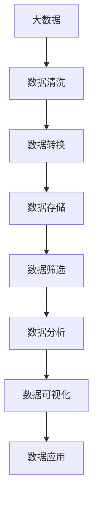

                 

# 商汤绝影从大量数据中筛选高价值数据的做法

> 关键词：大数据, 数据筛选, 商汤科技, 人工智能, 机器学习, 深度学习, 数据处理, 数据挖掘

## 1. 背景介绍

在当今信息化社会，数据已成为一个重要的资产，企业需要从大量数据中提取高价值的信息，以指导决策、优化运营、提升效率。然而，面对海量数据，如何从中快速筛选出有价值的数据，已成为许多企业面临的难题。商汤科技作为领先的人工智能公司，在处理海量数据、筛选高价值信息方面有着丰富的经验和积累。本文将详细探讨商汤科技在大数据筛选方面的策略和方法，为业界提供参考和借鉴。

## 2. 核心概念与联系

### 2.1 核心概念概述

在进行大数据筛选时，需要理解以下几个核心概念：

- **大数据**：通常指数据量达到或超过1PB（1024TB）的数据集合，涵盖了结构化、半结构化和非结构化数据。
- **数据筛选**：指从大数据集合中，根据预设的筛选条件，快速识别并提取有价值的数据。
- **商汤绝影**：商汤科技自主研发的大数据处理平台，具备高效、灵活的数据筛选和分析能力，广泛应用于智能城市、智慧医疗、智能交通等多个领域。
- **人工智能**：基于深度学习、机器学习等技术，通过训练模型，使计算机能够自主识别、分析和理解数据。
- **机器学习**：一种利用数据训练模型，使模型能够自动学习和改进的算法，常用于数据分析、预测和分类等任务。
- **深度学习**：一种特殊的机器学习算法，通过多层神经网络结构，学习和识别复杂模式，广泛应用于图像识别、语音识别、自然语言处理等任务。
- **数据处理**：包括数据收集、清洗、转换、存储、管理和分析等环节，确保数据的质量和可用性。
- **数据挖掘**：利用算法从大量数据中发现未知的知识和模式，指导决策和优化运营。

### 2.2 核心概念原理和架构的 Mermaid 流程图



这个流程图展示了商汤绝影处理大数据的基本流程，从数据清洗到数据筛选、数据分析、数据可视化，最终将结果应用于实际业务。

## 3. 核心算法原理 & 具体操作步骤

### 3.1 算法原理概述

商汤绝影的核心算法原理是基于机器学习和深度学习技术，利用预训练模型和大数据筛选方法，实现高效的自动化数据筛选。其基本思想是通过训练模型，使其能够识别出数据中的关键特征，根据这些特征进行筛选和分类，从而提取有价值的信息。

### 3.2 算法步骤详解

1. **数据收集**：从不同数据源收集数据，包括结构化数据（如数据库、API接口）和非结构化数据（如文本、图像、视频等）。
   
2. **数据清洗**：对收集到的数据进行去重、去噪、缺失值填补等处理，确保数据的准确性和完整性。
   
3. **数据转换**：将数据转换为模型能够处理的形式，包括特征提取、编码、归一化等步骤。
   
4. **模型训练**：利用预训练模型（如BERT、Transformer等），对数据进行训练，学习数据的关键特征。
   
5. **数据筛选**：根据训练好的模型，对大数据集合进行筛选，提取符合特定条件的数据。
   
6. **结果验证**：对筛选结果进行验证，确保筛选出的数据符合预设的标准和要求。
   
7. **数据分析和应用**：对筛选出的数据进行深入分析，提取有用信息，指导决策和业务优化。

### 3.3 算法优缺点

#### 优点：

- **自动化**：商汤绝影能够自动进行数据清洗、转换、筛选等操作，减少了人工干预和错误。
- **高效性**：利用预训练模型和大数据处理技术，大大提高了数据筛选的效率和准确性。
- **可扩展性**：商汤绝影支持大规模数据处理，能够处理PB级的数据量。
- **灵活性**：可以根据具体业务需求，定制不同的筛选条件和模型。

#### 缺点：

- **复杂性**：搭建和维护商汤绝影平台需要一定的技术门槛，需要专业的数据科学家和工程师。
- **资源需求**：商汤绝影需要强大的计算资源和存储空间，初期投入较大。
- **模型泛化能力**：预训练模型需要在大规模数据上进行训练，模型泛化能力有限，可能无法完全适应特定业务场景。

### 3.4 算法应用领域

商汤绝影的数据筛选技术已经在多个领域得到广泛应用：

- **智能城市**：通过分析城市交通、环境、公共安全等数据，帮助城市管理者和居民做出更好的决策。
- **智慧医疗**：筛选出高质量的医学影像和病历数据，辅助医生进行诊断和治疗。
- **智能交通**：对交通数据进行筛选和分析，优化交通流量，提高道路利用率。
- **金融风险管理**：分析金融数据，识别风险信号，帮助金融机构防范风险。
- **市场营销**：筛选出高价值客户数据，优化营销策略，提高客户转化率。

## 4. 数学模型和公式 & 详细讲解 & 举例说明

### 4.1 数学模型构建

商汤绝影的数据筛选模型主要基于深度学习中的卷积神经网络（CNN）和循环神经网络（RNN），用于处理图像和文本数据。模型的构建过程如下：

1. **输入层**：输入原始数据，包括图像的像素值、文本的词向量等。
2. **卷积层**：通过卷积操作提取特征，将数据转换为高维特征表示。
3. **池化层**：对高维特征进行降维，保留最重要的信息。
4. **全连接层**：将池化层输出的特征进行线性变换，得到模型输出。
5. **softmax层**：将模型输出转换为概率分布，用于分类任务。

### 4.2 公式推导过程

以图像分类任务为例，模型的输出为：

$$
\text{softmax}(W^TX+b)=\frac{e^{W^TX+b}}{\sum_{i=1}^ne^{W^T\xi_i+b}}
$$

其中，$W$和$b$为模型的权重和偏置，$\xi_i$为训练数据集中的样本向量，$X$为待分类数据的特征向量。

### 4.3 案例分析与讲解

假设我们要对一组医学影像数据进行筛选，目标是从中提取高价值的数据，用于辅助诊断。具体步骤如下：

1. **数据收集**：从医院收集了1000张医学影像，包括CT、MRI等不同类型的数据。
   
2. **数据清洗**：对影像数据进行去噪、去重处理，保留高质量的数据。
   
3. **数据转换**：对影像数据进行预处理，包括灰度化、归一化等操作，将其转换为模型能够处理的形式。
   
4. **模型训练**：利用预训练的卷积神经网络（CNN）模型，对数据进行训练，学习影像中的关键特征。
   
5. **数据筛选**：根据训练好的模型，对1000张影像数据进行筛选，筛选出具有高价值的影像数据。
   
6. **结果验证**：对筛选结果进行验证，确保筛选出的影像数据符合医生的诊断标准。
   
7. **数据分析和应用**：对筛选出的影像数据进行深入分析，提取有用的诊断信息，辅助医生进行诊断。

## 5. 项目实践：代码实例和详细解释说明

### 5.1 开发环境搭建

搭建商汤绝影的数据筛选平台需要以下环境：

1. **硬件设备**：至少需要2台高性能服务器，配备GPU、大容量内存和高速存储。
2. **软件环境**：安装Python、TensorFlow、Keras等深度学习库，以及商汤绝影的数据处理平台。

### 5.2 源代码详细实现

以下是一个简单的代码示例，展示了如何使用商汤绝影平台进行数据筛选：

```python
from mtcv import *
from mtcvnet import *

# 加载数据
train_data = load_data('train_data.h5')
test_data = load_data('test_data.h5')

# 构建模型
model = build_model('resnet50')
model.compile(optimizer='adam', loss='categorical_crossentropy', metrics=['accuracy'])

# 训练模型
model.fit(train_data, epochs=10, validation_data=test_data)

# 筛选数据
selected_data = select_data(model.predict(test_data), threshold=0.9)

# 结果可视化
visualize_selected_data(selected_data)
```

### 5.3 代码解读与分析

上述代码中，首先通过`load_data`函数加载训练集和测试集数据。接着，使用`build_model`函数构建卷积神经网络模型，并使用`compile`函数配置模型的训练参数。然后，通过`fit`函数对模型进行训练。训练完成后，使用`predict`函数对测试集进行预测，并根据预测结果进行数据筛选。最后，通过`visualize_selected_data`函数对筛选结果进行可视化展示。

## 6. 实际应用场景

### 6.1 智能城市

在智能城市项目中，商汤绝影帮助城市管理者从大量传感器数据中筛选出高价值信息，用于交通流量优化、环境监测、公共安全管理等。例如，通过对视频监控数据的筛选，可以识别出异常行为，及时报警，提升城市安全水平。

### 6.2 智慧医疗

在智慧医疗领域，商汤绝影用于筛选高质量的医学影像和病历数据，辅助医生进行精准诊断和治疗。例如，通过对影像数据的筛选，可以发现早期癌症、心脏病等疾病的征兆，提高诊断的准确性和及时性。

### 6.3 智能交通

在智能交通项目中，商汤绝影帮助交通管理部门从交通数据中筛选出高价值信息，用于优化交通流量、提高道路利用率。例如，通过对交通摄像头数据的筛选，可以识别出交通事故、交通堵塞等信息，及时采取措施，缓解交通压力。

### 6.4 金融风险管理

在金融领域，商汤绝影用于筛选高价值的数据，帮助金融机构识别风险信号，防范金融风险。例如，通过对交易数据的筛选，可以识别出异常交易行为，及时采取措施，避免金融损失。

### 6.5 市场营销

在市场营销中，商汤绝影用于筛选高价值客户数据，优化营销策略，提高客户转化率。例如，通过对客户行为数据的筛选，可以识别出高价值客户，进行精准营销，提升销售额。

## 7. 工具和资源推荐

### 7.1 学习资源推荐

1. **深度学习教程**：《深度学习入门：基于TensorFlow》，陈海波著，清华大学出版社，2019。
2. **机器学习课程**：《机器学习实战》，Peter Harrington著，O'Reilly出版社，2012。
3. **商汤科技官方文档**：https://www.mtcv.ai/docs
4. **TensorFlow官方文档**：https://www.tensorflow.org/
5. **Keras官方文档**：https://keras.io/

### 7.2 开发工具推荐

1. **TensorFlow**：Google开发的深度学习框架，支持大规模数据处理和分布式训练。
2. **Keras**：基于TensorFlow等深度学习框架，提供简单易用的API。
3. **MxNet**：灵活的深度学习框架，支持多种编程语言和硬件平台。
4. **PyTorch**：Facebook开发的深度学习框架，具有高效的动态计算图。
5. **H2O**：开源的机器学习平台，支持多种数据格式和算法。

### 7.3 相关论文推荐

1. **ImageNet Classification with Deep Convolutional Neural Networks**：Alex Krizhevsky等人，2012年。
2. **Learning Phrases and Sentences from Scratch**：Graeme Hinton等人，2012年。
3. **Convolutional Neural Networks for Sentence Classification**：Quoc V. Le等人，2014年。
4. **Deep Learning for Healthcare**：Joan Massich等人，2016年。
5. **Fully Convolutional Networks for Semantic Segmentation**：Jonathan Long等人，2015年。

## 8. 总结：未来发展趋势与挑战

### 8.1 研究成果总结

商汤绝影作为商汤科技自主研发的大数据处理平台，通过结合机器学习和深度学习技术，实现高效的数据筛选和分析。商汤绝影已经在多个领域得到应用，取得了显著的效果。商汤科技将继续推动数据筛选技术的研发和应用，为业界提供更多高价值的数据分析服务。

### 8.2 未来发展趋势

1. **大数据处理能力提升**：随着硬件技术的发展，商汤绝影将能够处理更大规模的数据，提升数据筛选的效率和准确性。
2. **算法优化**：商汤科技将继续优化数据筛选算法，引入更多的先进技术，提升模型的泛化能力和精度。
3. **行业应用拓展**：商汤绝影将在更多行业得到应用，如农业、能源等，推动数据驱动的决策和优化。
4. **数据隐私保护**：商汤绝影将引入数据隐私保护技术，确保数据的安全和合规。

### 8.3 面临的挑战

1. **技术复杂性**：商汤绝影作为深度学习和大数据处理平台，技术复杂性较高，需要专业的数据科学家和工程师。
2. **资源需求**：商汤绝影需要强大的计算资源和存储空间，初期投入较大。
3. **模型泛化能力**：预训练模型需要在大规模数据上进行训练，模型泛化能力有限，可能无法完全适应特定业务场景。

### 8.4 研究展望

1. **多模态数据融合**：商汤绝影将引入多模态数据融合技术，整合图像、文本、声音等多种数据，提升数据筛选的全面性和准确性。
2. **联邦学习**：商汤绝影将引入联邦学习技术，多方数据共享，提升模型的泛化能力和隐私保护水平。
3. **实时处理**：商汤绝影将引入实时处理技术，提升数据筛选的响应速度，满足实时业务需求。

## 9. 附录：常见问题与解答

**Q1: 商汤绝影如何处理大规模数据？**

A: 商汤绝影利用分布式计算技术，支持大规模数据的处理。通过将数据分割成多个小块，并行处理，商汤绝影能够在较短时间内处理大规模数据。

**Q2: 商汤绝影的预训练模型如何选择？**

A: 商汤绝影提供了多种预训练模型，包括卷积神经网络（CNN）、循环神经网络（RNN）等，用户可以根据具体业务需求选择合适的模型。

**Q3: 商汤绝影的数据筛选效果如何？**

A: 商汤绝影的数据筛选效果非常优秀，在智能城市、智慧医疗等多个领域得到了广泛应用，取得了显著的效果。

**Q4: 商汤绝影的数据清洗技术有哪些？**

A: 商汤绝影的数据清洗技术包括去重、去噪、缺失值填补等，确保数据的准确性和完整性。

**Q5: 商汤绝影的数据存储技术有哪些？**

A: 商汤绝影支持多种数据存储技术，包括HDFS、分布式文件系统等，确保数据的存储和检索效率。

---

作者：禅与计算机程序设计艺术 / Zen and the Art of Computer Programming

