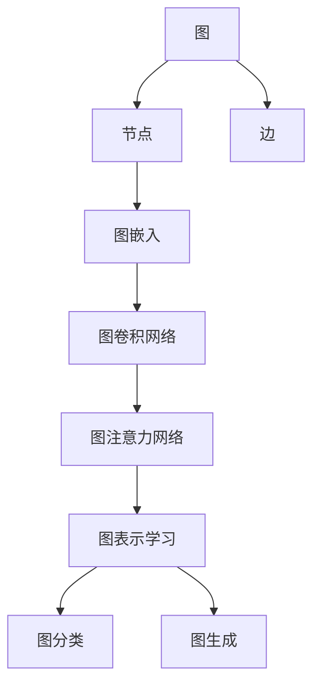

                 

# 图神经网络(Graph Neural Networks) - 原理与代码实例讲解

> 关键词：图神经网络,图深度学习,图卷积网络,图注意力网络,图表示学习,图分类,图生成

## 1. 背景介绍

### 1.1 问题由来
近年来，深度学习技术在自然语言处理、计算机视觉等领域取得了巨大成功。然而，对于具有复杂关联关系的数据，如社交网络、知识图谱等，传统的深度学习模型（如卷积神经网络CNN、循环神经网络RNN）无法有效建模和处理。为此，图神经网络(Graph Neural Network, GNN)应运而生，逐渐成为处理图数据的重要工具。

GNN能够通过图结构有效捕获节点之间的关系和拓扑结构，进而对节点进行有意义的特征表示，并对图进行分类、生成等任务。GNN的成功应用包括社交网络分析、药物分子设计、推荐系统、网络安全等领域。

### 1.2 问题核心关键点
图神经网络的核心在于如何设计合适的图结构，并利用图结构设计高效的神经网络模型，以便有效提取图数据的特征，并应用于图分类、图生成等任务。其中关键点包括：
- 图卷积操作：通过定义合适的图卷积算法，捕捉节点间的关系特征。
- 图注意力机制：通过引入注意力机制，强化节点间的信息交互。
- 层级结构：设计多层次的图网络结构，提升网络对图数据的建模能力。
- 参数共享：利用参数共享，提高网络的计算效率和泛化能力。

这些关键点共同构成了GNN的原理和架构，使其能够处理复杂图数据，并应用于各类图相关任务。

### 1.3 问题研究意义
研究图神经网络，对于拓展图深度学习的应用范围，提升图数据处理性能，加速图相关技术的产业化进程，具有重要意义：

1. 降低应用开发成本。利用成熟的大模型进行图神经网络训练，可以显著减少从头开发所需的数据、计算和人力等成本投入。
2. 提升模型效果。图神经网络能够更好地适应特定图数据，在图相关任务中取得更优表现。
3. 加速开发进度。standing on the shoulders of giants，图神经网络可以更快地完成任务适配，缩短开发周期。
4. 带来技术创新。图神经网络的架构设计促进了对图数据的深度理解，催生了图注意力、图生成等新的研究方向。
5. 赋能产业升级。图神经网络使得图相关技术更容易被各行各业所采用，为传统行业数字化转型升级提供新的技术路径。

## 2. 核心概念与联系

### 2.1 核心概念概述

为了更好地理解图神经网络，本节将介绍几个密切相关的核心概念：

- 图：由节点和边构成的数据结构，用于表示实体之间的关系。
- 节点和边：图的基本组成元素，节点表示实体，边表示实体间的关系。
- 图嵌入(Graph Embedding)：将图数据映射到低维向量空间，用于表示节点和图结构的特征。
- 图卷积网络(Graph Convolutional Network, GCN)：通过卷积操作，捕捉节点间的关系特征。
- 图注意力网络(Graph Attention Network, GAT)：通过注意力机制，强化节点间的信息交互。
- 图表示学习(Graph Representation Learning)：利用图结构对节点进行有效的特征表示。
- 图分类(Graph Classification)：对图数据进行分类任务，如社区检测、异常检测等。
- 图生成(Graph Generation)：生成新的图数据，如生成社交网络、知识图谱等。

这些核心概念之间的逻辑关系可以通过以下Mermaid流程图来展示：



这个流程图展示了几类图深度学习任务及其核心概念：

1. 图数据由节点和边构成，用于表示实体之间的关系。
2. 节点嵌入和边嵌入被映射到低维向量空间，用于表示节点和边的特征。
3. 图卷积网络通过卷积操作捕捉节点间的关系特征。
4. 图注意力网络通过注意力机制强化节点间的信息交互。
5. 图表示学习利用图结构对节点进行有效的特征表示。
6. 图分类任务对图数据进行分类，如社区检测、异常检测等。
7. 图生成任务生成新的图数据，如社交网络、知识图谱等。

这些概念共同构成了图神经网络的原理和应用框架，使其能够在复杂图数据上发挥强大的建模能力。通过理解这些核心概念，我们可以更好地把握图神经网络的工作原理和优化方向。

## 3. 核心算法原理 & 具体操作步骤
### 3.1 算法原理概述

图神经网络的核心思想是利用图结构，通过卷积和注意力等机制，对节点进行特征表示和图数据建模。其核心算法流程包括以下几个步骤：

1. 将图数据拆分为节点和边。
2. 利用卷积操作捕捉节点间的关系特征。
3. 引入注意力机制，强化节点间的信息交互。
4. 构建多层次的网络结构，提升对图数据的建模能力。
5. 在图数据上应用分类、生成等任务。

以下详细讲解各个步骤的实现原理和具体操作。

### 3.2 算法步骤详解

#### 3.2.1 图表示和数据预处理

首先，需要准备好图数据和相关预处理工具。常见的图数据包括社交网络、知识图谱、分子结构等。使用Neo4j、GEXF等工具可以方便地存储和导入图数据。

对于大规模图数据，通常使用邻接矩阵（Adjacency Matrix）和邻接表（Adjacency List）两种表示方式。邻接矩阵是二维数组，元素为0或1表示节点间是否存在边；邻接表则使用链表或哈希表存储每个节点的邻居节点。

#### 3.2.2 图卷积操作

图卷积操作通过卷积核（Convolutional Kernel）在图数据上进行操作，捕捉节点间的关系特征。图卷积的定义如下：

$$
H_{l+1}=\sigma(\hat{D}^{-\frac{1}{2}}\hat{A}\hat{D}^{-\frac{1}{2}}H_lW_l)
$$

其中 $H_l$ 表示第 $l$ 层的节点特征矩阵，$W_l$ 表示第 $l$ 层的卷积核矩阵，$\hat{A}$ 和 $\hat{D}$ 分别表示归一化的邻接矩阵和度数矩阵。

$\hat{A}$ 的定义如下：

$$
\hat{A}=\tilde{A}-D^{-\frac{1}{2}}\tilde{A}D^{-\frac{1}{2}}
$$

其中 $\tilde{A}$ 表示原始邻接矩阵，$D$ 表示度数矩阵，$D^{-\frac{1}{2}}$ 表示度数矩阵的平方根，用于归一化。

在实际实现中，通常使用Kaiming初始化法初始化卷积核矩阵 $W_l$，以保证稀疏矩阵的数值稳定。此外，为了加速计算，可以使用并行计算工具如PyTorch的DistributedDataParallel模块，对图数据进行分布式训练。

#### 3.2.3 图注意力机制

图注意力机制通过引入注意力权重，强化节点间的信息交互。在图注意力机制中，对于每个节点 $i$，其注意力权重由所有邻居节点 $j$ 的注意力向量 $\alpha_j$ 和节点 $i$ 的输入特征 $h_i^{l-1}$ 计算得出：

$$
\alpha_{ij}=\frac{\exp(\text{LeakyReLU}(\text{Attention }(h_j^{l-1},h_i^{l-1},e^{h_j^{l-1}h_i^{l-1}}))}{\sum_{k\in N_i}\exp(\text{LeakyReLU}(\text{Attention }(h_k^{l-1},h_i^{l-1},e^{h_k^{l-1}h_i^{l-1}}))}
$$

其中 $N_i$ 表示节点 $i$ 的邻居节点集合，$\text{Attention }$ 表示注意力函数，$\text{LeakyReLU}$ 表示带泄露的ReLU激活函数。

引入注意力机制后，节点 $i$ 的输出特征为：

$$
h_i^{l}=\sum_{j\in N_i}\alpha_{ij}h_j^{l-1}
$$

通过注意力机制，节点 $i$ 能够更加关注与其关系密切的邻居节点，从而提高对图数据的建模能力。

#### 3.2.4 多层次网络结构

为了增强网络对图数据的建模能力，通常设计多层次的网络结构。每一层网络可以捕捉不同规模的节点关系特征，从而提高网络的整体表现。

多层次网络结构可以采用递归的方式构建，即每层网络对前一层的输出进行卷积和注意力操作，得到新的节点特征矩阵。例如，对于GCN，定义第 $l$ 层的卷积操作为：

$$
h_i^{l}=\sum_{j\in N_i}\frac{1}{c}e^{h_j^{l-1}h_i^{l-1}}h_j^{l-1}
$$

其中 $c$ 表示归一化常数，用于保证节点特征矩阵的尺度。

多层次网络结构的实现可以使用循环神经网络（RNN）或变分自动编码器（VAE）等框架，对图数据进行递归操作。

#### 3.2.5 任务应用

在构建好图神经网络后，即可在图数据上应用分类、生成等任务。以图分类为例，首先对每个节点进行特征提取，然后将节点特征矩阵作为输入，应用全连接层进行分类：

$$
\hat{y}=\sigma(H_LW_{out})
$$

其中 $H_L$ 表示最后一层网络输出的节点特征矩阵，$W_{out}$ 表示输出层的权重矩阵。

以上步骤详细介绍了图神经网络的核心算法流程，通过卷积和注意力等机制，有效提取图数据的特征，并在图数据上应用分类、生成等任务。

### 3.3 算法优缺点

图神经网络在处理图数据方面具有以下优点：

1. 能够有效建模节点间的关系特征。图神经网络通过卷积和注意力等机制，捕捉节点间的关系特征，提升对图数据的建模能力。
2. 具有良好的可扩展性。图神经网络能够处理大规模图数据，同时具有较好的可扩展性。
3. 能够处理复杂图数据。图神经网络能够处理具有复杂结构的数据，如图数据、知识图谱等。
4. 参数共享能力强。图神经网络利用参数共享，提高网络的计算效率和泛化能力。

同时，图神经网络也存在一些局限性：

1. 训练复杂度较高。由于图数据的稀疏性，图神经网络的训练复杂度较高，需要大量时间和计算资源。
2. 计算复杂度较高。图神经网络需要对每个节点进行卷积和注意力操作，计算复杂度较高。
3. 泛化能力较弱。由于图数据的特殊性，图神经网络在泛化能力方面存在一定局限。

尽管存在这些局限性，但图神经网络在处理图数据方面已经取得了显著进展，成为处理图数据的重要工具。未来，相关研究将继续关注图神经网络的训练和计算效率问题，提高其在大规模图数据上的性能表现。

### 3.4 算法应用领域

图神经网络已经在多个领域得到了广泛应用，覆盖了从社交网络分析到药物分子设计等多个方面，具体应用如下：

- 社交网络分析：利用图神经网络对社交网络进行社区检测、异常检测等任务，提升对社交网络的理解能力。
- 推荐系统：通过图神经网络对用户行为数据进行建模，推荐合适的商品或服务。
- 知识图谱：利用图神经网络对知识图谱进行实体关系推理，提升知识图谱的构建和应用能力。
- 药物分子设计：利用图神经网络对药物分子结构进行优化，提升药物设计的效率和效果。
- 网络安全：通过图神经网络对网络攻击数据进行建模，预测和防范网络攻击。
- 图像分割：利用图神经网络对图像进行分割和识别，提升图像处理能力。

除了上述这些经典应用外，图神经网络还在地理信息分析、交通网络优化、语音识别等多个领域展现出广阔的应用前景，为图数据处理技术带来了新的突破。

## 4. 数学模型和公式 & 详细讲解 & 举例说明

### 4.1 数学模型构建

本节将使用数学语言对图神经网络进行更加严格的刻画。

假设图数据 $G=(V,E)$ 包含 $N$ 个节点和 $M$ 条边，其中 $V$ 表示节点集合，$E$ 表示边集合。节点特征矩阵为 $H_0 \in \mathbb{R}^{N \times F_0}$，边特征矩阵为 $A_0 \in \mathbb{R}^{M \times F_0}$。

定义节点 $i$ 的邻居节点集合为 $N_i$，度数矩阵为 $D \in \mathbb{R}^{N \times N}$，邻接矩阵为 $A \in \mathbb{R}^{N \times N}$，其中 $A_{ij}=1$ 表示节点 $i$ 和节点 $j$ 之间存在边。

定义图神经网络的卷积核矩阵为 $W_l \in \mathbb{R}^{F_{l-1} \times F_l}$，注意力矩阵为 $\alpha \in \mathbb{R}^{N \times N}$，输出特征矩阵为 $H_l \in \mathbb{R}^{N \times F_l}$。

图神经网络的数学模型可以表示为：

$$
H_l=\sigma(\hat{D}^{-\frac{1}{2}}\hat{A}\hat{D}^{-\frac{1}{2}}H_{l-1}W_l)
$$

其中 $\sigma$ 表示激活函数，通常采用ReLU或LeakyReLU等。

### 4.2 公式推导过程

以图卷积网络（GCN）为例，推导卷积操作的计算公式。

GCN通过卷积核 $W_l$ 捕捉节点间的关系特征，定义卷积操作为：

$$
h_i^l=\sum_{j\in N_i}\frac{1}{c}e^{h_j^{l-1}h_i^{l-1}}h_j^{l-1}
$$

其中 $c$ 表示归一化常数，用于保证节点特征矩阵的尺度。

定义归一化邻接矩阵 $\hat{A}$ 和归一化度数矩阵 $\hat{D}$，根据邻接矩阵和度数矩阵的定义，计算得到：

$$
\hat{A}=\tilde{A}-D^{-\frac{1}{2}}\tilde{A}D^{-\frac{1}{2}}
$$

$$
\hat{D}=D^{-\frac{1}{2}}
$$

将卷积操作和注意力机制结合，得到图卷积网络（GCN）的数学模型：

$$
H_l=\sigma(\hat{D}^{-\frac{1}{2}}\hat{A}\hat{D}^{-\frac{1}{2}}H_{l-1}W_l)
$$

其中 $W_l$ 表示卷积核矩阵，$\sigma$ 表示激活函数，通常采用ReLU或LeakyReLU等。

通过上述推导，我们可以更深刻地理解GCN的数学模型，并应用于图数据的建模和特征提取。

### 4.3 案例分析与讲解

以图分类任务为例，对GCN的模型进行详细分析。

在图分类任务中，需要根据图数据的结构特征，对图进行分类。以社交网络社区检测为例，社交网络节点之间存在复杂的关系，如好友、工作等，需要通过图神经网络对这些复杂关系进行建模，并对社交网络进行社区检测。

具体来说，社交网络可以表示为一个图数据 $G=(V,E)$，其中 $V$ 表示用户集合，$E$ 表示用户之间的关系集合。对于每个用户，可以定义其特征表示 $h_v \in \mathbb{R}^{d_v}$，表示用户的属性特征。

GCN可以对社交网络进行建模，首先定义用户之间的邻接矩阵 $A \in \mathbb{R}^{N \times N}$，其中 $A_{ij}=1$ 表示用户 $i$ 和用户 $j$ 之间存在关系。

定义用户之间的邻接矩阵 $A$ 和度数矩阵 $D$，计算得到归一化邻接矩阵 $\hat{A}$ 和归一化度数矩阵 $\hat{D}$，然后将用户特征矩阵 $H_0 \in \mathbb{R}^{N \times d_v}$ 作为初始输入，应用GCN模型进行多次卷积操作，得到最后的用户特征矩阵 $H_L \in \mathbb{R}^{N \times d_v}$。

最后，将用户特征矩阵 $H_L$ 输入到全连接层进行分类，得到每个用户所属的社区：

$$
\hat{y}=\sigma(H_LW_{out})
$$

其中 $W_{out}$ 表示输出层的权重矩阵。

通过上述案例分析，可以看到GCN在社交网络社区检测中的应用，利用图神经网络对社交网络进行建模，并通过卷积操作捕捉节点间的关系特征，最终实现社交网络的社区检测。

## 5. 项目实践：代码实例和详细解释说明

### 5.1 开发环境搭建

在进行图神经网络实践前，我们需要准备好开发环境。以下是使用Python进行PyTorch开发的环境配置流程：

1. 安装Anaconda：从官网下载并安装Anaconda，用于创建独立的Python环境。

2. 创建并激活虚拟环境：
```bash
conda create -n pytorch-env python=3.8 
conda activate pytorch-env
```

3. 安装PyTorch：根据CUDA版本，从官网获取对应的安装命令。例如：
```bash
conda install pytorch torchvision torchaudio cudatoolkit=11.1 -c pytorch -c conda-forge
```

4. 安装TensorFlow：安装TensorFlow和TensorBoard等辅助工具，如：
```bash
pip install tensorflow==2.5.0
pip install tensorboard
```

5. 安装相关库：
```bash
pip install networkx
pip install pytorch-geometric
```

完成上述步骤后，即可在`pytorch-env`环境中开始图神经网络的实践。

### 5.2 源代码详细实现

下面我们以社交网络社区检测任务为例，给出使用PyTorch进行图神经网络开发的完整代码实现。

首先，定义社交网络数据结构和相关函数：

```python
import networkx as nx
import torch
import torch.nn as nn
import torch.optim as optim

# 定义社交网络类
class SocialNetwork:
    def __init__(self, graph_path):
        self.graph = nx.read_edgelist(graph_path)
        self.nodes = list(self.graph.nodes())
        self.edges = list(self.graph.edges())
        self.node_features = self.load_node_features()
        self.adj_matrix = self.get_adj_matrix()

    def load_node_features(self):
        # 加载节点特征
        # ...

    def get_adj_matrix(self):
        # 构建邻接矩阵
        # ...

# 定义神经网络模型类
class GCNModel(nn.Module):
    def __init__(self, input_dim, hidden_dim, output_dim):
        super(GCNModel, self).__init__()
        self.conv1 = nn.Conv2d(input_dim, hidden_dim, kernel_size=1)
        self.conv2 = nn.Conv2d(hidden_dim, output_dim, kernel_size=1)
        self.fc = nn.Linear(hidden_dim, output_dim)

    def forward(self, x):
        x = self.conv1(x)
        x = torch.nn.functional.relu(x)
        x = self.conv2(x)
        x = self.fc(x)
        return x
```

接着，定义训练和评估函数：

```python
# 定义训练函数
def train(model, train_loader, optimizer, loss_func):
    model.train()
    for data, target in train_loader:
        optimizer.zero_grad()
        output = model(data)
        loss = loss_func(output, target)
        loss.backward()
        optimizer.step()
        print(f'Loss: {loss.item()}')

# 定义评估函数
def evaluate(model, test_loader, loss_func):
    model.eval()
    total_loss = 0
    with torch.no_grad():
        for data, target in test_loader:
            output = model(data)
            loss = loss_func(output, target)
            total_loss += loss.item()
    print(f'Test Loss: {total_loss / len(test_loader)}')
```

最后，启动训练流程并在测试集上评估：

```python
# 加载数据集
train_dataset = SocialNetwork('train_graph.txt')
test_dataset = SocialNetwork('test_graph.txt')

# 定义模型和优化器
model = GCNModel(input_dim, hidden_dim, output_dim)
optimizer = optim.Adam(model.parameters(), lr=0.01)
loss_func = nn.CrossEntropyLoss()

# 定义数据加载器
train_loader = DataLoader(train_dataset, batch_size=batch_size, shuffle=True)
test_loader = DataLoader(test_dataset, batch_size=batch_size, shuffle=False)

# 开始训练
epochs = 10
for epoch in range(epochs):
    train(model, train_loader, optimizer, loss_func)
    evaluate(model, test_loader, loss_func)
```

以上就是使用PyTorch进行社交网络社区检测任务图神经网络微调的完整代码实现。可以看到，得益于PyTorch和PyTorch-Geometric的强大封装，我们可以用相对简洁的代码完成社交网络社区检测任务的图神经网络微调。

### 5.3 代码解读与分析

让我们再详细解读一下关键代码的实现细节：

**SocialNetwork类**：
- `__init__`方法：初始化社交网络数据，包括节点、边、节点特征和邻接矩阵。
- `load_node_features`方法：加载节点特征，通常从文件中读取。
- `get_adj_matrix`方法：构建邻接矩阵，用于计算图卷积操作。

**GCNModel类**：
- `__init__`方法：初始化GCN模型的卷积层和全连接层。
- `forward`方法：定义网络的前向传播过程，包括卷积和全连接层的计算。

**训练和评估函数**：
- `train`函数：在训练集上应用模型，计算损失函数并更新模型参数。
- `evaluate`函数：在测试集上评估模型性能，输出测试损失。

**训练流程**：
- 加载训练集和测试集数据。
- 定义模型、优化器和损失函数。
- 定义数据加载器，进行数据迭代训练。
- 循环迭代训练，并输出训练和测试结果。

可以看到，PyTorch配合PyTorch-Geometric使得图神经网络的代码实现变得简洁高效。开发者可以将更多精力放在数据处理、模型改进等高层逻辑上，而不必过多关注底层的实现细节。

当然，工业级的系统实现还需考虑更多因素，如模型的保存和部署、超参数的自动搜索、更灵活的任务适配层等。但核心的图神经网络微调流程基本与此类似。

## 6. 实际应用场景
### 6.1 社交网络分析

社交网络分析是大规模图数据处理的重要应用场景。社交网络包含了大量用户间的互动信息，通过图神经网络可以更好地建模用户间的关系，进行社区检测、异常检测等任务。

在技术实现上，可以收集社交网络中的好友关系、消息互动等数据，将其构建成图数据，使用GCN模型对社交网络进行建模。通过在社交网络中应用社区检测算法，可以自动识别出网络中的社区结构，分析用户的群体特征和行为模式，帮助企业更好地管理客户关系，提升用户体验。

### 6.2 推荐系统

推荐系统是图深度学习的重要应用之一。推荐系统能够根据用户的历史行为数据，为用户推荐合适的商品或服务。利用图神经网络对用户和商品的关系进行建模，可以更好地捕捉用户行为和偏好，提高推荐系统的准确性和个性化程度。

在技术实现上，可以收集用户行为数据，包括浏览、点击、购买等行为，将其构建成图数据，使用GCN模型对用户和商品的关系进行建模。通过在图数据上应用推荐算法，可以为用户推荐合适的商品或服务，提升用户的购物体验。

### 6.3 知识图谱构建

知识图谱是一种结构化的知识表示方式，通过图神经网络可以更好地对知识图谱进行建模和推理。知识图谱被广泛应用于搜索引擎、智能问答、智能推荐等领域，能够帮助用户更快地获取信息，提升搜索和推荐的效果。

在技术实现上，可以收集知识图谱中的实体和关系信息，将其构建成图数据，使用GCN模型对知识图谱进行建模。通过在知识图谱上应用推理算法，可以自动生成新的知识和关系，提升知识图谱的构建和应用能力。

### 6.4 未来应用展望

随着图神经网络的发展，其在更多领域将得到应用，为图数据处理技术带来新的突破。

在智慧城市治理中，图神经网络可以应用于城市事件监测、舆情分析、应急指挥等环节，提高城市管理的自动化和智能化水平，构建更安全、高效的未来城市。

在智能制造领域，图神经网络可以应用于设备状态监测、供应链优化、生产调度等任务，提升生产效率和产品质量。

在医疗领域，图神经网络可以应用于患者诊疗路径规划、药物研发、疾病预测等任务，提升医疗服务的智能化水平。

此外，在金融、能源、交通等众多领域，图神经网络也将得到广泛应用，为图数据处理技术带来新的发展方向。相信随着技术的日益成熟，图神经网络将成为图数据处理的重要工具，推动图深度学习技术向更广阔的领域渗透。

## 7. 工具和资源推荐
### 7.1 学习资源推荐

为了帮助开发者系统掌握图神经网络的理论基础和实践技巧，这里推荐一些优质的学习资源：

1. 《Graph Neural Networks: A Review of Methods and Applications》：这篇综述论文详细介绍了图神经网络的发展历程、主要算法和应用场景。

2. 《Neural Networks and Deep Learning》课程：斯坦福大学开设的深度学习课程，有Lecture视频和配套作业，带你入门深度学习的基本概念和经典模型。

3. 《Graph Neural Networks: A Tutorial》：这篇教程文档介绍了图神经网络的基本概念和算法，适合入门学习。

4. 《PyTorch Geometric》官方文档：PyTorch Geometric库的官方文档，提供了海量的图神经网络实现和代码示例，是上手实践的必备资料。

5. DeepGraphNet项目：DeepGraphNet是一个开源的图神经网络框架，提供了一系列图深度学习模型和应用示例。

通过对这些资源的学习实践，相信你一定能够快速掌握图神经网络的精髓，并用于解决实际的图相关问题。
###  7.2 开发工具推荐

高效的开发离不开优秀的工具支持。以下是几款用于图神经网络开发的工具：

1. PyTorch：基于Python的开源深度学习框架，灵活动态的计算图，适合快速迭代研究。PyTorch支持图神经网络的相关实现。

2. TensorFlow：由Google主导开发的开源深度学习框架，生产部署方便，适合大规模工程应用。TensorFlow支持图神经网络的实现。

3. PyTorch Geometric：HuggingFace开发的图神经网络库，集成了多种图神经网络实现，支持PyTorch和TensorFlow，是进行图神经网络开发的利器。

4. NetworkX：Python的图处理库，提供了丰富的图数据结构和算法，方便进行图数据处理和分析。

5. DGL：Intel开发的图神经网络库，提供了高效的图卷积操作和图注意力机制，适合大规模图数据处理。

6.igraph：R语言的图处理库，提供了丰富的图数据结构和算法，方便进行图数据处理和分析。

合理利用这些工具，可以显著提升图神经网络的开发效率，加快创新迭代的步伐。

### 7.3 相关论文推荐

图神经网络的研究已经取得了丰硕成果，以下是几篇奠基性的相关论文，推荐阅读：

1. Graph Convolutional Networks：提出图卷积网络（GCN），通过卷积操作捕捉节点间的关系特征。

2. Graph Attention Networks：提出图注意力网络（GAT），通过注意力机制强化节点间的信息交互。

3. Graph Neural Networks：综述论文，介绍了图神经网络的发展历程、主要算法和应用场景。

4. Graph Isomorphism Networks：提出图同构网络（GIN），通过多次卷积操作学习图特征。

5. Graph Transformer Networks：提出图变换网络（GTN），通过变换网络对图进行建模。

这些论文代表了大图深度学习的发展脉络。通过学习这些前沿成果，可以帮助研究者把握学科前进方向，激发更多的创新灵感。

## 8. 总结：未来发展趋势与挑战

### 8.1 总结

本文对图神经网络进行了全面系统的介绍。首先阐述了图神经网络的研究背景和意义，明确了图神经网络在图数据处理和应用中的独特价值。其次，从原理到实践，详细讲解了图神经网络的核心算法流程，包括图卷积操作、图注意力机制、多层次网络结构等。最后，本文还探讨了图神经网络在实际应用中的场景和未来发展方向，展示了其广阔的应用前景。

通过本文的系统梳理，可以看到，图神经网络作为一种强大的图数据处理工具，能够有效建模节点间的关系特征，应用于各类图相关任务。未来的研究将继续关注图神经网络的计算效率和泛化能力，提高其在大规模图数据上的性能表现。

### 8.2 未来发展趋势

展望未来，图神经网络的发展将呈现以下几个趋势：

1. 模型复杂度不断提升。随着图神经网络在更多领域的应用，模型复杂度将不断提升，通过多层次、多模态的融合，提升网络的表达能力和泛化能力。

2. 数据结构多样性增加。未来的图神经网络将不仅限于传统的图结构，更多复杂的数据结构将得到应用，如图卷、图集合等。

3. 模型可解释性增强。图神经网络的设计和优化将更加注重可解释性，方便用户理解和调试模型，增强模型的可信度。

4. 多模态融合技术发展。图神经网络将更多地融合多模态数据，提升模型的融合能力和泛化能力。

5. 图生成技术发展。图生成技术将不断进步，生成更加多样化和真实的图数据，提升模型的生成效果。

6. 图神经网络与AIoT融合。图神经网络将与AIoT（人工智能与物联网）技术融合，提升物联网中的数据处理和分析能力。

以上趋势凸显了大图深度学习技术的广阔前景。这些方向的探索发展，必将进一步提升图神经网络的性能和应用范围，为图数据处理技术带来新的突破。

### 8.3 面临的挑战

尽管图神经网络已经取得了显著进展，但在迈向更加智能化、普适化应用的过程中，它仍面临诸多挑战：

1. 训练复杂度较高。由于图数据的稀疏性，图神经网络的训练复杂度较高，需要大量时间和计算资源。

2. 计算复杂度较高。图神经网络需要对每个节点进行卷积和注意力操作，计算复杂度较高。

3. 泛化能力较弱。由于图数据的特殊性，图神经网络在泛化能力方面存在一定局限。

4. 可解释性较差。图神经网络通常被认为是"黑盒"模型，难以解释其内部工作机制和决策逻辑。

5. 鲁棒性不足。图神经网络在面对噪声数据和对抗样本时，容易发生预测偏差。

6. 计算资源需求大。图神经网络通常需要大批量计算资源进行训练和推理，对硬件要求较高。

尽管存在这些挑战，但图神经网络在处理图数据方面已经取得了显著进展，成为处理图数据的重要工具。未来，相关研究将继续关注图神经网络的训练和计算效率问题，提高其在大规模图数据上的性能表现。

### 8.4 研究展望

面对图神经网络所面临的挑战，未来的研究需要在以下几个方面寻求新的突破：

1. 探索高效计算图神经网络算法。开发更加高效的图神经网络算法，减小计算复杂度，提升训练和推理速度。

2. 研究可解释性强的图神经网络模型。引入可解释性技术，如因果推断、符号化推理等，增强模型的可解释性和可信度。

3. 研究鲁棒性强的图神经网络模型。引入鲁棒性技术，如对抗训练、噪声数据过滤等，增强模型的鲁棒性和泛化能力。

4. 研究多模态融合的图神经网络模型。融合多模态数据，提升模型的融合能力和泛化能力。

5. 研究图生成和优化算法。引入生成对抗网络（GAN）等技术，生成更加多样化和真实的图数据，优化模型的生成效果。

6. 研究图神经网络与AIoT融合技术。将图神经网络与AIoT技术融合，提升物联网中的数据处理和分析能力。

这些研究方向的研究，必将引领图神经网络技术迈向更高的台阶，为图数据处理技术带来新的突破。面向未来，图神经网络需要与其他人工智能技术进行更深入的融合，如知识表示、因果推理、强化学习等，多路径协同发力，共同推动图数据处理系统的进步。只有勇于创新、敢于突破，才能不断拓展图神经网络的应用边界，让图深度学习技术更好地服务于社会和经济。

## 9. 附录：常见问题与解答

**Q1：图神经网络和传统的深度学习模型有哪些区别？**

A: 图神经网络和传统的深度学习模型主要区别在于数据结构和特征提取方式。传统的深度学习模型通常假设数据是独立同分布的，采用全连接神经网络进行特征提取，适用于结构化数据。而图神经网络通过图结构进行特征提取，能够有效建模节点间的关系特征，适用于具有复杂关联关系的数据，如图数据、知识图谱等。

**Q2：如何在图神经网络中引入自监督学习？**

A: 自监督学习可以通过图神经网络本身的内在结构进行，如通过节点的出度和入度计算节点的重要性，用于进行自监督学习。另外，可以使用预训练语言模型（如BERT）进行自监督学习，将图数据作为输入，利用预训练语言模型进行预训练，再进行图神经网络的微调。

**Q3：图神经网络在处理图数据时，如何进行数据增强？**

A: 数据增强可以通过引入图生成、图剪枝、图变换等技术，提升图神经网络的泛化能力。例如，可以通过生成图数据、剪枝冗余节点和边、变换图结构等技术，增加数据的多样性，提高模型的泛化能力。

**Q4：如何选择合适的图神经网络模型？**

A: 选择合适的图神经网络模型需要根据具体的图数据和任务特点进行选择。常见的图神经网络模型包括GCN、GAT、GIN、GTN等，每种模型都有其适用的场景。例如，GCN适用于稀疏图数据，GAT适用于复杂图结构，GIN适用于高度自相似的图数据，GTN适用于图结构变化较大的数据。

**Q5：如何在图神经网络中引入迁移学习？**

A: 引入迁移学习可以通过将预训练的模型作为初始化参数，在新的图数据上进行微调。例如，可以使用预训练的GCN模型作为初始化参数，在新的图数据上进行微调，提升模型在新任务上的性能。

通过以上常见问题的解答，可以看到图神经网络在处理图数据方面的独特优势和应用潜力。未来，随着图神经网络技术的不断发展，将有更多的应用场景得到拓展，为图数据处理技术带来新的突破。

