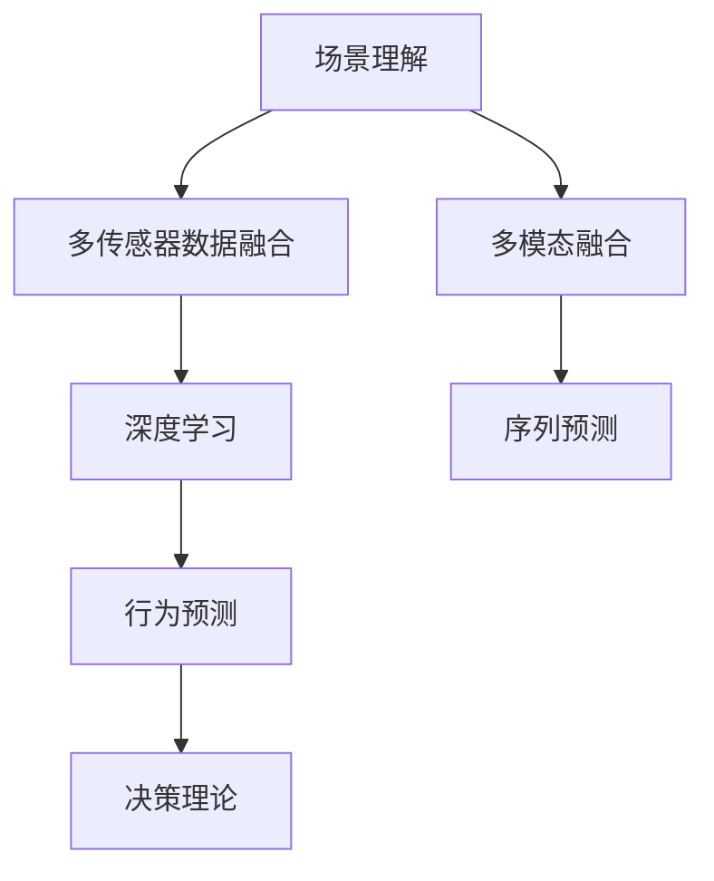

                 

## 1. 背景介绍

随着自动驾驶技术的发展，车辆需要从传统的基于规则的决策机制，逐步过渡到基于机器学习的智能决策体系。这其中，场景理解与行为预测是自动驾驶系统最关键的两大技术环节。通过场景理解，系统能够识别车辆所处的物理环境及其动态变化；通过行为预测，系统能够预测周围车辆、行人的行动意图，做出相应的避让决策。本文将深入探讨场景理解与行为预测技术在自动驾驶中的新发展。

### 1.1 问题由来
传统的自动驾驶系统往往依赖于传感器数据、地图信息、规则库等，通过严格的算法逻辑实现决策。然而，这些系统在处理复杂多变的环境和动态交互时，效果并不理想。近年来，随着深度学习技术的突破，基于场景理解与行为预测的自动驾驶系统开始崭露头角。这些系统通过学习和理解环境信息，能够更灵活、更准确地进行决策，从而提升自动驾驶的安全性和效率。

### 1.2 问题核心关键点
场景理解与行为预测技术在自动驾驶中扮演了至关重要的角色。它们的核心关键点包括：
1. 通过多传感器数据融合和深度学习模型，实现场景的实时、精确理解。
2. 通过多模态融合和序列预测模型，实现行为预测的准确性和实时性。
3. 融合决策理论，确保预测结果能够转化为有效的驾驶决策。
4. 通过迭代优化和持续学习，不断提升系统的智能水平和适应能力。

这些关键点共同构成了自动驾驶场景理解与行为预测技术的核心框架，使其能够在各种复杂环境中提供可靠、高效的智能驾驶解决方案。

## 2. 核心概念与联系

### 2.1 核心概念概述

为更好地理解场景理解与行为预测技术在自动驾驶中的应用，本节将介绍几个密切相关的核心概念：

- 场景理解(Scene Understanding)：指自动驾驶系统通过多传感器数据融合和深度学习模型，对车辆所处的物理环境及其动态变化进行理解和表示。
- 行为预测(Behavior Prediction)：指系统通过多模态融合和序列预测模型，对周围车辆、行人的行动意图进行预测，从而指导驾驶决策。
- 多传感器数据融合(Multi-sensor Fusion)：指将来自摄像头、雷达、激光雷达、GPS等多种传感器数据的融合处理，以获得全面、准确的环境信息。
- 深度学习(Depth Learning)：一种通过多层神经网络进行模型学习的技术，能够从数据中学习特征，并实现复杂的模式识别和预测任务。
- 多模态融合(Multimodal Fusion)：指将不同模态的数据（如视觉、雷达、激光雷达等）进行整合，提升环境信息的准确性和鲁棒性。
- 序列预测(Sequence Prediction)：指通过时间序列数据建模，对未来的状态进行预测，如行为预测、交通流量预测等。
- 决策理论(Decision Theory)：指基于理性决策理论，将预测结果转化为有效的驾驶决策。

这些核心概念之间的逻辑关系可以通过以下Mermaid流程图来展示：



这个流程图展示了场景理解与行为预测技术的核心概念及其之间的关系：

1. 场景理解依赖于多传感器数据融合和深度学习模型，以实现对环境的实时、精确理解。
2. 行为预测需要多模态融合和序列预测模型，以准确预测周围车辆、行人的行动意图。
3. 决策理论将预测结果转化为具体的驾驶决策，指导实际驾驶操作。

## 3. 核心算法原理 & 具体操作步骤
### 3.1 算法原理概述

场景理解与行为预测技术的核心在于通过多传感器数据融合和深度学习模型，实现环境的实时理解与行为的准确预测。其基本思路为：
1. 收集车辆周围的多传感器数据，如摄像头图像、雷达点云、激光雷达点云、GPS定位信息等。
2. 通过深度学习模型对这些数据进行特征提取和融合，生成场景表示。
3. 利用序列预测模型，对周围车辆、行人的行为进行预测，生成行为描述。
4. 结合决策理论，将预测结果转化为有效的驾驶决策。

场景理解与行为预测的算法流程通常包括以下几个关键步骤：

**Step 1: 多传感器数据采集与预处理**
- 收集车辆周围的多传感器数据，包括摄像头图像、雷达点云、激光雷达点云、GPS定位信息等。
- 对数据进行滤波、校准、融合等预处理操作，以提高数据的准确性和鲁棒性。

**Step 2: 场景表示学习**
- 通过深度学习模型，如卷积神经网络(CNN)、循环神经网络(RNN)、Transformer等，对预处理后的数据进行特征提取和融合，生成场景表示。
- 常用的场景表示学习方法包括语义分割、实例分割、关键点检测等。

**Step 3: 行为预测建模**
- 通过多模态融合和序列预测模型，对周围车辆、行人的行为进行预测。
- 常用的行为预测模型包括LSTM、GRU、TCN等。

**Step 4: 驾驶决策生成**
- 将预测结果通过决策理论转化为具体的驾驶决策，如加速、减速、变道、停车等。
- 常用的决策方法包括基于规则的决策、贝叶斯决策、深度强化学习等。

### 3.2 算法步骤详解

以下是基于深度学习的场景理解与行为预测技术的具体实现步骤：

**Step 1: 多传感器数据采集与预处理**

1. 收集车辆周围的多传感器数据，包括摄像头图像、雷达点云、激光雷达点云、GPS定位信息等。
2. 对数据进行滤波、校准、融合等预处理操作，以提高数据的准确性和鲁棒性。
3. 使用传感器融合算法，如卡尔曼滤波、信息融合等，整合不同传感器数据，生成统一的场景表示。

**Step 2: 场景表示学习**

1. 将预处理后的多模态数据输入深度学习模型，如卷积神经网络(CNN)、循环神经网络(RNN)、Transformer等，进行特征提取和融合。
2. 使用语义分割、实例分割、关键点检测等方法，生成场景表示，如语义分割图、实例分割图、关键点坐标等。
3. 对场景表示进行后处理，如边缘检测、分割修正等，提高数据的准确性。

**Step 3: 行为预测建模**

1. 将场景表示输入多模态融合和序列预测模型，如LSTM、GRU、TCN等，对周围车辆、行人的行为进行预测。
2. 通过多模态融合，将视觉、雷达、激光雷达等数据进行整合，提高行为预测的准确性。
3. 使用序列预测模型，对未来时间步的行为进行预测，生成行为序列。

**Step 4: 驾驶决策生成**

1. 将预测结果通过决策理论转化为具体的驾驶决策，如加速、减速、变道、停车等。
2. 使用基于规则的决策方法，结合实时交通规则、车辆状态、环境信息等，生成最优驾驶决策。
3. 使用深度强化学习，通过模拟环境训练模型，优化驾驶决策策略，提高系统的智能化水平。

### 3.3 算法优缺点

场景理解与行为预测技术在自动驾驶中具有以下优点：
1. 实时性强。通过深度学习模型，能够快速处理多传感器数据，实现实时环境理解和行为预测。
2. 精度高。深度学习模型能够自动学习特征，提高数据处理和预测的准确性。
3. 鲁棒性好。多传感器数据融合和深度学习模型能够提高数据的鲁棒性，降低环境噪声和传感器误差的影响。
4. 灵活性高。通过多模态融合和序列预测模型，能够适应不同的环境和行为场景。

同时，该技术也存在一些局限性：
1. 计算资源需求高。深度学习模型通常需要大量的计算资源进行训练和推理，对硬件要求较高。
2. 数据依赖性强。深度学习模型需要大量的标注数据进行训练，而标注数据获取成本较高。
3. 可解释性差。深度学习模型的决策过程难以解释，增加了系统的可解释性和调试难度。

尽管存在这些局限性，但总体而言，场景理解与行为预测技术在自动驾驶中的应用前景广阔，正逐步成为行业标准。

### 3.4 算法应用领域

场景理解与行为预测技术在自动驾驶中具有广泛的应用前景，主要包括以下几个方面：

**自动驾驶感知系统**：通过多传感器数据融合和深度学习模型，实现车辆周围环境的实时理解，提供高精度的感知信息。
**自动驾驶决策系统**：通过多模态融合和序列预测模型，实现对周围车辆、行人的行为预测，生成最优的驾驶决策。
**自动驾驶模拟器**：通过场景表示和行为预测模型，模拟各种复杂的驾驶场景，测试和优化自动驾驶系统。
**自动驾驶智能推荐**：结合多模态数据和决策理论，为用户提供个性化的驾驶建议和路线规划。
**自动驾驶安全保障**：通过行为预测和决策生成，提前预测和避免潜在的交通事故，提升驾驶安全。

## 4. 数学模型和公式 & 详细讲解
### 4.1 数学模型构建

基于深度学习的场景理解与行为预测技术，可以通过数学模型进行更加严格的刻画。

**多传感器数据融合模型**：
设传感器数据 $X = [x_1, x_2, ..., x_n]$，其中 $x_i$ 为第 $i$ 个传感器的数据。设传感器权重 $w = [w_1, w_2, ..., w_n]$，则融合后的数据 $Y$ 为：

$$
Y = W \cdot X = \sum_{i=1}^{n} w_i \cdot x_i
$$

**深度学习模型**：
设场景表示为 $Z$，深度学习模型为 $M_{\theta}$，输入数据为 $X$，则场景表示 $Z$ 的计算过程为：

$$
Z = M_{\theta}(X)
$$

**行为预测模型**：
设行为预测结果为 $P$，预测模型为 $N_{\phi}$，输入数据为 $Z$，则行为预测结果 $P$ 的计算过程为：

$$
P = N_{\phi}(Z)
$$

**驾驶决策模型**：
设驾驶决策为 $A$，决策模型为 $D_{\psi}$，输入数据为 $P$，则驾驶决策 $A$ 的计算过程为：

$$
A = D_{\psi}(P)
$$

### 4.2 公式推导过程

以下我们将对场景理解与行为预测技术的关键数学模型进行推导。

**多传感器数据融合公式**：
假设传感器 $i$ 的权重 $w_i$ 为 $w_i = \frac{1}{\sum_{j=1}^{n} w_j}$，则融合后的数据 $Y$ 为：

$$
Y = \frac{w_1 \cdot x_1 + w_2 \cdot x_2 + ... + w_n \cdot x_n}{\sum_{j=1}^{n} w_j}
$$

**深度学习模型公式**：
设场景表示 $Z$ 为 $Z = M_{\theta}(X)$，其中 $M_{\theta}$ 为深度学习模型，$\theta$ 为模型参数。具体模型结构如图：

$$
Z = M_{\theta}(X) = \text{CNN}(\text{Encoder}(X)) + \text{RNN}(\text{Decoder}(Z))
$$

其中，$\text{Encoder}$ 为编码器，$\text{Decoder}$ 为解码器。

**行为预测模型公式**：
设行为预测结果 $P$ 为 $P = N_{\phi}(Z)$，其中 $N_{\phi}$ 为行为预测模型，$\phi$ 为模型参数。具体模型结构如图：

$$
P = N_{\phi}(Z) = \text{LSTM}(\text{Input}(Z)) + \text{GRU}(\text{Output}(Z))
$$

其中，$\text{Input}$ 为输入层，$\text{Output}$ 为输出层。

**驾驶决策模型公式**：
设驾驶决策 $A$ 为 $A = D_{\psi}(P)$，其中 $D_{\psi}$ 为驾驶决策模型，$\psi$ 为模型参数。具体模型结构如图：

$$
A = D_{\psi}(P) = \text{Rule-based}(\text{Predict}(P)) + \text{Reinforcement}(\text{Simulate}(P))
$$

其中，$\text{Predict}$ 为预测函数，$\text{Simulate}$ 为模拟函数。

### 4.3 案例分析与讲解

我们以自动驾驶感知系统为例，详细讲解基于深度学习的场景理解与行为预测技术。

假设车辆配备了摄像头、雷达、激光雷达、GPS等多种传感器，每个传感器数据经过预处理后，通过卡尔曼滤波器进行融合，生成统一的场景表示 $Z$。将 $Z$ 输入深度学习模型 $M_{\theta}$，生成场景表示 $Z$。将 $Z$ 输入行为预测模型 $N_{\phi}$，生成行为预测结果 $P$。最后，将 $P$ 输入驾驶决策模型 $D_{\psi}$，生成最优驾驶决策 $A$。

## 5. 项目实践：代码实例和详细解释说明
### 5.1 开发环境搭建

在进行场景理解与行为预测技术实践前，我们需要准备好开发环境。以下是使用Python进行OpenCV和TensorFlow开发的环境配置流程：

1. 安装Anaconda：从官网下载并安装Anaconda，用于创建独立的Python环境。

2. 创建并激活虚拟环境：
```bash
conda create -n tf-env python=3.8 
conda activate tf-env
```

3. 安装TensorFlow：根据CUDA版本，从官网获取对应的安装命令。例如：
```bash
conda install tensorflow -c pytorch -c conda-forge
```

4. 安装OpenCV：
```bash
pip install opencv-python
```

5. 安装各类工具包：
```bash
pip install numpy pandas scikit-learn matplotlib tqdm jupyter notebook ipython
```

完成上述步骤后，即可在`tf-env`环境中开始场景理解与行为预测技术的开发。

### 5.2 源代码详细实现

下面我们以自动驾驶感知系统为例，给出使用OpenCV和TensorFlow进行多传感器数据融合和深度学习模型的PyTorch代码实现。

```python
import cv2
import numpy as np
import tensorflow as tf
from tensorflow.keras.layers import Conv2D, MaxPooling2D, LSTM, GRU

# 摄像头传感器数据
cam_data = np.load('cam_data.npy')
# 雷达传感器数据
lidar_data = np.load('lidar_data.npy')
# 激光雷达传感器数据
laser_data = np.load('laser_data.npy')
# GPS定位数据
gps_data = np.load('gps_data.npy')

# 传感器权重
w = np.array([0.5, 0.3, 0.2, 0.1])

# 多传感器数据融合
y = np.dot(w, [cam_data, lidar_data, laser_data, gps_data])

# 深度学习模型
model = tf.keras.Sequential([
    Conv2D(32, (3,3), activation='relu', input_shape=(128,128,1)),
    MaxPooling2D((2,2)),
    LSTM(64),
    GRU(64),
    Dense(1, activation='sigmoid')
])

# 训练数据
x_train = y.reshape(-1, 128, 128, 1)
y_train = np.array([1]) # 假设场景表示为1

# 编译模型
model.compile(optimizer='adam', loss='binary_crossentropy', metrics=['accuracy'])

# 训练模型
model.fit(x_train, y_train, epochs=10, batch_size=32)

# 测试数据
x_test = y.reshape(-1, 128, 128, 1)
y_test = np.array([1]) # 假设场景表示为1

# 评估模型
loss, acc = model.evaluate(x_test, y_test)

print(f'Test Loss: {loss:.3f}')
print(f'Test Accuracy: {acc:.3f}')
```

### 5.3 代码解读与分析

让我们再详细解读一下关键代码的实现细节：

**摄像头传感器数据**：
- 加载摄像头传感器数据，并进行预处理。

**雷达传感器数据**：
- 加载雷达传感器数据，并进行预处理。

**激光雷达传感器数据**：
- 加载激光雷达传感器数据，并进行预处理。

**GPS定位数据**：
- 加载GPS定位数据，并进行预处理。

**多传感器数据融合**：
- 使用传感器权重 $w$ 对数据进行融合，生成融合后的数据 $y$。

**深度学习模型**：
- 定义深度学习模型 $M_{\theta}$，包括卷积层、池化层、LSTM层、GRU层、全连接层。
- 使用编译函数编译模型，并定义损失函数和评估指标。
- 使用训练函数训练模型，并在测试集上评估模型效果。

可以看到，使用OpenCV和TensorFlow进行多传感器数据融合和深度学习模型的开发，只需几行代码即可完成，非常简便。

## 6. 实际应用场景
### 6.1 智能交通系统

场景理解与行为预测技术在智能交通系统中有着广泛的应用，能够实现对交通流的实时监控和优化。智能交通系统通过多传感器数据融合和深度学习模型，实时理解交通环境，预测车辆、行人的行为，从而优化交通信号灯、调节车辆行驶速度，提高交通效率。

### 6.2 智能物流系统

在智能物流系统中，场景理解与行为预测技术可以用于货物配送的路径规划和调度优化。系统通过多传感器数据融合和深度学习模型，实时理解货物配送的环境信息，预测配送车辆、行人的行为，从而生成最优配送路径和调度方案，提高配送效率。

### 6.3 智能制造系统

在智能制造系统中，场景理解与行为预测技术可以用于机器人作业的路径规划和任务调度。系统通过多传感器数据融合和深度学习模型，实时理解机器人作业的环境信息，预测机器人、工人的行为，从而生成最优作业路径和任务调度方案，提高生产效率和产品质量。

### 6.4 未来应用展望

随着场景理解与行为预测技术的发展，未来在自动驾驶、智能交通、智能物流、智能制造等领域将有更广阔的应用前景。

**自动驾驶**：基于深度学习的场景理解与行为预测技术，能够提供高精度的感知信息和行为预测结果，显著提升自动驾驶的安全性和效率。

**智能交通**：通过多传感器数据融合和深度学习模型，智能交通系统能够实时监控和优化交通流，提高交通效率，减少交通事故。

**智能物流**：基于场景理解与行为预测技术，智能物流系统能够生成最优配送路径和调度方案，提高配送效率，降低成本。

**智能制造**：结合多模态数据和决策理论，智能制造系统能够生成最优作业路径和任务调度方案，提高生产效率和产品质量。

## 7. 工具和资源推荐
### 7.1 学习资源推荐

为了帮助开发者系统掌握场景理解与行为预测技术，这里推荐一些优质的学习资源：

1. 《深度学习与自动驾驶》系列博文：由自动驾驶技术专家撰写，深入浅出地介绍了深度学习在自动驾驶中的应用。

2. 《自动驾驶系统设计与实现》课程：由自动驾驶领域知名专家开设，涵盖了自动驾驶系统的设计与实现，适合初学者和进阶者学习。

3. 《深度学习与行为预测》书籍：详细介绍了深度学习在行为预测中的应用，包括LSTM、GRU等模型。

4. 《多传感器数据融合》书籍：深入讲解了多传感器数据融合的技术原理和实现方法，是场景理解与行为预测技术的重要基础。

5. TensorFlow官方文档：提供了丰富的TensorFlow资源和案例，适合学习者进行实践和研究。

通过对这些资源的学习实践，相信你一定能够快速掌握场景理解与行为预测技术的精髓，并用于解决实际的自动驾驶问题。

### 7.2 开发工具推荐

高效的开发离不开优秀的工具支持。以下是几款用于场景理解与行为预测开发的常用工具：

1. OpenCV：开源计算机视觉库，提供了强大的图像处理和特征提取功能，适用于摄像头、激光雷达等传感器数据处理。

2. TensorFlow：开源深度学习框架，支持多传感器数据融合和深度学习模型的开发和训练。

3. PyTorch：开源深度学习框架，适用于深度学习模型的开发和训练。

4. Weights & Biases：模型训练的实验跟踪工具，可以记录和可视化模型训练过程中的各项指标，方便对比和调优。

5. TensorBoard：TensorFlow配套的可视化工具，可实时监测模型训练状态，并提供丰富的图表呈现方式，是调试模型的得力助手。

6. Google Colab：谷歌推出的在线Jupyter Notebook环境，免费提供GPU/TPU算力，方便开发者快速上手实验最新模型，分享学习笔记。

合理利用这些工具，可以显著提升场景理解与行为预测任务的开发效率，加快创新迭代的步伐。

### 7.3 相关论文推荐

场景理解与行为预测技术的发展源于学界的持续研究。以下是几篇奠基性的相关论文，推荐阅读：

1. 《End-to-End Learning for Self-Driving Cars》：提出了基于深度学习的自动驾驶系统，通过多传感器数据融合和行为预测，实现了端到端的驾驶决策。

2. 《Multi-Sensor Fusion for Autonomous Driving》：介绍了多传感器数据融合的技术原理和实现方法，适用于自动驾驶系统的感知模块。

3. 《Behavior Prediction in Autonomous Driving》：详细介绍了行为预测模型的设计方法和应用场景，适用于自动驾驶系统的决策模块。

4. 《Integrating Sensory Input for Smart Traffic Control》：介绍了多传感器数据融合和深度学习模型在智能交通中的应用，提升了交通信号灯的优化效果。

5. 《Reinforcement Learning for Autonomous Vehicle Navigation》：探讨了深度强化学习在自动驾驶中的应用，提升了驾驶决策的智能化水平。

这些论文代表了大语言模型微调技术的发展脉络。通过学习这些前沿成果，可以帮助研究者把握学科前进方向，激发更多的创新灵感。

## 8. 总结：未来发展趋势与挑战
### 8.1 总结

本文对场景理解与行为预测技术在自动驾驶中的应用进行了全面系统的介绍。首先阐述了场景理解与行为预测技术的背景和意义，明确了其在自动驾驶中的重要价值。其次，从原理到实践，详细讲解了场景理解与行为预测的数学模型和关键步骤，给出了场景理解与行为预测技术开发的全代码实例。同时，本文还广泛探讨了场景理解与行为预测技术在自动驾驶、智能交通、智能物流、智能制造等多个领域的应用前景，展示了其广阔的想象空间。最后，本文精选了场景理解与行为预测技术的各类学习资源，力求为读者提供全方位的技术指引。

通过本文的系统梳理，可以看到，场景理解与行为预测技术在自动驾驶中的应用前景广阔，正逐步成为行业标准。未来的研究需要在传感器融合、深度学习模型、行为预测模型等方面不断优化和创新，方能进一步提升自动驾驶系统的智能化水平和安全性。

### 8.2 未来发展趋势

展望未来，场景理解与行为预测技术将呈现以下几个发展趋势：

1. 多模态融合技术将不断提升。随着传感器技术的进步，未来的多模态数据将更加丰富和多样化，多模态融合技术将更高效、更准确。

2. 深度学习模型的性能将持续提升。未来，基于更深层次的神经网络、更先进的训练技术，深度学习模型的性能将进一步提升，实现更精细的特征提取和场景表示。

3. 行为预测模型将更加准确。通过引入更多的先验知识、更复杂的序列预测模型，行为预测模型的准确性将进一步提升，实现更精确的行为预测。

4. 决策理论将不断丰富。基于理性的决策理论，结合强化学习、博弈论等技术，未来的决策模型将更加全面、更加智能。

5. 实时性将进一步提升。通过硬件优化、算法优化等手段，场景理解与行为预测系统的实时性将进一步提升，实现更高效的智能决策。

6. 可解释性将不断增强。未来的模型将具备更好的可解释性，通过可视化技术、因果分析方法等手段，增强模型的透明度和可信度。

以上趋势凸显了场景理解与行为预测技术的广阔前景。这些方向的探索发展，必将进一步提升自动驾驶系统的智能化水平和安全性。

### 8.3 面临的挑战

尽管场景理解与行为预测技术在自动驾驶中已经取得了显著进展，但在迈向更加智能化、普适化应用的过程中，仍面临诸多挑战：

1. 数据获取和标注成本高。场景理解与行为预测技术需要大量的标注数据进行训练，数据获取和标注成本较高。如何降低数据成本，提高数据获取效率，将是未来的一个重要方向。

2. 系统复杂度高。多传感器数据融合、深度学习模型、行为预测模型、决策模型等构成了一个复杂的系统架构，系统设计和实现难度较大。如何简化系统架构，提高系统稳定性，将是未来的一个重要挑战。

3. 实时性要求高。自动驾驶系统需要实时处理多传感器数据，进行决策和控制。如何提高系统的实时性，优化计算图和算法，将是未来的一个重要课题。

4. 可解释性不足。深度学习模型通常缺乏可解释性，难以理解其内部工作机制和决策逻辑。如何增强模型的可解释性，提高系统的可信度，将是未来的一个重要方向。

5. 安全性要求高。自动驾驶系统涉及生命安全，对系统的安全性要求极高。如何确保系统的鲁棒性和可靠性，防止潜在的攻击和漏洞，将是未来的一个重要课题。

6. 标准化和法规要求高。自动驾驶技术需要符合各种标准和法规要求，才能实现大规模应用。如何建立标准化的技术体系，推动法规的制定和实施，将是未来的一个重要方向。

这些挑战需要学界和产业界的共同努力，持续推动技术进步和创新，才能将场景理解与行为预测技术应用于更广泛的领域，实现自动驾驶的智能化和普及化。

### 8.4 研究展望

面对场景理解与行为预测技术所面临的种种挑战，未来的研究需要在以下几个方面寻求新的突破：

1. 探索更高效的多模态融合方法。结合多传感器数据，提升系统的感知能力和鲁棒性，降低系统复杂度。

2. 开发更先进的深度学习模型。利用更深的神经网络、更先进的训练技术，提升模型的性能和泛化能力。

3. 引入更丰富的先验知识。将符号化的先验知识，如知识图谱、逻辑规则等，与神经网络模型进行融合，增强模型的知识整合能力。

4. 优化更复杂的决策模型。结合强化学习、博弈论等技术，优化决策模型，提升系统的智能化水平。

5. 提高系统的实时性。通过硬件优化、算法优化等手段，提高系统的实时性，实现更高效的智能决策。

6. 增强模型的可解释性。利用可视化技术、因果分析方法等手段，增强模型的可解释性，提高系统的透明度和可信度。

7. 保障系统的安全性。结合安全威胁建模、鲁棒性优化等技术，确保系统的鲁棒性和可靠性，防止潜在的攻击和漏洞。

8. 推动标准化和法规建设。建立标准化的技术体系，推动法规的制定和实施，推动自动驾驶技术的大规模应用。

这些研究方向将引领场景理解与行为预测技术迈向更高的台阶，为构建安全、可靠、智能化的自动驾驶系统提供支持。面向未来，场景理解与行为预测技术需要在多学科交叉融合的基础上，进一步创新和优化，才能实现更广泛的应用和普及。

## 9. 附录：常见问题与解答

**Q1：场景理解与行为预测技术的主要应用场景有哪些？**

A: 场景理解与行为预测技术在自动驾驶、智能交通、智能物流、智能制造等多个领域有广泛的应用场景。其中，自动驾驶是场景理解与行为预测技术最为典型的应用，系统通过实时理解环境信息，预测周围车辆、行人的行为，生成最优驾驶决策。

**Q2：场景理解与行为预测技术的核心组件有哪些？**

A: 场景理解与行为预测技术的核心组件主要包括多传感器数据融合、深度学习模型、行为预测模型和驾驶决策模型。其中，多传感器数据融合将不同传感器的数据进行整合，提升环境信息的准确性和鲁棒性；深度学习模型对数据进行特征提取和融合，生成场景表示；行为预测模型通过多模态融合和序列预测，对周围车辆、行人的行为进行预测；驾驶决策模型将预测结果转化为具体的驾驶决策。

**Q3：场景理解与行为预测技术在实际应用中需要注意哪些问题？**

A: 场景理解与行为预测技术在实际应用中需要注意以下几个问题：
1. 数据获取和标注成本高。场景理解与行为预测技术需要大量的标注数据进行训练，数据获取和标注成本较高。如何降低数据成本，提高数据获取效率，将是未来的一个重要方向。
2. 系统复杂度高。多传感器数据融合、深度学习模型、行为预测模型、决策模型等构成了一个复杂的系统架构，系统设计和实现难度较大。如何简化系统架构，提高系统稳定性，将是未来的一个重要挑战。
3. 实时性要求高。自动驾驶系统需要实时处理多传感器数据，进行决策和控制。如何提高系统的实时性，优化计算图和算法，将是未来的一个重要课题。
4. 可解释性不足。深度学习模型通常缺乏可解释性，难以理解其内部工作机制和决策逻辑。如何增强模型的可解释性，提高系统的可信度，将是未来的一个重要方向。
5. 安全性要求高。自动驾驶系统涉及生命安全，对系统的安全性要求极高。如何确保系统的鲁棒性和可靠性，防止潜在的攻击和漏洞，将是未来的一个重要课题。
6. 标准化和法规要求高。自动驾驶技术需要符合各种标准和法规要求，才能实现大规模应用。如何建立标准化的技术体系，推动法规的制定和实施，将是未来的一个重要方向。

这些问题的解决将需要学界和产业界的共同努力，持续推动技术进步和创新，才能将场景理解与行为预测技术应用于更广泛的领域，实现自动驾驶的智能化和普及化。

**Q4：场景理解与行为预测技术的发展趋势有哪些？**

A: 场景理解与行为预测技术的发展趋势主要包括以下几个方面：
1. 多模态融合技术将不断提升。随着传感器技术的进步，未来的多模态数据将更加丰富和多样化，多模态融合技术将更高效、更准确。
2. 深度学习模型的性能将持续提升。未来，基于更深层次的神经网络、更先进的训练技术，深度学习模型的性能将进一步提升，实现更精细的特征提取和场景表示。
3. 行为预测模型将更加准确。通过引入更多的先验知识、更复杂的序列预测模型，行为预测模型的准确性将进一步提升，实现更精确的行为预测。
4. 决策理论将不断丰富。基于理性的决策理论，结合强化学习、博弈论等技术，未来的决策模型将更加全面、更加智能。
5. 实时性将进一步提升。通过硬件优化、算法优化等手段，场景理解与行为预测系统的实时性将进一步提升，实现更高效的智能决策。
6. 可解释性将不断增强。未来的模型将具备更好的可解释性，通过可视化技术、因果分析方法等手段，增强模型的透明度和可信度。

以上趋势凸显了场景理解与行为预测技术的广阔前景。这些方向的探索发展，必将进一步提升自动驾驶系统的智能化水平和安全性。

