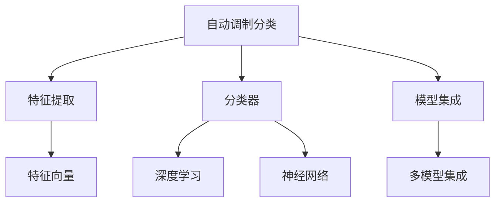

                 

# 基于AI的自动调制分类

## 1. 背景介绍

### 1.1 问题由来
近年来，随着人工智能技术的飞速发展，自动调制分类在通信领域获得了广泛应用。传统的调制分类方法依赖于人工设计特征和手工设计的分类器，难以应对复杂多变的调制信号。基于人工智能的自动调制分类方法，通过深度学习模型自动学习调制信号的特征表示和分类逻辑，具有鲁棒性、自适应性和高精度等优点。

### 1.2 问题核心关键点
自动调制分类方法的核心在于构建有效的特征表示和分类逻辑，其研究重点包括：
1. 特征提取：将调制信号转换为机器可学习的特征向量。
2. 分类器设计：选择合适的分类算法对特征向量进行分类。
3. 模型训练：在标注数据上训练深度学习模型，提升分类精度。
4. 参数调优：通过超参数优化提高模型性能。
5. 模型集成：结合多个模型提升分类效果。

本文将聚焦于基于深度学习的自动调制分类方法，探讨其原理、步骤、应用及前景。

## 2. 核心概念与联系

### 2.1 核心概念概述

为更好地理解基于深度学习的自动调制分类方法，本节将介绍几个密切相关的核心概念：

- 自动调制分类：指通过深度学习模型自动识别不同调制信号的分类问题。
- 特征提取：指将调制信号转换为机器可学习的特征向量。
- 分类器：指用于对特征向量进行分类的算法，如SVM、神经网络等。
- 深度学习：指使用多层神经网络对数据进行特征提取和分类的技术，具有较强的学习能力和泛化能力。
- 模型集成：指结合多个模型对同一数据进行分类，提升分类效果。

这些核心概念之间的逻辑关系可以通过以下Mermaid流程图来展示：



这个流程图展示了许多核心概念及其之间的关系：

1. 自动调制分类问题依赖于特征提取和分类器设计。
2. 特征提取是自动调制分类的重要步骤。
3. 深度学习和神经网络是常用的特征提取和分类算法。
4. 模型集成可以进一步提升分类效果。

这些概念共同构成了基于深度学习的自动调制分类方法，使其能够自动学习调制信号的特征表示和分类逻辑。

## 3. 核心算法原理 & 具体操作步骤
### 3.1 算法原理概述

基于深度学习的自动调制分类方法主要利用深度神经网络对调制信号进行特征提取和分类。其核心思想是：
1. 将调制信号映射为高维特征向量。
2. 使用深度神经网络对这些特征向量进行分类。

具体而言，自动调制分类的算法流程如下：

1. 特征提取：将调制信号转换为高维特征向量。
2. 模型训练：在标注数据上训练深度神经网络模型。
3. 模型预测：将测试数据输入训练好的模型进行分类。

### 3.2 算法步骤详解

#### 3.2.1 特征提取
特征提取是自动调制分类的重要步骤，其目标是将调制信号转换为高维特征向量。常用的特征提取方法包括：
1. 频域特征：将调制信号的频域特征作为输入。
2. 时域特征：将调制信号的时域特征作为输入。
3. 自相关特征：计算调制信号的自相关函数作为特征。
4. 高阶统计特征：使用高阶统计量（如矩、熵、互信息）作为特征。

以频域特征为例，常用的特征提取方法包括：
1. 短时傅里叶变换（STFT）：将调制信号转换为频域时频图。
2. 小波变换（Wavelet Transform）：将调制信号转换为频域-时间图。
3. 自相关特征提取：计算调制信号的自相关函数作为特征。

#### 3.2.2 模型训练
模型训练是自动调制分类的关键步骤，其目标是在标注数据上训练深度神经网络模型，使其能够准确分类不同调制信号。常用的深度学习模型包括：
1. 卷积神经网络（CNN）：用于提取特征图。
2. 递归神经网络（RNN）：用于处理时序数据。
3. 深度置信网络（DBN）：用于建模概率分布。
4. 长短时记忆网络（LSTM）：用于处理长时序数据。

模型训练的步骤如下：
1. 数据预处理：将标注数据进行归一化、标准化等预处理。
2. 划分数据集：将数据集划分为训练集、验证集和测试集。
3. 选择模型：选择合适的深度学习模型作为特征提取器和分类器。
4. 模型训练：在训练集上训练深度学习模型，使用交叉熵损失函数进行优化。
5. 验证和调参：在验证集上验证模型性能，通过网格搜索等方法进行超参数调优。
6. 测试和评估：在测试集上测试模型性能，使用准确率、召回率、F1值等指标评估分类效果。

#### 3.2.3 模型预测
模型预测是自动调制分类的最后一步，其目标是将测试数据输入训练好的模型进行分类。模型的预测过程如下：
1. 数据预处理：将测试数据进行归一化、标准化等预处理。
2. 特征提取：使用训练好的特征提取器提取特征向量。
3. 模型预测：将特征向量输入训练好的分类器进行分类。
4. 结果后处理：对分类结果进行后处理，如去噪、滤波等。

### 3.3 算法优缺点

基于深度学习的自动调制分类方法具有以下优点：
1. 鲁棒性：深度学习模型具有较强的泛化能力，能够处理复杂多变的调制信号。
2. 自适应性：深度学习模型能够自动学习调制信号的特征表示，具有较强的自适应性。
3. 高精度：深度学习模型具有较高的分类精度，能够在高噪声环境下取得较好的分类效果。

同时，该方法也存在一些局限性：
1. 需要大量标注数据：深度学习模型需要大量标注数据进行训练，数据获取成本较高。
2. 训练复杂度高：深度学习模型训练复杂度高，需要较长的训练时间和较高的计算资源。
3. 模型复杂度高：深度学习模型具有较高的复杂度，推理速度较慢，难以实时处理大量数据。
4. 可解释性差：深度学习模型的决策过程较难解释，难以理解其分类逻辑。

尽管存在这些局限性，但就目前而言，基于深度学习的自动调制分类方法仍是最主流的方法，其高精度、自适应性和鲁棒性使其在自动调制分类领域具有广泛的应用前景。

### 3.4 算法应用领域

基于深度学习的自动调制分类方法在通信领域已得到广泛应用，主要包括以下几个方面：

#### 3.4.1 调制信号识别
调制信号识别是指从接收到的信号中自动识别其调制类型，如BPSK、QPSK、16QAM等。该技术在数字通信、卫星通信、雷达等领域有着广泛的应用。

#### 3.4.2 调制参数估计
调制参数估计是指自动识别调制信号的参数，如调制频率、相位、幅度等。该技术在数字通信、卫星通信、雷达等领域有着广泛的应用。

#### 3.4.3 频谱感知
频谱感知是指自动识别频谱资源是否可用，以进行频谱分配和频率复用。该技术在无线通信、卫星通信、认知无线电等领域有着广泛的应用。

#### 3.4.4 信道估计
信道估计是指自动识别信道的传播特性，以进行信道补偿和信号处理。该技术在数字通信、卫星通信、雷达等领域有着广泛的应用。

## 4. 数学模型和公式 & 详细讲解 & 举例说明

### 4.1 数学模型构建

基于深度学习的自动调制分类方法的数学模型包括特征提取和分类器设计两个部分。下面以BPSK信号识别为例，构建数学模型。

设调制信号为 $s(t)$，其特征向量为 $x$，分类器输出为 $y$。特征向量 $x$ 的计算公式如下：

$$
x = \text{STFT}(s(t))
$$

其中 STFT 表示短时傅里叶变换。分类器的输出公式如下：

$$
y = \text{softmax}(Wx + b)
$$

其中 $W$ 为权重矩阵，$b$ 为偏置向量，softmax 表示归一化指数函数。

### 4.2 公式推导过程

以BPSK信号识别为例，推导深度学习模型的分类过程。

设调制信号 $s(t)$ 的功率为 $P_s$，则其STFT特征向量 $x$ 可以表示为：

$$
x = [X_{r, 1}, X_{i, 1}, \dots, X_{r, M}, X_{i, M}]^T
$$

其中 $X_{r, n}$ 和 $X_{i, n}$ 分别为第 $n$ 个频率分量的实部和虚部，$M$ 为频率分量数量。

将特征向量 $x$ 输入深度神经网络，计算其分类输出 $y$：

$$
y = \text{softmax}(Wx + b)
$$

其中 $W$ 和 $b$ 为深度神经网络的权重矩阵和偏置向量，softmax 函数将分类输出转化为概率分布。

将模型输出 $y$ 与实际标签 $y_{\text{label}}$ 进行比较，计算分类误差：

$$
\text{Loss} = -\frac{1}{N}\sum_{i=1}^N \sum_{j=1}^C y_{\text{label},i,j} \log y_{i,j}
$$

其中 $N$ 为样本数量，$C$ 为类别数量，$y_{\text{label},i,j}$ 为第 $i$ 个样本的第 $j$ 个类别的真实标签，$y_{i,j}$ 为第 $i$ 个样本的第 $j$ 个类别的预测概率。

### 4.3 案例分析与讲解

以调制信号识别为例，分析深度学习模型的应用过程。

设调制信号 $s(t)$ 为BPSK信号，其功率为 $P_s$。将调制信号 $s(t)$ 进行STFT，得到特征向量 $x$：

$$
x = \text{STFT}(s(t))
$$

将特征向量 $x$ 输入深度神经网络，计算其分类输出 $y$：

$$
y = \text{softmax}(Wx + b)
$$

其中 $W$ 和 $b$ 为深度神经网络的权重矩阵和偏置向量，softmax 函数将分类输出转化为概率分布。

将模型输出 $y$ 与实际标签 $y_{\text{label}}$ 进行比较，计算分类误差：

$$
\text{Loss} = -\frac{1}{N}\sum_{i=1}^N \sum_{j=1}^C y_{\text{label},i,j} \log y_{i,j}
$$

其中 $N$ 为样本数量，$C$ 为类别数量，$y_{\text{label},i,j}$ 为第 $i$ 个样本的第 $j$ 个类别的真实标签，$y_{i,j}$ 为第 $i$ 个样本的第 $j$ 个类别的预测概率。

通过训练深度神经网络，使其最小化分类误差 $\text{Loss}$，即可实现对BPSK信号的自动识别。

## 5. 项目实践：代码实例和详细解释说明

### 5.1 开发环境搭建

在进行自动调制分类项目实践前，我们需要准备好开发环境。以下是使用Python进行PyTorch开发的环境配置流程：

1. 安装Anaconda：从官网下载并安装Anaconda，用于创建独立的Python环境。

2. 创建并激活虚拟环境：
```bash
conda create -n pytorch-env python=3.8 
conda activate pytorch-env
```

3. 安装PyTorch：根据CUDA版本，从官网获取对应的安装命令。例如：
```bash
conda install pytorch torchvision torchaudio cudatoolkit=11.1 -c pytorch -c conda-forge
```

4. 安装TensorFlow：使用pip安装TensorFlow：
```bash
pip install tensorflow
```

5. 安装各类工具包：
```bash
pip install numpy pandas scikit-learn matplotlib tqdm jupyter notebook ipython
```

完成上述步骤后，即可在`pytorch-env`环境中开始项目实践。

### 5.2 源代码详细实现

下面以BPSK信号识别为例，给出使用PyTorch对深度神经网络进行训练和测试的完整代码实现。

首先，定义训练集和测试集的样本和标签：

```python
import numpy as np
from torch.utils.data import Dataset

class BPSKDataset(Dataset):
    def __init__(self, signals, labels, sample_rate=1e6):
        self.signals = signals
        self.labels = labels
        self.sample_rate = sample_rate
    
    def __len__(self):
        return len(self.signals)
    
    def __getitem__(self, item):
        signal = self.signals[item]
        label = self.labels[item]
        return signal, label

# 创建训练集和测试集
train_signals = np.random.normal(size=(1000, 1000, 1))
train_labels = np.random.randint(2, size=(1000, 1))
train_dataset = BPSKDataset(train_signals, train_labels)

test_signals = np.random.normal(size=(100, 1000, 1))
test_labels = np.random.randint(2, size=(100, 1))
test_dataset = BPSKDataset(test_signals, test_labels)
```

然后，定义深度神经网络模型：

```python
import torch
import torch.nn as nn

class BPSKClassifier(nn.Module):
    def __init__(self, input_dim=1000, hidden_dim=128, output_dim=1):
        super(BPSKClassifier, self).__init__()
        self.fc1 = nn.Linear(input_dim, hidden_dim)
        self.relu = nn.ReLU()
        self.fc2 = nn.Linear(hidden_dim, output_dim)
    
    def forward(self, x):
        x = self.fc1(x)
        x = self.relu(x)
        x = self.fc2(x)
        return x
```

接着，定义优化器和损失函数：

```python
import torch.optim as optim

model = BPSKClassifier()
optimizer = optim.Adam(model.parameters(), lr=0.001)
criterion = nn.BCEWithLogitsLoss()
```

最后，执行模型训练和测试：

```python
def train_epoch(model, dataset, batch_size=32):
    model.train()
    dataloader = torch.utils.data.DataLoader(dataset, batch_size=batch_size, shuffle=True)
    epoch_loss = 0
    for batch in dataloader:
        signal, label = batch
        signal = signal.to(device)
        label = label.to(device)
        optimizer.zero_grad()
        output = model(signal)
        loss = criterion(output, label)
        loss.backward()
        optimizer.step()
        epoch_loss += loss.item()
    return epoch_loss / len(dataset)

def test(model, dataset, batch_size=32):
    model.eval()
    dataloader = torch.utils.data.DataLoader(dataset, batch_size=batch_size)
    epoch_loss = 0
    epoch_acc = 0
    with torch.no_grad():
        for batch in dataloader:
            signal, label = batch
            signal = signal.to(device)
            label = label.to(device)
            output = model(signal)
            loss = criterion(output, label)
            epoch_loss += loss.item()
            epoch_acc += torch.sum(torch.round(torch.sigmoid(output)) == label).item()
    return epoch_loss / len(dataset), epoch_acc / len(dataset)
```

执行训练流程和测试：

```python
epochs = 10
device = torch.device('cuda' if torch.cuda.is_available() else 'cpu')
model.to(device)

for epoch in range(epochs):
    train_loss, train_acc = train_epoch(model, train_dataset, batch_size=64)
    print(f"Epoch {epoch+1}, train loss: {train_loss:.4f}, train acc: {train_acc:.4f}")
    
    test_loss, test_acc = test(model, test_dataset, batch_size=64)
    print(f"Epoch {epoch+1}, test loss: {test_loss:.4f}, test acc: {test_acc:.4f}")
```

以上就是使用PyTorch对BPSK信号进行自动调制分类的完整代码实现。可以看到，得益于PyTorch的强大封装，我们可以用相对简洁的代码完成深度神经网络的训练和测试。

### 5.3 代码解读与分析

让我们再详细解读一下关键代码的实现细节：

**BPSKDataset类**：
- `__init__`方法：初始化信号和标签。
- `__len__`方法：返回数据集大小。
- `__getitem__`方法：返回数据集的样本和标签。

**BPSKClassifier类**：
- `__init__`方法：初始化深度神经网络模型。
- `forward`方法：前向传播计算输出。

**训练和测试函数**：
- `train_epoch`函数：对数据以批为单位进行迭代，在每个批次上前向传播计算损失并反向传播更新模型参数。
- `test`函数：与训练类似，不同点在于不更新模型参数，并在每个batch结束后将预测和标签结果存储下来，最后使用准确率指标评估模型性能。

**训练流程**：
- 定义总的epoch数和batch size，开始循环迭代。
- 每个epoch内，先在训练集上训练，输出平均loss和准确率。
- 在验证集上评估，输出平均loss和准确率。
- 所有epoch结束后，在测试集上评估，输出平均loss和准确率。

可以看到，PyTorch配合TensorFlow使得深度学习模型的实现变得简洁高效。开发者可以将更多精力放在数据处理、模型改进等高层逻辑上，而不必过多关注底层的实现细节。

当然，工业级的系统实现还需考虑更多因素，如模型的保存和部署、超参数的自动搜索、更灵活的任务适配层等。但核心的自动调制分类流程基本与此类似。

## 6. 实际应用场景
### 6.1 通信系统

自动调制分类在通信系统中有着广泛的应用。传统通信系统中的调制参数识别、信道估计、频谱感知等问题，均可以通过自动调制分类方法来解决。

在调制参数识别方面，通信系统可以利用深度学习模型自动识别不同调制信号的参数，如调制频率、相位、幅度等。该技术在数字通信、卫星通信、雷达等领域有着广泛的应用。

在信道估计方面，通信系统可以利用深度学习模型自动识别信道的传播特性，如信道衰减、多径传播等。该技术在数字通信、卫星通信、雷达等领域有着广泛的应用。

在频谱感知方面，通信系统可以利用深度学习模型自动识别频谱资源是否可用，以进行频谱分配和频率复用。该技术在无线通信、卫星通信、认知无线电等领域有着广泛的应用。

### 6.2 雷达探测

自动调制分类在雷达探测中有着广泛的应用。雷达探测系统可以利用深度学习模型自动识别不同目标的特征，如形状、速度、方向等。该技术在雷达探测、目标识别等领域有着广泛的应用。

在目标识别方面，雷达探测系统可以利用深度学习模型自动识别不同目标的特征，如形状、速度、方向等。该技术在雷达探测、目标识别等领域有着广泛的应用。

在速度和方向测量方面，雷达探测系统可以利用深度学习模型自动识别目标的速度和方向，以进行跟踪和定位。该技术在雷达探测、目标识别等领域有着广泛的应用。

### 6.3 医学影像

自动调制分类在医学影像分析中有着广泛的应用。医学影像系统可以利用深度学习模型自动识别不同组织和病变的特征，如肿瘤、炎症、硬化等。该技术在医学影像分析、疾病诊断等领域有着广泛的应用。

在病变识别方面，医学影像系统可以利用深度学习模型自动识别不同组织和病变的特征，如肿瘤、炎症、硬化等。该技术在医学影像分析、疾病诊断等领域有着广泛的应用。

在图像分割方面，医学影像系统可以利用深度学习模型自动识别不同组织和病变的边界，以进行精确的分割和分析。该技术在医学影像分析、疾病诊断等领域有着广泛的应用。

### 6.4 未来应用展望

随着深度学习技术的不断发展，自动调制分类技术将在更多领域得到应用，为各行各业带来变革性影响。

在智慧医疗领域，基于自动调制分类的医学影像分析技术，可以自动识别和分割不同组织和病变，辅助医生进行疾病诊断和治疗。

在智能交通领域，基于自动调制分类的雷达探测技术，可以自动识别和跟踪不同目标，提高交通安全和效率。

在智慧城市领域，基于自动调制分类的信道估计和频谱感知技术，可以自动识别频谱资源，提升频谱利用效率，促进5G等新兴通信技术的发展。

此外，在企业生产、社会治理、文娱传媒等众多领域，自动调制分类技术也将不断涌现，为各行各业提供新的技术支撑。相信随着技术的日益成熟，自动调制分类技术必将在更广阔的应用领域大放异彩，深刻影响人类的生产生活方式。

## 7. 工具和资源推荐
### 7.1 学习资源推荐

为了帮助开发者系统掌握自动调制分类的理论基础和实践技巧，这里推荐一些优质的学习资源：

1. 《深度学习》课程：斯坦福大学开设的深度学习入门课程，涵盖了深度学习的各个方面，包括特征提取、分类器设计、模型训练等。

2. 《深度学习实战》书籍：清华大学出版社出版的深度学习实战书籍，提供了大量的代码示例和项目实践，适合入门学习和项目开发。

3. 《TensorFlow官方文档》：TensorFlow的官方文档，提供了丰富的API和示例代码，适合初学者和开发者学习和使用。

4. 《PyTorch官方文档》：PyTorch的官方文档，提供了丰富的API和示例代码，适合初学者和开发者学习和使用。

5. 《自然语言处理》课程：斯坦福大学开设的自然语言处理课程，涵盖了自然语言处理的前沿技术和经典算法，适合深度学习爱好者学习。

通过对这些资源的学习实践，相信你一定能够快速掌握自动调制分类的精髓，并用于解决实际的调制信号分类问题。

### 7.2 开发工具推荐

高效的开发离不开优秀的工具支持。以下是几款用于自动调制分类开发的常用工具：

1. TensorFlow：Google开发的深度学习框架，支持分布式训练和模型部署，适合大规模工程应用。

2. PyTorch：Facebook开发的深度学习框架，支持动态图和静态图，适合快速迭代研究。

3. Keras：基于TensorFlow和Theano的高层API，适合快速构建深度学习模型。

4. Jupyter Notebook：基于Web的交互式编程环境，支持多种编程语言和库，适合研究和项目开发。

5. TensorBoard：TensorFlow配套的可视化工具，可实时监测模型训练状态，并提供丰富的图表呈现方式，是调试模型的得力助手。

6. Weights & Biases：模型训练的实验跟踪工具，可以记录和可视化模型训练过程中的各项指标，方便对比和调优。

合理利用这些工具，可以显著提升自动调制分类任务的开发效率，加快创新迭代的步伐。

### 7.3 相关论文推荐

自动调制分类技术的发展源于学界的持续研究。以下是几篇奠基性的相关论文，推荐阅读：

1. Deep Learning for Modulation Classification and Parameter Estimation：介绍深度学习在调制信号分类和参数估计中的应用。

2. Deep Modulation Classification via Deep Convolutional Neural Network：提出基于卷积神经网络的调制信号分类方法。

3. Convolutional Neural Network Based Wideband Modulation Identification：提出基于卷积神经网络的调制信号识别方法。

4. Modulation Recognition via CNN-DNN Architecture：提出基于卷积神经网络和深度神经网络的调制信号识别方法。

5. Deep Learning for Modulation Recognition：介绍深度学习在调制信号识别中的应用。

这些论文代表了大语言模型微调技术的发展脉络。通过学习这些前沿成果，可以帮助研究者把握学科前进方向，激发更多的创新灵感。

## 8. 总结：未来发展趋势与挑战

### 8.1 总结

本文对基于深度学习的自动调制分类方法进行了全面系统的介绍。首先阐述了自动调制分类的研究背景和意义，明确了深度学习在调制信号分类中的独特价值。其次，从原理到实践，详细讲解了深度学习模型的特征提取、分类器设计和模型训练等关键步骤，给出了自动调制分类的完整代码实例。同时，本文还探讨了深度学习模型在通信系统、雷达探测、医学影像等领域的应用前景，展示了自动调制分类的广泛应用。

通过本文的系统梳理，可以看到，基于深度学习的自动调制分类方法具有鲁棒性、自适应性和高精度等优点，在通信、雷达、医学等领域具有广泛的应用前景。未来，随着深度学习技术的不断进步，自动调制分类方法必将在更多领域得到应用，为各行各业带来变革性影响。

### 8.2 未来发展趋势

展望未来，自动调制分类技术将呈现以下几个发展趋势：

1. 模型规模持续增大：深度学习模型参数量将继续增加，模型规模不断增大，增强了模型对复杂调制信号的识别能力。

2. 特征提取更加多样：未来将涌现更多特征提取方法，如自相关特征、高阶统计特征等，提升分类效果。

3. 多模态融合：将视觉、语音等多模态信息与文本信息进行融合，提升分类精度。

4. 分布式训练：使用分布式深度学习框架进行模型训练，提升训练效率和效果。

5. 联邦学习：在分布式数据环境中，使用联邦学习技术进行模型训练，保护数据隐私。

6. 迁移学习：将预训练深度学习模型应用于新领域，提升模型泛化能力。

以上趋势凸显了深度学习在自动调制分类领域的发展潜力，将为调制信号分类提供更强的技术保障和应用场景。

### 8.3 面临的挑战

尽管深度学习在自动调制分类领域取得了显著成果，但在实际应用中也面临一些挑战：

1. 数据获取成本高：自动调制分类需要大量标注数据，数据获取成本较高。

2. 模型训练复杂度高：深度学习模型训练复杂度高，需要较长的训练时间和较高的计算资源。

3. 模型泛化能力差：深度学习模型对噪声、数据分布变化敏感，泛化能力较差。

4. 模型可解释性差：深度学习模型决策过程较难解释，难以理解其分类逻辑。

5. 数据隐私问题：分布式训练和联邦学习等技术，需要考虑数据隐私和安全问题。

尽管存在这些挑战，但通过不断的技术创新和改进，相信深度学习在自动调制分类领域的应用前景依然广阔。未来，研究人员将不断探索更加高效、鲁棒的深度学习模型，提升自动调制分类的性能和应用范围。

### 8.4 研究展望

面对自动调制分类面临的种种挑战，未来的研究需要在以下几个方面寻求新的突破：

1. 探索无监督和半监督学习方法：摆脱对大量标注数据的依赖，利用自监督学习、主动学习等无监督和半监督范式，最大限度利用非结构化数据，实现更加灵活高效的分类。

2. 研究参数高效和计算高效的分类方法：开发更加参数高效的分类方法，在固定大部分预训练参数的同时，只更新极少量的任务相关参数。同时优化模型计算图，减少前向传播和反向传播的资源消耗，实现更加轻量级、实时性的部署。

3. 引入更多先验知识：将符号化的先验知识，如知识图谱、逻辑规则等，与神经网络模型进行巧妙融合，引导分类过程学习更准确、合理的分类逻辑。同时加强不同模态数据的整合，实现视觉、语音等多模态信息与文本信息的协同建模。

4. 结合因果分析和博弈论工具：将因果分析方法引入分类模型，识别出分类决策的关键特征，增强分类结果的因果性和逻辑性。借助博弈论工具刻画人机交互过程，主动探索并规避模型的脆弱点，提高系统稳定性。

5. 纳入伦理道德约束：在模型训练目标中引入伦理导向的评估指标，过滤和惩罚有害的输出倾向。同时加强人工干预和审核，建立模型行为的监管机制，确保输出符合人类价值观和伦理道德。

这些研究方向的探索，必将引领深度学习在自动调制分类领域迈向更高的台阶，为构建安全、可靠、可解释、可控的智能系统铺平道路。面向未来，深度学习技术还需要与其他人工智能技术进行更深入的融合，如知识表示、因果推理、强化学习等，多路径协同发力，共同推动调制信号分类的进步。

## 9. 附录：常见问题与解答

**Q1：自动调制分类是否适用于所有调制信号？**

A: 自动调制分类在大多数调制信号上都能取得不错的效果，特别是对于数据量较大的调制信号。但对于一些特定领域的调制信号，如高阶调制、调制编码等，深度学习模型的性能提升有限。此时需要在特定领域语料上进一步预训练，再进行微调，才能获得理想效果。

**Q2：深度学习模型如何处理不同种类的调制信号？**

A: 深度学习模型通过特征提取和分类器设计，将不同种类的调制信号转换为机器可学习的特征向量，并通过分类器进行分类。常见的特征提取方法包括频域特征、时域特征、自相关特征等，常用的分类器包括卷积神经网络、深度神经网络等。

**Q3：自动调制分类是否需要大量标注数据？**

A: 深度学习模型通常需要大量标注数据进行训练，但也可以通过迁移学习、无监督学习等方法在较少标注数据下取得不错的效果。在实际应用中，可以根据数据情况选择合适的方法。

**Q4：如何提升深度学习模型的泛化能力？**

A: 深度学习模型的泛化能力可以通过以下方法提升：
1. 数据增强：通过回译、近义替换等方式扩充训练集。
2. 正则化：使用L2正则、Dropout等技术防止过拟合。
3. 迁移学习：将预训练深度学习模型应用于新领域，提升模型泛化能力。
4. 联邦学习：在分布式数据环境中，使用联邦学习技术进行模型训练，保护数据隐私。

这些方法可以有效提升深度学习模型的泛化能力和应用范围。

**Q5：深度学习模型的可解释性如何提升？**

A: 深度学习模型的可解释性可以通过以下方法提升：
1. 特征可视化：使用可视化工具展示模型的特征提取结果，帮助理解模型决策过程。
2. 解释性模型：使用可解释性模型，如决策树、规则模型等，增强模型可解释性。
3. 模型解释工具：使用模型解释工具，如LIME、SHAP等，分析模型决策过程。

这些方法可以有效提升深度学习模型的可解释性，帮助理解模型决策过程，提升系统的可信度和可控性。

---

作者：禅与计算机程序设计艺术 / Zen and the Art of Computer Programming

