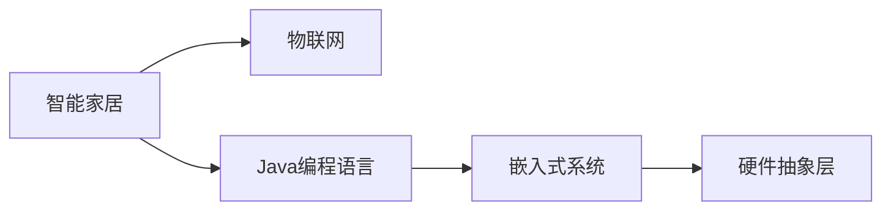

                 

## 1. 背景介绍

### 1.1 问题由来

随着科技的进步，智能家居逐渐成为人们生活中不可或缺的一部分。智能家居系统可以通过物联网技术，将家中的各种设备和传感器连接到一起，实现自动化控制和智能化管理，极大地提升了生活质量。然而，构建一个安全、稳定、高效的智能家居系统并非易事，尤其是对于缺乏物联网硬件知识和编程技能的Java程序员而言，更是充满挑战。

### 1.2 问题核心关键点

构建智能家居系统需要掌握多个领域的知识和技能，包括硬件设计、通信协议、数据处理、用户界面设计等。特别是对Java程序员而言，需要理解如何将Java程序与硬件设备相集成，实现数据的实时传输和处理。

### 1.3 问题研究意义

掌握智能家居硬件设计对于Java程序员拓展技术栈、提升职业竞争力具有重要意义。通过学习智能家居硬件入门知识，可以更好地理解物联网技术，为跨领域的项目开发提供有力支持。同时，智能家居系统作为物联网的重要应用场景，了解其设计与实现方法，可以为未来的智能城市、智慧医疗等领域的开发积累经验。

## 2. 核心概念与联系

### 2.1 核心概念概述

为更好地理解基于Java的智能家居硬件设计，本节将介绍几个关键概念：

- 智能家居（Smart Home）：利用物联网技术，将家庭中的各种设备连接到一起，实现自动化和智能化控制。
- 物联网（IoT）：通过传感器、网络、控制设备等将物理世界与互联网相连，实现数据采集和远程控制。
- Java编程语言：一种广泛使用的面向对象编程语言，具有跨平台、安全性高、性能优良等特点，常用于企业级应用和Web开发。
- 嵌入式系统（Embedded System）：运行在硬件设备上的操作系统和软件，通常具有资源受限、实时性要求高等特点。
- 硬件抽象层（HAL）：提供设备驱动和API接口，简化上层软件对硬件的访问和使用。

这些概念之间的逻辑关系可以通过以下Mermaid流程图来展示：

这个流程图展示了一些关键概念及其之间的逻辑关系：

1. 智能家居系统基于物联网技术实现。
2. Java编程语言被广泛应用于智能家居系统的开发。
3. 嵌入式系统在硬件设备上运行，负责数据采集和处理。
4. 硬件抽象层为上层软件提供设备驱动和API接口。

这些概念共同构成了智能家居系统构建的基础框架，使得Java程序员能够更系统地掌握智能家居硬件设计。

## 3. 核心算法原理 & 具体操作步骤

### 3.1 算法原理概述

基于Java的智能家居硬件设计主要涉及嵌入式系统中的数据采集、处理、传输等技术。其核心算法原理包括：

- 传感器数据采集：通过各种传感器（如温度传感器、湿度传感器、光照传感器等）采集环境数据。
- 数据处理：利用Java编程语言处理传感器数据，进行数据分析和特征提取。
- 通信协议：使用MQTT、HTTP等通信协议，将采集到的数据传输到中央服务器或云端。
- 嵌入式系统架构设计：设计基于硬件抽象层的嵌入式系统架构，实现高效、稳定的数据处理。

### 3.2 算法步骤详解

基于Java的智能家居硬件设计一般包括以下关键步骤：

**Step 1: 硬件选型与设计**

- 选择合适的传感器和嵌入式设备，如单片机、微控制器、路由器等。
- 设计电路板和连接线路，确保各个设备能够稳定运行。

**Step 2: 软件框架搭建**

- 选择合适的Java框架和库，如Eclipse Paho、Apache Kafka等。
- 搭建基于嵌入式系统的Java程序框架，实现数据的采集、处理和传输。

**Step 3: 数据处理与分析**

- 利用Java编程语言对传感器数据进行预处理，如去噪、归一化等。
- 实现数据分析和特征提取算法，如时间序列分析、机器学习等。

**Step 4: 通信协议配置**

- 配置MQTT或HTTP通信协议，实现数据的实时传输。
- 在中央服务器或云端部署数据处理和存储系统，实现数据的管理和查询。

**Step 5: 系统集成与测试**

- 将各模块集成到智能家居系统中，实现整体功能。
- 进行系统测试和调试，确保系统稳定可靠。

### 3.3 算法优缺点

基于Java的智能家居硬件设计具有以下优点：

- 跨平台性强：Java程序可以在多个操作系统上运行，方便跨平台集成。
- 数据处理能力强：Java提供了丰富的数据处理库和算法，能够高效处理大量传感器数据。
- 安全性高：Java的跨平台特性和强类型系统，提供了良好的安全性保障。

同时，该方法也存在一些局限性：

- 资源消耗高：Java程序通常需要较多的计算资源，不适合资源受限的嵌入式设备。
- 实时性较差：Java程序的执行效率相比C/C++等语言较低，不适合对实时性要求高的应用场景。
- 开发复杂度高：Java程序的开发过程涉及多个层次，相对复杂，需要较多的开发和调试工作。

尽管存在这些局限性，但Java在智能家居硬件设计中的应用依然广泛，其跨平台特性和丰富的库资源为系统开发提供了有力的支持。

### 3.4 算法应用领域

基于Java的智能家居硬件设计广泛应用于各种智能家居系统中，如智能灯光、智能温控、智能安防等。Java程序员可以利用其编程技能，为这些系统开发实时数据采集、处理和传输功能，实现智能家居的自动化和智能化管理。

## 4. 数学模型和公式 & 详细讲解 & 举例说明

### 4.1 数学模型构建

本节将使用数学语言对基于Java的智能家居硬件设计进行更加严格的刻画。

假设智能家居系统采集的环境数据为 $X = [x_1, x_2, ..., x_n]$，其中 $x_i$ 表示第 $i$ 个传感器的读数。数据的处理方法为 $f(X) = [y_1, y_2, ..., y_m]$，其中 $y_i$ 为经过处理后的数据。通信协议将数据 $y$ 传输到服务器，并记录到数据库 $D$ 中。

### 4.2 公式推导过程

以下我们以智能温控系统为例，推导基于Java的数据处理和传输算法。

假设智能温控系统的环境温度读数为 $x = [T_1, T_2, ..., T_n]$，目标温度为 $t$，则温控系统需要输出控制信号 $y$，使得室内温度逐渐接近目标温度。根据PID控制算法，控制信号 $y$ 的计算公式为：

$$
y = K_p \times (t - x) + K_i \times \int (t - x) dt + K_d \times \frac{d(t - x)}{dt}
$$

其中 $K_p$、$K_i$、$K_d$ 分别为比例、积分、微分控制系数。将 $x$ 和 $t$ 转换为Java对象，并使用Java代码实现上述公式，即可得到智能温控系统的控制算法。

### 4.3 案例分析与讲解

以智能灯光控制系统为例，分析其数据采集和传输过程。

智能灯光系统通过光敏传感器采集室内光线数据 $x = [L_1, L_2, ..., L_n]$，根据光线强度控制灯光亮度。系统设计步骤如下：

1. 选择合适的光敏传感器和嵌入式设备。
2. 设计电路板和连接线路，确保光敏传感器与中央处理器的连接稳定。
3. 使用Java程序采集光线数据，并进行预处理，如去噪、归一化等。
4. 根据光线强度计算控制信号 $y = f(x)$，如通过映射函数将光线强度转换为亮度等级。
5. 使用MQTT协议将控制信号 $y$ 传输到云端，并控制灯光的亮度。

## 5. 项目实践：代码实例和详细解释说明

### 5.1 开发环境搭建

在进行智能家居硬件设计实践前，我们需要准备好开发环境。以下是使用Java进行智能家居开发的环

