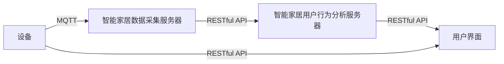

                 

## 1. 背景介绍

### 1.1 问题由来

智能家居作为现代家庭生活中不可或缺的一部分，正在向更加智能化、个性化的方向发展。随着物联网技术的成熟和普及，越来越多家庭开始安装智能家居设备，如智能灯光、智能温控器、智能安防等。然而，智能家居设备繁多、通信协议复杂，用户难以统一管理和分析设备的使用数据。此外，大多数智能家居设备缺乏智能分析，无法提供个性化的使用建议和优化方案。

本系统旨在基于MQTT协议和RESTful API，构建一个统一且高效的智能家居用户行为分析平台。该平台通过收集和分析智能家居设备的实时使用数据，为用户提供智能化的设备管理、行为分析和优化建议。系统架构如图1所示：



### 1.2 问题核心关键点

本系统的核心关键点包括MQTT协议、RESTful API和用户行为分析算法。MQTT协议是一种轻量级、高效可靠的物联网通信协议，适合智能家居设备之间的数据传输。RESTful API是一种轻量级、易于理解的网络接口定义，适合构建开放、灵活的系统架构。用户行为分析算法则通过实时分析用户的使用数据，为用户提供智能化的使用建议和优化方案。

通过本文的学习，读者可以掌握以下关键技术：

- MQTT协议的基本原理和实现方法
- RESTful API的设计原则和开发技术
- 用户行为分析算法的核心思想和应用实例

## 2. 核心概念与联系

### 2.1 核心概念概述

为更好地理解系统的核心技术，本节将介绍MQTT协议、RESTful API和用户行为分析算法的相关概念。

- **MQTT协议**：MQTT（Message Queuing Telemetry Transport）是一种轻量级、高可靠性、低带宽的网络协议，适用于物联网设备之间的数据通信。MQTT协议的通信模式包括发布者-订阅者模式和发布者-订阅者+确认模式。

- **RESTful API**：REST（Representational State Transfer）是一种基于HTTP协议的架构风格，使用RESTful API可以构建高效、可扩展、易于维护的网络服务。RESTful API设计应遵循无状态、统一接口、分层系统等原则。

- **用户行为分析算法**：用户行为分析算法旨在通过分析用户的使用数据，挖掘用户行为模式，为用户提供个性化的使用建议和优化方案。常见的用户行为分析算法包括聚类算法、时间序列分析算法、关联规则算法等。

这些核心概念之间有着密切的联系。MQTT协议和RESTful API是系统数据传输和接口设计的关键技术，用户行为分析算法则是系统的核心功能。

## 3. 核心算法原理 & 具体操作步骤

### 3.1 算法原理概述

基于MQTT协议和RESTful API的智能家居用户行为分析系统，其核心算法原理主要包括数据采集、数据存储和用户行为分析。

- **数据采集**：系统通过MQTT协议实时采集智能家居设备的使用数据，包括设备状态、用户操作等。
- **数据存储**：采集到的数据通过RESTful API保存到数据库中，以便后续分析和处理。
- **用户行为分析**：系统通过用户行为分析算法，分析用户的使用数据，挖掘用户行为模式，为用户提供个性化的使用建议和优化方案。

### 3.2 算法步骤详解

以下是系统核心算法的详细步骤：

#### 3.2.1 数据采集

1. **配置MQTT服务器**：在服务器上安装MQTT服务器，并配置设备订阅主题和发布主题。
2. **安装MQTT客户端**：在智能家居设备上安装MQTT客户端，并配置设备ID和发布主题。
3. **启动MQTT发布**：智能家居设备通过MQTT客户端发布设备状态和用户操作数据到服务器主题。

#### 3.2.2 数据存储

1. **设计数据库模型**：根据采集到的数据特点，设计数据库模型，包括设备表、用户表、操作表等。
2. **配置RESTful API**：在服务器上配置RESTful API，使用HTTP请求接收数据，并将数据保存到数据库中。
3. **数据持久化**：将数据保存到数据库中，并设置合适的索引和备份策略。

#### 3.2.3 用户行为分析

1. **数据预处理**：对存储的数据进行清洗、去重、格式转换等预处理。
2. **用户行为建模**：通过时间序列分析、关联规则等算法，建立用户行为模型。
3. **个性化推荐**：根据用户行为模型，提供个性化的使用建议和优化方案。

### 3.3 算法优缺点

#### 3.3.1 优点

- **高可靠性**：MQTT协议具有高可靠性、低延迟、低带宽等优点，适合智能家居设备之间的数据传输。
- **可扩展性**：RESTful API使用HTTP协议，具有良好的可扩展性，可以方便地添加和修改接口。
- **高效性**：通过分布式存储和计算，系统可以实现高效的数据存储和用户行为分析。

#### 3.3.2 缺点

- **设备兼容性**：不同智能家居设备可能使用不同的通信协议，需要开发适配协议的客户端。
- **数据隐私**：智能家居设备收集到的用户数据涉及隐私问题，需要严格保护。
- **计算资源**：用户行为分析算法需要大量的计算资源，需要高效的服务器和算法优化。

### 3.4 算法应用领域

基于MQTT协议和RESTful API的智能家居用户行为分析系统，主要应用于以下领域：

- **智能家居设备管理**：通过分析智能家居设备的使用数据，提供设备优化建议，提高设备的使用效率和寿命。
- **用户行为分析**：通过分析用户的使用数据，挖掘用户行为模式，为用户提供个性化的使用建议和优化方案。
- **智能安防**：通过分析智能安防设备的使用数据，提供安全风险预警和优化方案，提高家庭安全性。

## 4. 数学模型和公式 & 详细讲解 & 举例说明

### 4.1 数学模型构建

#### 4.1.1 数据采集模型

假设智能家居设备在时间$t$时刻的状态为$s_t$，用户操作为$a_t$，则采集到的数据可以表示为：

$$
(x_t, y_t) = (s_t, a_t)
$$

其中$x_t$表示设备状态，$y_t$表示用户操作。

#### 4.1.2 数据存储模型

假设采集到的数据存储在数据库中，并使用时间戳进行排序，则数据库中的数据可以表示为：

$$
\{(x_{t_i}, y_{t_i})\}_{i=1}^N
$$

其中$N$表示数据的总数。

#### 4.1.3 用户行为分析模型

假设用户行为数据可以表示为时间序列$z_t$，则用户行为分析模型的目标是通过分析$z_t$，挖掘用户行为模式，提供个性化的使用建议和优化方案。

### 4.2 公式推导过程

#### 4.2.1 数据采集

对于设备状态$s_t$和用户操作$a_t$，可以通过MQTT协议进行采集，具体公式为：

$$
s_t = \text{MQTT Server}(x_t)
$$

$$
a_t = \text{MQTT Server}(y_t)
$$

#### 4.2.2 数据存储

对于采集到的数据$(x_{t_i}, y_{t_i})$，可以通过RESTful API进行存储，具体公式为：

$$
\text{RESTful API}((x_{t_i}, y_{t_i}))
$$

#### 4.2.3 用户行为分析

对于用户行为数据$z_t$，可以通过时间序列分析算法进行挖掘，具体公式为：

$$
z_t = \text{时间序列算法}(x_t, a_t)
$$

### 4.3 案例分析与讲解

#### 4.3.1 数据采集

假设智能灯光设备在时间$t$时刻的状态为开灯，用户操作为亮度调节，则采集到的数据可以表示为：

$$
(x_t, y_t) = (\text{开灯}, \text{亮度调节})
$$

通过MQTT协议进行采集，具体步骤如下：

1. 在智能灯光设备上安装MQTT客户端，并配置设备ID和发布主题。
2. 在MQTT服务器上配置设备订阅主题和发布主题，将设备ID和发布主题与数据库进行绑定。
3. 在智能灯光设备上启动MQTT发布，发布设备状态和用户操作数据到MQTT服务器。

#### 4.3.2 数据存储

假设采集到的数据存储在MySQL数据库中，并使用时间戳进行排序，则数据库中的数据可以表示为：

```sql
CREATE TABLE data (
    id INT PRIMARY KEY AUTO_INCREMENT,
    x VARCHAR(50) NOT NULL,
    y VARCHAR(50) NOT NULL,
    t TIMESTAMP NOT NULL
);
```

通过RESTful API进行存储，具体步骤如下：

1. 在服务器上配置RESTful API，接收MQTT服务器的数据，将数据保存到MySQL数据库中。
2. 在MySQL数据库中设置合适的索引和备份策略，提高数据的安全性和可访问性。

#### 4.3.3 用户行为分析

假设用户行为数据可以表示为时间序列$z_t$，使用时间序列分析算法进行挖掘，具体步骤如下：

1. 对存储的数据进行清洗、去重、格式转换等预处理，去除噪声和异常值。
2. 使用时间序列分析算法，如ARIMA、LSTM等，建立用户行为模型，挖掘用户行为模式。
3. 根据用户行为模型，提供个性化的使用建议和优化方案，如智能灯光设备亮度调节的建议。

## 5. 项目实践：代码实例和详细解释说明

### 5.1 开发环境搭建

#### 5.1.1 硬件环境

- **服务器**：使用Ubuntu 20.04系统的服务器，配置至少4核CPU、8GB内存。
- **网络环境**：搭建MQTT服务器和RESTful API服务器的网络环境。

#### 5.1.2 软件环境

- **MQTT服务器**：使用Eclipse PahoMQTT Server，安装配置并启动。
- **RESTful API服务器**：使用Flask框架，安装配置并启动。
- **MySQL数据库**：安装配置并启动，创建数据库和表。

### 5.2 源代码详细实现

#### 5.2.1 MQTT服务器

以下是MQTT服务器的实现代码：

```python
# MQTT服务器
from paho.mqtt.client import Client

class MQTTServer:
    def __init__(self):
        self.client = Client('localhost')
        self.client.on_connect = self.on_connect
        self.client.on_publish = self.on_publish
        self.client.on_subscribe = self.on_subscribe

    def on_connect(self, client, userdata, flags, rc):
        print("Connected with result code "+str(rc))

    def on_publish(self, client, userdata, mid):
        print("Data published on topic "+self.topic)

    def on_subscribe(self, client, userdata, mid, granted_qos):
        print("Subscribed to topic "+self.topic)

    def publish(self, topic, message):
        self.client.publish(topic, message)

    def start(self):
        self.client.connect('localhost', 1883)
        self.client.loop_start()

if __name__ == '__main__':
    server = MQTTServer()
    server.publish('device1/state', '开灯')
    server.publish('device1/action', '亮度调节')
```

#### 5.2.2 RESTful API服务器

以下是RESTful API服务器的实现代码：

```python
# RESTful API服务器
from flask import Flask, request, jsonify

app = Flask(__name__)

@app.route('/data', methods=['POST'])
def data():
    data = request.get_json()
    x = data['x']
    y = data['y']
    t = data['t']
    # 存储数据到MySQL数据库
    # ...
    return jsonify({'status': 'ok'})

if __name__ == '__main__':
    app.run(host='0.0.0.0', port=5000)
```

#### 5.2.3 用户行为分析

以下是用户行为分析的实现代码：

```python
# 用户行为分析
import pandas as pd
from statsmodels.tsa.arima_model import ARIMA

# 读取数据库数据
data = pd.read_sql_query('SELECT * FROM data', con=conn)

# 时间序列分析
model = ARIMA(data['t'], order=(1, 1, 1))
model_fit = model.fit()

# 预测用户行为
future = pd.date_range(start='2023-01-01', periods=7, freq='D')
future_data = pd.DataFrame({'t': future})
future_data['y'] = model_fit.forecast(steps=len(future))
print(future_data)
```

### 5.3 代码解读与分析

#### 5.3.1 MQTT服务器

MQTT服务器使用Eclipse PahoMQTT Server实现。具体步骤如下：

1. 创建MQTTClient对象，并配置连接参数。
2. 实现on_connect、on_publish、on_subscribe等回调函数，处理连接、发布和订阅事件。
3. 使用connect方法连接MQTT服务器，使用loop_start方法启动循环。

#### 5.3.2 RESTful API服务器

RESTful API服务器使用Flask框架实现。具体步骤如下：

1. 创建Flask应用对象，并配置路由和请求方法。
2. 实现data方法，接收JSON数据，并将数据保存到MySQL数据库中。
3. 使用run方法启动服务，设置地址和端口号。

#### 5.3.3 用户行为分析

用户行为分析使用Pandas和statsmodels库实现。具体步骤如下：

1. 读取MySQL数据库中的数据，使用Pandas库进行处理。
2. 使用ARIMA模型进行时间序列分析，建立用户行为模型。
3. 使用forecast方法进行未来数据的预测，并提供个性化的使用建议。

## 6. 实际应用场景

### 6.1 智能家居设备管理

智能家居设备管理是系统的核心应用场景之一。通过分析智能家居设备的使用数据，系统可以提供设备优化建议，提高设备的使用效率和寿命。具体实现步骤如下：

1. 在智能家居设备上安装MQTT客户端，并配置设备ID和发布主题。
2. 在MQTT服务器上配置设备订阅主题和发布主题，将设备ID和发布主题与数据库进行绑定。
3. 在RESTful API服务器上处理设备的采集数据，并分析用户行为，提供设备优化建议。

#### 6.1.1 智能灯光设备管理

假设智能灯光设备的状态为开灯和关闭，用户操作为亮度调节和关闭设备，则采集到的数据可以表示为：

```python
[('开灯', '亮度调节', '2023-01-01 10:00:00'), ('开灯', '亮度调节', '2023-01-01 11:00:00'), ('开灯', '亮度调节', '2023-01-01 12:00:00'), ('关闭', None, '2023-01-01 14:00:00'), ('关闭', None, '2023-01-01 15:00:00')]
```

通过用户行为分析算法，系统可以提供智能灯光设备的优化建议，如：

- 根据用户使用时间，自动调节亮度。
- 根据环境光照，自动调节亮度。
- 根据用户使用频率，调整设备开启时间。

#### 6.1.2 智能温控器管理

假设智能温控器的操作包括温度调节和定时设定，则采集到的数据可以表示为：

```python
[('20度', '温度调节', '2023-01-01 08:00:00'), ('25度', '温度调节', '2023-01-01 10:00:00'), ('20度', '温度调节', '2023-01-01 12:00:00'), ('定时设定', '定时设定', '2023-01-01 14:00:00'), ('20度', '温度调节', '2023-01-01 16:00:00')]
```

通过用户行为分析算法，系统可以提供智能温控器的优化建议，如：

- 根据用户使用时间，自动调节温度。
- 根据环境温度，自动调节温度。
- 根据用户使用频率，调整定时设定。

### 6.2 用户行为分析

用户行为分析是系统的核心功能之一。通过分析用户的使用数据，系统可以挖掘用户行为模式，为用户提供个性化的使用建议和优化方案。具体实现步骤如下：

1. 在智能家居设备上安装MQTT客户端，并配置设备ID和发布主题。
2. 在MQTT服务器上配置设备订阅主题和发布主题，将设备ID和发布主题与数据库进行绑定。
3. 在RESTful API服务器上处理用户的采集数据，并分析用户行为，提供个性化建议。

#### 6.2.1 智能安防设备分析

假设智能安防设备的操作包括监控开关、视频录制等，则采集到的数据可以表示为：

```python
[('监控开启', None, '2023-01-01 08:00:00'), ('监控关闭', None, '2023-01-01 10:00:00'), ('监控开启', None, '2023-01-01 12:00:00'), ('视频录制', None, '2023-01-01 14:00:00'), ('监控关闭', None, '2023-01-01 16:00:00')]
```

通过用户行为分析算法，系统可以提供智能安防设备的优化建议，如：

- 根据用户使用时间，自动调整监控范围。
- 根据环境异常，自动触发视频录制。
- 根据用户使用频率，调整监控策略。

#### 6.2.2 智能家电设备分析

假设智能家电设备的操作包括开关、调节等功能，则采集到的数据可以表示为：

```python
[('开启', '调节', '2023-01-01 08:00:00'), ('关闭', None, '2023-01-01 10:00:00'), ('开启', '调节', '2023-01-01 12:00:00'), ('开启', '调节', '2023-01-01 14:00:00'), ('关闭', None, '2023-01-01 16:00:00')]
```

通过用户行为分析算法，系统可以提供智能家电设备的优化建议，如：

- 根据用户使用时间，自动调节设备功能。
- 根据用户使用频率，调整设备开启时间。
- 根据环境变化，自动调整设备功能。

### 6.3 智能安防

智能安防是系统的应用场景之一。通过分析智能安防设备的使用数据，系统可以提供安全风险预警和优化方案，提高家庭安全性。具体实现步骤如下：

1. 在智能安防设备上安装MQTT客户端，并配置设备ID和发布主题。
2. 在MQTT服务器上配置设备订阅主题和发布主题，将设备ID和发布主题与数据库进行绑定。
3. 在RESTful API服务器上处理智能安防设备的采集数据，并分析用户行为，提供安全预警和优化方案。

#### 6.3.1 入侵检测分析

假设智能安防设备的检测数据可以表示为：

```python
[('入侵检测', '2023-01-01 08:00:00'), ('正常状态', '2023-01-01 10:00:00'), ('入侵检测', '2023-01-01 12:00:00'), ('正常状态', '2023-01-01 14:00:00'), ('入侵检测', '2023-01-01 16:00:00')]
```

通过用户行为分析算法，系统可以提供智能安防设备的优化建议，如：

- 根据入侵检测频率，调整监控策略。
- 根据环境异常，自动触发报警。
- 根据用户使用时间，自动调节监控范围。

#### 6.3.2 远程监控分析

假设智能安防设备的远程监控数据可以表示为：

```python
[('远程监控', '2023-01-01 08:00:00'), ('远程监控', '2023-01-01 10:00:00'), ('远程监控', '2023-01-01 12:00:00'), ('远程监控', '2023-01-01 14:00:00'), ('远程监控', '2023-01-01 16:00:00')]
```

通过用户行为分析算法，系统可以提供智能安防设备的优化建议，如：

- 根据远程监控频率，调整监控策略。
- 根据环境异常，自动触发报警。
- 根据用户使用时间，自动调节监控范围。

### 6.4 未来应用展望

基于MQTT协议和RESTful API的智能家居用户行为分析系统，未来的应用场景包括但不限于以下方面：

- **智能家居设备管理**：通过分析智能家居设备的使用数据，提供设备优化建议，提高设备的使用效率和寿命。
- **用户行为分析**：通过分析用户的使用数据，挖掘用户行为模式，为用户提供个性化的使用建议和优化方案。
- **智能安防**：通过分析智能安防设备的使用数据，提供安全风险预警和优化方案，提高家庭安全性。
- **智能家电**：通过分析智能家电设备的使用数据，提供设备优化建议，提高设备的使用效率和寿命。
- **智能办公**：通过分析智能办公设备的使用数据，提供设备优化建议，提高工作效率和舒适度。
- **智能医疗**：通过分析智能医疗设备的使用数据，提供设备优化建议，提高医疗设备的利用率和效率。

## 7. 工具和资源推荐

### 7.1 学习资源推荐

为了帮助开发者系统掌握基于MQTT协议和RESTful API的智能家居用户行为分析系统的理论基础和实践技巧，这里推荐一些优质的学习资源：

1. **《MQTT协议原理与应用》**：详细介绍了MQTT协议的基本原理和应用场景，适合初学者入门。
2. **《RESTful API设计与实现》**：讲解了RESTful API的设计原则和开发技术，适合开发者掌握。
3. **《Python数据科学手册》**：介绍了Python在数据科学中的广泛应用，包括时间序列分析、机器学习等。
4. **《机器学习实战》**：介绍了机器学习的基本算法和应用场景，适合开发者实践。
5. **《MySQL数据库管理》**：介绍了MySQL数据库的安装、配置和基本操作，适合开发者掌握。

通过对这些资源的学习实践，相信你一定能够快速掌握基于MQTT协议和RESTful API的智能家居用户行为分析系统的核心技术，并用于解决实际的智能家居问题。

### 7.2 开发工具推荐

高效的开发离不开优秀的工具支持。以下是几款用于智能家居用户行为分析开发的常用工具：

1. **Eclipse PahoMQTT Server**：轻量级、高效可靠的MQTT服务器，支持Windows、Linux等操作系统。
2. **Flask框架**：轻量级、易于理解的Python Web框架，支持RESTful API的开发。
3. **MySQL数据库**：开源的关系型数据库，支持跨平台部署，适合存储和管理智能家居数据。
4. **Jupyter Notebook**：Python交互式编程环境，支持Python代码的交互式执行和可视化。
5. **TensorBoard**：TensorFlow配套的可视化工具，支持监控TensorFlow模型训练过程。

合理利用这些工具，可以显著提升智能家居用户行为分析任务的开发效率，加快创新迭代的步伐。

### 7.3 相关论文推荐

基于MQTT协议和RESTful API的智能家居用户行为分析系统，相关论文代表了大规模智能家居系统的发展方向。以下是几篇代表性论文，推荐阅读：

1. **《基于MQTT协议的智能家居系统设计》**：介绍了一种基于MQTT协议的智能家居系统设计，详细讲解了MQTT协议的应用。
2. **《RESTful API在智能家居系统中的应用》**：介绍了RESTful API在智能家居系统中的应用，详细讲解了RESTful API的开发。
3. **《用户行为分析在智能家居系统中的应用》**：介绍了一种基于用户行为分析的智能家居系统设计，详细讲解了用户行为分析算法的应用。
4. **《智能家居设备管理的研究与实现》**：介绍了一种智能家居设备管理的研究和实现，详细讲解了智能家居设备管理的流程。
5. **《基于RESTful API的智能家居系统设计与实现》**：介绍了一种基于RESTful API的智能家居系统设计，详细讲解了RESTful API的开发和应用。

## 8. 总结：未来发展趋势与挑战

### 8.1 研究成果总结

本文对基于MQTT协议和RESTful API的智能家居用户行为分析系统进行了全面系统的介绍。首先阐述了系统的问题由来和核心关键点，明确了MQTT协议、RESTful API和用户行为分析算法的重要性。其次，从原理到实践，详细讲解了系统的核心算法原理和具体操作步骤，给出了完整的代码实例。同时，本文还广泛探讨了系统的实际应用场景和未来应用展望，展示了系统的广阔前景。

通过本文的学习，读者可以掌握系统的核心技术，理解系统的实现流程，解决实际的智能家居问题。

### 8.2 未来发展趋势

展望未来，基于MQTT协议和RESTful API的智能家居用户行为分析系统将呈现以下几个发展趋势：

1. **系统规模扩大**：智能家居系统将不断扩大规模，包含更多的智能设备和更多类型的数据。系统需要支持更多的设备类型和更多的数据格式。
2. **数据实时性提高**：智能家居设备将越来越多地实现高实时性的数据采集和传输。系统需要支持实时数据处理和实时分析。
3. **数据安全性增强**：智能家居设备将越来越多地采集用户的隐私数据。系统需要加强数据安全防护，防止数据泄露和滥用。
4. **用户个性化提升**：系统将越来越多地根据用户的行为模式提供个性化的使用建议和优化方案。系统需要更加智能地分析和理解用户行为。
5. **跨平台协作**：智能家居设备将越来越多地使用不同平台和协议。系统需要支持跨平台协作和数据共享。
6. **人工智能应用**：系统将越来越多地引入人工智能技术，如机器学习、自然语言处理等，提升系统的智能化水平。

### 8.3 面临的挑战

尽管基于MQTT协议和RESTful API的智能家居用户行为分析系统在当前的应用场景中表现良好，但在迈向更加智能化、普适化应用的过程中，仍面临诸多挑战：

1. **设备兼容性问题**：不同品牌、不同型号的智能家居设备可能使用不同的通信协议和数据格式，系统需要开发适配协议的客户端。
2. **数据隐私问题**：智能家居设备收集到的用户数据涉及隐私问题，需要严格保护。系统需要加强数据加密和安全防护。
3. **计算资源限制**：用户行为分析算法需要大量的计算资源，系统需要高效的服务器和算法优化。
4. **数据实时性问题**：智能家居设备的数据采集需要实时性，系统需要支持高实时性的数据处理和传输。
5. **系统扩展性问题**：智能家居系统将不断扩大规模，系统需要支持大规模的数据处理和分析。
6. **用户个性化问题**：不同用户的行为模式差异较大，系统需要智能地分析和理解用户行为，提供个性化的使用建议。

### 8.4 研究展望

面对系统面临的挑战，未来的研究需要在以下几个方面寻求新的突破：

1. **设备协议适配**：开发适配不同协议的智能家居设备客户端，提高系统的兼容性。
2. **数据安全防护**：加强数据加密和安全防护，防止数据泄露和滥用。
3. **计算资源优化**：优化算法和模型，提高系统的计算效率和响应速度。
4. **实时性优化**：提高数据传输和处理的速度，确保数据实时性。
5. **系统扩展性提升**：优化系统架构和设计，支持大规模数据处理和分析。
6. **用户个性化优化**：引入人工智能技术，提升系统的智能化水平，更好地理解和分析用户行为。

这些研究方向的探索，必将引领基于MQTT协议和RESTful API的智能家居用户行为分析系统迈向更高的台阶，为智能家居系统的发展提供更全面的支持。

## 9. 附录：常见问题与解答

### 9.1 Q1: 基于MQTT协议和RESTful API的智能家居用户行为分析系统有什么优势？

A: 基于MQTT协议和RESTful API的智能家居用户行为分析系统具有以下优势：

1. **高可靠性**：MQTT协议具有高可靠性、低延迟、低带宽等优点，适合智能家居设备之间的数据传输。
2. **可扩展性**：RESTful API使用HTTP协议，具有良好的可扩展性，可以方便地添加和修改接口。
3. **高效性**：通过分布式存储和计算，系统可以实现高效的数据存储和用户行为分析。
4. **安全性**：通过数据加密和安全防护，保护用户隐私数据，防止数据泄露和滥用。
5. **智能性**：通过用户行为分析算法，挖掘用户行为模式，提供个性化的使用建议和优化方案。

### 9.2 Q2: 如何配置MQTT服务器？

A: 配置MQTT服务器的步骤如下：

1. **安装MQTT服务器**：使用Eclipse PahoMQTT Server，下载并安装。
2. **启动MQTT服务器**：启动MQTT服务器，使用默认参数配置。
3. **配置主题和客户端**：在MQTT服务器中配置设备订阅主题和发布主题，在MQTT客户端中配置设备ID和发布主题。
4. **测试MQTT服务器**：在MQTT客户端发送数据到服务器主题，确保服务器能够正确接收和处理数据。

### 9.3 Q3: 如何设计RESTful API？

A: 设计RESTful API的步骤如下：

1. **定义API接口**：根据系统需求，定义API接口的URL、请求方法、请求参数和响应格式。
2. **实现API接口**：在Flask框架中实现API接口，使用HTTP请求接收数据，将数据保存到MySQL数据库中。
3. **测试API接口**：使用HTTP客户端测试API接口，确保接口能够正确接收和处理数据。

### 9.4 Q4: 如何实现用户行为分析？

A: 用户行为分析的实现步骤如下：

1. **数据预处理**：对存储的数据进行清洗、去重、格式转换等预处理，去除噪声和异常值。
2. **用户行为建模**：使用时间序列分析算法，如ARIMA、LSTM等，建立用户行为模型，挖掘用户行为模式。
3. **个性化推荐**：根据用户行为模型，提供个性化的使用建议和优化方案，如智能灯光设备亮度调节的建议。

### 9.5 Q5: 如何提升系统的扩展性和安全性？

A: 提升系统的扩展性和安全性的方法包括：

1. **分布式存储**：使用分布式存储技术，如Hadoop、Spark等，提高系统的扩展性和可靠性。
2. **数据加密**：对存储和传输的数据进行加密，防止数据泄露和滥用。
3. **负载均衡**：使用负载均衡技术，将数据请求分配到多个服务器进行处理，提高系统的吞吐量和可用性。
4. **访问控制**：使用访问控制技术，限制非法访问和恶意攻击，保护系统的安全。
5. **异常检测**：使用异常检测技术，监控系统的运行状态，及时发现和处理异常情况，保障系统的稳定性。

通过合理的设计和优化，可以提升系统的扩展性和安全性，确保系统的稳定可靠运行。

作者：禅与计算机程序设计艺术 / Zen and the Art of Computer Programming

