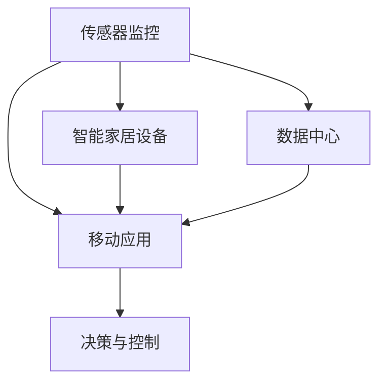

                 

# 基于MQTT协议和RESTful API的老年人居家安全辅助系统

## 1. 背景介绍

随着全球老龄化进程的加快，老年人居家安全问题日益凸显。一方面，随着身体机能的衰退，老年人容易面临跌倒、摔伤、走失等安全风险；另一方面，现代家庭结构复杂，空巢老人越来越多，家政护理人员不足。因此，老年人居家安全辅助系统应运而生，以提升老年人的生活品质和安全感。

## 2. 核心概念与联系

### 2.1 核心概念概述

本系统旨在通过物联网技术、传感器监控、智能家居设备等手段，构建一个全方位的老年人居家安全防护网络。系统核心组件包括：

- **传感器监控**：包括门磁传感器、烟雾传感器、燃气传感器、摔倒探测器等，用于实时监测家中的安全隐患。
- **智能家居设备**：包括智能门锁、智能灯光、智能音箱等，用于远程控制和管理家庭环境。
- **移动应用**：通过移动应用，老年人及其家属可以随时随地查看家中状态，并可通过应用与家政人员进行交流。
- **数据中心**：用于存储和处理传感器数据，通过大数据分析，为老年人居家安全提供决策支持。

### 2.2 核心概念原理和架构的 Mermaid 流程图



此流程图展示了传感器监控、智能家居设备、移动应用和数据中心之间的数据流和控制逻辑，其中决策与控制模块负责根据传感器数据和移动应用指令，自动调整智能家居设备状态。

## 3. 核心算法原理 & 具体操作步骤

### 3.1 算法原理概述

本系统通过MQTT协议和RESTful API来实现数据的双向传输。MQTT协议是一种轻量级的、基于发布/订阅模式的通信协议，适合物联网设备的互联互通；而RESTful API则提供了一种标准化的、易于理解的数据交换方式，方便开发人员进行数据接口调用。

### 3.2 算法步骤详解

#### 3.2.1 MQTT协议的使用

1. **设备接入**：将传感器设备连接到MQTT服务器。
2. **主题发布**：传感器设备根据不同情境，发布相应的主题，如“门磁报警”、“烟雾报警”等。
3. **主题订阅**：数据中心和移动应用订阅这些主题，实时接收传感器数据。
4. **数据处理**：数据中心对接收到的数据进行处理，进行异常检测和风险预警。

#### 3.2.2 RESTful API的设计

1. **接口设计**：根据需求，设计API接口，如“获取传感器数据”、“控制智能家居设备”等。
2. **接口实现**：开发接口的后台服务，使用Node.js或Python等语言实现接口功能。
3. **接口调用**：移动应用通过HTTP请求调用这些API，实现与数据中心的交互。

#### 3.2.3 数据中心的核心算法

1. **数据存储与管理**：使用数据库如MySQL或MongoDB，存储和管理传感器数据。
2. **异常检测与预警**：使用机器学习算法，如时间序列分析、分类回归等，检测异常情况并发出预警。
3. **风险评估与处理**：根据预警结果，进行风险评估，并触发相应的处理机制，如通知家属、联系家政人员等。

### 3.3 算法优缺点

#### 3.3.1 优点

1. **数据实时性**：通过MQTT协议，数据中心可以实时接收传感器数据，及时发现安全隐患。
2. **灵活性**：RESTful API提供标准化的接口，方便各种设备和应用进行集成和扩展。
3. **可扩展性**：系统架构模块化，可根据需求灵活增加或更换组件，如智能家居设备、传感器等。

#### 3.3.2 缺点

1. **安全问题**：MQTT协议和RESTful API存在一定的安全隐患，需要额外的安全措施进行保护。
2. **资源消耗**：大规模传感器数据的实时处理需要高配置服务器，增加了系统成本。
3. **兼容性问题**：不同厂商的设备可能存在兼容性问题，需要协调统一数据格式。

### 3.4 算法应用领域

该系统适用于各种老年人家居家环境，特别是在以下场景中具有显著优势：

- **空巢老人家庭**：通过实时监控和远程控制，有效保障空巢老人的安全。
- **家政护理不足家庭**：智能家居设备可替代部分家政服务，减轻护理人员的负担。
- **慢性病老人家庭**：通过实时监测生命体征，及时发现异常情况，保障老人健康。

## 4. 数学模型和公式 & 详细讲解 & 举例说明

### 4.1 数学模型构建

本系统主要涉及两个方面的数学模型：

1. **异常检测模型**：用于检测传感器数据中的异常情况，模型可通过时间序列分析或分类回归等算法实现。
2. **风险评估模型**：用于评估风险等级，并触发相应的处理机制，模型可通过决策树、支持向量机等算法实现。

### 4.2 公式推导过程

#### 4.2.1 时间序列分析

假设传感器数据为时间序列 $X=\{x_1, x_2, \ldots, x_t\}$，其中 $x_t$ 表示第 $t$ 个时间点的数据值。通过滑动窗口的方式，计算序列中连续 $k$ 个时间点的均值和标准差，得到特征向量 $F_t = \{m_t, s_t\}$，其中 $m_t = \frac{1}{k} \sum_{i=t-k+1}^t x_i$ 和 $s_t = \sqrt{\frac{1}{k} \sum_{i=t-k+1}^t (x_i - m_t)^2}$。通过比较当前时间点的特征向量与历史时间点的特征向量，可检测出异常情况。

#### 4.2.2 分类回归模型

假设传感器数据为分类数据 $y \in \{0, 1\}$，其中 $y=1$ 表示发生异常情况。通过逻辑回归或支持向量机等算法，对传感器数据进行分类。如果分类结果为 $y=1$，则触发预警机制。

### 4.3 案例分析与讲解

假设某家庭安装了门磁传感器和烟雾传感器。传感器数据通过MQTT协议发送到数据中心。数据中心使用时间序列分析算法，检测到门磁传感器在夜间频繁触发，且持续时间较长。通过与历史数据对比，判断可能存在非法入侵的风险。数据中心发出预警，并通过RESTful API通知家属，同时触发家政人员的远程视频监控。

## 5. 项目实践：代码实例和详细解释说明

### 5.1 开发环境搭建

本系统主要使用Node.js和MQTT协议实现数据传输，推荐使用Ubuntu Server作为开发环境。以下是搭建环境的详细步骤：

1. **安装Node.js**：
   ```
   sudo apt-get update
   sudo apt-get install nodejs
   ```
2. **安装MQTT Server**：
   ```
   sudo apt-get install mosquitto
   ```
3. **安装MongoDB**：
   ```
   sudo apt-get install mongodb
   ```

### 5.2 源代码详细实现

以下是使用Node.js实现传感器数据的接收和处理的示例代码：

```javascript
const MQTT = require('mqtt');
const mongoose = require('mongoose');

// 连接MQTT服务器
const mqttClient = MQTT.connect('mqtt://localhost:1883');
mqttClient.on('connect', () => {
  console.log('Connected to MQTT server');
  // 订阅传感器主题
  mqttClient.subscribe('#/sensor/door-magnet', { qos: 1 });
  mqttClient.subscribe('#/sensor/smoke-detector', { qos: 1 });
});

// 连接MongoDB
mongoose.connect('mongodb://localhost:27017', {
  useNewUrlParser: true,
  useUnifiedTopology: true
});
const sensorSchema = new mongoose.Schema({
  timestamp: { type: Date, required: true },
  value: { type: Number, required: true }
});
const Sensor = mongoose.model('Sensor', sensorSchema);

// 数据处理函数
const handleData = (topic, payload) => {
  const data = JSON.parse(payload);
  const timestamp = new Date();
  const value = data.value;
  const sensor = new Sensor({ timestamp, value });
  sensor.save((err) => {
    if (err) {
      console.error('Error saving data', err);
    }
  });
};

// 接收传感器数据
mqttClient.on('message', (topic, payload) => {
  console.log(`Received data from ${topic}: ${payload}`);
  handleData(topic, payload);
});
```

### 5.3 代码解读与分析

以上代码主要实现了MQTT客户端的连接、主题订阅和传感器数据处理。其中，使用`mqtt.connect`函数连接MQTT服务器，`mqtt.subscribe`函数订阅传感器主题，`mongoose.connect`函数连接MongoDB数据库，`handleData`函数处理传感器数据，并保存到MongoDB中。

## 6. 实际应用场景

### 6.1 老年人居家安全辅助系统的应用场景

- **跌倒检测**：通过摔倒探测器监测老人活动状态，及时发现跌倒情况。
- **烟雾检测**：通过烟雾传感器检测家中烟雾情况，防止火灾发生。
- **门窗安全**：通过门磁传感器监测门窗状态，防止非法入侵。
- **健康监测**：通过智能穿戴设备监测老人生命体征，及时发现异常情况。

### 6.2 未来应用展望

随着物联网技术的发展，未来系统将具备更多智能化功能，如语音识别、面部识别等。同时，通过机器学习和人工智能算法，系统将更加智能地预测和预防安全隐患，成为老年人居家安全的全方位守护者。

## 7. 工具和资源推荐

### 7.1 学习资源推荐

1. **MQTT协议官方文档**：MQTT协议的官方文档，详细介绍了MQTT协议的使用方法和最佳实践。
2. **RESTful API设计指南**：一本关于RESTful API设计的经典书籍，介绍了API设计和开发的最佳实践。
3. **Node.js官方文档**：Node.js的官方文档，提供了大量使用Node.js开发物联网应用的学习资源。
4. **MongoDB官方文档**：MongoDB的官方文档，详细介绍了MongoDB的安装和配置方法。

### 7.2 开发工具推荐

1. **Visual Studio Code**：一款流行的开发环境，支持多种编程语言和插件，适合开发物联网应用。
2. **Postman**：一款API测试工具，支持测试RESTful API接口，方便开发和测试。
3. **Git**：一款版本控制工具，支持多人协作开发，便于代码管理。

### 7.3 相关论文推荐

1. **Time-Series Analytics with Long Short-Term Memory Networks**：介绍使用长短期记忆网络进行时间序列分析的论文，适用于异常检测模型的开发。
2. **Classification and Regression Trees**：介绍决策树算法的经典论文，适用于风险评估模型的开发。

## 8. 总结：未来发展趋势与挑战

### 8.1 研究成果总结

本文介绍了基于MQTT协议和RESTful API的老年人居家安全辅助系统的设计思想和实现方法。通过传感器监控、智能家居设备、移动应用和数据中心等组件的协同工作，系统能够实时监测老年人的居家安全情况，并通过智能分析和决策，及时处理安全隐患。

### 8.2 未来发展趋势

未来，老年人居家安全辅助系统将更加智能化、自动化。通过引入更多智能设备和技术，系统将具备更全面的安全防护功能，如语音识别、面部识别、人脸识别门禁等。同时，通过机器学习和人工智能算法，系统将更加智能地预测和预防安全隐患，成为老年人居家安全的全方位守护者。

### 8.3 面临的挑战

尽管老年人居家安全辅助系统在老年人居家安全方面取得了显著效果，但仍面临一些挑战：

1. **隐私问题**：系统需要收集大量敏感数据，如何保障数据隐私和安全是重要问题。
2. **设备兼容性**：不同厂商的智能设备可能存在兼容性问题，需要统一数据格式和接口规范。
3. **资源消耗**：大规模传感器数据的实时处理需要高配置服务器，增加了系统成本。
4. **用户体验**：老年人对于智能设备的接受程度和操作便捷性有较高要求，需要优化用户体验。

### 8.4 研究展望

未来，需要在以下几个方面进行深入研究：

1. **隐私保护技术**：引入数据加密、数据匿名化等技术，保障数据隐私和安全。
2. **跨设备互操作性**：制定统一的设备接口和数据格式规范，促进不同厂商设备之间的互操作性。
3. **边缘计算**：利用边缘计算技术，将部分计算任务转移到设备端，减少中心服务器的负担，提高系统效率。
4. **用户体验优化**：通过人机交互设计，提高老年人对智能设备的接受度和使用便捷性。

通过持续的研究和创新，老年人居家安全辅助系统将不断完善和发展，为老年人提供更加安全、便捷的居家环境。

## 9. 附录：常见问题与解答

**Q1: 老年人居家安全辅助系统的主要技术难点是什么？**

A: 老年人居家安全辅助系统的主要技术难点在于以下几个方面：
1. **数据隐私和安全**：系统需要收集大量敏感数据，如何保障数据隐私和安全是重要问题。
2. **设备兼容性**：不同厂商的智能设备可能存在兼容性问题，需要统一数据格式和接口规范。
3. **资源消耗**：大规模传感器数据的实时处理需要高配置服务器，增加了系统成本。
4. **用户体验**：老年人对于智能设备的接受程度和操作便捷性有较高要求，需要优化用户体验。

**Q2: 系统如何处理异常数据？**

A: 系统通过时间序列分析算法，检测传感器数据中的异常情况。如果检测到异常数据，系统会触发预警机制，并通过RESTful API通知家属，同时触发家政人员的远程视频监控。

**Q3: 如何优化系统性能？**

A: 系统性能优化可以从以下几个方面进行：
1. **数据压缩和存储优化**：使用数据压缩和存储优化技术，减少数据存储和传输的开销。
2. **边缘计算**：利用边缘计算技术，将部分计算任务转移到设备端，减少中心服务器的负担，提高系统效率。
3. **优化算法**：引入更加高效的异常检测和风险评估算法，提升系统性能。

**Q4: 系统如何实现远程控制？**

A: 系统通过RESTful API实现远程控制。用户可以通过移动应用向系统发送HTTP请求，系统接收到请求后，通过API接口调用相应的后台服务，实现对智能家居设备的控制。

**Q5: 系统如何保障数据安全？**

A: 系统采用以下措施保障数据安全：
1. **数据加密**：使用AES加密算法对数据进行加密，防止数据在传输过程中被窃取。
2. **访问控制**：对系统接口进行访问控制，确保只有授权用户可以访问系统。
3. **数据匿名化**：对数据进行匿名化处理，防止用户隐私泄露。

通过以上措施，系统能够有效保障数据安全，为老年人提供更加安全、可靠的居家环境。

---

作者：禅与计算机程序设计艺术 / Zen and the Art of Computer Programming

