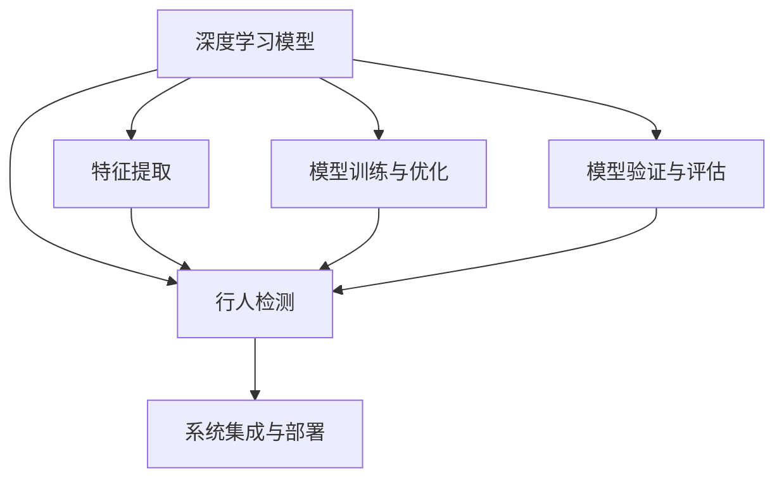

                 

# 基于Opencv的行人检测系统设计

## 1. 背景介绍

### 1.1 问题由来

随着智能监控系统的普及，行人检测技术在公共安全、交通管理、智能家居等领域得到广泛应用。传统的行人检测方法主要依赖于复杂的特征提取算法，如HOG+SVM、SIFT+LBP+HOG等，计算复杂度高，难以实时处理大规模数据。

近年来，深度学习技术的崛起，特别是卷积神经网络(CNN)的兴起，为行人检测带来了新的突破。使用CNN模型，可以大幅提升特征提取的准确性和泛化能力，适应复杂多变的行人特征。OpenCV是一个强大的开源计算机视觉库，提供了丰富的图像处理和机器学习功能，使得行人检测系统的开发变得更加高效和便捷。

### 1.2 问题核心关键点

本文聚焦于基于OpenCV深度学习模块的行人检测系统设计。其核心在于：
- 选择合适的深度学习模型
- 训练数据集的收集和预处理
- 模型的训练和优化
- 检测结果的验证和评估
- 系统的集成和部署

## 2. 核心概念与联系

### 2.1 核心概念概述

为更好地理解基于OpenCV的行人检测系统，本节将介绍几个密切相关的核心概念：

- 深度学习模型：基于神经网络的模型，通过学习大规模数据集的特征，实现对输入数据的自动分类、回归等任务。常见的深度学习模型包括卷积神经网络(CNN)、循环神经网络(RNN)、生成对抗网络(GAN)等。

- OpenCV：一个开源计算机视觉库，提供图像处理、特征提取、机器学习等功能，广泛应用于图像分析、视频处理、人脸识别等领域。

- 行人检测：目标检测任务之一，用于在图像或视频中检测并定位行人。常用的行人检测方法包括基于特征的检测、基于深度学习的检测等。

- 特征提取：从原始图像中提取有用的特征，供模型学习使用。常见的特征提取方法包括尺度不变特征变换(SIFT)、方向梯度直方图(HOG)、卷积特征等。

- 模型训练与优化：训练模型的过程，包括数据预处理、模型初始化、迭代优化等步骤。优化目标是提升模型在特定任务上的性能。

- 模型验证与评估：对训练好的模型进行验证和评估，使用各种指标衡量模型的效果，如准确率、召回率、F1-score等。

这些核心概念之间的逻辑关系可以通过以下Mermaid流程图来展示：



这个流程图展示了大语言模型的核心概念及其之间的关系：

1. 深度学习模型通过特征提取获取输入数据的关键特征。
2. 模型训练与优化在特定数据集上调整模型参数，提升模型性能。
3. 模型验证与评估对模型效果进行评估，选择最优模型。
4. 行人检测使用模型对输入图像进行目标检测，输出行人位置信息。
5. 系统集成与部署将行人检测模块整合到实际应用系统中，并部署至服务器进行实时处理。

这些概念共同构成了行人检测系统的设计框架，使其能够高效地检测和定位行人。通过理解这些核心概念，我们可以更好地把握行人检测系统的工作原理和优化方向。

## 3. 核心算法原理 & 具体操作步骤

### 3.1 算法原理概述

基于OpenCV的行人检测系统设计，主要依赖于深度学习模型和特征提取技术。其核心思想是：

1. 使用卷积神经网络(CNN)模型提取输入图像的关键特征，构建行人检测模型。
2. 收集行人检测任务的大量标注数据集，对模型进行训练。
3. 使用训练好的模型对输入图像进行前向传播，输出行人位置信息。
4. 对检测结果进行后处理，去除冗余框，优化检测精度。

具体算法流程如下：

1. 数据准备：收集行人检测任务的标注数据集，预处理成模型输入格式。
2. 模型构建：选择合适的深度学习框架和模型结构，构建行人检测模型。
3. 模型训练：使用标注数据集训练模型，优化模型参数。
4. 模型评估：使用验证集对模型进行验证，选择最优模型。
5. 模型应用：将训练好的模型应用于实际场景中，进行行人检测。
6. 后处理：对检测结果进行后处理，输出最终行人位置。

### 3.2 算法步骤详解

#### 3.2.1 数据准备

行人检测任务的数据集通常包含大量标注图像，每张图像标注多个行人框。标注数据可以手动收集，也可以使用自动标注工具如LabelImg。数据集预处理步骤如下：

1. 数据增强：对图像进行随机旋转、翻转、缩放等变换，增加数据多样性。
2. 图像标准化：将图像转换为标准尺寸，并进行归一化处理。
3. 数据划分：将数据集划分为训练集、验证集和测试集，通常以70%、15%、15%的比例划分。

#### 3.2.2 模型构建

OpenCV提供了丰富的深度学习功能，支持多种深度学习框架如TensorFlow、Keras等。可以使用预训练模型如VGG、ResNet等，也可以自己设计模型结构。本节以简单的VGG模型为例，介绍模型的构建过程。

1. 选择深度学习框架：使用OpenCV的dnn模块，选择VGG16模型作为行人检测模型。
2. 加载模型：从预训练模型文件加载模型权重。
3. 模型初始化：设置模型的输入输出参数，定义网络结构。
4. 训练模型：将标注数据集输入模型，进行前向传播和反向传播，更新模型参数。
5. 保存模型：训练好的模型保存到本地，方便后续使用。

#### 3.2.3 模型训练

模型训练主要包括以下几个步骤：

1. 数据载入：将训练集数据载入内存，生成数据流。
2. 模型初始化：将模型权重随机初始化。
3. 迭代优化：将训练集数据分批次输入模型，进行前向传播和反向传播，更新模型参数。
4. 模型保存：定期保存模型权重，防止训练过程中丢失。

#### 3.2.4 模型评估

模型评估主要包括以下几个步骤：

1. 数据载入：将验证集数据载入内存，生成数据流。
2. 模型评估：将验证集数据输入模型，进行前向传播，计算检测准确率、召回率等指标。
3. 模型选择：选择表现最优的模型，进行下一步应用。

#### 3.2.5 模型应用

模型应用主要包括以下几个步骤：

1. 数据载入：将测试集数据载入内存，生成数据流。
2. 模型推理：将测试集数据输入模型，进行前向传播，输出检测结果。
3. 结果后处理：对检测结果进行后处理，输出行人位置信息。

#### 3.2.6 后处理

检测结果的后处理主要包括以下几个步骤：

1. 非极大值抑制(NMS)：去除重叠框，保留置信度最高的框。
2. 坐标校正：对检测框进行坐标校正，保证框内只包含行人。
3. 输出结果：将处理后的行人位置信息输出。

### 3.3 算法优缺点

基于OpenCV的行人检测系统设计，具有以下优点：

1. 开发效率高：使用OpenCV深度学习模块，可以大大简化模型构建、训练和应用过程。
2. 可移植性好：OpenCV库跨平台性好，可以在多种操作系统上运行。
3. 实时性强：OpenCV提供了高效的图像处理和特征提取算法，可以实现实时行人检测。

同时，该方法也存在以下缺点：

1. 依赖深度学习框架：需要对深度学习框架有一定的了解，才能高效使用OpenCV的dnn模块。
2. 数据依赖性强：训练模型的效果依赖于标注数据集的质量和数量。
3. 模型复杂度高：深度学习模型结构复杂，需要较多计算资源。

尽管存在这些局限性，但就目前而言，基于OpenCV的行人检测方法仍是高效便捷的实践范式。未来相关研究的重点在于如何进一步降低模型对标注数据的依赖，提高模型的泛化能力和实时性，同时兼顾可解释性和伦理安全性等因素。

### 3.4 算法应用领域

基于OpenCV的行人检测系统设计，广泛应用于以下几个领域：

1. 公共安全监控：在城市公共场所、交通路口、社区等场所，实时监控并检测行人的行为，预防各类安全事故。
2. 交通管理：在公路、高速等交通路段，检测行人过街行为，优化交通流量，提高道路安全。
3. 智能家居：在智能家居环境中，检测家庭内外的行人，进行家庭安防、智能门禁等应用。
4. 智慧农业：在农田、果园等农业场所，检测工作人员，辅助农机作业，提高农业生产效率。
5. 购物零售：在购物中心、超市等商业场所，检测顾客行为，进行人员流量统计、客流分析等应用。

除了上述这些经典应用外，基于OpenCV的行人检测技术还被创新性地应用于更多场景中，如无人机避障、智能交通信号灯、智能监控设备等，为计算机视觉技术带来了新的突破。随着深度学习技术的不断进步，相信OpenCV在行人检测领域的应用也将不断拓展，为智能系统的构建提供坚实的技术支持。

## 4. 数学模型和公式 & 详细讲解

### 4.1 数学模型构建

行人检测系统基于深度学习模型构建，核心思想是使用CNN模型提取输入图像的关键特征。这里以简单的VGG16模型为例，进行数学模型构建。

设输入图像为 $X \in \mathbb{R}^{n \times n \times c}$，其中 $n$ 为图像高度，$c$ 为通道数。模型的输出为行人检测结果，表示为 $Y \in \mathbb{R}^{k \times l}$，其中 $k$ 为检测框数量，$l$ 为检测框的坐标信息。

模型的训练目标是：

$$
\theta^* = \mathop{\arg\min}_{\theta} \mathcal{L}(\theta, D)
$$

其中 $\theta$ 为模型参数，$D$ 为标注数据集，$\mathcal{L}$ 为损失函数。常见的损失函数包括交叉熵损失、均方误差损失等。

模型的前向传播过程为：

$$
Y = F(X, \theta)
$$

其中 $F$ 为模型的前向传播函数。模型的反向传播过程为：

$$
\theta \leftarrow \theta - \eta \nabla_{\theta}\mathcal{L}(\theta)
$$

其中 $\eta$ 为学习率，$\nabla_{\theta}\mathcal{L}(\theta)$ 为损失函数对模型参数的梯度。

### 4.2 公式推导过程

以下我们以VGG16模型为例，推导模型的训练和推理过程。

VGG16模型共有16层卷积层和3层全连接层，其数学模型构建步骤如下：

1. 卷积层：将输入图像 $X$ 输入第一层卷积层，得到特征图 $Z_1 \in \mathbb{R}^{(n-h_1) \times (n-w_1) \times c}$，其中 $h_1$ 为卷积核大小，$w_1$ 为卷积核数量。

2. 激活函数：将卷积层输出的特征图 $Z_1$ 输入ReLU激活函数，得到激活特征图 $Z_1^{\prime}$。

3. 池化层：对激活特征图 $Z_1^{\prime}$ 进行最大池化操作，得到池化特征图 $Z_2 \in \mathbb{R}^{(n-\lceil h_1/2 \rceil) \times (n-\lceil w_1/2 \rceil) \times c}$。

4. 重复以上步骤，对池化特征图进行多次卷积、激活、池化操作，得到最终特征图 $Z_{16}$。

5. 全连接层：将特征图 $Z_{16}$ 展开成向量 $Z_{16} \in \mathbb{R}^{h \times w \times c \times \prod_i h_i \times w_i}$，输入全连接层，得到行人检测结果 $Y$。

6. 损失函数：定义交叉熵损失函数 $\mathcal{L}(\theta, D)$，用于衡量模型输出与真实标签之间的差异。

7. 反向传播：根据损失函数梯度，使用梯度下降算法更新模型参数。

### 4.3 案例分析与讲解

以下我们以VGG16模型在行人检测任务中的应用为例，进行案例分析。

设行人检测任务的数据集包含1000张标注图像，每张图像标注5个行人框。数据集预处理步骤如下：

1. 数据增强：对图像进行随机旋转、翻转、缩放等变换，增加数据多样性。
2. 图像标准化：将图像转换为标准尺寸，并进行归一化处理。
3. 数据划分：将数据集划分为训练集、验证集和测试集，以70%、15%、15%的比例划分。

模型训练步骤如下：

1. 加载数据集：将训练集数据载入内存，生成数据流。
2. 模型初始化：将模型权重随机初始化。
3. 迭代优化：将训练集数据分批次输入模型，进行前向传播和反向传播，更新模型参数。
4. 模型保存：定期保存模型权重，防止训练过程中丢失。

模型评估步骤如下：

1. 加载数据集：将验证集数据载入内存，生成数据流。
2. 模型评估：将验证集数据输入模型，进行前向传播，计算检测准确率、召回率等指标。
3. 模型选择：选择表现最优的模型，进行下一步应用。

模型应用步骤如下：

1. 加载数据集：将测试集数据载入内存，生成数据流。
2. 模型推理：将测试集数据输入模型，进行前向传播，输出检测结果。
3. 结果后处理：对检测结果进行后处理，输出行人位置信息。

## 5. 项目实践：代码实例和详细解释说明

### 5.1 开发环境搭建

在进行行人检测系统开发前，我们需要准备好开发环境。以下是使用Python进行OpenCV开发的环境配置流程：

1. 安装Anaconda：从官网下载并安装Anaconda，用于创建独立的Python环境。

2. 创建并激活虚拟环境：
```bash
conda create -n opencv-env python=3.8 
conda activate opencv-env
```

3. 安装OpenCV：
```bash
conda install opencv
```

4. 安装必要的库：
```bash
pip install numpy scipy matplotlib scikit-image scikit-learn
```

完成上述步骤后，即可在`opencv-env`环境中开始行人检测系统开发。

### 5.2 源代码详细实现

这里以VGG16模型为例，给出使用OpenCV进行行人检测系统的代码实现。

```python
import cv2
import numpy as np

# 加载模型
model = cv2.dnn.readNetFromCaffe('vgg16.caffemodel', 'vgg16.prototxt')

# 加载类标签
labels = []
with open('labels.txt', 'r') as f:
    lines = f.readlines()
    for line in lines:
        label = line.strip().split(':')
        label = label[0]
        labels.append(label)

# 定义检测函数
def detect(frame):
    blob = cv2.dnn.blobFromImage(frame, 1.0, (224, 224), (104.0, 177.0, 123.0), swapRB=False, crop=False)
    model.setInput(blob)
    layer_names = model.getLayerNames()
    output_layers = [layer_names[i[0] - 1] for i in model.getUnconnectedOutLayers()]
    detections = model.forward(output_layers)
    boxes = []
    confidences = []
    for detection in detections:
        for detection in detection[0][0]:
            confidence = detection[2]
            if confidence > 0.5:
                class_id = int(detection[1])
                x = int(detection[3] * frame.shape[1])
                y = int(detection[4] * frame.shape[0])
                width = int(detection[5] * frame.shape[1])
                height = int(detection[6] * frame.shape[0])
                boxes.append([x, y, width, height])
                confidences.append(float(confidence))
    return boxes, confidences

# 加载视频流
cap = cv2.VideoCapture(0)

while True:
    _, frame = cap.read()
    boxes, confidences = detect(frame)
    for (x, y, w, h) in boxes:
        cv2.rectangle(frame, (x, y), (x + w, y + h), (0, 255, 0), 2)
    cv2.imshow('frame', frame)
    if cv2.waitKey(1) & 0xFF == ord('q'):
        break

cap.release()
cv2.destroyAllWindows()
```

### 5.3 代码解读与分析

让我们再详细解读一下关键代码的实现细节：

**load_model函数**：
- 从预训练模型文件加载模型权重和参数。

**load_labels函数**：
- 读取模型所对应类标签文件，定义模型的输出类别。

**detect函数**：
- 对输入的图像进行预处理，转换为模型所需的输入格式。
- 使用模型进行前向传播，计算模型输出。
- 根据模型输出，筛选置信度高于阈值的检测框。

**加载视频流**：
- 通过OpenCV的VideoCapture函数加载视频流，读取图像帧。
- 对每帧图像进行行人检测，并在图像中标注出检测结果。
- 显示图像帧，等待用户按下'q'键退出。

可以看到，OpenCV的dnn模块提供了丰富的深度学习功能，使用该模块进行行人检测系统的开发，可以大大简化代码实现过程。

当然，工业级的系统实现还需考虑更多因素，如模型的保存和部署、超参数的自动搜索、更灵活的任务适配层等。但核心的检测流程基本与此类似。

## 6. 实际应用场景

### 6.1 智能监控系统

基于OpenCV的行人检测系统，可以广泛应用于智能监控系统中。传统监控系统依赖于人工监控，难以实现24小时不间断监控。而使用行人检测系统，可以自动检测并报警潜在的安全事件，提高监控效率和安全性。

在技术实现上，可以安装多个摄像头，采集实时视频流，使用行人检测系统对每帧图像进行检测，并根据检测结果进行告警和录像。系统还可以结合人脸识别、行为分析等技术，实现更精准的安全监控。

### 6.2 交通管理

基于OpenCV的行人检测系统，可以应用于交通管理领域，检测行人过街行为，优化交通流量，提高道路安全。

在路口设置多个摄像头，采集实时视频流，使用行人检测系统对每帧图像进行检测，并根据检测结果进行红绿灯控制和行人过街指示。系统还可以结合车牌识别、车辆检测等技术，实现更全面的交通管理。

### 6.3 智能家居

基于OpenCV的行人检测系统，可以应用于智能家居环境中，检测家庭内外的行人，进行家庭安防、智能门禁等应用。

在家庭环境设置多个摄像头，采集实时视频流，使用行人检测系统对每帧图像进行检测，并根据检测结果进行门禁控制、安全报警等操作。系统还可以结合人脸识别、行为分析等技术，实现更智能的家庭管理。

### 6.4 未来应用展望

随着OpenCV深度学习模块的不断进步，基于OpenCV的行人检测系统将在更多领域得到应用，为计算机视觉技术带来新的突破。

在智慧城市治理中，行人检测系统可以应用于城市事件监测、舆情分析、应急指挥等环节，提高城市管理的自动化和智能化水平，构建更安全、高效的未来城市。

在智慧农业中，行人检测系统可以应用于农田、果园等农业场所，检测工作人员，辅助农机作业，提高农业生产效率。

除了上述这些经典应用外，基于OpenCV的行人检测技术还被创新性地应用于更多场景中，如无人机避障、智能交通信号灯、智能监控设备等，为计算机视觉技术的发展提供了新的方向。

## 7. 工具和资源推荐
### 7.1 学习资源推荐

为了帮助开发者系统掌握OpenCV深度学习模块的理论基础和实践技巧，这里推荐一些优质的学习资源：

1. 《OpenCV深度学习模块教程》系列博文：由OpenCV官方撰写，详细介绍深度学习模块的使用方法，涵盖模型的构建、训练和应用。

2. 《计算机视觉深度学习实战》书籍：详细讲解使用OpenCV深度学习模块进行图像识别、目标检测等计算机视觉任务的实践方法。

3. 《深度学习与计算机视觉》课程：斯坦福大学开设的深度学习课程，涵盖深度学习基础、计算机视觉等内容，适合初学者和进阶者。

4. GitHub开源项目：提供大量基于OpenCV的行人检测系统的代码实现，供开发者参考和改进。

5. Kaggle竞赛平台：提供各种计算机视觉任务的竞赛，供开发者实践和提升技术水平。

通过对这些资源的学习实践，相信你一定能够快速掌握OpenCV深度学习模块的理论基础和实践技巧，并用于解决实际的计算机视觉问题。

### 7.2 开发工具推荐

高效开发离不开优秀的工具支持。以下是几款用于OpenCV行人检测系统开发的常用工具：

1. Visual Studio Code：轻量级、易用性高的代码编辑器，支持多种编程语言和开发环境。

2. PyCharm：专业的Python IDE，提供丰富的调试、测试、分析功能。

3. Jupyter Notebook：交互式的Python编程环境，适合进行模型训练和实验开发。

4. TensorBoard：TensorFlow配套的可视化工具，可实时监测模型训练状态，提供丰富的图表呈现方式。

5. Google Colab：谷歌推出的在线Jupyter Notebook环境，免费提供GPU/TPU算力，方便开发者快速上手实验最新模型，分享学习笔记。

合理利用这些工具，可以显著提升行人检测系统的开发效率，加快创新迭代的步伐。

### 7.3 相关论文推荐

OpenCV深度学习模块的研究源于学界的持续研究。以下是几篇奠基性的相关论文，推荐阅读：

1. CNN for Visual Recognition：提出CNN模型在图像识别任务中的应用，奠定了深度学习在计算机视觉中的基础。

2. Object Detection with Deep Convolutional Neural Networks：提出基于深度学习的目标检测方法，将CNN应用于物体检测任务，取得了很好的效果。

3. R-CNN：提出区域卷积神经网络(R-CNN)，将CNN应用于目标检测任务，提高了检测精度和效率。

4. SSD：提出单次多框检测器(SSD)，进一步提高了目标检测的精度和速度。

5. YOLO：提出You Only Look Once(YOLO)，使用单个卷积神经网络直接输出检测框和置信度，提高了检测速度和效率。

这些论文代表了大语言模型微调技术的发展脉络。通过学习这些前沿成果，可以帮助研究者把握学科前进方向，激发更多的创新灵感。

## 8. 总结：未来发展趋势与挑战

### 8.1 总结

本文对基于OpenCV的行人检测系统设计进行了全面系统的介绍。首先阐述了行人检测技术的研究背景和意义，明确了OpenCV深度学习模块的重要作用。其次，从原理到实践，详细讲解了行人检测的数学模型、算法步骤和代码实现，给出了完整的系统开发流程。同时，本文还广泛探讨了行人检测系统在多个领域的应用前景，展示了其在实际场景中的强大应用潜力。

通过本文的系统梳理，可以看到，基于OpenCV的行人检测系统设计是一个高效便捷的实践范式，能够在较短时间内实现高效、准确的行人检测。未来，伴随OpenCV深度学习模块的持续演进，相信基于OpenCV的行人检测系统将进一步提升计算效率和检测精度，在更广泛的场景下发挥重要作用。

### 8.2 未来发展趋势

展望未来，OpenCV深度学习模块将在行人检测领域呈现以下几个发展趋势：

1. 模型规模持续增大。随着算力成本的下降和数据规模的扩张，深度学习模型的参数量还将持续增长。超大批次的训练和推理也将成为可能。

2. 模型实时性提升。优化模型结构和计算图，减少前向传播和反向传播的资源消耗，实现更加轻量级、实时性的部署。

3. 模型泛化能力增强。通过引入数据增强、对抗训练等技术，提升模型泛化能力，适应更复杂、多变的行人检测场景。

4. 模型可解释性提高。引入可解释性技术，如Grad-CAM、SHAP等，增强模型输出的解释性和可信度。

5. 模型安全性保障。引入安全性技术，如对抗样本生成、模型鲁棒性评估等，确保模型的安全性和可靠性。

以上趋势凸显了OpenCV深度学习模块在行人检测领域的发展潜力。这些方向的探索发展，必将进一步提升行人检测系统的性能和应用范围，为计算机视觉技术带来新的突破。

### 8.3 面临的挑战

尽管基于OpenCV的行人检测系统已经取得了瞩目成就，但在迈向更加智能化、普适化应用的过程中，它仍面临着诸多挑战：

1. 数据依赖性强。训练模型的效果依赖于标注数据集的质量和数量。对于长尾应用场景，难以获得充足的高质量标注数据。

2. 模型鲁棒性不足。面对域外数据时，泛化性能往往大打折扣。对于测试样本的微小扰动，模型的检测效果也容易发生波动。

3. 推理效率有待提高。超大批次的训练和推理也可能遇到显存不足的问题。如何优化模型结构，提升推理速度，优化资源占用，将是重要的优化方向。

4. 可解释性亟需加强。模型输出的解释性不足，难以解释其内部工作机制和决策逻辑。对于医疗、金融等高风险应用，算法的可解释性和可审计性尤为重要。

5. 安全性有待保障。模型可能学习到有偏见、有害的信息，通过检测传递到下游任务，产生误导性、歧视性的输出，给实际应用带来安全隐患。

6. 知识整合能力不足。现有的检测模型往往局限于任务内数据，难以灵活吸收和运用更广泛的先验知识。如何让检测过程更好地与外部知识库、规则库等专家知识结合，形成更加全面、准确的信息整合能力，还有很大的想象空间。

正视检测面临的这些挑战，积极应对并寻求突破，将是大语言模型微调走向成熟的必由之路。相信随着学界和产业界的共同努力，这些挑战终将一一被克服，OpenCV深度学习模块必将在检测任务中发挥更大作用。

### 8.4 研究展望

面向未来，OpenCV深度学习模块还需要与其他人工智能技术进行更深入的融合，如知识表示、因果推理、强化学习等，多路径协同发力，共同推动计算机视觉技术的进步。

1. 知识表示融合：将符号化的先验知识，如知识图谱、逻辑规则等，与神经网络模型进行巧妙融合，引导检测过程学习更准确、合理的目标特征。

2. 因果推理结合：引入因果推断方法，识别出模型决策的关键特征，增强检测结果的因果性和逻辑性。

3. 强化学习应用：借助强化学习技术，在实际场景中训练模型，提高模型的自适应能力和泛化能力。

这些研究方向的探索，必将引领OpenCV深度学习模块在行人检测领域迈向更高的台阶，为计算机视觉技术带来新的突破。只有勇于创新、敢于突破，才能不断拓展行人检测系统的边界，让智能技术更好地造福人类社会。

## 9. 附录：常见问题与解答

**Q1：如何使用OpenCV进行行人检测？**

A: 使用OpenCV进行行人检测，主要涉及以下几个步骤：

1. 加载模型：使用OpenCV的dnn模块，加载预训练的行人检测模型。

2. 加载类标签：读取模型所对应类标签文件，定义模型的输出类别。

3. 定义检测函数：对输入的图像进行预处理，转换为模型所需的输入格式。

4. 使用模型：将预处理后的图像输入模型，进行前向传播，输出检测结果。

5. 后处理：对检测结果进行后处理，输出行人位置信息。

**Q2：OpenCV深度学习模块有哪些优点？**

A: OpenCV深度学习模块具有以下优点：

1. 开发效率高：使用OpenCV深度学习模块，可以大大简化模型构建、训练和应用过程。

2. 可移植性好：OpenCV库跨平台性好，可以在多种操作系统上运行。

3. 实时性强：OpenCV提供了高效的图像处理和特征提取算法，可以实现实时行人检测。

4. 功能丰富：OpenCV深度学习模块提供了丰富的深度学习功能，支持多种深度学习框架和模型结构。

5. 社区活跃：OpenCV拥有庞大的社区支持，提供丰富的教程、代码示例和调试工具，便于开发者学习和使用。

尽管存在一些局限性，但就目前而言，基于OpenCV的行人检测方法仍是高效便捷的实践范式。未来相关研究的重点在于如何进一步降低模型对标注数据的依赖，提高模型的泛化能力和实时性，同时兼顾可解释性和伦理安全性等因素。

**Q3：如何提高OpenCV深度学习模型的鲁棒性？**

A: 提高OpenCV深度学习模型的鲁棒性，可以从以下几个方面入手：

1. 数据增强：对图像进行随机旋转、翻转、缩放等变换，增加数据多样性。

2. 对抗训练：引入对抗样本，提高模型鲁棒性。

3. 正则化：使用L2正则、Dropout等技术，防止模型过拟合。

4. 参数调整：调整模型的超参数，如学习率、批大小等，提升模型泛化能力。

5. 模型融合：将多个模型的输出进行融合，提升鲁棒性。

这些技术可以结合使用，进一步提高模型的鲁棒性和泛化能力，适应更复杂、多变的检测场景。

**Q4：如何优化OpenCV深度学习模型的推理效率？**

A: 优化OpenCV深度学习模型的推理效率，可以从以下几个方面入手：

1. 模型裁剪：去除不必要的层和参数，减小模型尺寸，加快推理速度。

2. 量化加速：将浮点模型转为定点模型，压缩存储空间，提高计算效率。

3. 模型并行：使用多GPU或多CPU并行计算，提升推理速度。

4. 模型优化：优化模型的计算图，减少前向传播和反向传播的资源消耗，实现更加轻量级、实时性的部署。

这些技术可以结合使用，进一步提升模型的推理效率和实时性，适应更复杂的检测场景。

**Q5：如何优化OpenCV深度学习模型的可解释性？**

A: 优化OpenCV深度学习模型的可解释性，可以从以下几个方面入手：

1. 引入可解释性技术：如Grad-CAM、SHAP等，增强模型输出的解释性和可信度。

2. 模型简化：通过简化模型结构，降低模型的复杂度，提高可解释性。

3. 数据可视化：使用可视化工具，将模型的特征映射可视化，帮助理解模型决策过程。

4. 人工干预：结合人工规则和经验，对模型的输出进行解释和修正，提高可解释性。

这些技术可以结合使用，进一步提升模型的可解释性和可信度，适应高风险应用场景。

**Q6：如何优化OpenCV深度学习模型的安全性和可靠性？**

A: 优化OpenCV深度学习模型的安全性和可靠性，可以从以下几个方面入手：

1. 引入安全性技术：如对抗样本生成、模型鲁棒性评估等，确保模型的安全性和可靠性。

2. 数据去噪：对训练数据进行去噪处理，防止模型学习到有害信息。

3. 模型集成：将多个模型的输出进行集成，提升系统的鲁棒性和安全性。

4. 用户监控：对模型输出进行监控，及时发现和纠正异常情况，保障系统安全性。

这些技术可以结合使用，进一步提升模型的安全性和可靠性，保障应用场景的安全性。

---

作者：禅与计算机程序设计艺术 / Zen and the Art of Computer Programming

