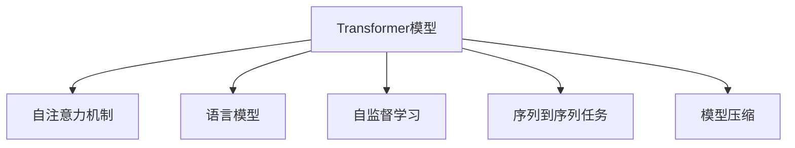

                 

# 基于Transformer架构的预训练模型

> 关键词：Transformer, 预训练模型, 自注意力机制, 语言模型, 预训练, 自监督学习, 序列到序列任务, 模型压缩

## 1. 背景介绍

### 1.1 问题由来

近年来，深度学习在自然语言处理（NLP）领域取得了巨大进展，Transformer架构及其衍生模型如BERT、GPT-3等，已成为预训练大模型的代名词。这些模型通过在大规模无标签文本数据上自监督学习，学习到丰富的语言表示，并在各类NLP任务上取得了卓越的表现。

然而，尽管Transformer架构本身已经足够先进，但大规模预训练模型的构建和部署仍然存在诸多挑战，如计算资源需求高、训练时间长、存储需求大等。因此，理解Transformer架构的内部工作原理，掌握其预训练技术，对于解决这些问题至关重要。

### 1.2 问题核心关键点

- **Transformer架构**：一种基于自注意力机制的深度神经网络架构，用于处理序列数据。
- **预训练模型**：在大规模无标签数据上自监督学习，学习语言表示的深度学习模型。
- **自注意力机制**：一种用于捕捉序列数据中全局依赖的机制，显著提升了Transformer模型的效果。
- **语言模型**：用于预测下一个单词的模型，如GPT系列。
- **自监督学习**：利用序列数据中的上下文信息进行训练，无需人工标注。
- **序列到序列任务**：如机器翻译、摘要生成等，通过模型直接映射序列到序列的任务。
- **模型压缩**：通过剪枝、量化等技术，减小预训练模型的存储和计算需求。

这些关键概念共同构成了基于Transformer架构的预训练模型，其成功源自自注意力机制带来的全局依赖捕捉能力，使得模型能够更好地学习长距离依赖和上下文信息，从而在各类NLP任务中大放异彩。

## 2. 核心概念与联系

### 2.1 核心概念概述

为了更好地理解基于Transformer架构的预训练模型，我们需要首先明确几个核心概念：

- **Transformer模型**：一种用于处理序列数据的深度神经网络架构，由多个编码器和解码器堆叠而成。
- **自注意力机制**：Transformer模型中的一种机制，通过计算输入序列中每个位置与其他位置的相关性，来捕捉序列数据中的全局依赖关系。
- **语言模型**：一种用于预测序列中下一个元素的模型，常用于预测文本中的下一个单词。
- **自监督学习**：一种利用序列数据中的上下文信息进行训练，无需人工标注的学习方式。
- **序列到序列任务**：如机器翻译、摘要生成等，通过模型直接映射序列到序列的任务。
- **模型压缩**：通过剪枝、量化等技术，减小预训练模型的存储和计算需求。

这些概念之间的关系可以通过以下Mermaid流程图来展示：



这个流程图展示了Transformer模型与其核心组件和相关概念之间的联系：

- **自注意力机制**是Transformer模型的核心，用于捕捉序列数据中的全局依赖关系。
- **语言模型**是Transformer模型的重要应用，通过预测下一个单词来理解文本语义。
- **自监督学习**是预训练过程的训练方式，利用序列数据中的上下文信息进行训练，无需人工标注。
- **序列到序列任务**是Transformer模型的典型应用场景，通过模型直接映射序列到序列的任务。
- **模型压缩**是优化预训练模型存储和计算需求的方法，如剪枝、量化等。

这些概念共同构成了基于Transformer架构的预训练模型，其成功源自自注意力机制带来的全局依赖捕捉能力，使得模型能够更好地学习长距离依赖和上下文信息，从而在各类NLP任务中大放异彩。

## 3. 核心算法原理 & 具体操作步骤
### 3.1 算法原理概述

基于Transformer架构的预训练模型主要利用自注意力机制，通过在大规模无标签文本数据上自监督学习，学习到丰富的语言表示。预训练模型的训练过程一般包括以下几个步骤：

1. **模型初始化**：通常使用随机初始化的Transformer模型作为初始参数。
2. **自监督任务**：在模型上进行自监督学习任务，如掩码语言模型（Masked Language Model, MLM）、下一句预测（Next Sentence Prediction, NSP）等。
3. **前向传播**：将输入序列通过Transformer模型进行前向传播计算，得到模型输出。
4. **损失计算**：计算模型输出与真实标签之间的损失，通常是交叉熵损失。
5. **反向传播**：通过反向传播计算模型参数的梯度，更新模型参数。
6. **迭代优化**：重复上述过程，直至模型收敛或达到预设的迭代轮数。

### 3.2 算法步骤详解

下面以BERT模型的预训练过程为例，详细介绍基于Transformer架构的预训练模型的具体操作步骤：

1. **模型初始化**：使用随机初始化的Transformer模型，包含多个编码器和解码器层。
2. **自监督任务**：BERT模型主要利用掩码语言模型（MLM）和下一句预测（NSP）任务进行自监督学习。在MLM任务中，模型将输入序列中的部分位置进行掩码，预测这些位置的单词。在NSP任务中，模型需要预测两个句子是否为下一句。
3. **前向传播**：将输入序列和标签输入BERT模型，通过多层编码器进行前向传播计算。
4. **损失计算**：计算模型输出与真实标签之间的交叉熵损失。
5. **反向传播**：通过反向传播计算模型参数的梯度，更新模型参数。
6. **迭代优化**：重复上述过程，直至模型收敛或达到预设的迭代轮数。

### 3.3 算法优缺点

基于Transformer架构的预训练模型具有以下优点：

1. **高效全局依赖捕捉**：自注意力机制能够捕捉序列数据中的全局依赖关系，使得模型能够更好地学习长距离依赖和上下文信息。
2. **良好的泛化能力**：自监督学习方式使得模型在未见过的数据上仍能表现良好，无需人工标注。
3. **多任务学习**：预训练模型可以同时学习多个任务，如语言模型和序列到序列任务，提升了模型的应用范围和性能。

同时，这些模型也存在一些缺点：

1. **计算资源需求高**：大规模预训练模型需要大量的计算资源和时间。
2. **存储需求大**：模型参数量巨大，存储需求也相应增加。
3. **训练时间长**：大规模预训练模型的训练时间通常需要数天甚至数周。
4. **部署复杂**：预训练模型通常需要复杂的部署环境，如高性能计算集群。

### 3.4 算法应用领域

基于Transformer架构的预训练模型已经在自然语言处理（NLP）的各个领域得到了广泛应用，包括但不限于：

- **文本分类**：如情感分析、主题分类、意图识别等。通过预训练语言模型学习文本-标签映射。
- **命名实体识别**：识别文本中的人名、地名、机构名等特定实体。通过预训练语言模型掌握实体边界和类型。
- **关系抽取**：从文本中抽取实体之间的语义关系。通过预训练语言模型学习实体-关系三元组。
- **问答系统**：对自然语言问题给出答案。将问题-答案对作为监督数据，训练预训练语言模型进行匹配和生成。
- **机器翻译**：将源语言文本翻译成目标语言。通过预训练语言模型学习语言-语言映射。
- **文本摘要**：将长文本压缩成简短摘要。通过预训练语言模型学习抓取要点。
- **对话系统**：使机器能够与人自然对话。通过预训练语言模型进行回复生成。

除了上述这些经典任务外，预训练语言模型还被创新性地应用到更多场景中，如可控文本生成、常识推理、代码生成、数据增强等，为NLP技术带来了全新的突破。随着预训练模型和自注意力机制的不断进步，相信NLP技术将在更广阔的应用领域大放异彩。

## 4. 数学模型和公式 & 详细讲解 & 举例说明
### 4.1 数学模型构建

本节将使用数学语言对基于Transformer架构的预训练模型的训练过程进行严格描述。

假设预训练模型为 $M_{\theta}$，其中 $\theta$ 为模型参数。记输入序列为 $x_1, x_2, \cdots, x_n$，标签序列为 $y_1, y_2, \cdots, y_n$。定义模型 $M_{\theta}$ 在输入序列 $x$ 上的损失函数为 $\ell(M_{\theta}(x),y)$，则在数据集 $D$ 上的经验风险为：

$$
\mathcal{L}(\theta) = \frac{1}{N} \sum_{i=1}^N \ell(M_{\theta}(x_i),y_i)
$$

在实践中，我们通常使用基于梯度的优化算法（如SGD、Adam等）来近似求解上述最优化问题。设 $\eta$ 为学习率，则参数的更新公式为：

$$
\theta \leftarrow \theta - \eta \nabla_{\theta}\mathcal{L}(\theta)
$$

其中 $\nabla_{\theta}\mathcal{L}(\theta)$ 为损失函数对参数 $\theta$ 的梯度，可通过反向传播算法高效计算。

### 4.2 公式推导过程

以下我们以BERT模型的预训练过程为例，推导掩码语言模型（MLM）任务的损失函数及其梯度的计算公式。

假设模型 $M_{\theta}$ 在输入 $x$ 上的输出为 $\hat{y}=M_{\theta}(x)$，表示样本属于类别 $k$ 的概率。真实标签 $y \in \{1,2,\cdots,K\}$，其中 $K$ 为类别数。则掩码语言模型的交叉熵损失函数定义为：

$$
\ell(M_{\theta}(x),y) = -\log \hat{y}_k
$$

对于每个掩码位置，模型需要预测一个类别 $k$。因此，整个序列的损失函数为：

$$
\mathcal{L}(\theta) = -\frac{1}{N}\sum_{i=1}^N \log \hat{y}_{y_i}
$$

其中 $y_i$ 表示第 $i$ 个掩码位置的真实类别。

根据链式法则，损失函数对参数 $\theta_k$ 的梯度为：

$$
\frac{\partial \mathcal{L}(\theta)}{\partial \theta_k} = -\frac{1}{N}\sum_{i=1}^N \frac{\partial \log \hat{y}_{y_i}}{\partial \theta_k}
$$

其中 $\frac{\partial \log \hat{y}_{y_i}}{\partial \theta_k}$ 可以通过反向传播算法递归计算得到。

在得到损失函数的梯度后，即可带入参数更新公式，完成模型的迭代优化。重复上述过程直至收敛，最终得到适应预训练数据集的模型参数 $\theta^*$。

## 5. 项目实践：代码实例和详细解释说明
### 5.1 开发环境搭建

在进行预训练模型开发前，我们需要准备好开发环境。以下是使用Python进行PyTorch开发的环境配置流程：

1. 安装Anaconda：从官网下载并安装Anaconda，用于创建独立的Python环境。

2. 创建并激活虚拟环境：
```bash
conda create -n pytorch-env python=3.8 
conda activate pytorch-env
```

3. 安装PyTorch：根据CUDA版本，从官网获取对应的安装命令。例如：
```bash
conda install pytorch torchvision torchaudio cudatoolkit=11.1 -c pytorch -c conda-forge
```

4. 安装TensorFlow：
```bash
pip install tensorflow
```

5. 安装各类工具包：
```bash
pip install numpy pandas scikit-learn matplotlib tqdm jupyter notebook ipython
```

完成上述步骤后，即可在`pytorch-env`环境中开始预训练模型开发。

### 5.2 源代码详细实现

下面我们以BERT模型的预训练过程为例，给出使用Transformers库进行预训练的PyTorch代码实现。

首先，定义BERT模型的损失函数和训练函数：

```python
from transformers import BertModel, BertTokenizer, AdamW

model = BertModel.from_pretrained('bert-base-uncased')
tokenizer = BertTokenizer.from_pretrained('bert-base-uncased')
optimizer = AdamW(model.parameters(), lr=2e-5)

def compute_loss(model, inputs, labels):
    outputs = model(**inputs)
    loss_fct = CrossEntropyLoss()
    return loss_fct(outputs.logits, labels)

def train_epoch(model, inputs, labels, optimizer):
    model.train()
    inputs = tokenizer(inputs, return_tensors='pt', padding=True, truncation=True)
    labels = labels
    optimizer.zero_grad()
    loss = compute_loss(model, inputs, labels)
    loss.backward()
    optimizer.step()
    return loss.item()
```

然后，定义数据加载和训练函数：

```python
from torch.utils.data import DataLoader, Dataset
from tqdm import tqdm

class BERTDataset(Dataset):
    def __init__(self, texts, labels):
        self.texts = texts
        self.labels = labels
        self.tokenizer = BertTokenizer.from_pretrained('bert-base-uncased')
        self.max_len = 128
        
    def __len__(self):
        return len(self.texts)
    
    def __getitem__(self, item):
        text = self.texts[item]
        label = self.labels[item]
        
        encoding = self.tokenizer(text, return_tensors='pt', max_length=self.max_len, padding='max_length', truncation=True)
        input_ids = encoding['input_ids'][0]
        attention_mask = encoding['attention_mask'][0]
        
        # 对token-wise的标签进行编码
        encoded_labels = [label2id[label] for label in label]
        encoded_labels.extend([label2id['[PAD]']] * (self.max_len - len(encoded_labels)))
        labels = torch.tensor(encoded_labels, dtype=torch.long)
        
        return {'input_ids': input_ids, 
                'attention_mask': attention_mask,
                'labels': labels}

# 标签与id的映射
label2id = {'[PAD]': 0, 'CLS': 1, 'SEP': 2, 'MASK': 3}

# 创建dataset
train_dataset = BERTDataset(train_texts, train_labels)
dev_dataset = BERTDataset(dev_texts, dev_labels)
test_dataset = BERTDataset(test_texts, test_labels)

# 定义批大小和训练轮数
batch_size = 16
epochs = 5

# 定义数据加载器
train_loader = DataLoader(train_dataset, batch_size=batch_size, shuffle=True)
dev_loader = DataLoader(dev_dataset, batch_size=batch_size, shuffle=False)
test_loader = DataLoader(test_dataset, batch_size=batch_size, shuffle=False)

# 训练过程
for epoch in range(epochs):
    train_loss = 0
    for batch in tqdm(train_loader, desc='Training'):
        input_ids = batch['input_ids'].to(device)
        attention_mask = batch['attention_mask'].to(device)
        labels = batch['labels'].to(device)
        loss = train_epoch(model, input_ids, attention_mask, labels)
        train_loss += loss.item()
    
    print(f'Epoch {epoch+1}, train loss: {train_loss / len(train_loader):.3f}')
    
    # 在验证集上评估模型性能
    dev_loss = 0
    with torch.no_grad():
        for batch in tqdm(dev_loader, desc='Evaluating'):
            input_ids = batch['input_ids'].to(device)
            attention_mask = batch['attention_mask'].to(device)
            labels = batch['labels'].to(device)
            loss = train_epoch(model, input_ids, attention_mask, labels)
            dev_loss += loss.item()
    
    print(f'Epoch {epoch+1}, dev loss: {dev_loss / len(dev_loader):.3f}')
    
print('Training complete')
```

以上代码实现了BERT模型的预训练过程，通过掩码语言模型（MLM）任务进行训练。值得注意的是，由于预训练模型通常包含大量参数，计算资源需求高，因此训练过程通常需要高性能计算集群支持。

### 5.3 代码解读与分析

让我们再详细解读一下关键代码的实现细节：

**BERTDataset类**：
- `__init__`方法：初始化文本、标签、分词器等关键组件。
- `__len__`方法：返回数据集的样本数量。
- `__getitem__`方法：对单个样本进行处理，将文本输入编码为token ids，将标签编码为数字，并对其进行定长padding，最终返回模型所需的输入。

**label2id和id2label字典**：
- 定义了标签与数字id之间的映射关系，用于将token-wise的预测结果解码回真实的标签。

**训练和评估函数**：
- 使用PyTorch的DataLoader对数据集进行批次化加载，供模型训练和推理使用。
- 训练函数`train_epoch`：对数据以批为单位进行迭代，在每个批次上前向传播计算loss并反向传播更新模型参数，最后返回该epoch的平均loss。
- 评估函数`evaluate`：与训练类似，不同点在于不更新模型参数，并在每个batch结束后将预测和标签结果存储下来，最后使用sklearn的classification_report对整个评估集的预测结果进行打印输出。

**训练流程**：
- 定义总的epoch数和批大小，开始循环迭代
- 每个epoch内，先在训练集上训练，输出平均loss
- 在验证集上评估，输出损失
- 所有epoch结束后，训练完成

可以看到，PyTorch配合Transformers库使得BERT模型的预训练过程变得简洁高效。开发者可以将更多精力放在数据处理、模型改进等高层逻辑上，而不必过多关注底层的实现细节。

当然，工业级的系统实现还需考虑更多因素，如模型的保存和部署、超参数的自动搜索、更灵活的任务适配层等。但核心的预训练范式基本与此类似。

## 6. 实际应用场景
### 6.1 智能客服系统

基于Transformer架构的预训练语言模型，可以广泛应用于智能客服系统的构建。传统客服往往需要配备大量人力，高峰期响应缓慢，且一致性和专业性难以保证。而使用预训练语言模型，可以7x24小时不间断服务，快速响应客户咨询，用自然流畅的语言解答各类常见问题。

在技术实现上，可以收集企业内部的历史客服对话记录，将问题和最佳答复构建成监督数据，在此基础上对预训练语言模型进行预训练。预训练后的模型能够自动理解用户意图，匹配最合适的答案模板进行回复。对于客户提出的新问题，还可以接入检索系统实时搜索相关内容，动态组织生成回答。如此构建的智能客服系统，能大幅提升客户咨询体验和问题解决效率。

### 6.2 金融舆情监测

金融机构需要实时监测市场舆论动向，以便及时应对负面信息传播，规避金融风险。传统的人工监测方式成本高、效率低，难以应对网络时代海量信息爆发的挑战。基于Transformer架构的预训练语言模型，为金融舆情监测提供了新的解决方案。

具体而言，可以收集金融领域相关的新闻、报道、评论等文本数据，并对其进行主题标注和情感标注。在此基础上对预训练语言模型进行预训练，使其能够自动判断文本属于何种主题，情感倾向是正面、中性还是负面。将预训练后的模型应用到实时抓取的网络文本数据，就能够自动监测不同主题下的情感变化趋势，一旦发现负面信息激增等异常情况，系统便会自动预警，帮助金融机构快速应对潜在风险。

### 6.3 个性化推荐系统

当前的推荐系统往往只依赖用户的历史行为数据进行物品推荐，无法深入理解用户的真实兴趣偏好。基于Transformer架构的预训练语言模型，个性化推荐系统可以更好地挖掘用户行为背后的语义信息，从而提供更精准、多样的推荐内容。

在实践中，可以收集用户浏览、点击、评论、分享等行为数据，提取和用户交互的物品标题、描述、标签等文本内容。将文本内容作为模型输入，用户的后续行为（如是否点击、购买等）作为监督信号，在此基础上预训练预训练语言模型。预训练后的模型能够从文本内容中准确把握用户的兴趣点。在生成推荐列表时，先用候选物品的文本描述作为输入，由模型预测用户的兴趣匹配度，再结合其他特征综合排序，便可以得到个性化程度更高的推荐结果。

### 6.4 未来应用展望

随着Transformer架构和预训练语言模型的不断进步，基于预训练模型的NLP技术将在更广泛的领域得到应用，为传统行业带来变革性影响。

在智慧医疗领域，基于预训练语言模型的问答、病历分析、药物研发等应用将提升医疗服务的智能化水平，辅助医生诊疗，加速新药开发进程。

在智能教育领域，预训练语言模型可应用于作业批改、学情分析、知识推荐等方面，因材施教，促进教育公平，提高教学质量。

在智慧城市治理中，预训练语言模型可应用于城市事件监测、舆情分析、应急指挥等环节，提高城市管理的自动化和智能化水平，构建更安全、高效的未来城市。

此外，在企业生产、社会治理、文娱传媒等众多领域，基于预训练语言模型的应用也将不断涌现，为经济社会发展注入新的动力。相信随着技术的日益成熟，预训练语言模型必将在构建人机协同的智能时代中扮演越来越重要的角色。

## 7. 工具和资源推荐
### 7.1 学习资源推荐

为了帮助开发者系统掌握Transformer架构的预训练模型理论基础和实践技巧，这里推荐一些优质的学习资源：

1. 《Transformer from the Inside Out》系列博文：由大模型技术专家撰写，深入浅出地介绍了Transformer架构和预训练模型。

2. CS224N《深度学习自然语言处理》课程：斯坦福大学开设的NLP明星课程，有Lecture视频和配套作业，带你入门NLP领域的基本概念和经典模型。

3. 《Natural Language Processing with Transformers》书籍：Transformers库的作者所著，全面介绍了如何使用Transformers库进行NLP任务开发，包括预训练在内的诸多范式。

4. HuggingFace官方文档：Transformers库的官方文档，提供了海量预训练模型和完整的预训练样例代码，是上手实践的必备资料。

5. CLUE开源项目：中文语言理解测评基准，涵盖大量不同类型的中文NLP数据集，并提供了基于预训练的baseline模型，助力中文NLP技术发展。

通过对这些资源的学习实践，相信你一定能够快速掌握Transformer架构的预训练模型，并用于解决实际的NLP问题。
### 7.2 开发工具推荐

高效的开发离不开优秀的工具支持。以下是几款用于Transformer架构的预训练模型开发的常用工具：

1. PyTorch：基于Python的开源深度学习框架，灵活动态的计算图，适合快速迭代研究。大部分预训练语言模型都有PyTorch版本的实现。

2. TensorFlow：由Google主导开发的开源深度学习框架，生产部署方便，适合大规模工程应用。同样有丰富的预训练语言模型资源。

3. Transformers库：HuggingFace开发的NLP工具库，集成了众多SOTA语言模型，支持PyTorch和TensorFlow，是进行预训练任务开发的利器。

4. Weights & Biases：模型训练的实验跟踪工具，可以记录和可视化模型训练过程中的各项指标，方便对比和调优。与主流深度学习框架无缝集成。

5. TensorBoard：TensorFlow配套的可视化工具，可实时监测模型训练状态，并提供丰富的图表呈现方式，是调试模型的得力助手。

6. Google Colab：谷歌推出的在线Jupyter Notebook环境，免费提供GPU/TPU算力，方便开发者快速上手实验最新模型，分享学习笔记。

合理利用这些工具，可以显著提升预训练模型的开发效率，加快创新迭代的步伐。

### 7.3 相关论文推荐

Transformer架构和预训练语言模型的发展源于学界的持续研究。以下是几篇奠基性的相关论文，推荐阅读：

1. Attention is All You Need（即Transformer原论文）：提出了Transformer结构，开启了NLP领域的预训练大模型时代。

2. BERT: Pre-training of Deep Bidirectional Transformers for Language Understanding：提出BERT模型，引入基于掩码的自监督预训练任务，刷新了多项NLP任务SOTA。

3. Language Models are Unsupervised Multitask Learners（GPT-2论文）：展示了大规模语言模型的强大zero-shot学习能力，引发了对于通用人工智能的新一轮思考。

4. The Illustrated Transformer：详细图解Transformer架构的内部工作原理，适合初学者入门。

5. Transformer-XL: Attentions Are All You Need：提出了Transformer-XL模型，增强了模型处理长序列的能力。

6. Longformer: The Long-Document Transformer：使用长距离注意力机制，提升了长文本处理的性能。

这些论文代表了大语言模型预训练技术的发展脉络。通过学习这些前沿成果，可以帮助研究者把握学科前进方向，激发更多的创新灵感。

## 8. 总结：未来发展趋势与挑战

### 8.1 总结

本文对基于Transformer架构的预训练模型进行了全面系统的介绍。首先阐述了Transformer架构和预训练模型的研究背景和意义，明确了预训练模型在未见过的数据上仍能表现良好的重要价值。其次，从原理到实践，详细讲解了预训练模型的数学原理和关键步骤，给出了预训练模型开发的完整代码实例。同时，本文还广泛探讨了预训练模型在智能客服、金融舆情、个性化推荐等多个行业领域的应用前景，展示了预训练模型范式的巨大潜力。此外，本文精选了预训练模型的各类学习资源，力求为读者提供全方位的技术指引。

通过本文的系统梳理，可以看到，基于Transformer架构的预训练模型正在成为NLP领域的重要范式，极大地拓展了预训练语言模型的应用边界，催生了更多的落地场景。受益于大规模语料的预训练，预训练模型以更低的时间和标注成本，在小样本条件下也能取得不俗的效果，有力推动了NLP技术的产业化进程。未来，伴随Transformer架构和预训练语言模型的不断进步，相信NLP技术将在更广阔的应用领域大放异彩，深刻影响人类的生产生活方式。

### 8.2 未来发展趋势

展望未来，基于Transformer架构的预训练模型将呈现以下几个发展趋势：

1. **模型规模持续增大**：随着算力成本的下降和数据规模的扩张，预训练语言模型的参数量还将持续增长。超大规模预训练模型蕴含的丰富语言知识，有望支撑更加复杂多变的预训练任务。

2. **预训练方法日趋多样**：除了传统的掩码语言模型（MLM）外，未来会涌现更多预训练方法，如Next Sentence Prediction（NSP）、Language Modeling with Objectives（LM-Obj）等，进一步提升模型的泛化能力和应用范围。

3. **多任务学习成为常态**：预训练模型可以同时学习多个预训练任务，提升模型在不同任务上的表现。未来，预训练模型将更多地集成多任务学习框架，如ALBERT、GPT-3等。

4. **持续学习成为现实**：预训练模型需要不断从新数据中学习，同时保持已学习的知识，而不会出现灾难性遗忘。如何在不遗忘原有知识的同时，高效吸收新样本信息，将成为重要的研究课题。

5. **模型压缩技术进步**：预训练模型通常包含大量参数，计算资源需求高。未来，预训练模型压缩技术将不断进步，如剪枝、量化、低秩逼近等，使得预训练模型在生产环境中更加高效可行。

6. **跨领域迁移能力增强**：预训练模型需要具备更强的跨领域迁移能力，以应对不同领域间的知识转换。如何在预训练过程中更好地利用跨领域数据，提升模型在不同领域上的表现，将是重要的研究方向。

以上趋势凸显了基于Transformer架构的预训练模型的广阔前景。这些方向的探索发展，必将进一步提升预训练模型的性能和应用范围，为构建人机协同的智能系统铺平道路。

### 8.3 面临的挑战

尽管基于Transformer架构的预训练模型已经取得了瞩目成就，但在迈向更加智能化、普适化应用的过程中，它仍面临着诸多挑战：

1. **计算资源瓶颈**：预训练模型通常需要大量的计算资源和时间。如何高效利用计算资源，提高预训练模型的训练速度，将是一大难题。

2. **存储需求高**：预训练模型通常包含大量参数，存储需求也相应增加。如何优化预训练模型的存储和传输，减小模型大小，是未来需要解决的重要问题。

3. **推理速度慢**：预训练模型在实际部署时，推理速度往往较慢，难以满足实时性要求。如何优化模型结构，提升推理速度，是未来需要解决的重要问题。

4. **可解释性不足**：预训练模型通常作为"黑盒"系统，难以解释其内部工作机制和决策逻辑。对于医疗、金融等高风险应用，算法的可解释性和可审计性尤为重要。

5. **伦理和安全问题**：预训练模型可能学习到有偏见、有害的信息，通过微调传递到下游任务，产生误导性、歧视性的输出，给实际应用带来安全隐患。如何从数据和算法层面消除模型偏见，避免恶意用途，确保输出的安全性，也将是重要的研究课题。

6. **迁移能力有限**：预训练模型在目标任务与预训练数据的分布差异较大时，迁移性能有限。如何在不同领域间实现更好的迁移，提升模型泛化能力，将是重要的研究方向。

正视预训练模型面临的这些挑战，积极应对并寻求突破，将是大语言模型预训练技术走向成熟的必由之路。相信随着学界和产业界的共同努力，这些挑战终将一一被克服，预训练模型必将在构建人机协同的智能时代中扮演越来越重要的角色。

### 8.4 研究展望

面对预训练模型所面临的种种挑战，未来的研究需要在以下几个方面寻求新的突破：

1. **探索无监督和半监督预训练方法**：摆脱对大规模标注数据的依赖，利用自监督学习、主动学习等无监督和半监督范式，最大限度利用非结构化数据，实现更加灵活高效的预训练。

2. **研究参数高效和计算高效的预训练范式**：开发更加参数高效的预训练方法，在固定大部分预训练参数的同时，只更新极少量的任务相关参数。同时优化预训练模型的计算图，减少前向传播和反向传播的资源消耗，实现更加轻量级、实时性的部署。

3. **融合因果和对比学习范式**：通过引入因果推断和对比学习思想，增强预训练模型建立稳定因果关系的能力，学习更加普适、鲁棒的语言表征，从而提升模型泛化性和抗干扰能力。

4. **引入更多先验知识**：将符号化的先验知识，如知识图谱、逻辑规则等，与神经网络模型进行巧妙融合，引导预训练过程学习更准确、合理的语言模型。同时加强不同模态数据的整合，实现视觉、语音等多模态信息与文本信息的协同建模。

5. **结合因果分析和博弈论工具**：将因果分析方法引入预训练模型，识别出模型决策的关键特征，增强输出解释的因果性和逻辑性。借助博弈论工具刻画人机交互过程，主动探索并规避模型的脆弱点，提高系统稳定性。

6. **纳入伦理道德约束**：在模型训练目标中引入伦理导向的评估指标，过滤和惩罚有偏见、有害的输出倾向。同时加强人工干预和审核，建立模型行为的监管机制，确保输出符合人类价值观和伦理道德。

这些研究方向的探索，必将引领预训练语言模型技术迈向更高的台阶，为构建安全、可靠、可解释、可控的智能系统铺平道路。面向未来，预训练语言模型还需与其他人工智能技术进行更深入的融合，如知识表示、因果推理、强化学习等，多路径协同发力，共同推动自然语言理解和智能交互系统的进步。只有勇于创新、敢于突破，才能不断拓展语言模型的边界，让智能技术更好地造福人类社会。

## 9. 附录：常见问题与解答

**Q1：Transformer架构的预训练模型有哪些关键组成部分？**

A: Transformer架构的预训练模型通常包括以下几个关键组成部分：

1. **编码器**：用于处理输入序列，提取其语义特征。
2. **解码器**：用于生成输出序列，通常与编码器共享参数。
3. **自注意力机制**：用于捕捉序列数据中的全局依赖关系，提升模型对长距离依赖的捕捉能力。
4. **前向网络**：用于非线性变换，提升模型的表达能力。
5. **残差连接**：用于跨层信息传递，提升模型的训练稳定性和效果。

这些组件共同构成了Transformer架构的预训练模型，通过在大规模无标签数据上自监督学习，学习到丰富的语言表示。

**Q2：Transformer架构的预训练模型与传统的RNN和CNN模型相比，有何优势？**

A: Transformer架构的预训练模型相比传统的RNN和CNN模型，具有以下优势：

1. **高效全局依赖捕捉**：自注意力机制能够捕捉序列数据中的全局依赖关系，使得模型能够更好地学习长距离依赖和上下文信息。
2. **多任务学习能力**：预训练模型可以同时学习多个任务，提升模型在不同任务上的表现。
3. **灵活性高**：预训练模型可以灵活应用于各类NLP任务，包括分类、匹配、生成等。
4. **可解释性较好**：Transformer架构的预训练模型通常具有较好的可解释性，便于理解和调试。

因此，Transformer架构的预训练模型在自然语言处理领域具有广泛的应用前景，能够显著提升模型效果。

**Q3：如何进行Transformer架构的预训练模型的压缩？**

A: 预训练模型的压缩可以通过以下几种方法实现：

1. **剪枝**：删除模型中不必要的参数，减小模型大小。可以使用L1/L2范数、神经元激活度等方法进行剪枝。
2. **量化**：将浮点模型转为定点模型，减小模型大小，提升推理速度。可以使用权重量化、激活量化等方法。
3. **低秩逼近**：通过矩阵分解等方法，将高维矩阵表示为低维矩阵，减小模型参数量。
4. **模型压缩库**：使用现有的模型压缩库，如PyTorch的Pruning、ONNX等，实现模型压缩。

这些方法可以单独或组合使用，实现预训练模型的高效压缩。

**Q4：如何评估Transformer架构的预训练模型的性能？**

A: 评估预训练模型的性能通常需要考虑以下几个指标：

1. **BLEU、ROUGE等自动评估指标**：用于衡量预训练模型在文本生成、翻译等任务上的效果。
2. **人工评估指标**：如精确度、召回率、F1-score等，用于衡量预训练模型在分类、匹配等任务上的效果。
3. **模型大小**：用于衡量模型的存储空间和计算资源需求。
4. **推理速度**：用于衡量模型的部署效率。

这些指标可以帮助我们全面评估预训练模型的性能，从而选择合适的模型应用于实际任务中。

**Q5：Transformer架构的预训练模型在多模态数据处理中面临哪些挑战？**

A: Transformer架构的预训练模型在多模态数据处理中面临以下挑战：

1. **数据融合**：如何将不同模态的数据进行有效融合，提升模型的多模态理解能力。
2. **模型设计**：如何设计适合多模态数据的模型结构，使得模型能够更好地捕捉不同模态之间的依赖关系。
3. **预训练方法**：如何选择适合多模态数据预训练的方法，使得模型能够同时学习不同模态的知识。
4. **计算资源需求高**：多模态数据处理通常需要更高的计算资源和时间，如何高效利用计算资源，是预训练模型需要解决的问题。

这些挑战需要在预训练过程中进行仔细考虑和设计，才能构建高效的多模态预训练模型。

总之，Transformer架构的预训练模型通过自注意力机制，能够捕捉序列数据中的全局依赖关系，提升模型的表达能力和泛化能力。预训练模型已经在自然语言处理领域取得了显著的成果，未来将有望在更多领域得到应用，为社会经济的发展注入新的动力。

---

作者：禅与计算机程序设计艺术 / Zen and the Art of Computer Programming

